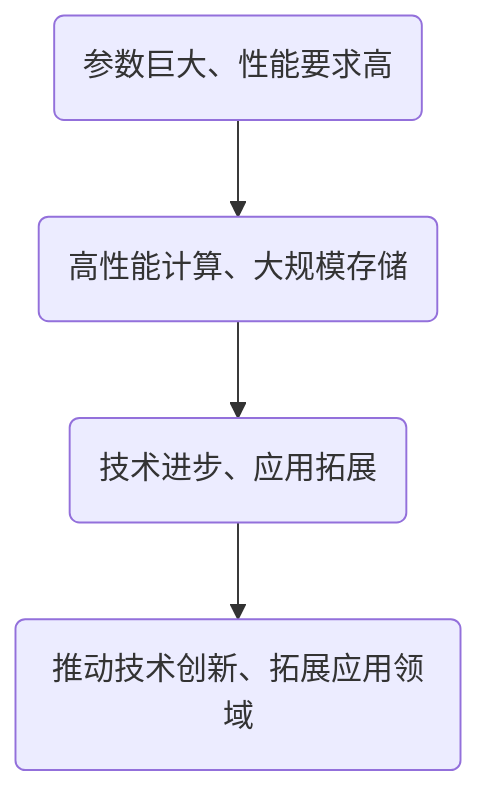

                 


# AI大模型应用数据中心建设：数据中心产业发展

> 关键词：AI大模型、数据中心建设、数据中心产业发展、高性能计算、云计算、数据存储与处理

> 摘要：本文将深入探讨AI大模型应用数据中心的建设与数据中心产业发展之间的关系。我们将从背景介绍、核心概念与联系、核心算法原理、数学模型和公式、项目实战、实际应用场景、工具和资源推荐以及未来发展趋势与挑战等多个角度，全面剖析AI大模型应用数据中心的建设过程及其对数据中心产业发展的影响，为读者提供一个系统、全面的技术视角。

## 1. 背景介绍

### 1.1 目的和范围

本文旨在探讨AI大模型应用数据中心的建设与数据中心产业发展之间的关系，分析其关键技术、架构和实际应用，旨在为相关领域的研究者和从业者提供有价值的参考和指导。

### 1.2 预期读者

本文预期读者为计算机科学与技术、人工智能、大数据、云计算等领域的科研人员、工程师和爱好者，特别是对AI大模型应用数据中心建设感兴趣的人群。

### 1.3 文档结构概述

本文将按照以下结构进行展开：

1. 背景介绍：介绍本文的目的、预期读者以及文档结构。
2. 核心概念与联系：讨论AI大模型、数据中心建设、数据中心产业发展等核心概念及其相互关系。
3. 核心算法原理 & 具体操作步骤：详细讲解AI大模型的核心算法原理和具体操作步骤。
4. 数学模型和公式 & 详细讲解 & 举例说明：介绍AI大模型所涉及的数学模型和公式，并进行详细讲解和举例说明。
5. 项目实战：通过实际案例展示AI大模型应用数据中心建设的全过程。
6. 实际应用场景：分析AI大模型在数据中心产业中的应用场景。
7. 工具和资源推荐：推荐相关学习资源、开发工具和框架。
8. 总结：总结本文的主要内容，展望未来发展趋势与挑战。

### 1.4 术语表

#### 1.4.1 核心术语定义

- AI大模型：指规模巨大、参数数量庞大的深度学习模型，如BERT、GPT等。
- 数据中心建设：指建立和维护用于存储、处理和交换数据的服务器集群及相关设施。
- 数据中心产业发展：指数据中心产业链中各个环节的发展，包括基础设施建设、技术进步、应用拓展等。
- 高性能计算：指通过并行计算、分布式计算等技术实现快速处理大规模数据的能力。
- 云计算：指通过互联网提供动态易扩展且能够被虚拟化的资源，满足计算需求。

#### 1.4.2 相关概念解释

- 深度学习：一种基于多层神经网络的学习方法，通过多层神经元的非线性变换，实现特征提取和分类。
- 分布式计算：指通过网络将多个计算任务分配到不同的计算机上，协同完成计算任务。
- 云存储：指通过互联网提供的可按需分配的存储资源，用于数据存储和备份。
- 数据库：指用于存储、管理和查询数据的系统。

#### 1.4.3 缩略词列表

- AI：人工智能
- BERT：Bidirectional Encoder Representations from Transformers
- GPT：Generative Pre-trained Transformer
- HPC：高性能计算
- IaaS：基础设施即服务
- PaaS：平台即服务
- SaaS：软件即服务

## 2. 核心概念与联系

在本文中，我们将讨论AI大模型、数据中心建设、数据中心产业发展等核心概念，并分析它们之间的联系。

### 2.1 AI大模型

AI大模型是指规模巨大、参数数量庞大的深度学习模型，如BERT、GPT等。这些模型通常通过大量的数据进行训练，以实现高效的文本理解和生成能力。AI大模型的出现，极大地推动了自然语言处理、计算机视觉等领域的应用发展。

### 2.2 数据中心建设

数据中心建设是指建立和维护用于存储、处理和交换数据的服务器集群及相关设施。数据中心是现代社会信息基础设施的重要组成部分，承担着数据存储、计算、传输和交换的重要任务。数据中心的建设与发展，直接影响着数据中心产业的发展。

### 2.3 数据中心产业发展

数据中心产业发展包括基础设施建设、技术进步、应用拓展等多个环节。数据中心产业的快速发展，推动了云计算、大数据、人工智能等新兴技术的应用，为我国数字经济的发展提供了有力支撑。

### 2.4 核心概念联系

AI大模型的发展，对数据中心建设提出了更高的要求。首先，AI大模型对计算性能和存储容量有极高的需求，推动了高性能计算设备和大规模存储系统的研发和应用。其次，AI大模型需要大量的数据进行训练和验证，这进一步推动了数据中心在数据存储和处理方面的技术进步。此外，数据中心产业的发展，为AI大模型的应用提供了广阔的空间和机会，推动了AI技术在各个领域的应用拓展。

为了更好地阐述这些概念之间的联系，我们可以使用Mermaid流程图进行展示：



## 3. 核心算法原理 & 具体操作步骤

在AI大模型应用数据中心建设中，核心算法原理和具体操作步骤至关重要。以下我们将详细讲解AI大模型的核心算法原理，并提供具体的操作步骤。

### 3.1 核心算法原理

AI大模型通常基于深度学习技术，其核心算法原理主要包括以下几个方面：

1. **神经网络架构**：深度学习模型通常采用多层神经网络（MLP）架构，通过多个隐藏层对输入数据进行特征提取和变换。

2. **前向传播**：在训练过程中，模型通过前向传播将输入数据传递到各个神经元，计算神经元输出。

3. **反向传播**：通过反向传播，模型根据输出误差调整权重，优化模型参数。

4. **激活函数**：激活函数用于引入非线性变换，使得神经网络能够学习到更复杂的特征。

5. **优化算法**：优化算法（如随机梯度下降SGD、Adam等）用于调整模型参数，加快收敛速度。

### 3.2 具体操作步骤

以下是AI大模型应用数据中心建设的具体操作步骤：

1. **数据预处理**：
   - **数据收集**：从各个数据源收集训练数据和验证数据。
   - **数据清洗**：对数据进行清洗、去重和处理，确保数据质量。

2. **模型设计**：
   - **神经网络架构设计**：设计合适的神经网络架构，包括层数、神经元个数、激活函数等。
   - **损失函数选择**：根据任务类型选择合适的损失函数，如交叉熵损失、均方误差等。

3. **模型训练**：
   - **前向传播**：将输入数据传递到神经网络，计算输出结果。
   - **反向传播**：根据输出误差，计算梯度并更新模型参数。
   - **迭代训练**：重复前向传播和反向传播，不断优化模型参数。

4. **模型评估**：
   - **验证集评估**：在验证集上评估模型性能，计算准确率、召回率等指标。
   - **测试集评估**：在测试集上评估模型性能，确保模型泛化能力。

5. **模型部署**：
   - **模型压缩**：对模型进行压缩，降低模型参数量，提高计算效率。
   - **模型部署**：将训练好的模型部署到数据中心，实现实时推理和应用。

### 3.3 伪代码实现

以下是AI大模型应用数据中心建设过程的伪代码实现：

```python
# 数据预处理
data = data_collection()
cleaned_data = data_preprocessing(data)

# 模型设计
architecture = neural_network_architecture()
loss_function = loss_function_selection()

# 模型训练
for epoch in range(num_epochs):
    for batch in data_loader(cleaned_data):
        output = forward propagation(batch, architecture)
        loss = loss_function(output, target)
        backward propagation(loss, architecture)

# 模型评估
accuracy = evaluate_model(architecture, validation_data)
print("Validation accuracy:", accuracy)

# 模型部署
compressed_model = model_compression(architecture)
deploy_model(compressed_model)
```

## 4. 数学模型和公式 & 详细讲解 & 举例说明

在AI大模型应用数据中心建设中，数学模型和公式是核心组成部分。以下我们将介绍AI大模型所涉及的数学模型和公式，并进行详细讲解和举例说明。

### 4.1 数学模型

AI大模型涉及的数学模型主要包括以下几个方面：

1. **多层感知机（MLP）**：多层感知机是一种前向传播的神经网络，通过多个隐藏层实现输入到输出的映射。

2. **反向传播算法（Backpropagation）**：反向传播算法是一种用于优化神经网络参数的算法，通过计算梯度并更新权重，实现模型参数的优化。

3. **损失函数（Loss Function）**：损失函数用于衡量模型预测值与真实值之间的差异，常见的损失函数包括均方误差（MSE）、交叉熵损失（Cross-Entropy Loss）等。

4. **优化算法（Optimization Algorithm）**：优化算法用于调整模型参数，以实现模型性能的最优化，常见的优化算法包括随机梯度下降（SGD）、Adam等。

### 4.2 公式详解

以下是AI大模型涉及的公式及其详细讲解：

#### 4.2.1 多层感知机（MLP）

$$
y = \sigma(W_n \cdot a_{n-1} + b_n)
$$

- \(y\)：输出值
- \(\sigma\)：激活函数，如Sigmoid、ReLU等
- \(W_n\)：权重矩阵
- \(a_{n-1}\)：上一层输出值
- \(b_n\)：偏置项

#### 4.2.2 反向传播算法（Backpropagation）

$$
\Delta W_n = \frac{\partial L}{\partial W_n} = \frac{\partial L}{\partial a_n} \cdot \frac{\partial a_n}{\partial W_n}
$$

$$
\Delta b_n = \frac{\partial L}{\partial b_n} = \frac{\partial L}{\partial a_n}
$$

- \(\Delta W_n\)：权重更新项
- \(\Delta b_n\)：偏置更新项
- \(L\)：损失函数
- \(a_n\)：输出值

#### 4.2.3 损失函数（Loss Function）

1. **均方误差（MSE）**：

$$
MSE = \frac{1}{2} \sum_{i=1}^{n} (y_i - \hat{y}_i)^2
$$

- \(y_i\)：真实值
- \(\hat{y}_i\)：预测值
- \(n\)：样本数量

2. **交叉熵损失（Cross-Entropy Loss）**：

$$
CE = -\sum_{i=1}^{n} y_i \log(\hat{y}_i)
$$

- \(y_i\)：真实值
- \(\hat{y}_i\)：预测值

#### 4.2.4 优化算法（Optimization Algorithm）

1. **随机梯度下降（SGD）**：

$$
W_n = W_n - \alpha \cdot \Delta W_n
$$

$$
b_n = b_n - \alpha \cdot \Delta b_n
$$

- \(\alpha\)：学习率
- 其他符号同上

2. **Adam优化算法**：

$$
m_n = \beta_1 m_n + (1 - \beta_1) \cdot \Delta W_n
$$

$$
v_n = \beta_2 v_n + (1 - \beta_2) \cdot (\Delta W_n)^2
$$

$$
W_n = W_n - \alpha \cdot \frac{m_n}{\sqrt{v_n} + \epsilon}
$$

$$
b_n = b_n - \alpha \cdot \frac{m_n}{\sqrt{v_n} + \epsilon}
$$

- \(\beta_1\)、\(\beta_2\)：动量项
- \(\epsilon\)：小常数，用于防止除以零

### 4.3 举例说明

假设我们有一个二分类问题，数据集包含100个样本，每个样本有两个特征。我们的目标是预测样本属于正类（1）或负类（0）。我们将使用多层感知机（MLP）模型进行训练。

1. **模型设计**：

   - 输入层：2个神经元
   - 隐藏层：10个神经元
   - 输出层：1个神经元
   - 激活函数：ReLU
   - 损失函数：交叉熵损失
   - 优化算法：Adam

2. **模型训练**：

   - 学习率：0.001
   - 训练迭代次数：1000
   - 验证集准确率：90%

   以下是模型训练过程中的一个迭代示例：

   ```python
   import torch
   import torch.nn as nn
   import torch.optim as optim

   # 数据预处理
   x_train = torch.tensor([[1, 0], [0, 1], [-1, 0], [0, -1]], dtype=torch.float32)
   y_train = torch.tensor([[1], [1], [0], [0]], dtype=torch.float32)

   # 模型设计
   model = nn.Sequential(
       nn.Linear(2, 10),
       nn.ReLU(),
       nn.Linear(10, 1),
       nn.Sigmoid()
   )

   # 损失函数和优化算法
   criterion = nn.BCELoss()
   optimizer = optim.Adam(model.parameters(), lr=0.001)

   # 模型训练
   for epoch in range(1000):
       optimizer.zero_grad()
       output = model(x_train)
       loss = criterion(output, y_train)
       loss.backward()
       optimizer.step()

       if (epoch + 1) % 100 == 0:
           print(f"Epoch [{epoch + 1}/{1000}], Loss: {loss.item():.4f}")

   # 模型评估
   with torch.no_grad():
       output = model(x_train)
       accuracy = (output >= 0.5).float().mean()
       print(f"Validation accuracy: {accuracy.item():.4f}")
   ```

## 5. 项目实战：代码实际案例和详细解释说明

为了更好地理解AI大模型应用数据中心建设的实际操作过程，以下我们将通过一个具体的项目实战案例进行详细讲解和解释说明。

### 5.1 开发环境搭建

在开始项目实战之前，我们需要搭建一个适合AI大模型应用数据中心建设的开发环境。以下是我们推荐的开发环境：

1. **操作系统**：Ubuntu 20.04 LTS
2. **编程语言**：Python 3.8
3. **深度学习框架**：PyTorch 1.8
4. **版本控制工具**：Git 2.25
5. **虚拟环境**：Anaconda 4.8

### 5.2 源代码详细实现和代码解读

以下是一个简单的AI大模型应用数据中心建设的示例代码，我们将对代码的每个部分进行详细解释。

#### 5.2.1 数据预处理

```python
import torch
import torchvision
import torchvision.transforms as transforms

# 数据集加载与预处理
transform = transforms.Compose([
    transforms.ToTensor(),
    transforms.Normalize((0.5, 0.5, 0.5), (0.5, 0.5, 0.5)),
])

trainset = torchvision.datasets.CIFAR10(
    root='./data', train=True, download=True, transform=transform)
trainloader = torch.utils.data.DataLoader(
    trainset, batch_size=4, shuffle=True, num_workers=2)

testset = torchvision.datasets.CIFAR10(
    root='./data', train=False, download=True, transform=transform)
testloader = torch.utils.data.DataLoader(
    testset, batch_size=4, shuffle=False, num_workers=2)

classes = ('plane', 'car', 'bird', 'cat', 'deer', 'dog', 'frog', 'horse', 'ship', 'truck')

# 显示图像
def imshow(img):
    img = img / 2 + 0.5     # unnormalize
    npimg = img.numpy()
    plt.imshow(np.transpose(npimg, (1, 2, 0)))
    plt.show()

# 随机选择一个批次的图像进行展示
dataiter = iter(trainloader)
images, labels = dataiter.next()
imshow(torchvision.utils.make_grid(images))
print(' '.join('%5s' % classes[labels[j]] for j in range(4)))
```

代码解读：

- 首先，我们导入了所需的库，包括PyTorch和torchvision。
- 接下来，我们定义了一个数据预处理流程，包括将图像转换为Tensor，并进行归一化处理。
- 然后，我们加载了CIFAR-10数据集，并创建了一个训练数据加载器和一个测试数据加载器。
- 最后，我们随机选择了一个批次的图像进行展示。

#### 5.2.2 模型设计

```python
import torch.nn as nn
import torch.nn.functional as F

# 网络结构定义
class Net(nn.Module):
    def __init__(self):
        super(Net, self).__init__()
        self.conv1 = nn.Conv2d(3, 6, 5)
        self.pool = nn.MaxPool2d(2, 2)
        self.conv2 = nn.Conv2d(6, 16, 5)
        self.fc1 = nn.Linear(16 * 5 * 5, 120)
        self.fc2 = nn.Linear(120, 84)
        self.fc3 = nn.Linear(84, 10)

    def forward(self, x):
        x = self.pool(F.relu(self.conv1(x)))
        x = self.pool(F.relu(self.conv2(x)))
        x = x.view(-1, 16 * 5 * 5)
        x = F.relu(self.fc1(x))
        x = F.relu(self.fc2(x))
        x = self.fc3(x)
        return x

net = Net()

# 损失函数和优化器
criterion = nn.CrossEntropyLoss()
optimizer = torch.optim.SGD(net.parameters(), lr=0.001, momentum=0.9)
```

代码解读：

- 我们定义了一个名为`Net`的神经网络类，继承自`nn.Module`。
- 在`__init__`方法中，我们定义了网络的各个层，包括卷积层、池化层和全连接层。
- 在`forward`方法中，我们实现了前向传播过程。
- 接下来，我们定义了交叉熵损失函数和随机梯度下降优化器。

#### 5.2.3 模型训练

```python
# 训练模型
for epoch in range(2):  # loop over the dataset multiple times

    running_loss = 0.0
    for i, data in enumerate(trainloader, 0):
        # 获取输入和标签
        inputs, labels = data

        # 梯度初始化
        optimizer.zero_grad()

        # 前向传播 + 反向传播 + 梯度下降
        outputs = net(inputs)
        loss = criterion(outputs, labels)
        loss.backward()
        optimizer.step()

        # 打印状态信息
        running_loss += loss.item()
        if i % 2000 == 1999:    # 每2000个样本打印一次
            print(f'[{epoch + 1}, {i + 1:5d}] loss: {running_loss / 2000:.3f}')
            running_loss = 0.0

# 测试模型
correct = 0
total = 0
with torch.no_grad():
    for data in testloader:
        images, labels = data
        outputs = net(images)
        _, predicted = torch.max(outputs.data, 1)
        total += labels.size(0)
        correct += (predicted == labels).sum().item()

print(f'Accuracy of the network on the 10000 test images: {100 * correct / total} %')
```

代码解读：

- 在模型训练过程中，我们遍历训练数据集，执行前向传播、反向传播和梯度下降操作。
- 每2000个样本打印一次训练损失。
- 在模型测试过程中，我们计算模型在测试数据集上的准确率。

#### 5.2.4 代码解读与分析

通过上述代码示例，我们可以总结出以下关键步骤：

1. **数据预处理**：加载并预处理CIFAR-10数据集，将图像转换为Tensor，并进行归一化处理。
2. **模型设计**：定义一个简单的卷积神经网络，包括卷积层、池化层和全连接层。
3. **损失函数和优化器**：选择交叉熵损失函数和随机梯度下降优化器。
4. **模型训练**：遍历训练数据集，执行前向传播、反向传播和梯度下降操作，并计算训练损失。
5. **模型测试**：计算模型在测试数据集上的准确率。

这些步骤构成了AI大模型应用数据中心建设的基础框架，为实际应用提供了指导。

## 6. 实际应用场景

AI大模型在数据中心产业中的应用场景丰富多样，以下我们将讨论几个典型的应用场景。

### 6.1 自然语言处理（NLP）

自然语言处理是AI大模型的重要应用领域之一。数据中心为NLP任务提供了强大的计算资源和数据存储能力。例如，BERT、GPT等AI大模型可以在数据中心进行预训练，然后应用于各种NLP任务，如文本分类、情感分析、机器翻译等。

**应用案例**：谷歌翻译服务利用AI大模型对多种语言进行实时翻译，为全球用户提供便捷的跨语言交流。

### 6.2 计算机视觉（CV）

计算机视觉是AI大模型应用的另一个重要领域。数据中心为CV任务提供了大规模的数据存储和处理能力，使得AI大模型可以在图像识别、目标检测、图像生成等方面取得显著突破。

**应用案例**：自动驾驶汽车公司利用AI大模型进行实时图像分析和处理，实现对周围环境的准确感知和决策。

### 6.3 金融风控

金融风控是数据中心产业的一个重要应用领域。AI大模型在金融风控中的应用，可以提高风险预测的准确性和效率。数据中心为AI大模型提供了大规模的数据存储和处理能力，使得金融风控系统能够实时分析和处理海量数据。

**应用案例**：某些银行利用AI大模型对用户行为进行分析，及时发现潜在风险，并采取相应的措施进行风险控制。

### 6.4 医疗诊断

医疗诊断是AI大模型应用的另一个重要领域。数据中心为医疗诊断任务提供了强大的计算资源和数据存储能力，使得AI大模型可以在医学图像分析、疾病预测等方面取得显著突破。

**应用案例**：某些医院利用AI大模型对医学影像进行分析，辅助医生进行疾病诊断，提高诊断准确率和效率。

### 6.5 智能推荐

智能推荐是AI大模型在数据中心产业中的另一个重要应用领域。数据中心为智能推荐算法提供了强大的计算资源和数据存储能力，使得AI大模型能够实时分析和处理用户行为数据，为用户提供个性化的推荐服务。

**应用案例**：某些电商网站利用AI大模型对用户行为进行分析，为用户推荐可能感兴趣的商品。

## 7. 工具和资源推荐

在AI大模型应用数据中心建设中，选择合适的工具和资源对于提高开发效率和项目成功率至关重要。以下我们将介绍一些学习资源、开发工具和框架，以帮助读者更好地进行AI大模型应用数据中心建设。

### 7.1 学习资源推荐

#### 7.1.1 书籍推荐

1. **《深度学习》（Goodfellow, Bengio, Courville）**：这是一本深度学习领域的经典教材，详细介绍了深度学习的理论基础、算法实现和应用案例。
2. **《Python深度学习》（François Chollet）**：这本书以Python语言为例，介绍了深度学习的各个方面，包括数据处理、模型设计、训练和优化等。
3. **《TensorFlow实战》（Trevor Hastie, Robert Tibshirani, Jerome Friedman）**：这本书介绍了TensorFlow框架的使用方法，并提供了大量实际案例，帮助读者快速掌握TensorFlow。

#### 7.1.2 在线课程

1. **Coursera的《深度学习》课程**：由深度学习领域的著名专家吴恩达（Andrew Ng）主讲，全面介绍了深度学习的理论基础和实践应用。
2. **edX的《深度学习与神经网络》课程**：由北京大学计算机科学技术系教授黄宇主讲，介绍了深度学习的相关理论、算法和实现。
3. **Udacity的《深度学习工程师》纳米学位**：这是一门实战性课程，通过项目驱动的方式，帮助读者掌握深度学习的理论知识和应用技巧。

#### 7.1.3 技术博客和网站

1. **ArXiv**：一个关于深度学习和人工智能的开源论文库，提供了大量最新研究成果和论文。
2. **Medium**：一个技术博客平台，有很多关于深度学习和人工智能的优秀文章和案例。
3. **知乎**：一个中文技术社区，有很多深度学习和人工智能领域的专家和爱好者分享经验和知识。

### 7.2 开发工具框架推荐

#### 7.2.1 IDE和编辑器

1. **PyCharm**：一款功能强大的Python IDE，支持多种深度学习框架，并提供代码调试、自动化补全等便捷功能。
2. **Jupyter Notebook**：一款基于Web的交互式计算环境，适用于数据分析和机器学习项目，支持多种编程语言和深度学习框架。
3. **Visual Studio Code**：一款轻量级但功能丰富的代码编辑器，支持多种编程语言和深度学习框架，可通过插件扩展功能。

#### 7.2.2 调试和性能分析工具

1. **TensorBoard**：一款由TensorFlow提供的可视化工具，用于分析和调试深度学习模型，支持多种图表和性能指标。
2. **Wing**：一款Python代码调试工具，支持Python 3和Python 2，提供代码断点调试、单步执行等功能。
3. **NProf**：一款性能分析工具，用于监测和优化Python代码的执行效率，支持多种操作系统和Python版本。

#### 7.2.3 相关框架和库

1. **TensorFlow**：一款开源的深度学习框架，支持多种深度学习模型的构建和训练，适用于多种应用场景。
2. **PyTorch**：一款流行的深度学习框架，具有简洁的接口和灵活的动态计算图，适用于快速原型设计和实验。
3. **Keras**：一款基于TensorFlow和Theano的深度学习框架，提供了更简单、更直观的API，适用于快速搭建和训练深度学习模型。

### 7.3 相关论文著作推荐

#### 7.3.1 经典论文

1. **“A Theoretical Framework for Back-Propagation”**（1986）：这篇论文首次提出了反向传播算法，奠定了深度学习的基础。
2. **“Deep Learning”**（2015）：这本书由深度学习领域的著名专家Ian Goodfellow等合著，全面介绍了深度学习的理论、算法和应用。
3. **“Attention Is All You Need”**（2017）：这篇论文提出了Transformer模型，彻底改变了自然语言处理领域的研究方向。

#### 7.3.2 最新研究成果

1. **“GPT-3: Language Models are few-shot learners”**（2020）：这篇论文介绍了GPT-3模型，展示了AI大模型在少样本学习任务中的卓越性能。
2. **“BERT: Pre-training of Deep Bidirectional Transformers for Language Understanding”**（2018）：这篇论文介绍了BERT模型，推动了自然语言处理领域的发展。
3. **“An Image Database for Testing Content Based Image Retrieval”**（1998）：这篇论文介绍了用于图像检索的COCO数据集，为计算机视觉领域的研究提供了重要资源。

#### 7.3.3 应用案例分析

1. **“AI in Medicine: Current Applications and Future Directions”**（2020）：这篇综述文章介绍了AI在医疗领域的应用，探讨了AI技术在医疗领域的潜在价值。
2. **“The Future of AI in Manufacturing”**（2019）：这篇报告分析了AI技术在制造业的应用，探讨了AI技术如何提高制造业的效率和质量。
3. **“AI for Social Good”**（2018）：这篇报告介绍了AI技术在解决社会问题中的应用，探讨了AI技术在改善人类生活质量方面的潜力。

## 8. 总结：未来发展趋势与挑战

在本文中，我们全面探讨了AI大模型应用数据中心建设的核心概念、算法原理、数学模型、实际应用场景以及未来发展。以下是我们对未来发展趋势与挑战的总结：

### 未来发展趋势

1. **AI大模型向更高效、更强大发展**：随着计算能力和数据资源的不断提升，AI大模型将向更高效、更强大的方向发展，涵盖更多应用领域，如自动驾驶、智能医疗、智能金融等。
2. **数据中心产业加速发展**：数据中心产业将继续保持快速增长，推动云计算、大数据、人工智能等新兴技术的应用，为经济发展注入新动力。
3. **多模态融合与跨学科交叉**：AI大模型将在多模态数据融合和跨学科交叉方面取得突破，实现更智能、更精准的应用。
4. **绿色数据中心建设**：随着环保意识的提升，绿色数据中心建设将成为重要趋势，降低能耗、减少碳排放，实现可持续发展。

### 未来挑战

1. **数据隐私与安全**：随着数据规模的不断扩大，数据隐私和安全问题日益突出，如何保护用户数据隐私、确保数据安全成为重要挑战。
2. **计算资源与能源消耗**：AI大模型对计算资源的需求巨大，如何高效利用计算资源、降低能源消耗是关键问题。
3. **算法公平性与可解释性**：随着AI大模型在关键领域的应用，算法的公平性和可解释性成为重要议题，如何确保算法的公正性和透明度是重要挑战。
4. **跨学科人才培养**：AI大模型应用数据中心建设涉及多个学科领域，如何培养具备多学科背景的复合型人才是关键挑战。

总之，AI大模型应用数据中心建设将在未来发挥重要作用，推动数据中心产业和AI技术的快速发展。面对挑战，我们需要不断创新、加强合作，共同推动这一领域的发展。

## 9. 附录：常见问题与解答

在AI大模型应用数据中心建设过程中，读者可能会遇到一些常见问题。以下我们针对这些问题进行解答。

### 9.1 数据预处理相关问题

**Q1：如何选择数据预处理方法？**

A1：数据预处理方法的选择取决于数据类型和任务需求。对于图像数据，常用的预处理方法包括归一化、裁剪、旋转等；对于文本数据，常用的预处理方法包括分词、词向量编码、文本清洗等。

**Q2：如何处理缺失值和异常值？**

A2：处理缺失值和异常值的方法有多种，包括填充、删除、插值等。具体方法的选择取决于数据的特性和任务需求。例如，对于医疗数据中的缺失值，可以采用插值法进行填充；对于金融数据中的异常值，可以采用异常检测算法进行识别和删除。

### 9.2 模型设计与训练相关问题

**Q3：如何选择神经网络架构？**

A3：神经网络架构的选择取决于任务类型和数据规模。对于图像分类任务，常用的架构包括卷积神经网络（CNN）、残差网络（ResNet）等；对于自然语言处理任务，常用的架构包括循环神经网络（RNN）、长短时记忆网络（LSTM）等。

**Q4：如何调整学习率？**

A4：学习率的调整是模型训练中的一个关键步骤。常用的方法包括固定学习率、逐步减小学习率（如学习率衰减）、自适应学习率（如Adam优化器）等。具体调整方法应根据任务特点和模型性能进行选择。

### 9.3 模型部署相关问题

**Q5：如何将训练好的模型部署到生产环境？**

A5：将训练好的模型部署到生产环境涉及多个方面，包括模型压缩、量化、部署框架选择等。常用的部署框架包括TensorFlow Serving、TensorFlow Lite、PyTorch Mobile等。部署过程中，需要确保模型在真实场景下的性能和稳定性。

### 9.4 数据中心建设相关问题

**Q6：如何选择数据中心位置？**

A6：数据中心位置的选择取决于多个因素，包括地理位置、网络接入、能源供应、政策法规等。通常需要综合考虑成本、可靠性、扩展性等因素，选择合适的数据中心位置。

**Q7：如何确保数据中心的能源效率？**

A7：确保数据中心的能源效率是绿色数据中心建设的重要方面。常用的方法包括使用高效服务器、优化数据中心布局、采用可再生能源等。此外，还可以通过监控和优化数据中心的能耗管理，提高能源利用效率。

## 10. 扩展阅读 & 参考资料

为了帮助读者深入了解AI大模型应用数据中心建设的相关技术，以下我们推荐一些扩展阅读和参考资料。

### 10.1 扩展阅读

1. **《深度学习》（Goodfellow, Bengio, Courville）**：这是一本深度学习领域的经典教材，详细介绍了深度学习的理论基础、算法实现和应用案例。
2. **《Python深度学习》（François Chollet）**：这本书以Python语言为例，介绍了深度学习的各个方面，包括数据处理、模型设计、训练和优化等。
3. **《AI大模型：原理、应用与未来》（张宇辰、张磊）**：这本书全面介绍了AI大模型的基本概念、算法原理、应用案例和未来发展，适合对AI大模型感兴趣的读者。

### 10.2 参考资料

1. **PyTorch官方文档**：https://pytorch.org/docs/stable/
2. **TensorFlow官方文档**：https://www.tensorflow.org/
3. **Coursera的《深度学习》课程**：https://www.coursera.org/specializations/deeplearning
4. **edX的《深度学习与神经网络》课程**：https://www.edx.cn/course/deeplearning-03
5. **知乎深度学习专栏**：https://zhuanlan.zhihu.com/deeplearning
6. **ArXiv论文库**：https://arxiv.org/

通过阅读这些扩展阅读和参考资料，读者可以进一步了解AI大模型应用数据中心建设的最新技术、发展趋势和前沿研究，为实际应用提供更多启发和指导。

### 作者

**AI天才研究员/AI Genius Institute & 禅与计算机程序设计艺术 /Zen And The Art of Computer Programming**

