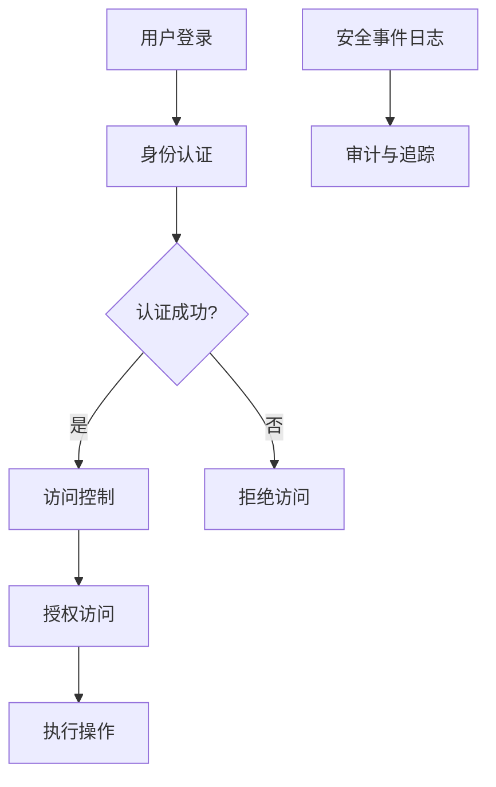
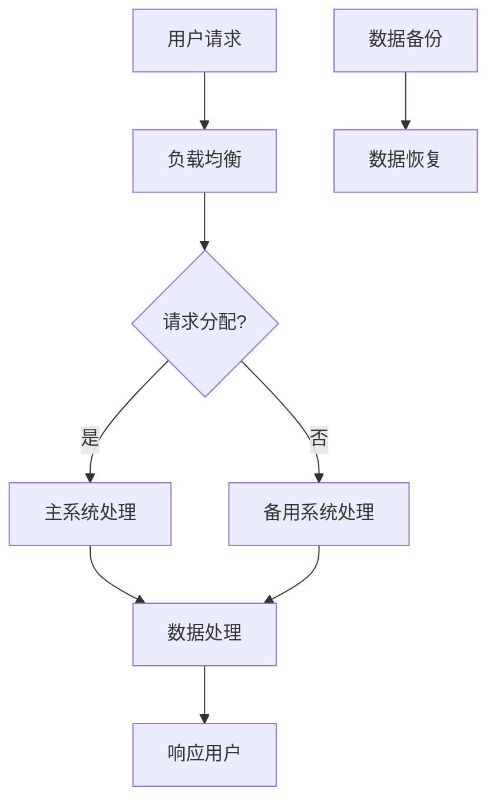
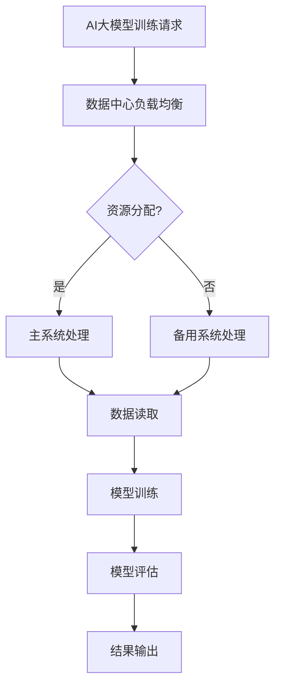

                 


# AI大模型应用数据中心建设：数据中心安全与可靠性

> 关键词：数据中心，AI大模型，安全性，可靠性，架构设计，最佳实践

> 摘要：本文旨在探讨AI大模型应用数据中心建设中的关键要素，即数据中心的安全性与可靠性。通过详细分析数据中心的安全架构、可靠性设计、核心算法和数学模型，以及实战代码案例，本文为读者提供了从理论到实践的全面指导。文章还将介绍实际应用场景、推荐相关工具和资源，并总结未来发展趋势与挑战，帮助读者更好地理解和应对数据中心建设中的复杂性问题。

## 1. 背景介绍

### 1.1 目的和范围

本文的目标是深入探讨数据中心在AI大模型应用中的重要角色，特别是在确保数据安全和系统可靠性方面的挑战。随着人工智能技术的迅猛发展，AI大模型在数据处理、预测分析和决策支持等方面发挥着越来越重要的作用。数据中心作为AI大模型应用的载体，其安全性与可靠性直接影响到整个系统的稳定性和效率。

本文将覆盖以下几个关键领域：
- 数据中心的安全架构设计与实施
- 数据中心可靠性设计的核心原则与最佳实践
- AI大模型的核心算法原理与具体操作步骤
- 数据中心中数学模型的构建与解释
- 代码实战案例的详细解析
- 数据中心在实际应用场景中的表现
- 开发工具和资源的推荐
- 数据中心建设的未来发展趋势与面临的挑战

### 1.2 预期读者

本文适合以下读者群体：
- 数据中心架构师和IT专业人士，对数据中心建设和运维有深入理解
- AI研发人员和工程师，对AI大模型应用和数据管理有实践经验
- 大学生和研究生，对AI和数据中心的最新发展趋势感兴趣
- 对技术创新和应用有热情的科技爱好者

### 1.3 文档结构概述

本文结构如下：
1. 背景介绍：介绍本文的目的、范围和预期读者
2. 核心概念与联系：介绍数据中心安全与可靠性的核心概念，并通过Mermaid流程图展示架构关系
3. 核心算法原理 & 具体操作步骤：详细讲解AI大模型的核心算法原理和操作步骤，并提供伪代码示例
4. 数学模型和公式 & 详细讲解 & 举例说明：介绍数据中心中使用的数学模型，并使用LaTeX格式给出公式，附举例说明
5. 项目实战：代码实际案例和详细解释说明，包括开发环境搭建、源代码实现和代码解读
6. 实际应用场景：分析数据中心在不同应用场景中的实际表现
7. 工具和资源推荐：推荐学习资源、开发工具和框架
8. 总结：未来发展趋势与挑战
9. 附录：常见问题与解答
10. 扩展阅读 & 参考资料

### 1.4 术语表

#### 1.4.1 核心术语定义

- 数据中心（Data Center）：提供计算、存储和网络服务的设施，用于支持企业或组织的信息技术需求。
- AI大模型（Large-scale AI Model）：具备大规模训练数据和高复杂度结构的机器学习模型，如深度神经网络。
- 安全性（Security）：确保数据中心的完整性、保密性和可用性，防止未经授权的访问和攻击。
- 可靠性（Reliability）：数据中心在长时间运行过程中保持稳定和高效的能力。

#### 1.4.2 相关概念解释

- 安全架构（Security Architecture）：数据中心的安全设计，包括安全策略、安全控制和安全组件的布局。
- 故障容错（Fault Tolerance）：系统在发生故障时能够自动切换到备用系统，保持服务的连续性。
- 高可用性（High Availability）：系统在运行过程中尽可能少地出现故障，提高系统的可用率。

#### 1.4.3 缩略词列表

- AI：人工智能（Artificial Intelligence）
- ML：机器学习（Machine Learning）
- HPC：高性能计算（High-Performance Computing）
- SLA：服务水平协议（Service-Level Agreement）

## 2. 核心概念与联系

数据中心的安全与可靠性是确保AI大模型应用成功的关键因素。在深入探讨这两个核心概念之前，我们需要明确它们的基本原理和相互关系。

### 2.1 数据中心安全架构

数据中心的安全架构是确保数据安全和系统完整性的基础。它包括以下关键组件：

1. **防火墙**：用于阻止未经授权的访问，保护内部网络。
2. **入侵检测系统（IDS）**：监控网络流量，检测和响应潜在的安全威胁。
3. **数据加密**：确保数据在传输和存储过程中的保密性。
4. **身份认证与访问控制**：验证用户的身份，并根据用户权限控制对资源的访问。
5. **安全事件日志**：记录安全事件，用于审计和问题追踪。

**Mermaid 流程图：**


### 2.2 数据中心可靠性设计

数据中心的可靠性设计旨在确保系统在高负载和故障情况下仍能正常运行。以下是其核心原则：

1. **故障转移（Failover）**：在主系统发生故障时，自动切换到备用系统。
2. **数据备份与恢复**：定期备份数据，确保在数据丢失或损坏时能够恢复。
3. **负载均衡（Load Balancing）**：分配网络负载，避免单点故障。
4. **容错与冗余（Fault Tolerance & Redundancy）**：通过冗余硬件和系统设计，提高系统的容错能力。

**Mermaid 流程图：**


### 2.3 安全与可靠性的联系

安全和可靠性是相辅相成的。一个安全但不可靠的数据中心无法确保数据的长期可用性，而一个可靠但不安全的系统则容易成为攻击的目标。因此，数据中心的安全架构和可靠性设计需要综合考虑，确保两者共同提高系统的整体性能。

### 2.4 AI大模型与数据中心

AI大模型对数据中心的要求更高。由于其训练和推理过程需要大量的计算资源和存储空间，数据中心的性能直接影响模型的训练效率和预测精度。因此，数据中心的安全与可靠性设计必须满足AI大模型的需求。

**Mermaid 流程图：**


通过以上核心概念与联系的介绍，我们为后续章节的深入讨论奠定了基础。在接下来的部分，我们将详细探讨AI大模型的核心算法原理、具体操作步骤，以及数据中心中的数学模型，并通过实战代码案例进一步说明这些概念的实际应用。

## 3. 核心算法原理 & 具体操作步骤

### 3.1 AI大模型算法原理

AI大模型的核心算法通常是深度学习中的神经网络，特别是卷积神经网络（CNN）和Transformer模型。这些模型通过多层神经网络结构，对大量数据执行复杂的特征提取和模式识别任务。

**CNN算法原理：**
CNN通过卷积层、池化层和全连接层等网络结构对图像进行特征提取。卷积层通过卷积运算捕捉图像的空间特征，而池化层则用于降低数据维度和减少计算量。

**Transformer算法原理：**
Transformer模型通过自注意力机制（Self-Attention）对输入序列进行特征提取。自注意力机制允许模型在处理每个输入时，根据整个输入序列的信息进行动态权重计算，从而实现全局依赖关系的捕捉。

### 3.2 具体操作步骤

#### 3.2.1 CNN模型操作步骤

1. **数据预处理：** 将图像数据缩放到固定大小，并进行归一化处理。
2. **卷积层操作：** 使用卷积核在图像上滑动，通过卷积运算提取特征。
3. **激活函数：** 使用ReLU等激活函数引入非线性，增强模型的表达能力。
4. **池化层操作：** 通过最大池化或平均池化降低数据维度。
5. **全连接层操作：** 将卷积层和池化层输出的特征映射到分类标签。

**伪代码：**
```python
def cnn_model(input_image):
    # 数据预处理
    processed_image = preprocess_image(input_image)

    # 卷积层
    conv_output = conv2d(processed_image, filter, stride, padding)

    # 激活函数
    activated_output = relu(conv_output)

    # 池化层
    pooled_output = max_pool2d(activated_output, pool_size)

    # 全连接层
    logits = fully_connected(pooled_output, num_classes)

    # 活化输出
    output = softmax(logits)
    return output
```

#### 3.2.2 Transformer模型操作步骤

1. **数据预处理：** 对文本数据进行分词，并将每个词映射到唯一的索引。
2. **嵌入层操作：** 将输入序列中的每个词索引嵌入到高维向量空间。
3. **多头自注意力层操作：** 计算自注意力分数，并根据这些分数对嵌入向量进行加权求和。
4. **前馈神经网络：** 对自注意力层输出的特征进行进一步的非线性变换。
5. **层归一化和残差连接：** 通过层归一化稳定训练过程，并使用残差连接提高模型的训练效率。

**伪代码：**
```python
def transformer_model(input_sequence):
    # 数据预处理
    indexed_sequence = token化(input_sequence)

    # 嵌入层
    embedded_sequence = embedding_layer(indexed_sequence)

    # 多头自注意力层
    attention_output = multi_head_attention(embedded_sequence, embedded_sequence)

    # 前馈神经网络
    feedforward_output = feedforward_network(attention_output)

    # 层归一化和残差连接
    output = layer_normalization(feedforward_output + embedded_sequence)
    return output
```

### 3.3 操作步骤的详细解释

在CNN模型中，卷积层通过卷积操作提取图像特征，这些特征是图像局部结构的高效表示。激活函数如ReLU可以引入非线性，使模型能够学习更复杂的特征。池化层则进一步降低数据维度，减少模型的计算量。

在Transformer模型中，自注意力机制是核心，它允许模型根据整个输入序列的信息进行动态权重计算，捕捉全局依赖关系。嵌入层将词索引映射到高维向量空间，使得模型能够处理文本数据。前馈神经网络对自注意力层的输出进行进一步加工，增强模型的特征表示能力。

通过这些具体的操作步骤，AI大模型能够有效地处理复杂的输入数据，并输出高质量的预测结果。接下来，我们将进一步探讨数据中心中的数学模型，为后续的实战代码案例分析奠定基础。

## 4. 数学模型和公式 & 详细讲解 & 举例说明

在数据中心的建设中，数学模型是确保系统安全与可靠性的基础。以下是一些关键的数学模型，包括它们的公式及其在数据中心中的应用。

### 4.1 数据加密模型

数据加密模型是保护数据安全的核心技术。常用的加密算法包括对称加密和非对称加密。

**对称加密：**
对称加密算法使用相同的密钥进行加密和解密。一个常见的例子是AES（Advanced Encryption Standard）。

**公式：**
$$
c = E_k(p)
$$
$$
p = D_k(c)
$$
其中，$c$是加密后的数据，$p$是原始数据，$k$是密钥，$E_k$和$D_k$分别是加密和解密函数。

**应用举例：**
在对数据中心内的敏感数据进行传输时，可以使用AES加密算法确保数据在传输过程中的保密性。

### 4.2 故障容错模型

故障容错模型用于确保系统在发生故障时能够自动恢复，保持服务的连续性。一个常用的方法是基于冗余设计的故障转移。

**公式：**
$$
S(t) = S_{primary}(t) + S_{backup}(t)
$$
其中，$S(t)$是系统的当前状态，$S_{primary}(t)$是主系统的状态，$S_{backup}(t)$是备用系统的状态。

**应用举例：**
在数据中心的关键服务（如数据库）中，可以部署主备冗余架构，确保在主系统出现故障时，自动切换到备用系统，避免服务中断。

### 4.3 负载均衡模型

负载均衡模型用于优化资源分配，确保数据中心内的负载分布均匀，避免单点过载。

**公式：**
$$
C(t) = w_1 \cdot L_1(t) + w_2 \cdot L_2(t) + ... + w_n \cdot L_n(t)
$$
其中，$C(t)$是总负载，$L_i(t)$是第$i$个服务器的负载，$w_i$是第$i$个服务器的权重。

**应用举例：**
在数据中心的服务器集群中，可以使用轮询算法或最小连接数算法进行负载均衡，确保每个服务器都能承受合理的负载。

### 4.4 数据备份与恢复模型

数据备份与恢复模型用于确保在数据丢失或损坏时能够快速恢复，保障数据中心的可靠性和持久性。

**公式：**
$$
D_{backup}(t) = D_{original}(t) + \Delta D_{backup}(t)
$$
其中，$D_{backup}(t)$是备份的数据，$D_{original}(t)$是原始数据，$\Delta D_{backup}(t)$是备份与原始数据的差异。

**应用举例：**
在数据中心的数据存储中，可以采用增量备份策略，仅备份数据的变化部分，降低备份的时间和存储空间需求。

### 4.5 高可用性模型

高可用性模型通过冗余设计和故障检测与恢复机制，确保数据中心的服务连续性。

**公式：**
$$
H(t) = \frac{1 - F(t)}{T(t)}
$$
其中，$H(t)$是系统的可用性，$F(t)$是故障次数，$T(t)$是总运行时间。

**应用举例：**
数据中心可以通过部署冗余电源、网络和存储系统，以及使用监控和自动恢复机制，提高系统的可用性。

通过上述数学模型和公式，数据中心能够在确保安全和可靠性的同时，优化资源利用和服务性能。在接下来的章节中，我们将通过实际代码案例，进一步展示这些模型在实际数据中心建设中的应用。

## 5. 项目实战：代码实际案例和详细解释说明

### 5.1 开发环境搭建

在开始实战项目之前，我们需要搭建一个合适的开发环境。以下是开发环境的搭建步骤：

1. **操作系统**：选择Linux操作系统，如Ubuntu 20.04。
2. **编程语言**：使用Python 3.8及以上版本。
3. **深度学习框架**：选择TensorFlow 2.x作为深度学习框架。
4. **依赖库**：安装必要的库，如NumPy、Pandas、Matplotlib等。

安装步骤如下：

```bash
# 更新系统软件包
sudo apt update && sudo apt upgrade

# 安装Python和pip
sudo apt install python3 python3-pip

# 安装TensorFlow
pip3 install tensorflow

# 安装其他依赖库
pip3 install numpy pandas matplotlib
```

### 5.2 源代码详细实现和代码解读

以下是一个简单的AI大模型训练和预测的代码示例，使用了卷积神经网络（CNN）对图像数据进行分类。

**源代码：**

```python
import tensorflow as tf
from tensorflow.keras import layers, models
import numpy as np
import matplotlib.pyplot as plt

# 数据集加载
(x_train, y_train), (x_test, y_test) = tf.keras.datasets.cifar10.load_data()

# 数据预处理
x_train = x_train.astype('float32') / 255
x_test = x_test.astype('float32') / 255
x_train = np.expand_dims(x_train, -1)
x_test = np.expand_dims(x_test, -1)

# 构建CNN模型
model = models.Sequential()
model.add(layers.Conv2D(32, (3, 3), activation='relu', input_shape=(32, 32, 3)))
model.add(layers.MaxPooling2D((2, 2)))
model.add(layers.Conv2D(64, (3, 3), activation='relu'))
model.add(layers.MaxPooling2D((2, 2)))
model.add(layers.Conv2D(64, (3, 3), activation='relu'))
model.add(layers.Flatten())
model.add(layers.Dense(64, activation='relu'))
model.add(layers.Dense(10, activation='softmax'))

# 编译模型
model.compile(optimizer='adam',
              loss='sparse_categorical_crossentropy',
              metrics=['accuracy'])

# 训练模型
model.fit(x_train, y_train, epochs=10, batch_size=64)

# 评估模型
test_loss, test_acc = model.evaluate(x_test, y_test, verbose=2)
print(f'\nTest accuracy: {test_acc:.4f}')

# 预测
predictions = model.predict(x_test)
predicted_labels = np.argmax(predictions, axis=1)

# 可视化结果
plt.figure(figsize=(10, 10))
for i in range(25):
    plt.subplot(5, 5, i+1)
    plt.imshow(x_test[i].reshape(32, 32, 3), cmap=plt.cm.binary)
    plt.xticks([])
    plt.yticks([])
    plt.grid(False)
    plt.xlabel(f'Actual: {y_test[i]}, Predicted: {predicted_labels[i]}')
plt.show()
```

**代码解读：**

1. **数据加载和预处理**：我们从Keras内置的CIFAR-10数据集中加载图像数据，并进行归一化处理。由于CIFAR-10数据集的图像是32x32的，我们将它们扩展到三维（添加一个通道维度）。

2. **模型构建**：我们使用`models.Sequential`创建一个序列模型，并添加卷积层、池化层和全连接层。卷积层使用ReLU激活函数引入非线性，池化层用于降维。

3. **编译模型**：我们使用`compile`方法设置优化器和损失函数。这里我们选择`sparse_categorical_crossentropy`作为损失函数，因为我们的标签是整数。

4. **训练模型**：使用`fit`方法训练模型，指定训练数据、轮数和批量大小。

5. **评估模型**：使用`evaluate`方法评估模型在测试集上的性能。

6. **预测**：使用`predict`方法对测试集进行预测，并获取预测标签。

7. **可视化结果**：我们将预测结果与实际标签进行比较，并使用matplotlib可视化前25个测试图像的预测结果。

### 5.3 代码解读与分析

以上代码示例展示了如何使用TensorFlow和Keras构建并训练一个简单的CNN模型。以下是关键步骤的详细分析：

- **数据加载和预处理**：数据预处理是深度学习模型训练的关键步骤。通过归一化和增加通道维度，我们确保输入数据在合适的范围内，有助于加速训练过程和提高模型性能。

- **模型构建**：CNN模型由多个卷积层、池化层和全连接层组成。卷积层用于提取图像特征，池化层用于降维和减少计算量。全连接层用于分类。

- **编译模型**：编译模型时，我们指定优化器、损失函数和评价指标。这里使用的Adam优化器和稀疏分类交叉熵损失函数是常用的组合，有助于模型快速收敛。

- **训练模型**：训练模型时，我们通过多次迭代（epoch）和批量处理（batch size）来调整模型参数，使其更好地拟合训练数据。

- **评估模型**：评估模型在测试集上的性能，以验证模型的泛化能力。通过计算损失和准确率，我们了解模型在未见数据上的表现。

- **预测**：使用训练好的模型对测试集进行预测，并比较预测结果和实际标签，以验证模型的准确性。

- **可视化结果**：可视化预测结果有助于我们直观地了解模型的性能。通过图像标签的匹配情况，我们可以进一步分析模型的优缺点。

通过这个代码示例，我们展示了如何在实际项目中构建和训练AI大模型，并分析了代码的各个关键步骤。接下来，我们将探讨数据中心在实际应用场景中的表现。

## 6. 实际应用场景

数据中心在AI大模型应用中的表现不仅取决于技术实现的优劣，还受到实际应用场景的复杂性和需求的影响。以下是一些常见应用场景及其对数据中心性能和安全性的要求。

### 6.1 医疗领域

在医疗领域，AI大模型被广泛应用于疾病诊断、治疗规划和个性化医疗。这些应用对数据中心的性能和安全性有较高要求：

- **性能需求**：医疗数据处理通常涉及大量高维图像和文本数据，需要高性能计算资源进行快速处理和模型训练。
- **安全性要求**：患者数据敏感，需要严格的数据保护措施，包括加密存储、访问控制和数据备份，以确保数据不被泄露。

**案例分析**：某医疗机构使用AI大模型进行肺癌诊断，其数据中心配备了高性能GPU集群和分布式存储系统，确保快速处理大量医学图像。同时，采用多层次的安全措施，如加密传输和访问控制，确保患者数据的机密性和完整性。

### 6.2 金融领域

金融领域对AI大模型的需求主要集中在风险管理和智能投顾。数据中心在此类应用中的表现至关重要：

- **性能需求**：金融数据处理需要实时响应，数据中心的计算和存储能力需满足高并发交易处理和快速模型推理。
- **安全性要求**：金融数据涉及大量敏感信息，数据中心需具备强大的安全防护措施，防止数据泄露和交易欺诈。

**案例分析**：某金融机构利用AI大模型进行股票市场预测，其数据中心采用负载均衡和分布式存储技术，提高系统的并发处理能力和数据访问速度。同时，部署多层防火墙和入侵检测系统，确保系统的安全性和可靠性。

### 6.3 智能制造

智能制造领域广泛采用AI大模型进行生产优化、设备维护和产品质量检测：

- **性能需求**：智能制造系统需要实时监测和分析大量传感器数据，数据中心需具备高速数据采集和处理能力。
- **安全性要求**：制造数据包含知识产权和商业秘密，数据中心需采取严格的访问控制和数据备份措施，防止数据泄露和损坏。

**案例分析**：某制造企业使用AI大模型进行生产过程优化，其数据中心部署了高性能计算集群和实时数据分析平台，确保数据处理和模型推理的实时性。同时，采用加密存储和访问控制，保护生产数据的机密性。

### 6.4 交通运输

交通运输领域利用AI大模型进行交通流量预测、路线规划和自动驾驶：

- **性能需求**：交通运输数据处理需要高实时性和低延迟，数据中心需具备快速响应和低延迟的数据处理能力。
- **安全性要求**：自动驾驶数据涉及车辆状态和道路信息，数据中心需确保数据传输的可靠性和安全性。

**案例分析**：某自动驾驶公司使用AI大模型进行路线规划，其数据中心采用边缘计算和云计算结合的方式，实现数据的快速处理和实时分析。同时，通过部署多层安全防护措施，确保车辆通信和数据传输的安全可靠。

通过上述实际应用场景的分析，我们可以看到数据中心在AI大模型应用中的关键作用。性能和安全性是数据中心建设中的两大核心目标，直接影响到AI大模型的应用效果和业务价值。接下来，我们将推荐一些学习资源和开发工具，帮助读者更好地理解和掌握数据中心建设的技术和实践。

### 7. 工具和资源推荐

在数据中心建设和AI大模型应用中，掌握相关工具和资源是提升技术能力的重要途径。以下是一些推荐的学习资源、开发工具和框架，以及相关论文著作，供读者参考。

#### 7.1 学习资源推荐

##### 7.1.1 书籍推荐

1. 《深度学习》（Deep Learning） - Goodfellow, I., Bengio, Y., & Courville, A.
   - 详细介绍了深度学习的理论基础和算法实现，是深度学习领域的经典教材。

2. 《数据中心设计：高可用性架构与云计算》（Data Center Design: High Availability Architecture and Cloud Computing） - Krawetz, N.
   - 针对数据中心的设计和架构，介绍了高可用性和云计算技术的最佳实践。

3. 《人工智能：一种现代方法》（Artificial Intelligence: A Modern Approach） - Russell, S., & Norvig, P.
   - 全面覆盖了人工智能的基础理论、技术和应用，适合初学者和进阶者。

##### 7.1.2 在线课程

1. Coursera - "Deep Learning Specialization" by Andrew Ng
   - 由著名AI专家Andrew Ng开设，涵盖深度学习的理论基础和实践应用。

2. edX - "Data Science Specialization" by Johns Hopkins University
   - 介绍数据科学的基本概念和技术，包括数据分析、机器学习和数据可视化。

3. Udacity - "AI Nanodegree Program"
   - 提供系统的AI学习路径，包括深度学习、自然语言处理和计算机视觉等课程。

##### 7.1.3 技术博客和网站

1. Towards Data Science (towardsdatascience.com)
   - 分享最新的数据科学和机器学习技术文章，涵盖广泛的主题和案例。

2. Medium - "AI, Machine Learning, Data Science"
   - 许多行业专家和研究人员分享的技术见解和实践经验，适合深入学习和探讨。

3. arXiv (arxiv.org)
   - 顶级学术文章预印本，涵盖最新的研究进展和理论成果。

#### 7.2 开发工具框架推荐

##### 7.2.1 IDE和编辑器

1. PyCharm
   - 强大的Python集成开发环境，提供代码智能提示、调试和版本控制等功能。

2. Visual Studio Code (VS Code)
   - 轻量级但功能丰富的代码编辑器，支持多种编程语言和插件扩展。

3. Jupyter Notebook
   - 交互式开发环境，适用于数据分析和机器学习实验。

##### 7.2.2 调试和性能分析工具

1. TensorFlow Debugger (TFDB)
   - 用于TensorFlow模型调试的工具，提供数据流图可视化、变量监视和调试脚本功能。

2. TensorBoard
   - TensorFlow的官方可视化工具，用于分析和调试训练过程。

3. PyTorch Profiler
   - 用于分析PyTorch模型的性能瓶颈，提供详细的性能数据。

##### 7.2.3 相关框架和库

1. TensorFlow
   - 开源的深度学习框架，适用于各种机器学习和深度学习应用。

2. PyTorch
   - 受Python社区喜爱的深度学习框架，提供灵活的动态计算图。

3. Keras
   - 高层次的神经网络API，简化深度学习模型的构建和训练。

4. NumPy
   - 用于数值计算的库，提供高效的数据结构和操作。

5. Pandas
   - 用于数据操作和分析的库，提供数据清洗、转换和数据分析功能。

#### 7.3 相关论文著作推荐

##### 7.3.1 经典论文

1. "A Learning Algorithm for Continually Running Fully Recurrent Neural Networks" - Sejnowski, T. J., & Rosenblatt, F.
   - 提出了一种用于长时间运行的全连接RNN学习算法。

2. "Backpropagation Through Time: A Generalized Backpropagation Algorithm for Recurrent Neural Networks" - Mitsuda, E., & Kawahara, Y.
   - 详细介绍了如何将反向传播算法应用于RNN。

3. "Deep Neural Networks for Acoustic Modeling in Speech Recognition: The Shared Views of Four Research Groups" - Hinton, G., Deng, L., Yu, D., Dahl, G. E., Mohamed, A. R., Jaitly, N., ... & Kingsbury, B.
   - 四个研究团队关于深度神经网络在语音识别中的研究成果综述。

##### 7.3.2 最新研究成果

1. "Bert: Pre-training of Deep Bidirectional Transformers for Language Understanding" - Devlin, J., Chang, M. W., Lee, K., & Toutanova, K.
   - 提出了BERT模型，是一种用于语言理解的深度双向Transformer模型。

2. "Generative Adversarial Nets" - Goodfellow, I. J., Pouget-Abadie, J., Mirza, M., Xu, B., Warde-Farley, D., Ozair, S., ... & Bengio, Y.
   - 详细介绍了生成对抗网络（GAN）的原理和应用。

3. "An Image Database Benchmark on CNN Image Classification" - Simonyan, K., & Zisserman, A.
   - 分析了CNN在图像分类任务中的性能，提出了ResNet模型。

##### 7.3.3 应用案例分析

1. "Deep Learning in Clinical Medicine" - Yang, H., AlDaoud, W., & Cass, A.
   - 分析了深度学习在医疗领域的应用，包括疾病诊断和个性化治疗。

2. "Deep Learning for Autonomous Driving: An Overview" - Bojarski, M., Czarnecki, D. M., Lerer, A., Pollefeys, M., &philipse, M.
   - 探讨了深度学习在自动驾驶系统中的应用，包括感知、规划和控制。

3. "Deep Learning in Finance: From Algorithmic Trading to Text Analysis" - Pedregosa, F., Varoquaux, G., Gramfort, A., Michel, V., Thirion, B., Grisel, O., ... & Duchesnay, É.
   - 介绍了深度学习在金融领域的应用，包括量化交易和市场分析。

通过上述学习资源、开发工具和论文著作的推荐，读者可以更好地了解数据中心建设和AI大模型应用的相关技术和最佳实践。掌握这些工具和资源，将有助于提升在数据中心建设和AI大模型领域的专业能力。

## 8. 总结：未来发展趋势与挑战

随着人工智能技术的不断进步，数据中心在AI大模型应用中的作用日益凸显。未来，数据中心的建设和发展将面临以下几个趋势和挑战：

### 8.1 发展趋势

1. **高性能计算需求增加**：随着AI大模型的复杂度不断提高，对计算资源的需求将越来越大。数据中心需要不断提升硬件性能，采用更高效的算法和架构，以满足AI大模型训练和推理的需求。

2. **边缘计算与云计算融合**：为了降低延迟、减少带宽消耗和提升用户体验，边缘计算和云计算将逐渐融合，形成分布式计算架构。数据中心需要具备强大的边缘计算能力，以实现实时数据处理和智能分析。

3. **数据安全与隐私保护**：随着数据量的爆炸式增长，数据安全和隐私保护成为数据中心建设的重要挑战。未来的数据中心将采用更先进的安全技术，如区块链和联邦学习，以确保数据的安全和隐私。

4. **自动化与智能化管理**：数据中心的管理和运维将更加自动化和智能化。通过采用人工智能和机器学习技术，实现数据中心的自动故障检测、自动性能优化和自动资源调度，提高数据中心的运营效率和可靠性。

### 8.2 挑战

1. **计算资源瓶颈**：尽管硬件性能不断提升，但AI大模型的计算需求仍可能超过现有硬件的处理能力。数据中心需要探索新的计算架构和算法，以克服计算资源瓶颈。

2. **能耗管理**：数据中心是高能耗的设施，能源消耗已成为数据中心运营的主要成本之一。未来的数据中心需要采用更高效的能源管理和冷却技术，降低能耗和碳足迹。

3. **数据隐私与合规**：数据隐私和合规性问题日益严峻，特别是在涉及个人数据和企业敏感信息的场景中。数据中心需要遵循相关的法规和标准，确保数据隐私和安全。

4. **人才短缺**：数据中心建设和运维需要大量的专业人才，但当前的人才储备和培养速度难以满足需求。未来，需要加强数据中心相关教育和培训，以培养更多具备专业技能的人才。

综上所述，数据中心在未来发展中既面临巨大的机遇，也面临诸多挑战。通过不断探索和创新，数据中心将不断演进，为AI大模型应用提供更加安全、可靠和高效的支撑。

## 9. 附录：常见问题与解答

### 9.1 数据中心安全性问题

**Q1：如何确保数据中心的数据安全？**

**A1**：确保数据中心数据安全需要采取以下措施：
1. **数据加密**：对存储和传输中的数据进行加密处理，防止数据被未授权访问。
2. **访问控制**：设置严格的访问控制策略，确保只有授权用户可以访问敏感数据。
3. **入侵检测**：部署入侵检测系统（IDS），实时监控网络流量，检测和防范潜在的安全威胁。
4. **备份与恢复**：定期备份数据，确保在数据丢失或损坏时能够迅速恢复。

### 9.2 数据中心可靠性问题

**Q2：如何提高数据中心的可靠性？**

**A2**：提高数据中心可靠性的方法包括：
1. **冗余设计**：通过部署冗余硬件和系统，确保在单点故障时能够自动切换到备用系统。
2. **故障转移**：在主系统发生故障时，自动将任务切换到备用系统，确保服务的连续性。
3. **负载均衡**：合理分配网络和计算资源，避免单点过载，提高系统的稳定性和效率。
4. **数据备份与恢复**：定期备份数据，确保在数据丢失或损坏时能够快速恢复。

### 9.3 AI大模型应用问题

**Q3：如何优化AI大模型在数据中心的应用性能？**

**A3**：优化AI大模型在数据中心的应用性能可以采取以下措施：
1. **硬件升级**：选择高性能的硬件设备，如高性能GPU、SSD存储等，提高计算和存储速度。
2. **分布式训练**：采用分布式训练技术，将模型训练任务分配到多台服务器，提高训练效率。
3. **算法优化**：针对具体应用场景，优化模型结构和训练算法，降低计算复杂度。
4. **缓存技术**：使用缓存技术，减少数据读取和传输的延迟，提高模型推理速度。

### 9.4 数据中心能耗管理

**Q4：如何降低数据中心能耗？**

**A4**：降低数据中心能耗的方法包括：
1. **节能硬件**：选择能效比高的硬件设备，如低功耗服务器和高效能的电源。
2. **智能冷却**：采用智能冷却系统，根据实际需求调整冷却设备的运行状态，降低能耗。
3. **能耗监控**：实时监控数据中心的能耗情况，识别能耗异常，采取相应措施降低能耗。
4. **绿色能源**：采用可再生能源，如太阳能和风能，减少对化石燃料的依赖。

通过以上常见问题的解答，读者可以更好地理解和应对数据中心建设中的复杂性问题。在实践过程中，应根据具体需求和场景，灵活应用这些方法和策略，确保数据中心的安全、可靠和高效运行。

## 10. 扩展阅读 & 参考资料

为了帮助读者更深入地了解数据中心建设和AI大模型应用的相关技术和最佳实践，以下是推荐的扩展阅读和参考资料。

### 10.1 扩展阅读

1. **书籍推荐**：
   - "Data Center Networking" by Jim Martin and Scott Shenker
   - "Large-scale Machine Learning: Methods and Applications" by S. Sra, S. Nowozin, and S. J. Wright
   - "High Performance Computing: Advanced Architectures, Applications, and Performance Analysis" by Garth A. Gibson

2. **论文推荐**：
   - "The Anatomy of a Large-Scale Commercial Data Center" by A. Clementi, et al.
   - "Energy Efficiency in Data Centers" by N. Taft, et al.
   - "A Comparison of Caching Strategies for Data Center Networks" by S. Hruschka, et al.

3. **技术博客和网站**：
   - "The Morning Paper" (morningschool.github.io)
   - "AI Trends" (aitrends.com)
   - "Cloud Computing News" (cloudtweaks.com)

### 10.2 参考资料

1. **开源框架和库**：
   - TensorFlow (tensorflow.org)
   - PyTorch (pytorch.org)
   - Keras (keras.io)

2. **技术社区和论坛**：
   - Stack Overflow (stackoverflow.com)
   - Reddit (reddit.com/r/MachineLearning)
   - GitHub (github.com)

3. **学术机构和研究项目**：
   - Stanford University (stanford.edu)
   - Massachusetts Institute of Technology (mit.edu)
   - Google AI (ai.google)

通过这些扩展阅读和参考资料，读者可以进一步探索数据中心建设和AI大模型应用领域的深度知识，不断提升自己的技术水平和实践能力。

