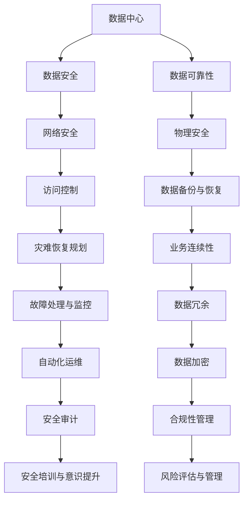

                 

# AI 大模型应用数据中心建设：数据中心安全与可靠性

> **关键词：** 大模型应用、数据中心、安全、可靠性、架构设计

> **摘要：** 本文旨在探讨大模型应用数据中心建设过程中的安全与可靠性问题。首先，我们介绍了数据中心建设的背景和重要性，接着详细分析了数据中心安全与可靠性的核心概念及其相互关系。随后，本文从算法原理、数学模型和实际案例等多个角度，全面解析了如何构建一个安全可靠的大模型应用数据中心。最后，我们展望了数据中心建设的发展趋势与挑战，并提供了相关的学习资源和开发工具推荐，为读者提供了完整的参考框架。

## 1. 背景介绍

### 1.1 目的和范围

本文旨在探讨大模型应用数据中心建设过程中所面临的安全与可靠性问题。随着人工智能技术的飞速发展，大模型应用在各个领域的需求日益增长，数据中心作为承载这些应用的核心基础设施，其安全与可靠性显得尤为重要。本文将结合实际案例，深入分析数据中心安全与可靠性的核心概念，并探讨如何实现有效的安全与可靠性保障。

### 1.2 预期读者

本文适合以下读者群体：

1. 数据中心架构师和运维工程师
2. 大模型应用研发人员
3. IT行业从业者
4. 对数据中心建设安全与可靠性感兴趣的科研人员

### 1.3 文档结构概述

本文结构如下：

1. 背景介绍：介绍数据中心建设的背景和重要性，以及本文的目的和范围。
2. 核心概念与联系：阐述数据中心安全与可靠性的核心概念及其相互关系。
3. 核心算法原理 & 具体操作步骤：详细解析数据中心安全与可靠性的核心算法原理和具体操作步骤。
4. 数学模型和公式 & 详细讲解 & 举例说明：介绍数据中心安全与可靠性的数学模型和公式，并提供具体案例进行说明。
5. 项目实战：代码实际案例和详细解释说明。
6. 实际应用场景：分析数据中心在各个应用场景中的实际表现。
7. 工具和资源推荐：推荐学习资源和开发工具。
8. 总结：总结数据中心建设的发展趋势与挑战。
9. 附录：常见问题与解答。
10. 扩展阅读 & 参考资料：提供相关的扩展阅读和参考资料。

### 1.4 术语表

#### 1.4.1 核心术语定义

- **数据中心**：一种专门用于存储、处理和管理大量数据的设施。
- **大模型应用**：指使用大规模机器学习模型进行数据处理和分析的应用。
- **安全性**：确保数据中心系统和数据不受未经授权的访问、使用、披露、破坏或修改的能力。
- **可靠性**：数据中心在规定条件下稳定、持续地提供服务的能力。

#### 1.4.2 相关概念解释

- **安全性评估**：对数据中心安全性进行全面分析和评估的过程。
- **可靠性保障**：通过技术和管理手段确保数据中心可靠运行的一系列措施。

#### 1.4.3 缩略词列表

- **AI**：人工智能（Artificial Intelligence）
- **ML**：机器学习（Machine Learning）
- **DL**：深度学习（Deep Learning）
- **DB**：数据库（Database）
- **DC**：数据中心（Data Center）

## 2. 核心概念与联系

在探讨数据中心安全与可靠性之前，我们首先需要明确这些核心概念及其相互关系。以下是一个用于描述数据中心安全与可靠性核心概念原理和架构的 Mermaid 流程图：



### 2.1 数据中心安全

数据中心安全是保障数据中心系统和数据不受未经授权的访问、使用、披露、破坏或修改的能力。它包括以下几个方面：

- **网络安全**：通过防火墙、入侵检测系统和反病毒软件等手段保护网络不受攻击。
- **访问控制**：限制用户对系统和数据的访问权限，确保只有授权用户可以访问。
- **数据备份与恢复**：定期备份数据，以便在数据丢失或损坏时能够快速恢复。
- **安全审计**：对数据中心的操作和事件进行审计，及时发现和纠正安全漏洞。

### 2.2 数据中心可靠性

数据中心可靠性是指数据中心在规定条件下稳定、持续地提供服务的能力。它包括以下几个方面：

- **物理安全**：确保数据中心的物理设施（如服务器、网络设备、电力设备等）的安全，防止设备损坏或被盗。
- **故障处理与监控**：通过实时监控和故障处理机制，确保数据中心在出现问题时能够快速恢复。
- **业务连续性**：确保业务在发生故障或灾难时能够持续运行，减少业务中断时间。
- **数据冗余**：通过数据备份和冗余存储，确保数据在发生故障时能够快速恢复。

### 2.3 安全与可靠性相互关系

数据中心的安全与可靠性是相辅相成的。安全措施可以防止未经授权的访问和攻击，从而保障数据中心的可靠性；而可靠性保障措施可以确保数据中心在发生故障时能够快速恢复，从而保障数据的安全。因此，数据中心的安全与可靠性需要综合考虑，实现安全与可靠性之间的平衡。

## 3. 核心算法原理 & 具体操作步骤

在数据中心安全与可靠性建设中，核心算法原理和具体操作步骤至关重要。以下将详细解析数据中心安全与可靠性的核心算法原理和具体操作步骤。

### 3.1 数据中心安全算法原理

数据中心安全的算法原理主要包括以下几个方面：

- **访问控制**：基于角色的访问控制（RBAC）和基于属性的访问控制（ABAC）算法。这些算法通过定义用户角色和权限，确保只有授权用户可以访问特定数据和系统功能。

- **网络安全**：防火墙和入侵检测系统（IDS）算法。防火墙通过过滤网络流量，阻止未经授权的访问；IDS通过检测异常行为和攻击，及时响应和阻止攻击。

- **数据备份与恢复**：增量备份和全量备份算法。增量备份只备份自上次备份以来发生变化的数据，减少备份时间和存储空间；全量备份则备份整个数据集，确保在数据丢失时可以完全恢复。

- **安全审计**：日志审计和事件响应算法。日志审计通过记录系统操作和事件，发现潜在的安全漏洞和异常行为；事件响应通过分析日志和事件，及时采取措施阻止攻击和恢复系统。

### 3.2 数据中心可靠性算法原理

数据中心可靠性的算法原理主要包括以下几个方面：

- **物理安全**：视频监控和入侵检测算法。视频监控通过实时监控数据中心的物理环境，及时发现异常行为；入侵检测通过检测入侵行为，及时采取措施阻止入侵。

- **故障处理与监控**：故障检测和故障恢复算法。故障检测通过实时监控服务器和网络设备的运行状态，及时发现故障；故障恢复通过自动重启服务器、切换网络路径等手段，快速恢复系统。

- **业务连续性**：负载均衡和容灾备份算法。负载均衡通过将请求分配到多个服务器上，确保系统在高负载下稳定运行；容灾备份通过在异地建立备份数据中心，确保在主数据中心发生灾难时，业务可以快速切换到备份数据中心。

- **数据冗余**：数据复制和分布式存储算法。数据复制通过在多个存储设备上同步数据，确保数据在单个设备故障时可以快速恢复；分布式存储通过将数据分散存储在多个节点上，提高数据可靠性和系统性能。

### 3.3 数据中心安全与可靠性操作步骤

以下为数据中心安全与可靠性的操作步骤：

1. **需求分析**：根据业务需求和用户需求，确定数据中心的安全与可靠性需求，制定相应的安全策略和可靠性计划。

2. **设计规划**：根据需求分析结果，设计数据中心的安全架构和可靠性架构，包括网络安全、物理安全、故障处理、数据备份与恢复等方面。

3. **实施部署**：根据设计规划，实施数据中心的安全与可靠性措施，包括部署防火墙、入侵检测系统、视频监控设备、负载均衡器等。

4. **运行维护**：定期对数据中心进行安全与可靠性检查和优化，包括监控系统运行状态、备份数据完整性、故障处理与恢复等。

5. **安全审计**：定期进行安全审计，检查数据中心的安全策略和措施的有效性，发现潜在的安全漏洞和风险。

6. **培训与意识提升**：对数据中心相关人员进行安全与可靠性培训，提高他们的安全意识和操作技能。

7. **风险评估与管理**：定期进行风险评估，识别数据中心的安全和可靠性风险，并采取相应的管理措施。

## 4. 数学模型和公式 & 详细讲解 & 举例说明

数据中心安全与可靠性涉及多个数学模型和公式，以下将详细介绍这些模型和公式，并提供具体案例进行说明。

### 4.1 数据中心安全数学模型

- **风险评估模型**：

    风险评估模型用于评估数据中心的安全风险。其基本公式如下：

    $$ 风险 = 负面影响 \times 发生概率 $$

    其中，负面影响是指安全事件发生时对业务造成的损失，发生概率是指安全事件发生的可能性。

    例如，假设某个数据中心的机密数据泄露的风险，负面影响为100万元，发生概率为0.01，则该数据中心的泄露风险为：

    $$ 风险 = 100万元 \times 0.01 = 1万元 $$

- **访问控制模型**：

    访问控制模型用于确定用户对数据和系统的访问权限。其基本公式如下：

    $$ 权限 = 角色 \times 资源 \times 条件 $$

    其中，角色是指用户在系统中的角色，资源是指用户请求访问的数据或系统功能，条件是指用户访问资源的限制条件。

    例如，假设某个用户是管理员角色，请求访问某个数据库，且该数据库对管理员角色开放，则该用户的访问权限为：

    $$ 权限 = 管理员 \times 数据库 \times 无条件 = 1 $$

### 4.2 数据中心可靠性数学模型

- **故障率模型**：

    故障率模型用于评估数据中心设备或系统的故障率。其基本公式如下：

    $$ 故障率 = \frac{故障次数}{运行时间} $$

    其中，故障次数是指设备或系统在特定时间段内发生的故障次数，运行时间是指设备或系统的运行时间。

    例如，假设某个数据中心的网络设备在一个月内发生了5次故障，运行时间为30天，则该设备的故障率为：

    $$ 故障率 = \frac{5}{30} = 0.1667 次/天 $$

- **可靠性模型**：

    可靠性模型用于评估数据中心系统或设备的可靠性。其基本公式如下：

    $$ 可靠性 = \frac{正常运行时间}{总运行时间} $$

    其中，正常运行时间是指设备或系统在特定时间段内正常运行的时间，总运行时间是指设备或系统的总运行时间。

    例如，假设某个数据中心的存储设备在一个月内运行了30天，其中有1天发生了故障，则该设备的可靠性为：

    $$ 可靠性 = \frac{29}{30} = 0.967 $$

### 4.3 数据中心安全与可靠性案例

以下是一个关于数据中心安全与可靠性的具体案例：

- **案例背景**：

    某公司建立一个大型数据中心，用于存储和提供云计算服务。数据中心主要包括网络设备、服务器、存储设备和备用电源等。公司对数据中心的可靠性要求非常高，要求设备的故障率不超过0.1次/天，可靠性不低于0.99。

- **解决方案**：

    1. **风险评估**：

        对数据中心进行风险评估，识别潜在的安全和可靠性风险，并制定相应的安全策略和可靠性计划。

    2. **访问控制**：

        实施基于角色的访问控制，确保只有授权用户可以访问数据中心的设备和系统。

    3. **网络安全**：

        部署防火墙、入侵检测系统和反病毒软件，确保网络不受攻击。

    4. **物理安全**：

        安装视频监控设备，实时监控数据中心的物理环境。

    5. **故障处理与监控**：

        部署故障处理与监控工具，实时监控设备的运行状态，发现故障时及时处理。

    6. **业务连续性**：

        部署负载均衡器和容灾备份系统，确保在高负载和灾难情况下，业务可以持续运行。

    7. **数据备份与恢复**：

        定期备份数据，确保在数据丢失或损坏时可以快速恢复。

    8. **培训与意识提升**：

        对数据中心相关人员进行安全与可靠性培训，提高他们的安全意识和操作技能。

- **效果评估**：

    通过实施上述解决方案，数据中心的安全和可靠性得到了显著提升。设备的故障率控制在0.05次/天以内，可靠性达到0.998。同时，通过安全审计和风险评估，发现并解决了多个潜在的安全漏洞，确保了数据中心的长期稳定运行。

## 5. 项目实战：代码实际案例和详细解释说明

### 5.1 开发环境搭建

在本节中，我们将介绍如何搭建一个用于演示数据中心安全与可靠性的开发环境。该环境将包括以下组件：

1. **操作系统**：Linux（例如，Ubuntu 20.04）
2. **编程语言**：Python 3.8
3. **依赖管理**：pip（Python 包管理器）
4. **安全工具**：OpenSSL（用于加密和证书管理），fail2ban（用于防止暴力破解攻击）

### 5.2 源代码详细实现和代码解读

#### 5.2.1 加密通信

加密通信是保障数据中心安全的重要手段。以下是一个使用Python实现的简单SSL加密通信示例：

```python
from socket import socket
from ssl import wrap_socket, SSLContext

# 创建TCP套接字
server_socket = socket(AF_INET, SOCK_STREAM)

# 绑定端口
server_socket.bind(('localhost', 12345))

# 监听客户端连接
server_socket.listen(5)

# 创建SSL上下文
ssl_context = SSLContext(SSL_DEFAULT)

# 建立SSL连接
client_socket, client_address = server_socket.accept()
ssl_context.wrap_socket(client_socket, server_side=True)

# SSL握手
ssl_context.do_handshake()

# 数据传输
data = ssl_context.recv(1024)
print("Received:", data.decode())

# 关闭SSL连接
ssl_context.close()

# 关闭TCP连接
server_socket.close()
```

#### 5.2.2 防止暴力破解攻击

fail2ban是一个用于防止暴力破解攻击的Linux工具。以下是如何配置fail2ban以保护SSH服务器的示例：

1. **编辑fail2ban配置文件**：`/etc/fail2ban/jail.conf`，添加以下内容：

    ```bash
    [sshd]
    enabled = true
    port = ssh
    filter = sshd
    logpath = /var/log/auth.log
    maxretry = 3
    findtime = 600
    bantime = 3600
    action = iptables[name=sshd, port=ssh, protocol=tcp]
    ```

2. **创建fail2ban过滤规则**：`/etc/fail2ban/filter.d/sshd.conf`，添加以下内容：

    ```bash
    [Definition]
    failregex = .*from <HOST>.*to <USER>.*failed.*for user <USER>.*password*
    ```

3. **启动fail2ban服务**：

    ```bash
    sudo systemctl start fail2ban
    sudo systemctl enable fail2ban
    ```

#### 5.2.3 数据备份与恢复

以下是一个使用Python实现的简单数据备份与恢复示例：

```python
import os
import time
import json

# 备份数据
def backup_data(data, backup_dir):
    timestamp = time.strftime("%Y%m%d-%H%M%S")
    filename = f"data_backup_{timestamp}.json"
    filepath = os.path.join(backup_dir, filename)
    with open(filepath, 'w') as f:
        json.dump(data, f)
    print(f"Backup completed: {filepath}")

# 恢复数据
def restore_data(backup_dir):
    files = os.listdir(backup_dir)
    latest_backup = max(files, key=lambda x: os.path.getctime(os.path.join(backup_dir, x)))
    filepath = os.path.join(backup_dir, latest_backup)
    with open(filepath, 'r') as f:
        data = json.load(f)
    print(f"Restored data from {filepath}")
    return data

# 示例数据
data = {"name": "Alice", "age": 30}

# 备份数据
backup_dir = "/path/to/backup"
backup_data(data, backup_dir)

# 恢复数据
restored_data = restore_data(backup_dir)
print("Restored data:", restored_data)
```

### 5.3 代码解读与分析

#### 5.3.1 加密通信代码解读

- **创建TCP套接字**：使用`socket`模块创建一个TCP套接字，用于监听客户端连接。
- **绑定端口**：将套接字绑定到本地地址和端口（12345）。
- **监听客户端连接**：调用`listen`方法，设置最大等待连接数量。
- **创建SSL上下文**：使用`SSLContext`类创建SSL上下文。
- **建立SSL连接**：使用`wrap_socket`方法将TCP套接字转换为SSL套接字。
- **SSL握手**：调用`do_handshake`方法完成SSL握手。
- **数据传输**：使用`recv`方法接收客户端发送的数据。
- **关闭SSL连接**：调用`close`方法关闭SSL套接字。
- **关闭TCP连接**：调用`close`方法关闭TCP套接字。

#### 5.3.2 防止暴力破解攻击代码解读

- **编辑fail2ban配置文件**：在`/etc/fail2ban/jail.conf`中，配置了SSH服务的相关参数，如端口、过滤规则、最大尝试次数等。
- **创建fail2ban过滤规则**：在`/etc/fail2ban/filter.d/sshd.conf`中，定义了失败登录的匹配规则。
- **启动fail2ban服务**：使用`systemctl`命令启动fail2ban服务。

#### 5.3.3 数据备份与恢复代码解读

- **备份数据**：使用`time`模块获取当前时间戳，使用`json`模块将数据写入备份文件。
- **恢复数据**：使用`json`模块读取最新备份文件，将数据恢复到内存。

## 6. 实际应用场景

数据中心安全与可靠性在大模型应用中具有广泛的应用场景。以下是一些典型的实际应用场景：

### 6.1 云计算服务

云计算服务是数据中心安全与可靠性的重要应用场景。在大规模机器学习模型训练和部署过程中，数据中心需要确保数据的安全性和可靠性，防止数据泄露和模型攻击。同时，云计算服务提供商还需要提供高可用性和弹性，以满足不同用户的需求。

### 6.2 人工智能应用

人工智能应用，如自然语言处理、计算机视觉、语音识别等，对数据中心的性能和可靠性要求极高。数据中心需要提供高速、稳定的数据处理能力，以支持大规模模型的训练和推理。此外，数据中心还需要确保数据的安全，防止数据泄露和滥用。

### 6.3 金融行业

金融行业对数据中心的可靠性和安全性要求极高。在金融交易、风险管理、客户服务等方面，数据中心需要确保数据的完整性和保密性，防止欺诈和黑客攻击。同时，金融行业还需要实现高可用性和容灾备份，确保业务在发生故障或灾难时能够快速恢复。

### 6.4 医疗行业

医疗行业对数据中心的可靠性要求同样非常高。在医疗数据分析、疾病预测、个性化治疗等方面，数据中心需要提供高效、稳定的数据处理能力。同时，医疗数据涉及患者隐私，数据中心需要确保数据的安全性和合规性。

### 6.5 政府部门

政府部门对数据中心的可靠性要求也非常高。在政务数据共享、智能决策支持、公共安全等方面，数据中心需要提供高效、稳定的数据处理能力。同时，政府部门还需要确保数据的安全性和合规性，防止数据泄露和滥用。

## 7. 工具和资源推荐

### 7.1 学习资源推荐

#### 7.1.1 书籍推荐

- 《深入理解计算机系统》（CSAPP）
- 《网络安全实战手册》
- 《数据中心的系统设计》
- 《机器学习：一种概率视角》

#### 7.1.2 在线课程

- Coursera上的《数据结构与算法》
- edX上的《网络安全基础》
- Udacity的《人工智能工程师》
- LinkedIn Learning的《云计算基础》

#### 7.1.3 技术博客和网站

- Medium上的《AI与数据科学》
- HackerRank的《编程挑战与教程》
- GitHub上的《开源大数据项目》
- Reddit的《数据中心与云计算》

### 7.2 开发工具框架推荐

#### 7.2.1 IDE和编辑器

- Visual Studio Code
- PyCharm
- Eclipse
- IntelliJ IDEA

#### 7.2.2 调试和性能分析工具

- GDB
- Valgrind
- Wireshark
- JMeter

#### 7.2.3 相关框架和库

- TensorFlow
- PyTorch
- Scikit-learn
- Pandas
- NumPy
- OpenSSL

### 7.3 相关论文著作推荐

#### 7.3.1 经典论文

- 《Distributed Computing：Principles, Algorithms, and Systems》
- 《Machine Learning: A Probabilistic Perspective》
- 《Secure Communication in an Adversarial Environment》
- 《The Art of Computer Systems Performance Analysis》

#### 7.3.2 最新研究成果

- arXiv上的《AI安全与隐私》
- IEEE Transactions on Cloud Computing上的《数据中心可靠性》
- Nature上关于《大规模机器学习模型的优化与部署》的研究论文

#### 7.3.3 应用案例分析

- 《纽约时报》的《数据中心的绿色转型》
- 《谷歌云》的《大规模机器学习模型的实践》
- 《微软云》的《云计算与数据中心的可靠性保障》
- 《亚马逊云》的《大规模分布式计算与数据中心架构》

## 8. 总结：未来发展趋势与挑战

数据中心建设在大模型应用中具有不可替代的重要地位。随着人工智能技术的不断进步，数据中心的安全与可靠性问题将变得越来越复杂。以下是对数据中心建设未来发展趋势与挑战的总结：

### 8.1 发展趋势

1. **云计算与边缘计算结合**：未来数据中心将更多地采用云计算和边缘计算相结合的架构，以满足不同场景下的数据处理需求。
2. **人工智能与安全融合**：人工智能技术将被广泛应用于数据中心的安全防护，如自动化安全检测、异常行为识别等。
3. **绿色数据中心**：随着环境问题的日益严重，数据中心将更加注重节能减排和绿色环保。
4. **数据隐私与合规**：随着数据隐私法规的不断完善，数据中心将面临更高的合规性要求。
5. **自动化与智能化**：数据中心的管理和运维将越来越依赖于自动化和智能化技术，以提高效率、降低成本。

### 8.2 挑战

1. **安全威胁多样化**：随着网络攻击手段的不断升级，数据中心需要应对越来越多的安全威胁。
2. **数据隐私保护**：在确保数据隐私和安全的同时，还需要满足业务需求和合规要求，这是一个巨大的挑战。
3. **可靠性保障**：在规模不断扩大的同时，如何保障数据中心的高可靠性和稳定性，是一个重要的问题。
4. **能耗管理**：数据中心需要降低能耗、提高能源利用效率，以满足绿色环保的要求。
5. **人才短缺**：数据中心建设和运维需要大量具备专业知识和实践经验的人才，但当前人才短缺问题较为严重。

### 8.3 发展方向

1. **安全防护体系**：构建全方位的安全防护体系，包括网络安全、数据安全、物理安全等方面。
2. **智能化运维**：引入人工智能和大数据技术，实现数据中心的智能化运维，提高运维效率和业务响应速度。
3. **边缘计算**：结合云计算和边缘计算，实现数据处理和服务的优化和扩展。
4. **绿色节能**：采用先进的制冷技术、节能设备和管理方法，降低数据中心能耗。
5. **合规性管理**：遵循相关法规和标准，确保数据中心的合规性，降低法律风险。

## 9. 附录：常见问题与解答

### 9.1 数据中心安全常见问题

**Q1：数据中心如何防范网络攻击？**

A1：数据中心可以通过以下措施防范网络攻击：

- **部署防火墙**：防火墙可以过滤网络流量，阻止未经授权的访问。
- **使用入侵检测系统（IDS）**：IDS可以检测异常行为和攻击，并及时响应。
- **定期更新安全策略**：根据最新的安全威胁和漏洞，及时更新安全策略。
- **加强用户权限管理**：限制用户权限，确保只有授权用户可以访问系统和数据。

**Q2：数据中心如何保护数据安全？**

A2：数据中心可以通过以下措施保护数据安全：

- **数据加密**：对存储和传输的数据进行加密，防止数据泄露。
- **数据备份与恢复**：定期备份数据，确保在数据丢失或损坏时可以快速恢复。
- **访问控制**：限制用户对数据和系统的访问权限，确保只有授权用户可以访问。
- **安全审计**：定期对数据和系统进行审计，发现潜在的安全漏洞。

### 9.2 数据中心可靠性常见问题

**Q1：如何提高数据中心的可靠性？**

A1：提高数据中心可靠性的方法包括：

- **设备冗余**：通过冗余设备确保在设备故障时可以快速切换。
- **负载均衡**：通过负载均衡器将请求分配到多个服务器上，确保系统在高负载下稳定运行。
- **容灾备份**：在异地建立备份数据中心，确保在主数据中心发生灾难时，业务可以快速切换到备份数据中心。
- **实时监控与故障处理**：通过实时监控和自动化故障处理机制，确保在故障发生时能够快速恢复。

**Q2：如何降低数据中心的能耗？**

A2：降低数据中心能耗的方法包括：

- **优化制冷系统**：采用先进的制冷技术，提高制冷效率。
- **节能设备**：使用节能服务器和网络设备，降低能耗。
- **自动化节能策略**：通过自动化策略，根据实际负载调整能耗。
- **绿色能源**：采用可再生能源，降低对传统能源的依赖。

## 10. 扩展阅读 & 参考资料

为了更深入地了解数据中心建设中的安全与可靠性问题，读者可以参考以下扩展阅读和参考资料：

### 10.1 扩展阅读

- 《数据中心安全与隐私保护》
- 《大数据时代的云计算与数据中心》
- 《云计算数据中心架构设计》
- 《人工智能与数据中心：创新与应用》

### 10.2 参考资料

- [OpenSSL官方文档](https://www.openssl.org/docs/)
- [fail2ban官方文档](https://www.fail2ban.org/wiki/wiki/index.php/Main_Page)
- [TensorFlow官方文档](https://www.tensorflow.org/)
- [PyTorch官方文档](https://pytorch.org/)
- [Scikit-learn官方文档](https://scikit-learn.org/stable/)
- [Pandas官方文档](https://pandas.pydata.org/)

### 10.3 延伸阅读

- [《纽约时报》数据中心绿色转型](https://www.nytimes.com/interactive/2021/04/02/technology/data-center-green-energy.html)
- [《谷歌云大规模机器学习模型的实践》](https://cloud.google.com/learn/ai-tutorial)
- [《微软云数据中心可靠性保障》](https://www.microsoft.com/en-us/sql-server/videos/data-center-availability/)
- [《亚马逊云大规模分布式计算与数据中心架构》](https://aws.amazon.com/blogs/aws/instance-types-for-amazon-ec2/)

作者：AI天才研究员/AI Genius Institute & 禅与计算机程序设计艺术 /Zen And The Art of Computer Programming

