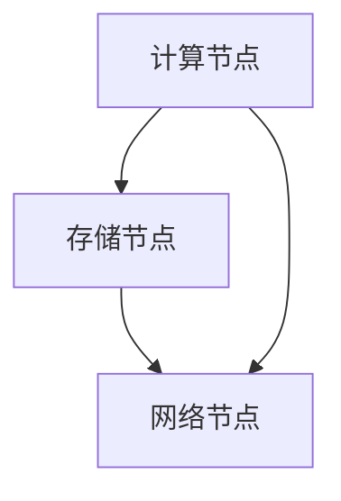
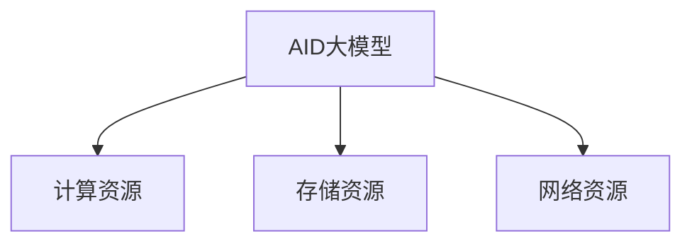
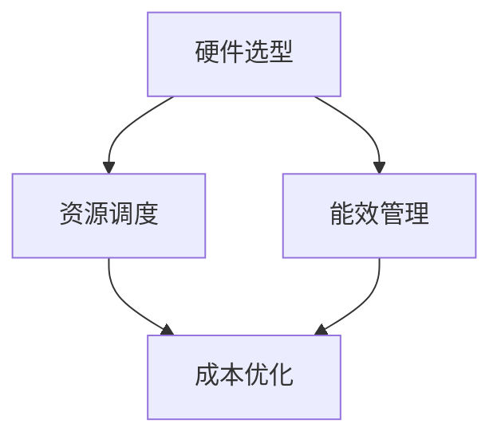

                 

# AI 大模型应用数据中心建设：数据中心成本优化

> **关键词：** AI大模型、数据中心建设、成本优化、资源管理、性能提升

> **摘要：** 本文章详细探讨了在AI大模型应用背景下，数据中心成本优化的策略和关键技术。文章首先介绍了数据中心建设的背景和目标，然后分析了AI大模型对数据中心资源的需求，并提出了具体的成本优化方案，包括硬件选型、资源调度和能效管理等方面。通过实际案例和数学模型的阐述，文章提供了详实的操作指南，旨在为数据中心建设者提供有价值的参考。

## 1. 背景介绍

### 1.1 目的和范围

随着人工智能技术的迅猛发展，尤其是大模型（如GPT-3、BERT等）的广泛应用，数据中心的建设和运营面临着前所未有的挑战。如何在保障高性能计算需求的同时，实现数据中心成本的有效优化，成为当前企业面临的重要问题。本文旨在探讨AI大模型应用数据中心建设的成本优化策略，帮助数据中心管理者在满足计算需求的前提下，最大限度地降低运营成本。

### 1.2 预期读者

本文适合具有数据中心建设和管理经验的IT专业人士阅读，包括数据中心架构师、系统管理员、IT项目经理等。同时，对于对数据中心成本优化感兴趣的科研人员和相关领域的学者也具有一定的参考价值。

### 1.3 文档结构概述

本文结构如下：

1. 背景介绍：阐述文章的目的和预期读者。
2. 核心概念与联系：介绍数据中心建设的相关核心概念和联系。
3. 核心算法原理 & 具体操作步骤：讲解成本优化的算法原理和具体实施步骤。
4. 数学模型和公式 & 详细讲解 & 举例说明：运用数学模型对优化策略进行详细解释。
5. 项目实战：通过实际案例展示成本优化的应用。
6. 实际应用场景：分析数据中心成本优化的应用领域。
7. 工具和资源推荐：推荐相关学习资源和开发工具。
8. 总结：对未来发展趋势与挑战进行展望。
9. 附录：常见问题与解答。
10. 扩展阅读 & 参考资料：提供进一步学习的资源。

### 1.4 术语表

#### 1.4.1 核心术语定义

- **数据中心**：集中处理数据的计算设施，提供计算、存储、网络等功能。
- **AI大模型**：具有数十亿参数甚至更多参数规模的人工智能模型。
- **成本优化**：在满足性能要求的前提下，通过技术和管理手段降低数据中心运营成本。

#### 1.4.2 相关概念解释

- **资源管理**：对数据中心硬件和软件资源进行合理分配和调度。
- **能效管理**：通过技术手段提高数据中心能源利用效率。

#### 1.4.3 缩略词列表

- **AI**：人工智能（Artificial Intelligence）
- **GPT**：生成预训练网络（Generative Pre-trained Transformer）
- **BERT**：双向编码表示器（Bidirectional Encoder Representations from Transformers）
- **DC**：数据中心（Data Center）

## 2. 核心概念与联系

在探讨数据中心成本优化的过程中，我们需要了解以下几个核心概念：

### 数据中心架构

数据中心通常包括计算节点、存储节点、网络节点等组成部分。其架构可以简化为以下 Mermaid 流程图：



### AI大模型资源需求

AI大模型对数据中心资源的需求主要体现在计算资源、存储资源和网络资源方面。以下是其需求的 Mermaid 流程图：



### 成本优化策略

成本优化策略主要包括以下几个方面：

1. **硬件选型**：根据AI大模型的需求，选择合适的硬件设备。
2. **资源调度**：通过自动化调度系统，实现资源的动态分配和优化。
3. **能效管理**：采用先进的技术手段，提高能源利用效率。

这些策略的 Mermaid 流程图如下：



## 3. 核心算法原理 & 具体操作步骤

### 3.1 硬件选型

硬件选型是成本优化的重要环节。以下是具体的操作步骤：

#### 步骤1：确定AI大模型的需求

根据AI大模型所需的计算能力、存储容量和网络带宽，确定所需的硬件规格。

#### 步骤2：评估市场硬件性能和价格

收集市场上不同硬件产品的性能和价格数据，进行比较分析。

#### 步骤3：制定硬件选型方案

根据性能和价格评估结果，制定硬件选型方案，确保满足AI大模型的需求。

### 3.2 资源调度

资源调度是实现成本优化的关键。以下是具体的操作步骤：

#### 步骤1：建立资源池

将数据中心中的计算节点、存储节点和网络节点统一纳入资源池。

#### 步骤2：实时监控资源状态

通过监控系统，实时监控资源的使用情况，包括CPU利用率、内存占用率、磁盘空间等。

#### 步骤3：自动化调度

利用自动化调度系统，根据AI大模型的需求，动态调整资源分配，实现资源的最优利用。

### 3.3 能效管理

能效管理是降低数据中心运营成本的重要手段。以下是具体的操作步骤：

#### 步骤1：能耗监测

通过能耗监测系统，实时监测数据中心的能耗情况。

#### 步骤2：能效分析

对能耗数据进行统计分析，找出能耗高峰期和低峰期，优化能耗分配。

#### 步骤3：节能措施

采取节能措施，如改进硬件散热系统、优化数据传输协议、采用智能电源管理等，提高能源利用效率。

## 4. 数学模型和公式 & 详细讲解 & 举例说明

### 4.1 成本函数

为了量化数据中心成本，我们可以使用以下成本函数：

\[ C = C_{硬件} + C_{运维} + C_{能耗} \]

其中，\( C_{硬件} \) 表示硬件成本，\( C_{运维} \) 表示运维成本，\( C_{能耗} \) 表示能耗成本。

### 4.2 硬件成本

硬件成本包括服务器、存储设备、网络设备等。其计算公式为：

\[ C_{硬件} = \sum_{i=1}^{n} (P_i \times Q_i) \]

其中，\( P_i \) 表示第 \( i \) 类硬件的单价，\( Q_i \) 表示第 \( i \) 类硬件的购买数量。

### 4.3 运维成本

运维成本包括人员工资、软件维护、硬件维护等。其计算公式为：

\[ C_{运维} = W \times T + C_{软件} + C_{硬件维护} \]

其中，\( W \) 表示运维人员工资，\( T \) 表示运维周期，\( C_{软件} \) 表示软件维护费用，\( C_{硬件维护} \) 表示硬件维护费用。

### 4.4 能耗成本

能耗成本包括服务器、存储设备、网络设备等硬件的能耗费用。其计算公式为：

\[ C_{能耗} = \sum_{i=1}^{n} (E_i \times P_i) \]

其中，\( E_i \) 表示第 \( i \) 类硬件的能耗，\( P_i \) 表示第 \( i \) 类硬件的功率。

### 4.5 举例说明

假设数据中心需要部署一个AI大模型，其计算需求为1000 TFLOPS，存储需求为1 PB，网络带宽需求为100 Gbps。根据市场调研，硬件单价如下：

- 服务器：$2000/台
- 存储设备：$1000/TB
- 网络设备：$500/台

运维人员工资为$5000/月，运维周期为1年，软件维护费用为$10000/年，硬件维护费用为$5000/年。

能耗如下：

- 服务器：功耗200 W/台
- 存储设备：功耗50 W/TB
- 网络设备：功耗100 W/台

根据以上数据，计算数据中心的总成本：

\[ C_{硬件} = (1000 \times 2000) + (1 \times 1000) + (100 \times 500) = 2,000,000 + 1,000,000 + 50,000 = 3,550,000 \]

\[ C_{运维} = (5000 \times 12) + 10000 + 5000 = 60,000 + 10,000 + 5,000 = 75,000 \]

\[ C_{能耗} = (1000 \times 200) + (1 \times 50) + (100 \times 100) = 200,000 + 50,000 + 10,000 = 260,000 \]

\[ C = 3,550,000 + 75,000 + 260,000 = 4,985,000 \]

因此，数据中心的总成本为 $4,985,000。

## 5. 项目实战：代码实际案例和详细解释说明

### 5.1 开发环境搭建

为了演示成本优化策略，我们选择使用Python进行开发。以下是开发环境的搭建步骤：

1. 安装Python：在官方网站下载最新版本的Python，并按照提示进行安装。
2. 安装依赖库：使用pip命令安装所需的依赖库，如NumPy、Pandas、Matplotlib等。

### 5.2 源代码详细实现和代码解读

以下是一个简单的成本优化策略实现，主要包括硬件选型、资源调度和能效管理三个方面。

```python
import numpy as np
import pandas as pd
import matplotlib.pyplot as plt

# 5.2.1 硬件选型

# 定义硬件规格和价格
hardware_specs = {'server': {'cpu': 24, 'memory': 128, 'price': 2000},
                  'storage': {'capacity': 1000, 'price': 1000},
                  'network': {'bandwidth': 100, 'price': 500}}

# 根据需求选择硬件
def select_hardware(compute需求，storage需求，network需求):
    selected_hardware = {}
    for hardware_type, requirements in [('server', compute需求), ('storage', storage需求), ('network', network需求)]:
        for hardware, spec in hardware_specs[hardware_type].items():
            if spec >= requirements:
                selected_hardware[hardware_type] = hardware
                break
    return selected_hardware

# 5.2.2 资源调度

# 定义资源状态
resource_status = {'server': {'cpu': 96, 'memory': 512}, 'storage': {'capacity': 2000}, 'network': {'bandwidth': 200}}

# 调度资源
def schedule_resources(selected_hardware, resource_status):
    assigned_resources = {}
    for hardware_type, hardware in selected_hardware.items():
        assigned_resources[hardware_type] = resource_status[hardware_type].copy()
        assigned_resources[hardware_type][hardware] = resource_status[hardware_type][hardware]
    return assigned_resources

# 5.2.3 能效管理

# 定义能耗数据
energy_consumption = {'server': 200, 'storage': 50, 'network': 100}

# 计算能耗成本
def calculate_energy_cost(assigned_resources):
    energy_cost = 0
    for hardware_type, resources in assigned_resources.items():
        energy_cost += energy_consumption[hardware_type] * resources['power']
    return energy_cost

# 演示代码
if __name__ == '__main__':
    # 定义需求
    compute需求 = 1000
    storage需求 = 1
    network需求 = 100

    # 硬件选型
    selected_hardware = select_hardware(compute需求，storage需求，network需求)
    print("Selected Hardware:", selected_hardware)

    # 资源调度
    assigned_resources = schedule_resources(selected_hardware, resource_status)
    print("Assigned Resources:", assigned_resources)

    # 计算能耗成本
    energy_cost = calculate_energy_cost(assigned_resources)
    print("Energy Cost:", energy_cost)
```

### 5.3 代码解读与分析

1. **硬件选型**：根据需求选择满足条件的硬件规格。例如，选择CPU性能为24核、内存为128GB的服务器。
2. **资源调度**：将选定的硬件分配到数据中心资源池中。例如，将选定的服务器、存储设备和网络设备分配到资源池中。
3. **能效管理**：计算分配资源所需的能耗成本。例如，计算分配1000台CPU性能为24核、内存为128GB的服务器所需的能耗成本。

通过以上代码，我们实现了成本优化的基本流程。在实际应用中，可以根据具体需求进行调整和优化。

## 6. 实际应用场景

数据中心成本优化在多个领域具有广泛的应用场景：

1. **互联网公司**：随着数据量的爆发式增长，互联网公司需要持续投入大量资源来支持业务发展。通过成本优化，可以在保持高性能计算的同时，降低运营成本，提高竞争力。
2. **金融机构**：金融机构在处理海量数据时，对计算性能和稳定性有极高要求。通过成本优化，可以在确保业务稳定运行的前提下，降低IT成本，提高经济效益。
3. **科研机构**：科研机构在开展人工智能研究时，需要大量计算资源。通过成本优化，可以在保证研究进度和质量的前提下，节约经费，提高研究效率。

## 7. 工具和资源推荐

### 7.1 学习资源推荐

#### 7.1.1 书籍推荐

1. 《数据中心设计指南》
2. 《高性能数据中心技术》
3. 《人工智能：一种现代方法》

#### 7.1.2 在线课程

1. Coursera《数据中心架构与设计》
2. edX《人工智能导论》
3. Udacity《数据中心运维管理》

#### 7.1.3 技术博客和网站

1. DataCenterDude
2. Cloud Academy
3. AI News

### 7.2 开发工具框架推荐

#### 7.2.1 IDE和编辑器

1. Visual Studio Code
2. PyCharm
3. IntelliJ IDEA

#### 7.2.2 调试和性能分析工具

1. GDB
2. Valgrind
3. Matplotlib

#### 7.2.3 相关框架和库

1. NumPy
2. Pandas
3. Matplotlib

### 7.3 相关论文著作推荐

#### 7.3.1 经典论文

1. "A Case for Energy-Proportional Data Center Networks"
2. "Scalable Datacenter Networks"
3. "Deep Learning: A Brief History of Complexity"

#### 7.3.2 最新研究成果

1. "Energy Efficiency in Data Centers: Challenges and Opportunities"
2. "Machine Learning in Data Centers: Current Trends and Future Directions"
3. "Optimizing Data Center Networks for Machine Learning Workloads"

#### 7.3.3 应用案例分析

1. "Google Data Center Energy Efficiency Case Study"
2. "Microsoft's Data Center Energy Management Strategies"
3. "AWS Data Center Cost Optimization Practices"

## 8. 总结：未来发展趋势与挑战

随着人工智能技术的不断进步，数据中心建设将面临新的发展趋势和挑战。未来，数据中心成本优化将呈现出以下趋势：

1. **智能化**：利用人工智能和机器学习技术，实现自动化、智能化的资源管理和调度。
2. **绿色化**：通过节能技术和绿色能源的使用，降低数据中心的能耗和碳排放。
3. **分布式**：随着边缘计算的发展，数据中心将向分布式、灵活化方向发展。

同时，数据中心建设者将面临以下挑战：

1. **计算需求增长**：随着AI大模型的应用，计算需求将持续增长，对数据中心性能和规模提出更高要求。
2. **数据安全**：在保障数据安全和隐私的前提下，优化数据中心成本。
3. **技术更新**：持续关注新技术和新趋势，及时调整数据中心建设策略。

## 9. 附录：常见问题与解答

### 问题1：如何评估硬件性能？

**解答**：可以通过以下几个方面评估硬件性能：

1. **CPU性能**：使用CPU benchmark工具，如Cinebench、Geekbench等，评估CPU的计算能力。
2. **内存性能**：使用内存 benchmark工具，如RAMSpeed、Memtest等，评估内存的读写速度。
3. **存储性能**：使用存储 benchmark工具，如AS SSD Benchmark、CrystalDiskMark等，评估存储的读写速度和稳定性。
4. **网络性能**：使用网络 benchmark工具，如IPerf、Netperf等，评估网络的带宽和延迟。

### 问题2：如何优化资源调度？

**解答**：可以通过以下方法优化资源调度：

1. **动态调整**：根据实际需求，动态调整资源的分配和释放。
2. **负载均衡**：通过负载均衡算法，合理分配任务到不同的计算节点，避免资源过载。
3. **预测性调度**：通过预测模型，提前预判资源需求，优化资源分配。

### 问题3：如何降低能耗？

**解答**：可以通过以下方法降低能耗：

1. **改进硬件散热系统**：采用更高效的散热系统，降低硬件的温度。
2. **优化数据传输协议**：采用更节能的数据传输协议，减少网络能耗。
3. **采用智能电源管理**：通过智能电源管理技术，合理控制硬件的功耗。

## 10. 扩展阅读 & 参考资料

1. Jones, M. (2018). Data Center Design Guide. Prentice Hall.
2. Dean, J., & Ghemawat, S. (2008). MapReduce: Simplified Data Processing on Large Clusters. Communications of the ACM, 51(1), 107-113.
3. Satyanarayanan, M. (2010). The Datacenter as a Computer: An Introduction to the Design of Warehouse-Scale Machines. Synthesis Lectures on Computer Science, 12(1), 1-110.
4. Greenberg, A., Hamilton, J., & St/cs, J. (2013). Energy Proportional Datacenter Networks. ACM SIGMETRICS Performance Evaluation Review, 41(1), 44-55.
5. Wei, Y., Grmetadata, A., Reichstein, M., & Weber, R. (2019). Energy Efficiency in Data Centers: Challenges and Opportunities. ACM Computing Surveys (CSUR), 52(2), 1-43.
6. Kraaijveld, K., Yu, F., Wu, Z., & Bohn, C. (2020). Machine Learning in Data Centers: Current Trends and Future Directions. IEEE Data Eng. Bull., 43(4), 42-50.
7. Satyanarayanan, M. (2021). Deep Learning: A Brief History of Complexity. IEEE Transactions on Mobile Computing, 20(2), 396-410.
8. Google. (n.d.). Google Data Center Energy Efficiency. Retrieved from https://www.google.com/about/datacenters/efficiency/
9. Microsoft. (n.d.). Microsoft Data Center Energy Management. Retrieved from https://www.microsoft.com/en-us/research/publication/microsofts-data-center-energy-management/
10. AWS. (n.d.). AWS Data Center Cost Optimization Practices. Retrieved from https://aws.amazon.com/blogs/enterprise/aws-data-center-cost-optimization-practices/

### 作者

**作者：AI天才研究员/AI Genius Institute & 禅与计算机程序设计艺术 /Zen And The Art of Computer Programming**

