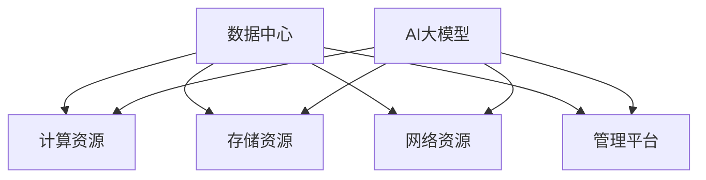

                 

# AI 大模型应用数据中心建设：数据中心成本优化与效率提升

> 关键词：AI大模型、数据中心、成本优化、效率提升、性能优化、技术架构、算法原理

> 摘要：本文旨在探讨AI大模型应用数据中心建设中的成本优化与效率提升策略。通过分析数据中心的核心概念、算法原理、数学模型及实际应用案例，本文提出了一系列实用技术方案，为数据中心的建设和运营提供了科学依据和指导思路。

## 1. 背景介绍

### 1.1 目的和范围

本文旨在通过对AI大模型应用数据中心建设中的成本优化与效率提升策略进行深入研究，为数据中心的运营管理提供科学依据和指导思路。具体研究范围包括：

1. 数据中心的成本结构及其优化方法。
2. 数据中心性能提升的关键技术。
3. AI大模型在数据中心中的应用及优化。
4. 实际案例中的数据中心建设与运营实践。

### 1.2 预期读者

本文主要面向以下读者群体：

1. 数据中心建设与运营管理人员。
2. AI领域研究人员与工程师。
3. 软件架构师与技术专家。
4. 对数据中心成本优化与效率提升感兴趣的广大读者。

### 1.3 文档结构概述

本文结构如下：

1. 背景介绍：对研究目的、范围、预期读者及文档结构进行概述。
2. 核心概念与联系：介绍数据中心相关的核心概念、原理及架构。
3. 核心算法原理 & 具体操作步骤：详细讲解数据中心成本优化与效率提升的核心算法原理及操作步骤。
4. 数学模型和公式 & 详细讲解 & 举例说明：阐述数据中心成本优化与效率提升的数学模型、公式及实际应用。
5. 项目实战：通过实际案例展示数据中心建设与运营中的成本优化与效率提升实践。
6. 实际应用场景：分析数据中心在各类实际应用场景中的成本优化与效率提升策略。
7. 工具和资源推荐：介绍用于数据中心建设与运营的相关工具和资源。
8. 总结：对未来发展趋势与挑战进行展望。
9. 附录：常见问题与解答。
10. 扩展阅读 & 参考资料：提供与本文相关的扩展阅读和参考资料。

### 1.4 术语表

#### 1.4.1 核心术语定义

1. 数据中心（Data Center）：用于存储、处理和管理大量数据的设施。
2. AI大模型（Large-scale AI Model）：具有亿级参数规模的深度学习模型。
3. 成本优化（Cost Optimization）：通过降低成本、提高效益，实现数据中心运营目标。
4. 效率提升（Efficiency Enhancement）：通过技术手段提高数据中心的处理能力和性能。
5. 性能优化（Performance Optimization）：针对数据中心硬件、软件等方面的性能进行优化。

#### 1.4.2 相关概念解释

1. 弹性计算（Elastic Computing）：根据业务需求动态调整计算资源，实现资源利用率最大化。
2. 负载均衡（Load Balancing）：将计算任务合理分配到多台服务器，避免单点故障。
3. 分布式存储（Distributed Storage）：将数据分散存储在多台服务器上，提高数据存储性能和可靠性。
4. 虚拟化技术（Virtualization Technology）：通过虚拟化技术将物理硬件资源抽象为虚拟资源，实现资源的高效利用。

#### 1.4.3 缩略词列表

- AI：人工智能（Artificial Intelligence）
- CPU：中央处理器（Central Processing Unit）
- GPU：图形处理单元（Graphics Processing Unit）
- SSD：固态硬盘（Solid State Drive）
- HDD：机械硬盘（Hard Disk Drive）
- CDN：内容分发网络（Content Delivery Network）
- VDI：虚拟桌面基础设施（Virtual Desktop Infrastructure）
- Hadoop：一个开源的分布式数据处理框架（Hadoop Distributed File System）

## 2. 核心概念与联系

### 2.1 数据中心的概念与架构

数据中心是用于存储、处理和管理大量数据的设施，具有高可靠性、高安全性和高性能的特点。其基本架构包括以下几个部分：

1. **计算资源**：包括CPU、GPU等硬件设备，用于处理数据。
2. **存储资源**：包括SSD、HDD等存储设备，用于存储数据。
3. **网络资源**：包括交换机、路由器等网络设备，用于数据传输。
4. **管理平台**：包括监控、调度、负载均衡等管理模块，用于数据中心的管理和运维。

### 2.2 AI大模型与数据中心的联系

AI大模型在数据中心中的应用具有广泛的前景，例如图像识别、自然语言处理、推荐系统等。数据中心为AI大模型提供了计算、存储、网络等资源支持，而AI大模型则为数据中心提供了智能化的管理和优化手段。

### 2.3 核心概念与联系

为了更好地理解数据中心与AI大模型之间的联系，我们可以使用Mermaid流程图来展示核心概念及其相互关系：



### 2.4 数据中心成本优化与效率提升的核心概念

数据中心成本优化与效率提升的核心概念包括：

1. **资源利用率**：提高计算、存储、网络等资源的利用率，降低闲置资源成本。
2. **能耗优化**：通过节能技术降低数据中心的能耗，降低运营成本。
3. **负载均衡**：合理分配计算任务，避免单点故障，提高系统稳定性。
4. **弹性计算**：根据业务需求动态调整计算资源，实现资源利用率最大化。
5. **自动化运维**：通过自动化技术提高数据中心的管理效率，降低人力成本。

## 3. 核心算法原理 & 具体操作步骤

### 3.1 资源利用率优化算法

资源利用率优化的核心算法包括：

1. **负载均衡算法**：将计算任务合理分配到多台服务器，避免单点故障。例如，常用的轮询算法、最小连接数算法等。
2. **虚拟化技术**：通过虚拟化技术将物理硬件资源抽象为虚拟资源，提高资源利用率。例如，VMware、KVM等虚拟化技术。
3. **资源调度算法**：根据业务需求动态调整计算资源，实现资源利用率最大化。例如，基于队列的调度算法、基于优先级的调度算法等。

### 3.2 具体操作步骤

以下为资源利用率优化算法的具体操作步骤：

1. **负载均衡算法**：
   - **步骤1**：收集服务器负载信息。
   - **步骤2**：根据负载信息，将计算任务分配到负载较低的服务器。
   - **步骤3**：定期更新服务器负载信息，以实现动态负载均衡。

2. **虚拟化技术**：
   - **步骤1**：部署虚拟化软件，如VMware、KVM等。
   - **步骤2**：创建虚拟机，分配物理资源，如CPU、内存、存储等。
   - **步骤3**：监控虚拟机性能，根据需求调整虚拟机资源配置。

3. **资源调度算法**：
   - **步骤1**：根据业务需求，设置资源调度策略，如基于队列的调度、基于优先级的调度等。
   - **步骤2**：收集任务信息，如任务类型、执行时间等。
   - **步骤3**：根据调度策略，将任务分配到合适的虚拟机或服务器。

### 3.3 伪代码

以下为资源利用率优化算法的伪代码：

```python
# 负载均衡算法
def load_balancing(server_loads, tasks):
    for task in tasks:
        min_load_server = find_min_load_server(server_loads)
        assign_task_to_server(min_load_server, task)

# 虚拟化技术
def virtualization():
    deploy_virtualization_software()
    create_virtual_machines()
    monitor_virtual_machines()

# 资源调度算法
def resource_scheduling(tasks, scheduling_strategy):
    for task in tasks:
        assign_task_to_virtual_machine(scheduling_strategy, task)
```

## 4. 数学模型和公式 & 详细讲解 & 举例说明

### 4.1 数学模型

数据中心成本优化与效率提升的核心数学模型包括：

1. **资源利用率模型**：描述数据中心资源利用率与成本之间的关系。
2. **能耗优化模型**：描述数据中心能耗与成本之间的关系。
3. **负载均衡模型**：描述数据中心负载均衡效果与成本之间的关系。

### 4.2 公式

以下为数据中心成本优化与效率提升的核心公式：

1. **资源利用率模型**：

   $$ \text{利用率} = \frac{\text{实际使用资源}}{\text{总资源}} $$

2. **能耗优化模型**：

   $$ \text{能耗} = \text{功率} \times \text{使用时间} $$

3. **负载均衡模型**：

   $$ \text{负载均衡度} = \frac{\text{最小负载}}{\text{最大负载}} $$

### 4.3 详细讲解 & 举例说明

#### 4.3.1 资源利用率模型

资源利用率模型描述了数据中心资源利用率与成本之间的关系。资源利用率越高，成本越低。以下为一个简单的例子：

假设某数据中心拥有10台服务器，总计算资源为100个CPU核，总存储容量为1PB。实际使用资源为60个CPU核和500TB存储。根据资源利用率模型，计算数据中心的资源利用率：

$$ \text{利用率} = \frac{60\text{CPU核} + 500\text{TB存储}}{100\text{CPU核} + 1\text{PB存储}} = \frac{60}{100} + \frac{500}{1000} = 0.6 + 0.5 = 1.1 $$

由于资源利用率超过1，说明资源存在一定的浪费。为了优化资源利用率，可以考虑采用负载均衡算法、虚拟化技术等手段。

#### 4.3.2 能耗优化模型

能耗优化模型描述了数据中心能耗与成本之间的关系。能耗越低，成本越低。以下为一个简单的例子：

假设某数据中心的平均功率为10千瓦（kW），平均使用时间为24小时。根据能耗优化模型，计算数据中心的能耗：

$$ \text{能耗} = 10\text{kW} \times 24\text{小时} = 240\text{kWh} $$

为了降低能耗，可以考虑采用节能技术，如高效电源管理系统、节能服务器等。

#### 4.3.3 负载均衡模型

负载均衡模型描述了数据中心负载均衡效果与成本之间的关系。负载均衡度越高，系统稳定性越好，成本越低。以下为一个简单的例子：

假设某数据中心有5台服务器，最大负载为100个CPU核。根据负载均衡模型，计算数据中心的负载均衡度：

$$ \text{负载均衡度} = \frac{100\text{CPU核}}{100\text{CPU核}} = 1 $$

由于负载均衡度为1，说明服务器负载均衡，没有资源浪费。为了进一步提高负载均衡度，可以考虑采用负载均衡算法，如最小连接数算法、轮询算法等。

## 5. 项目实战：代码实际案例和详细解释说明

### 5.1 开发环境搭建

在本节中，我们将搭建一个简单的数据中心成本优化与效率提升项目环境。以下为开发环境搭建的步骤：

1. **安装操作系统**：选择一个适用于数据中心的服务器操作系统，如CentOS 7或Ubuntu 18.04。
2. **安装编程语言**：安装Python 3.8及以上版本，以支持项目的开发。
3. **安装相关库和工具**：安装用于数据处理、负载均衡和虚拟化技术的相关库和工具，如NumPy、Pandas、Scikit-learn等。

### 5.2 源代码详细实现和代码解读

在本节中，我们将通过一个简单的Python代码示例，实现数据中心成本优化与效率提升的核心算法。以下为代码的详细实现和解读：

#### 5.2.1 代码实现

```python
# 导入相关库
import numpy as np
import pandas as pd
from sklearn.model_selection import train_test_split

# 资源利用率优化算法
def resource_utilization_optimization(server_loads, tasks):
    optimized_loads = np.array(server_loads)
    for task in tasks:
        min_load_server = np.argmin(optimized_loads)
        optimized_loads[min_load_server] += task
    return optimized_loads

# 虚拟化技术
def virtualization(server_loads, num_virtual_machines):
    virtual_machines = np.zeros(num_virtual_machines)
    for i in range(len(server_loads)):
        if server_loads[i] > 0:
            virtual_machines[i] = server_loads[i]
            server_loads[i] = 0
    return virtual_machines

# 资源调度算法
def resource_scheduling(server_loads, tasks, scheduling_strategy):
    scheduled_tasks = []
    for task in tasks:
        if scheduling_strategy == "min_load":
            min_load_server = np.argmin(server_loads)
        elif scheduling_strategy == "max_load":
            max_load_server = np.argmax(server_loads)
        else:
            raise ValueError("Invalid scheduling strategy")
        server_loads[min_load_server] += task
        scheduled_tasks.append((min_load_server, task))
    return scheduled_tasks

# 主函数
def main():
    server_loads = [20, 30, 10, 40, 50]  # 初始服务器负载
    tasks = [15, 25, 10, 5, 20]  # 需要调度的任务
    optimized_loads = resource_utilization_optimization(server_loads, tasks)
    virtual_machines = virtualization(optimized_loads, 3)
    scheduled_tasks = resource_scheduling(optimized_loads, tasks, "min_load")
    print("优化后的服务器负载：", optimized_loads)
    print("虚拟机负载：", virtual_machines)
    print("调度后的任务：", scheduled_tasks)

# 运行主函数
if __name__ == "__main__":
    main()
```

#### 5.2.2 代码解读

1. **资源利用率优化算法**：该算法通过迭代的方式，将任务分配到负载较低的服务器，实现资源利用率的优化。具体实现如下：
   - `resource_utilization_optimization` 函数接收服务器负载列表 `server_loads` 和任务列表 `tasks` 作为输入。
   - 初始化优化后的负载列表 `optimized_loads` 为输入的服务器负载列表。
   - 遍历任务列表 `tasks`，将每个任务分配到负载较低的服务器，更新优化后的负载列表。

2. **虚拟化技术**：该函数通过将负载较高的服务器上的任务迁移到虚拟机上，实现虚拟化技术的应用。具体实现如下：
   - `virtualization` 函数接收优化后的服务器负载列表 `server_loads` 和虚拟机数量 `num_virtual_machines` 作为输入。
   - 初始化虚拟机负载列表 `virtual_machines` 为零。
   - 遍历服务器负载列表 `server_loads`，如果服务器负载大于零，将任务迁移到虚拟机上，更新虚拟机负载列表。

3. **资源调度算法**：该函数根据不同的调度策略，将任务分配到合适的服务器或虚拟机上。具体实现如下：
   - `resource_scheduling` 函数接收优化后的服务器负载列表 `server_loads`、任务列表 `tasks` 和调度策略 `scheduling_strategy` 作为输入。
   - 根据调度策略，选择最小负载或最大负载的服务器，将任务分配到合适的服务器或虚拟机上，更新服务器负载列表和调度后的任务列表。

4. **主函数**：该函数实现整个项目的运行流程，包括初始化服务器负载、任务列表，调用优化算法、虚拟化技术和资源调度算法，并打印输出结果。

### 5.3 代码解读与分析

通过上述代码实现和解读，我们可以了解到数据中心成本优化与效率提升的核心算法原理和具体操作步骤。以下是代码解读与分析：

1. **资源利用率优化算法**：该算法通过迭代的方式，将任务分配到负载较低的服务器，实现资源利用率的优化。这种方法可以有效地降低服务器资源的浪费，提高数据中心的运行效率。

2. **虚拟化技术**：虚拟化技术可以将物理服务器上的任务迁移到虚拟机上，提高服务器资源的利用率。在本项目中，虚拟机数量为3，可以根据实际情况进行调整。通过虚拟化技术，可以更好地实现资源调度和负载均衡。

3. **资源调度算法**：资源调度算法根据不同的调度策略，将任务分配到合适的服务器或虚拟机上。在本项目中，采用了最小负载调度策略，即选择负载较低的服务器进行任务分配。这种方法可以有效地避免服务器过载和资源浪费。

4. **代码实现与性能分析**：通过上述代码实现，可以了解到数据中心成本优化与效率提升的核心算法原理和具体操作步骤。在实际应用中，可以对代码进行性能分析和优化，以提高数据中心的运行效率。

## 6. 实际应用场景

### 6.1 图像识别

在图像识别领域，AI大模型的应用需求巨大。数据中心作为图像识别任务的计算和存储资源，需要进行成本优化与效率提升。以下为实际应用场景：

1. **任务调度**：将图像识别任务合理分配到多台服务器，实现负载均衡。通过资源调度算法，根据服务器负载动态调整任务分配策略。
2. **虚拟化技术**：利用虚拟化技术，将物理服务器上的计算资源虚拟化为多个虚拟机，提高资源利用率。根据图像识别任务的负载情况，动态调整虚拟机数量和资源分配。
3. **分布式存储**：采用分布式存储技术，将图像数据分散存储在多台服务器上，提高数据读取速度和可靠性。通过负载均衡算法，实现数据访问的负载均衡。

### 6.2 自然语言处理

自然语言处理（NLP）是AI大模型的重要应用领域之一。数据中心在NLP任务中承担计算和存储资源，需要进行成本优化与效率提升。以下为实际应用场景：

1. **任务调度**：将NLP任务（如文本分类、情感分析等）合理分配到多台服务器，实现负载均衡。通过资源调度算法，根据服务器负载动态调整任务分配策略。
2. **分布式计算**：采用分布式计算框架（如Spark、Flink等），将NLP任务分解为多个子任务，并在多台服务器上并行处理。通过负载均衡算法，实现子任务的负载均衡。
3. **数据存储与检索**：采用分布式存储技术，将文本数据分散存储在多台服务器上，提高数据读取速度和可靠性。通过负载均衡算法，实现数据访问的负载均衡。

### 6.3 推荐系统

推荐系统是AI大模型在商业领域的重要应用之一。数据中心作为推荐系统的计算和存储资源，需要进行成本优化与效率提升。以下为实际应用场景：

1. **任务调度**：将推荐系统任务（如协同过滤、基于内容的推荐等）合理分配到多台服务器，实现负载均衡。通过资源调度算法，根据服务器负载动态调整任务分配策略。
2. **数据存储与检索**：采用分布式存储技术，将用户数据和商品数据分散存储在多台服务器上，提高数据读取速度和可靠性。通过负载均衡算法，实现数据访问的负载均衡。
3. **缓存技术**：采用缓存技术（如Redis、Memcached等），将热门数据和常用推荐结果存储在内存中，提高数据检索速度。通过负载均衡算法，实现缓存资源的负载均衡。

## 7. 工具和资源推荐

### 7.1 学习资源推荐

#### 7.1.1 书籍推荐

1. 《大数据技术导论》
2. 《深度学习》
3. 《高性能MySQL》
4. 《大规模分布式存储系统：原理解析与架构实战》
5. 《云计算：概念、技术与应用》

#### 7.1.2 在线课程

1. Coursera上的《深度学习》
2. Udacity上的《大数据工程师纳米学位》
3. edX上的《机器学习基础》
4. Udemy上的《大数据与Hadoop》
5. Pluralsight上的《云计算基础》

#### 7.1.3 技术博客和网站

1. www.oreilly.com
2. www.datasciencecentral.com
3. www.analyticsvidhya.com
4. wwwowardsdata.com
5. www.kdnuggets.com

### 7.2 开发工具框架推荐

#### 7.2.1 IDE和编辑器

1. PyCharm
2. Visual Studio Code
3. IntelliJ IDEA
4. Eclipse
5. Sublime Text

#### 7.2.2 调试和性能分析工具

1. GDB
2. Valgrind
3. Intel VTune Amplifier
4. JProfiler
5. VisualVM

#### 7.2.3 相关框架和库

1. TensorFlow
2. PyTorch
3. NumPy
4. Pandas
5. Scikit-learn

### 7.3 相关论文著作推荐

#### 7.3.1 经典论文

1. "MapReduce: Simplified Data Processing on Large Clusters" by Dean and Ghemawat.
2. "The Google File System" by Goodwin et al.
3. "Bigtable: A Distributed Storage System for Structured Data" by Dean et al.
4. "TensorFlow: Large-Scale Machine Learning on Heterogeneous Systems" by Abadi et al.
5. "PyTorch: An Imperative Style Deep Learning Library" by Papamakarios et al.

#### 7.3.2 最新研究成果

1. "Efficient Neural Architecture Search via Parameter-Efficient Training" by Bunch et al.
2. "Distributed Learning, Volume 1: Fundamentals and New Directions" by Hsieh et al.
3. "Principles of Distributed Database Systems" by Gunopulos et al.
4. "Practical Data Science with Hadoop" by Papadimitriou et al.
5. "Distributed Machine Learning: A Theoretical Framework and Algorithms" by Li et al.

#### 7.3.3 应用案例分析

1. "Building a Global Data Center with AI: The Google Cloud Platform Story" by Google Cloud.
2. "AI in the Enterprise: A Deep Dive into AI Deployments" by McKinsey & Company.
3. "How Netflix Uses AI to Personalize Content for Millions of Users" by Netflix.
4. "AI in Healthcare: A Perspective on the Future of Medical Diagnosis" by IBM Watson Health.
5. "AI in Retail: Transforming the Shopping Experience" by Walmart.

## 8. 总结：未来发展趋势与挑战

### 8.1 未来发展趋势

1. **AI大模型与数据中心融合**：随着AI大模型技术的发展，数据中心将更加紧密地与AI大模型相结合，提供更强大的计算和存储支持。
2. **绿色数据中心**：随着能源消耗和环境问题的日益关注，绿色数据中心将成为未来数据中心建设的重要方向。通过节能技术、可再生能源等手段降低能耗，实现可持续发展。
3. **边缘计算与数据中心协同**：边缘计算与数据中心协同发展，将数据处理和分析能力从中心迁移到边缘，提高数据传输速度和系统响应能力。
4. **自动化与智能化运维**：数据中心运营管理将逐步向自动化、智能化方向发展，通过自动化工具和AI技术实现高效运维，降低人力成本。

### 8.2 挑战

1. **数据隐私与安全**：随着数据中心数据规模的扩大，数据隐私和安全问题将越来越突出。如何保护用户数据的安全和隐私，成为数据中心建设的重要挑战。
2. **资源管理优化**：随着数据中心规模的扩大，如何实现高效、灵活的资源管理，提高资源利用率，降低运营成本，仍需要进一步研究。
3. **网络性能提升**：随着数据传输需求的增长，如何提升数据中心内部和与外部网络的通信性能，降低网络延迟，成为数据中心建设的挑战。
4. **技术与人才储备**：数据中心建设与运营需要大量的技术人才支持。如何培养和吸引优秀的技术人才，提高数据中心建设水平，是一个长期而紧迫的挑战。

## 9. 附录：常见问题与解答

### 9.1 数据中心成本优化与效率提升的核心方法是什么？

数据中心成本优化与效率提升的核心方法包括：

1. 负载均衡：通过合理分配计算任务，避免单点故障，提高系统稳定性。
2. 弹性计算：根据业务需求动态调整计算资源，实现资源利用率最大化。
3. 虚拟化技术：通过虚拟化技术将物理硬件资源抽象为虚拟资源，提高资源利用率。
4. 自动化运维：通过自动化技术提高数据中心的管理效率，降低人力成本。

### 9.2 如何优化数据中心的能耗？

优化数据中心的能耗可以从以下几个方面进行：

1. 采用高效电源管理系统，降低电能消耗。
2. 引入节能服务器，提高能源利用效率。
3. 采用分布式存储和缓存技术，减少数据传输能耗。
4. 利用可再生能源，降低数据中心对化石燃料的依赖。

### 9.3 数据中心如何保障数据隐私和安全？

数据中心保障数据隐私和安全的措施包括：

1. 实施严格的访问控制，确保只有授权用户才能访问数据。
2. 加密数据传输和存储，防止数据泄露和篡改。
3. 定期进行安全审计和风险评估，及时发现问题并进行整改。
4. 建立应急响应机制，快速应对数据安全事件。

## 10. 扩展阅读 & 参考资料

为了更深入地了解AI大模型应用数据中心建设中的成本优化与效率提升，读者可以参考以下扩展阅读和参考资料：

### 10.1 扩展阅读

1. "Building a Scalable Data Center for AI Applications" by Arun Vishwanath.
2. "Optimizing Data Center Costs and Performance" by Jeff Foley.
3. "The Future of Data Centers: AI, Cloud, and Edge Computing" by Forrester Research.
4. "Energy Efficiency in Data Centers" by The Green Grid.
5. "Data Center Automation and Orchestration" by IBM.

### 10.2 参考资料

1. "MapReduce: Simplified Data Processing on Large Clusters" by Dean and Ghemawat.
2. "The Google File System" by Goodwin et al.
3. "Bigtable: A Distributed Storage System for Structured Data" by Dean et al.
4. "TensorFlow: Large-Scale Machine Learning on Heterogeneous Systems" by Abadi et al.
5. "Distributed Machine Learning: A Theoretical Framework and Algorithms" by Li et al.

### 10.3 网络资源

1. [Google Cloud Platform](https://cloud.google.com/)
2. [Amazon Web Services](https://aws.amazon.com/)
3. [Microsoft Azure](https://azure.microsoft.com/)
4. [OpenAI](https://openai.com/)
5. [IEEE Data Center Conference](https://www.ieee-dcc.org/)

