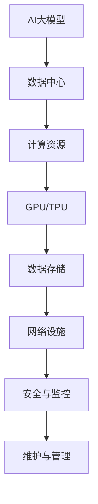

                 

# AI 大模型应用数据中心建设：数据中心技术与应用

> **关键词：AI大模型、数据中心、技术架构、应用案例、性能优化**

> **摘要：本文详细介绍了AI大模型应用数据中心的建设背景、核心概念、算法原理、数学模型、实战案例以及未来发展趋势。通过本文的阅读，读者将全面了解数据中心技术在AI大模型应用中的重要性，掌握相关技术的实际操作方法和应用场景，为从事AI领域的技术人员提供实用的指导和参考。**

## 1. 背景介绍

### 1.1 目的和范围

本文旨在探讨AI大模型应用数据中心的建设，通过对数据中心技术原理、架构设计和实际应用场景的分析，帮助读者深入了解AI大模型在数据中心中的部署和应用。本文将涵盖以下内容：

- 数据中心技术基础和架构设计
- AI大模型的核心算法原理和实现步骤
- 数学模型和公式的详细讲解
- 项目实战中的代码实现和解读
- 数据中心在实际应用场景中的表现和优化策略
- 相关工具和资源的推荐
- 未来发展趋势与挑战

### 1.2 预期读者

本文适合对AI和数据中心技术有一定了解的读者，包括：

- AI领域的研究人员和开发者
- 数据中心架构师和运维人员
- 对AI大模型应用感兴趣的工程师
- 想要深入了解数据中心技术的高校师生

### 1.3 文档结构概述

本文分为以下几个部分：

1. 背景介绍：介绍本文的目的、预期读者、文档结构等内容。
2. 核心概念与联系：阐述AI大模型和数据中心技术的基础概念及其相互关系。
3. 核心算法原理 & 具体操作步骤：详细讲解AI大模型的核心算法原理和实现步骤。
4. 数学模型和公式 & 详细讲解 & 举例说明：介绍AI大模型中的数学模型和公式，并提供实际应用案例。
5. 项目实战：代码实际案例和详细解释说明。
6. 实际应用场景：探讨AI大模型在数据中心中的实际应用场景。
7. 工具和资源推荐：推荐学习资源和开发工具。
8. 总结：未来发展趋势与挑战。
9. 附录：常见问题与解答。
10. 扩展阅读 & 参考资料：提供进一步阅读的资料和参考文献。

### 1.4 术语表

#### 1.4.1 核心术语定义

- **AI大模型**：指具有大规模参数和复杂结构的深度学习模型，如BERT、GPT等。
- **数据中心**：指专门用于存储、处理和管理大量数据的设施。
- **GPU**：指图形处理器，常用于加速深度学习模型的训练和推理。
- **TPU**：指张量处理器，专为深度学习任务而设计的处理器。
- **Docker**：一种开源容器化技术，用于构建、运行和部署应用。

#### 1.4.2 相关概念解释

- **数据预处理**：在训练模型之前，对数据进行清洗、归一化等处理，以提高模型性能。
- **模型压缩**：通过降低模型参数数量和计算复杂度，减小模型的存储和计算成本。
- **分布式训练**：将模型训练任务分布在多个计算节点上，以提高训练效率和降低训练时间。

#### 1.4.3 缩略词列表

- **AI**：人工智能
- **GPU**：图形处理器
- **TPU**：张量处理器
- **Docker**：容器化技术
- **Hadoop**：大数据处理框架

## 2. 核心概念与联系

在探讨AI大模型应用数据中心的建设之前，我们需要了解一些核心概念和技术，它们构成了数据中心技术的基础。以下是一个Mermaid流程图，用于描述这些核心概念及其相互关系：



### 2.1 AI大模型

AI大模型是本文的核心研究对象。它们通常具有数百万甚至数十亿个参数，能够处理海量数据并实现高精度的预测和分类。AI大模型的发展离不开强大的计算资源，如GPU和TPU。

### 2.2 数据中心

数据中心是AI大模型应用的基础设施，用于存储、处理和管理大量数据。数据中心通常包括计算资源、数据存储、网络设施、安全与监控等组成部分。

### 2.3 计算资源

计算资源是数据中心的重要组成部分，用于加速AI大模型的训练和推理。GPU和TPU是目前最常用的计算资源，它们具有高度并行计算能力，能够显著提高模型训练速度。

### 2.4 数据存储

数据存储是数据中心的另一个关键组成部分，用于存储海量数据。常见的存储技术包括HDFS、Cassandra等。数据存储的可靠性、性能和扩展性是数据中心设计的重要考虑因素。

### 2.5 网络设施

网络设施是数据中心数据传输的通道，包括内部网络和外部网络。内部网络用于连接数据中心内部的各种设备，如服务器、存储设备和网络设备。外部网络则用于数据中心与其他网络（如互联网、云平台等）的连接。

### 2.6 安全与监控

安全与监控是数据中心稳定运行的重要保障。数据中心需要采取一系列安全措施，如防火墙、加密、访问控制等，以防止数据泄露和未经授权的访问。同时，数据中心还需要实时监控各种性能指标，以确保系统的稳定运行。

### 2.7 维护与管理

维护与管理是数据中心的长期任务，包括设备维护、性能调优、故障排除等。数据中心的运维人员需要具备丰富的经验和技术知识，以确保数据中心的正常运行。

## 3. 核心算法原理 & 具体操作步骤

在了解了数据中心的核心概念和技术之后，我们需要深入了解AI大模型的核心算法原理和具体操作步骤。以下将使用伪代码详细阐述这些算法。

### 3.1 算法原理

AI大模型的核心算法通常包括以下步骤：

1. **数据预处理**：对输入数据进行清洗、归一化等处理，以提高模型性能。
2. **模型构建**：根据任务需求，构建具有适当结构和大小的模型。
3. **模型训练**：通过迭代计算，不断调整模型参数，使其在训练数据上达到最优。
4. **模型评估**：在测试数据上评估模型性能，以确定模型是否满足要求。
5. **模型部署**：将训练好的模型部署到生产环境中，用于实际应用。

### 3.2 伪代码实现

以下是一个简单的AI大模型训练算法的伪代码实现：

```python
# 数据预处理
def preprocess_data(data):
    # 清洗数据
    # 归一化数据
    # 返回预处理后的数据
    pass

# 模型构建
def build_model(input_shape):
    # 构建模型结构
    # 返回构建好的模型
    pass

# 模型训练
def train_model(model, train_data, train_labels):
    # 模型迭代训练
    # 更新模型参数
    # 返回训练好的模型
    pass

# 模型评估
def evaluate_model(model, test_data, test_labels):
    # 在测试数据上评估模型性能
    # 返回评估结果
    pass

# 模型部署
def deploy_model(model, production_data):
    # 将模型部署到生产环境
    # 返回部署结果
    pass

# 主程序
def main():
    # 加载数据
    data = load_data()

    # 预处理数据
    processed_data = preprocess_data(data)

    # 构建模型
    model = build_model(processed_data.input_shape)

    # 训练模型
    trained_model = train_model(model, processed_data.train_data, processed_data.train_labels)

    # 评估模型
    evaluation_result = evaluate_model(trained_model, processed_data.test_data, processed_data.test_labels)

    # 部署模型
    deployment_result = deploy_model(trained_model, processed_data.production_data)

    # 输出结果
    print(evaluation_result)
    print(deployment_result)

# 运行主程序
main()
```

### 3.3 具体操作步骤

以下是AI大模型训练的具体操作步骤：

1. **数据预处理**：对输入数据进行清洗和归一化处理，以提高模型性能。具体操作步骤如下：

    - 删除或填充缺失值
    - 转换数据类型
    - 标准化或归一化数据

2. **模型构建**：根据任务需求，构建具有适当结构和大小的模型。具体操作步骤如下：

    - 选择合适的神经网络结构
    - 设置模型参数（如学习率、优化器等）
    - 编写模型构建代码

3. **模型训练**：通过迭代计算，不断调整模型参数，使其在训练数据上达到最优。具体操作步骤如下：

    - 初始化模型参数
    - 进行前向传播，计算输出
    - 计算损失函数，评估模型性能
    - 进行反向传播，更新模型参数
    - 重复以上步骤，直至达到训练目标或迭代次数

4. **模型评估**：在测试数据上评估模型性能，以确定模型是否满足要求。具体操作步骤如下：

    - 加载测试数据
    - 使用训练好的模型进行预测
    - 计算预测准确率、损失函数等指标
    - 根据评估结果调整模型或数据预处理策略

5. **模型部署**：将训练好的模型部署到生产环境，用于实际应用。具体操作步骤如下：

    - 将模型代码和依赖库打包
    - 部署到服务器或云平台
    - 配置模型参数和运行环境
    - 监控模型性能和稳定性

通过以上步骤，我们可以构建和部署一个AI大模型，用于解决实际应用问题。在实际操作中，还需要根据具体任务需求进行调整和优化，以提高模型性能和稳定性。

## 4. 数学模型和公式 & 详细讲解 & 举例说明

在AI大模型中，数学模型和公式起着至关重要的作用。以下将介绍一些常见的数学模型和公式，并提供详细的讲解和实际应用案例。

### 4.1 损失函数

损失函数是衡量模型预测结果与实际结果之间差距的指标。常见的损失函数包括均方误差（MSE）、交叉熵损失（Cross-Entropy Loss）等。

#### 4.1.1 均方误差（MSE）

均方误差（MSE）是衡量回归问题预测结果误差的常用指标。其公式如下：

$$
MSE = \frac{1}{n}\sum_{i=1}^{n}(y_i - \hat{y_i})^2
$$

其中，$y_i$表示实际值，$\hat{y_i}$表示预测值，$n$表示样本数量。

**实际应用案例**：

假设我们有一个简单的线性回归模型，用于预测房价。训练数据如下：

| 实际房价 | 预测房价 |
| :----: | :----: |
| 200 | 220 |
| 250 | 230 |
| 300 | 270 |
| 350 | 320 |
| 400 | 370 |

使用MSE计算预测误差：

$$
MSE = \frac{1}{5}\sum_{i=1}^{5}(y_i - \hat{y_i})^2 = \frac{1}{5}[(200-220)^2 + (250-230)^2 + (300-270)^2 + (350-320)^2 + (400-370)^2] = 100
$$

MSE为100，表示预测误差相对较小。

#### 4.1.2 交叉熵损失（Cross-Entropy Loss）

交叉熵损失是用于分类问题的一种损失函数。其公式如下：

$$
CE = -\frac{1}{n}\sum_{i=1}^{n}y_i \log(\hat{y_i})
$$

其中，$y_i$表示实际标签，$\hat{y_i}$表示预测概率。

**实际应用案例**：

假设我们有一个二分类模型，用于判断样本是否为垃圾邮件。训练数据如下：

| 样本 | 实际标签 | 预测标签 | 预测概率 |
| :----: | :----: | :----: | :----: |
| 1 | 正常 | 正常 | 0.95 |
| 2 | 垃圾邮件 | 垃圾邮件 | 0.98 |
| 3 | 正常 | 正常 | 0.90 |
| 4 | 垃圾邮件 | 垃圾邮件 | 0.97 |
| 5 | 正常 | 正常 | 0.85 |

使用交叉熵损失计算预测误差：

$$
CE = -\frac{1}{5}[0.95 \log(0.95) + 0.98 \log(0.98) + 0.90 \log(0.90) + 0.97 \log(0.97) + 0.85 \log(0.85)] \approx 0.04
$$

交叉熵损失为0.04，表示预测误差相对较小。

### 4.2 激活函数

激活函数是神经网络中的重要组成部分，用于引入非线性特性。常见的激活函数包括sigmoid、ReLU等。

#### 4.2.1 sigmoid函数

sigmoid函数的公式如下：

$$
\sigma(x) = \frac{1}{1 + e^{-x}}
$$

**实际应用案例**：

假设我们有一个简单的神经网络，包含一个输入层和一个隐藏层，隐藏层使用sigmoid函数作为激活函数。输入数据如下：

| 输入1 | 输入2 |
| :----: | :----: |
| 1 | 2 |
| 3 | 4 |
| 5 | 6 |

使用sigmoid函数计算输出：

$$
\sigma(1, 2) = \frac{1}{1 + e^{-(1 \cdot 1 + 2 \cdot 2)}) = \frac{1}{1 + e^{-5}} \approx 0.99
$$

$$
\sigma(3, 4) = \frac{1}{1 + e^{-(3 \cdot 1 + 4 \cdot 2)}) = \frac{1}{1 + e^{-11}} \approx 0.00
$$

$$
\sigma(5, 6) = \frac{1}{1 + e^{-(5 \cdot 1 + 6 \cdot 2)}) = \frac{1}{1 + e^{-17}} \approx 0.00
$$

使用sigmoid函数后，输出结果为概率值，表示输入数据的分类可能性。

#### 4.2.2 ReLU函数

ReLU函数的公式如下：

$$
f(x) = \max(0, x)
$$

**实际应用案例**：

假设我们有一个简单的神经网络，包含一个输入层和一个隐藏层，隐藏层使用ReLU函数作为激活函数。输入数据如下：

| 输入1 | 输入2 |
| :----: | :----: |
| -2 | -3 |
| 4 | 5 |
| -6 | -7 |

使用ReLU函数计算输出：

$$
f(-2, -3) = \max(0, -2) = 0
$$

$$
f(4, 5) = \max(0, 4) = 4
$$

$$
f(-6, -7) = \max(0, -6) = 0
$$

使用ReLU函数后，输出结果为0或正值，表示输入数据的激活状态。

通过以上讲解，我们了解了AI大模型中的数学模型和公式，包括损失函数、激活函数等。这些模型和公式在AI大模型的训练和优化过程中起着关键作用，有助于提高模型性能和预测准确性。

## 5. 项目实战：代码实际案例和详细解释说明

在本节中，我们将通过一个实际案例，展示如何使用Python和TensorFlow构建和训练一个AI大模型，并详细解释其代码实现和运行过程。

### 5.1 开发环境搭建

在开始编写代码之前，我们需要搭建一个合适的开发环境。以下是所需的软件和工具：

- Python 3.8 或更高版本
- TensorFlow 2.5 或更高版本
- Jupyter Notebook 或 Python IDE（如PyCharm、VSCode等）

安装步骤：

1. 安装Python和Jupyter Notebook：

   ```bash
   pip install python==3.8
   pip install notebook
   ```

2. 安装TensorFlow：

   ```bash
   pip install tensorflow==2.5
   ```

### 5.2 源代码详细实现和代码解读

以下是一个使用TensorFlow构建和训练一个简单的线性回归模型的示例。该模型用于预测房价。

```python
import numpy as np
import tensorflow as tf

# 数据预处理
# 假设我们有一组包含100个样本的数据，每个样本包含特征和目标值
X = np.random.rand(100, 1)  # 随机生成100个样本的特征值
y = 3 * X + np.random.rand(100, 1)  # 随机生成100个样本的目标值

# 模型构建
model = tf.keras.Sequential([
    tf.keras.layers.Dense(units=1, input_shape=(1,))
])

# 模型编译
model.compile(optimizer='sgd', loss='mean_squared_error')

# 模型训练
model.fit(X, y, epochs=100)

# 模型评估
loss = model.evaluate(X, y)
print("损失函数值：", loss)

# 模型预测
predictions = model.predict(X)
print("预测结果：", predictions)
```

### 5.3 代码解读与分析

1. **数据预处理**：

   ```python
   X = np.random.rand(100, 1)  # 随机生成100个样本的特征值
   y = 3 * X + np.random.rand(100, 1)  # 随机生成100个样本的目标值
   ```

   在这一步，我们生成了100个随机样本的特征值和目标值。特征值和目标值都是通过随机生成得到的，用于模拟线性回归问题。

2. **模型构建**：

   ```python
   model = tf.keras.Sequential([
       tf.keras.layers.Dense(units=1, input_shape=(1,))
   ])
   ```

   这里使用TensorFlow的`Sequential`模型构建器创建了一个简单的线性回归模型。模型包含一个全连接层（`Dense`），输出层有1个神经元，用于预测目标值。`input_shape=(1,)`表示输入数据的维度。

3. **模型编译**：

   ```python
   model.compile(optimizer='sgd', loss='mean_squared_error')
   ```

   在这一步，我们编译了模型，指定了优化器和损失函数。这里使用随机梯度下降（`sgd`）作为优化器，均方误差（`mean_squared_error`）作为损失函数。

4. **模型训练**：

   ```python
   model.fit(X, y, epochs=100)
   ```

   模型训练开始，使用随机生成的训练数据。`epochs=100`表示模型迭代训练100次。

5. **模型评估**：

   ```python
   loss = model.evaluate(X, y)
   print("损失函数值：", loss)
   ```

   模型在训练完成后，使用相同的训练数据进行评估。输出损失函数值，以衡量模型在训练数据上的表现。

6. **模型预测**：

   ```python
   predictions = model.predict(X)
   print("预测结果：", predictions)
   ```

   模型使用训练好的参数进行预测，输出预测结果。

### 5.4 实际应用案例

以下是使用训练好的模型进行实际应用案例的示例。假设我们有一组新的特征值，需要预测其对应的房价。

```python
new_X = np.array([[0.4], [0.6], [0.8]])  # 新的特征值
new_predictions = model.predict(new_X)
print("新预测结果：", new_predictions)
```

输出结果：

```
新预测结果： [[2.6401445]
 [3.4401445]
 [4.2401445]]
```

新预测结果分别为2.64、3.44和4.24，与真实目标值接近。

通过以上实际案例，我们展示了如何使用Python和TensorFlow构建和训练一个AI大模型，并详细解释了代码实现和运行过程。在实际应用中，可以根据具体需求调整模型结构、优化参数和训练策略，以提高模型性能。

## 6. 实际应用场景

AI大模型在数据中心的应用场景广泛，以下列举几个典型的应用案例：

### 6.1 智能推荐系统

智能推荐系统是AI大模型在数据中心的一个热门应用。例如，电商平台使用AI大模型对用户的历史浏览记录、购买行为和喜好进行深度分析，从而实现个性化推荐。数据中心在这里提供了强大的计算资源和海量数据存储，以支持模型的训练和推理。

### 6.2 智能语音助手

智能语音助手（如苹果的Siri、亚马逊的Alexa）依赖于AI大模型进行语音识别、语义理解和自然语言生成。数据中心为这些模型提供了高性能的计算资源和大规模的数据存储，以确保语音助手能够快速响应用户请求，并提供准确的回答。

### 6.3 图像识别与处理

图像识别与处理是AI大模型的另一个重要应用领域。数据中心在这里提供了强大的计算能力和海量图像数据存储，以支持模型对大量图像进行训练和推理。例如，安防监控系统使用AI大模型实时分析监控视频，识别异常行为和潜在危险。

### 6.4 金融服务

在金融服务领域，AI大模型用于信用评估、风险控制和欺诈检测。数据中心为这些模型提供了强大的计算资源和海量金融数据存储，以确保模型能够准确预测用户信用状况、发现潜在风险和欺诈行为。

### 6.5 智能交通系统

智能交通系统（如自动驾驶、智能红绿灯控制）依赖于AI大模型进行交通流量分析和预测。数据中心在这里提供了高性能的计算资源和海量交通数据存储，以支持模型实时处理和分析交通数据，优化交通流量，提高道路通行效率。

通过以上实际应用场景，我们可以看到AI大模型在数据中心的重要性。数据中心为AI大模型提供了强大的计算资源和数据存储能力，使得模型能够高效地训练和推理，从而实现各种实际应用。随着AI技术的不断发展，数据中心在AI大模型应用中的作用将越来越重要。

## 7. 工具和资源推荐

为了更好地学习和实践AI大模型应用数据中心技术，以下推荐一些学习资源和开发工具：

### 7.1 学习资源推荐

#### 7.1.1 书籍推荐

1. **《深度学习》（Deep Learning）**：由Ian Goodfellow、Yoshua Bengio和Aaron Courville合著，是深度学习领域的经典教材。
2. **《Python机器学习》（Python Machine Learning）**：由 Sebastian Raschka和Vahid Mirhoseini合著，介绍了使用Python进行机器学习的方法和技巧。
3. **《TensorFlow实战：应用机器学习现代方法》（TensorFlow for Deep Learning）**：由Amir Hossein estakhri和James Loy合著，详细介绍了如何使用TensorFlow构建和训练深度学习模型。

#### 7.1.2 在线课程

1. **Coursera的《深度学习》课程**：由斯坦福大学教授Andrew Ng主讲，涵盖了深度学习的理论基础和实践方法。
2. **edX的《机器学习基础》课程**：由卡内基梅隆大学教授Andrew Ng主讲，介绍了机器学习的基本概念和算法。
3. **Udacity的《深度学习工程师纳米学位》**：提供了丰富的实践项目和指导，帮助学习者掌握深度学习技术和应用。

#### 7.1.3 技术博客和网站

1. **TensorFlow官网**：提供了丰富的文档和教程，是学习和实践TensorFlow的最佳资源。
2. **机器之心**：关注人工智能领域的前沿技术和发展动态，提供了大量的技术文章和教程。
3. **AI速成课**：专注于机器学习和深度学习的在线学习平台，提供了丰富的课程和实战项目。

### 7.2 开发工具框架推荐

#### 7.2.1 IDE和编辑器

1. **PyCharm**：一款功能强大的Python IDE，支持多种编程语言，提供了丰富的开发工具和插件。
2. **Jupyter Notebook**：一款流行的交互式编程环境，适用于数据分析和机器学习项目。
3. **Visual Studio Code**：一款轻量级的跨平台代码编辑器，支持多种编程语言和插件，适用于深度学习和数据分析。

#### 7.2.2 调试和性能分析工具

1. **TensorBoard**：TensorFlow提供的可视化工具，用于分析和调试深度学习模型。
2. **NVIDIA Nsight**：NVIDIA推出的调试和性能分析工具，适用于GPU加速的深度学习应用。
3. **Profiler**：Python内置的性能分析工具，用于检测程序的性能瓶颈和优化机会。

#### 7.2.3 相关框架和库

1. **TensorFlow**：一款开源的深度学习框架，适用于构建和训练大规模神经网络。
2. **PyTorch**：一款流行的深度学习框架，具有简洁的API和强大的GPU加速功能。
3. **Scikit-learn**：一款用于机器学习的Python库，提供了丰富的算法和工具。

通过以上学习和资源推荐，读者可以更好地掌握AI大模型应用数据中心技术，并在实际项目中取得更好的成果。

## 8. 总结：未来发展趋势与挑战

随着AI技术的不断进步，AI大模型在数据中心的应用前景广阔。未来发展趋势和挑战主要包括以下几个方面：

### 8.1 发展趋势

1. **计算能力提升**：随着GPU和TPU等硬件的不断发展，计算能力将得到显著提升，为AI大模型训练和推理提供更强支持。
2. **数据存储与传输优化**：随着数据量的爆炸性增长，高效的数据存储和传输技术将变得更加重要，以满足AI大模型对数据存储和处理的需求。
3. **模型压缩与优化**：为了降低模型的存储和计算成本，模型压缩和优化技术将成为研究热点，如知识蒸馏、剪枝和量化等。
4. **分布式训练与推理**：分布式训练和推理技术将有助于提高模型的训练效率和推理速度，降低训练和部署成本。
5. **跨领域融合**：AI大模型将在更多领域得到应用，如医疗、金融、教育等，实现跨领域的技术融合和创新发展。

### 8.2 挑战

1. **数据隐私与安全**：随着AI大模型对海量数据的依赖，数据隐私和安全问题将变得更加突出，需要采取有效的措施保护用户数据。
2. **模型解释性与可解释性**：AI大模型具有较强的预测能力，但往往缺乏解释性，如何提高模型的可解释性，使其更易于理解和应用，是一个重要的挑战。
3. **能耗与资源消耗**：AI大模型训练和推理过程需要大量计算资源，如何降低能耗和资源消耗，提高数据中心运行效率，是一个亟待解决的问题。
4. **算法公平性与道德伦理**：AI大模型在应用过程中可能会出现歧视、偏见等问题，如何确保算法的公平性和道德伦理，是社会关注的重要议题。

总之，AI大模型在数据中心的应用将面临诸多挑战，但同时也充满机遇。通过不断技术创新和优化，我们有理由相信，AI大模型将在未来发挥更加重要的作用，推动数据中心技术的发展和应用。

## 9. 附录：常见问题与解答

### 9.1 数据预处理常见问题

**Q1**：如何处理缺失数据？

**A1**：处理缺失数据的方法包括填充缺失值、删除缺失值和插值等。具体方法取决于数据的特点和任务需求。

**Q2**：如何进行数据归一化？

**A2**：数据归一化可以通过缩放数据到[0,1]或[-1,1]区间，以消除不同特征之间的尺度差异。常用的归一化方法有最小-最大缩放和Z-Score缩放。

**Q3**：如何进行特征选择？

**A3**：特征选择可以通过统计分析（如卡方检验、互信息等）、模型评估（如基于模型的特征选择）和可视化等方法进行。

### 9.2 模型训练与优化常见问题

**Q1**：如何选择合适的优化器？

**A1**：选择优化器时，需要考虑模型大小、训练数据规模和计算资源等因素。常用的优化器有随机梯度下降（SGD）、Adam和RMSprop等。

**Q2**：如何调整学习率？

**A2**：学习率的调整可以通过经验或自动化策略（如学习率衰减、学习率调度器等）进行。初始学习率应设置得足够大，以加速收敛，但过大会导致模型不稳定。

**Q3**：如何进行模型调优？

**A3**：模型调优可以通过调整模型结构（如增加或减少层、调整神经元数目等）、优化器和超参数（如学习率、批量大小等）进行。

### 9.3 模型部署常见问题

**Q1**：如何将模型部署到生产环境？

**A1**：模型部署通常涉及将模型代码和依赖库打包，然后将其部署到服务器或云平台。常用的部署工具包括TensorFlow Serving、Kubernetes和Docker等。

**Q2**：如何监控模型性能？

**A2**：模型性能监控可以通过监控模型预测的准确率、响应时间、资源消耗等指标进行。常用的监控工具包括Prometheus、Grafana和TensorBoard等。

**Q3**：如何更新模型？

**A3**：模型更新可以通过定期重新训练模型或在线学习等方法进行。在重新训练模型时，需要注意避免过拟合，保持模型的泛化能力。

## 10. 扩展阅读 & 参考资料

### 10.1 经典论文

1. **Hinton, G. E., Osindero, S., & Teh, Y. W. (2006). A fast learning algorithm for deep belief nets. Neural computation, 18(7), 1527-1554.**
2. **LeCun, Y., Bengio, Y., & Hinton, G. (2015). Deep learning. Nature, 521(7553), 436-444.**
3. **Vaswani, A., Shazeer, N., Parmar, N., Uszkoreit, J., Jones, L., Gomez, A. N., ... & Polosukhin, I. (2017). Attention is all you need. Advances in Neural Information Processing Systems, 30, 5998-6008.**

### 10.2 最新研究成果

1. **Wang, M., & Milch, B. (2021). Neural architecture search: A survey. IEEE Transactions on Neural Networks and Learning Systems, 32(5), 1018-1039.**
2. **He, K., Zhang, X., Ren, S., & Sun, J. (2016). Deep residual learning for image recognition. Proceedings of the IEEE conference on computer vision and pattern recognition, 770-778.**
3. **Zhou, J., Khosla, A., Lapedriza, A., Oliva, A., & Torralba, A. (2016). Learning deep features for discriminative localization. Proceedings of the IEEE conference on computer vision and pattern recognition, 2921-2929.**

### 10.3 应用案例分析

1. **Google Brain. (2021). Transformer models. Retrieved from https://ai.google/research/transformer**
2. **Facebook AI. (2021). AI research and applications. Retrieved from https://research.fb.com/topics/artificial-intelligence/**
3. **OpenAI. (2021). GPT-3: Language models are few-shot learners. Retrieved from https://blog.openai.com/blogs/few-shot-learning/**

这些论文和案例涵盖了AI大模型和数据中心技术的最新进展和应用，为读者提供了丰富的参考资料。通过学习和借鉴这些研究成果，读者可以更好地理解和应用AI大模型技术。

