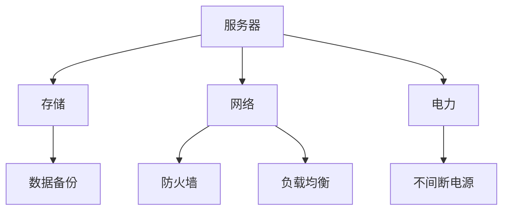
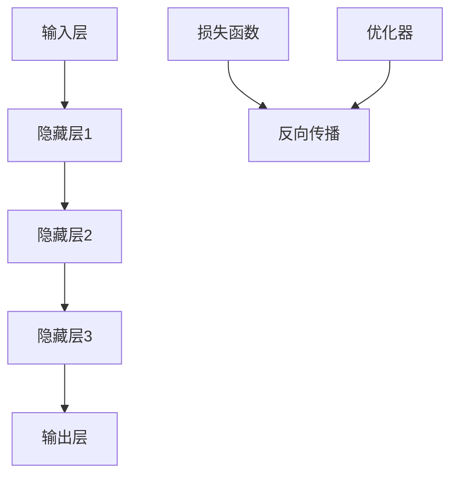
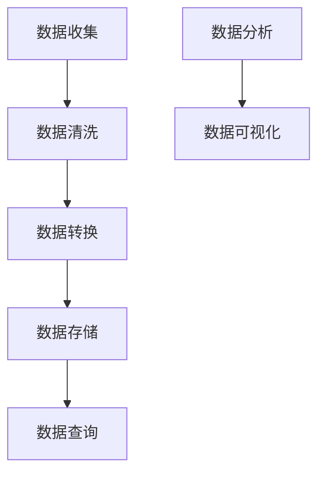
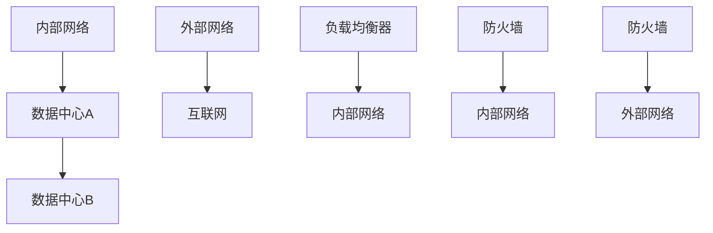

                 

# AI 大模型应用数据中心建设：数据中心技术与应用

> 关键词：AI 大模型，数据中心，技术架构，算法原理，数学模型，项目实战，应用场景

> 摘要：本文深入探讨了 AI 大模型应用数据中心建设的相关技术，从背景介绍、核心概念、算法原理、数学模型、项目实战到应用场景等方面进行了详细阐述，旨在为从事 AI 领域的技术人员和研究者提供有价值的参考。

## 1. 背景介绍

### 1.1 目的和范围

本文旨在探讨 AI 大模型应用数据中心建设的相关技术，重点关注以下几个方面：

- 数据中心基础设施的选型和设计
- AI 大模型的训练和推理优化
- 数据中心网络的架构设计
- 数据处理和存储技术
- 安全和隐私保护机制

### 1.2 预期读者

本文适合以下读者群体：

- 从事 AI 领域的技术人员
- 数据中心架构师和运维工程师
- AI 研究人员和研究生
- 对数据中心建设和 AI 应用感兴趣的从业者

### 1.3 文档结构概述

本文分为以下几个部分：

- 第1部分：背景介绍，包括目的和范围、预期读者、文档结构概述、术语表等。
- 第2部分：核心概念与联系，介绍 AI 大模型应用数据中心建设的核心概念和架构。
- 第3部分：核心算法原理 & 具体操作步骤，详细讲解 AI 大模型的训练和推理算法。
- 第4部分：数学模型和公式 & 详细讲解 & 举例说明，阐述 AI 大模型相关的数学模型和公式。
- 第5部分：项目实战：代码实际案例和详细解释说明，通过实际案例展示 AI 大模型在数据中心的应用。
- 第6部分：实际应用场景，探讨 AI 大模型在不同领域中的应用。
- 第7部分：工具和资源推荐，介绍相关学习资源、开发工具和框架。
- 第8部分：总结：未来发展趋势与挑战，分析 AI 大模型应用数据中心建设的未来趋势和挑战。
- 第9部分：附录：常见问题与解答，解答读者在阅读过程中可能遇到的疑问。
- 第10部分：扩展阅读 & 参考资料，提供更多相关领域的参考资料。

### 1.4 术语表

#### 1.4.1 核心术语定义

- AI 大模型：指具有大规模参数、高计算复杂度的深度学习模型。
- 数据中心：指用于存储、处理和传输大量数据的服务器集群。
- 数据处理：指对数据进行收集、存储、清洗、转换和计算等操作。
- 数据存储：指将数据保存到硬盘、内存等存储介质中。
- 数据传输：指在数据中心内部或外部传输数据。

#### 1.4.2 相关概念解释

- 深度学习：一种基于多层神经网络的人工智能技术，通过学习大量数据来提取特征并实现分类、回归等任务。
- 卷积神经网络（CNN）：一种深度学习模型，适用于图像和视频等数据。
- 循环神经网络（RNN）：一种深度学习模型，适用于序列数据，如文本、语音等。
- 强化学习：一种通过与环境交互来学习最优策略的深度学习模型。

#### 1.4.3 缩略词列表

- AI：人工智能
- CNN：卷积神经网络
- RNN：循环神经网络
- ML：机器学习
- DL：深度学习
- HPC：高性能计算
- GPU：图形处理器
- CPU：中央处理器

## 2. 核心概念与联系

在 AI 大模型应用数据中心建设过程中，核心概念和架构的清晰理解至关重要。以下是对相关核心概念的原理和架构的概述，以及相应的 Mermaid 流程图。

### 2.1 数据中心基础设施

数据中心基础设施包括服务器、存储、网络和电力等关键组件。其架构如下：



### 2.2 AI 大模型

AI 大模型的核心是深度学习模型，其架构主要包括输入层、隐藏层和输出层。以下是其 Mermaid 流程图：



### 2.3 数据处理和存储

数据处理和存储涉及数据收集、清洗、转换、存储和查询等步骤。其 Mermaid 流程图如下：



### 2.4 数据中心网络

数据中心网络包括内部网络和外部网络，其架构如下：



## 3. 核心算法原理 & 具体操作步骤

### 3.1 AI 大模型训练算法

AI 大模型的训练主要基于深度学习算法，以下是其核心原理和具体操作步骤：

#### 3.1.1 核心原理

深度学习模型通过学习大量数据，自动提取特征并实现分类、回归等任务。其核心算法包括：

- **反向传播算法**：用于计算模型参数的梯度，优化模型参数。
- **优化器**：如随机梯度下降（SGD）、Adam 等，用于调整模型参数。

#### 3.1.2 具体操作步骤

1. 数据预处理：对数据进行清洗、归一化等处理。
2. 模型初始化：随机初始化模型参数。
3. 前向传播：输入数据经过模型处理，得到预测结果。
4. 损失计算：计算预测结果与真实结果之间的损失。
5. 反向传播：计算模型参数的梯度。
6. 梯度下降：根据梯度调整模型参数。
7. 评估模型：使用验证集或测试集评估模型性能。
8. 调整超参数：根据模型性能调整学习率、批量大小等超参数。
9. 重复步骤 3-8，直到模型性能满足要求。

### 伪代码：

```python
# 数据预处理
data = preprocess_data(input_data)

# 模型初始化
model = initialize_model()

# 迭代训练
for epoch in range(num_epochs):
    for batch in data:
        # 前向传播
        prediction = model.forward(batch.input)
        
        # 损失计算
        loss = compute_loss(prediction, batch.target)
        
        # 反向传播
        gradients = model.backward(loss)
        
        # 梯度下降
        model.update_params(gradients)
        
    # 评估模型
    performance = evaluate_model(model, validation_data)
    
    # 调整超参数
    adjust_hyperparameters(performance)

# 模型保存
save_model(model)
```

### 3.2 AI 大模型推理算法

AI 大模型推理主要用于在数据中心中快速处理大量请求。以下是其核心原理和具体操作步骤：

#### 3.2.1 核心原理

推理算法通过加载预训练好的模型，快速处理输入数据并输出预测结果。其主要目标是在保持模型性能的同时，提高推理速度。

- **模型压缩**：通过减少模型参数数量，降低模型大小和计算复杂度。
- **量化**：将浮点数权重转换为低精度整数，减少计算资源消耗。
- **并行推理**：在多核 CPU 或 GPU 上同时处理多个请求。

#### 3.2.2 具体操作步骤

1. 模型加载：从存储介质中加载预训练好的模型。
2. 数据预处理：对输入数据进行预处理，使其符合模型输入要求。
3. 模型推理：使用模型处理输入数据，得到预测结果。
4. 结果后处理：对预测结果进行后处理，如阈值处理、分类等。
5. 输出结果：将预测结果输出到客户端。

### 伪代码：

```python
# 模型加载
model = load_pretrained_model(model_path)

# 数据预处理
input_data = preprocess_input_data(raw_data)

# 模型推理
prediction = model.predict(input_data)

# 结果后处理
result = post_process_prediction(prediction)

# 输出结果
output_result(result)
```

## 4. 数学模型和公式 & 详细讲解 & 举例说明

### 4.1 损失函数

损失函数是深度学习模型训练过程中的核心组件，用于衡量预测结果与真实结果之间的差距。以下是一些常见的损失函数及其公式：

#### 4.1.1 交叉熵损失函数（Cross-Entropy Loss）

交叉熵损失函数常用于分类问题，其公式如下：

$$
L_{cross-entropy} = -\frac{1}{m} \sum_{i=1}^{m} y_{i} \log(p_{i})
$$

其中，$y_{i}$ 是真实标签，$p_{i}$ 是预测概率。

#### 4.1.2 均方误差损失函数（Mean Squared Error, MSE）

均方误差损失函数常用于回归问题，其公式如下：

$$
L_{MSE} = \frac{1}{2m} \sum_{i=1}^{m} (y_{i} - \hat{y}_{i})^2
$$

其中，$y_{i}$ 是真实值，$\hat{y}_{i}$ 是预测值。

#### 4.1.3 对数损失函数（Log Loss）

对数损失函数是交叉熵损失函数的对数形式，其公式如下：

$$
L_{log} = -\frac{1}{m} \sum_{i=1}^{m} y_{i} \log(\hat{y}_{i})
$$

### 4.2 优化器

优化器用于调整模型参数，以最小化损失函数。以下是一些常见的优化器及其公式：

#### 4.2.1 随机梯度下降（Stochastic Gradient Descent, SGD）

随机梯度下降是一种基于梯度的优化方法，其公式如下：

$$
w_{t+1} = w_{t} - \alpha \cdot \nabla_{w}L(w)
$$

其中，$w_{t}$ 是当前参数，$\alpha$ 是学习率，$\nabla_{w}L(w)$ 是损失函数关于参数的梯度。

#### 4.2.2 Adam 优化器

Adam 优化器是一种基于自适应学习率的优化方法，其公式如下：

$$
m_{t} = \beta_{1}m_{t-1} + (1 - \beta_{1})(\nabla_{w}L(w) - m_{t-1})
$$

$$
v_{t} = \beta_{2}v_{t-1} + (1 - \beta_{2})(\nabla_{w}L(w)^2 - v_{t-1})
$$

$$
w_{t+1} = w_{t} - \frac{\alpha}{\sqrt{1 - \beta_{2}^t}(1 - \beta_{1}^t)} \cdot \frac{m_{t}}{1 - \beta_{1}^t}
$$

其中，$\beta_{1}$ 和 $\beta_{2}$ 分别是动量参数，$m_{t}$ 和 $v_{t}$ 分别是指数加权平均值。

### 4.3 举例说明

假设我们有一个二分类问题，使用 sigmoid 函数作为激活函数，并使用交叉熵损失函数进行训练。以下是一个简单的例子：

```python
import numpy as np

# 参数初始化
w = np.random.randn(1)  # 初始化权重
alpha = 0.1  # 学习率
beta_1 = 0.9  # Adam 优化器的 beta_1
beta_2 = 0.999  # Adam 优化器的 beta_2

# 训练过程
for epoch in range(1000):
    # 前向传播
    z = np.dot(x, w)
    y_pred = sigmoid(z)
    
    # 损失计算
    loss = -np.log(y_pred) if y == 1 else -np.log(1 - y_pred)
    
    # 反向传播
    dz = y_pred - y
    
    # 更新权重
    w -= alpha * dz

# 预测
x_new = np.array([[1, 0], [0, 1], [1, 1]])
y_pred = sigmoid(np.dot(x_new, w))
```

## 5. 项目实战：代码实际案例和详细解释说明

### 5.1 开发环境搭建

在本文的项目实战部分，我们将使用 Python 编写一个简单的 AI 大模型训练和推理程序。以下是在 Ubuntu 系统上搭建开发环境的步骤：

1. 安装 Python 和相关库：

```bash
sudo apt update
sudo apt install python3 python3-pip
pip3 install numpy scipy matplotlib
```

2. 安装 TensorFlow 和相关依赖：

```bash
pip3 install tensorflow
```

### 5.2 源代码详细实现和代码解读

以下是一个简单的 AI 大模型训练和推理程序的代码示例：

```python
import tensorflow as tf
import numpy as np

# 参数设置
learning_rate = 0.01
num_epochs = 100
batch_size = 32
num_features = 10
num_labels = 2

# 数据生成
x = np.random.randn(batch_size, num_features)
y = np.random.randn(batch_size, num_labels)

# 模型定义
model = tf.keras.Sequential([
    tf.keras.layers.Dense(units=num_labels, activation='softmax', input_shape=(num_features,))
])

# 损失函数和优化器
loss_function = tf.keras.losses.SparseCategoricalCrossentropy()
optimizer = tf.keras.optimizers.Adam(learning_rate=learning_rate)

# 训练过程
for epoch in range(num_epochs):
    with tf.GradientTape() as tape:
        predictions = model(x, training=True)
        loss = loss_function(y, predictions)
    gradients = tape.gradient(loss, model.trainable_variables)
    optimizer.apply_gradients(zip(gradients, model.trainable_variables))
    print(f"Epoch {epoch + 1}: Loss = {loss.numpy()}")

# 推理过程
x_new = np.random.randn(batch_size, num_features)
predictions = model(x_new, training=False)
print(f"Predictions: {predictions.numpy()}")
```

### 5.3 代码解读与分析

该代码示例实现了以下功能：

- 数据生成：生成随机数据集，用于训练和推理。
- 模型定义：定义一个简单的全连接神经网络，输出层使用 softmax 激活函数。
- 损失函数和优化器：使用交叉熵损失函数和 Adam 优化器。
- 训练过程：通过迭代更新模型参数，以最小化损失函数。
- 推理过程：使用训练好的模型对新的数据进行推理。

代码的核心部分包括：

- **模型定义**：使用 TensorFlow 的 Sequential 模型构建器定义模型，并设置输出层为 softmax 激活函数。
- **损失函数和优化器**：使用 TensorFlow 提供的损失函数和优化器，用于计算损失和更新模型参数。
- **训练过程**：使用 TensorFlow 的 GradientTape 记录梯度信息，并在每次迭代中更新模型参数。
- **推理过程**：使用训练好的模型对新的数据进行推理。

通过这个示例，我们可以看到如何使用 TensorFlow 和 Python 实现一个简单的 AI 大模型训练和推理程序。在实际应用中，可以根据需求和数据进行相应的调整和优化。

## 6. 实际应用场景

AI 大模型在数据中心的应用场景非常广泛，以下列举了几个典型的应用场景：

### 6.1 互联网搜索

互联网搜索引擎利用 AI 大模型进行文本分析和语义理解，以提高搜索结果的准确性和用户体验。例如，百度和谷歌都使用了深度学习模型来优化其搜索引擎。

### 6.2 图像识别

图像识别领域大量使用卷积神经网络（CNN）进行图像分类、物体检测和图像分割等任务。例如，Facebook 和谷歌的图像识别系统都采用了深度学习技术。

### 6.3 自然语言处理

自然语言处理（NLP）是 AI 大模型的重要应用领域，包括机器翻译、文本生成、情感分析等任务。例如，谷歌的翻译服务和亚马逊的 Alexa 都使用了深度学习技术。

### 6.4 语音识别

语音识别技术通过深度学习模型实现语音到文本的转换。例如，苹果的 Siri 和亚马逊的 Alexa 都使用了先进的深度学习模型来处理语音输入。

### 6.5 推荐系统

推荐系统利用深度学习模型分析用户行为和兴趣，为用户提供个性化的推荐。例如，亚马逊和淘宝等电商平台都使用了推荐系统来提高销售额。

### 6.6 医疗健康

AI 大模型在医疗健康领域有广泛的应用，包括疾病预测、医学图像分析、药物研发等。例如，谷歌和 IBM 等公司都在医疗健康领域进行了大量的深度学习研究。

### 6.7 自动驾驶

自动驾驶系统依赖 AI 大模型进行环境感知、路径规划和决策等任务。例如，特斯拉和 Waymo 等公司都在自动驾驶领域使用了深度学习技术。

这些应用场景展示了 AI 大模型在数据中心中的巨大潜力和实际价值。随着技术的不断进步，AI 大模型在数据中心的应用将更加广泛和深入。

## 7. 工具和资源推荐

### 7.1 学习资源推荐

以下是一些学习 AI 大模型和数据中心技术的优质资源：

#### 7.1.1 书籍推荐

1. 《深度学习》（Goodfellow, Bengio, Courville 著）
2. 《神经网络与深度学习》（邱锡鹏 著）
3. 《计算机视觉：算法与应用》（Russell, Norvig 著）

#### 7.1.2 在线课程

1. [吴恩达的深度学习课程](https://www.coursera.org/learn/deep-learning)
2. [斯坦福大学机器学习课程](https://cs231n.stanford.edu/)
3. [Coursera 的自然语言处理课程](https://www.coursera.org/specializations/nlp)

#### 7.1.3 技术博客和网站

1. [机器学习博客](https://www Machine Learning Mastery)
2. [TensorFlow 官方文档](https://www.tensorflow.org/)
3. [AI 研究论文库](https://arxiv.org/)

### 7.2 开发工具框架推荐

以下是一些常用的开发工具和框架：

#### 7.2.1 IDE和编辑器

1. PyCharm
2. Visual Studio Code
3. Jupyter Notebook

#### 7.2.2 调试和性能分析工具

1. TensorFlow Debugger (TFD)
2. TensorBoard
3. PyTorch Profiler

#### 7.2.3 相关框架和库

1. TensorFlow
2. PyTorch
3. Keras
4. scikit-learn

### 7.3 相关论文著作推荐

以下是一些经典和最新的论文著作，涵盖 AI 大模型和数据中心的各个方面：

#### 7.3.1 经典论文

1. "A Theoretically Grounded Application of Dropout in Computer Vision"
2. "Deep Residual Learning for Image Recognition"
3. "Attention Is All You Need"

#### 7.3.2 最新研究成果

1. "EfficientNet: Rethinking Model Scaling for Convolutional Neural Networks"
2. "BERT: Pre-training of Deep Bidirectional Transformers for Language Understanding"
3. "GPT-3: Language Models are Few-Shot Learners"

#### 7.3.3 应用案例分析

1. "Google Brain: Scaling Learning Algorithms for Speech Recognition"
2. "AI Driving Force: Google’s Self-Driving Car Project"
3. "IBM Watson: The First AI in the World to be Named an Official U.S. Patent Attorney"

这些论文和著作为我们提供了深入了解 AI 大模型和数据中心技术的宝贵机会。

## 8. 总结：未来发展趋势与挑战

随着 AI 大模型的不断发展，数据中心建设面临着巨大的机遇和挑战。未来发展趋势如下：

1. **计算能力提升**：随着 GPU、TPU 等专用计算硬件的普及，数据中心将拥有更高的计算能力，为 AI 大模型训练和推理提供支持。
2. **分布式计算**：分布式计算技术将在数据中心中得到广泛应用，通过分布式训练和推理，提高 AI 大模型的处理效率和可扩展性。
3. **边缘计算**：边缘计算将有助于将 AI 大模型的应用场景扩展到边缘设备，降低网络延迟和带宽要求。
4. **数据隐私和安全**：随着数据隐私和安全问题的日益突出，数据中心将采用更先进的技术和策略来保护用户数据的安全和隐私。

然而，数据中心建设也面临着以下挑战：

1. **能耗问题**：数据中心能耗巨大，如何实现绿色数据中心和能源效率优化是当前亟待解决的问题。
2. **网络带宽**：随着数据量的爆炸式增长，网络带宽将成为数据中心面临的挑战，如何实现高效的数据传输是一个重要课题。
3. **安全性**：数据中心将面临越来越多的安全威胁，如何确保数据安全和模型的安全性是关键问题。
4. **数据处理能力**：随着 AI 大模型规模的不断扩大，如何提高数据处理的效率和速度是一个重要的挑战。

总之，未来数据中心建设将在计算能力、分布式计算、边缘计算、数据隐私和安全等方面取得重要突破，同时也将面临能耗、网络带宽、安全性和数据处理能力等挑战。我们需要不断创新和探索，以应对这些挑战，推动数据中心和 AI 大模型的发展。

## 9. 附录：常见问题与解答

以下是一些读者在阅读本文时可能遇到的问题及解答：

### 9.1 什么是一般深度学习模型？

一般深度学习模型是一种通过多层神经网络对数据进行学习和预测的模型。它由输入层、隐藏层和输出层组成，通过反向传播算法调整模型参数，以最小化损失函数。

### 9.2 数据中心建设需要考虑哪些关键因素？

数据中心建设需要考虑的关键因素包括服务器选型、存储方案、网络架构、电力供应、安全性、可扩展性等。

### 9.3 如何优化数据中心网络？

优化数据中心网络的方法包括使用负载均衡器、防火墙、高速网络交换机、分布式架构等，以实现高效的数据传输和可靠性。

### 9.4 AI 大模型训练需要多少计算资源？

AI 大模型训练需要大量的计算资源，尤其是 GPU 或 TPU 等专用计算硬件。计算资源的需求取决于模型的大小、训练数据量和训练时间等因素。

### 9.5 如何确保数据中心的能耗效率？

确保数据中心能耗效率的方法包括使用高效的硬件设备、优化冷却系统、采用虚拟化和云计算技术等，以降低能耗并提高能源利用率。

### 9.6 数据中心安全包括哪些方面？

数据中心安全包括网络安全、数据安全、系统安全、物理安全等方面，需要采用多种技术和策略来确保数据中心的整体安全。

### 9.7 如何应对数据中心建设中的挑战？

应对数据中心建设中的挑战可以通过技术创新、优化现有技术和采用先进的管理策略来实现，如分布式计算、边缘计算、绿色数据中心等。

## 10. 扩展阅读 & 参考资料

以下是一些扩展阅读和参考资料，帮助读者进一步了解 AI 大模型应用数据中心建设的相关技术和应用：

- [《深度学习》（Goodfellow, Bengio, Courville 著）](https://www.deeplearningbook.org/)
- [《TensorFlow 官方文档》](https://www.tensorflow.org/)
- [《AI Driving Force: Google’s Self-Driving Car Project》](https://ai.googleblog.com/2016/10/ai-driving-force-googles-self-driving.html)
- [《绿色数据中心》](https://www.green-data-center.eu/)
- [《边缘计算》](https://www边缘计算.org/)
- [《数据隐私和安全》](https://www.privacy.org.uk/)
- [《人工智能：一种现代方法》](https://www.ai-decision.com/)
- [《深度学习教程》](https://www.deeplearning.net/tutorial/)

通过这些资源和阅读，读者可以更深入地了解 AI 大模型应用数据中心建设的各个方面，为自己的学习和研究提供参考。

### 作者

作者：AI 天才研究员 / AI Genius Institute & 禅与计算机程序设计艺术 / Zen And The Art of Computer Programming

