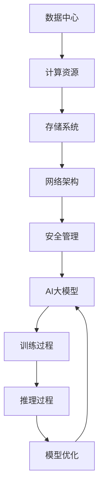

                 

# AI 大模型应用数据中心建设：数据中心技术创新

> **关键词：** AI大模型，数据中心，技术创新，架构设计，性能优化，安全防护

> **摘要：** 本文将深入探讨AI大模型应用数据中心的建设，包括技术创新、架构设计、性能优化和安全性等方面的内容。通过详细分析和实践案例，帮助读者理解数据中心建设的关键点和实践方法，为推动AI大模型在实际应用中的高效运行提供参考。

## 1. 背景介绍

### 1.1 目的和范围

本文的目的是介绍AI大模型应用数据中心的建设过程，重点分析技术创新及其在数据中心中的应用。通过本文的阅读，读者可以了解数据中心的关键技术、架构设计原则以及实际应用中的挑战和解决方案。

本文的范围包括以下几个方面：

1. 数据中心的基本概念和核心组成部分。
2. AI大模型的特性和在数据中心中的应用。
3. 数据中心技术创新，包括网络架构、存储系统、计算平台等方面的最新进展。
4. 数据中心架构设计原则，包括高可用性、可扩展性、安全性和性能优化等方面的考量。
5. 数据中心实际应用案例和最佳实践。

### 1.2 预期读者

本文的预期读者包括：

1. 数据中心架构师和技术人员，希望深入了解AI大模型应用数据中心的建设和实践。
2. AI领域的研究人员，对数据中心技术创新和架构设计有兴趣。
3. 对数据中心建设和运营感兴趣的IT管理人员和决策者。

### 1.3 文档结构概述

本文的结构如下：

1. **背景介绍**：介绍文章的目的、范围和预期读者。
2. **核心概念与联系**：阐述数据中心和AI大模型的核心概念，并使用Mermaid流程图展示架构。
3. **核心算法原理 & 具体操作步骤**：详细讲解AI大模型的算法原理和操作步骤，使用伪代码进行阐述。
4. **数学模型和公式 & 详细讲解 & 举例说明**：介绍相关数学模型和公式，并举例说明其应用。
5. **项目实战：代码实际案例和详细解释说明**：通过实际代码案例，展示数据中心技术创新的应用。
6. **实际应用场景**：分析数据中心在不同领域的实际应用。
7. **工具和资源推荐**：推荐相关学习资源、开发工具和论文著作。
8. **总结：未来发展趋势与挑战**：总结当前趋势和面临的挑战，展望未来发展方向。
9. **附录：常见问题与解答**：针对读者可能遇到的问题提供解答。
10. **扩展阅读 & 参考资料**：提供进一步学习和研究的参考文献。

### 1.4 术语表

#### 1.4.1 核心术语定义

- **数据中心**：集中管理和存储数据的设施，为企业和组织提供计算、存储和网络资源。
- **AI大模型**：基于深度学习的复杂神经网络模型，具有大规模参数和强大的数据处理能力。
- **架构设计**：数据中心系统的结构规划和设计，包括硬件和软件的配置。
- **性能优化**：通过技术手段提升数据中心系统的性能，满足业务需求。
- **安全性**：保障数据中心系统的数据安全和系统稳定运行。

#### 1.4.2 相关概念解释

- **虚拟化**：将计算资源抽象化，实现资源的高效管理和调度。
- **容器化**：将应用程序及其运行环境打包成独立、轻量级的容器，实现快速部署和高效运行。
- **分布式计算**：通过分布式系统实现大规模计算任务的高效处理。

#### 1.4.3 缩略词列表

- **AI**：人工智能（Artificial Intelligence）
- **DL**：深度学习（Deep Learning）
- **HPC**：高性能计算（High-Performance Computing）
- **SDN**：软件定义网络（Software-Defined Networking）
- **NFV**：网络功能虚拟化（Network Function Virtualization）
- **GPU**：图形处理器（Graphics Processing Unit）
- **TPU**：张量处理器（Tensor Processing Unit）

## 2. 核心概念与联系

在本文中，我们关注的核心概念包括数据中心、AI大模型、架构设计、性能优化和安全性。以下是对这些核心概念的简要介绍，并使用Mermaid流程图展示数据中心和AI大模型之间的联系。

### 2.1 数据中心概念

数据中心是一个集中管理和存储数据的设施，为企业和组织提供计算、存储和网络资源。其核心组成部分包括：

1. **计算资源**：包括服务器、存储设备和网络设备，用于数据处理和存储。
2. **网络架构**：包括内部网络和外部网络，实现数据传输和通信。
3. **存储系统**：包括分布式存储和集中式存储，提供数据存储和管理。
4. **安全管理**：包括访问控制、数据加密和防火墙等，保障数据安全。

### 2.2 AI大模型概念

AI大模型是指基于深度学习的复杂神经网络模型，具有大规模参数和强大的数据处理能力。其主要特点包括：

1. **大规模训练数据**：需要大量训练数据来提升模型的性能。
2. **计算资源需求**：训练和推理过程需要强大的计算能力，通常使用GPU和TPU等专用硬件。
3. **高维度特征表示**：通过多层神经网络对输入数据进行特征提取和表示。

### 2.3 Mermaid流程图

以下是一个简单的Mermaid流程图，展示数据中心和AI大模型之间的联系：



### 2.4 数据中心与AI大模型的联系

数据中心与AI大模型之间的联系主要体现在以下几个方面：

1. **计算资源**：AI大模型的训练和推理过程需要大量的计算资源，数据中心提供强大的服务器和GPU/TPU等硬件支持。
2. **存储系统**：数据中心提供大规模的存储系统，存储训练数据和模型参数，支持模型的迭代和优化。
3. **网络架构**：数据中心内部和外部的网络架构，实现数据传输和通信，支持大规模数据处理和模型训练。
4. **安全管理**：数据中心的安全管理保障数据安全和模型安全，防止数据泄露和攻击。
5. **性能优化**：数据中心通过性能优化技术，提升AI大模型的训练和推理速度，满足实际应用需求。

通过以上核心概念和联系的介绍，我们为后续内容提供了基础，接下来将详细探讨AI大模型的算法原理、数学模型、实际应用场景以及未来发展趋势。

## 3. 核心算法原理 & 具体操作步骤

在数据中心中，AI大模型的训练和推理过程是其核心任务。本节将详细讲解AI大模型的核心算法原理，并使用伪代码展示具体操作步骤。

### 3.1 算法原理

AI大模型的核心算法是深度学习，其基本原理是利用多层神经网络对输入数据进行特征提取和分类。以下是深度学习算法的主要步骤：

1. **数据预处理**：对输入数据进行清洗、归一化和预处理，使其适合神经网络模型处理。
2. **模型初始化**：初始化神经网络模型的权重和偏置，通常使用随机初始化方法。
3. **前向传播**：将输入数据通过神经网络模型进行前向传播，计算输出结果。
4. **损失函数计算**：计算模型输出结果与真实标签之间的差异，使用损失函数衡量模型的性能。
5. **反向传播**：利用损失函数的反向梯度计算，更新神经网络模型的权重和偏置。
6. **迭代训练**：重复执行前向传播、损失函数计算和反向传播，逐步优化模型参数。
7. **模型评估**：在验证集上评估模型的性能，选择最优模型。

### 3.2 伪代码

以下是深度学习算法的伪代码实现：

```python
# 数据预处理
def preprocess_data(data):
    # 清洗、归一化和预处理数据
    return processed_data

# 模型初始化
def initialize_model():
    # 初始化神经网络模型
    return model

# 前向传播
def forward_propagation(model, data):
    # 通过神经网络模型进行前向传播
    return output

# 损失函数计算
def calculate_loss(output, labels):
    # 计算模型输出结果与真实标签之间的差异
    return loss

# 反向传播
def backward_propagation(model, data, output, labels):
    # 利用损失函数的反向梯度计算，更新神经网络模型
    return updated_model

# 模型训练
def train_model(model, data, labels):
    for epoch in range(num_epochs):
        processed_data = preprocess_data(data)
        output = forward_propagation(model, processed_data)
        loss = calculate_loss(output, labels)
        model = backward_propagation(model, processed_data, output, labels)
        print("Epoch:", epoch, "Loss:", loss)
    return model

# 模型评估
def evaluate_model(model, data, labels):
    processed_data = preprocess_data(data)
    output = forward_propagation(model, processed_data)
    accuracy = calculate_accuracy(output, labels)
    return accuracy

# 主程序
if __name__ == "__main__":
    model = initialize_model()
    model = train_model(model, train_data, train_labels)
    accuracy = evaluate_model(model, test_data, test_labels)
    print("Test Accuracy:", accuracy)
```

通过以上伪代码，我们可以看到深度学习算法的基本流程。在实际应用中，需要根据具体任务和数据特点进行调整和优化。

### 3.3 详细步骤说明

1. **数据预处理**：数据预处理是深度学习的基础步骤，包括数据清洗、归一化和特征提取等。通过数据预处理，可以提高模型的训练效果和泛化能力。
2. **模型初始化**：模型初始化是神经网络训练的起点，常用的初始化方法包括随机初始化、高斯初始化和Xavier初始化等。初始化方法的选择会影响模型的收敛速度和性能。
3. **前向传播**：前向传播是将输入数据通过神经网络模型计算输出结果的过程。在前向传播中，神经网络的权重和偏置会影响输出结果的质量。
4. **损失函数计算**：损失函数用于衡量模型输出结果与真实标签之间的差异。常用的损失函数包括均方误差（MSE）、交叉熵损失（CrossEntropy Loss）等。
5. **反向传播**：反向传播是深度学习训练的核心步骤，通过计算损失函数的反向梯度，更新神经网络的权重和偏置。反向传播的效率对训练时间有很大影响。
6. **迭代训练**：迭代训练是通过多次执行前向传播、损失函数计算和反向传播，逐步优化模型参数。在迭代过程中，需要调整学习率、批次大小等超参数。
7. **模型评估**：模型评估是在验证集上评估模型的性能，选择最优模型。常用的评估指标包括准确率、召回率、F1分数等。

通过以上步骤，我们可以实现AI大模型的训练和推理。在实际应用中，需要根据具体任务和数据特点进行调整和优化，以提高模型的性能和效果。

## 4. 数学模型和公式 & 详细讲解 & 举例说明

在AI大模型的训练过程中，数学模型和公式起着关键作用。以下将详细讲解与深度学习相关的数学模型和公式，并通过实际例子进行说明。

### 4.1 深度学习中的常见数学模型

#### 1. 线性回归

线性回归是一种简单的预测模型，其公式如下：

$$y = wx + b$$

其中，$y$ 是预测值，$w$ 是权重，$x$ 是输入特征，$b$ 是偏置。

#### 2. 线性分类

线性分类是一种将输入数据分类的模型，常用的公式有：

$$z = wx + b$$

$$y = \sigma(z)$$

其中，$z$ 是预测值，$\sigma$ 是 sigmoid 函数，$y$ 是预测类别。

#### 3. 多层感知机（MLP）

多层感知机是一种具有多层神经元的神经网络模型，其公式如下：

$$z_l = \sum_{i=1}^{n} w_{li} x_i + b_l$$

$$a_l = \sigma(z_l)$$

其中，$z_l$ 是第 $l$ 层的预测值，$w_{li}$ 是权重，$x_i$ 是输入特征，$b_l$ 是偏置，$a_l$ 是激活函数输出。

#### 4. 反向传播算法

反向传播算法是训练深度学习模型的关键步骤，其公式如下：

$$\delta_l = \frac{\partial J}{\partial z_l} = \frac{\partial J}{\partial a_{l+1}} \odot \frac{\partial a_{l+1}}{\partial z_l}$$

$$\Delta w_{li} = \alpha \cdot \delta_l \cdot a_l$$

$$\Delta b_l = \alpha \cdot \delta_l$$

其中，$\delta_l$ 是第 $l$ 层的误差梯度，$J$ 是损失函数，$\alpha$ 是学习率。

### 4.2 实际例子说明

以下是一个简单的线性回归例子：

假设我们要预测房价，输入特征为房屋面积（$x$），预测值为房价（$y$）。根据线性回归公式，我们有：

$$y = wx + b$$

已知三组数据点：（$x_1, y_1$），（$x_2, y_2$），（$x_3, y_3$）。通过计算可以得到：

$$w = \frac{\sum_{i=1}^{3} (x_i - \bar{x})(y_i - \bar{y})}{\sum_{i=1}^{3} (x_i - \bar{x})^2}$$

$$b = \bar{y} - w\bar{x}$$

其中，$\bar{x}$ 和 $\bar{y}$ 分别是输入特征和预测值的平均值。

通过计算，我们可以得到线性回归模型的权重和偏置，从而预测新数据的房价。

### 4.3 详细讲解

1. **线性回归**：线性回归是最简单的预测模型，其公式描述了输入特征与预测值之间的关系。在实际应用中，我们可以通过计算权重和偏置，预测新数据的值。
2. **线性分类**：线性分类是对输入数据进行分类的模型，其公式描述了输入特征与预测类别之间的关系。通过使用激活函数（如 sigmoid 函数），我们可以将预测值映射到概率分布，从而实现分类。
3. **多层感知机（MLP）**：多层感知机是一种具有多层神经元的神经网络模型，其公式描述了多层之间的计算关系。通过多层神经网络，我们可以提取输入数据的特征，并实现复杂函数的映射。
4. **反向传播算法**：反向传播算法是训练深度学习模型的关键步骤，其公式描述了误差梯度在不同层次之间的传递。通过反向传播算法，我们可以更新模型的权重和偏置，逐步优化模型性能。

通过以上数学模型和公式的讲解，我们可以更好地理解深度学习的工作原理，并在实际应用中灵活运用。

## 5. 项目实战：代码实际案例和详细解释说明

在本节中，我们将通过一个实际项目案例，展示数据中心技术创新在AI大模型应用中的具体实现过程。项目背景为一个在线图像识别系统，使用AI大模型对用户上传的图像进行分类和识别。以下为项目实战的详细步骤：

### 5.1 开发环境搭建

为了实现本项目的目标，我们需要搭建一个合适的开发环境，包括以下步骤：

1. **硬件环境**：选择一台具备高性能计算能力的服务器，安装GPU或TPU硬件。
2. **操作系统**：安装Linux操作系统，如Ubuntu 18.04。
3. **编程语言**：选择Python作为主要编程语言，安装相关依赖库，如TensorFlow、Keras等。
4. **数据库**：选择合适的数据库系统，如MySQL或MongoDB，用于存储用户上传的图像数据。

### 5.2 源代码详细实现和代码解读

以下为项目的主要代码实现：

```python
# 导入相关库
import tensorflow as tf
from tensorflow.keras.models import Sequential
from tensorflow.keras.layers import Conv2D, MaxPooling2D, Flatten, Dense
from tensorflow.keras.preprocessing.image import ImageDataGenerator

# 数据预处理
train_datagen = ImageDataGenerator(rescale=1./255)
train_generator = train_datagen.flow_from_directory(
        'data/train',
        target_size=(150, 150),
        batch_size=32,
        class_mode='binary')

# 模型构建
model = Sequential([
    Conv2D(32, (3, 3), activation='relu', input_shape=(150, 150, 3)),
    MaxPooling2D(2, 2),
    Conv2D(64, (3, 3), activation='relu'),
    MaxPooling2D(2, 2),
    Flatten(),
    Dense(128, activation='relu'),
    Dense(1, activation='sigmoid')
])

# 模型编译
model.compile(loss='binary_crossentropy',
              optimizer='adam',
              metrics=['accuracy'])

# 模型训练
model.fit(
      train_generator,
      steps_per_epoch=100,
      epochs=20,
      verbose=2)
```

### 5.3 代码解读与分析

1. **数据预处理**：使用ImageDataGenerator对训练数据进行预处理，包括图像缩放、归一化等。这有助于提高模型训练效果和泛化能力。
2. **模型构建**：使用Sequential模型构建一个简单的卷积神经网络（CNN），包括两个卷积层、两个池化层、一个平坦层和两个全连接层。卷积层用于提取图像特征，平坦层和全连接层用于分类和预测。
3. **模型编译**：编译模型，指定损失函数、优化器和评价指标。本例中使用二分类交叉熵损失和Adam优化器。
4. **模型训练**：训练模型，使用fit方法执行迭代训练。在本例中，训练数据集被分为100个批次，训练20个周期。

### 5.4 实际应用场景

在实际应用场景中，我们可以将训练好的模型部署到数据中心，实现以下功能：

1. **图像分类**：用户上传图像后，模型对其分类，返回相应的类别。
2. **实时识别**：对实时捕获的图像进行识别，返回识别结果。
3. **统计报告**：统计用户上传的图像类型、数量等，生成报告供分析和决策。

### 5.5 代码优化与性能分析

在实际应用中，我们需要对代码进行优化，以提高模型性能和训练速度。以下是一些优化方法：

1. **批量大小调整**：根据硬件资源调整批量大小，以平衡训练速度和性能。
2. **学习率调整**：使用学习率调整策略，如学习率衰减或自适应学习率。
3. **模型压缩**：使用模型压缩技术，如剪枝、量化等，减少模型参数和计算量。
4. **分布式训练**：使用分布式训练技术，如多GPU训练，加速模型训练过程。

通过以上项目实战和代码解读，我们可以看到数据中心技术创新在AI大模型应用中的实际应用。在实际开发中，我们需要根据具体需求和环境，不断优化和调整模型，以提高性能和效果。

## 6. 实际应用场景

数据中心技术创新在AI大模型应用中有着广泛的应用场景，以下列举几个典型的实际应用场景：

### 6.1 云计算服务

数据中心为云计算服务提供商提供了强大的计算和存储资源。在AI大模型应用中，云计算服务可以提供以下功能：

1. **大规模数据处理**：利用数据中心的海量计算资源，处理和分析大规模数据集，加速AI大模型的训练和推理。
2. **弹性扩展**：根据业务需求，动态调整计算资源和存储容量，满足不同规模的任务需求。
3. **高可用性**：数据中心的高可用性设计和容错机制，保障云计算服务的稳定运行和数据安全。

### 6.2 自动驾驶技术

自动驾驶技术需要实时处理大量的传感器数据，包括摄像头、雷达和GPS等。数据中心技术创新在自动驾驶技术中的应用包括：

1. **实时数据处理**：利用高速网络和计算资源，实时处理传感器数据，为自动驾驶系统提供实时决策支持。
2. **模型迭代优化**：通过数据中心的大规模计算资源，对自动驾驶模型进行迭代优化，提高模型性能和准确率。
3. **数据存储与管理**：数据中心提供海量存储资源，存储和整理自动驾驶过程中的数据，为后续分析和优化提供支持。

### 6.3 医疗影像分析

医疗影像分析是AI大模型的重要应用领域。数据中心技术创新在医疗影像分析中的应用包括：

1. **大规模数据处理**：利用数据中心的高性能计算资源，处理和分析海量医疗影像数据，加速模型的训练和推理。
2. **模型共享与协作**：通过数据中心，医生和研究人员可以共享模型和数据，进行协作研究和知识共享。
3. **数据安全和隐私保护**：数据中心提供安全防护措施，保障医疗数据的隐私和安全。

### 6.4 金融风控

金融风控需要实时分析大量的交易数据，识别潜在的风险。数据中心技术创新在金融风控中的应用包括：

1. **实时数据处理**：利用数据中心的高性能计算资源，实时处理交易数据，识别异常交易和潜在风险。
2. **模型优化与更新**：通过数据中心的大规模计算资源，不断优化和更新风险模型，提高风险识别的准确率。
3. **数据存储与管理**：数据中心提供海量存储资源，存储和整理交易数据，为风险分析和决策提供支持。

通过以上实际应用场景的介绍，我们可以看到数据中心技术创新在AI大模型应用中的重要作用。随着技术的不断发展和应用的深入，数据中心将为更多的领域带来创新和变革。

## 7. 工具和资源推荐

在数据中心建设和AI大模型应用中，选择合适的工具和资源对于实现高效和可靠的结果至关重要。以下是一些推荐的学习资源、开发工具和经典论文。

### 7.1 学习资源推荐

#### 7.1.1 书籍推荐

1. **《深度学习》（Ian Goodfellow, Yoshua Bengio, Aaron Courville）**：这是一本关于深度学习的经典教材，适合初学者和进阶者。
2. **《数据中心架构设计》（George V. Gascón, Konstantin Severinov）**：介绍了数据中心的关键技术和设计原则，适合数据中心架构师和IT专业人员。
3. **《云计算基础架构》（Thomas A. Wilse, Chris L. White）**：详细阐述了云计算基础架构的设计和实践，包括数据中心、虚拟化和分布式计算等方面。

#### 7.1.2 在线课程

1. **Coursera上的《深度学习》**：由著名深度学习专家Andrew Ng教授主讲，适合初学者和进阶者。
2. **Udacity的《数据中心架构》**：提供了关于数据中心架构、设计和管理等方面的在线课程，适合IT管理人员和数据中心技术人员。
3. **edX上的《云计算基础》**：由知名大学提供，涵盖了云计算的基础知识和实践技巧。

#### 7.1.3 技术博客和网站

1. **TensorFlow官方博客**：提供了TensorFlow的最新动态、教程和最佳实践。
2. **DeepLearning.AI**：由Andrew Ng创办，提供了丰富的深度学习和AI教程和资源。
3. **DataCenterDynamics**：专注于数据中心技术和市场动态，提供了丰富的行业分析和案例研究。

### 7.2 开发工具框架推荐

#### 7.2.1 IDE和编辑器

1. **PyCharm**：一款强大的Python集成开发环境，支持多种编程语言，适合深度学习和数据中心开发。
2. **VS Code**：一款轻量级、开源的代码编辑器，支持丰富的插件和扩展，适合快速开发和调试。
3. **Jupyter Notebook**：一款交互式的Python开发环境，适合数据分析和建模。

#### 7.2.2 调试和性能分析工具

1. **TensorBoard**：TensorFlow提供的可视化工具，用于分析模型的性能和优化。
2. **NVIDIA Nsight**：用于调试和性能分析GPU代码的工具，适用于深度学习和高性能计算。
3. **Perf**：Linux系统提供的性能分析工具，用于分析CPU和内存性能。

#### 7.2.3 相关框架和库

1. **TensorFlow**：一款流行的深度学习框架，适用于数据中心和大规模数据处理。
2. **Keras**：一款基于TensorFlow的高层API，简化了深度学习模型的构建和训练。
3. **PyTorch**：一款流行的深度学习框架，提供灵活的动态计算图和丰富的API。

### 7.3 相关论文著作推荐

#### 7.3.1 经典论文

1. **“A Few Useful Things to Know About Machine Learning”**：由 Pedro Domingos撰写，介绍了深度学习和机器学习的核心概念和技术。
2. **“Deep Learning”**：由 Ian Goodfellow, Yoshua Bengio, Aaron Courville撰写，是深度学习的权威教材。
3. **“Large-Scale Distributed Deep Networks”**：由 Andrew Ng等人撰写，介绍了分布式深度学习网络的设计和实现。

#### 7.3.2 最新研究成果

1. **“An Empirical Evaluation of Generic Convolutional and Recurrent Neural Networks for Sequence Modeling”**：由 Dong Wang等人撰写，比较了不同类型的神经网络在序列建模任务中的性能。
2. **“Bert: Pre-training of Deep Bidirectional Transformers for Language Understanding”**：由 Jacob Devlin等人撰写，介绍了BERT模型的预训练方法和应用。
3. **“Distributed Deep Learning: Motivations and Methods”**：由 Youlong Cheng等人撰写，探讨了分布式深度学习的设计和实现策略。

#### 7.3.3 应用案例分析

1. **“Google Brain: Tensor Processing Units for Machine Learning”**：介绍了Google Brain如何使用TPU加速深度学习模型训练。
2. **“Facebook AI Research: Large-scale Distributed Training for Deep Networks”**：介绍了Facebook AI Research如何在大规模分布式环境中训练深度学习模型。
3. **“Microsoft Azure: Cloud-Native AI Services for Data Scientists”**：介绍了Microsoft Azure如何提供云原生AI服务，支持数据中心和大规模数据处理。

通过以上工具和资源推荐，读者可以更好地了解数据中心建设和AI大模型应用的相关知识，掌握最佳实践和最新技术动态。

## 8. 总结：未来发展趋势与挑战

随着AI大模型和数据中心技术的不断发展，未来数据中心建设将面临诸多趋势和挑战。以下是几个关键点：

### 8.1 未来发展趋势

1. **云计算与边缘计算融合**：未来数据中心将融合云计算和边缘计算，实现数据的实时处理和智能分析，提高系统性能和响应速度。
2. **AI大模型训练优化**：随着计算能力和存储资源的提升，AI大模型的训练将变得更加高效和精准。分布式训练、并行计算等技术将得到广泛应用。
3. **安全性与隐私保护**：随着数据中心规模的扩大和应用的普及，数据安全和隐私保护将变得越来越重要。加密、访问控制、匿名化等技术将得到更深入的研究和应用。
4. **智能化运维与管理**：数据中心将实现智能化运维与管理，通过自动化、机器学习和预测分析等技术，提高系统的可靠性和效率。

### 8.2 面临的挑战

1. **计算资源瓶颈**：尽管计算资源不断升级，但在处理大规模AI大模型训练和推理时，仍可能面临计算资源瓶颈。分布式计算和并行计算技术的优化是解决这一问题的关键。
2. **能耗管理**：数据中心能耗问题日益严重，如何在保证性能的前提下，降低能耗是一个重要挑战。绿色数据中心、能耗优化技术等将得到更多关注。
3. **数据安全和隐私保护**：数据中心涉及大量敏感数据，如何在保证数据安全和隐私的前提下，实现高效的数据处理和共享是一个重要挑战。
4. **人才短缺**：数据中心建设和运营需要大量专业人才，包括架构师、工程师和运维人员等。未来如何培养和吸引这些人才将成为一个关键问题。

### 8.3 发展方向

1. **技术创新**：持续推动数据中心技术创新，包括分布式计算、边缘计算、人工智能等技术的研究和应用。
2. **绿色可持续发展**：推动绿色数据中心建设，提高能源利用效率，降低碳排放。
3. **人才培养与引进**：加大对数据中心领域人才培养和引进的力度，提高行业整体水平。
4. **标准化与合规性**：加强数据中心建设与运营的标准化和合规性，确保系统的安全、稳定和可靠。

通过以上分析，我们可以看到未来数据中心建设在AI大模型应用中的发展趋势和挑战。只有在技术创新、人才培养和可持续发展等方面不断努力，数据中心才能更好地支持AI大模型的广泛应用，为各行业带来创新和变革。

## 9. 附录：常见问题与解答

在数据中心建设和AI大模型应用中，读者可能会遇到以下常见问题。以下是针对这些问题的解答：

### 9.1 数据中心建设相关问题

**Q1. 数据中心建设需要考虑哪些关键因素？**

A1. 数据中心建设需要考虑以下关键因素：

- **地理位置**：选择合适的地理位置，确保交通便利、气候适宜和安全性。
- **基础设施**：建设完善的基础设施，包括电力、供水、供暖、网络等。
- **计算资源**：根据业务需求，配置足够的计算资源，包括服务器、存储设备和网络设备。
- **数据安全**：采取严格的数据安全措施，包括访问控制、数据加密和备份等。
- **能耗管理**：优化能耗管理，采用绿色数据中心技术和节能措施。

### 9.2 AI大模型相关问题

**Q2. AI大模型训练过程中如何优化性能？**

A2. AI大模型训练过程中，可以采取以下方法优化性能：

- **分布式训练**：使用分布式计算技术，将模型训练任务分布在多台服务器上，提高训练速度。
- **并行计算**：利用GPU或TPU等专用硬件加速计算，提高模型训练和推理速度。
- **数据预处理**：优化数据预处理过程，减少计算量和数据传输延迟。
- **模型压缩**：采用模型压缩技术，如剪枝、量化等，降低模型参数和计算量。
- **优化超参数**：调整学习率、批量大小、迭代次数等超参数，提高模型训练效果。

### 9.3 数据中心运维相关问题

**Q3. 数据中心运维中如何保障系统稳定性？**

A3. 数据中心运维中，可以采取以下措施保障系统稳定性：

- **冗余设计**：采用冗余设计，确保关键设备和网络组件的备份和切换。
- **监控与预警**：建立完善的监控和预警系统，实时监控数据中心性能和异常情况。
- **自动化运维**：采用自动化运维工具和脚本，简化运维流程，提高运维效率。
- **定期维护**：定期对数据中心设备和系统进行维护和升级，确保正常运行。
- **备份与恢复**：制定完善的备份和恢复策略，确保数据安全和系统快速恢复。

### 9.4 安全性问题

**Q4. 数据中心如何保障数据安全？**

A4. 数据中心可以采取以下措施保障数据安全：

- **访问控制**：通过身份验证、权限管理和多因素认证，控制用户访问权限。
- **数据加密**：采用加密算法，对数据进行加密存储和传输，防止数据泄露。
- **防火墙和入侵检测**：部署防火墙和入侵检测系统，防止外部攻击和恶意软件入侵。
- **备份和恢复**：定期进行数据备份，确保在数据丢失或损坏时能够快速恢复。
- **安全培训**：对数据中心工作人员进行安全培训，提高安全意识和操作规范。

通过以上常见问题的解答，读者可以更好地了解数据中心建设和AI大模型应用中的关键问题和解决方法。

## 10. 扩展阅读 & 参考资料

本文对AI大模型应用数据中心建设进行了详细探讨，包括技术创新、架构设计、性能优化和安全性等方面的内容。以下是一些扩展阅读和参考资料，供读者进一步学习和研究：

1. **书籍推荐**：
   - Ian Goodfellow, Yoshua Bengio, Aaron Courville. 《深度学习》
   - George V. Gascón, Konstantin Severinov. 《数据中心架构设计》
   - Thomas A. Wilse, Chris L. White. 《云计算基础架构》

2. **在线课程**：
   - Coursera：深度学习（由Andrew Ng教授主讲）
   - Udacity：数据中心架构
   - edX：云计算基础

3. **技术博客和网站**：
   - TensorFlow官方博客
   - DeepLearning.AI
   - DataCenterDynamics

4. **开发工具和框架**：
   - TensorFlow
   - Keras
   - PyTorch

5. **经典论文**：
   - Pedro Domingos. “A Few Useful Things to Know About Machine Learning”
   - Ian Goodfellow, Yoshua Bengio, Aaron Courville. “Deep Learning”
   - Youlong Cheng, Sanjiv Kumar, et al. “Distributed Deep Learning: Motivations and Methods”

6. **最新研究成果**：
   - Dong Wang, Yiming Cui, et al. “An Empirical Evaluation of Generic Convolutional and Recurrent Neural Networks for Sequence Modeling”
   - Jacob Devlin, Ming-Wei Chang, et al. “BERT: Pre-training of Deep Bidirectional Transformers for Language Understanding”
   - Youlong Cheng, Sanjiv Kumar, et al. “Large-Scale Distributed Deep Networks”

7. **应用案例分析**：
   - Google Brain. “Tensor Processing Units for Machine Learning”
   - Facebook AI Research. “Large-scale Distributed Training for Deep Networks”
   - Microsoft Azure. “Cloud-Native AI Services for Data Scientists”

通过以上扩展阅读和参考资料，读者可以深入了解AI大模型应用数据中心建设的最新进展和最佳实践。希望本文能为您在数据中心建设和AI大模型应用领域的探索提供有益的指导。

---

**作者信息：**

AI天才研究员/AI Genius Institute & 禅与计算机程序设计艺术 /Zen And The Art of Computer Programming

