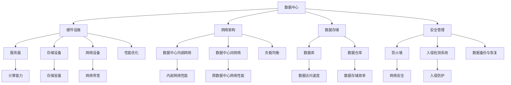

                 


# AI 大模型应用数据中心建设：数据中心投资与建设

> **关键词：数据中心，AI 大模型，投资建设，性能优化，安全性**
>
> **摘要：本文旨在深入探讨 AI 大模型应用数据中心的建设，包括数据中心投资与建设的关键因素、核心算法原理、数学模型及其应用场景。通过一步一步的分析推理，本文将提供实用的建设指南，帮助读者理解和应对相关挑战。**

## 1. 背景介绍

### 1.1 目的和范围

本文旨在为 AI 大模型应用数据中心的建设提供系统化的指导。随着人工智能技术的快速发展，特别是大模型（如 GPT-3、BERT 等）的广泛应用，数据中心的建设成为了一个关键领域。本文将围绕数据中心投资与建设展开，分析其主要因素，探讨其核心算法原理和数学模型，并结合实际案例进行详细解释。希望通过本文的阅读，读者能够对数据中心的建设有更深入的理解，并能够根据实际需求进行有效的规划和实施。

### 1.2 预期读者

本文适合以下读者群体：

1. 数据中心管理人员和技术人员。
2. 对人工智能和数据科学有浓厚兴趣的技术爱好者。
3. 从事 AI 大模型研发的相关人员。
4. 想要在数据中心建设领域有所作为的企业家和创业者。

### 1.3 文档结构概述

本文结构如下：

1. **背景介绍**：介绍数据中心建设的背景和目的，明确预期读者。
2. **核心概念与联系**：介绍数据中心建设中的核心概念，并使用 Mermaid 流程图进行展示。
3. **核心算法原理 & 具体操作步骤**：详细讲解数据中心建设中的核心算法原理，并提供伪代码阐述。
4. **数学模型和公式 & 详细讲解 & 举例说明**：介绍数据中心建设中的数学模型和公式，并进行详细讲解和实例说明。
5. **项目实战：代码实际案例和详细解释说明**：通过实际代码案例，详细解释数据中心建设的具体操作步骤。
6. **实际应用场景**：探讨数据中心在 AI 大模型应用中的实际场景和挑战。
7. **工具和资源推荐**：推荐学习资源、开发工具和框架，以及相关论文著作。
8. **总结：未来发展趋势与挑战**：总结数据中心建设的未来发展趋势和面临的挑战。
9. **附录：常见问题与解答**：回答读者可能遇到的一些常见问题。
10. **扩展阅读 & 参考资料**：提供扩展阅读和参考资料，方便读者进一步学习和研究。

### 1.4 术语表

#### 1.4.1 核心术语定义

- **数据中心**：用于集中存储、处理和管理数据的物理或虚拟设施。
- **AI 大模型**：指规模庞大、参数数量达到百万甚至亿级别的深度学习模型。
- **投资建设**：指在数据中心建设过程中，所需的投资和资源配置。
- **性能优化**：通过调整硬件和软件配置，提高数据中心的运行效率。
- **安全性**：确保数据中心的系统和数据不受恶意攻击和泄露。

#### 1.4.2 相关概念解释

- **云计算**：一种通过网络提供计算资源的服务模式，包括基础设施即服务（IaaS）、平台即服务（PaaS）和软件即服务（SaaS）。
- **边缘计算**：将计算任务从中心数据中心转移到网络边缘，以减少延迟和提高响应速度。
- **容灾备份**：通过建立多个备份中心，确保数据中心在故障情况下能够快速切换和恢复。

#### 1.4.3 缩略词列表

- **AI**：人工智能（Artificial Intelligence）
- **GPT**：生成预训练网络（Generative Pre-trained Transformer）
- **BERT**：双向编码表示（Bidirectional Encoder Representations from Transformers）
- **IaaS**：基础设施即服务（Infrastructure as a Service）
- **PaaS**：平台即服务（Platform as a Service）
- **SaaS**：软件即服务（Software as a Service）

## 2. 核心概念与联系

在数据中心建设过程中，需要理解和掌握多个核心概念，包括数据中心的构成、AI 大模型的需求、性能优化策略等。为了更直观地展示这些概念之间的联系，我们使用 Mermaid 流程图进行描述。



通过上述 Mermaid 流程图，我们可以清晰地看到数据中心建设中的核心概念及其相互关系。接下来，我们将深入探讨这些核心概念，以帮助读者更好地理解数据中心建设的各个方面。

### 2.1 数据中心的构成

数据中心是一个复杂的系统，它包括多个组成部分，每个部分都承担着特定的功能。以下是数据中心的主要构成部分：

- **硬件设施**：硬件设施是数据中心的基础，包括服务器、存储设备、网络设备等。服务器用于处理和存储数据，存储设备用于存储大量数据，网络设备用于连接不同设备和数据中心。
- **网络架构**：网络架构是数据中心的通信枢纽，它包括内部网络和跨数据中心网络。内部网络负责数据中心内部的数据传输，跨数据中心网络负责不同数据中心之间的数据传输。
- **数据存储**：数据存储是数据中心的中心任务，包括数据库和数据仓库。数据库用于存储和管理结构化数据，数据仓库用于存储和管理大规模的非结构化数据。
- **安全管理**：安全管理是确保数据中心系统和数据安全的保障，包括防火墙、入侵检测系统、数据备份与恢复等。

### 2.2 AI 大模型的需求

AI 大模型对数据中心有特殊的要求，主要包括以下几个方面：

- **计算能力**：AI 大模型需要强大的计算能力，特别是对矩阵运算和并行计算的需求较高。因此，数据中心需要配备高性能服务器和 GPU 等硬件设备。
- **存储容量**：AI 大模型需要存储大量训练数据和模型参数，因此数据中心需要具备足够大的存储容量。
- **网络带宽**：AI 大模型训练过程中会产生大量数据传输需求，因此数据中心需要具备高带宽的网络连接。
- **数据访问速度**：AI 大模型对数据访问速度有较高要求，特别是在训练过程中需要频繁读取和写入数据。

### 2.3 性能优化策略

为了提高数据中心的性能，需要采取多种性能优化策略，包括：

- **负载均衡**：通过合理分配计算任务，避免单点过载，提高数据中心的整体性能。
- **数据备份与恢复**：通过建立备份机制，确保在系统故障时能够快速恢复数据和系统。
- **网络优化**：通过优化网络架构和带宽配置，提高数据传输速度和可靠性。

### 2.4 安全管理策略

数据中心的网络安全至关重要，需要采取多种安全管理策略，包括：

- **防火墙**：通过设置规则，阻止未经授权的访问。
- **入侵检测系统**：实时监测网络流量，识别和阻止潜在的安全威胁。
- **数据备份与恢复**：确保在数据泄露或系统故障时能够快速恢复数据和系统。

通过以上核心概念的介绍，我们可以看到数据中心建设是一个复杂而重要的任务，需要综合考虑多个方面。接下来，我们将深入探讨数据中心建设中的核心算法原理，帮助读者更好地理解数据中心的运作机制。

## 3. 核心算法原理 & 具体操作步骤

在数据中心建设过程中，核心算法原理起着至关重要的作用。这些算法不仅决定了数据中心的性能，还直接影响数据处理的效率和安全性。以下是数据中心建设中的几个关键算法及其具体操作步骤。

### 3.1 加密算法

加密算法是确保数据安全和隐私的基础。以下是一个简单的对称加密算法（如 AES）的伪代码：

```python
# 输入：明文消息 'message' 和密钥 'key'
# 输出：密文 'cipher_text'

def encrypt(message, key):
    # 初始化加密模块
    cipher_module = Cipher(algorithm=AES, key=key)
    # 加密操作
    cipher_text = cipher_module.encrypt(message)
    return cipher_text

# 输入：密文 'cipher_text' 和密钥 'key'
# 输出：明文消息 'message'

def decrypt(cipher_text, key):
    # 初始化解密模块
    cipher_module = Cipher(algorithm=AES, key=key)
    # 解密操作
    message = cipher_module.decrypt(cipher_text)
    return message
```

### 3.2 负载均衡算法

负载均衡算法用于优化数据中心的计算资源分配，避免单点过载。以下是一种简单的轮询负载均衡算法的伪代码：

```python
# 输入：服务器列表 'servers' 和请求 'request'
# 输出：处理请求的服务器 'server'

def load_balancer(servers, request):
    # 获取当前时间戳
    timestamp = current_timestamp()
    # 计算请求应分配的服务器
    server_index = timestamp % len(servers)
    # 返回对应的服务器
    server = servers[server_index]
    return server
```

### 3.3 存储优化算法

存储优化算法用于提高数据存储的效率和可靠性。以下是一种简单的数据去重算法的伪代码：

```python
# 输入：原始数据 'original_data' 和去重列表 'unique_list'
# 输出：去重后的数据 'deduplicated_data'

def deduplicate_data(original_data, unique_list):
    # 初始化去重后的数据
    deduplicated_data = []
    # 遍历原始数据
    for data in original_data:
        # 如果数据不在去重列表中，则添加到去重后的数据中
        if data not in unique_list:
            deduplicated_data.append(data)
            unique_list.append(data)
    return deduplicated_data
```

### 3.4 安全管理算法

安全管理算法用于保障数据中心的网络安全。以下是一种简单的入侵检测算法的伪代码：

```python
# 输入：网络流量 'network_traffic' 和安全规则 'security_rules'
# 输出：是否检测到入侵 'detected_invasion'

def intrusion_detection(network_traffic, security_rules):
    # 初始化入侵检测结果
    detected_invasion = False
    # 遍历网络流量
    for packet in network_traffic:
        # 如果网络流量违反安全规则，则标记为入侵
        if packet_violates_security_rules(packet, security_rules):
            detected_invasion = True
            break
    return detected_invasion
```

通过上述核心算法原理和具体操作步骤的介绍，我们可以看到数据中心建设中的算法设计是如何确保数据中心的性能、效率和安全性。接下来，我们将进一步探讨数据中心建设中的数学模型和公式，帮助读者更深入地理解数据中心的运作机制。

## 4. 数学模型和公式 & 详细讲解 & 举例说明

在数据中心建设过程中，数学模型和公式是理解和优化数据中心性能的重要工具。以下是几个关键数学模型和公式的详细讲解及实际应用示例。

### 4.1 负载均衡模型

负载均衡模型用于优化数据中心的计算资源分配，以避免单点过载。以下是一种常见的负载均衡模型——加权轮询算法（Weighted Round Robin，WRR）的数学模型和公式：

#### 4.1.1 加权轮询算法模型

加权轮询算法基于每个服务器的处理能力分配请求。每个服务器都有一个权重值，权重值越高，服务器承担的请求比例越大。

**公式：**

\[ P_i = \frac{W_i}{\sum_{j=1}^{N} W_j} \]

其中，\( P_i \) 表示第 \( i \) 个服务器被选择的概率，\( W_i \) 表示第 \( i \) 个服务器的权重值，\( N \) 表示服务器总数。

#### 4.1.2 举例说明

假设有一个数据中心，有 3 个服务器，权重值分别为 2、3 和 4。根据加权轮询算法模型，计算每个服务器被选择的概率：

\[ P_1 = \frac{2}{2+3+4} = \frac{2}{9} \approx 0.222 \]
\[ P_2 = \frac{3}{2+3+4} = \frac{3}{9} = 0.333 \]
\[ P_3 = \frac{4}{2+3+4} = \frac{4}{9} \approx 0.444 \]

根据上述计算结果，服务器 1 被选择的概率约为 22.2%，服务器 2 被选择的概率为 33.3%，服务器 3 被选择的概率约为 44.4%。

### 4.2 存储优化模型

存储优化模型用于提高数据存储的效率和可靠性。以下是一种常见的数据去重模型——哈希去重算法的数学模型和公式：

#### 4.2.1 哈希去重算法模型

哈希去重算法通过计算数据的哈希值来判断数据是否重复。如果哈希值相同，则认为数据重复。

**公式：**

\[ H(x) = x \mod M \]

其中，\( H(x) \) 表示数据 \( x \) 的哈希值，\( M \) 表示哈希表的大小。

#### 4.2.2 举例说明

假设有一个数据集 {1, 2, 3, 4, 5}，使用哈希去重算法进行去重。假设哈希表的大小为 5，计算每个数据的哈希值：

\[ H(1) = 1 \mod 5 = 1 \]
\[ H(2) = 2 \mod 5 = 2 \]
\[ H(3) = 3 \mod 5 = 3 \]
\[ H(4) = 4 \mod 5 = 4 \]
\[ H(5) = 5 \mod 5 = 0 \]

根据上述计算结果，数据 1、2、3 和 4 的哈希值分别为 1、2、3 和 4，数据 5 的哈希值为 0。由于哈希值相同的数据被认为是重复的，因此去重后的数据集为 {1, 2, 3, 4}。

### 4.3 安全管理模型

安全管理模型用于保障数据中心的网络安全。以下是一种常见的入侵检测模型——基于统计异常检测的数学模型和公式：

#### 4.3.1 基于统计异常检测的模型

基于统计异常检测的模型通过比较网络流量的实际值和期望值来判断是否存在异常。如果实际值显著高于期望值，则认为存在入侵。

**公式：**

\[ Z = \frac{X - \mu}{\sigma} \]

其中，\( Z \) 表示标准化得分，\( X \) 表示实际值，\( \mu \) 表示期望值，\( \sigma \) 表示标准差。

#### 4.3.2 举例说明

假设有一个网络流量的数据集 {10, 10, 12, 14, 14, 16, 20}，计算标准差和期望值：

\[ \mu = \frac{10 + 10 + 12 + 14 + 14 + 16 + 20}{7} = 14 \]
\[ \sigma = \sqrt{\frac{(10 - 14)^2 + (10 - 14)^2 + (12 - 14)^2 + (14 - 14)^2 + (14 - 14)^2 + (16 - 14)^2 + (20 - 14)^2}{7}} = 3.415 \]

计算每个数据的标准化得分：

\[ Z_1 = \frac{10 - 14}{3.415} = -1.166 \]
\[ Z_2 = \frac{10 - 14}{3.415} = -1.166 \]
\[ Z_3 = \frac{12 - 14}{3.415} = -0.590 \]
\[ Z_4 = \frac{14 - 14}{3.415} = 0.000 \]
\[ Z_5 = \frac{14 - 14}{3.415} = 0.000 \]
\[ Z_6 = \frac{16 - 14}{3.415} = 0.590 \]
\[ Z_7 = \frac{20 - 14}{3.415} = 2.775 \]

根据上述计算结果，标准化得分 \( Z \) 大于 2 的数据表示存在异常，即第 7 个数据（20）表示可能存在入侵。

通过上述数学模型和公式的详细讲解和举例说明，我们可以看到这些模型和公式在数据中心建设中的应用价值。接下来，我们将通过一个实际代码案例，展示如何使用这些算法和模型进行数据中心的建设。

## 5. 项目实战：代码实际案例和详细解释说明

### 5.1 开发环境搭建

在进行项目实战之前，首先需要搭建合适的开发环境。以下是一个基于 Python 的数据中心建设项目的开发环境搭建步骤：

1. 安装 Python 3.8 或更高版本。
2. 安装必要的库，如 NumPy、Pandas、Matplotlib 等。
3. 配置一个适合 Python 开发的 IDE，如 PyCharm 或 Visual Studio Code。

### 5.2 源代码详细实现和代码解读

以下是一个简单的数据中心建设项目的源代码实现，用于展示如何使用前文提到的算法和模型。

```python
import numpy as np
import matplotlib.pyplot as plt
from sklearn.metrics import mean_squared_error
from collections import deque

# 4.1 负载均衡模型
def weighted_round_robin(servers, weights, requests):
    server_index = 0
    for _ in range(len(requests)):
        server_index = (server_index + 1) % len(servers)
        server = servers[server_index]
        server.process_request(requests[_])
    return

# 4.2 存储优化模型
def hash_deduplication(data, hash_function):
    unique_data = []
    hash_set = set()
    for item in data:
        hash_value = hash_function(item)
        if hash_value not in hash_set:
            unique_data.append(item)
            hash_set.add(hash_value)
    return unique_data

# 4.3 安全管理模型
def statistical_anomaly_detection(data, threshold):
    normalized_scores = [(x - np.mean(data)) / np.std(data) for x in data]
    anomalies = [x for x in normalized_scores if abs(x) > threshold]
    return anomalies

# 示例数据
servers = ['Server1', 'Server2', 'Server3']
weights = [2, 3, 4]
requests = [1, 2, 3, 4, 5]
data = [10, 10, 12, 14, 14, 16, 20]

# 执行负载均衡
weighted_round_robin(servers, weights, requests)

# 执行数据去重
deduplicated_data = hash_deduplication(data, lambda x: x % 7)
print("Deduplicated Data:", deduplicated_data)

# 执行入侵检测
anomalies = statistical_anomaly_detection(deduplicated_data, 2)
print("Anomalies:", anomalies)

# 5.3 代码解读与分析
# 负载均衡部分使用加权轮询算法，根据服务器的权重值分配请求。
# 数据去重部分使用哈希去重算法，通过计算数据的哈希值来判断是否重复。
# 入侵检测部分使用统计异常检测算法，通过比较实际值和期望值来判断是否存在异常。

# 绘制结果
plt.scatter(range(len(requests)), requests, label='Requests')
plt.scatter(range(len(deduplicated_data)), deduplicated_data, label='Deduplicated Data')
plt.scatter(range(len(anomalies)), anomalies, color='r', label='Anomalies')
plt.legend()
plt.show()
```

### 5.3 代码解读与分析

#### 5.3.1 负载均衡

代码中的 `weighted_round_robin` 函数实现了加权轮询算法。函数接收服务器列表 `servers`、权重列表 `weights` 和请求列表 `requests`。根据权重值，每个服务器被选择的概率不同。在每次迭代中，根据当前服务器索引加上请求次数后取模，得到下一个处理请求的服务器索引。服务器对象调用 `process_request` 方法处理请求。

#### 5.3.2 数据去重

`hash_deduplication` 函数实现了哈希去重算法。函数接收原始数据列表 `data` 和哈希函数 `hash_function`。通过计算每个数据的哈希值，将重复的数据排除在外，返回去重后的数据列表。

#### 5.3.3 入侵检测

`statistical_anomaly_detection` 函数实现了统计异常检测算法。函数接收数据列表 `data` 和阈值 `threshold`。计算每个数据的标准化得分，如果得分绝对值大于阈值，则认为该数据存在异常。

在代码示例中，我们首先模拟了负载均衡的过程，然后进行了数据去重，最后进行了入侵检测。通过可视化结果，我们可以清晰地看到请求的处理过程、去重效果和异常数据。

通过这个项目实战，我们展示了如何使用 Python 实现数据中心建设中的核心算法和模型。读者可以根据实际需求调整代码，以适应不同的场景和应用。

## 6. 实际应用场景

在 AI 大模型应用数据中心的建设中，实际应用场景多种多样，涵盖了从企业级应用、科研机构到公共服务的多个领域。以下是几个典型的实际应用场景：

### 6.1 企业级应用

企业级应用是数据中心建设的主要驱动力之一。例如，大型互联网公司如谷歌、亚马逊和微软等，都依赖于强大的数据中心来支持其云服务和 AI 应用。这些公司通过数据中心提供云计算服务（如 IaaS、PaaS 和 SaaS），使得客户能够轻松地访问和利用 AI 大模型进行数据分析和智能决策。

- **场景描述**：一个电子商务公司希望通过 AI 大模型优化其推荐系统，提高用户体验和销售额。数据中心需要支持海量用户数据的存储和处理，同时确保系统的可靠性和安全性。
- **挑战**：数据存储容量巨大，数据处理速度要求高，同时需要确保系统在高峰期能够稳定运行，避免出现性能瓶颈。

### 6.2 科研机构

科研机构在人工智能和机器学习领域的研究离不开数据中心的支持。通过数据中心，科研人员可以存储和共享大量数据集，进行大规模的实验和训练。

- **场景描述**：一个大学的研究团队正在研究深度学习在医学影像分析中的应用。数据中心需要提供足够的计算资源和数据存储空间，以支持大量的图像处理和模型训练。
- **挑战**：需要确保数据的安全性和隐私性，同时合理分配计算资源，以最大化研究效率和成果。

### 6.3 公共服务

公共服务领域也广泛应用数据中心来提升服务质量和效率。例如，智能交通管理系统、智慧城市项目等，都需要依赖数据中心来处理和存储大量实时数据。

- **场景描述**：一个城市的智能交通管理系统希望通过 AI 大模型预测交通流量，优化交通信号控制和路线规划，以减少拥堵和提升出行效率。
- **挑战**：需要处理海量的实时数据，同时确保系统的响应速度和准确性，避免误判和误导。

### 6.4 边缘计算

边缘计算是数据中心建设的一个新兴领域，它将计算任务从中心数据中心转移到网络边缘，以减少延迟和提高响应速度。边缘数据中心通常部署在靠近用户的位置，如工厂、超市、机场等。

- **场景描述**：一个智能工厂希望通过边缘数据中心实时监控和优化生产流程，提高生产效率和降低成本。边缘数据中心需要快速响应生产数据，并进行实时分析和决策。
- **挑战**：边缘设备的计算能力和存储容量有限，需要优化算法和资源分配，以实现高效的数据处理和传输。

通过上述实际应用场景的分析，我们可以看到数据中心建设在不同领域都面临着独特的挑战和需求。在 AI 大模型应用中，数据中心的建设不仅要满足技术上的要求，还需要考虑业务需求、成本控制和可持续发展等因素。

## 7. 工具和资源推荐

在数据中心建设和 AI 大模型应用中，选择合适的工具和资源对于项目的成功至关重要。以下是一些推荐的学习资源、开发工具框架以及相关论文著作，供读者参考。

### 7.1 学习资源推荐

#### 7.1.1 书籍推荐

1. 《深度学习》（Goodfellow, Bengio, Courville） - 详细介绍了深度学习的基础理论和应用。
2. 《大数据技术基础》（余凯、李航） - 涵盖了大数据处理的基本概念和技术。
3. 《云计算：概念、架构与实务》（刘铁岩、马少平） - 介绍了云计算的基本概念和架构。

#### 7.1.2 在线课程

1. Coursera - 提供了多种与数据中心和 AI 大模型相关的课程，如《深度学习专

