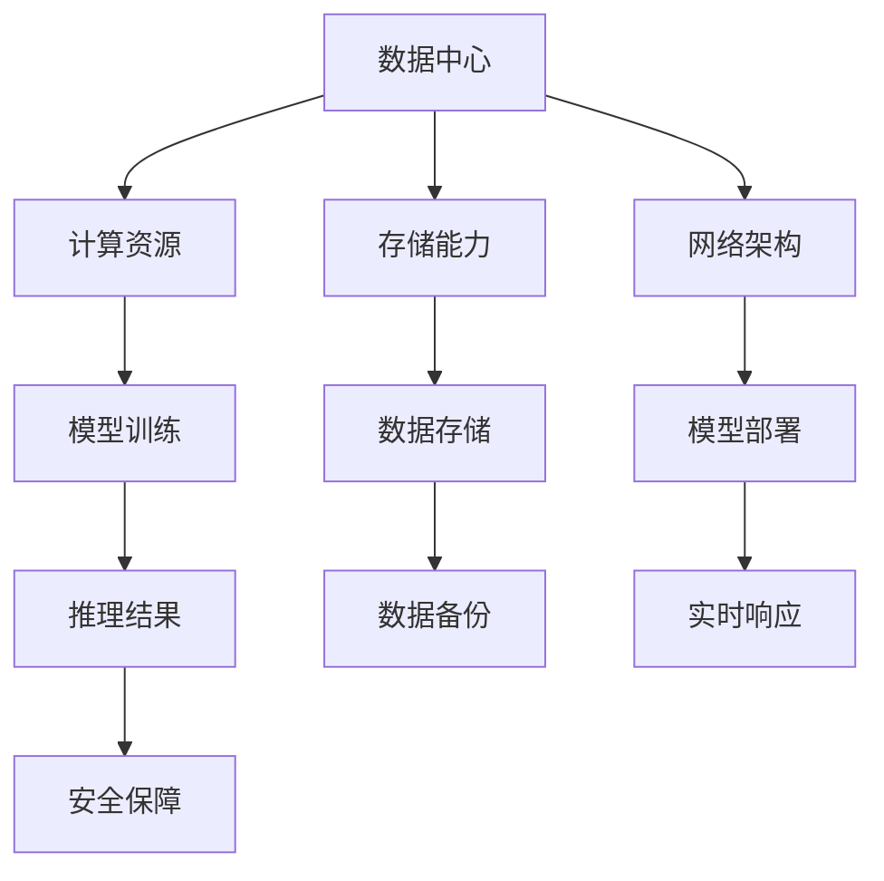

                 

# AI 大模型应用数据中心建设：数据中心投资与建设

> 关键词：AI大模型，数据中心，投资建设，性能优化，安全性

> 摘要：本文旨在探讨 AI 大模型应用数据中心建设的核心问题，包括投资决策、数据中心建设方案、性能优化策略和安全保障措施。通过对 AI 大模型与数据中心之间关系的深入分析，本文将帮助读者理解数据中心建设在 AI 应用中的关键作用，以及如何通过科学的投资和建设策略，实现高效、安全、可持续的 AI 应用数据中心。

## 1. 背景介绍

### 1.1 目的和范围

本文的目的在于阐述 AI 大模型应用数据中心建设的重要性，分析数据中心在 AI 应用中的角色和功能，以及投资与建设的核心考量因素。本文将涵盖以下主要内容：

- 数据中心的基本概念与分类
- 数据中心在 AI 应用中的关键作用
- 数据中心投资与建设的核心考量因素
- 数据中心性能优化策略
- 数据中心安全保障措施

### 1.2 预期读者

本文适用于对 AI 和数据中心有基本了解的技术人员、数据科学家、IT 管理者和决策者。通过本文，读者可以：

- 理解 AI 大模型对数据中心建设的需求
- 掌握数据中心投资与建设的关键要素
- 学习数据中心性能优化和安全保障的方法
- 为未来的 AI 数据中心建设提供参考

### 1.3 文档结构概述

本文将按照以下结构进行组织：

- 第1章：背景介绍，概述本文的目的、范围和预期读者。
- 第2章：核心概念与联系，介绍数据中心的基本概念、分类及其在 AI 应用中的重要性。
- 第3章：核心算法原理 & 具体操作步骤，分析 AI 大模型处理流程和数据中心的配合。
- 第4章：数学模型和公式 & 详细讲解 & 举例说明，阐述数据中心性能评估的关键数学模型。
- 第5章：项目实战：代码实际案例和详细解释说明，通过具体案例展示数据中心建设与应用。
- 第6章：实际应用场景，分析 AI 大模型在不同行业中的应用案例。
- 第7章：工具和资源推荐，介绍相关的学习资源和开发工具。
- 第8章：总结：未来发展趋势与挑战，探讨数据中心建设的未来方向和面临的挑战。
- 第9章：附录：常见问题与解答，解答读者可能遇到的问题。
- 第10章：扩展阅读 & 参考资料，提供更多的学习资源。

### 1.4 术语表

#### 1.4.1 核心术语定义

- 数据中心：集中存储、处理和管理数据的设施，提供计算、存储和网络资源。
- AI 大模型：基于深度学习的复杂神经网络模型，具有大规模参数和强大的计算需求。
- 投资建设：在数据中心建设和运营过程中，资金的投入和管理。
- 性能优化：提高数据中心的计算、存储和网络性能。
- 安全保障：确保数据中心的物理安全和数据安全。

#### 1.4.2 相关概念解释

- 数据存储：数据在数据中心中的存储方式和管理策略。
- 计算资源：数据中心提供的计算能力，包括 CPU、GPU、FPGA 等。
- 网络架构：数据中心内部和外部网络的组织结构和通信机制。
- 热管理：数据中心温度控制策略，保证设备正常运行。
- 数据备份：确保数据在意外情况下的安全性和可用性。

#### 1.4.3 缩略词列表

- AI: 人工智能 (Artificial Intelligence)
- GPU: 图形处理单元 (Graphics Processing Unit)
- FPGA: 现场可编程门阵列 (Field-Programmable Gate Array)
- IDC: 数据中心 (Internet Data Center)
- SDN: 软定义网络 (Software-Defined Networking)
- IaaS: 基础设施即服务 (Infrastructure as a Service)

## 2. 核心概念与联系

### 2.1 数据中心的基本概念

数据中心（IDC）是一种高度集成的计算、存储和网络设施，用于集中处理、存储和管理大量的数据。它通常包括以下几个核心部分：

1. **硬件设施**：包括服务器、存储设备、网络设备等。
2. **软件系统**：用于管理硬件资源和数据流程的操作系统、数据库管理系统、虚拟化软件等。
3. **网络架构**：包括内部网络和外部网络，实现数据的高速传输和访问。
4. **环境控制**：包括温度、湿度、电力供应和备份等，确保设备正常运行。

### 2.2 数据中心的分类

数据中心根据规模、服务级别、技术架构等可以分为以下几类：

1. **企业内部数据中心**：企业自建的数据处理设施，服务于企业内部的数据存储和处理需求。
2. **公用数据中心**：为多个企业提供数据存储和处理服务的公共设施。
3. **云数据中心**：基于云计算技术，提供基础设施即服务（IaaS）、平台即服务（PaaS）和软件即服务（SaaS）的设施。
4. **托管数据中心**：提供托管服务，企业将数据处理设施托管给专业服务商。

### 2.3 数据中心在 AI 应用中的关键作用

AI 大模型的训练和部署对计算资源、存储能力和网络传输速度有极高的要求。数据中心作为 AI 应用的基础设施，发挥着关键作用：

1. **计算资源**：AI 大模型的训练需要大量的计算资源，数据中心提供高效的计算能力，支持模型训练和推理。
2. **存储能力**：数据中心提供大容量、高可靠性的存储设施，存储 AI 模型的训练数据和推理结果。
3. **网络架构**：数据中心提供的网络架构支持快速的数据传输和高效的模型部署，实现 AI 应用的实时响应。
4. **环境控制**：数据中心的环境控制设施确保设备在适宜的温度、湿度下运行，提高设备稳定性和寿命。

### 2.4 数据中心与 AI 大模型的关系

数据中心与 AI 大模型之间存在着紧密的联系，具体体现在以下几个方面：

1. **计算与存储需求**：AI 大模型对计算资源和存储能力的需求巨大，数据中心提供相应的资源支持模型训练和推理。
2. **数据传输速度**：数据中心提供的快速网络传输能力，确保模型训练和推理过程中的数据传输效率。
3. **环境控制**：数据中心的环境控制设施，如温度、湿度、电力供应等，直接影响 AI 大模型训练和推理的稳定性。
4. **安全保障**：数据中心的安全保障措施，如物理安全、网络安全和数据备份，确保 AI 大模型的安全运行。

### 2.5 数据中心的 Mermaid 流程图

以下是一个简单的 Mermaid 流程图，展示数据中心与 AI 大模型之间的交互关系：



## 3. 核心算法原理 & 具体操作步骤

### 3.1 AI 大模型处理流程

AI 大模型处理流程主要包括模型训练、模型推理和模型部署三个阶段。以下是具体的操作步骤：

#### 3.1.1 模型训练

- **数据预处理**：清洗和预处理数据，包括数据去重、缺失值填充、数据归一化等。
- **模型设计**：根据应用场景，设计合适的神经网络结构，选择合适的优化器和损失函数。
- **模型训练**：使用训练数据进行模型训练，通过反向传播算法不断调整模型参数，使模型逐渐逼近最优解。
- **模型评估**：使用验证集对模型进行评估，调整超参数以优化模型性能。

#### 3.1.2 模型推理

- **数据加载**：将输入数据加载到模型中。
- **模型推理**：使用训练好的模型进行推理，输出预测结果。
- **结果处理**：对预测结果进行后处理，如阈值处理、概率转换等。

#### 3.1.3 模型部署

- **模型压缩**：对模型进行压缩，减少模型体积，提高推理速度。
- **模型迁移**：将模型迁移到目标设备，如服务器、GPU、FPGA 等。
- **模型部署**：将模型部署到生产环境，提供实时推理服务。

### 3.2 数据中心与 AI 大模型的配合

数据中心在 AI 大模型处理过程中扮演着重要角色，具体表现在以下几个方面：

#### 3.2.1 计算资源配合

- **分布式计算**：数据中心提供分布式计算能力，支持多台服务器协同工作，加速模型训练和推理。
- **GPU 加速**：数据中心配备高性能 GPU，支持深度学习模型的并行计算，提高训练速度。
- **FPGA 优化**：数据中心利用 FPGA 的高效计算能力，优化模型推理速度，降低功耗。

#### 3.2.2 存储资源配合

- **分布式存储**：数据中心提供分布式存储系统，支持海量数据的存储和快速访问。
- **缓存机制**：数据中心利用缓存机制，减少数据访问延迟，提高模型训练和推理速度。
- **数据备份**：数据中心提供数据备份服务，确保数据安全可靠。

#### 3.2.3 网络资源配合

- **高速网络**：数据中心提供高速网络，支持数据的高速传输，提高模型训练和推理效率。
- **负载均衡**：数据中心利用负载均衡技术，优化网络资源分配，提高系统稳定性。
- **网络安全**：数据中心提供网络安全保障措施，防止数据泄露和网络攻击。

### 3.3 伪代码示例

以下是一个简单的伪代码示例，展示 AI 大模型处理流程和数据中心配合的步骤：

```python
# 数据预处理
def preprocess_data(data):
    # 数据清洗、去重、缺失值填充等
    return cleaned_data

# 模型设计
def design_model():
    # 选择神经网络结构、优化器和损失函数等
    return model

# 模型训练
def train_model(model, train_data, valid_data):
    # 使用训练数据进行模型训练
    return trained_model

# 模型推理
def inference(model, input_data):
    # 使用训练好的模型进行推理
    return prediction

# 模型部署
def deploy_model(model):
    # 将模型部署到生产环境
    return deployed_model

# 数据中心与 AI 大模型配合
def ai_workflow(data_center, data, model):
    cleaned_data = preprocess_data(data)
    trained_model = train_model(data_center, cleaned_data, valid_data)
    prediction = inference(trained_model, input_data)
    deployed_model = deploy_model(trained_model)
    return deployed_model
```

## 4. 数学模型和公式 & 详细讲解 & 举例说明

### 4.1 数据中心性能评估的关键数学模型

数据中心性能评估是确保数据中心能够满足 AI 大模型需求的关键步骤。以下是一些常用的数学模型和公式：

#### 4.1.1 计算资源利用率

计算资源利用率是衡量数据中心计算资源使用效率的重要指标，计算公式如下：

$$
\text{利用率} = \frac{\text{实际使用计算资源}}{\text{总计算资源}} \times 100\%
$$

#### 4.1.2 存储资源利用率

存储资源利用率是衡量数据中心存储资源使用效率的重要指标，计算公式如下：

$$
\text{利用率} = \frac{\text{实际使用存储空间}}{\text{总存储空间}} \times 100\%
$$

#### 4.1.3 网络带宽利用率

网络带宽利用率是衡量数据中心网络资源使用效率的重要指标，计算公式如下：

$$
\text{利用率} = \frac{\text{实际带宽使用}}{\text{总带宽}} \times 100\%
$$

#### 4.1.4 能耗效率

能耗效率是衡量数据中心能耗与性能关系的指标，计算公式如下：

$$
\text{能耗效率} = \frac{\text{实际性能}}{\text{总能耗}} \times 100\%
$$

#### 4.1.5 带宽延迟

带宽延迟是衡量数据中心网络传输速度和响应时间的重要指标，计算公式如下：

$$
\text{带宽延迟} = \frac{\text{数据传输时间}}{\text{数据传输量}}
$$

### 4.2 数据中心性能评估示例

以下是一个简单的数据中心性能评估示例：

假设某数据中心拥有 100 台服务器，总计算资源为 1000 TFLOPS，总存储空间为 100 PB，总带宽为 10 Gbps。

- **计算资源利用率**：假设实际使用计算资源为 800 TFLOPS，则计算资源利用率为：

$$
\text{利用率} = \frac{800}{1000} \times 100\% = 80\%
$$

- **存储资源利用率**：假设实际使用存储空间为 80 PB，则存储资源利用率为：

$$
\text{利用率} = \frac{80}{100} \times 100\% = 80\%
$$

- **网络带宽利用率**：假设实际带宽使用为 5 Gbps，则网络带宽利用率为：

$$
\text{利用率} = \frac{5}{10} \times 100\% = 50\%
$$

- **能耗效率**：假设数据中心总能耗为 1000 kW，实际性能为 800 TFLOPS，则能耗效率为：

$$
\text{能耗效率} = \frac{800}{1000} \times 100\% = 80\%
$$

- **带宽延迟**：假设数据传输时间为 1 秒，数据传输量为 100 MB，则带宽延迟为：

$$
\text{带宽延迟} = \frac{1}{100} = 0.01 \text{秒}
$$

通过以上示例，可以清晰地看出数据中心性能的各个方面，为优化数据中心性能提供依据。

## 5. 项目实战：代码实际案例和详细解释说明

### 5.1 开发环境搭建

在进行 AI 大模型应用数据中心建设之前，首先需要搭建一个合适的开发环境。以下是一个基本的开发环境搭建步骤：

1. **硬件环境**：选择具有足够计算资源的服务器和存储设备，如高性能 GPU 和大容量硬盘。
2. **操作系统**：安装 Linux 操作系统，如 Ubuntu 或 CentOS，以支持深度学习框架和数据中心管理软件。
3. **深度学习框架**：安装 TensorFlow、PyTorch 等深度学习框架，以支持 AI 大模型的训练和推理。
4. **数据中心管理软件**：安装如 Kubernetes、Docker 等容器化和编排工具，以实现数据中心资源的自动化管理和调度。

### 5.2 源代码详细实现和代码解读

以下是一个简单的 AI 大模型训练和推理的代码实现，展示数据中心与 AI 大模型的配合：

```python
import tensorflow as tf
import numpy as np

# 数据预处理
def preprocess_data(data):
    # 数据清洗、去重、缺失值填充等
    return cleaned_data

# 模型设计
def design_model():
    # 选择神经网络结构、优化器和损失函数等
    model = tf.keras.Sequential([
        tf.keras.layers.Dense(128, activation='relu', input_shape=(784,)),
        tf.keras.layers.Dense(10, activation='softmax')
    ])
    optimizer = tf.keras.optimizers.Adam(0.001)
    loss_function = tf.keras.losses.SparseCategoricalCrossentropy(from_logits=True)
    return model, optimizer, loss_function

# 模型训练
def train_model(model, train_data, valid_data):
    # 使用训练数据进行模型训练
    model.compile(optimizer=optimizer, loss=loss_function, metrics=['accuracy'])
    model.fit(train_data, epochs=10, validation_data=valid_data)

# 模型推理
def inference(model, input_data):
    # 使用训练好的模型进行推理
    prediction = model.predict(input_data)
    return prediction

# 模型部署
def deploy_model(model):
    # 将模型部署到生产环境
    model.save('model.h5')

# 数据中心与 AI 大模型配合
def ai_workflow(data_center, data, model):
    cleaned_data = preprocess_data(data)
    trained_model = train_model(data_center, cleaned_data, valid_data)
    prediction = inference(trained_model, input_data)
    deployed_model = deploy_model(trained_model)
    return deployed_model

# 主函数
if __name__ == '__main__':
    data_center = ...  # 数据中心配置
    data = ...  # 输入数据
    model = ...  # 模型
    ai_workflow(data_center, data, model)
```

### 5.3 代码解读与分析

以上代码展示了 AI 大模型的训练、推理和部署过程，以及数据中心与 AI 大模型的配合。以下是代码的主要组成部分及其功能：

- **数据预处理**：对输入数据进行清洗、去重、缺失值填充等预处理操作，确保数据质量。
- **模型设计**：设计神经网络结构，包括输入层、隐藏层和输出层，以及优化器和损失函数。
- **模型训练**：使用训练数据对模型进行训练，通过反向传播算法调整模型参数，优化模型性能。
- **模型推理**：使用训练好的模型对输入数据进行推理，输出预测结果。
- **模型部署**：将训练好的模型保存到文件中，以便在后续生产环境中使用。

代码中的 `ai_workflow` 函数实现了数据中心与 AI 大模型的配合，通过调用预处理、训练、推理和部署函数，实现整个 AI 大模型处理流程。

在实际应用中，可以根据具体需求对代码进行修改和扩展，如增加数据增强、调整模型结构、优化训练策略等，以提升模型性能和适应不同的应用场景。

## 6. 实际应用场景

### 6.1 金融行业

在金融行业，AI 大模型应用数据中心的建设至关重要。以下是一些具体的实际应用场景：

- **风险管理**：利用 AI 大模型对金融风险进行预测和评估，数据中心提供强大的计算资源和存储能力，支持海量数据的实时处理和分析。
- **投资策略**：AI 大模型可以帮助金融机构制定和优化投资策略，数据中心提供高效的数据存储和快速访问，确保投资决策的实时性。
- **客户服务**：通过 AI 大模型构建智能客服系统，数据中心支持大规模客服机器人集群的部署和运行，提供24/7的客户服务。

### 6.2 医疗健康

在医疗健康领域，AI 大模型应用数据中心的建设同样具有重要意义。以下是一些实际应用场景：

- **疾病预测**：利用 AI 大模型分析海量医疗数据，预测疾病的发生和发展，数据中心提供高效的数据处理和存储能力，支持实时数据分析和模型更新。
- **药物研发**：AI 大模型可以加速药物研发过程，数据中心提供强大的计算资源，支持药物分子模拟和计算生物学分析。
- **健康监测**：通过 AI 大模型对患者的健康数据进行分析，数据中心提供实时数据存储和访问，支持个性化健康监测和干预。

### 6.3 交通运输

在交通运输领域，AI 大模型应用数据中心的建设有助于提升交通管理和安全水平。以下是一些实际应用场景：

- **智能交通管理**：利用 AI 大模型进行交通流量预测和优化，数据中心提供高效的数据处理和分析能力，支持智能交通管理系统的部署和运行。
- **自动驾驶**：自动驾驶系统依赖于 AI 大模型进行环境感知和决策，数据中心提供强大的计算资源和存储能力，支持自动驾驶算法的实时训练和更新。
- **安全监测**：利用 AI 大模型对交通场景进行实时监控和分析，数据中心提供高效的数据存储和快速访问，支持交通事故的预测和预防。

### 6.4 电子商务

在电子商务领域，AI 大模型应用数据中心的建设有助于提升用户体验和运营效率。以下是一些实际应用场景：

- **个性化推荐**：通过 AI 大模型分析用户行为和偏好，数据中心提供高效的数据处理和存储能力，支持个性化推荐系统的部署和运行。
- **价格优化**：利用 AI 大模型对市场数据进行分析，数据中心提供高效的数据处理能力，支持动态价格优化策略的制定和实施。
- **客户服务**：通过 AI 大模型构建智能客服系统，数据中心提供高效的数据存储和快速访问，支持24/7的客户服务。

## 7. 工具和资源推荐

### 7.1 学习资源推荐

#### 7.1.1 书籍推荐

- 《深度学习》（Goodfellow, Bengio, Courville）：介绍深度学习的基本概念、算法和应用，适合初学者和进阶者。
- 《Python深度学习》（François Chollet）：详细讲解使用 Python 和 TensorFlow 进行深度学习的实践方法。
- 《大数据处理：应用、算法和系统》（Dean, Ghemawat）：介绍大数据处理的基础知识和 Google 大数据技术栈。

#### 7.1.2 在线课程

- Coursera：提供多个深度学习和大数据处理的在线课程，如《深度学习专

