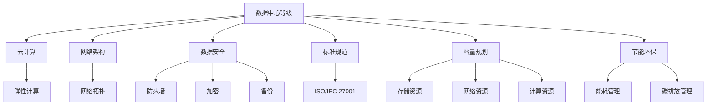

                 


# AI 大模型应用数据中心建设：数据中心标准与规范

> **关键词**：数据中心建设、AI 大模型、云计算、网络架构、数据安全、标准规范
> 
> **摘要**：本文旨在探讨 AI 大模型应用数据中心的建设过程，包括数据中心标准与规范的制定、核心概念与联系、算法原理、数学模型、实际应用场景以及未来发展趋势与挑战。通过详细讲解和案例分析，帮助读者了解数据中心建设的核心要素和关键技术。

## 1. 背景介绍

### 1.1 目的和范围

本文旨在为从事 AI 大模型应用数据中心建设的工程师和研究人员提供一套完整的建设指南。本文将涵盖数据中心建设的关键环节，包括数据中心标准与规范的制定、核心概念与联系、算法原理、数学模型、实际应用场景以及未来发展趋势与挑战。希望通过本文的讲解，读者能够系统地掌握数据中心建设的核心要素和关键技术。

### 1.2 预期读者

本文适合以下读者群体：

- 从事 AI 大模型应用数据中心建设的工程师和研究人员；
- 对数据中心建设和 AI 大模型技术感兴趣的技术爱好者；
- 欲了解数据中心建设现状和未来发展趋势的相关行业从业者。

### 1.3 文档结构概述

本文结构如下：

1. 背景介绍：介绍数据中心建设的目的、范围、预期读者和文档结构；
2. 核心概念与联系：阐述数据中心建设中的核心概念及其相互关系，使用 Mermaid 流程图展示；
3. 核心算法原理 & 具体操作步骤：详细讲解数据中心建设中的核心算法原理和操作步骤，使用伪代码进行阐述；
4. 数学模型和公式 & 详细讲解 & 举例说明：介绍数据中心建设中的数学模型和公式，并进行详细讲解和举例说明；
5. 项目实战：通过代码实际案例，详细解释数据中心建设的实现过程；
6. 实际应用场景：分析数据中心在不同领域的应用场景；
7. 工具和资源推荐：推荐学习资源、开发工具框架和相关论文著作；
8. 总结：回顾数据中心建设的核心要素和关键技术，展望未来发展趋势与挑战；
9. 附录：常见问题与解答；
10. 扩展阅读 & 参考资料：提供进一步阅读的参考资料。

### 1.4 术语表

#### 1.4.1 核心术语定义

- 数据中心：集中存放计算机系统、网络设备和数据存储设备的建筑设施；
- AI 大模型：具有亿级参数规模，可以处理海量数据的人工智能模型；
- 云计算：通过互联网动态分配计算资源，实现计算任务的分布式处理；
- 网络架构：数据中心内部和外部的网络连接方式、拓扑结构；
- 数据安全：保护数据不被未经授权的访问、篡改和泄露；
- 标准规范：数据中心建设和运营中遵循的规范和标准。

#### 1.4.2 相关概念解释

- 数据中心等级：根据电力、网络、安全等指标，将数据中心分为多个等级；
- 弹性计算：根据需求动态调整计算资源，实现资源的高效利用；
- 容量规划：根据业务需求，合理规划数据中心的存储、网络和计算资源；
- 节能环保：通过技术手段降低数据中心的能耗和碳排放。

#### 1.4.3 缩略词列表

- AI：人工智能
- ML：机器学习
- DL：深度学习
- GPU：图形处理单元
- FPGA：现场可编程门阵列
- TCO：总拥有成本
- SLA：服务级别协议
- ISO：国际标准化组织

## 2. 核心概念与联系

在数据中心建设中，了解核心概念及其相互关系至关重要。以下将介绍数据中心建设中的核心概念，并使用 Mermaid 流程图展示它们之间的联系。

### 2.1 数据中心建设核心概念

1. **数据中心等级**：数据中心按照电力、网络、安全等指标分为不同等级，如 T3、T4 等；
2. **云计算**：通过虚拟化技术，实现计算资源的动态分配和弹性计算；
3. **网络架构**：数据中心内部和外部的网络连接方式，如 spine-and-leaf、Clos 等拓扑结构；
4. **数据安全**：通过防火墙、加密、备份等技术手段，保障数据的安全；
5. **标准规范**：数据中心建设和运营中遵循的规范和标准，如 ISO/IEC 27001 等；
6. **容量规划**：根据业务需求，合理规划数据中心的存储、网络和计算资源；
7. **节能环保**：通过技术手段降低数据中心的能耗和碳排放。

### 2.2 Mermaid 流程图展示核心概念联系



## 3. 核心算法原理 & 具体操作步骤

数据中心建设中，核心算法原理和操作步骤是保障系统高效、稳定运行的关键。以下将详细讲解数据中心建设中的核心算法原理和操作步骤。

### 3.1 数据中心建设核心算法原理

1. **负载均衡算法**：通过将请求分配到多个服务器，实现系统的高可用性；
2. **分布式存储算法**：通过将数据分散存储在多个节点，实现数据的冗余备份和快速访问；
3. **网络路由算法**：根据网络拓扑结构，选择最优路径传输数据；
4. **数据加密算法**：对数据进行加密处理，保障数据传输过程中的安全；
5. **备份与恢复算法**：对数据进行备份和恢复，确保数据的安全性。

### 3.2 具体操作步骤

#### 3.2.1 负载均衡算法

**算法原理**：

负载均衡算法的核心思想是将请求分配到多个服务器，实现系统的高可用性。以下是一种简单的轮询负载均衡算法：

```pseudo
// 轮询负载均衡算法
function roundRobinLoadBalancer(serverList):
    for request in requestList:
        currentServer = serverList[(currentIndex % serverList.length)]
        sendRequest(request, currentServer)
        currentIndex += 1
```

**具体操作步骤**：

1. 初始化服务器列表 serverList 和请求列表 requestList；
2. 遍历请求列表，将每个请求分配到服务器列表中的下一个服务器；
3. 当请求列表遍历完毕后，重新从第一个服务器开始分配请求。

#### 3.2.2 分布式存储算法

**算法原理**：

分布式存储算法的核心思想是将数据分散存储在多个节点，实现数据的冗余备份和快速访问。以下是一种简单的数据分片算法：

```pseudo
// 数据分片算法
function shardData(data, shardCount):
    shardSize = ceil(data.length / shardCount)
    shards = []
    for i from 0 to shardCount - 1:
        shard = data[i * shardSize:(i + 1) * shardSize]
        shards.append(shard)
    return shards
```

**具体操作步骤**：

1. 根据数据量和分片数量，计算每个分片的尺寸；
2. 将数据按尺寸进行分割，生成多个分片；
3. 将分片存储到不同的节点，实现数据的分散存储。

#### 3.2.3 网络路由算法

**算法原理**：

网络路由算法的核心思想是根据网络拓扑结构，选择最优路径传输数据。以下是一种简单的距离矢量路由算法：

```pseudo
// 距离矢量路由算法
function distanceVectorRouting(table, neighborTable):
    for destination in destinations:
        minDistance = infinity
        for neighbor in neighborTable:
            distance = table[neighbor][destination]
            if distance < minDistance:
                minDistance = distance
                nextHop = neighbor
    return nextHop, minDistance
```

**具体操作步骤**：

1. 初始化路由表 table 和邻居表 neighborTable；
2. 遍历所有目的地，计算每个目的地的最小距离和下一个跳点；
3. 根据最小距离和下一个跳点，更新路由表。

#### 3.2.4 数据加密算法

**算法原理**：

数据加密算法的核心思想是对数据进行加密处理，保障数据传输过程中的安全。以下是一种简单的对称加密算法（AES）：

```pseudo
// 对称加密算法（AES）
function encrypt(data, key):
    ciphertext = AES_encrypt(data, key)
    return ciphertext
```

**具体操作步骤**：

1. 初始化加密密钥 key；
2. 使用 AES 加密算法对数据进行加密；
3. 返回加密后的密文。

#### 3.2.5 备份与恢复算法

**算法原理**：

备份与恢复算法的核心思想是对数据进行备份和恢复，确保数据的安全性。以下是一种简单的增量备份算法：

```pseudo
// 增量备份算法
function incrementalBackup(data, backupDir):
    timestamp = getCurrentTimestamp()
    backupFile = backupDir + "/" + timestamp + ".bak"
    saveDataAsFile(data, backupFile)
```

**具体操作步骤**：

1. 获取当前时间戳 timestamp；
2. 生成备份文件名 backupFile；
3. 将数据保存为备份文件。

## 4. 数学模型和公式 & 详细讲解 & 举例说明

在数据中心建设中，数学模型和公式用于描述系统的性能、资源利用率等关键指标。以下将介绍数据中心建设中的数学模型和公式，并进行详细讲解和举例说明。

### 4.1 性能模型

#### 4.1.1 平均响应时间

平均响应时间用于衡量系统的性能，表示系统处理请求的平均耗时。公式如下：

$$
\bar{t} = \frac{1}{n} \sum_{i=1}^{n} t_i
$$

其中，$n$ 为请求次数，$t_i$ 为第 $i$ 次请求的响应时间。

**举例说明**：假设系统在 10 次请求中的响应时间分别为 5ms、10ms、15ms、20ms、25ms、30ms、35ms、40ms、45ms 和 50ms，则平均响应时间为：

$$
\bar{t} = \frac{1}{10} (5 + 10 + 15 + 20 + 25 + 30 + 35 + 40 + 45 + 50) = 30 \text{ms}
$$

### 4.1.2 吞吐量

吞吐量用于衡量系统的处理能力，表示单位时间内系统处理的请求数量。公式如下：

$$
Q = \frac{1}{t} \sum_{i=1}^{n} r_i
$$

其中，$t$ 为时间间隔，$n$ 为请求次数，$r_i$ 为第 $i$ 次请求的响应时间。

**举例说明**：假设系统在 10 秒内处理了 10 个请求，则吞吐量为：

$$
Q = \frac{1}{10} \times 10 = 1 \text{请求/秒}
$$

### 4.1.3 资源利用率

资源利用率用于衡量系统资源的利用程度，表示资源被有效利用的比例。公式如下：

$$
\text{资源利用率} = \frac{\text{实际使用资源}}{\text{总资源}} \times 100\%
$$

**举例说明**：假设系统有 10 个 CPU 核心，实际使用了 8 个 CPU 核心，则资源利用率为：

$$
\text{资源利用率} = \frac{8}{10} \times 100\% = 80\%
$$

### 4.2 网络模型

#### 4.2.1 传输速率

传输速率用于衡量网络传输能力，表示单位时间内传输的数据量。公式如下：

$$
R = \frac{L}{t}
$$

其中，$R$ 为传输速率，$L$ 为传输数据量，$t$ 为传输时间。

**举例说明**：假设网络传输速率

