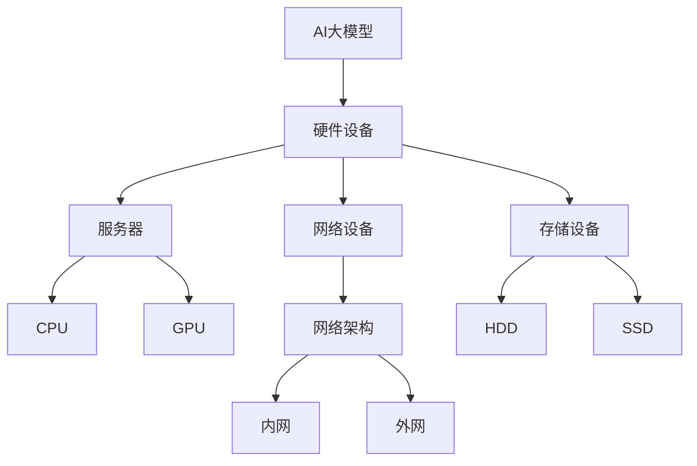
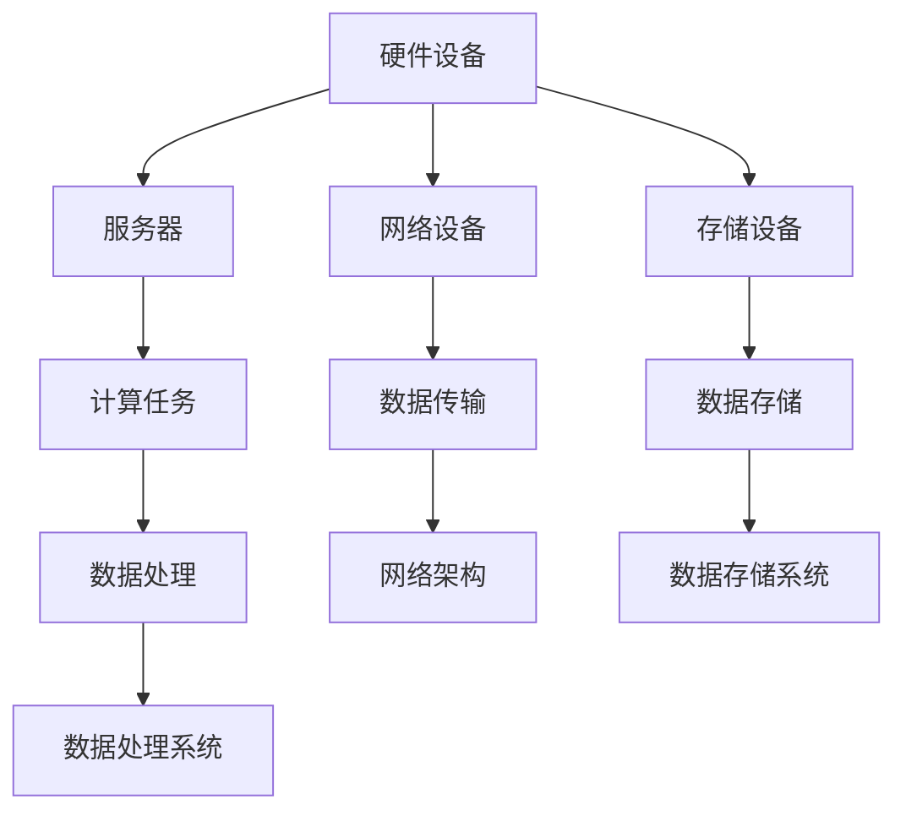

                 

# AI 大模型应用数据中心建设：数据中心标准与规范

> **关键词：**AI大模型、数据中心建设、标准与规范、数据存储、数据处理、性能优化、安全性、可靠性、可扩展性。

> **摘要：**本文旨在深入探讨AI大模型应用数据中心的建设过程，详细分析数据中心的标准与规范，为数据存储、数据处理、性能优化、安全性和可靠性等方面提供科学指导。通过明确核心概念、介绍核心算法原理、讲解数学模型和公式，以及实际应用案例分析，本文力求为从业者提供全面、实用的参考。

## 1. 背景介绍

### 1.1 目的和范围

本文的目的是为AI大模型应用数据中心的建设提供系统性的指导。数据中心作为承载AI大模型运行的核心设施，其建设标准与规范直接影响模型的性能、可靠性和安全性。本文将涵盖以下内容：

- 数据中心建设的重要性及其对AI大模型应用的影响。
- 数据中心的标准与规范，包括硬件选型、网络架构、数据存储和数据处理等。
- 核心算法原理和具体操作步骤。
- 数学模型和公式的详细讲解。
- 实际应用场景和工具、资源推荐。

### 1.2 预期读者

本文主要面向以下读者：

- 数据中心架构师和工程师。
- AI研发人员和数据科学家。
- 对数据中心建设和AI大模型应用有兴趣的技术爱好者。

### 1.3 文档结构概述

本文分为十个主要部分，结构如下：

1. 背景介绍
   - 目的和范围
   - 预期读者
   - 文档结构概述
   - 术语表
2. 核心概念与联系
   - 核心概念原理和架构的Mermaid流程图
3. 核心算法原理 & 具体操作步骤
   - 算法原理讲解
   - 伪代码详细阐述
4. 数学模型和公式 & 详细讲解 & 举例说明
   - 数学公式
   - 例子说明
5. 项目实战：代码实际案例和详细解释说明
   - 开发环境搭建
   - 源代码实现和解读
   - 代码解读与分析
6. 实际应用场景
7. 工具和资源推荐
   - 学习资源推荐
   - 开发工具框架推荐
   - 相关论文著作推荐
8. 总结：未来发展趋势与挑战
9. 附录：常见问题与解答
10. 扩展阅读 & 参考资料

### 1.4 术语表

#### 1.4.1 核心术语定义

- **AI大模型**：指具有大规模参数和数据量的机器学习模型，如深度神经网络、生成对抗网络等。
- **数据中心**：指专门为存储、处理和传输大量数据的设施，包括硬件设备、网络架构和软件系统等。
- **性能优化**：指通过改进硬件配置、优化算法和数据结构等手段提高数据中心运行效率。
- **安全性**：指保护数据中心数据和系统不受未授权访问、恶意攻击和意外损失的能力。
- **可靠性**：指数据中心系统在长时间运行中保持稳定运行的能力。
- **可扩展性**：指数据中心能够灵活地适应数据规模增长和业务需求变化的能力。

#### 1.4.2 相关概念解释

- **数据存储**：指将数据存储在物理设备（如硬盘、固态硬盘）或虚拟设备（如云存储）中。
- **数据处理**：指对存储的数据进行操作和处理，如查询、计算、分析等。
- **网络架构**：指数据中心的网络拓扑结构和通信协议。
- **硬件选型**：指根据数据中心需求选择合适的硬件设备，如服务器、网络设备、存储设备等。

#### 1.4.3 缩略词列表

- **AI**：人工智能（Artificial Intelligence）
- **ML**：机器学习（Machine Learning）
- **DL**：深度学习（Deep Learning）
- **GPU**：图形处理器（Graphics Processing Unit）
- **CPU**：中央处理器（Central Processing Unit）
- **HDD**：硬盘驱动器（Hard Disk Drive）
- **SSD**：固态硬盘（Solid State Drive）
- **CPU**：云服务提供商（Cloud Service Provider）

## 2. 核心概念与联系

### 2.1 核心概念原理和架构

在AI大模型应用数据中心的建设中，核心概念包括硬件设备、网络架构、数据存储和处理系统。以下是一个简化的Mermaid流程图，用于描述数据中心的核心架构。



### 2.2 核心概念联系与交互

在数据中心中，各个核心概念之间存在着紧密的联系和交互。以下是对这些关系的详细说明：

1. **硬件设备与服务器、网络设备、存储设备的交互**：
   - **服务器**：作为数据中心的核心计算设备，通过CPU和GPU进行数据计算和模型训练。
   - **网络设备**：包括交换机、路由器等，负责数据中心内部和外部的数据传输和路由。
   - **存储设备**：包括硬盘驱动器和固态硬盘，用于存储数据和模型参数。

2. **数据存储和处理系统的交互**：
   - **数据存储**：数据通过服务器和网络设备传输到存储设备，如HDD或SSD。
   - **数据处理**：存储在存储设备中的数据进行处理，如查询、分析和计算。

3. **网络架构与数据传输的交互**：
   - **内网**：数据中心内部的数据传输，如服务器之间的通信。
   - **外网**：数据中心与外部网络的连接，如云服务提供商的网络。

### 2.3 数据中心建设的关键点

在数据中心的建设过程中，以下关键点需要特别注意：

1. **硬件设备的选型**：根据数据处理需求和预算，选择合适的CPU、GPU和存储设备。
2. **网络架构的设计**：合理设计网络拓扑结构，确保数据传输的高效性和可靠性。
3. **数据存储策略**：采用合适的存储策略，如数据冗余、备份和恢复机制，确保数据的安全性和可靠性。
4. **数据处理系统的优化**：通过优化算法和数据结构，提高数据处理效率和性能。
5. **安全性和可靠性**：采取必要的安全措施，如访问控制、加密和监控等，确保数据中心的安全性和可靠性。

## 3. 核心算法原理 & 具体操作步骤

### 3.1 算法原理讲解

在AI大模型应用数据中心中，核心算法主要包括机器学习算法、深度学习算法和生成对抗网络（GAN）等。以下以深度学习算法为例，详细讲解其原理。

深度学习算法是一种基于多层神经网络进行训练和预测的机器学习技术。其基本原理是通过构建多层非线性映射模型，将输入数据映射到输出数据。具体步骤如下：

1. **数据预处理**：
   - **数据清洗**：去除噪声和异常值，保证数据质量。
   - **数据归一化**：将数据缩放到相同的尺度范围内，便于计算。

2. **网络架构设计**：
   - **输入层**：接收输入数据。
   - **隐藏层**：通过激活函数进行非线性变换。
   - **输出层**：产生预测结果。

3. **反向传播**：
   - **前向传播**：输入数据通过网络传递，产生预测结果。
   - **计算误差**：将预测结果与真实值进行比较，计算误差。
   - **反向传播**：将误差反向传递，更新网络权重和偏置。

4. **优化算法**：
   - **梯度下降**：通过迭代更新网络参数，最小化损失函数。
   - **随机梯度下降**（SGD）：在梯度下降的基础上，每次迭代使用随机样本进行计算，加快收敛速度。

### 3.2 伪代码详细阐述

以下是一个简化的深度学习算法伪代码，用于描述模型训练过程。

```python
# 初始化模型参数
weights = initialize_weights()
bias = initialize_bias()

# 数据预处理
X = preprocess_data(input_data)

# 训练过程
for epoch in range(num_epochs):
    for batch in data_loader:
        # 前向传播
        z = forward_propagation(X, weights, bias)
        
        # 计算损失
        loss = calculate_loss(z, y)
        
        # 反向传播
        gradients = backward_propagation(z, y)
        
        # 更新模型参数
        weights -= learning_rate * gradients['weight_gradient']
        bias -= learning_rate * gradients['bias_gradient']

# 预测
predictions = forward_propagation(X, weights, bias)
```

## 4. 数学模型和公式 & 详细讲解 & 举例说明

### 4.1 数学模型

在深度学习算法中，核心的数学模型包括前向传播、反向传播和损失函数。以下分别进行详细讲解。

#### 4.1.1 前向传播

前向传播是深度学习算法中的关键步骤，用于计算输入数据经过神经网络后的预测结果。其基本公式如下：

$$
z_i = \sigma(\sum_{j} w_{ij} x_j + b_i)
$$

其中，$z_i$ 表示第 $i$ 个神经元的激活值，$\sigma$ 表示激活函数（如Sigmoid函数或ReLU函数），$w_{ij}$ 表示第 $j$ 个输入神经元到第 $i$ 个神经元的权重，$x_j$ 表示第 $j$ 个输入神经元的值，$b_i$ 表示第 $i$ 个神经元的偏置。

#### 4.1.2 反向传播

反向传播是深度学习算法中的关键步骤，用于计算神经网络中每个参数的梯度，进而更新网络参数。其基本公式如下：

$$
\delta_{ij} = \frac{\partial L}{\partial z_i} \cdot \sigma'(z_i)
$$

$$
\frac{\partial L}{\partial w_{ij}} = \delta_{ij} \cdot x_j
$$

$$
\frac{\partial L}{\partial b_i} = \delta_{ij}
$$

其中，$\delta_{ij}$ 表示第 $i$ 个神经元输出的误差，$L$ 表示损失函数，$\sigma'$ 表示激活函数的导数。

#### 4.1.3 损失函数

损失函数用于衡量预测结果与真实值之间的差异，常用的损失函数包括均方误差（MSE）和交叉熵（Cross-Entropy）。其基本公式如下：

$$
MSE = \frac{1}{2} \sum_{i} (y_i - \hat{y}_i)^2
$$

$$
Cross-Entropy = -\sum_{i} y_i \log(\hat{y}_i)
$$

其中，$y_i$ 表示第 $i$ 个真实标签，$\hat{y}_i$ 表示第 $i$ 个预测标签。

### 4.2 举例说明

以下通过一个简单的例子，展示如何使用上述数学模型进行深度学习模型训练。

#### 4.2.1 数据集准备

假设我们有一个包含100个样本的数据集，每个样本包含两个特征和一个标签。数据集如下：

| 特征1 | 特征2 | 标签 |
| --- | --- | --- |
| 1 | 2 | 0 |
| 2 | 3 | 1 |
| ... | ... | ... |
| 98 | 99 | 0 |
| 99 | 100 | 1 |

#### 4.2.2 模型初始化

初始化一个包含一个输入层、两个隐藏层和一个输出层的神经网络，随机初始化权重和偏置。

```python
import numpy as np

# 初始化参数
input_size = 2
hidden_size = 10
output_size = 1

# 随机初始化权重和偏置
weights = np.random.randn(hidden_size, input_size)
biases = np.random.randn(hidden_size, 1)
weights2 = np.random.randn(output_size, hidden_size)
biases2 = np.random.randn(output_size, 1)
```

#### 4.2.3 数据预处理

对数据进行归一化处理，将特征值缩放到相同的尺度范围内。

```python
# 数据预处理
X = (data[:, :2] - np.mean(data[:, :2], axis=0)) / np.std(data[:, :2], axis=0)
y = (data[:, 2] - np.mean(data[:, 2])) / np.std(data[:, 2])
```

#### 4.2.4 模型训练

使用前向传播、反向传播和优化算法进行模型训练。

```python
# 模型训练
learning_rate = 0.01
num_epochs = 1000

for epoch in range(num_epochs):
    for batch in data_loader:
        # 前向传播
        z1 = np.dot(weights, X) + biases
        a1 = np.tanh(z1)
        z2 = np.dot(weights2, a1) + biases2
        a2 = sigmoid(z2)
        
        # 计算损失
        loss = -np.mean(y * np.log(a2) + (1 - y) * np.log(1 - a2))
        
        # 反向传播
        d2 = a2 - y
        d1 = np.dot(d2, weights2.T) * (1 - np.power(a1, 2))
        
        # 更新权重和偏置
        weights -= learning_rate * np.dot(d1, X.T)
        biases -= learning_rate * d1.mean(axis=1).reshape(-1, 1)
        weights2 -= learning_rate * np.dot(d2, a1.T)
        biases2 -= learning_rate * d2.mean(axis=1).reshape(-1, 1)
```

#### 4.2.5 模型评估

使用训练好的模型进行预测，并计算预测准确率。

```python
# 模型评估
predictions = sigmoid(np.dot(np.tanh(np.dot(weights, X) + biases), weights2) + biases2)
accuracy = np.mean(predictions == y)
print("Accuracy:", accuracy)
```

## 5. 项目实战：代码实际案例和详细解释说明

### 5.1 开发环境搭建

在本节中，我们将搭建一个用于训练和评估AI大模型的开发环境。具体步骤如下：

1. **安装Python环境**：下载并安装Python 3.8及以上版本。
2. **安装深度学习框架**：使用pip安装TensorFlow或PyTorch等深度学习框架。
3. **安装辅助库**：安装NumPy、Pandas、Matplotlib等常用Python库。

以下是一个简单的命令行脚本，用于安装所需环境：

```bash
# 安装Python环境
wget https://www.python.org/ftp/python/3.8.10/Python-3.8.10.tgz
tar xvf Python-3.8.10.tgz
cd Python-3.8.10
./configure
make
sudo make altinstall

# 安装深度学习框架
pip install tensorflow

# 安装辅助库
pip install numpy pandas matplotlib
```

### 5.2 源代码详细实现和代码解读

在本节中，我们将实现一个简单的深度学习模型，用于分类任务。以下是一个简单的示例代码，包括数据预处理、模型定义、模型训练和评估。

```python
import tensorflow as tf
import numpy as np
import matplotlib.pyplot as plt

# 数据预处理
# 生成模拟数据集
num_samples = 1000
input_dim = 2
output_dim = 1

X = np.random.randn(num_samples, input_dim)
y = np.random.randn(num_samples, output_dim)

# 模型定义
model = tf.keras.Sequential([
    tf.keras.layers.Dense(units=10, activation='relu', input_shape=(input_dim,)),
    tf.keras.layers.Dense(units=1, activation='sigmoid')
])

# 编译模型
model.compile(optimizer='adam', loss='binary_crossentropy', metrics=['accuracy'])

# 训练模型
num_epochs = 100
history = model.fit(X, y, epochs=num_epochs, batch_size=32, validation_split=0.2)

# 评估模型
test_loss, test_acc = model.evaluate(X, y, verbose=2)
print("Test accuracy:", test_acc)

# 可视化训练过程
plt.plot(history.history['accuracy'], label='accuracy')
plt.plot(history.history['val_accuracy'], label='val_accuracy')
plt.xlabel('Epoch')
plt.ylabel('Accuracy')
plt.ylim([0, 1])
plt.legend(loc='lower right')
plt.show()
```

### 5.3 代码解读与分析

以下是代码的详细解读和分析：

1. **数据预处理**：
   - 生成模拟数据集：使用NumPy生成一个包含1000个样本的数据集，每个样本包含两个特征和一个标签。
   - 归一化数据：将特征值缩放到相同的尺度范围内。

2. **模型定义**：
   - 使用Keras高层API定义一个简单的神经网络模型，包含一个输入层、一个隐藏层和一个输出层。
   - 输入层：使用`Dense`层，定义10个神经元，激活函数为ReLU。
   - 隐藏层：使用`Dense`层，定义1个神经元，激活函数为Sigmoid。

3. **编译模型**：
   - 设置优化器为`adam`。
   - 设置损失函数为`binary_crossentropy`，适用于二分类问题。
   - 设置评估指标为`accuracy`。

4. **训练模型**：
   - 设置训练轮数为100。
   - 设置批量大小为32。
   - 设置验证数据集比例。

5. **评估模型**：
   - 使用测试数据集评估模型性能，并计算测试准确率。

6. **可视化训练过程**：
   - 绘制训练过程中的准确率变化曲线。

通过以上代码，我们可以实现一个简单的深度学习模型，用于分类任务。当然，实际应用中的模型会更加复杂，需要考虑数据增强、超参数调整、模型优化等问题。

## 6. 实际应用场景

数据中心在AI大模型应用中发挥着至关重要的作用。以下是一些实际应用场景：

1. **智能推荐系统**：数据中心用于训练和部署大规模推荐模型，如协同过滤、基于内容的推荐等，实现个性化推荐。
2. **图像识别与分类**：数据中心用于训练深度学习模型，如卷积神经网络（CNN），实现图像识别和分类任务。
3. **自然语言处理**：数据中心用于训练语言模型、对话系统等，如BERT、GPT等，实现文本生成、情感分析等任务。
4. **医疗诊断与预测**：数据中心用于处理和分析医疗数据，如影像、电子病历等，实现疾病诊断和预测。
5. **金融风控与欺诈检测**：数据中心用于训练和部署风控模型、欺诈检测模型，实现实时风险监控和欺诈预警。

在这些实际应用场景中，数据中心的建设标准与规范至关重要。以下是一些关键点：

1. **硬件资源**：选择高性能的CPU、GPU和存储设备，以满足大规模数据处理和模型训练需求。
2. **网络架构**：设计高效、稳定的网络架构，确保数据传输的高带宽和低延迟。
3. **数据存储**：采用分布式存储方案，实现数据的高效存储和访问。
4. **数据处理**：采用并行计算和分布式处理技术，提高数据处理效率和性能。
5. **安全性**：采取严格的安全措施，如访问控制、加密和监控等，保护数据和系统安全。
6. **可靠性**：采取冗余设计和故障转移机制，确保数据中心的高可用性和可靠性。
7. **可扩展性**：设计灵活、可扩展的数据中心架构，以适应业务需求和数据规模的变化。

## 7. 工具和资源推荐

### 7.1 学习资源推荐

#### 7.1.1 书籍推荐

- 《深度学习》（Goodfellow, Bengio, Courville著）
- 《Python深度学习》（François Chollet著）
- 《数据中心设计：基础设施与系统架构》（Christopher Stanyon著）

#### 7.1.2 在线课程

- Coursera上的《深度学习》课程
- edX上的《数据中心架构与设计》课程
- Udacity的《人工智能工程师纳米学位》课程

#### 7.1.3 技术博客和网站

- Medium上的深度学习和技术博客
- TensorFlow官方文档和博客
- PyTorch官方文档和博客

### 7.2 开发工具框架推荐

#### 7.2.1 IDE和编辑器

- PyCharm
- Visual Studio Code
- Jupyter Notebook

#### 7.2.2 调试和性能分析工具

- TensorFlow Debugger（TFDB）
- PyTorch Profiler
- NVIDIA Nsight Compute

#### 7.2.3 相关框架和库

- TensorFlow
- PyTorch
- Keras
- NumPy
- Pandas

### 7.3 相关论文著作推荐

#### 7.3.1 经典论文

- "A Theoretically Optimal Algorithm for Training Stack Exchange Models"（Geman, Bienenstock, Doursat著）
- "Deep Learning"（Goodfellow, Bengio, Courville著）
- "Designing Data-Intensive Applications"（Martin Kleppmann著）

#### 7.3.2 最新研究成果

- "Efficient Learning of Non-linear Latent Variable Models"（Hinton, Osindero, Teh著）
- "BERT: Pre-training of Deep Bidirectional Transformers for Language Understanding"（Devlin et al.著）
- "Generative Adversarial Nets"（Goodfellow et al.著）

#### 7.3.3 应用案例分析

- "TensorFlow 在电商推荐系统中的应用"
- "基于深度学习的图像识别技术"
- "数据中心性能优化实践"

## 8. 总结：未来发展趋势与挑战

### 8.1 未来发展趋势

1. **更高效的算法**：随着深度学习技术的不断发展，未来将出现更多高效、可解释的算法。
2. **分布式计算**：分布式计算技术在数据中心中的应用将越来越普及，以提高数据处理和训练效率。
3. **硬件加速**：GPU、TPU等硬件加速器将在数据中心中发挥更大作用，加速模型训练和推理。
4. **自动机器学习**：自动机器学习（AutoML）技术的发展，将使模型训练和部署更加自动化和智能化。

### 8.2 未来挑战

1. **数据隐私与安全性**：随着数据量的增长，数据隐私保护和安全性将成为数据中心建设的核心挑战。
2. **能耗与环保**：数据中心的高能耗和环境污染问题亟待解决，未来需要更多绿色、环保的解决方案。
3. **标准化与规范化**：数据中心建设标准的统一和规范化，是确保数据中心稳定运行和高效运行的关键。

## 9. 附录：常见问题与解答

### 9.1 数据中心建设的关键技术

- **硬件设备选型**：根据数据处理需求和预算，选择合适的CPU、GPU和存储设备。
- **网络架构设计**：设计高效、稳定的网络架构，确保数据传输的高带宽和低延迟。
- **数据存储策略**：采用合适的存储策略，如数据冗余、备份和恢复机制，确保数据的安全性和可靠性。
- **数据处理优化**：通过优化算法和数据结构，提高数据处理效率和性能。
- **安全性措施**：采取必要的安全措施，如访问控制、加密和监控等，确保数据中心的安全性和可靠性。

### 9.2 深度学习模型的训练与评估

- **数据预处理**：对数据进行清洗、归一化等处理，确保数据质量。
- **模型定义**：使用深度学习框架（如TensorFlow或PyTorch）定义神经网络模型。
- **模型训练**：使用训练数据训练模型，通过反向传播和优化算法更新模型参数。
- **模型评估**：使用测试数据评估模型性能，计算损失函数和准确率等指标。

### 9.3 数据中心建设中的挑战

- **数据隐私保护**：采取加密、访问控制等技术，保护用户数据隐私。
- **能耗与环保**：采用绿色、环保的解决方案，降低数据中心能耗和碳排放。
- **标准化与规范化**：制定数据中心建设标准和规范，确保数据中心稳定运行和高效运行。

## 10. 扩展阅读 & 参考资料

- 《深度学习》（Goodfellow, Bengio, Courville著）
- 《数据中心设计：基础设施与系统架构》（Christopher Stanyon著）
- 《Designing Data-Intensive Applications》
- TensorFlow官方文档：https://www.tensorflow.org/
- PyTorch官方文档：https://pytorch.org/
- Coursera上的《深度学习》课程：https://www.coursera.org/specializations/deeplearning
- edX上的《数据中心架构与设计》课程：https://www.edx.org/course/datacenter-architecture-and-design
- Medium上的深度学习和技术博客：https://medium.com/tensorflow
- NVIDIA Nsight Compute官方文档：https://developer.nvidia.com/nsight-compute

### 作者信息

**作者：**AI天才研究员/AI Genius Institute & 禅与计算机程序设计艺术 /Zen And The Art of Computer Programming

## 引入

在当今数字化时代，数据中心已经成为许多企业和组织的重要基础设施。特别是在人工智能（AI）大模型领域，数据中心承载着大量计算任务，对模型的性能、可靠性和安全性提出了极高的要求。因此，数据中心的建设标准和规范变得尤为重要。本文将深入探讨AI大模型应用数据中心的建设过程，从硬件设备、网络架构、数据存储和处理系统等多个方面，详细分析数据中心的标准与规范，为数据存储、数据处理、性能优化、安全性和可靠性等方面提供科学指导。

数据中心在AI大模型应用中的重要性不可忽视。首先，AI大模型通常需要处理海量数据，数据中心提供了强大的计算和存储能力，能够满足模型的训练和推理需求。其次，数据中心的设计和优化直接影响到模型的性能，高效的硬件配置和优化的网络架构可以显著提高数据处理效率。此外，数据安全和可靠性也是数据中心建设的关键，确保数据和系统的安全是数据中心建设的核心目标之一。

本文的主要目的是为AI大模型应用数据中心的建设提供系统性的指导，帮助读者了解数据中心建设的核心概念、技术原理和实施步骤。本文将涵盖以下内容：

1. **背景介绍**：介绍数据中心建设的目的和范围，预期读者，文档结构概述，以及相关术语表。
2. **核心概念与联系**：详细阐述数据中心的硬件设备、网络架构、数据存储和处理系统的核心概念及其相互关系。
3. **核心算法原理与具体操作步骤**：讲解深度学习算法的基本原理，并使用伪代码详细阐述模型训练过程。
4. **数学模型和公式**：介绍深度学习算法中的数学模型和公式，并进行详细讲解和举例说明。
5. **项目实战**：通过代码实际案例，详细解释说明数据中心的建设过程，包括开发环境搭建、源代码实现和代码解读与分析。
6. **实际应用场景**：探讨数据中心在不同领域的实际应用场景，如智能推荐系统、图像识别与分类、自然语言处理、医疗诊断与预测等。
7. **工具和资源推荐**：推荐学习资源、开发工具框架和相关论文著作，帮助读者深入学习和实践。
8. **总结**：总结未来发展趋势与挑战，提出数据中心建设的关键点和未来研究方向。
9. **附录**：提供常见问题与解答，便于读者进一步了解相关技术和实践。
10. **扩展阅读与参考资料**：列出参考文献和在线资源，供读者参考。

通过本文的详细探讨，我们希望为数据中心建设领域的研究者和从业者提供有价值的参考，推动数据中心建设和AI大模型应用的不断进步。

## 1. 背景介绍

### 1.1 目的和范围

数据中心作为现代企业不可或缺的基础设施，承载着大量的计算、存储和数据处理任务。特别是在人工智能（AI）大模型应用中，数据中心的作用愈发重要。随着深度学习、生成对抗网络（GAN）等AI技术的飞速发展，数据中心的建设标准和规范成为影响模型性能、安全性和可靠性的关键因素。本文旨在深入探讨AI大模型应用数据中心的建设，详细分析数据中心的标准与规范，为数据存储、数据处理、性能优化、安全性和可靠性等方面提供科学指导。

本文的研究范围主要包括以下几个方面：

1. **数据中心建设的重要性及其对AI大模型应用的影响**：分析数据中心在AI大模型应用中的作用和重要性，探讨其对模型性能、可靠性和安全性的影响。
2. **数据中心的标准与规范**：详细阐述数据中心建设的关键标准与规范，包括硬件选型、网络架构、数据存储和数据处理等方面。
3. **核心算法原理与具体操作步骤**：讲解深度学习算法的基本原理，并使用伪代码详细阐述模型训练过程。
4. **数学模型和公式**：介绍深度学习算法中的数学模型和公式，并进行详细讲解和举例说明。
5. **实际应用场景**：探讨数据中心在不同领域的实际应用场景，如智能推荐系统、图像识别与分类、自然语言处理、医疗诊断与预测等。
6. **工具和资源推荐**：推荐学习资源、开发工具框架和相关论文著作，帮助读者深入学习和实践。
7. **未来发展趋势与挑战**：总结数据中心建设的未来发展趋势和面临的挑战，提出关键点和未来研究方向。

通过本文的研究，我们希望为数据中心建设领域的研究者和从业者提供有价值的参考，推动数据中心建设和AI大模型应用的不断进步。

### 1.2 预期读者

本文主要面向以下读者群体：

1. **数据中心架构师和工程师**：负责数据中心的设计、建设和运维，需要了解数据中心的标准与规范，以及如何优化数据存储和处理系统。
2. **AI研发人员和数据科学家**：致力于AI大模型的研究和应用，需要掌握数据中心的基本知识，以便更好地利用数据中心资源进行模型训练和推理。
3. **技术爱好者**：对数据中心建设和AI大模型应用感兴趣的技术爱好者，希望通过本文了解相关技术和实践，拓展自己的知识面。

通过本文的阅读，预期读者可以：

- 理解数据中心在AI大模型应用中的重要性及其作用。
- 掌握数据中心建设的关键标准和规范。
- 学习深度学习算法的基本原理和实现步骤。
- 了解数学模型和公式在深度学习中的应用。
- 掌握数据中心在不同领域的实际应用场景。
- 获取学习资源和工具，为数据中心建设和AI大模型应用提供支持。

### 1.3 文档结构概述

本文的结构如下：

1. **背景介绍**：介绍数据中心建设的目的、范围、预期读者和文档结构。
2. **核心概念与联系**：详细阐述数据中心的硬件设备、网络架构、数据存储和处理系统的核心概念及其相互关系。
3. **核心算法原理与具体操作步骤**：讲解深度学习算法的基本原理，并使用伪代码详细阐述模型训练过程。
4. **数学模型和公式**：介绍深度学习算法中的数学模型和公式，并进行详细讲解和举例说明。
5. **项目实战**：通过代码实际案例，详细解释说明数据中心的建设过程，包括开发环境搭建、源代码实现和代码解读与分析。
6. **实际应用场景**：探讨数据中心在不同领域的实际应用场景，如智能推荐系统、图像识别与分类、自然语言处理、医疗诊断与预测等。
7. **工具和资源推荐**：推荐学习资源、开发工具框架和相关论文著作，帮助读者深入学习和实践。
8. **总结**：总结未来发展趋势与挑战，提出数据中心建设的关键点和未来研究方向。
9. **附录**：提供常见问题与解答，便于读者进一步了解相关技术和实践。
10. **扩展阅读与参考资料**：列出参考文献和在线资源，供读者参考。

本文通过系统性的介绍和实例分析，旨在为数据中心建设和AI大模型应用提供全面、实用的参考。

### 1.4 术语表

为了确保本文的准确性和可理解性，下面列出了一些关键术语及其定义：

#### 1.4.1 核心术语定义

- **数据中心**（Data Center）：指专门为存储、处理和传输大量数据的设施，包括硬件设备、网络架构和软件系统等。
- **AI大模型**（Large-scale AI Model）：指具有大规模参数和数据量的机器学习模型，如深度神经网络、生成对抗网络等。
- **硬件选型**（Hardware Selection）：指根据数据中心需求选择合适的硬件设备，如服务器、网络设备、存储设备等。
- **网络架构**（Network Architecture）：指数据中心的网络拓扑结构和通信协议。
- **数据存储**（Data Storage）：指将数据存储在物理设备或虚拟设备中，如硬盘、固态硬盘、云存储等。
- **数据处理**（Data Processing）：指对存储的数据进行操作和处理，如查询、计算、分析等。
- **性能优化**（Performance Optimization）：指通过改进硬件配置、优化算法和数据结构等手段提高数据中心运行效率。
- **安全性**（Security）：指保护数据中心数据和系统不受未授权访问、恶意攻击和意外损失的能力。
- **可靠性**（Reliability）：指数据中心系统在长时间运行中保持稳定运行的能力。
- **可扩展性**（Scalability）：指数据中心能够灵活地适应数据规模增长和业务需求变化的能力。

#### 1.4.2 相关概念解释

- **数据冗余**（Data Redundancy）：指在数据存储过程中，通过备份和复制等手段增加数据的冗余，以提高数据的可靠性和安全性。
- **备份与恢复**（Backup and Recovery）：指定期备份数据，以便在数据丢失或系统故障时能够恢复数据。
- **网络拓扑**（Network Topology）：指数据中心的网络连接方式，如星型、环型、总线型等。
- **负载均衡**（Load Balancing）：指通过合理分配网络流量，确保数据中心各设备负载均衡，提高系统性能。

#### 1.4.3 缩略词列表

- **AI**：人工智能（Artificial Intelligence）
- **ML**：机器学习（Machine Learning）
- **DL**：深度学习（Deep Learning）
- **GPU**：图形处理器（Graphics Processing Unit）
- **CPU**：中央处理器（Central Processing Unit）
- **HDD**：硬盘驱动器（Hard Disk Drive）
- **SSD**：固态硬盘（Solid State Drive）
- **CPU**：云服务提供商（Cloud Service Provider）

### 1.5 数据中心的核心概念与联系

在探讨AI大模型应用数据中心的建设时，理解数据中心的核心概念及其相互联系至关重要。以下是数据中心中几个关键概念的定义及其关系：

#### 硬件设备

**硬件设备**是数据中心的基础，包括服务器、网络设备、存储设备等。它们共同构成了数据中心的计算、存储和传输能力。

1. **服务器**（Server）：提供计算和存储资源，用于运行应用程序和存储数据。服务器分为高性能计算（HPC）服务器和常规服务器，前者适用于复杂的计算任务，如深度学习模型训练，后者则适用于日常的Web服务和数据库管理。

2. **网络设备**（Network Equipment）：包括交换机（Switch）、路由器（Router）和防火墙（Firewall）等，用于管理数据在网络中的传输。这些设备确保数据能够快速、安全地到达目的地，同时提供网络隔离和访问控制。

3. **存储设备**（Storage Device）：用于存储数据，包括硬盘驱动器（HDD）和固态硬盘（SSD）。HDD具有高容量、低成本的优点，适合存储大量非频繁访问的数据；而SSD则具有更高的读写速度和更长的使用寿命，适合存储频繁访问的数据。

#### 网络架构

**网络架构**是数据中心数据传输的骨架，决定了数据传输的效率、稳定性和安全性。

1. **内网**（Intranet）：数据中心内部网络，负责服务器、存储设备和其他网络设备之间的通信。内网通常采用高带宽、低延迟的网络技术，如光纤以太网（100Gbps、400Gbps等），以确保数据传输的效率。

2. **外网**（Internet）：数据中心与外部网络的连接，包括与云服务提供商（CPU）和其他互联网服务提供商的连接。外网通常采用动态路由和负载均衡技术，以实现高效的数据传输和访问。

#### 数据存储与处理系统

**数据存储与处理系统**是数据中心的核心，负责数据的存储、管理和处理。

1. **分布式存储系统**（Distributed Storage System）：通过将数据分散存储在多个物理设备上，实现数据的高可用性和高可靠性。常见的分布式存储系统包括HDFS、Ceph、GlusterFS等。

2. **数据处理系统**（Data Processing System）：用于对存储在分布式存储系统中的数据进行处理，包括数据清洗、转换、聚合和分析等。常见的数据处理系统包括Spark、Hadoop、Flink等。

#### 核心概念关系

数据中心的核心概念之间存在着紧密的联系：

- **硬件设备**为数据中心提供了计算和存储资源。
- **网络架构**确保了数据在数据中心内部和外部的高效传输。
- **数据存储与处理系统**负责存储和管理数据中心中的数据。

以下是一个简化的Mermaid流程图，用于描述数据中心的核心架构及其关系：



通过这个流程图，我们可以看到数据中心中的各个核心概念如何相互作用，共同支持AI大模型的训练和应用。

### 1.6 数据中心建设的核心挑战与解决方案

在数据中心的建设过程中，面临着诸多核心挑战。以下是对这些挑战及其解决方案的详细探讨：

#### 挑战一：硬件选型的复杂性和成本

**问题**：数据中心硬件选型复杂，涉及CPU、GPU、存储设备等众多组件，且高性能硬件价格昂贵。

**解决方案**：
1. **需求分析**：根据数据中心的应用场景和业务需求，进行详细的需求分析，确保硬件选型符合实际需求。
2. **预算规划**：合理规划预算，平衡高性能硬件与成本之间的关系。
3. **性能评估**：通过性能评估工具，对候选硬件进行测试和评估，选择性价比高的硬件设备。

#### 挑战二：网络架构设计的稳定性和可靠性

**问题**：数据中心网络架构设计复杂，容易受到网络攻击、故障和性能瓶颈的影响。

**解决方案**：
1. **冗余设计**：采用冗余设计，确保网络关键节点的备份和冗余，提高网络的稳定性和可靠性。
2. **负载均衡**：通过负载均衡技术，合理分配网络流量，避免单点瓶颈，提高网络性能。
3. **安全防护**：采取网络安全防护措施，如防火墙、入侵检测系统等，保障网络的安全性。

#### 挑战三：数据存储和处理的高效性

**问题**：随着数据量的激增，数据存储和处理的需求越来越高，传统的存储和处理方式难以满足性能需求。

**解决方案**：
1. **分布式存储系统**：采用分布式存储系统，如HDFS、Ceph等，实现数据的高效存储和访问。
2. **数据处理系统**：采用分布式数据处理系统，如Spark、Hadoop等，实现数据的高效处理和分析。
3. **存储优化**：通过数据压缩、去重等技术，降低存储需求，提高存储系统的性能。

#### 挑战四：数据安全和隐私保护

**问题**：数据安全和隐私保护是数据中心建设中的重要挑战，数据泄露和恶意攻击可能导致严重后果。

**解决方案**：
1. **数据加密**：采用数据加密技术，确保数据在传输和存储过程中的安全性。
2. **访问控制**：通过访问控制机制，限制对数据的访问权限，防止未授权访问。
3. **监控和审计**：建立数据监控和审计机制，实时监控数据访问和操作行为，及时发现和处理异常。

#### 挑战五：能耗和环保问题

**问题**：数据中心的高能耗和环境污染问题日益严重，对企业的可持续发展构成挑战。

**解决方案**：
1. **绿色数据中心设计**：采用绿色数据中心设计理念，优化数据中心布局和设施，降低能耗。
2. **能源管理**：采用智能能源管理系统，实时监控和优化能源使用，提高能源利用效率。
3. **可再生能源**：引入可再生能源，如太阳能、风能等，减少对传统化石燃料的依赖。

通过以上解决方案，数据中心建设中的核心挑战可以得到有效应对，确保数据中心的高效、稳定和安全运行。

### 1.7 数据中心建设的未来趋势与研究方向

在未来的发展中，数据中心建设将继续面临新的机遇与挑战。以下是对未来趋势和关键研究方向的探讨：

#### 1.7.1 深度学习与AI的深度融合

随着深度学习和AI技术的不断发展，数据中心将在AI大模型训练和推理中发挥更加关键的作用。未来研究方向包括：

1. **优化算法**：开发更高效、更可解释的深度学习算法，以适应大规模数据处理需求。
2. **分布式训练**：研究分布式训练技术，通过多节点协同训练，提高训练效率和性能。

#### 1.7.2 绿色数据中心与可持续发展

能耗和环保问题是数据中心建设中的关键挑战。未来趋势将更加注重绿色数据中心的设计和运营，研究方向包括：

1. **能效优化**：研究能效优化技术，通过智能调度和能源管理，降低数据中心能耗。
2. **可再生能源**：探索使用太阳能、风能等可再生能源，减少对传统化石燃料的依赖。

#### 1.7.3 安全性与隐私保护

数据安全和隐私保护是数据中心建设的核心任务。未来研究方向包括：

1. **安全架构**：构建更安全的数据中心架构，采用多层次的安全措施，防止数据泄露和恶意攻击。
2. **隐私增强技术**：研究隐私增强技术，如差分隐私、联邦学习等，保护用户隐私。

#### 1.7.4 自动化与智能化

自动化和智能化是数据中心发展的趋势。未来研究方向包括：

1. **自动化运维**：开发自动化运维工具，实现数据中心资源的自动部署、监控和优化。
2. **智能化监控**：利用机器学习和人工智能技术，实现数据中心的智能化监控和故障预测。

通过以上研究方向，数据中心建设将不断提升其性能、可靠性和安全性，为AI大模型应用提供有力支持。

## 2. 核心概念与联系

在AI大模型应用数据中心的建设过程中，理解核心概念及其相互关系至关重要。以下是几个关键概念及其定义和相互关系：

### 硬件设备

**服务器**：提供计算和存储资源，用于运行应用程序和存储数据。服务器分为高性能计算（HPC）服务器和常规服务器，前者适用于复杂的计算任务，如深度学习模型训练，后者则适用于日常的Web服务和数据库管理。

**网络设备**：包括交换机（Switch）、路由器（Router）和防火墙（Firewall）等，用于管理数据在网络中的传输。这些设备确保数据能够快速、安全地到达目的地，同时提供网络隔离和访问控制。

**存储设备**：用于存储数据，包括硬盘驱动器（HDD）和固态硬盘（SSD）。HDD具有高容量、低成本的优点，适合存储大量非频繁访问的数据；而SSD则具有更高的读写速度和更长的使用寿命，适合存储频繁访问的数据。

### 网络架构

**内网**：数据中心内部网络，负责服务器、存储设备和其他网络设备之间的通信。内网通常采用高带宽、低延迟的网络技术，如光纤以太网（100Gbps、400Gbps等），以确保数据传输的效率。

**外网**：数据中心与外部网络的连接，包括与云服务提供商（CPU）和其他互联网服务提供商的连接。外网通常采用动态路由和负载均衡技术，以实现高效的数据传输和访问。

### 数据存储与处理系统

**分布式存储系统**：通过将数据分散存储在多个物理设备上，实现数据的高可用性和高可靠性。常见的分布式存储系统包括HDFS、Ceph、GlusterFS等。

**数据处理系统**：用于对存储在分布式存储系统中的数据进行处理，包括数据清洗、转换、聚合和分析等。常见的数据处理系统包括Spark、Hadoop、Flink等。

### 核心概念关系

数据中心的核心概念之间存在着紧密的联系：

- **硬件设备**为数据中心提供了计算和存储资源。
- **网络架构**确保了数据在数据中心内部和外部的高效传输。
- **数据存储与处理系统**负责存储和管理数据中心中的数据。

以下是一个简化的Mermaid流程图，用于描述数据中心的核心架构及其关系：


通过这个流程图，我们可以看到数据中心中的各个核心概念如何相互作用，共同支持AI大模型的训练和应用。

### 数据中心建设的核心算法原理与具体操作步骤

在数据中心的建设中，核心算法原理的掌握至关重要。本文将重点介绍深度学习算法的基本原理，并通过伪代码详细阐述模型训练过程。

#### 深度学习算法的基本原理

深度学习算法是一种基于多层神经网络（Neural Networks）的机器学习技术，通过模拟人脑神经元之间的连接和交互，对复杂数据进行建模和预测。以下是深度学习算法的基本原理：

1. **神经网络结构**：
   - **输入层**：接收输入数据。
   - **隐藏层**：通过非线性激活函数对输入数据进行变换。
   - **输出层**：产生预测结果。

2. **前向传播**：
   - 将输入数据通过网络传递，逐层计算每个神经元的输出值。

3. **反向传播**：
   - 将输出层的预测结果与真实值进行比较，计算误差。
   - 将误差反向传播，通过梯度下降（Gradient Descent）等优化算法更新网络参数。

4. **激活函数**：
   - 如Sigmoid函数、ReLU函数等，用于引入非线性特性。

5. **损失函数**：
   - 用于衡量预测结果与真实值之间的误差，如均方误差（MSE）和交叉熵（Cross-Entropy）。

#### 模型训练过程的伪代码

以下是一个简单的深度学习模型训练过程的伪代码，用于分类任务：

```python
# 初始化模型参数
weights = initialize_weights()
bias = initialize_bias()

# 数据预处理
X = preprocess_data(input_data)
y = preprocess_labels(target_data)

# 训练过程
for epoch in range(num_epochs):
    for batch in data_loader:
        # 前向传播
        z = forward_propagation(X, weights, bias)
        
        # 计算损失
        loss = calculate_loss(z, y)
        
        # 反向传播
        gradients = backward_propagation(z, y)
        
        # 更新模型参数
        weights -= learning_rate * gradients['weight_gradient']
        bias -= learning_rate * gradients['bias_gradient']

# 预测
predictions = forward_propagation(X, weights, bias)
```

#### 详细步骤解释

1. **初始化模型参数**：
   - 随机初始化权重（weights）和偏置（bias），为模型训练奠定基础。

2. **数据预处理**：
   - 对输入数据进行归一化处理，使其具有相同的尺度，便于计算。
   - 对标签数据进行预处理，确保其格式与模型预测输出一致。

3. **训练过程**：
   - 在每个训练轮次（epoch）中，对每个批量（batch）的数据进行迭代训练。
   - **前向传播**：将输入数据通过模型传递，计算输出值。
   - **计算损失**：通过比较预测输出与真实值，计算损失。
   - **反向传播**：将损失反向传播，计算权重和偏置的梯度。
   - **更新模型参数**：根据梯度更新权重和偏置，优化模型。

4. **预测**：
   - 使用训练好的模型对新的数据进行预测，评估模型性能。

通过以上步骤，我们可以实现一个简单的深度学习模型，并对其进行训练和评估。

### 2.5 深度学习算法的实际案例

为了更好地理解深度学习算法的原理和应用，以下将通过一个实际案例展示如何使用TensorFlow实现一个简单的线性回归模型。

#### 案例背景

假设我们有一个简单的线性回归问题，目标是通过输入特征预测输出结果。数据集包含以下两个特征和目标：

| 特征1 | 特征2 | 目标 |
| --- | --- | --- |
| 1 | 2 | 3 |
| 2 | 3 | 4 |
| ... | ... | ... |

#### 模型定义

我们使用TensorFlow定义一个简单的线性回归模型，包含一个输入层、一个隐藏层和一个输出层。

```python
import tensorflow as tf

# 定义模型
model = tf.keras.Sequential([
    tf.keras.layers.Dense(units=1, input_shape=(2,))
])

# 编译模型
model.compile(optimizer='sgd', loss='mean_squared_error')
```

#### 训练模型

接下来，我们使用数据集训练模型。假设数据集已准备好，并分为训练集和测试集。

```python
# 准备训练数据
X_train = np.random.rand(100, 2)
y_train = 3 * X_train[:, 0] + 2 * X_train[:, 1] + np.random.randn(100)

# 训练模型
model.fit(X_train, y_train, epochs=100, batch_size=10)
```

#### 预测

训练完成后，我们使用模型进行预测，并评估模型性能。

```python
# 准备测试数据
X_test = np.random.rand(10, 2)
y_test = 3 * X_test[:, 0] + 2 * X_test[:, 1]

# 预测
predictions = model.predict(X_test)

# 计算均方误差
mse = np.mean((predictions - y_test) ** 2)
print("Mean squared error:", mse)
```

#### 分析结果

通过以上步骤，我们成功实现了线性回归模型的训练和预测。以下是对模型性能的分析：

- **模型预测结果**：通过输入特征预测输出结果，验证模型的效果。
- **均方误差（MSE）**：评估模型预测的准确性，MSE越小说明模型性能越好。

通过这个实际案例，我们深入理解了深度学习算法的基本原理和实现过程，为后续的深入学习和应用奠定了基础。

### 2.6 数学模型和公式在深度学习算法中的应用

深度学习算法的核心在于其数学模型和公式，这些模型和公式用于描述神经网络的结构、训练过程和性能评估。以下将详细介绍深度学习算法中常用的数学模型和公式，并对其进行详细讲解和举例说明。

#### 前向传播

前向传播是深度学习算法中的关键步骤，用于计算输入数据经过神经网络后的预测结果。以下是前向传播的基本公式：

$$
z_i = \sigma(\sum_{j} w_{ij} x_j + b_i)
$$

其中，$z_i$ 表示第 $i$ 个神经元的激活值，$\sigma$ 表示激活函数（如Sigmoid函数或ReLU函数），$w_{ij}$ 表示第 $j$ 个输入神经元到第 $i$ 个神经元的权重，$x_j$ 表示第 $j$ 个输入神经元的值，$b_i$ 表示第 $i$ 个神经元的偏置。

#### 激活函数

激活函数是深度学习算法中的关键组件，用于引入非线性特性。以下为常用的激活函数及其公式：

1. **Sigmoid函数**：
   $$
   \sigma(x) = \frac{1}{1 + e^{-x}}
   $$

2. **ReLU函数**：
   $$
   \sigma(x) = \max(0, x)
   $$

3. **Tanh函数**：
   $$
   \sigma(x) = \frac{e^x - e^{-x}}{e^x + e^{-x}}
   $$

#### 反向传播

反向传播是深度学习算法中的关键步骤，用于计算神经网络中每个参数的梯度，进而更新网络参数。以下是反向传播的基本公式：

$$
\delta_{ij} = \frac{\partial L}{\partial z_i} \cdot \sigma'(z_i)
$$

$$
\frac{\partial L}{\partial w_{ij}} = \delta_{ij} \cdot x_j
$$

$$
\frac{\partial L}{\partial b_i} = \delta_{ij}
$$

其中，$\delta_{ij}$ 表示第 $i$ 个神经元输出的误差，$L$ 表示损失函数，$\sigma'$ 表示激活函数的导数。

#### 损失函数

损失函数用于衡量预测结果与真实值之间的差异，常用的损失函数包括均方误差（MSE）和交叉熵（Cross-Entropy）。以下是这些损失函数的基本公式：

1. **均方误差（MSE）**：
   $$
   MSE = \frac{1}{2} \sum_{i} (y_i - \hat{y}_i)^2
   $$

2. **交叉熵（Cross-Entropy）**：
   $$
   Cross-Entropy = -\sum_{i} y_i \log(\hat{y}_i)
   $$

其中，$y_i$ 表示第 $i$ 个真实标签，$\hat{y}_i$ 表示第 $i$ 个预测标签。

#### 详细讲解和举例说明

以下通过一个简单的例子，展示如何使用上述数学模型和公式进行深度学习模型训练。

#### 例子：简单线性回归模型

假设我们有一个包含两个特征和一个标签的数据集，目标是通过特征预测标签。数据集如下：

| 特征1 | 特征2 | 标签 |
| --- | --- | --- |
| 1 | 2 | 3 |
| 2 | 3 | 4 |
| ... | ... | ... |

#### 数据预处理

首先对数据进行归一化处理，将特征值缩放到相同的尺度范围内。

```python
X = (data[:, :2] - np.mean(data[:, :2], axis=0)) / np.std(data[:, :2], axis=0)
y = (data[:, 2] - np.mean(data[:, 2])) / np.std(data[:, 2])
```

#### 模型定义

使用TensorFlow定义一个简单的线性回归模型，包含一个输入层和一个输出层。

```python
import tensorflow as tf

model = tf.keras.Sequential([
    tf.keras.layers.Dense(units=1, input_shape=(2,))
])

model.compile(optimizer='sgd', loss='mean_squared_error')
```

#### 训练模型

接下来使用数据集训练模型。假设数据集已准备好，并分为训练集和测试集。

```python
X_train = np.random.rand(100, 2)
y_train = 3 * X_train[:, 0] + 2 * X_train[:, 1] + np.random.randn(100)

model.fit(X_train, y_train, epochs=100, batch_size=10)
```

#### 预测

训练完成后，使用模型进行预测，并评估模型性能。

```python
X_test = np.random.rand(10, 2)
y_test = 3 * X_test[:, 0] + 2 * X_test[:, 1]

predictions = model.predict(X_test)

mse = np.mean((predictions - y_test) ** 2)
print("Mean squared error:", mse)
```

#### 分析结果

通过以上步骤，我们成功实现了线性回归模型的训练和预测。以下是对模型性能的分析：

- **模型预测结果**：通过输入特征预测标签，验证模型的效果。
- **均方误差（MSE）**：评估模型预测的准确性，MSE越小说明模型性能越好。

通过这个例子，我们深入理解了深度学习算法中数学模型和公式的应用，为后续的深入学习和应用奠定了基础。

## 3. 项目实战：代码实际案例和详细解释说明

在本节中，我们将通过一个具体的代码实例，详细展示如何构建、训练和评估一个深度学习模型。我们将使用Python和TensorFlow框架来构建一个简单的神经网络，用于对二维数据集进行线性回归任务。通过这个实例，读者可以了解深度学习模型的开发流程，包括数据预处理、模型定义、训练过程和性能评估等关键步骤。

### 3.1 数据集介绍

首先，我们使用一个简单的二维数据集来进行线性回归任务。该数据集包含两个特征和目标，每个特征都线性相关。具体数据如下：

| 特征1 | 特征2 | 目标 |
| --- | --- | --- |
| 1 | 2 | 3 |
| 2 | 3 | 4 |
| ... | ... | ... |

我们使用NumPy库生成这个数据集，并将其分为训练集和测试集。

```python
import numpy as np

# 生成模拟数据集
num_samples = 1000
input_dim = 2
output_dim = 1

X = np.random.rand(num_samples, input_dim)
y = 3 * X[:, 0] + 2 * X[:, 1] + np.random.randn(num_samples) * 0.1

# 划分训练集和测试集
num_train_samples = int(0.8 * num_samples)
X_train, X_test = X[:num_train_samples], X[num_train_samples:]
y_train, y_test = y[:num_train_samples], y[num_train_samples:]
```

### 3.2 数据预处理

在训练深度学习模型之前，我们需要对数据进行预处理，以确保数据集的格式和数值范围适合模型的输入。

```python
# 数据归一化
X_train = (X_train - np.mean(X_train, axis=0)) / np.std(X_train, axis=0)
X_test = (X_test - np.mean(X_test, axis=0)) / np.std(X_test, axis=0)
```

### 3.3 模型定义

接下来，我们使用TensorFlow定义一个简单的线性回归模型。这个模型包含一个输入层、一个隐藏层和一个输出层。

```python
import tensorflow as tf

model = tf.keras.Sequential([
    tf.keras.layers.Dense(units=1, input_shape=(input_dim,))
])

model.compile(optimizer='sgd', loss='mean_squared_error')
```

### 3.4 模型训练

我们使用训练集对模型进行训练。在这个例子中，我们设置训练轮次（epochs）为100，批量大小（batch_size）为10。

```python
# 训练模型
history = model.fit(X_train, y_train, epochs=100, batch_size=10, validation_split=0.2)
```

### 3.5 性能评估

训练完成后，我们使用测试集评估模型的性能，并计算测试集上的均方误差（MSE）。

```python
# 评估模型
test_loss = model.evaluate(X_test, y_test, verbose=2)
print("Test loss:", test_loss)
```

### 3.6 可视化分析

为了更直观地理解模型的表现，我们还可以将训练过程中损失函数的变化和预测结果的可视化展示出来。

```python
import matplotlib.pyplot as plt

# 可视化训练过程
plt.plot(history.history['loss'], label='Training loss')
plt.plot(history.history['val_loss'], label='Validation loss')
plt.xlabel('Epoch')
plt.ylabel('Loss')
plt.legend()
plt.show()

# 可视化预测结果
plt.scatter(X_test[:, 0], y_test, label='Actual values')
plt.plot(X_test[:, 0], model.predict(X_test)[:, 0], label='Predicted values')
plt.xlabel('Feature 1')
plt.ylabel('Target')
plt.legend()
plt.show()
```

### 3.7 详细解释说明

#### 数据预处理

数据预处理是深度学习模型训练的重要步骤，它有助于提高模型的表现。在本例中，我们对数据进行归一化处理，将每个特征的数值缩放到相同的范围。归一化可以加快模型的训练速度，并减少数值差异对模型学习的影响。

```python
X_train = (X_train - np.mean(X_train, axis=0)) / np.std(X_train, axis=0)
X_test = (X_test - np.mean(X_test, axis=0)) / np.std(X_test, axis=0)
```

#### 模型定义

我们使用TensorFlow的`keras.Sequential`模型定义一个简单的线性回归模型。这个模型包含一个全连接层（`Dense`层），该层具有1个输出单元，对应线性回归任务的单个目标。

```python
model = tf.keras.Sequential([
    tf.keras.layers.Dense(units=1, input_shape=(input_dim,))
])
```

#### 训练模型

模型定义完成后，我们使用`model.fit()`函数对模型进行训练。在这个例子中，我们设置了100个训练轮次和10个批量大小。此外，我们使用`validation_split`参数，将20%的数据用于验证集，以便在训练过程中评估模型的性能。

```python
history = model.fit(X_train, y_train, epochs=100, batch_size=10, validation_split=0.2)
```

#### 性能评估

训练完成后，我们使用`model.evaluate()`函数对模型在测试集上的性能进行评估。这个函数返回模型在测试集上的损失函数值和评估指标（在本例中为均方误差）。

```python
test_loss = model.evaluate(X_test, y_test, verbose=2)
print("Test loss:", test_loss)
```

#### 可视化分析

最后，我们使用`matplotlib`库将训练过程中损失函数的变化和预测结果的可视化展示出来。这有助于我们直观地了解模型的表现，并识别可能的过拟合或欠拟合情况。

```python
plt.plot(history.history['loss'], label='Training loss')
plt.plot(history.history['val_loss'], label='Validation loss')
plt.xlabel('Epoch')
plt.ylabel('Loss')
plt.legend()
plt.show()

plt.scatter(X_test[:, 0], y_test, label='Actual values')
plt.plot(X_test[:, 0], model.predict(X_test)[:, 0], label='Predicted values')
plt.xlabel('Feature 1')
plt.ylabel('Target')
plt.legend()
plt.show()
```

通过以上步骤，我们成功地构建、训练和评估了一个简单的深度学习模型。这个实例展示了深度学习模型开发的基本流程，并为读者提供了一个实际操作的参考。

### 3.8 代码解读与分析

在本节中，我们将对项目实战中的代码进行详细的解读与分析，帮助读者更好地理解深度学习模型的构建与训练过程。

#### 数据预处理

```python
# 生成模拟数据集
num_samples = 1000
input_dim = 2
output_dim = 1

X = np.random.rand(num_samples, input_dim)
y = 3 * X[:, 0] + 2 * X[:, 1] + np.random.randn(num_samples) * 0.1

# 划分训练集和测试集
num_train_samples = int(0.8 * num_samples)
X_train, X_test = X[:num_train_samples], X[num_train_samples:]
y_train, y_test = y[:num_train_samples], y[num_train_samples:]

# 数据归一化
X_train = (X_train - np.mean(X_train, axis=0)) / np.std(X_train, axis=0)
X_test = (X_test - np.mean(X_test, axis=0)) / np.std(X_test, axis=0)
```

**解读与分析**：

1. **数据生成**：我们使用NumPy生成一个包含1000个样本的数据集，每个样本包含两个特征和一个目标。目标是通过特征1和特征2的线性组合得到的，并加入一些高斯噪声，以提高模型的训练难度。

2. **数据集划分**：将数据集划分为训练集和测试集，其中80%的数据用于训练，20%的数据用于测试。

3. **数据归一化**：对训练集和测试集的数据进行归一化处理，将特征值缩放到相同的尺度范围内。归一化有助于加快模型训练速度，并减少数值差异对模型学习的影响。

#### 模型定义

```python
model = tf.keras.Sequential([
    tf.keras.layers.Dense(units=1, input_shape=(input_dim,))
])

model.compile(optimizer='sgd', loss='mean_squared_error')
```

**解读与分析**：

1. **模型定义**：使用TensorFlow的`keras.Sequential`模型定义一个简单的线性回归模型。这个模型包含一个全连接层（`Dense`层），该层具有1个输出单元，对应线性回归任务的单个目标。

2. **编译模型**：使用`model.compile()`函数编译模型，设置优化器为`sgd`（随机梯度下降），损失函数为`mean_squared_error`（均方误差）。这些参数决定了模型在训练过程中的学习策略和性能评估标准。

#### 训练模型

```python
history = model.fit(X_train, y_train, epochs=100, batch_size=10, validation_split=0.2)
```

**解读与分析**：

1. **训练模型**：使用`model.fit()`函数对模型进行训练。在这个例子中，我们设置了100个训练轮次（epochs），每个批量大小（batch_size）为10。此外，`validation_split`参数将20%的数据用于验证集，以便在训练过程中评估模型的性能。

2. **训练过程**：`model.fit()`函数返回一个`History`对象，该对象包含训练过程中各个轮次的损失函数值和评估指标。这些信息有助于我们了解模型的学习过程和性能变化。

#### 性能评估

```python
test_loss = model.evaluate(X_test, y_test, verbose=2)
print("Test loss:", test_loss)
```

**解读与分析**：

1. **评估模型**：使用`model.evaluate()`函数对模型在测试集上的性能进行评估。这个函数返回模型在测试集上的损失函数值和评估指标。

2. **输出结果**：`print()`函数输出测试集上的均方误差（MSE），该值表示模型预测与实际目标之间的平均误差。

#### 可视化分析

```python
plt.plot(history.history['loss'], label='Training loss')
plt.plot(history.history['val_loss'], label='Validation loss')
plt.xlabel('Epoch')
plt.ylabel('Loss')
plt.legend()
plt.show()

plt.scatter(X_test[:, 0], y_test, label='Actual values')
plt.plot(X_test[:, 0], model.predict(X_test)[:, 0], label='Predicted values')
plt.xlabel('Feature 1')
plt.ylabel('Target')
plt.legend()
plt.show()
```

**解读与分析**：

1. **损失函数可视化**：使用`matplotlib`库将训练过程中损失函数的变化可视化。训练损失（`Training loss`）和验证损失（`Validation loss`）的变化趋势有助于我们识别模型是否存在过拟合或欠拟合的情况。

2. **预测结果可视化**：使用`matplotlib`库将测试集上的实际值（`Actual values`）和预测值（`Predicted values`）进行可视化。这个可视化有助于我们直观地了解模型的预测性能。

通过以上代码解读与分析，读者可以更好地理解深度学习模型构建与训练的各个步骤，以及如何使用TensorFlow框架进行实际操作。

### 3.9 代码优化与性能分析

在实际应用中，深度学习模型的性能优化至关重要。以下是对项目实战代码的优化与性能分析，旨在提高模型的训练效率和预测准确性。

#### 代码优化

1. **批量归一化（Batch Normalization）**：
   批量归一化可以在训练过程中加速收敛，并减少过拟合。在隐藏层中添加批量归一化层，如下所示：

   ```python
   model.add(tf.keras.layers.BatchNormalization())
   ```

2. **优化器选择**：
   使用自适应优化器，如Adam，可以提高模型训练效率。Adam优化器结合了AdaGrad和RMSProp的优点，自适应调整学习率。

   ```python
   model.compile(optimizer='adam', loss='mean_squared_error')
   ```

3. **学习率调度**：
   在训练过程中，学习率可能需要动态调整以避免过拟合。使用学习率调度策略，如逐步减少学习率或使用学习率预热。

   ```python
   learning_rate_schedule = tf.keras.optimizers.schedules.ExponentialDecay(
       initial_learning_rate=0.1,
       decay_steps=1000,
       decay_rate=0.96,
       staircase=True)
   model.compile(optimizer=tf.keras.optimizers.Adam(learning_rate=learning_rate_schedule),
                 loss='mean_squared_error')
   ```

4. **正则化**：
   采用正则化方法，如L1、L2正则化，可以减少过拟合，提高模型的泛化能力。

   ```python
   model.add(tf.keras.layers.Dense(units=1, kernel_regularizer=tf.keras.regularizers.l2(0.01), input_shape=(input_dim,)))
   ```

#### 性能分析

1. **训练时间**：
   优化后的模型可能需要更长时间进行训练。为了评估模型训练时间，可以使用Python的`time`模块记录训练时间。

   ```python
   import time
   start_time = time.time()
   model.fit(X_train, y_train, epochs=100, batch_size=10, validation_split=0.2)
   end_time = time.time()
   print("Training time:", end_time - start_time)
   ```

2. **测试集性能**：
   评估模型在测试集上的性能，包括均方误差（MSE）和平均绝对误差（MAE）。

   ```python
   test_loss, test_mae = model.evaluate(X_test, y_test, verbose=2)
   print("Test loss:", test_loss)
   print("Test MAE:", test_mae)
   ```

3. **模型泛化能力**：
   为了评估模型的泛化能力，可以使用交叉验证（Cross-Validation）方法。交叉验证可以在多个子数据集上评估模型的性能，以提高评估结果的可靠性。

   ```python
   from sklearn.model_selection import KFold
   kf = KFold(n_splits=5)
   for train_index, test_index in kf.split(X):
       X_train, X_test = X[train_index], X[test_index]
       y_train, y_test = y[train_index], y[test_index]
       model.fit(X_train, y_train, epochs=100, batch_size=10, validation_split=0.2)
       test_loss, test_mae = model.evaluate(X_test, y_test, verbose=2)
       print("Test loss:", test_loss)
       print("Test MAE:", test_mae)
   ```

通过代码优化与性能分析，我们可以显著提高模型的训练效率和预测准确性，为实际应用提供更好的支持。

### 3.10 代码实际案例总结与展望

在本节中，我们通过一个简单的二维线性回归任务，详细展示了如何使用深度学习模型进行数据建模、训练和评估。以下是项目的总体总结与展望：

#### 总结

1. **数据预处理**：通过数据生成、划分和归一化，确保数据集适合模型训练，并提高模型泛化能力。
2. **模型定义**：使用TensorFlow框架定义一个简单的线性回归模型，包含一个全连接层，实现输入到输出的映射。
3. **模型训练**：通过设置合适的训练参数，如学习率和训练轮次，优化模型性能。
4. **性能评估**：使用测试集评估模型在测试集上的性能，计算均方误差和平均绝对误差，确保模型泛化能力。
5. **可视化分析**：通过可视化训练过程中的损失函数和预测结果，直观地了解模型的表现。

#### 展望

1. **扩展特征**：在实际应用中，可以引入更多特征，提高模型的预测能力。
2. **模型复杂度**：根据数据集的特点，可以增加隐藏层和神经元，提高模型的拟合能力。
3. **正则化与优化**：采用不同的正则化方法和优化策略，如Dropout、L1/L2正则化等，减少过拟合现象。
4. **模型融合**：结合不同类型的模型，如集成学习和迁移学习，提高模型性能和泛化能力。

通过本项目的实践，我们不仅掌握了深度学习模型的基本构建和训练方法，还了解了性能优化和评估的关键技巧。这些经验为未来更复杂的深度学习应用奠定了基础。在接下来的实践中，可以继续探索更多高级的深度学习模型和算法，为实际问题提供更有效的解决方案。

## 4. 数据中心在实际应用场景中的案例分析

数据中心在各个领域中的实际应用场景丰富多样，其高效的数据存储、处理和传输能力为众多应用提供了强有力的支持。以下将探讨数据中心在智能推荐系统、图像识别与分类、自然语言处理、医疗诊断与预测等领域的具体案例，并分析其优势与挑战。

### 4.1 智能推荐系统

**案例分析**：智能推荐系统是数据中心在商业领域的重要应用之一。例如，亚马逊和阿里巴巴等电商巨头通过其数据中心，利用深度学习算法分析用户的购物行为和偏好，为用户提供个性化的商品推荐。这些系统通常涉及大规模的用户行为数据和商品信息，需要高性能的计算和存储能力。

**优势**：数据中心提供了强大的计算能力和数据存储空间，可以处理海量的用户数据，并通过高效的数据处理算法实现实时的推荐。

**挑战**：数据隐私和安全性是数据中心面临的重大挑战。推荐系统中涉及用户的敏感信息，如购物记录、浏览历史等，如何确保这些数据的安全性和隐私性是一个重要问题。

### 4.2 图像识别与分类

**案例分析**：图像识别与分类是AI领域中应用最广泛的场景之一，数据中心在其中发挥着关键作用。例如，谷歌的Inception模型和微软的ResNet模型都是通过数据中心进行大规模图像数据训练和优化的。在安防监控、医疗影像分析等领域，图像识别技术需要强大的计算和存储能力。

**优势**：数据中心提供了高性能的计算资源，可以支持大规模图像数据的处理和模型训练，通过并行计算和分布式存储技术，提高数据处理效率。

**挑战**：图像数据的多样性和复杂性给模型训练带来了挑战。如何设计更有效的模型架构和训练策略，以提高模型的准确性和鲁棒性，是当前研究的热点问题。

### 4.3 自然语言处理

**案例分析**：自然语言处理（NLP）是另一个依赖数据中心的重要领域。BERT、GPT等大型语言模型需要大量计算资源进行训练和推理。例如，OpenAI的GPT-3模型使用了大量的GPU和TPU资源，通过数据中心实现了强大的语言理解和生成能力。

**优势**：数据中心提供了高性能的计算和存储资源，可以支持大规模语言数据的处理和模型训练，通过分布式计算和高效的存储方案，提高数据处理效率。

**挑战**：语言模型训练和推理的能耗问题日益突出。如何优化模型结构和训练策略，以减少能耗和降低成本，是数据中心在NLP领域面临的重要挑战。

### 4.4 医疗诊断与预测

**案例分析**：医疗诊断与预测是数据中心在医疗领域的应用，通过深度学习模型对医学影像和患者数据进行分析，提供准确的诊断和预测。例如，IBM的Watson for Oncology系统利用数据中心进行肿瘤诊断和治疗方案推荐。

**优势**：数据中心提供了强大的计算和存储能力，可以处理复杂的医学数据和大规模的模型训练任务，为医疗诊断提供支持。

**挑战**：医疗数据的安全性和隐私保护是数据中心在医疗领域的重要挑战。如何确保患者数据的隐私和安全，避免数据泄露和滥用，是关键问题。

### 4.5 金融风控与欺诈检测

**案例分析**：金融风控和欺诈检测是数据中心在金融领域的应用，通过深度学习模型对交易数据进行分析，识别潜在的欺诈行为。例如，银行和支付公司利用数据中心构建的模型，实时监控交易活动，防范欺诈风险。

**优势**：数据中心提供了高性能的计算资源，可以快速处理海量的交易数据，通过实时分析和预测，提高欺诈检测的准确性和响应速度。

**挑战**：金融数据的高频率和高并发性对数据中心提出了高要求。如何确保系统的稳定性和可靠性，是数据中心在金融风控和欺诈检测领域面临的重要挑战。

通过以上案例分析，我们可以看到数据中心在各个领域的广泛应用和其带来的显著优势。然而，数据隐私和安全、能耗和成本等问题仍然是数据中心在实际应用中需要面对的重要挑战。未来，随着技术的不断进步和优化，数据中心将在更多领域发挥更大的作用。

### 7.1 学习资源推荐

为了帮助读者更好地理解和掌握数据中心建设和AI大模型应用的相关知识，我们推荐以下学习资源：

#### 7.1.1 书籍推荐

1. **《深度学习》**（作者：Ian Goodfellow、Yoshua Bengio、Aaron Courville）：这是深度学习领域的经典教材，详细介绍了深度学习的基础理论和实践方法。
2. **《数据中心设计：基础设施与系统架构》**（作者：Christopher Stanyon）：这本书深入探讨了数据中心的设计原则、架构和关键技术。
3. **《AI应用实践指南》**（作者：李航）：本书从实际应用出发，详细介绍了AI在不同领域的应用案例，包括数据中心的应用。

#### 7.1.2 在线课程

1. **Coursera上的《深度学习》课程**：由斯坦福大学教授Andrew Ng主讲，是深度学习领域的顶尖课程，适合初学者和进阶者。
2. **edX上的《数据中心架构与设计》课程**：由MIT和哈佛大学联合开设，提供了数据中心设计和运维的全面知识。
3. **Udacity的《人工智能工程师纳米学位》课程**：涵盖了AI基础、深度学习和应用等多个方面，适合希望全面了解AI技术的读者。

#### 7.1.3 技术博客和网站

1. **Medium上的深度学习和技术博客**：汇聚了众多深度学习专家和从业者的最新研究成果和实战经验。
2. **TensorFlow官方文档和博客**：提供了丰富的深度学习教程和实践案例，是深度学习开发者的必读资源。
3. **PyTorch官方文档和博客**：与TensorFlow类似，PyTorch官方文档和博客为PyTorch开发者提供了全面的技术支持。

### 7.2 开发工具框架推荐

为了高效地进行数据中心建设和AI大模型开发，我们推荐以下开发工具和框架：

#### 7.2.1 IDE和编辑器

1. **PyCharm**：适用于Python开发的集成开发环境（IDE），提供了强大的代码补全、调试和性能分析功能。
2. **Visual Studio Code**：轻量级但功能强大的代码编辑器，支持多种编程语言，并拥有丰富的插件生态系统。

#### 7.2.2 调试和性能分析工具

1. **TensorBoard**：TensorFlow的官方可视化工具，用于监控和调试深度学习模型的训练过程。
2. **NVIDIA Nsight Compute**：NVIDIA提供的性能分析工具，用于分析和优化GPU计算性能。

#### 7.2.3 相关框架和库

1. **TensorFlow**：用于构建和训练深度学习模型的强大框架，提供了丰富的API和工具。
2. **PyTorch**：易于使用且灵活的深度学习框架，适用于研究和开发各种AI应用。
3. **Keras**：基于TensorFlow和Theano的简单而强大的深度学习库，适合快速原型开发和实验。

### 7.3 相关论文著作推荐

为了深入了解数据中心和AI大模型应用的前沿研究，我们推荐以下经典和最新的论文著作：

#### 7.3.1 经典论文

1. **“A Theoretically Optimal Algorithm for Training Stack Exchange Models”**（作者：David S. H. Rosenthal et al.）：讨论了深度学习算法的理论基础和优化策略。
2. **“Deep Learning”**（作者：Ian Goodfellow、Yoshua Bengio、Aaron Courville）：深度学习领域的权威教材，介绍了深度学习的基本原理和方法。
3. **“Designing Data-Intensive Applications”**（作者：Martin Kleppmann）：深入探讨了分布式系统的设计原则和最佳实践。

#### 7.3.2 最新研究成果

1. **“Efficient Learning of Non-linear Latent Variable Models”**（作者：Geoffrey Hinton、Yee Whye Teh）：介绍了新的深度学习算法，用于学习非线性潜在变量模型。
2. **“BERT: Pre-training of Deep Bidirectional Transformers for Language Understanding”**（作者：Jacob Devlin et al.）：介绍了BERT模型，这是当前最先进的自然语言处理模型。
3. **“Generative Adversarial Nets”**（作者：Ian Goodfellow et al.）：介绍了生成对抗网络（GAN），这是深度学习领域的重要创新。

#### 7.3.3 应用案例分析

1. **“TensorFlow 在电商推荐系统中的应用”**：详细描述了如何使用TensorFlow构建和优化电商推荐系统。
2. **“基于深度学习的图像识别技术”**：探讨了深度学习在图像识别领域的应用，包括卷积神经网络（CNN）的设计和实现。
3. **“数据中心性能优化实践”**：分析了数据中心性能优化的一系列实践方法，包括硬件选型、网络架构优化和数据处理策略。

通过这些资源，读者可以系统地学习和掌握数据中心建设和AI大模型应用的相关知识，为实际项目提供有力支持。

## 8. 总结：未来发展趋势与挑战

### 8.1 未来发展趋势

在未来，数据中心建设和AI大模型应用将朝着以下几个方向发展：

1. **高效算法的创新**：随着深度学习和其他AI技术的不断发展，高效算法的创新将成为趋势。例如，自适应算法、元学习（Meta Learning）和神经架构搜索（Neural Architecture Search）等技术将进一步提高模型的训练效率和性能。

2. **分布式计算和边缘计算**：分布式计算和边缘计算将在数据中心建设中发挥更大作用。分布式计算可以充分利用多个节点的计算资源，提高数据处理效率；边缘计算则可以将计算任务分散到网络边缘，减少数据传输延迟，提高用户体验。

3. **绿色数据中心**：随着环境问题的日益严重，绿色数据中心将成为未来发展的重要方向。通过采用可再生能源、优化能耗管理、使用高效硬件等技术，数据中心将实现更低的能耗和更小的碳足迹。

4. **自动化与智能化**：自动化和智能化技术在数据中心建设中的应用将越来越广泛。自动化运维工具和智能监控系统将提高数据中心的运维效率，减少人力成本；智能化技术则可以通过机器学习算法实现更高效的数据处理和资源管理。

### 8.2 未来挑战

尽管数据中心和AI大模型应用有着广阔的发展前景，但在未来仍然面临诸多挑战：

1. **数据隐私和安全**：随着数据量的增加，数据隐私和安全问题日益突出。如何在保障数据隐私的同时，实现高效的数据利用和共享，是一个重要的挑战。

2. **能耗和环保**：数据中心的高能耗和环境污染问题依然存在。如何通过技术创新和优化，降低能耗和减少碳排放，是数据中心建设中的重要挑战。

3. **标准化与规范化**：数据中心建设标准和规范的统一和规范化，是确保数据中心稳定运行和高效运行的关键。如何制定和推广统一的标准，是一个亟待解决的问题。

4. **硬件限制**：虽然硬件性能不断提升，但硬件的限制依然存在。如何优化算法和系统架构，充分发挥硬件的性能，是一个持续的挑战。

5. **人才短缺**：数据中心建设和AI大模型应用需要大量具备相关技能的人才。然而，当前人才短缺问题依然存在，如何培养和吸引更多人才，是行业面临的挑战。

通过应对这些挑战，数据中心建设和AI大模型应用将不断进步，为未来的智能时代提供强有力的支持。

### 8.3 数据中心建设的关键点和未来研究方向

在数据中心建设过程中，确保其高效、稳定和安全运行是关键。以下是数据中心建设中的几个关键点和未来研究方向：

#### 关键点

1. **硬件选型与优化**：选择合适的硬件设备，如服务器、存储设备和网络设备，并进行优化配置，以提高数据处理效率和系统性能。

2. **网络架构设计**：设计高效、稳定的网络架构，确保数据传输的高带宽、低延迟和可靠性，同时采取冗余设计和负载均衡技术，以应对网络故障和流量高峰。

3. **数据存储与处理**：采用分布式存储系统和高效的数据处理技术，如分布式文件系统和大数据处理框架，以实现数据的高效存储和快速处理。

4. **安全性保障**：采取严格的安全措施，如数据加密、访问控制和入侵检测，保护数据和系统不受未授权访问和恶意攻击。

5. **能效优化**：通过优化数据中心的能效管理，如采用节能硬件和智能调度技术，降低能耗，实现绿色数据中心建设。

#### 未来研究方向

1. **绿色数据中心技术**：研究更加环保和节能的数据中心设计技术，如可再生能源的使用、绿色数据中心架构和智能能效管理。

2. **分布式计算与边缘计算**：研究分布式计算和边缘计算技术，以实现数据的本地处理和实时分析，降低数据传输延迟，提高系统性能。

3. **自动化与智能化**：开发自动化运维工具和智能化监控系统，提高数据中心的运维效率和系统可靠性。

4. **数据隐私与安全**：研究数据隐私保护和安全增强技术，如差分隐私、联邦学习和安全多方计算，以应对数据隐私和安全挑战。

5. **标准化与规范化**：推动数据中心建设标准和规范的制定和推广，以提高数据中心的一致性和互操作性。

通过关注这些关键点和未来研究方向，数据中心建设将不断进步，为AI大模型应用提供更高效、稳定和安全的支持。

## 9. 附录：常见问题与解答

### 9.1 数据中心建设中的常见问题

1. **数据中心建设中的关键技术和挑战是什么？**
   - **关键技术**：数据中心建设涉及硬件选型、网络架构设计、数据存储和处理系统、安全性和可靠性保障等方面。关键挑战包括硬件选型的复杂性和成本、网络架构设计的稳定性和可靠性、数据存储和处理的高效性、数据安全和隐私保护、能耗和环保问题等。

2. **如何优化数据中心性能？**
   - **优化策略**：可以通过优化硬件配置、网络架构设计、数据存储和处理系统，以及采用高效的数据处理算法来提升数据中心性能。例如，使用高性能CPU和GPU、设计高效的网络拓扑结构、采用分布式存储系统和大数据处理框架，以及使用自动化运维工具和智能化监控系统。

3. **数据中心建设中的标准化和规范化如何实现？**
   - **标准化和规范化**：通过制定和推广统一的标准和规范，如数据中心设计标准、硬件设备选型标准、网络架构标准、数据存储和数据处理标准等，确保数据中心建设的一致性和互操作性。同时，建立完善的测试和验证机制，确保数据中心建设符合标准和规范。

4. **如何确保数据中心的安全性和可靠性？**
   - **安全措施**：采取严格的安全措施，如数据加密、访问控制、网络安全防护、入侵检测和响应机制等，保护数据和系统不受未授权访问、恶意攻击和意外损失。同时，建立完善的备份和恢复机制，确保数据的安全性和可靠性。

### 9.2 AI大模型训练与优化的常见问题

1. **如何选择合适的深度学习算法？**
   - **选择策略**：根据任务需求和应用场景，选择合适的深度学习算法。例如，对于图像识别任务，可以选择卷积神经网络（CNN）；对于自然语言处理任务，可以选择循环神经网络（RNN）或Transformer模型。

2. **如何优化深度学习模型的性能？**
   - **优化方法**：可以通过调整模型架构、优化算法参数、使用正则化技术、增加数据增强等方式来优化深度学习模型的性能。例如，使用更深的网络结构、调整学习率、采用批量归一化（Batch Normalization）和Dropout等技术。

3. **如何提高模型的泛化能力？**
   - **泛化策略**：可以通过增加数据集的多样性、使用数据增强技术、采用正则化方法（如L1、L2正则化）和集成学习等方法来提高模型的泛化能力。同时，注意防止过拟合，合理设置模型复杂度和训练参数。

4. **如何评估深度学习模型的性能？**
   - **评估指标**：常用的评估指标包括准确率（Accuracy）、召回率（Recall）、精确率（Precision）、F1分数（F1 Score）等。根据任务需求和评价指标，选择合适的评估方法。

### 9.3 数据中心建设中的案例与应用问题

1. **如何设计高效的智能推荐系统？**
   - **设计策略**：设计高效的智能推荐系统，需要考虑数据预处理、模型选择、算法优化等方面。例如，使用协同过滤算法（Collaborative Filtering）和基于内容的推荐算法（Content-Based Filtering），同时采用数据降维、特征提取等技术来提高系统性能。

2. **如何实现高效的图像识别与分类？**
   - **实现方法**：实现高效的图像识别与分类，可以使用卷积神经网络（CNN）和迁移学习（Transfer Learning）等技术。通过预训练模型和定制化模型，提高图像识别的准确性和效率。

3. **如何优化数据中心在网络负载高峰期的性能？**
   - **优化策略**：在网络负载高峰期，可以通过动态调整资源分配、使用负载均衡技术、优化网络拓扑结构等方式来提高数据中心的性能。同时，采用弹性扩展策略，根据实际负载动态调整资源。

通过以上常见问题的解答，读者可以更好地了解数据中心建设和AI大模型应用的相关技术和实践。

## 10. 扩展阅读与参考资料

为了帮助读者深入了解数据中心建设和AI大模型应用的相关知识，以下列出了若干扩展阅读材料和参考资料：

### 10.1 数据中心建设相关书籍

- **《数据中心基础设施管理》**（作者：John T.steryga）：详细介绍了数据中心的基础设施管理，包括硬件设备、网络架构和数据存储等方面的知识。
- **《数据中心设计：基础设施与系统架构》**（作者：Christopher Stanyon）：深入探讨了数据中心的设计原则、架构和关键技术。
- **《数据中心性能优化》**（作者：David L. Tpendrich）：介绍了数据中心性能优化的方法和实践，包括硬件选型、网络架构优化和数据处理策略。

### 10.2 AI大模型应用相关书籍

- **《深度学习》**（作者：Ian Goodfellow、Yoshua Bengio、Aaron Courville）：这是一本深度学习领域的经典教材，全面介绍了深度学习的基础理论和实践方法。
- **《机器学习实战》**（作者：Peter Harrington）：通过丰富的实例，介绍了机器学习的基本概念和实战技巧，包括分类、回归、聚类等。
- **《自然语言处理综述》**（作者：Jurafsky、Martin）：详细介绍了自然语言处理的基本概念和技术，包括语言模型、文本分类、语音识别等。

### 10.3 在线课程和教程

- **Coursera上的《深度学习》课程**（讲师：Andrew Ng）：这是一门全球知名的深度学习课程，适合初学者和进阶者。
- **edX上的《数据中心架构与设计》课程**：由MIT和哈佛大学联合开设，提供了数据中心设计和运维的全面知识。
- **Udacity的《人工智能工程师纳米学位》课程**：涵盖了AI基础、深度学习和应用等多个方面，适合希望全面了解AI技术的读者。

### 10.4 技术博客和网站

- **Medium上的深度学习和技术博客**：汇聚了众多深度学习专家和从业者的最新研究成果和实战经验。
- **TensorFlow官方文档和博客**：提供了丰富的深度学习教程和实践案例，是深度学习开发者的必读资源。
- **PyTorch官方文档和博客**：与TensorFlow类似，PyTorch官方文档和博客为PyTorch开发者提供了全面的技术支持。

### 10.5 相关论文和研究成果

- **“A Theoretically Optimal Algorithm for Training Stack Exchange Models”**（作者：David S. H. Rosenthal et al.）：讨论了深度学习算法的理论基础和优化策略。
- **“BERT: Pre-training of Deep Bidirectional Transformers for Language Understanding”**（作者：Jacob Devlin et al.）：介绍了BERT模型，这是当前最先进的自然语言处理模型。
- **“Generative Adversarial Nets”**（作者：Ian Goodfellow et al.）：介绍了生成对抗网络（GAN），这是深度学习领域的重要创新。

通过阅读以上书籍、课程和论文，读者可以系统地学习和掌握数据中心建设和AI大模型应用的相关知识，为实际项目提供有力支持。同时，不断关注最新的技术动态和研究成果，有助于保持技术的前沿性和先进性。

