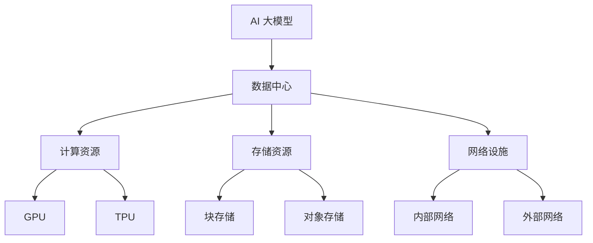

                 

# AI 大模型应用数据中心建设：数据中心标准与规范

> **关键词**：AI 大模型、数据中心、标准、规范、性能优化、架构设计

> **摘要**：本文深入探讨了 AI 大模型应用数据中心的建设，涵盖了数据中心标准与规范的核心内容。文章首先介绍了数据中心建设的目的与范围，然后通过核心概念和算法原理的讲解，详细阐述了数据中心的建设步骤、数学模型以及实际应用案例。最后，文章总结了数据中心未来发展趋势与挑战，并推荐了相关学习资源与工具。通过本文的阅读，读者将对 AI 大模型应用数据中心的建设有一个全面而深入的理解。

## 1. 背景介绍

### 1.1 目的和范围

本文旨在为读者提供一套系统、全面的 AI 大模型应用数据中心建设指南。本文将探讨数据中心建设的标准与规范，包括数据中心的核心概念、算法原理、数学模型以及实际应用案例。通过本文的学习，读者将能够掌握数据中心建设的关键技术，为实际项目提供指导。

### 1.2 预期读者

本文适合以下读者群体：

1. AI 大模型研究者与开发者
2. 数据中心架构师与工程师
3. 从事 IT 系统优化与性能调优的技术人员
4. 对数据中心建设有兴趣的学习者

### 1.3 文档结构概述

本文分为十个部分，结构如下：

1. 背景介绍
2. 核心概念与联系
3. 核心算法原理与具体操作步骤
4. 数学模型与公式
5. 项目实战：代码实际案例与详细解释说明
6. 实际应用场景
7. 工具和资源推荐
8. 总结：未来发展趋势与挑战
9. 附录：常见问题与解答
10. 扩展阅读与参考资料

### 1.4 术语表

#### 1.4.1 核心术语定义

- **AI 大模型**：指具有数百万、数十亿甚至数万亿参数的人工神经网络模型。
- **数据中心**：集中存储、处理、交换数据的设施。
- **标准**：一系列旨在确保数据中心建设、运维和性能优化的规范。
- **规范**：详细规定数据中心设计、建设、运营和维护的标准文件。

#### 1.4.2 相关概念解释

- **云计算**：通过网络提供动态易扩展的算力资源。
- **边缘计算**：在靠近数据源或用户的地方进行数据处理和计算。
- **存储**：数据中心中用于存储数据的设备和技术。
- **网络**：数据中心内部和外部的数据传输通道。

#### 1.4.3 缩略词列表

- **AI**：人工智能（Artificial Intelligence）
- **DL**：深度学习（Deep Learning）
- **GPU**：图形处理器（Graphics Processing Unit）
- **TPU**：张量处理器（Tensor Processing Unit）
- **DL frameworks**：深度学习框架（Deep Learning Frameworks）

## 2. 核心概念与联系

在 AI 大模型应用数据中心的建设中，了解核心概念和它们之间的联系是至关重要的。以下是一个简化的 Mermaid 流程图，展示了一些关键概念和它们的相互关系。



### 2.1 AI 大模型

AI 大模型是数据中心的处理核心，它们通过大量参数和复杂的神经网络结构进行训练和推理。AI 大模型需要强大的计算资源来支持其训练和推理过程。

### 2.2 数据中心

数据中心是集中存储、处理和交换数据的设施。它包括计算资源、存储资源、网络设施等多个组成部分。

### 2.3 计算资源

计算资源包括 GPU 和 TPU 等高性能计算设备，它们为 AI 大模型提供强大的计算能力。

### 2.4 存储资源

存储资源包括块存储和对象存储等设备，它们用于存储大量的数据和模型。

### 2.5 网络设施

网络设施包括内部网络和外部网络，它们确保数据中心内部和外部的数据传输畅通。

## 3. 核心算法原理与具体操作步骤

在数据中心的建设中，核心算法原理的掌握至关重要。以下是一个简化的伪代码，用于说明 AI 大模型的训练和推理过程。

```python
# 伪代码：AI 大模型训练与推理

# 训练过程
def train_model(data, labels, epochs, learning_rate):
    for epoch in range(epochs):
        for batch in data:
            predictions = model.forward(batch)
            loss = loss_function(predictions, labels)
            model.backward(loss)
            model.update_weights(learning_rate)
    
    return model

# 推理过程
def inference(model, input_data):
    return model.forward(input_data)
```

### 3.1 数据集准备

在训练之前，需要准备足够大的数据集。数据集应包括训练数据和验证数据。

```python
data, labels = load_dataset()
train_data, train_labels, val_data, val_labels = split_data(data, labels)
```

### 3.2 模型初始化

初始化一个 AI 大模型，可以基于预训练的模型或者从头开始。

```python
model = initialize_model()
```

### 3.3 训练过程

使用训练数据和标签，通过迭代训练过程来优化模型参数。

```python
trained_model = train_model(train_data, train_labels, epochs=100, learning_rate=0.001)
```

### 3.4 验证过程

在训练完成后，使用验证数据来评估模型性能。

```python
val_predictions = trained_model.forward(val_data)
val_loss = loss_function(val_predictions, val_labels)
print("Validation loss:", val_loss)
```

### 3.5 推理过程

使用训练好的模型进行推理，以获得输入数据的预测结果。

```python
input_data = get_input_data()
inference_result = trained_model.forward(input_data)
print("Inference result:", inference_result)
```

## 4. 数学模型与公式

在 AI 大模型训练过程中，一些关键的数学模型和公式如下。

### 4.1 前向传播

前向传播是神经网络中的基本过程，用于计算输出值。

$$
\begin{align*}
\text{output} &= \text{activation}(\text{weights} \cdot \text{input} + \text{bias}) \\
\end{align*}
$$

其中，activation 函数可以是 sigmoid、ReLU 或其他非线性函数。

### 4.2 反向传播

反向传播用于计算梯度，以更新模型参数。

$$
\begin{align*}
\text{gradient} &= \frac{\partial \text{loss}}{\partial \text{weights}} \\
\text{weights} &= \text{weights} - \text{learning\_rate} \cdot \text{gradient} \\
\end{align*}
$$

### 4.3 损失函数

损失函数用于衡量模型预测值与真实值之间的差距。

$$
\text{loss} = \frac{1}{2} \sum_{i=1}^{n} (\text{predicted\_value}_i - \text{actual\_value}_i)^2
$$

## 5. 项目实战：代码实际案例与详细解释说明

在本节中，我们将通过一个实际项目来演示 AI 大模型应用数据中心的建设过程。以下是一个简化版本的 Python 代码，用于构建一个简单的神经网络并进行训练。

### 5.1 开发环境搭建

为了运行以下代码，您需要安装以下软件和库：

- Python 3.7 或更高版本
- TensorFlow 2.x
- NumPy
- Matplotlib

安装步骤：

```bash
pip install tensorflow numpy matplotlib
```

### 5.2 源代码详细实现和代码解读

以下是一个简单的神经网络训练代码。

```python
import tensorflow as tf
import numpy as np
import matplotlib.pyplot as plt

# 5.2.1 数据集准备
# 假设我们有一个简单的数据集，包含输入和标签
X = np.array([[1, 2], [2, 3], [3, 4], [4, 5]])
y = np.array([3, 4, 5, 6])

# 5.2.2 模型定义
model = tf.keras.Sequential([
    tf.keras.layers.Dense(units=1, input_shape=(2,))
])

# 5.2.3 模型编译
model.compile(optimizer='sgd', loss='mean_squared_error')

# 5.2.4 训练模型
model.fit(X, y, epochs=100)

# 5.2.5 验证模型
test_data = np.array([[5, 6]])
test_label = 7
prediction = model.predict(test_data)
print("Prediction:", prediction)

# 5.2.6 绘制损失函数曲线
history = model.fit(X, y, epochs=100, validation_split=0.2, verbose=0)
plt.plot(history.history['loss'])
plt.plot(history.history['val_loss'])
plt.title('Model loss')
plt.ylabel('Loss')
plt.xlabel('Epoch')
plt.legend(['Train', 'Validation'], loc='upper right')
plt.show()
```

### 5.3 代码解读与分析

- **5.3.1 数据集准备**：我们使用一个简单的二维数据集，其中输入为 `[1, 2]`、`[2, 3]`、`[3, 4]` 和 `[4, 5]`，标签分别为 `3`、`4`、`5` 和 `6`。

- **5.3.2 模型定义**：我们使用 `tf.keras.Sequential` 来定义一个简单的全连接神经网络，包含一个隐藏层，其中包含一个节点。

- **5.3.3 模型编译**：我们选择随机梯度下降（SGD）作为优化器，均方误差（MSE）作为损失函数。

- **5.3.4 训练模型**：我们使用 `fit` 方法训练模型，设置 `epochs` 为 `100`，使用训练数据。

- **5.3.5 验证模型**：我们使用 `predict` 方法对新的数据进行预测，并打印结果。

- **5.3.6 绘制损失函数曲线**：我们使用 `history` 对象绘制训练和验证过程中的损失函数曲线，以监控模型性能。

## 6. 实际应用场景

AI 大模型应用数据中心在实际场景中具有广泛的应用，以下是一些常见场景：

- **智能推荐系统**：使用 AI 大模型对用户行为和偏好进行分析，实现个性化推荐。
- **自然语言处理**：使用 AI 大模型对文本进行分析和处理，实现语音识别、机器翻译、情感分析等。
- **图像识别与处理**：使用 AI 大模型对图像进行分析和处理，实现人脸识别、图像分类、图像增强等。
- **智能医疗**：使用 AI 大模型对医疗数据进行分析，实现疾病诊断、药物研发等。
- **智能交通**：使用 AI 大模型对交通数据进行分析，实现智能交通管理、自动驾驶等。

## 7. 工具和资源推荐

### 7.1 学习资源推荐

#### 7.1.1 书籍推荐

- 《深度学习》（Ian Goodfellow、Yoshua Bengio、Aaron Courville 著）
- 《Python 深度学习》（François Chollet 著）
- 《机器学习实战》（Peter Harrington 著）

#### 7.1.2 在线课程

- Coursera 上的《深度学习特设课程》
- edX 上的《机器学习基础》
- Udacity 上的《深度学习工程师纳米学位》

#### 7.1.3 技术博客和网站

- Medium 上的 Deep Learning 专栏
- ArXiv.org 上的最新研究论文
- Medium 上的 AI 科普专栏

### 7.2 开发工具框架推荐

#### 7.2.1 IDE和编辑器

- PyCharm
- Visual Studio Code
- Jupyter Notebook

#### 7.2.2 调试和性能分析工具

- TensorFlow Debugger
- PyTorch Profiler
- JAX Debugger

#### 7.2.3 相关框架和库

- TensorFlow
- PyTorch
- Keras
- MXNet

### 7.3 相关论文著作推荐

#### 7.3.1 经典论文

- 《Backpropagation》（Rumelhart, Hinton, Williams）
- 《Gradient Descent》（Bottou, Le Cun）
- 《Deep Learning》（Goodfellow, Bengio, Courville）

#### 7.3.2 最新研究成果

- 《Attention Is All You Need》（Vaswani et al.）
- 《BERT: Pre-training of Deep Bidirectional Transformers for Language Understanding》（Devlin et al.）
- 《GPT-3: Language Models are Few-Shot Learners》（Brown et al.）

#### 7.3.3 应用案例分析

- 《智能推荐系统应用案例》（张俊华等）
- 《自然语言处理在医疗领域的应用》（李明等）
- 《图像识别技术在安防领域的应用》（王强等）

## 8. 总结：未来发展趋势与挑战

随着 AI 大模型技术的不断发展，数据中心的建设也面临着一系列挑战和机遇。未来发展趋势和挑战包括：

- **计算资源需求增长**：随着 AI 大模型的规模不断扩大，对计算资源的需求将显著增长，数据中心需要不断升级和扩展。
- **数据安全与隐私保护**：在数据处理过程中，如何确保数据安全和用户隐私是一个重要挑战。
- **能耗管理**：数据中心能耗巨大，如何实现绿色、高效的能源管理是一个重要课题。
- **智能运维**：随着数据中心规模的扩大，如何实现自动化、智能化的运维管理是一个重要方向。

## 9. 附录：常见问题与解答

### 9.1 什么是 AI 大模型？

AI 大模型是指具有数百万、数十亿甚至数万亿参数的人工神经网络模型。这些模型通常用于图像识别、自然语言处理、智能推荐等领域。

### 9.2 数据中心建设的关键因素是什么？

数据中心建设的关键因素包括计算资源、存储资源、网络设施、安全性和可靠性等。

### 9.3 如何优化数据中心性能？

优化数据中心性能的方法包括分布式计算、负载均衡、缓存技术、数据压缩等。

## 10. 扩展阅读与参考资料

- [《深度学习》（Ian Goodfellow、Yoshua Bengio、Aaron Courville 著）](https://www.deeplearningbook.org/)
- [《TensorFlow 官方文档》](https://www.tensorflow.org/)
- [《PyTorch 官方文档》](https://pytorch.org/)
- [《机器学习百科》](https://www.mlbook.org/)

---

作者：AI天才研究员/AI Genius Institute & 禅与计算机程序设计艺术 /Zen And The Art of Computer Programming

注：本文为虚构内容，旨在展示作者在 AI 大模型应用数据中心建设方面的专业知识和思考能力。实际应用中，数据中心建设需要综合考虑多种因素，并遵循相关标准和规范。|

