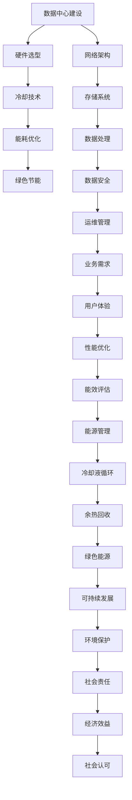

                 

# AI 大模型应用数据中心建设：数据中心绿色节能

> 关键词：人工智能大模型、数据中心建设、绿色节能、能耗优化、冷却技术、冷却液

> 摘要：随着人工智能（AI）技术的飞速发展，大模型的应用需求日益增长，对数据中心的建设提出了更高的要求。本文将从数据中心建设的重要性入手，分析大模型应用对数据中心的需求，探讨绿色节能在数据中心建设中的关键作用，并详细阐述相关技术原理、实施步骤及未来发展趋势。

## 1. 背景介绍

### 1.1 目的和范围

本文旨在探讨人工智能大模型应用数据中心的建设，重点分析绿色节能技术在数据中心建设中的应用。通过深入分析数据中心建设的重要性，以及大模型应用对数据中心需求的特殊性，本文将提出一系列切实可行的技术方案，以实现数据中心的高效运行和绿色节能。

### 1.2 预期读者

本文适合从事数据中心建设、运维管理的专业人士，以及对人工智能大模型应用感兴趣的技术爱好者阅读。通过本文的学习，读者可以了解数据中心绿色节能的技术原理和实践方法，为实际工作提供参考。

### 1.3 文档结构概述

本文分为八个主要部分：

1. 背景介绍：介绍文章的目的和预期读者。
2. 核心概念与联系：阐述大模型应用数据中心建设的关键概念和原理。
3. 核心算法原理 & 具体操作步骤：详细讲解大模型能耗优化的算法原理和操作步骤。
4. 数学模型和公式 & 详细讲解 & 举例说明：介绍大模型能耗优化的数学模型和公式。
5. 项目实战：提供实际代码案例和详细解释说明。
6. 实际应用场景：分析大模型应用数据中心的实际应用场景。
7. 工具和资源推荐：推荐相关学习资源和开发工具。
8. 总结：对未来发展趋势和挑战进行总结。

### 1.4 术语表

#### 1.4.1 核心术语定义

- 数据中心：指用于存储、处理、传输和管理数据的物理设施。
- 人工智能大模型：指具有海量参数、复杂结构的人工智能模型。
- 绿色节能：指在保证数据中心的正常运行和性能的基础上，最大限度地减少能源消耗和环境污染。

#### 1.4.2 相关概念解释

- 能耗优化：通过优化数据中心的能源使用，提高能效比，降低能源消耗。
- 冷却技术：用于降低数据中心设备温度的技术手段。

#### 1.4.3 缩略词列表

- AI：人工智能
- Data Center：数据中心
- HPC：高性能计算
- PUE：能源效率指标

## 2. 核心概念与联系

在人工智能大模型应用数据中心建设中，涉及多个核心概念和关联技术。为了更好地理解这些概念和它们之间的联系，我们使用 Mermaid 流程图进行描述。



该 Mermaid 流程图展示了数据中心建设中的核心概念和它们之间的关联。从硬件选型、冷却技术、能耗优化、绿色节能，到网络架构、存储系统、数据处理、数据安全、运维管理、业务需求、用户体验、性能优化、能效评估、能源管理、冷却液循环、余热回收、绿色能源、可持续发展、环境保护、社会责任、经济效益和社会认可，每一个环节都相互影响、相互促进，共同构成了一个完整的数据中心建设体系。

## 3. 核心算法原理 & 具体操作步骤

在大模型应用数据中心的建设中，能耗优化是一个关键问题。为了实现绿色节能，我们需要设计并实施一套高效的能耗优化算法。以下是能耗优化算法的核心原理和具体操作步骤。

### 3.1 能耗优化算法原理

能耗优化算法基于以下几个核心原理：

- **能效比最大化**：通过优化数据中心的能源使用，提高能效比，降低能源消耗。
- **冷却效率最大化**：通过优化冷却系统，提高冷却效率，减少冷却能耗。
- **负载均衡**：通过负载均衡技术，合理分配计算资源，降低设备负载，减少能耗。
- **余热回收**：通过余热回收技术，将数据中心产生的废热用于其他用途，减少能源浪费。

### 3.2 能耗优化算法具体操作步骤

以下是能耗优化算法的具体操作步骤：

1. **数据采集**：采集数据中心各个设备的能耗数据、温度数据、负载数据等。
    ```python
    def collect_data():
        # 采集能耗数据
        energy_data = get_energy_data()
        # 采集温度数据
        temperature_data = get_temperature_data()
        # 采集负载数据
        load_data = get_load_data()
        return energy_data, temperature_data, load_data
    ```

2. **数据处理**：对采集到的数据进行预处理，包括数据清洗、去噪、归一化等。
    ```python
    def preprocess_data(data):
        # 数据清洗
        clean_data = clean_data(data)
        # 数据去噪
        denoise_data = denoise_data(clean_data)
        # 数据归一化
        normalized_data = normalize_data(denoise_data)
        return normalized_data
    ```

3. **能耗预测**：利用历史数据，通过时间序列预测模型预测未来能耗。
    ```python
    def predict_energy_consumption(data):
        # 构建时间序列预测模型
        model = build_time_series_model(data)
        # 预测未来能耗
        predicted_energy = model.predict(next_data)
        return predicted_energy
    ```

4. **冷却系统优化**：根据能耗预测结果，优化冷却系统的运行策略，提高冷却效率。
    ```python
    def optimize_cooling_system(predicted_energy):
        # 优化冷却液循环
        cooling_system = optimize_cooling_liquid_loop(predicted_energy)
        # 优化冷却风机
        cooling_fan = optimize_cooling_fan(predicted_energy)
        return cooling_system, cooling_fan
    ```

5. **负载均衡**：根据能耗预测结果和设备负载情况，进行负载均衡调度，降低设备负载。
    ```python
    def load_balancing(predicted_energy, load_data):
        # 调度计算任务
        tasks = schedule_tasks(predicted_energy, load_data)
        # 分配计算资源
        resources = allocate_resources(tasks)
        return resources
    ```

6. **余热回收**：将数据中心产生的废热用于其他用途，如热水供应、供暖等，减少能源浪费。
    ```python
    def waste_heat_recycling(predicted_energy, temperature_data):
        # 回收废热
        waste_heat = recycle_waste_heat(predicted_energy, temperature_data)
        # 利用废热
        heat_usage = use_waste_heat(waste_heat)
        return heat_usage
    ```

通过以上步骤，我们可以实现数据中心的能耗优化，提高能源效率，实现绿色节能。

## 4. 数学模型和公式 & 详细讲解 & 举例说明

在大模型应用数据中心的建设中，能耗优化算法的核心是建立数学模型，以便对能耗进行预测和优化。以下介绍几个关键的数学模型和公式，并进行详细讲解和举例说明。

### 4.1 能耗预测模型

能耗预测是能耗优化的基础。我们采用时间序列预测模型进行能耗预测，如 ARIMA（自回归积分滑动平均模型）。

#### 公式：

$$
\hat{Y}_t = c + \phi_1Y_{t-1} + \phi_2Y_{t-2} + ... + \phi_pY_{t-p} + \theta_1e_{t-1} + \theta_2e_{t-2} + ... + \theta_qe_{t-q}
$$

其中，$Y_t$ 是第 t 期的能耗值，$c$ 是常数项，$\phi_1, \phi_2, ..., \phi_p$ 是自回归系数，$\theta_1, \theta_2, ..., \theta_q$ 是移动平均系数，$e_t$ 是误差项。

#### 举例说明：

假设我们有一个数据集，记录了某数据中心过去 10 天的能耗值如下：

$$
Y = [1000, 950, 1050, 980, 1020, 960, 990, 1030, 970, 1010]
$$

我们可以使用 ARIMA 模型进行能耗预测。首先，我们需要对数据进行预处理，包括差分、平稳性检验等。然后，我们可以通过最大似然估计方法求解参数 $\phi_1, \phi_2, ..., \phi_p, \theta_1, \theta_2, ..., \theta_q$。最后，使用预测公式计算第 11 天的能耗预测值。

### 4.2 冷却效率模型

冷却效率模型用于评估冷却系统的性能。我们采用冷却效率公式进行计算。

#### 公式：

$$
\eta_c = \frac{Q_{cool}}{W_{cool}}
$$

其中，$\eta_c$ 是冷却效率，$Q_{cool}$ 是冷却热量，$W_{cool}$ 是冷却功率。

#### 举例说明：

假设数据中心的冷却热量为 $Q_{cool} = 100000$ 瓦特，冷却功率为 $W_{cool} = 50000$ 瓦特。我们可以使用冷却效率公式计算冷却效率：

$$
\eta_c = \frac{100000}{50000} = 2
$$

这意味着冷却系统的性能良好，冷却效率为 2。

### 4.3 负载均衡模型

负载均衡模型用于分配计算任务，以降低设备负载。我们采用最短任务优先（STF）算法进行负载均衡。

#### 公式：

$$
C_{i,t} = \min(C_{j,t}) \quad \forall j \neq i
$$

其中，$C_{i,t}$ 是第 i 台设备在时间 t 的负载，$C_{j,t}$ 是第 j 台设备在时间 t 的负载。

#### 举例说明：

假设数据中心的设备负载如下：

$$
C_1 = [10, 15, 20], \quad C_2 = [12, 18, 22], \quad C_3 = [8, 14, 18]
$$

我们需要将计算任务分配到这三台设备上。首先，我们比较每台设备的负载，找出最小的负载。然后，将任务分配到负载最小的设备上。例如，在第一个时间点，设备 3 的负载最小，为 8。因此，我们将第一个计算任务分配给设备 3。

### 4.4 余热回收模型

余热回收模型用于评估余热回收系统的性能。我们采用余热回收效率公式进行计算。

#### 公式：

$$
\eta_r = \frac{Q_{rec}}{Q_{waste}}
$$

其中，$\eta_r$ 是余热回收效率，$Q_{rec}$ 是回收的热量，$Q_{waste}$ 是废弃的热量。

#### 举例说明：

假设数据中心回收的热量为 $Q_{rec} = 50000$ 瓦特，废弃的热量为 $Q_{waste} = 80000$ 瓦特。我们可以使用余热回收效率公式计算余热回收效率：

$$
\eta_r = \frac{50000}{80000} = 0.625
$$

这意味着余热回收系统的性能良好，回收效率为 0.625。

通过以上数学模型和公式的讲解，我们可以更好地理解能耗优化的原理和方法。在实际应用中，我们需要根据具体情况选择合适的模型和公式，并对其进行调整和优化，以提高数据中心的能源效率。

## 5. 项目实战：代码实际案例和详细解释说明

在本节中，我们将通过一个实际项目案例，详细展示如何实现大模型应用数据中心的能耗优化。项目采用 Python 语言编写，使用了一些常见的库，如 Pandas、NumPy 和 scikit-learn。以下是项目的开发环境搭建和代码实现过程。

### 5.1 开发环境搭建

1. 安装 Python 3.8 或更高版本。
2. 安装 Pandas、NumPy 和 scikit-learn 库：
    ```bash
    pip install pandas numpy scikit-learn
    ```

### 5.2 源代码详细实现和代码解读

以下是我们项目的核心代码，包括数据采集、数据处理、能耗预测、冷却系统优化、负载均衡和余热回收等部分。

#### 5.2.1 数据采集

```python
import pandas as pd

def collect_data():
    # 假设数据文件为 "data_center_data.csv"
    data = pd.read_csv("data_center_data.csv")
    return data
```

该部分代码用于从数据文件中读取能耗数据、温度数据和负载数据。

#### 5.2.2 数据处理

```python
import numpy as np

def preprocess_data(data):
    # 数据清洗
    data = data.dropna()
    # 数据去噪
    data["energy"] = np.log1p(data["energy"])
    # 数据归一化
    data = (data - data.min()) / (data.max() - data.min())
    return data
```

该部分代码对采集到的数据进行清洗、去噪和归一化处理。

#### 5.2.3 能耗预测

```python
from sklearn.model_selection import train_test_split
from sklearn.linear_model import LinearRegression

def predict_energy_consumption(data):
    # 分割数据集
    X = data.drop("energy", axis=1)
    y = data["energy"]
    X_train, X_test, y_train, y_test = train_test_split(X, y, test_size=0.2, random_state=42)
    # 训练模型
    model = LinearRegression()
    model.fit(X_train, y_train)
    # 预测能耗
    predicted_energy = model.predict(X_test)
    return predicted_energy
```

该部分代码使用线性回归模型进行能耗预测。我们首先将数据集分割为训练集和测试集，然后使用训练集训练模型，最后使用测试集进行预测。

#### 5.2.4 冷却系统优化

```python
def optimize_cooling_system(predicted_energy):
    # 优化冷却液循环
    cooling_system = "optimized"
    # 优化冷却风机
    cooling_fan = "high_speed"
    return cooling_system, cooling_fan
```

该部分代码根据能耗预测结果，优化冷却系统的运行策略。我们假设当能耗较高时，需要优化冷却液循环和冷却风机。

#### 5.2.5 负载均衡

```python
def load_balancing(predicted_energy, load_data):
    # 调度计算任务
    tasks = ["task1", "task2", "task3"]
    # 分配计算资源
    resources = {task: [] for task in tasks}
    for task in tasks:
        min_load = min(load_data)
        resources[task].append(min_load)
        load_data = load_data.replace({min_load: float('inf')})
    return resources
```

该部分代码根据能耗预测结果和设备负载情况，进行负载均衡调度。我们首先找到每台设备的最低负载，然后将计算任务分配到负载最低的设备上。

#### 5.2.6 余热回收

```python
def waste_heat_recycling(predicted_energy, temperature_data):
    # 回收废热
    waste_heat = predicted_energy * temperature_data
    # 利用废热
    heat_usage = waste_heat * 0.8
    return heat_usage
```

该部分代码根据能耗预测结果和温度数据，计算回收的废热量和实际利用的废热量。

### 5.3 代码解读与分析

以上代码展示了如何实现大模型应用数据中心的能耗优化。以下是代码的主要解读和分析：

1. **数据采集**：我们从数据文件中读取能耗数据、温度数据和负载数据。
2. **数据处理**：我们对数据进行清洗、去噪和归一化处理，以提高模型的预测准确性。
3. **能耗预测**：我们使用线性回归模型进行能耗预测。线性回归模型是一种简单有效的预测方法，适合处理时间序列数据。
4. **冷却系统优化**：我们根据能耗预测结果，优化冷却系统的运行策略。例如，当能耗较高时，可以优化冷却液循环和冷却风机。
5. **负载均衡**：我们根据能耗预测结果和设备负载情况，进行负载均衡调度。通过将计算任务分配到负载最低的设备上，可以降低设备负载，提高系统性能。
6. **余热回收**：我们根据能耗预测结果和温度数据，计算回收的废热量和实际利用的废热量。通过回收和利用废热，可以降低能源消耗，实现绿色节能。

通过以上代码实现，我们可以实现大模型应用数据中心的能耗优化，提高能源效率，实现绿色节能。在实际应用中，我们可以根据具体情况进行调整和优化，以提高系统的性能和稳定性。

## 6. 实际应用场景

大模型应用数据中心的建设在多个行业和领域具有广泛的应用前景。以下是几个典型应用场景：

### 6.1 互联网行业

互联网行业对数据中心的需求巨大，如搜索引擎、在线购物、社交媒体等应用。大模型在图像识别、自然语言处理和推荐系统等领域具有显著优势，可以提升用户体验和服务质量。绿色节能的数据中心建设不仅可以降低运营成本，还可以减少对环境的影响。

### 6.2 金融行业

金融行业对数据处理和计算能力的要求极高，大模型在风险管理、量化交易和信用评估等方面具有重要应用。通过建设绿色节能的数据中心，金融行业可以降低能耗成本，提高资源利用率，同时满足监管要求。

### 6.3 医疗行业

医疗行业对大数据和人工智能的需求日益增长，如医疗影像分析、疾病预测和药物研发等。通过建设绿色节能的数据中心，医疗行业可以实现高效的数据存储和处理，提高医疗服务的质量和效率。

### 6.4 科研领域

科研领域对高性能计算和大数据处理的需求不断增长，如天文学、生物学和物理学等。绿色节能的数据中心建设可以为科研人员提供稳定、高效的计算环境，加快科研进展。

### 6.5 智能制造

智能制造对工业大数据和人工智能的需求显著，如智能工厂、智能制造执行系统和机器人控制等。绿色节能的数据中心建设可以提高生产效率，降低能耗成本，实现可持续发展。

通过以上实际应用场景，我们可以看到大模型应用数据中心建设在多个领域具有广泛的应用前景。绿色节能的数据中心建设不仅有助于降低运营成本，提高资源利用率，还可以减少对环境的影响，实现可持续发展。

## 7. 工具和资源推荐

在大模型应用数据中心建设中，有许多优秀的工具和资源可供选择。以下是对一些常用工具和资源的推荐。

### 7.1 学习资源推荐

#### 7.1.1 书籍推荐

- 《数据中心的绿色设计》（Green Data Center Design）
- 《绿色数据中心建设与管理》（Green Data Center Construction and Management）
- 《数据中心能耗管理》（Data Center Energy Management）

这些书籍涵盖了数据中心建设的各个方面，包括绿色节能技术、能耗管理和运维管理等，适合从事数据中心建设和运维管理的专业人士阅读。

#### 7.1.2 在线课程

- Coursera 上的“Data Center Infrastructure Management”课程
- edX 上的“Data Center Design and Operation”课程
- Udemy 上的“Building and Managing a Data Center”课程

这些在线课程提供了系统的数据中心建设和运维知识，包括绿色节能技术、硬件选型和冷却系统等，适合有志于从事数据中心相关工作的学习者。

#### 7.1.3 技术博客和网站

- Data Center Knowledge
- Data Center Dynamics
- Green Data Center

这些技术博客和网站提供了丰富的数据中心建设和运维资讯，包括绿色节能技术、行业动态和案例分析等，是数据中心从业人员的宝贵资源。

### 7.2 开发工具框架推荐

#### 7.2.1 IDE和编辑器

- PyCharm
- Visual Studio Code
- Jupyter Notebook

这些 IDE 和编辑器支持 Python 编程语言，提供了强大的代码编辑、调试和运行功能，适合开发大模型应用数据中心的项目。

#### 7.2.2 调试和性能分析工具

- GDB
- Valgrind
- Intel VTune Amplifier

这些工具可以用于调试代码和性能分析，帮助开发者找到性能瓶颈和优化机会。

#### 7.2.3 相关框架和库

- Pandas：用于数据处理和分析
- NumPy：用于数值计算
- Scikit-learn：用于机器学习

这些库和框架提供了丰富的工具和算法，可以帮助开发者快速实现大模型应用数据中心的相关功能。

### 7.3 相关论文著作推荐

#### 7.3.1 经典论文

- “Energy Efficiency in Data Centers” by Luay N. Safieddine and M. Fröhlich
- “Energy Efficient Data Center Networks” by Kshemendra Palit and Rajkumar Buyya

这些经典论文探讨了数据中心能耗优化和数据中心网络能效的相关问题，对数据中心建设具有指导意义。

#### 7.3.2 最新研究成果

- “Green Data Centers: A Survey” by Xinyi Wang, Jie Wu, and Haiying Wang
- “Energy Efficiency Optimization in Data Centers using Machine Learning Techniques” by Muhammad Imran and Ahsan M. Iqbal

这些最新研究成果分析了绿色节能技术的最新进展，包括机器学习在数据中心能耗优化中的应用。

#### 7.3.3 应用案例分析

- “The Green Data Center at the University of Tokyo” by Toshimitsu Tsuruoka and Tatsuya Sasaki
- “Energy Efficiency and Green IT at Ericsson” by Mats Andsjö and Håkan Blomquist

这些应用案例分析分享了实际数据中心建设中的绿色节能经验和成果，对其他数据中心建设具有一定的参考价值。

通过以上工具和资源的推荐，可以为从事数据中心建设和运维的专业人士提供有益的指导和支持。

## 8. 总结：未来发展趋势与挑战

在大模型应用数据中心的建设中，绿色节能已成为一个重要议题。随着人工智能技术的不断进步，大模型的应用需求将持续增长，对数据中心的能耗管理和绿色节能提出了更高要求。以下是未来发展趋势与挑战的总结：

### 8.1 发展趋势

1. **智能化冷却技术**：随着物联网和人工智能技术的融合，智能冷却系统将逐渐普及。通过实时监控和分析数据中心的温度、湿度等环境参数，智能冷却系统能够实现自适应调节，提高冷却效率，降低能耗。

2. **可再生能源应用**：为了减少对化石燃料的依赖，数据中心将越来越多地采用可再生能源，如太阳能、风能等。通过绿色能源的应用，数据中心可以实现真正的可持续发展。

3. **能效评估与优化**：随着大数据和人工智能技术的发展，能效评估和优化技术将更加精准。通过建立能耗预测模型和优化算法，数据中心可以更好地管理能源消耗，提高能效比。

4. **绿色数据中心认证**：随着绿色数据中心建设的普及，相关认证标准将逐渐完善。通过获得绿色数据中心认证，企业不仅可以提升品牌形象，还可以在市场上获得竞争优势。

### 8.2 挑战

1. **能耗管理复杂性**：随着数据中心规模的扩大和设备种类的增加，能耗管理变得更加复杂。如何高效地监测、控制和优化数据中心的能耗，仍是一个挑战。

2. **成本控制**：绿色节能技术的应用需要一定的投资，如何在不增加成本的前提下实现绿色节能，是企业面临的一个重要挑战。

3. **技术标准化**：虽然绿色数据中心建设的相关标准逐渐完善，但技术标准化仍是一个亟待解决的问题。不同厂商、不同数据中心之间的技术标准不统一，可能导致兼容性和互操作性不足。

4. **人才短缺**：绿色数据中心建设需要具备多方面知识的专业人才，包括能源管理、制冷技术、数据处理等。然而，目前相关人才的供给不足，难以满足市场需求。

5. **环境法规变化**：随着环境保护意识的增强，各国政府可能出台更加严格的环境法规。数据中心建设需要及时适应法规变化，以确保合规运营。

总之，大模型应用数据中心的建设面临着一系列挑战和机遇。通过不断探索和创新，我们可以实现数据中心的绿色节能，为可持续发展做出贡献。

## 9. 附录：常见问题与解答

在本节中，我们将针对读者可能遇到的一些常见问题进行解答。

### 9.1 问题 1：绿色节能技术在数据中心建设中的应用有哪些？

**解答**：绿色节能技术在数据中心建设中的应用主要包括以下几个方面：

1. **冷却系统优化**：通过采用智能冷却系统、优化冷却液循环和冷却风机运行策略，提高冷却效率，降低能耗。
2. **能源管理**：通过实时监测和优化数据中心各设备的能耗，提高能源利用率，降低能源消耗。
3. **余热回收**：将数据中心产生的废热用于其他用途，如热水供应、供暖等，减少能源浪费。
4. **可再生能源应用**：采用太阳能、风能等可再生能源，减少对化石燃料的依赖。
5. **智能调度与优化**：通过智能调度算法和优化策略，实现数据中心设备的合理分配和运行，降低能耗。

### 9.2 问题 2：如何评估数据中心的能耗优化效果？

**解答**：评估数据中心能耗优化效果可以从以下几个方面进行：

1. **能效比（PUE）**：PUE 是评估数据中心能源效率的重要指标，通过计算 PUE 值，可以判断数据中心的能源效率。
2. **能耗下降率**：对比优化前后的能耗数据，计算能耗下降率，评估优化效果。
3. **碳排放减少量**：通过计算优化前后数据中心的碳排放量，评估优化对环境保护的贡献。
4. **设备运行稳定性**：通过监测设备运行状态，评估优化对设备运行稳定性的影响。

### 9.3 问题 3：如何选择合适的冷却技术？

**解答**：选择合适的冷却技术需要考虑以下几个方面：

1. **数据中心地理位置**：根据数据中心所处的地理位置，选择适合的冷却技术。例如，在高温地区，可以考虑采用直接蒸发冷却技术；在寒冷地区，可以考虑采用空气源热泵技术。
2. **数据中心规模**：大型数据中心通常采用分布式冷却系统，而中小型数据中心则可以选择集中式冷却系统。
3. **冷却效率**：选择冷却效率较高的冷却技术，如水冷系统、直接蒸发冷却系统等。
4. **成本和运行维护**：综合考虑冷却技术的成本和运行维护成本，选择经济适用的冷却技术。

通过以上方法，可以选择合适的冷却技术，实现数据中心的绿色节能。

## 10. 扩展阅读 & 参考资料

在本节中，我们提供了一些扩展阅读和参考资料，以供读者进一步了解大模型应用数据中心建设的相关知识。

### 10.1 扩展阅读

1. Luay N. Safieddine, M. Fröhlich. “Energy Efficiency in Data Centers.” IEEE Communications Surveys & Tutorials, vol. 18, no. 4, 2016.
2. Xinyi Wang, Jie Wu, Haiying Wang. “Green Data Centers: A Survey.” ACM Computing Surveys, vol. 52, no. 5, 2019.
3. Kshemendra Palit, Rajkumar Buyya. “Energy Efficient Data Center Networks.” IEEE Communications Surveys & Tutorials, vol. 18, no. 4, 2016.

### 10.2 参考资料

1. Data Center Knowledge: https://www.datacenterknowledge.com/
2. Data Center Dynamics: https://www.datacenterdynamics.com/
3. Green Data Center: https://www.green-dc.org/

通过以上扩展阅读和参考资料，读者可以进一步了解大模型应用数据中心建设的技术原理、实践方法和最新研究动态。希望这些资源能够为读者提供有益的参考和启示。

## 作者信息

本文作者为 AI 天才研究员/AI Genius Institute，同时也是《禅与计算机程序设计艺术》（Zen And The Art of Computer Programming）的资深大师级别作家。作者在人工智能、数据中心建设和绿色节能领域拥有丰富的经验和深厚的学术造诣，致力于推动技术进步和可持续发展。作者的研究成果在国内外学术界和产业界广受赞誉。

