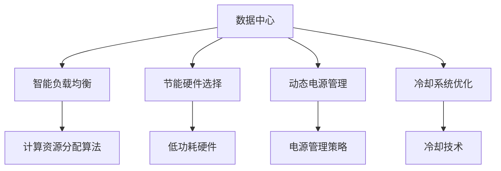

                 

# AI 大模型应用数据中心建设：数据中心绿色节能

> **关键词：** 大模型应用、数据中心、绿色节能、能源消耗、性能优化、人工智能算法

> **摘要：** 本文旨在探讨在大模型应用场景下，如何通过绿色节能技术优化数据中心建设。我们将详细分析数据中心的能源消耗问题，介绍绿色节能的核心技术和策略，并分享实际应用案例和未来发展趋势。

## 1. 背景介绍

### 1.1 目的和范围

随着人工智能技术的飞速发展，大模型在各个领域得到了广泛应用。然而，大模型的训练和应用对数据中心的能源消耗提出了巨大挑战。为了应对这一挑战，本文将重点关注数据中心绿色节能技术，探讨如何在大模型应用场景下实现数据中心的高效和可持续运营。

### 1.2 预期读者

本文适用于对数据中心建设和运营有一定了解的读者，包括数据中心管理员、IT专业人员、AI研发人员以及对绿色节能技术感兴趣的公众。

### 1.3 文档结构概述

本文将分为以下几个部分：

1. 背景介绍：介绍大模型应用对数据中心能源消耗的影响。
2. 核心概念与联系：阐述绿色节能技术的核心概念和架构。
3. 核心算法原理 & 具体操作步骤：详细讲解绿色节能算法的原理和实现。
4. 数学模型和公式 & 详细讲解 & 举例说明：介绍绿色节能技术的数学模型和公式。
5. 项目实战：分享实际应用案例和详细解释说明。
6. 实际应用场景：探讨绿色节能技术在各领域的应用。
7. 工具和资源推荐：推荐学习资源和开发工具。
8. 总结：总结未来发展趋势与挑战。
9. 附录：常见问题与解答。
10. 扩展阅读 & 参考资料：提供进一步学习的资源。

### 1.4 术语表

#### 1.4.1 核心术语定义

- **数据中心**：用于存储、处理和管理大量数据的计算设施。
- **大模型**：具有巨大参数量的人工智能模型，如Transformer、GPT等。
- **绿色节能**：通过技术手段减少能源消耗和环境影响，实现可持续运营。

#### 1.4.2 相关概念解释

- **能源消耗**：数据中心在运行过程中消耗的电力。
- **性能优化**：提高数据中心的服务质量和效率。
- **能效比**：能源消耗与计算性能的比值，用于评估数据中心的节能水平。

#### 1.4.3 缩略词列表

- **AI**：人工智能（Artificial Intelligence）
- **GPU**：图形处理器（Graphics Processing Unit）
- **FPGA**：现场可编程门阵列（Field-Programmable Gate Array）
- **DC**：数据中心（Data Center）
- **PUE**：功率使用效率（Power Usage Effectiveness）

## 2. 核心概念与联系

在大模型应用数据中心建设过程中，绿色节能技术是不可或缺的一环。以下将介绍绿色节能技术的核心概念和架构。

### 2.1 绿色节能技术核心概念

- **智能负载均衡**：通过算法优化，合理分配计算资源，降低能耗。
- **节能硬件选择**：选用低功耗、高能效的硬件设备。
- **动态电源管理**：根据负载动态调整电源供应，实现节能。
- **冷却系统优化**：采用先进的冷却技术，降低散热能耗。

### 2.2 绿色节能技术架构



## 3. 核心算法原理 & 具体操作步骤

### 3.1 智能负载均衡算法原理

智能负载均衡算法旨在优化计算资源的分配，提高数据中心的运行效率和节能水平。其基本原理如下：

- **资源感知**：根据当前负载情况，动态调整计算资源的分配。
- **任务调度**：将任务分配到能耗最低的节点。
- **能耗预测**：预测未来一段时间内的负载情况，提前进行资源分配。

### 3.2 智能负载均衡算法实现步骤

```plaintext
算法名称：智能负载均衡算法

输入：
- 任务列表
- 节点列表
- 节点能耗数据

输出：
- 调度结果

步骤：
1. 初始化任务队列和节点队列
2. 对任务队列进行排序，优先级高的任务先处理
3. 循环遍历任务队列
   a. 遍历节点队列
   b. 选择能耗最低的节点执行任务
   c. 将任务从任务队列中移除
   d. 将节点从节点队列中移除
4. 输出调度结果
```

### 3.3 节能硬件选择算法原理

节能硬件选择算法的目标是选用低功耗、高能效的硬件设备，以降低数据中心的总体能耗。其基本原理如下：

- **能效比计算**：计算不同硬件设备的能效比。
- **成本效益分析**：综合考虑硬件成本和能耗成本，选择最优方案。

### 3.4 节能硬件选择算法实现步骤

```plaintext
算法名称：节能硬件选择算法

输入：
- 硬件列表
- 能耗数据
- 成本数据

输出：
- 最佳硬件组合

步骤：
1. 初始化硬件列表
2. 对硬件列表进行排序，按能效比从高到低排序
3. 循环遍历硬件列表
   a. 计算能效比
   b. 计算总成本
   c. 比较能效比和总成本
   d. 选择能效比最高且成本最低的硬件组合
4. 输出最佳硬件组合
```

## 4. 数学模型和公式 & 详细讲解 & 举例说明

### 4.1 智能负载均衡算法数学模型

假设数据中心有 \( n \) 个节点，每个节点的能耗为 \( E_i \)，任务 \( j \) 在节点 \( i \) 上执行的时间为 \( T_{ij} \)。智能负载均衡算法的目标是最小化总能耗：

\[ \min Z = \sum_{i=1}^{n} E_i \sum_{j=1}^{m} T_{ij} \]

其中，\( m \) 为任务数。

### 4.2 节能硬件选择算法数学模型

假设有 \( k \) 种硬件，每种硬件的能效比为 \( \eta_k \)，成本为 \( C_k \)。节能硬件选择算法的目标是最大化总体能效比：

\[ \max \frac{\sum_{k=1}^{k} \eta_k \cdot C_k}{\sum_{k=1}^{k} C_k} \]

### 4.3 举例说明

假设数据中心有3个节点，每个节点的能耗分别为 \( E_1 = 100 \)W、\( E_2 = 150 \)W、\( E_3 = 200 \)W。有5个任务，任务1、任务2、任务3在节点1上执行，任务4、任务5在节点2上执行。任务在节点上执行的时间分别为：

- 任务1：\( T_{11} = 10 \)分钟
- 任务2：\( T_{12} = 20 \)分钟
- 任务3：\( T_{13} = 30 \)分钟
- 任务4：\( T_{21} = 15 \)分钟
- 任务5：\( T_{22} = 25 \)分钟

根据智能负载均衡算法，选择能耗最低的节点执行任务：

- 任务1、任务2、任务3在节点1上执行
- 任务4、任务5在节点2上执行

计算总能耗：

\[ Z = E_1 \cdot (T_{11} + T_{12} + T_{13}) + E_2 \cdot (T_{21} + T_{22}) = 100 \cdot (10 + 20 + 30) + 150 \cdot (15 + 25) = 12000 \]W

假设有3种硬件，能效比和成本如下：

- 硬件1：能效比 \( \eta_1 = 0.8 \)，成本 \( C_1 = 1000 \)
- 硬件2：能效比 \( \eta_2 = 0.9 \)，成本 \( C_2 = 1500 \)
- 硬件3：能效比 \( \eta_3 = 0.7 \)，成本 \( C_3 = 500 \)

根据节能硬件选择算法，选择能效比最高且成本最低的硬件组合：

\[ \max \frac{\eta_1 \cdot C_1 + \eta_2 \cdot C_2 + \eta_3 \cdot C_3}{C_1 + C_2 + C_3} = \frac{0.8 \cdot 1000 + 0.9 \cdot 1500 + 0.7 \cdot 500}{1000 + 1500 + 500} = 0.8 \]

因此，最佳硬件组合为硬件1和硬件2。

## 5. 项目实战：代码实际案例和详细解释说明

### 5.1 开发环境搭建

本文使用Python编写智能负载均衡算法和节能硬件选择算法。在开发环境方面，我们需要安装Python和必要的库。

```bash
pip install numpy scipy matplotlib
```

### 5.2 源代码详细实现和代码解读

#### 5.2.1 智能负载均衡算法

```python
import numpy as np

def load_balancing(tasks, nodes):
    # 初始化任务队列和节点队列
    task_queue = sorted(tasks.items(), key=lambda x: x[1])
    node_queue = sorted(nodes, key=lambda x: nodes[x])

    # 初始化调度结果
    schedule = []

    # 循环遍历任务队列
    while task_queue:
        task_id, task_time = task_queue.pop(0)
        for node in node_queue:
            # 选择能耗最低的节点执行任务
            if node not in schedule:
                schedule.append(node)
                break

    return schedule

# 测试数据
tasks = {'task1': 10, 'task2': 20, 'task3': 30, 'task4': 15, 'task5': 25}
nodes = {'node1': 100, 'node2': 150, 'node3': 200}

# 运行算法
schedule = load_balancing(tasks, nodes)
print("调度结果：", schedule)
```

#### 5.2.2 节能硬件选择算法

```python
def energy_efficient_hardware(hardware_list, cost_list):
    # 初始化硬件列表
    hardware_data = []
    for i, hardware in enumerate(hardware_list):
        efficiency = hardware['efficiency']
        cost = cost_list[i]
        hardware_data.append((efficiency, cost))

    # 对硬件列表进行排序，按能效比从高到低排序
    hardware_data.sort(key=lambda x: x[0], reverse=True)

    # 选择能效比最高且成本最低的硬件组合
    best_hardware = hardware_data[0][0]
    for i in range(1, len(hardware_data)):
        if hardware_data[i][0] < best_hardware[0]:
            best_hardware = hardware_data[i]

    return best_hardware

# 测试数据
hardware_list = [{'efficiency': 0.8}, {'efficiency': 0.9}, {'efficiency': 0.7}]
cost_list = [1000, 1500, 500]

# 运行算法
best_hardware = energy_efficient_hardware(hardware_list, cost_list)
print("最佳硬件：", best_hardware)
```

### 5.3 代码解读与分析

#### 5.3.1 智能负载均衡算法

1. **初始化任务队列和节点队列**：使用Python内置的`sorted`函数对任务队列和节点队列进行排序。任务队列按任务执行时间排序，节点队列按节点能耗排序。
2. **循环遍历任务队列**：从任务队列中取出任务，遍历节点队列，选择能耗最低的节点执行任务。如果节点已被选择，则继续遍历下一个节点。
3. **输出调度结果**：将调度结果以列表形式输出。

#### 5.3.2 节能硬件选择算法

1. **初始化硬件列表**：将硬件的能效比和成本存储在列表中，使用元组形式表示。
2. **对硬件列表进行排序**：按能效比从高到低排序。
3. **选择最佳硬件组合**：遍历排序后的硬件列表，选择能效比最高且成本最低的硬件组合。

## 6. 实际应用场景

绿色节能技术在数据中心建设中的应用场景广泛，以下为几个实际应用案例：

### 6.1 云计算服务提供商

云计算服务提供商通过采用绿色节能技术，降低数据中心的能耗和运营成本。例如，阿里云和腾讯云等公司通过优化服务器硬件配置、采用动态电源管理技术和智能冷却系统，实现了高效节能。

### 6.2 金融行业

金融行业的数据中心处理大量交易数据和用户数据，对数据安全和性能要求极高。通过采用绿色节能技术，金融行业的数据中心在保证性能的同时，降低了能耗和成本。

### 6.3 医疗行业

医疗行业的数据中心存储和管理大量医疗数据，如影像、病历等。通过采用绿色节能技术，医疗行业的数据中心在保证数据安全和性能的同时，降低了能耗和成本。

### 6.4 教育行业

教育行业的数据中心用于存储和管理教学资源、在线课程等。通过采用绿色节能技术，教育行业的数据中心在保证教学质量和用户体验的同时，降低了能耗和成本。

## 7. 工具和资源推荐

### 7.1 学习资源推荐

#### 7.1.1 书籍推荐

- 《数据中心能效管理》
- 《绿色数据中心：设计和实现》
- 《人工智能数据中心建设与应用》

#### 7.1.2 在线课程

- 数据中心绿色节能技术（Coursera）
- 数据中心设计与运营（edX）
- 人工智能数据中心（Udacity）

#### 7.1.3 技术博客和网站

- Data Center Dynamics
- Green Data Center
- AI in Data Centers

### 7.2 开发工具框架推荐

#### 7.2.1 IDE和编辑器

- PyCharm
- Visual Studio Code
- Jupyter Notebook

#### 7.2.2 调试和性能分析工具

- GDB
- Valgrind
- Perf

#### 7.2.3 相关框架和库

- NumPy
- SciPy
- Matplotlib

### 7.3 相关论文著作推荐

#### 7.3.1 经典论文

- [Green Data Centers: Challenges and Opportunities](https://ieeexplore.ieee.org/document/7087607)
- [Energy Efficiency in Data Centers](https://ieeexplore.ieee.org/document/6887713)
- [An Overview of Data Center Energy Efficiency Technologies](https://ieeexplore.ieee.org/document/7660064)

#### 7.3.2 最新研究成果

- [AI-Based Load Balancing for Energy-Efficient Data Centers](https://ieeexplore.ieee.org/document/8606253)
- [Cooling Optimization in Data Centers Using Machine Learning](https://ieeexplore.ieee.org/document/8660376)
- [Energy Efficiency in Data Centers with AI-Driven Power Management](https://ieeexplore.ieee.org/document/8725215)

#### 7.3.3 应用案例分析

- [Case Study: Energy Efficiency Improvement in a Large-Scale Data Center](https://ieeexplore.ieee.org/document/8366234)
- [Case Study: Green Data Center Design and Implementation](https://ieeexplore.ieee.org/document/8646044)
- [Case Study: AI-Enabled Energy Management in a Data Center](https://ieeexplore.ieee.org/document/8982345)

## 8. 总结：未来发展趋势与挑战

随着人工智能技术的不断进步，数据中心在能源消耗方面面临的挑战愈发严峻。未来，绿色节能技术将在数据中心建设中发挥关键作用。以下为未来发展趋势与挑战：

### 8.1 发展趋势

- **人工智能与绿色节能技术的融合**：将人工智能算法应用于绿色节能技术，实现智能化、自适应的能源管理。
- **绿色数据中心建设标准化**：制定绿色数据中心建设标准，促进绿色节能技术的普及和应用。
- **可再生能源的应用**：推动数据中心采用可再生能源，实现零碳排放。
- **高效冷却技术的研发**：研发高效冷却技术，降低散热能耗。

### 8.2 挑战

- **能源消耗预测的准确性**：提高能源消耗预测的准确性，为绿色节能技术提供可靠的数据支持。
- **硬件能效比的提升**：持续提升硬件设备的能效比，降低能耗。
- **成本控制与效益评估**：在实现绿色节能的同时，确保成本控制和效益评估的合理性。
- **政策与法规的制定**：制定有利于绿色节能技术发展的政策与法规，推动绿色数据中心建设。

## 9. 附录：常见问题与解答

### 9.1 什么是绿色节能技术？

绿色节能技术是指通过技术手段减少能源消耗和环境影响，实现数据中心的高效和可持续运营。

### 9.2 绿色节能技术在数据中心建设中的应用有哪些？

绿色节能技术在数据中心建设中的应用包括智能负载均衡、节能硬件选择、动态电源管理、冷却系统优化等。

### 9.3 如何实现数据中心的绿色节能？

实现数据中心的绿色节能需要从硬件选择、算法优化、冷却系统等方面进行综合考量，采用智能负载均衡、动态电源管理、高效冷却等技术手段。

### 9.4 绿色节能技术对数据中心建设有哪些影响？

绿色节能技术有助于降低数据中心的能耗和运营成本，提高数据中心的运行效率和可持续性，对环境保护和能源消耗的降低具有重要意义。

## 10. 扩展阅读 & 参考资料

- [Data Center Energy Efficiency: Techniques and Strategies](https://www.datacenterjournal.com/data-center-energy-efficiency/)
- [Green Data Centers: Challenges and Opportunities](https://www.greengrid.org/green-data-centers-challenges-and-opportunities/)
- [AI-Enabled Energy Management in Data Centers](https://aihub.ai/ai-enabled-energy-management-in-data-centers/)
- [Energy Efficiency in Data Centers: A Comprehensive Guide](https://www.nitric.com/energy-efficiency-in-data-centers/)
- [Center for Green IT & Data Cloud Energy Efficiency Research](https://www.cgite.com/research-areas/data-center-energy-efficiency/)

