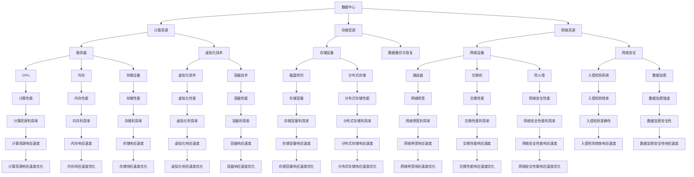
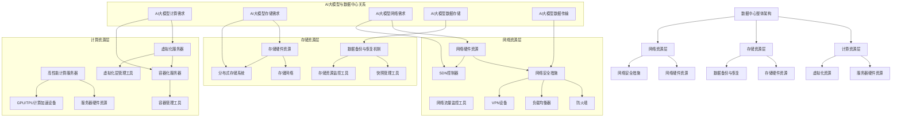

                 

### 文章标题

# AI 大模型应用数据中心建设：数据中心运维与管理

> **关键词：** AI大模型、数据中心、运维管理、性能优化、数据安全

> **摘要：** 本文将深入探讨AI大模型应用数据中心的建设过程，重点关注数据中心运维与管理的核心问题。文章分为十个部分，包括背景介绍、核心概念与联系、核心算法原理、数学模型和公式、项目实战、实际应用场景、工具和资源推荐等。通过对数据中心运维与管理领域的详细剖析，本文旨在为读者提供一份全面而实用的指南，帮助他们在AI大模型应用中构建高效、可靠的数据中心。

## 1. 背景介绍

### 1.1 目的和范围

本文的主要目的是为AI大模型应用数据中心的建设提供一个全面而实用的指导，帮助读者了解并掌握数据中心运维与管理的关键要素。随着人工智能技术的飞速发展，AI大模型的应用越来越广泛，数据中心作为AI大模型运行的基础设施，其重要性日益凸显。因此，如何高效、安全地构建和维护数据中心，已经成为业界关注的焦点。

本文将覆盖以下范围：
1. 数据中心的基本概念和架构。
2. 数据中心运维与管理的关键技术和方法。
3. 数据中心性能优化和数据安全的策略。
4. 实际应用场景和项目实战经验。
5. 工具和资源的推荐。

### 1.2 预期读者

本文主要面向以下读者群体：
1. 数据中心运维工程师：了解数据中心的基本运维技能和最佳实践。
2. AI工程师：了解AI大模型应用数据中心的建设和运维要求。
3. 系统架构师：掌握数据中心性能优化和数据安全的策略。
4. 技术经理：了解数据中心运维与管理的全流程，为项目管理提供支持。
5. 相关领域的科研人员：了解数据中心建设的研究进展和应用前景。

### 1.3 文档结构概述

本文将分为十个部分，具体结构如下：
1. **背景介绍**：介绍本文的目的、范围、预期读者和文档结构。
2. **核心概念与联系**：介绍数据中心的基本概念、架构和核心概念原理。
3. **核心算法原理 & 具体操作步骤**：详细讲解数据中心运维与管理的核心算法和操作步骤。
4. **数学模型和公式 & 详细讲解 & 举例说明**：介绍数据中心运维与管理相关的数学模型和公式，并给出具体示例。
5. **项目实战：代码实际案例和详细解释说明**：通过实际项目案例，展示数据中心运维与管理的具体实现和解析。
6. **实际应用场景**：分析数据中心运维与管理在实际应用中的各种场景。
7. **工具和资源推荐**：推荐相关学习资源、开发工具和框架。
8. **总结：未来发展趋势与挑战**：总结数据中心运维与管理的发展趋势和面临的挑战。
9. **附录：常见问题与解答**：解答读者可能遇到的问题。
10. **扩展阅读 & 参考资料**：提供更多的扩展阅读资源。

### 1.4 术语表

#### 1.4.1 核心术语定义

- **数据中心**：提供计算、存储和网络服务的集中化设施，用于支持大规模数据处理和AI应用。
- **AI大模型**：基于深度学习技术的大型神经网络模型，具有极强的数据分析和预测能力。
- **运维管理**：确保数据中心稳定运行、高效管理资源和优化性能的过程。
- **性能优化**：通过调整配置、优化算法和硬件升级等手段，提高数据中心的性能和响应速度。
- **数据安全**：保护数据不被未授权访问、篡改和泄露的一系列措施。

#### 1.4.2 相关概念解释

- **云计算**：基于互联网的计算资源共享模式，提供按需分配的计算资源和服务。
- **虚拟化技术**：将物理硬件资源虚拟化为多个虚拟资源，实现硬件资源的高效利用。
- **容错机制**：在系统发生故障时，自动切换到备用系统或组件，确保数据中心的持续运行。
- **灾难恢复**：在数据中心发生严重故障或灾难时，迅速恢复数据和业务系统的过程。

#### 1.4.3 缩略词列表

- **AI**：人工智能（Artificial Intelligence）
- **DC**：数据中心（Data Center）
- **IO**：输入/输出（Input/Output）
- **CPU**：中央处理器（Central Processing Unit）
- **GPU**：图形处理器（Graphics Processing Unit）
- **VM**：虚拟机（Virtual Machine）
- **SDN**：软件定义网络（Software-Defined Networking）
- **NFV**：网络功能虚拟化（Network Functions Virtualization）
- **API**：应用程序接口（Application Programming Interface）

## 2. 核心概念与联系

在深入了解数据中心的建设和管理之前，我们需要掌握一些核心概念和它们之间的联系。以下是一个简化的数据中心架构及其核心概念的联系的Mermaid流程图：



通过这个流程图，我们可以看到数据中心的核心概念及其相互之间的联系。数据中心由计算资源、存储资源和网络资源组成，它们通过虚拟化技术、数据备份与恢复、网络安全等手段进行优化和管理。每个核心组件的性能指标（如计算性能、内存性能、存储性能等）都相互关联，影响数据中心的整体性能。

### 2.1 数据中心的基本架构

数据中心是一个高度复杂的系统，通常包括以下几个关键组成部分：

#### 2.1.1 计算资源

计算资源是数据中心的核心，主要由服务器和虚拟化技术组成。

- **服务器**：服务器是数据中心提供计算能力的主要硬件设备。根据处理能力的不同，服务器可以分为台式服务器、刀片服务器和大型主机。服务器主要由中央处理器（CPU）、内存（RAM）和存储设备（如硬盘或固态硬盘）组成。

- **虚拟化技术**：虚拟化技术通过将物理硬件资源虚拟化为多个虚拟资源，实现硬件资源的高效利用。常见的虚拟化技术包括虚拟机（VM）和容器技术。虚拟机通过虚拟化软件将一台物理服务器划分为多个虚拟服务器，每个虚拟服务器拥有独立的操作系统和资源。容器技术则通过隔离应用程序及其依赖项，在一个操作系统内运行多个独立的容器。

#### 2.1.2 存储资源

存储资源是数据中心的重要组成部分，主要负责数据的存储和管理。

- **存储设备**：存储设备包括磁盘阵列（RAID）和分布式存储系统。磁盘阵列通过将多个硬盘组合成一个逻辑单元，提高数据的读写性能和可靠性。分布式存储系统则通过将数据分散存储在多个节点上，提高存储容量和性能。

- **数据备份与恢复**：数据备份与恢复是确保数据安全的重要手段。数据备份是指将数据复制到另一个存储设备或远程位置，以防止数据丢失。数据恢复则是在数据丢失或损坏时，从备份设备中恢复数据。

#### 2.1.3 网络资源

网络资源是数据中心数据传输的通道，主要负责数据的高速传输和网络安全。

- **网络设备**：网络设备包括路由器、交换机和防火墙。路由器负责将数据包从源地址转发到目标地址，交换机负责在局域网内传输数据包，防火墙则负责保护网络免受未经授权的访问。

- **网络安全**：网络安全是数据中心运维的关键环节，包括入侵检测系统（IDS）、入侵防御系统（IPS）、数据加密等技术。入侵检测系统用于监控网络流量，检测潜在的安全威胁。入侵防御系统则主动阻止恶意流量进入网络。数据加密技术用于保护数据在传输过程中的安全性。

#### 2.1.4 数据中心架构的层次结构

数据中心架构通常分为以下层次：

1. **基础设施层**：包括物理服务器、存储设备和网络设备，提供数据中心的基本硬件资源。
2. **平台层**：包括虚拟化技术、容器技术、数据库等，提供计算、存储和网络服务的中间层。
3. **应用层**：包括各类业务应用，如AI模型训练、数据分析等，利用数据中心提供的资源实现具体业务功能。

数据中心各层次的紧密协作，共同构成一个高效、可靠的数据处理平台。

### 2.2 数据中心与AI大模型的联系

AI大模型是数据中心的重要应用场景之一，其高性能计算和海量数据处理需求对数据中心提出了较高的要求。以下分析数据中心与AI大模型之间的联系：

#### 2.2.1 计算资源需求

AI大模型通常需要大量的计算资源进行模型训练和推理。数据中心通过提供高性能服务器和虚拟化技术，满足AI大模型对计算资源的需求。例如，GPU和TPU等专用计算设备被广泛应用于AI大模型的训练过程。

#### 2.2.2 存储资源需求

AI大模型在训练过程中需要处理海量数据，对存储资源的容量和速度有较高要求。数据中心通过提供高性能存储设备和分布式存储系统，满足AI大模型对存储资源的需求。例如，NVMe SSD和HDD组合的存储方案，可以提高数据读写速度和存储容量。

#### 2.2.3 网络资源需求

AI大模型在训练过程中需要频繁进行数据传输，对网络资源的需求较高。数据中心通过提供高速网络设备和高带宽网络，满足AI大模型对网络资源的需求。例如，采用100Gbps以太网和SDN技术，可以提高数据传输速度和网络性能。

#### 2.2.4 数据中心运维与管理

数据中心运维与管理对AI大模型的应用至关重要。通过有效的运维管理，可以保证AI大模型在高性能计算和海量数据处理过程中的稳定性和可靠性。以下分析数据中心运维与管理的关键点：

1. **资源调度与分配**：数据中心需要根据AI大模型的需求，合理调度和分配计算、存储和网络资源，确保资源的高效利用和最大化性能。
2. **性能监控与优化**：数据中心需要实时监控AI大模型的性能指标，及时发现并解决性能瓶颈，优化数据中心配置和架构，提高整体性能。
3. **数据安全与备份**：数据中心需要确保AI大模型的数据安全，采取有效的数据备份和恢复策略，防止数据丢失和损坏。
4. **故障处理与灾难恢复**：数据中心需要建立完善的故障处理和灾难恢复机制，确保在发生故障或灾难时，能够迅速恢复系统和业务。

通过以上分析，我们可以看到数据中心与AI大模型之间的紧密联系。数据中心作为AI大模型运行的基础设施，其建设和管理水平直接影响AI大模型的应用效果。因此，深入了解数据中心与AI大模型的关系，对于数据中心运维工程师和AI工程师来说，具有重要意义。

### 2.3 核心概念原理和架构的Mermaid流程图

为了更好地理解数据中心的核心概念和架构，以下是一个详细的Mermaid流程图，展示了数据中心的主要组件及其相互关系：



在这个流程图中，我们首先定义了数据中心的整体架构，并分为计算资源层、存储资源层和网络资源层。每个层次包含具体的硬件资源和管理工具。然后，我们特别强调了AI大模型与数据中心的联系，包括计算、存储和网络需求，以及AI大模型的数据存储和数据传输。

通过这个流程图，我们可以清晰地看到数据中心各个层次之间的关系，以及AI大模型如何与数据中心相互作用，从而为数据中心的建设和管理提供了直观的理解。

### 2.4 数据中心运维与管理的核心算法原理

在数据中心的建设过程中，运维与管理是保障数据中心稳定运行、高效利用资源的关键环节。数据中心运维与管理的核心算法主要涉及资源调度、性能监控、故障处理等方面。以下将详细讲解这些核心算法的原理，并通过伪代码进行具体阐述。

#### 2.4.1 资源调度算法

资源调度算法是数据中心运维管理的核心，其目标是在保证服务质量（QoS）的前提下，最大化资源利用率。以下是一个简单的基于优先级的资源调度算法：

```python
# 输入：任务列表tasks，资源队列resources
# 输出：调度后的任务队列scheduled_tasks

def resource_scheduling(tasks, resources):
    scheduled_tasks = []
    while tasks and resources:
        # 找到优先级最高的未调度任务
        highest_priority_task = max(tasks, key=lambda x: x.priority)
        tasks.remove(highest_priority_task)
        
        # 分配资源
        assigned_resources = allocate_resources(highest_priority_task.resources, resources)
        
        # 如果资源足够，将任务加入调度队列
        if assigned_resources:
            scheduled_tasks.append(highest_priority_task)
            resources = assigned_resources
        else:
            # 资源不足，将任务重新加入任务队列
            tasks.append(highest_priority_task)
    
    return scheduled_tasks

def allocate_resources(task_resources, resources):
    assigned_resources = []
    for resource in task_resources:
        if resource in resources:
            assigned_resources.append(resource)
            resources.remove(resource)
    
    return assigned_resources
```

在这个算法中，我们首先遍历任务列表，找到优先级最高的未调度任务。然后，根据任务所需的资源，尝试从资源队列中分配。如果资源足够，将任务加入调度队列；否则，将任务重新加入任务队列。

#### 2.4.2 性能监控算法

性能监控算法用于实时监控数据中心的各项性能指标，及时发现并解决性能瓶颈。以下是一个简单的基于阈值的性能监控算法：

```python
# 输入：性能指标数据performance_data，阈值阈值thresholds
# 输出：异常指标列表abnormal_metrics

def performance_monitoring(performance_data, thresholds):
    abnormal_metrics = []
    for metric, value in performance_data.items():
        if value > thresholds[metric]:
            abnormal_metrics.append(metric)
    
    return abnormal_metrics
```

在这个算法中，我们遍历性能指标数据，如果某个指标的当前值超过预设的阈值，则认为该指标存在异常，并将其加入异常指标列表。

#### 2.4.3 故障处理算法

故障处理算法用于在数据中心发生故障时，自动进行故障检测、故障隔离和故障恢复。以下是一个简单的基于故障树分析的故障处理算法：

```python
# 输入：故障树fault_tree，故障检测系统检测结果detection_results
# 输出：故障恢复策略recovery_strategy

def fault_handling(fault_tree, detection_results):
    recovery_strategy = {}
    for node in fault_tree:
        if node in detection_results:
            recovery_strategy[node] = "修复或替换"
        else:
            recovery_strategy[node] = "监控"
    
    return recovery_strategy
```

在这个算法中，我们遍历故障树中的每个节点，根据故障检测系统的检测结果，制定相应的故障恢复策略。如果检测到故障，则进行修复或替换；否则，进行监控。

通过以上核心算法，数据中心运维管理可以有效地调度资源、监控性能和应对故障，确保数据中心的稳定运行。

### 2.5 数据中心运维与管理相关的数学模型和公式

数据中心运维与管理涉及多个数学模型和公式，这些模型和公式在资源调度、性能评估和故障处理等方面发挥着重要作用。以下将详细讲解这些数学模型和公式，并通过具体示例进行说明。

#### 2.5.1 资源调度模型

资源调度模型用于优化数据中心资源分配，以最大化资源利用率。一个常见的资源调度模型是基于线性规划（Linear Programming，LP）的优化模型。以下是一个简化的资源调度模型：

**目标函数**：
\[ \text{最大化} \ \sum_{i=1}^{n} p_i x_i \]

**约束条件**：
\[ \sum_{i=1}^{n} a_{ij} x_i \geq b_j \]
\[ 0 \leq x_i \leq 1 \ \forall i \]

其中，\( p_i \) 表示任务 \( i \) 的价值，\( x_i \) 表示任务 \( i \) 是否被分配（0或1），\( a_{ij} \) 表示任务 \( i \) 对资源 \( j \) 的需求，\( b_j \) 表示资源 \( j \) 的总量。

**示例**：

假设有一个数据中心，有3个任务 \( T_1, T_2, T_3 \) 和2种资源 \( R_1, R_2 \)。任务和资源需求如下表所示：

| 任务 | \( R_1 \) | \( R_2 \) |
|------|-----------|-----------|
| \( T_1 \) | 2         | 1         |
| \( T_2 \) | 1         | 2         |
| \( T_3 \) | 3         | 1         |

目标是在资源约束条件下，最大化任务的总价值。

**目标函数**：
\[ \text{最大化} \ \sum_{i=1}^{3} p_i x_i \]

**约束条件**：
\[ 2x_1 + x_2 + 3x_3 \leq 5 \]
\[ x_1 + 2x_2 + x_3 \leq 3 \]
\[ 0 \leq x_i \leq 1 \ \forall i \]

通过求解这个线性规划问题，我们可以找到最优的任务分配方案，从而最大化任务的总价值。

#### 2.5.2 性能评估模型

性能评估模型用于评估数据中心的各项性能指标，如响应时间、吞吐量等。一个常见的性能评估模型是基于马尔可夫链（Markov Chain）的排队模型。

**马尔可夫链模型**：

1. **状态转移概率矩阵**：
\[ P = \begin{bmatrix}
p_{00} & p_{01} & p_{02} \\
p_{10} & p_{11} & p_{12} \\
p_{20} & p_{21} & p_{22}
\end{bmatrix} \]

其中，\( p_{ij} \) 表示系统从状态 \( i \) 转移到状态 \( j \) 的概率。

2. **稳态概率分布**：
\[ \pi = \begin{bmatrix}
\pi_0 \\
\pi_1 \\
\pi_2
\end{bmatrix} \]

其中，\( \pi_0, \pi_1, \pi_2 \) 分别表示系统处于状态 \( 0, 1, 2 \) 的稳态概率。

**性能指标计算**：

- **响应时间**：
\[ W = \frac{1}{\pi_0 \lambda + \mu} \]

- **系统吞吐量**：
\[ \lambda_{\text{sys}} = \lambda \frac{\pi_0}{\pi_0 \lambda + \mu} \]

其中，\( \lambda \) 表示到达率，\( \mu \) 表示服务率。

**示例**：

假设一个数据中心的排队系统，有3个状态（无用户、1个用户、2个用户），到达率 \( \lambda = 2 \)，服务率 \( \mu = 3 \)。状态转移概率矩阵如下：

\[ P = \begin{bmatrix}
0.6 & 0.2 & 0.2 \\
0.4 & 0.4 & 0.2 \\
0 & 0.6 & 0.4
\end{bmatrix} \]

通过求解稳态概率分布，我们可以计算响应时间和系统吞吐量。

#### 2.5.3 故障处理模型

故障处理模型用于评估数据中心的故障检测和恢复能力。一个常见的故障处理模型是基于贝叶斯网络（Bayesian Network）的故障诊断模型。

**贝叶斯网络模型**：

1. **条件概率表**：

\[ P(\text{故障} | \text{故障检测器}_1, \text{故障检测器}_2) = \begin{bmatrix}
P(\text{故障} | \text{故障检测器}_1=\text{正常}, \text{故障检测器}_2=\text{正常}) & P(\text{故障} | \text{故障检测器}_1=\text{正常}, \text{故障检测器}_2=\text{异常}) \\
P(\text{故障} | \text{故障检测器}_1=\text{异常}, \text{故障检测器}_2=\text{正常}) & P(\text{故障} | \text{故障检测器}_1=\text{异常}, \text{故障检测器}_2=\text{异常})
\end{bmatrix} \]

2. **先验概率**：

\[ P(\text{故障}) = 0.01 \]
\[ P(\text{无故障}) = 0.99 \]

**故障诊断**：

给定故障检测器的检测结果，使用贝叶斯推理计算故障的概率。

\[ P(\text{故障} | \text{故障检测器}_1=\text{正常}, \text{故障检测器}_2=\text{异常}) = \frac{P(\text{故障检测器}_1=\text{正常} | \text{故障}, \text{故障检测器}_2=\text{异常}) \cdot P(\text{故障})}{P(\text{故障检测器}_1=\text{正常} | \text{故障}, \text{故障检测器}_2=\text{异常}) \cdot P(\text{故障}) + P(\text{故障检测器}_1=\text{正常} | \text{无故障}, \text{故障检测器}_2=\text{异常}) \cdot P(\text{无故障})} \]

**示例**：

假设故障检测器1检测结果为正常，故障检测器2检测结果为异常。根据条件概率表和先验概率，我们可以计算故障的概率。

通过以上数学模型和公式，数据中心运维与管理可以更加科学和系统地评估和优化数据中心的运行效率。在实际应用中，这些模型和公式可以根据具体需求进行调整和扩展。

### 5.1 开发环境搭建

要搭建一个适合AI大模型应用数据中心的环境，我们需要考虑以下几个方面：硬件配置、软件安装、环境配置和开发工具的选用。以下是具体的步骤和注意事项。

#### 5.1.1 硬件配置

1. **服务器**：选择高性能的服务器，如Dell R740或HP DL380 Gen10，确保拥有足够的CPU核心数、内存和存储容量。
2. **GPU**：对于AI大模型的训练和推理，选择高性能的GPU，如NVIDIA Tesla V100或A100，以及对应的GPU加速卡。
3. **存储设备**：选择高速存储设备，如NVMe SSD，以提高数据读写速度。同时，配置足够的存储容量，以满足海量数据存储需求。
4. **网络设备**：配置高性能的网络设备，如交换机和路由器，确保数据传输的高带宽和低延迟。

#### 5.1.2 软件安装

1. **操作系统**：选择适合数据中心环境操作

