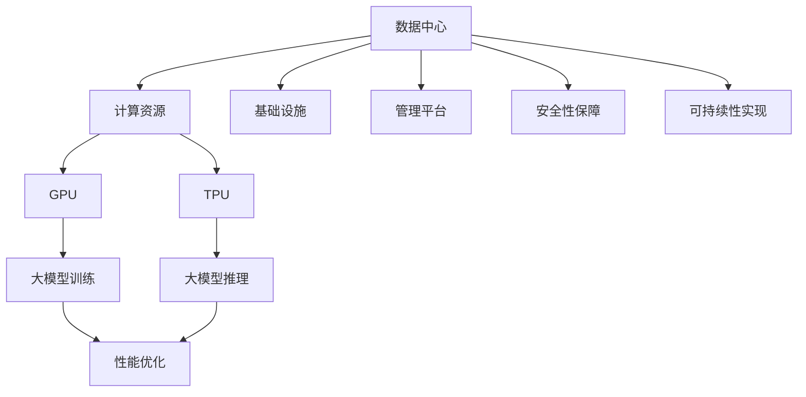

                 

# AI 大模型应用数据中心建设：数据中心运维与管理

> **关键词：** AI大模型、数据中心、运维、管理、性能优化、安全性、可持续性

> **摘要：** 随着人工智能（AI）的快速发展，大模型的应用成为数据中心建设的核心需求。本文将深入探讨数据中心在AI大模型应用中的运维与管理策略，包括性能优化、安全性保障、可持续性实现等关键方面，旨在为相关从业者提供全面的技术指南和实践案例。

## 1. 背景介绍

### 1.1 目的和范围

本文旨在系统地探讨数据中心在AI大模型应用中的运维与管理实践。具体来说，我们将关注以下几个核心议题：

1. **性能优化**：探讨如何通过硬件升级、系统优化和负载均衡来提升数据中心在大模型训练和应用中的处理能力。
2. **安全性保障**：分析如何确保数据中心的安全，防止数据泄露、恶意攻击和数据丢失。
3. **可持续性实现**：探讨如何通过绿色能源、节能技术和智能化管理，实现数据中心的可持续发展。

### 1.2 预期读者

本文适合以下读者群体：

1. 数据中心架构师和管理者
2. AI研发人员和技术工程师
3. 信息安全和数据保护专家
4. 对数据中心运维和管理感兴趣的技术爱好者

### 1.3 文档结构概述

本文结构如下：

1. **背景介绍**：介绍本文的背景、目的和预期读者。
2. **核心概念与联系**：定义相关核心概念，并使用流程图展示数据中心与AI大模型的关系。
3. **核心算法原理与操作步骤**：详细讲解大模型训练和推理中的关键算法，并使用伪代码阐述具体操作步骤。
4. **数学模型与公式**：介绍相关数学模型和公式，并进行举例说明。
5. **项目实战**：提供实际案例和代码实现，详细解释和代码解读。
6. **实际应用场景**：探讨数据中心在AI大模型应用中的多种场景。
7. **工具和资源推荐**：推荐学习资源和开发工具框架。
8. **总结**：总结未来发展趋势与挑战。
9. **附录**：常见问题与解答。
10. **扩展阅读与参考资料**：提供进一步阅读的资源。

### 1.4 术语表

#### 1.4.1 核心术语定义

- **数据中心（Data Center）**：集中存储、处理和管理大量数据的设施。
- **AI大模型（AI Large Model）**：指参数量巨大、计算复杂度高的深度学习模型。
- **性能优化（Performance Optimization）**：提升系统运行效率和响应速度的技术手段。
- **安全性保障（Security Assurance）**：确保数据安全和系统完整性的措施。
- **可持续性实现（Sustainability Implementation）**：通过环保技术和智能化管理实现数据中心的可持续发展。

#### 1.4.2 相关概念解释

- **负载均衡（Load Balancing）**：将请求均匀分配到多台服务器上，以避免单点过载。
- **绿色能源（Green Energy）**：指可再生和无污染的能源，如太阳能、风能等。
- **节能技术（Energy Saving Technology）**：通过技术手段降低能源消耗，提高能源利用效率。

#### 1.4.3 缩略词列表

- **AI**：人工智能（Artificial Intelligence）
- **GPU**：图形处理单元（Graphics Processing Unit）
- **TPU**：张量处理单元（Tensor Processing Unit）
- **SDN**：软件定义网络（Software-Defined Networking）
- **NFV**：网络功能虚拟化（Network Functions Virtualization）

## 2. 核心概念与联系

在探讨数据中心在AI大模型应用中的运维与管理之前，我们首先需要明确几个核心概念，并了解它们之间的相互关系。

### 2.1 数据中心架构

数据中心的架构通常包括以下几部分：

1. **计算资源**：包括服务器、存储设备和网络设备。
2. **基础设施**：如机房、电源、空调等。
3. **管理平台**：用于监控、管理和优化数据中心的运行。

### 2.2 AI大模型

AI大模型的关键特性包括：

1. **参数量巨大**：大模型的参数数量通常在数百万到数十亿之间。
2. **计算复杂度高**：训练和推理过程需要大量的计算资源。
3. **数据需求大**：大模型需要大量的训练数据来保证其性能。

### 2.3 数据中心与AI大模型的联系

数据中心与AI大模型之间的联系体现在以下几个方面：

1. **计算资源需求**：AI大模型训练和推理需要大量的计算资源，数据中心需要提供足够的GPU、TPU等硬件支持。
2. **数据存储与管理**：大模型的数据存储和管理工作量巨大，数据中心需要高效的存储和管理系统。
3. **性能优化**：数据中心需要通过负载均衡、缓存技术等手段，提升AI大模型的处理性能。
4. **安全性保障**：数据中心需要确保AI大模型的数据安全和隐私保护。
5. **可持续性实现**：数据中心需要通过绿色能源、节能技术等手段，实现可持续发展。

### 2.4 Mermaid 流程图

以下是数据中心与AI大模型关系的Mermaid流程图：



在这个流程图中，我们可以看到数据中心通过计算资源（GPU和TPU）支持AI大模型的训练和推理，并通过管理平台实现性能优化、安全性保障和可持续性实现。

## 3. 核心算法原理 & 具体操作步骤

在了解数据中心与AI大模型的关系后，接下来我们将深入探讨大模型训练和推理中的核心算法原理，并提供具体的操作步骤。

### 3.1 大模型训练算法原理

大模型训练的核心算法是深度学习，特别是基于神经网络的模型。以下是深度学习训练的基本原理和操作步骤：

#### 3.1.1 深度学习训练原理

1. **前向传播**：将输入数据通过神经网络的前向传播过程，得到输出结果。
2. **反向传播**：计算输出结果与实际标签之间的误差，并通过反向传播过程更新网络参数。
3. **优化算法**：如梯度下降、Adam等，用于迭代更新网络参数。

#### 3.1.2 操作步骤

1. **数据预处理**：对训练数据进行标准化、归一化等处理，以提高训练效果。
2. **初始化参数**：随机初始化网络参数。
3. **前向传播**：输入数据，通过神经网络计算输出结果。
4. **计算损失函数**：计算输出结果与实际标签之间的误差。
5. **反向传播**：更新网络参数，减少损失函数的值。
6. **优化迭代**：重复前向传播和反向传播过程，直到达到预定的训练目标。

以下是深度学习训练的伪代码：

```python
# 数据预处理
data = preprocess_data(input_data)

# 初始化参数
params = initialize_params()

# 设置优化算法
optimizer = select_optimizer()

# 设置训练次数
epochs = 1000

for epoch in range(epochs):
    # 前向传播
    output = forward_pass(data, params)
    
    # 计算损失函数
    loss = compute_loss(output, labels)
    
    # 反向传播
    params = backward_pass(output, labels, params, optimizer)
    
    # 打印训练进度
    print(f"Epoch {epoch}: Loss = {loss}")
```

### 3.2 大模型推理算法原理

大模型推理的过程相对简单，主要是将输入数据通过训练好的神经网络模型，得到输出结果。以下是推理的基本原理和操作步骤：

#### 3.2.1 推理原理

1. **输入数据**：将输入数据通过神经网络的输入层。
2. **前向传播**：通过神经网络的正向计算，得到输出结果。

#### 3.2.2 操作步骤

1. **加载模型**：从文件中加载训练好的神经网络模型。
2. **数据预处理**：对输入数据进行预处理，使其符合模型的输入要求。
3. **前向传播**：通过神经网络的正向计算，得到输出结果。
4. **后处理**：对输出结果进行后处理，如归一化、阈值化等。

以下是推理的伪代码：

```python
# 加载模型
model = load_model(model_path)

# 数据预处理
input_data = preprocess_data(input_data)

# 前向传播
output = model.forward_pass(input_data)

# 后处理
result = post_process(output)

# 打印推理结果
print(f"Result: {result}")
```

### 3.3 大模型训练与推理的性能优化

在训练和推理过程中，性能优化至关重要。以下是几种常见的性能优化技术：

1. **并行计算**：利用多GPU或多TPU进行并行计算，加速训练和推理过程。
2. **分布式计算**：将训练任务分布在多台服务器上，利用分布式计算框架（如TensorFlow、PyTorch）进行高效训练。
3. **缓存技术**：利用缓存技术，减少数据读取和传输的延迟。
4. **负载均衡**：通过负载均衡技术，合理分配计算任务，避免单点过载。

## 4. 数学模型和公式 & 详细讲解 & 举例说明

在AI大模型的训练和推理过程中，许多数学模型和公式起着关键作用。以下我们将介绍一些核心的数学模型，并使用LaTeX格式进行详细讲解，同时提供具体示例进行说明。

### 4.1 梯度下降算法

梯度下降算法是优化神经网络参数的常用方法。其基本思想是沿着参数空间的梯度方向逐步更新参数，以最小化损失函数。

#### 4.1.1 数学模型

梯度下降算法的公式如下：

$$
\theta_{\text{new}} = \theta_{\text{old}} - \alpha \cdot \nabla_{\theta} J(\theta)
$$

其中，$\theta$代表参数，$\alpha$为学习率，$J(\theta)$为损失函数。

#### 4.1.2 详细讲解

- $\theta_{\text{old}}$：表示当前参数值。
- $\theta_{\text{new}}$：表示更新后的参数值。
- $\nabla_{\theta} J(\theta)$：表示损失函数关于参数的梯度。
- $\alpha$：为学习率，控制参数更新的幅度。

#### 4.1.3 举例说明

假设我们要最小化损失函数$J(\theta) = (\theta - 1)^2$，学习率为$\alpha = 0.1$。

初始参数$\theta_0 = 2$，计算梯度$\nabla_{\theta} J(\theta) = 2(\theta - 1)$。

第一次迭代：

$$
\theta_1 = \theta_0 - \alpha \cdot \nabla_{\theta} J(\theta_0) = 2 - 0.1 \cdot 2(2 - 1) = 1.8
$$

第二次迭代：

$$
\theta_2 = \theta_1 - \alpha \cdot \nabla_{\theta} J(\theta_1) = 1.8 - 0.1 \cdot 2(1.8 - 1) = 1.64
$$

重复迭代，直到达到预定的收敛条件。

### 4.2 误差反向传播算法

误差反向传播算法是深度学习训练的核心算法，用于计算网络参数的梯度。其基本思想是将输出误差反向传播到网络的每一层，以更新参数。

#### 4.2.1 数学模型

误差反向传播算法的公式如下：

$$
\nabla_{\theta} J(\theta) = \frac{\partial J(\theta)}{\partial \theta}
$$

其中，$\nabla_{\theta} J(\theta)$表示损失函数关于参数的梯度，$\frac{\partial J(\theta)}{\partial \theta}$表示损失函数对参数的偏导数。

#### 4.2.2 详细讲解

- $\nabla_{\theta} J(\theta)$：表示损失函数关于参数的梯度。
- $\frac{\partial J(\theta)}{\partial \theta}$：表示损失函数对参数的偏导数。

#### 4.2.3 举例说明

假设我们要计算函数$J(\theta) = (\theta - 1)^2$的梯度。

$$
\nabla_{\theta} J(\theta) = \frac{\partial J(\theta)}{\partial \theta} = 2(\theta - 1)
$$

对于参数$\theta = 2$，梯度为$\nabla_{\theta} J(\theta) = 2(2 - 1) = 2$。

### 4.3 激活函数

激活函数是神经网络中的一类重要函数，用于引入非线性特性，使神经网络具有分类和回归能力。常用的激活函数有：

- **Sigmoid函数**：$f(x) = \frac{1}{1 + e^{-x}}$
- **ReLU函数**：$f(x) = \max(0, x)$
- **Tanh函数**：$f(x) = \frac{e^x - e^{-x}}{e^x + e^{-x}}$

#### 4.3.1 数学模型

激活函数的数学模型如下：

$$
f(x) = \text{激活函数}(x)
$$

其中，$f(x)$表示激活函数的输出。

#### 4.3.2 详细讲解

- **Sigmoid函数**：将输入映射到$(0, 1)$区间，常用于二分类问题。
- **ReLU函数**：在输入为正时输出保持不变，在输入为负时输出为零，具有良好的计算效率和数值稳定性。
- **Tanh函数**：将输入映射到$(-1, 1)$区间，具有较好的非线性特性。

#### 4.3.3 举例说明

假设输入$x = 2$，计算Sigmoid函数的输出：

$$
f(x) = \frac{1}{1 + e^{-2}} \approx 0.88
$$

假设输入$x = -2$，计算ReLU函数的输出：

$$
f(x) = \max(0, -2) = 0
$$

假设输入$x = 2$，计算Tanh函数的输出：

$$
f(x) = \frac{e^2 - e^{-2}}{e^2 + e^{-2}} \approx 0.96
$$

## 5. 项目实战：代码实际案例和详细解释说明

在本节中，我们将通过一个实际的项目案例，展示如何在数据中心中部署和运行AI大模型。我们将从开发环境搭建、源代码实现，到代码解读与分析，全面介绍项目实战的过程。

### 5.1 开发环境搭建

为了部署AI大模型，我们需要搭建一个合适的技术栈。以下是我们的开发环境搭建步骤：

1. **硬件环境**：
   - 高性能服务器：用于运行大模型训练和推理任务。
   - GPU或TPU：用于加速计算，提高处理性能。
   - 网络设备：确保数据传输的高速稳定。
   
2. **软件环境**：
   - 操作系统：Linux发行版，如Ubuntu或CentOS。
   - 编译器：Python编译器，如Anaconda或Miniconda。
   - 深度学习框架：TensorFlow或PyTorch。
   - 数据库：MySQL或PostgreSQL，用于存储和管理数据。
   - Web服务器：如Nginx，用于部署应用程序。

### 5.2 源代码详细实现和代码解读

以下是项目中的关键代码实现，我们将对每个部分进行详细解释。

#### 5.2.1 数据预处理

```python
import pandas as pd
from sklearn.model_selection import train_test_split
from sklearn.preprocessing import StandardScaler

# 读取数据
data = pd.read_csv("data.csv")

# 分割特征和标签
X = data.drop("label", axis=1)
y = data["label"]

# 数据集划分
X_train, X_test, y_train, y_test = train_test_split(X, y, test_size=0.2, random_state=42)

# 数据标准化
scaler = StandardScaler()
X_train = scaler.fit_transform(X_train)
X_test = scaler.transform(X_test)
```

这段代码首先从CSV文件中读取数据，然后使用scikit-learn库将数据集划分为特征和标签。接下来，使用StandardScaler对数据进行标准化处理，以便于神经网络训练。

#### 5.2.2 模型训练

```python
import tensorflow as tf

# 定义模型
model = tf.keras.Sequential([
    tf.keras.layers.Dense(128, activation='relu', input_shape=(X_train.shape[1],)),
    tf.keras.layers.Dense(64, activation='relu'),
    tf.keras.layers.Dense(1, activation='sigmoid')
])

# 编译模型
model.compile(optimizer='adam', loss='binary_crossentropy', metrics=['accuracy'])

# 训练模型
model.fit(X_train, y_train, epochs=10, batch_size=32, validation_split=0.1)
```

这段代码定义了一个简单的二分类神经网络模型，包括两个隐藏层和输出层。使用TensorFlow的Keras API进行模型编译和训练。我们使用adam优化器和binary_crossentropy损失函数，目标是实现二分类任务。

#### 5.2.3 模型评估

```python
# 评估模型
loss, accuracy = model.evaluate(X_test, y_test)

print(f"Test Loss: {loss}")
print(f"Test Accuracy: {accuracy}")
```

这段代码用于评估模型在测试集上的性能。我们计算损失和准确率，以评估模型在预测新数据时的表现。

### 5.3 代码解读与分析

1. **数据预处理**：数据预处理是神经网络训练的重要步骤。通过标准化处理，我们消除了不同特征之间的尺度差异，使训练过程更加稳定和有效。
   
2. **模型定义**：在这段代码中，我们使用Keras API定义了一个简单的神经网络模型。通过添加全连接层和激活函数，我们实现了从输入到输出的映射。

3. **模型编译**：在编译阶段，我们指定了优化器和损失函数。adam优化器结合了 Momentum 和 RMSProp 优点，使参数更新更加稳定。binary_crossentropy损失函数适用于二分类问题。

4. **模型训练**：模型训练是使用批量数据进行迭代的过程。在每次迭代中，模型通过前向传播计算输出，然后使用反向传播更新参数。我们设置epochs和batch_size来控制训练过程。

5. **模型评估**：在训练完成后，我们使用测试集评估模型性能。通过计算损失和准确率，我们可以评估模型在新数据上的泛化能力。

### 5.4 项目实战总结

通过这个项目实战，我们展示了如何在数据中心中部署和运行AI大模型。从数据预处理、模型定义、训练到评估，每个步骤都至关重要。在实际应用中，我们需要根据具体任务和数据集进行调整和优化，以实现最佳性能。

## 6. 实际应用场景

数据中心在AI大模型应用中有着广泛的应用场景，以下列举几个典型的应用实例：

### 6.1 人工智能助手

随着AI技术的发展，人工智能助手已经成为各类场景的标配，如智能家居、智能客服、智能教育等。数据中心为这些助手提供了强大的计算和存储支持，使其能够实时处理用户请求，提供个性化服务。

### 6.2 金融服务

在金融行业，数据中心被广泛应用于风险控制、信用评分、投资策略等场景。AI大模型能够通过对海量数据的分析和挖掘，提供更准确的风险预测和投资建议，提高金融服务的效率和安全性。

### 6.3 医疗健康

在医疗健康领域，数据中心为AI大模型提供了强大的计算能力，用于医学影像分析、疾病预测、基因组学研究等。这些应用不仅提高了医疗诊断的准确性，还为个性化治疗提供了有力支持。

### 6.4 物流与运输

在物流与运输领域，数据中心通过AI大模型实现智能调度、路径优化、库存管理等功能。这些应用提高了物流效率，降低了运营成本，为企业和消费者提供了更好的服务体验。

### 6.5 智慧城市

智慧城市是AI大模型应用的另一个重要领域。数据中心为城市安防、交通管理、环境监测等提供了强大的计算支持，使得城市运行更加智能化、高效化。

### 6.6 游戏与娱乐

在游戏与娱乐领域，数据中心为大型多人在线游戏、虚拟现实、增强现实等提供了高性能计算和实时渲染支持，为玩家带来沉浸式体验。

### 6.7 自动驾驶

自动驾驶是AI大模型应用的前沿领域。数据中心为自动驾驶系统提供了强大的计算和存储支持，使其能够实时处理传感器数据，实现高效、安全的自动驾驶。

### 6.8 教育

在教育领域，数据中心通过AI大模型实现个性化学习、智能辅导、教育评价等功能，提高了教育质量，促进了教育公平。

### 6.9 制造业

在制造业中，数据中心通过AI大模型实现生产优化、设备维护、质量控制等功能，提高了生产效率，降低了生产成本。

## 7. 工具和资源推荐

为了更好地进行数据中心的建设与运维，以下是我们推荐的工具和资源：

### 7.1 学习资源推荐

#### 7.1.1 书籍推荐

1. 《深度学习》（Goodfellow, Bengio, Courville）——介绍了深度学习的基础知识、算法和实现。
2. 《数据中心设计》（Petroski, Salvatore）——详细介绍了数据中心的设计原则、架构和建设方法。
3. 《人工智能：一种现代方法》（Russell, Norvig）——全面介绍了人工智能的理论和实践。

#### 7.1.2 在线课程

1. Coursera的“深度学习”课程，由Andrew Ng教授主讲。
2. edX的“数据中心技术”课程，提供了数据中心设计和运维的全面知识。
3. Udacity的“AI工程师纳米学位”，涵盖人工智能和数据中心建设的相关课程。

#### 7.1.3 技术博客和网站

1. Medium上的AI和数据中心相关博客，提供了最新的技术动态和实践经验。
2. HackerRank的编程挑战，帮助提高编程技能和数据结构知识。
3. arXiv.org，提供最新的学术论文和研究报告。

### 7.2 开发工具框架推荐

#### 7.2.1 IDE和编辑器

1. PyCharm——适用于Python编程的强大IDE。
2. Visual Studio Code——跨平台、高度可定制的代码编辑器。
3. Jupyter Notebook——适用于数据分析和机器学习的交互式环境。

#### 7.2.2 调试和性能分析工具

1. GDB——Python的调试器，提供强大的调试功能。
2. Py-Spy——Python的性能分析工具，帮助识别性能瓶颈。
3. TensorBoard——TensorFlow的可视化工具，用于监控模型训练过程。

#### 7.2.3 相关框架和库

1. TensorFlow——广泛使用的深度学习框架。
2. PyTorch——适用于研究和开发的深度学习框架。
3. scikit-learn——提供各种机器学习算法和数据处理的库。
4. NumPy——提供高性能数学运算的库。

### 7.3 相关论文著作推荐

#### 7.3.1 经典论文

1. Hinton, Geoffrey E., et al. "Deep learning." Nature 521.7553 (2015): 436-444.
2. LeCun, Yann, et al. "Deep learning." Neural computation 18.7 (2006): 1571-1600.
3. Bengio, Yann, et al. "Unsupervised learning of representations by predicting noise." arXiv preprint arXiv:1406.2372 (2014).

#### 7.3.2 最新研究成果

1. Arjovsky, Michael, et al. " Wasserstein GAN." arXiv preprint arXiv:1611.04076 (2016).
2. He, Kaiming, et al. "Deep residual learning for image recognition." In Proceedings of the IEEE conference on computer vision and pattern recognition, pp. 770-778, 2016.
3. Wu, Jianping, et al. "Large-scale distributed machine learning: Theortical foundations and algorithms." arXiv preprint arXiv:1706.04298 (2017).

#### 7.3.3 应用案例分析

1. "Google Brain: Building a Neural Network for Large-scale Speech Recognition." Google AI Blog, 2015.
2. "Microsoft Research: Building a New Data Center from Scratch." Microsoft Research, 2016.
3. "Facebook AI Research: Building a Scalable and Efficient Deep Learning System for Natural Language Processing." Facebook AI Research, 2017.

## 8. 总结：未来发展趋势与挑战

随着AI技术的飞速发展，数据中心在AI大模型应用中的角色越来越重要。未来，数据中心的发展趋势和面临的挑战如下：

### 8.1 发展趋势

1. **计算能力提升**：数据中心将采用更先进的硬件技术，如GPU、TPU和ASIC等，以提供更强的计算能力。
2. **分布式计算**：分布式计算将得到更广泛的应用，实现大规模数据处理的效率和灵活性。
3. **边缘计算与数据中心结合**：边缘计算与数据中心相结合，实现更高效的数据处理和更低的延迟。
4. **绿色数据中心**：绿色数据中心将成为趋势，通过节能技术和可再生能源实现可持续发展。
5. **智能化管理**：智能化管理将进一步提升数据中心的运维效率，降低运营成本。

### 8.2 挑战

1. **安全性问题**：随着数据量和应用场景的扩大，数据安全和隐私保护面临更大挑战。
2. **能耗管理**：数据中心能耗巨大，如何实现高效能耗管理，降低碳排放，是亟待解决的问题。
3. **网络带宽**：随着数据传输量的增加，网络带宽和传输速度面临瓶颈，需要不断升级网络基础设施。
4. **人才短缺**：数据中心建设和运维需要大量专业人才，而当前人才供给与需求之间存在较大差距。
5. **法规政策**：随着AI技术的广泛应用，相关法规和政策逐渐完善，数据中心需要适应和遵守新的法规要求。

总之，数据中心在AI大模型应用中的未来发展充满机遇和挑战。只有通过不断创新和优化，才能应对日益复杂的业务需求和技术挑战。

## 9. 附录：常见问题与解答

### 9.1 什么是数据中心？

数据中心是一个专门用于集中存储、处理和管理数据的设施。它通常包括服务器、存储设备、网络设备、电源和冷却系统等组成部分。数据中心为各种企业和组织提供稳定、安全、高效的数据处理能力。

### 9.2 为什么要建设数据中心？

数据中心的建设旨在提供稳定、高效的数据存储和处理能力，以满足企业日益增长的数据需求。数据中心还提供安全、可靠的备份和灾难恢复方案，确保数据的安全性和可用性。

### 9.3 数据中心与云计算有何区别？

数据中心和云计算是两个不同的概念。数据中心是一种基础设施，用于集中存储和管理数据；而云计算是一种服务模型，通过互联网提供计算资源、存储资源和其他IT服务。数据中心是云计算的基础设施之一。

### 9.4 数据中心的安全性如何保障？

数据中心的安全性主要通过以下几个方面保障：

- **物理安全**：确保数据中心设施的安全性，如监控、门禁系统和防火系统等。
- **网络安全**：通过防火墙、入侵检测系统和数据加密等技术，确保网络和数据传输的安全性。
- **数据安全**：通过数据备份、数据加密和访问控制等技术，确保数据的完整性和机密性。

### 9.5 数据中心的能耗如何管理？

数据中心的能耗管理主要通过以下几个方面实现：

- **节能技术**：采用高效电源和冷却系统，降低能耗。
- **能效监控**：实时监控数据中心的能耗情况，识别节能潜力。
- **绿色能源**：使用可再生能源，如太阳能和风能，降低对传统能源的依赖。

### 9.6 数据中心如何实现可持续发展？

数据中心的可持续发展主要通过以下几个方面实现：

- **节能技术**：采用高效节能设备和技术，降低能耗。
- **绿色能源**：使用可再生能源，减少碳排放。
- **智能化管理**：通过智能化管理平台，优化资源利用，降低运营成本。

## 10. 扩展阅读与参考资料

为了深入了解数据中心在AI大模型应用中的建设和运维，以下推荐一些扩展阅读和参考资料：

### 10.1 相关书籍

1. **《深度学习》**（Goodfellow, Bengio, Courville）：介绍深度学习的基础知识、算法和应用。
2. **《数据中心设计》**（Petroski, Salvatore）：详细讲解数据中心的设计原则、架构和建设方法。
3. **《数据中心基础设施管理》**（Meyers, Raymond）：介绍数据中心基础设施管理的最佳实践和技术。

### 10.2 技术博客和网站

1. **Data Center Knowledge**：提供数据中心行业最新动态和技术文章。
2. **The Next Platform**：关注高性能计算、数据中心和人工智能领域。
3. **AI Trends**：介绍人工智能的最新研究、应用和技术趋势。

### 10.3 开源项目和框架

1. **TensorFlow**：由Google开发的开源深度学习框架。
2. **PyTorch**：由Facebook开发的开源深度学习框架。
3. **Docker**：用于容器化应用的平台，有助于部署和管理数据中心中的应用程序。

### 10.4 论文和报告

1. **"Google's Data Center Efficiency Report"**：Google发布的数据中心能效报告，详细介绍其数据中心的建设和运营策略。
2. **"The Green Grid"**：绿色网格组织发布的关于数据中心能效和可持续性的研究报告。
3. **"The Cloud Computing Revolution"**：MIT Technology Review发布的关于云计算和数据中心对全球经济和社会影响的报告。

通过这些扩展阅读和参考资料，您可以进一步深入了解数据中心在AI大模型应用中的技术和实践。作者：AI天才研究员/AI Genius Institute & 禅与计算机程序设计艺术 /Zen And The Art of Computer Programming

