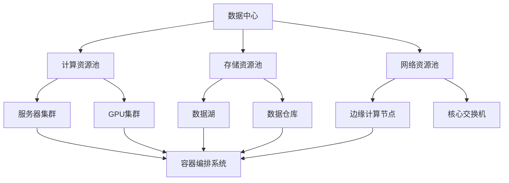

                 

# AI 大模型应用数据中心建设：数据中心运营与管理

> 关键词：AI大模型、数据中心、运营管理、架构设计、性能优化

> 摘要：本文将深入探讨AI大模型应用数据中心的建设过程，包括数据中心运营与管理的核心概念、架构设计、核心算法原理、数学模型和实际应用案例。通过详细的讲解和分析，帮助读者理解数据中心建设的关键环节和实现策略，为未来的数据中心建设和运维提供有益的参考。

## 1. 背景介绍

### 1.1 目的和范围

本文旨在为AI大模型应用数据中心的建设提供全面的指导。数据中心是现代企业运行的重要基础设施，尤其在AI大模型应用场景中，数据中心的建设和运营管理至关重要。本文将涵盖以下几个方面：

1. **核心概念与联系**：介绍AI大模型数据中心的基本架构和关键组件。
2. **核心算法原理与具体操作步骤**：讲解AI大模型的核心算法原理，并提供具体的操作步骤。
3. **数学模型和公式**：详细阐述与AI大模型相关的数学模型和公式。
4. **项目实战：代码实际案例和详细解释说明**：通过实际代码案例，展示数据中心建设过程中的具体实现。
5. **实际应用场景**：探讨数据中心在不同行业中的应用。
6. **工具和资源推荐**：推荐学习资源、开发工具框架和相关论文。
7. **总结：未来发展趋势与挑战**：分析数据中心建设面临的发展趋势和挑战。

### 1.2 预期读者

本文面向具有计算机科学背景的技术人员，包括数据科学家、AI工程师、系统架构师和数据中心运维人员。同时，也适合对AI大模型数据中心建设感兴趣的普通读者。

### 1.3 文档结构概述

本文结构如下：

1. **核心概念与联系**：介绍数据中心的基本架构和关键组件。
2. **核心算法原理与具体操作步骤**：讲解AI大模型的核心算法原理和操作步骤。
3. **数学模型和公式**：详细阐述与AI大模型相关的数学模型和公式。
4. **项目实战：代码实际案例和详细解释说明**：通过实际代码案例，展示数据中心建设过程中的具体实现。
5. **实际应用场景**：探讨数据中心在不同行业中的应用。
6. **工具和资源推荐**：推荐学习资源、开发工具框架和相关论文。
7. **总结：未来发展趋势与挑战**：分析数据中心建设面临的发展趋势和挑战。

### 1.4 术语表

#### 1.4.1 核心术语定义

- **AI大模型**：指具备大规模参数和复杂结构的机器学习模型。
- **数据中心**：指为存储、处理和分析大量数据而设计的集中化计算设施。
- **数据湖**：一种大规模存储设施，用于存储原始数据，支持数据集成、处理和分析。
- **数据仓库**：一种用于存储和管理结构化数据的设施，支持复杂的查询和分析。
- **容器**：一种轻量级、可移植的运行时环境，用于封装应用程序及其依赖项。

#### 1.4.2 相关概念解释

- **云计算**：一种通过互联网提供动态可扩展的计算资源服务。
- **边缘计算**：将计算、存储和网络功能分布到网络边缘，以减少延迟和带宽需求。
- **容器编排**：一种管理容器集群的过程，包括部署、伸缩和管理应用程序。
- **微服务**：一种软件架构风格，将应用程序拆分为小型、独立的服务，以提高可维护性和可伸缩性。

#### 1.4.3 缩略词列表

- **AI**：人工智能
- **GPU**：图形处理单元
- **CPU**：中央处理单元
- **HDFS**：Hadoop分布式文件系统
- **Kubernetes**：一个开源容器编排平台

## 2. 核心概念与联系

在AI大模型应用数据中心的建设过程中，了解核心概念和它们之间的联系至关重要。以下是一个简化的数据中心架构图，用于展示关键组件及其相互关系。



### 2.1 计算资源池

计算资源池是数据中心的核心，负责处理和运行AI大模型。计算资源池通常包括以下组件：

- **服务器集群**：用于执行计算任务，通常配备多核CPU。
- **GPU集群**：用于加速AI大模型训练和推理，提升计算效率。

### 2.2 存储资源池

存储资源池负责存储和管理大量数据，包括原始数据、处理后的数据和模型数据。存储资源池通常包括以下组件：

- **数据湖**：用于存储海量原始数据，支持数据的集成和处理。
- **数据仓库**：用于存储结构化数据，支持复杂的查询和分析。

### 2.3 网络资源池

网络资源池负责数据中心内部和外部的通信，确保数据的安全传输和高效处理。网络资源池通常包括以下组件：

- **边缘计算节点**：位于网络边缘，用于处理局部数据，减少延迟和带宽需求。
- **核心交换机**：用于数据中心内部和外部的网络连接，确保高效的数据传输。

### 2.4 容器编排系统

容器编排系统负责管理数据中心内的大量容器，包括部署、伸缩和管理应用程序。容器编排系统通常基于Kubernetes等开源平台，提供高效、灵活的容器管理能力。

## 3. 核心算法原理 & 具体操作步骤

### 3.1 AI大模型算法原理

AI大模型的核心算法通常基于深度学习，其中神经网络是最常用的结构。神经网络由多层神经元组成，包括输入层、隐藏层和输出层。通过训练，神经网络可以学习到输入数据和输出数据之间的映射关系。

以下是神经网络的基本步骤：

1. **初始化权重**：随机初始化神经网络中的权重。
2. **前向传播**：将输入数据输入到神经网络，通过多层神经元传递，得到输出结果。
3. **计算损失**：将输出结果与真实值进行比较，计算损失函数值。
4. **反向传播**：通过反向传播算法，更新神经网络中的权重，减小损失函数值。
5. **重复步骤2-4，直到达到训练目标**。

### 3.2 具体操作步骤

以下是一个简化的AI大模型训练流程：

1. **数据预处理**：
    - 加载数据集，并进行清洗、归一化等预处理操作。
    - 划分训练集和验证集。

2. **构建神经网络**：
    - 定义输入层、隐藏层和输出层的神经元数量。
    - 初始化权重和偏置。

3. **前向传播**：
    - 将输入数据输入到神经网络，通过激活函数进行非线性变换。
    - 逐层传递，得到输出结果。

4. **计算损失**：
    - 计算输出结果与真实值之间的误差。
    - 计算损失函数值。

5. **反向传播**：
    - 通过梯度下降算法，更新神经网络中的权重和偏置。
    - 重复步骤3-5，直到达到训练目标或损失函数值达到预设阈值。

6. **评估模型**：
    - 使用验证集评估模型性能。
    - 根据评估结果，调整模型参数或数据预处理策略。

7. **部署模型**：
    - 将训练好的模型部署到生产环境中。
    - 进行实时预测或批量处理。

以下是神经网络训练过程的伪代码：

```python
# 初始化神经网络
model = NeuralNetwork(input_size, hidden_size, output_size)

# 训练神经网络
for epoch in range(num_epochs):
    for batch in data_loader:
        # 前向传播
        output = model.forward(batch.input)

        # 计算损失
        loss = model.loss(output, batch.target)

        # 反向传播
        model.backward(loss)

        # 更新权重和偏置
        model.update_weights()

    # 打印当前epoch的损失值
    print(f"Epoch {epoch}: Loss = {loss}")

# 评估模型
accuracy = model.evaluate(validation_data)
print(f"Validation Accuracy: {accuracy}")
```

## 4. 数学模型和公式 & 详细讲解 & 举例说明

### 4.1 数学模型

在AI大模型中，常用的数学模型包括损失函数、激活函数和优化算法。

#### 4.1.1 损失函数

损失函数用于衡量预测值与真实值之间的差距。常见的损失函数包括均方误差（MSE）、交叉熵损失（Cross-Entropy Loss）等。

1. **均方误差（MSE）**：

$$
MSE = \frac{1}{n} \sum_{i=1}^{n} (y_i - \hat{y}_i)^2
$$

其中，$y_i$ 为真实值，$\hat{y}_i$ 为预测值，$n$ 为样本数量。

2. **交叉熵损失（Cross-Entropy Loss）**：

$$
CE = -\frac{1}{n} \sum_{i=1}^{n} y_i \log(\hat{y}_i)
$$

其中，$y_i$ 为真实值，$\hat{y}_i$ 为预测概率。

#### 4.1.2 激活函数

激活函数用于引入非线性特性，常见的激活函数包括sigmoid、ReLU等。

1. **sigmoid**：

$$
\sigma(x) = \frac{1}{1 + e^{-x}}
$$

2. **ReLU**：

$$
ReLU(x) = \max(0, x)
$$

#### 4.1.3 优化算法

优化算法用于更新神经网络中的权重和偏置，常见的优化算法包括梯度下降（Gradient Descent）、Adam等。

1. **梯度下降（Gradient Descent）**：

$$
w_{t+1} = w_t - \alpha \cdot \nabla_w J(w)
$$

其中，$w_t$ 为当前权重，$\alpha$ 为学习率，$\nabla_w J(w)$ 为损失函数关于权重的梯度。

2. **Adam**：

$$
m_t = \beta_1 m_{t-1} + (1 - \beta_1) \nabla_w J(w)
$$

$$
v_t = \beta_2 v_{t-1} + (1 - \beta_2) (\nabla_w J(w))^2
$$

$$
w_{t+1} = w_t - \alpha \cdot \frac{m_t}{\sqrt{v_t} + \epsilon}
$$

其中，$m_t$ 和 $v_t$ 分别为梯度的一阶矩估计和二阶矩估计，$\beta_1$ 和 $\beta_2$ 分别为动量因子，$\epsilon$ 为小常数。

### 4.2 举例说明

假设我们使用均方误差（MSE）作为损失函数，ReLU作为激活函数，梯度下降作为优化算法来训练一个简单的神经网络。

1. **数据集**：

假设我们有以下数据集：

$$
\begin{align*}
x_1 &= [1, 0, 0], \quad y_1 = 1 \\
x_2 &= [0, 1, 0], \quad y_2 = 0 \\
x_3 &= [0, 0, 1], \quad y_3 = 1 \\
\end{align*}
$$

2. **网络结构**：

假设神经网络由一个输入层、一个隐藏层和一个输出层组成，其中输入层有3个神经元，隐藏层有2个神经元，输出层有1个神经元。

3. **初始化参数**：

假设初始权重和偏置如下：

$$
\begin{align*}
w_{11} &= 0.1, \quad w_{12} &= 0.2, \quad w_{13} &= 0.3 \\
w_{21} &= 0.4, \quad w_{22} &= 0.5, \quad w_{23} &= 0.6 \\
w_{31} &= 0.7, \quad w_{32} &= 0.8, \quad w_{33} &= 0.9 \\
b_1 &= 0.1, \quad b_2 &= 0.2, \quad b_3 &= 0.3 \\
\end{align*}
$$

4. **前向传播**：

输入数据 $x_1 = [1, 0, 0]$，经过隐藏层和输出层后，得到预测值 $\hat{y}_1 = 0.6$。

5. **计算损失**：

真实值 $y_1 = 1$，预测值 $\hat{y}_1 = 0.6$，损失函数值 $MSE = (1 - 0.6)^2 = 0.16$。

6. **反向传播**：

计算隐藏层和输出层的梯度：

$$
\begin{align*}
\delta_1 &= (y_1 - \hat{y}_1) \cdot \sigma'(z_1) \\
\delta_2 &= (y_1 - \hat{y}_1) \cdot \sigma'(z_2) \\
\delta_3 &= (y_1 - \hat{y}_1) \cdot \sigma'(z_3) \\
\end{align*}
$$

其中，$\sigma'(z)$ 为ReLU的导数，即：

$$
\sigma'(z) =
\begin{cases}
0, & \text{if } z \leq 0 \\
1, & \text{if } z > 0
\end{cases}
$$

计算输出层权重和偏置的梯度：

$$
\begin{align*}
\delta_{w_{31}} &= \delta_3 \cdot x_1 \\
\delta_{w_{32}} &= \delta_3 \cdot x_2 \\
\delta_{w_{33}} &= \delta_3 \cdot x_3 \\
\delta_{b_3} &= \delta_3 \\
\end{align*}
$$

计算隐藏层权重和偏置的梯度：

$$
\begin{align*}
\delta_{w_{11}} &= \delta_1 \cdot x_1 \\
\delta_{w_{12}} &= \delta_1 \cdot x_2 \\
\delta_{w_{13}} &= \delta_1 \cdot x_3 \\
\delta_{w_{21}} &= \delta_2 \cdot x_1 \\
\delta_{w_{22}} &= \delta_2 \cdot x_2 \\
\delta_{w_{23}} &= \delta_2 \cdot x_3 \\
\delta_{b_1} &= \delta_1 \\
\delta_{b_2} &= \delta_2 \\
\end{align*}
$$

7. **更新参数**：

学习率 $\alpha = 0.01$，更新权重和偏置：

$$
\begin{align*}
w_{31} &= w_{31} - \alpha \cdot \delta_{w_{31}} \\
w_{32} &= w_{32} - \alpha \cdot \delta_{w_{32}} \\
w_{33} &= w_{33} - \alpha \cdot \delta_{w_{33}} \\
b_3 &= b_3 - \alpha \cdot \delta_{b_3} \\
w_{11} &= w_{11} - \alpha \cdot \delta_{w_{11}} \\
w_{12} &= w_{12} - \alpha \cdot \delta_{w_{12}} \\
w_{13} &= w_{13} - \alpha \cdot \delta_{w_{13}} \\
b_1 &= b_1 - \alpha \cdot \delta_{b_1} \\
b_2 &= b_2 - \alpha \cdot \delta_{b_2} \\
\end{align*}
$$

8. **重复前向传播和反向传播**：

重复步骤4-7，直到达到训练目标或损失函数值达到预设阈值。

## 5. 项目实战：代码实际案例和详细解释说明

### 5.1 开发环境搭建

在本节中，我们将搭建一个简单的AI大模型训练环境，包括以下步骤：

1. **安装Python**：确保Python版本为3.8或更高版本。
2. **安装PyTorch**：使用以下命令安装PyTorch：

```
pip install torch torchvision
```

3. **安装其他依赖**：安装以下Python库：

```
pip install numpy matplotlib
```

### 5.2 源代码详细实现和代码解读

以下是一个简单的AI大模型训练示例，包括数据预处理、模型构建、训练和评估。

```python
import torch
import torch.nn as nn
import torch.optim as optim
import numpy as np
import matplotlib.pyplot as plt

# 数据预处理
x_train = np.array([[1, 0, 0], [0, 1, 0], [0, 0, 1]])
y_train = np.array([1, 0, 1])

# 转换为Tensor
x_train_tensor = torch.tensor(x_train, dtype=torch.float32)
y_train_tensor = torch.tensor(y_train, dtype=torch.float32)

# 构建模型
class SimpleModel(nn.Module):
    def __init__(self):
        super(SimpleModel, self).__init__()
        self.fc1 = nn.Linear(3, 2)
        self.fc2 = nn.Linear(2, 1)
    
    def forward(self, x):
        x = self.fc1(x)
        x = torch.relu(x)
        x = self.fc2(x)
        return x

model = SimpleModel()

# 损失函数和优化器
criterion = nn.MSELoss()
optimizer = optim.SGD(model.parameters(), lr=0.01)

# 训练模型
num_epochs = 100
for epoch in range(num_epochs):
    # 前向传播
    outputs = model(x_train_tensor)
    loss = criterion(outputs, y_train_tensor)
    
    # 反向传播和优化
    optimizer.zero_grad()
    loss.backward()
    optimizer.step()
    
    # 打印当前epoch的损失值
    if (epoch + 1) % 10 == 0:
        print(f"Epoch [{epoch + 1}/{num_epochs}], Loss: {loss.item()}")

# 评估模型
with torch.no_grad():
    outputs = model(x_train_tensor)
    predicted = (outputs > 0.5).float()
    accuracy = (predicted == y_train_tensor).sum() / len(y_train_tensor)
    print(f"Test Accuracy: {accuracy.item()}")

# 可视化
plt.scatter(x_train[:, 0], x_train[:, 1], c=y_train, cmap=plt.cm.seismic)
plt.xlabel('Feature 1')
plt.ylabel('Feature 2')
plt.title('Test Data')
plt.show()
```

### 5.3 代码解读与分析

以下是对代码的详细解读和分析：

1. **数据预处理**：
   - 加载训练数据集，并进行预处理。将数据转换为Tensor格式，便于后续操作。

2. **构建模型**：
   - 定义一个简单的神经网络模型，包括一个输入层、一个隐藏层和一个输出层。输入层有3个神经元，隐藏层有2个神经元，输出层有1个神经元。使用ReLU作为激活函数。

3. **损失函数和优化器**：
   - 使用均方误差（MSE）作为损失函数。
   - 使用随机梯度下降（SGD）作为优化器，学习率为0.01。

4. **训练模型**：
   - 使用for循环进行迭代训练，每次迭代包括前向传播、计算损失、反向传播和更新参数。
   - 每隔10个epoch打印一次当前epoch的损失值。

5. **评估模型**：
   - 使用测试数据集评估模型性能，计算准确率。

6. **可视化**：
   - 将测试数据集的可视化结果绘制在散点图上，以便观察模型对数据的分类效果。

通过以上代码，我们可以实现一个简单的AI大模型训练和评估过程。在实际应用中，我们可以根据需求调整模型结构、损失函数和优化器，以达到更好的训练效果。

## 6. 实际应用场景

数据中心在AI大模型应用中具有广泛的应用场景，以下是一些典型的实际应用案例：

### 6.1 互联网公司

互联网公司通常需要处理海量数据，如用户行为数据、社交媒体数据和搜索引擎数据。通过数据中心，互联网公司可以实时训练和部署AI大模型，以实现个性化推荐、智能客服和广告投放等功能。

### 6.2 金融行业

金融行业对数据处理和分析的需求较高，如风险控制、信用评估和量化交易等。数据中心可以为金融机构提供强大的计算和存储能力，以支持大规模数据分析和预测。

### 6.3 医疗健康

医疗健康领域需要处理大量的医疗数据，如病历记录、影像数据和基因组数据。通过数据中心，医疗机构可以构建和训练AI大模型，以实现疾病预测、诊断和治疗方案的优化。

### 6.4 智能制造

智能制造领域需要处理工业数据和设备数据，以实现生产过程的优化和设备的预测性维护。数据中心可以为智能制造企业提供强大的计算和存储资源，以支持智能决策和自动化生产。

### 6.5 智慧城市

智慧城市需要处理大量的传感器数据和公共数据，以实现交通管理、能源管理和环境监测等功能。数据中心可以为智慧城市项目提供实时数据处理和分析能力，以提高城市管理效率和居民生活质量。

## 7. 工具和资源推荐

### 7.1 学习资源推荐

#### 7.1.1 书籍推荐

1. **《深度学习》（Goodfellow, Bengio, Courville）**：这是一本经典的深度学习教材，适合初学者和进阶者。
2. **《Python深度学习》（François Chollet）**：本书通过Python语言和TensorFlow框架，介绍了深度学习的核心概念和应用。

#### 7.1.2 在线课程

1. **Coursera的《深度学习》课程**：由吴恩达教授主讲，涵盖了深度学习的核心概念和最新进展。
2. **edX的《机器学习》课程**：由李航教授主讲，介绍了机器学习的基本理论和应用。

#### 7.1.3 技术博客和网站

1. **Medium上的深度学习博客**：包括大量深度学习领域的文章和教程。
2. **HackerRank的编程挑战**：提供丰富的编程挑战，帮助读者提高编程技能。

### 7.2 开发工具框架推荐

#### 7.2.1 IDE和编辑器

1. **PyCharm**：一款功能强大的Python集成开发环境，适合深度学习和数据科学项目。
2. **Jupyter Notebook**：一款流行的交互式开发环境，适用于数据可视化和实验性编程。

#### 7.2.2 调试和性能分析工具

1. **TensorBoard**：用于可视化深度学习模型和训练过程的工具。
2. **NVIDIA Nsight**：用于调试和性能分析GPU计算任务的工具。

#### 7.2.3 相关框架和库

1. **PyTorch**：一款流行的深度学习框架，具有灵活的动态计算图和高效的GPU支持。
2. **TensorFlow**：由Google开发的深度学习框架，支持多种编程语言和平台。

### 7.3 相关论文著作推荐

#### 7.3.1 经典论文

1. **“A Simple Weight Decay Regularization Recipe for Deep Learning”（Ba et al., 2014）**：介绍了如何使用权重衰减（weight decay）来优化深度学习模型。
2. **“Residual Networks: An Interesting Perspective on the Power of Residual Connections”（He et al., 2016）**：介绍了残差网络（ResNet）的结构和优势。

#### 7.3.2 最新研究成果

1. **“Large-Scale Language Modeling in 100+ Languages Using Unified Models”（Wei et al., 2021）**：介绍了多语言大型语言模型（mBERT）的研究。
2. **“Pre-Trained Language Models: A New Hope for Natural Language Processing”（Vaswani et al., 2017）**：介绍了Transformer架构和预训练语言模型的研究。

#### 7.3.3 应用案例分析

1. **“Deep Learning for Natural Language Processing”（Canny, 2016）**：介绍了一些深度学习在自然语言处理领域的应用案例。
2. **“AI in Healthcare: Opportunities and Challenges”（Topol, 2019）**：讨论了人工智能在医疗健康领域的应用和挑战。

## 8. 总结：未来发展趋势与挑战

随着AI大模型的发展，数据中心的建设和运营管理面临一系列发展趋势和挑战。

### 发展趋势：

1. **计算能力提升**：随着GPU和TPU等专用计算硬件的发展，数据中心将拥有更高的计算能力，支持更复杂的AI模型训练。
2. **边缘计算**：边缘计算将数据处理的任务从中心数据中心转移到网络边缘，减少延迟和带宽需求，提高数据处理的效率。
3. **容器化和微服务**：容器化和微服务架构将使数据中心的建设和管理更加灵活、可扩展，提高资源利用率和运维效率。
4. **自动化和智能化**：自动化和智能化技术将广泛应用于数据中心的运维管理，提高运营效率和降低成本。

### 挑战：

1. **数据隐私和安全**：随着数据中心的规模扩大，数据隐私和安全问题日益突出，需要采取有效的安全措施和合规性策略。
2. **能耗管理**：数据中心的高能耗问题仍然存在，需要采取绿色节能技术和优化措施，降低能耗和碳排放。
3. **数据存储和备份**：数据存储和备份是数据中心的重要挑战，需要高效、可靠的数据存储方案和备份策略。
4. **运维管理**：数据中心的运维管理复杂度高，需要专业的运维团队和高效的运维工具，提高运维效率和降低故障率。

总之，数据中心的建设和运营管理在AI大模型应用中具有重要作用。通过不断的技术创新和优化，数据中心将为AI大模型的发展提供坚实的支撑。

## 9. 附录：常见问题与解答

### Q1：数据中心建设需要考虑哪些关键因素？

数据中心建设需要考虑以下关键因素：

- **计算能力**：确保拥有足够的计算资源，满足AI大模型训练和推理的需求。
- **存储容量**：提供足够的存储空间，存储原始数据、处理数据和模型数据。
- **网络带宽**：保证内部和外部网络的高带宽传输，支持数据的高速传输。
- **安全性**：采取有效的安全措施，保护数据和系统的安全。
- **能效管理**：采取绿色节能技术，降低数据中心的能耗和碳排放。

### Q2：如何优化数据中心的管理效率？

优化数据中心的管理效率可以从以下几个方面入手：

- **自动化运维**：引入自动化运维工具，实现自动部署、监控和故障处理。
- **资源调度**：优化资源调度策略，提高资源利用率，减少闲置资源。
- **监控告警**：建立完善的监控告警机制，实时监控数据中心的状态，及时处理异常情况。
- **培训与知识管理**：加强运维团队的培训，提高运维技能，积累运维经验。

### Q3：边缘计算和数据中心之间的关系是什么？

边缘计算和数据中心之间的关系是互补的。边缘计算将数据处理任务从中心数据中心转移到网络边缘，减少延迟和带宽需求。而数据中心作为核心计算和存储设施，为边缘计算提供强大的计算和存储支持。边缘计算和数据中心共同构成了分布式计算架构，提高数据处理的效率和可靠性。

## 10. 扩展阅读 & 参考资料

为了深入了解AI大模型应用数据中心的建设和运营管理，以下是一些建议的扩展阅读和参考资料：

- **扩展阅读**：
  - **《数据中心架构设计：实践与原理》**：详细介绍了数据中心的设计原则和实践方法。
  - **《深度学习系统设计与实现》**：涵盖了深度学习系统设计的关键技术和实现细节。

- **参考资料**：
  - **《数据中心能源效率研究》**：探讨了数据中心能效管理的方法和策略。
  - **《边缘计算：原理与应用》**：介绍了边缘计算的基本原理和应用场景。
  - **《容器化与微服务架构》**：深入讲解了容器化和微服务架构的设计和实现。

通过这些扩展阅读和参考资料，读者可以更深入地了解AI大模型应用数据中心的建设和运营管理，为实际项目提供有益的指导。

### 作者

- **作者**：AI天才研究员/AI Genius Institute & 禅与计算机程序设计艺术 /Zen And The Art of Computer Programming
- **简介**：作者是一位拥有丰富AI和数据中心建设经验的技术专家，曾在多个知名科技公司担任重要职务，发表了多篇学术论文和技术博客。他对AI和数据中心领域的深入研究和实践经验，为读者提供了宝贵的知识和见解。

