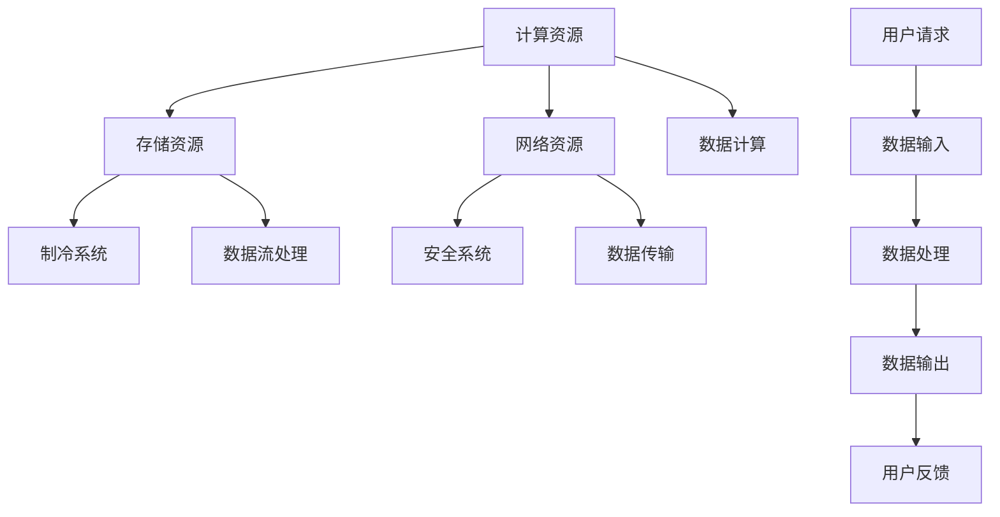
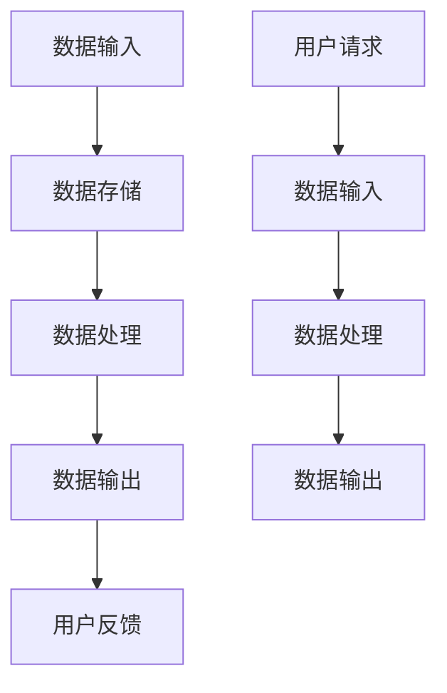
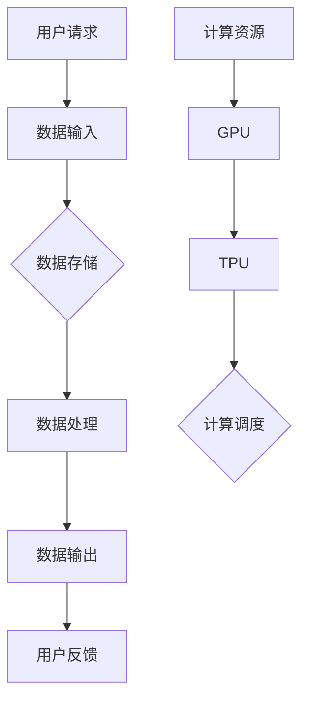

                 

# AI 大模型应用数据中心建设：数据中心运营与管理

> 关键词：AI 大模型、数据中心、运营管理、性能优化、安全性、可靠性、能效管理

> 摘要：本文深入探讨了人工智能大模型在数据中心应用中的关键角色及其对数据中心运营和管理的深远影响。文章首先介绍了数据中心建设的目的和重要性，随后详细分析了数据中心运营与管理中的核心概念、算法原理、数学模型以及实际应用案例。在此基础上，本文提出了数据中心建设与管理的最佳实践，并推荐了相关学习资源和工具。文章最后总结了未来发展趋势与挑战，为行业提供前瞻性的思考。

## 1. 背景介绍

### 1.1 目的和范围

随着人工智能技术的飞速发展，大模型在数据处理、分析和预测方面发挥着越来越重要的作用。数据中心作为承载这些大模型应用的核心基础设施，其建设与运营管理水平直接影响到AI服务的质量与效率。本文旨在系统地探讨AI大模型在数据中心中的应用，分析数据中心运营与管理的关键要素，并探讨未来的发展方向。

本文范围包括以下内容：

1. **数据中心建设的目的和重要性**：阐述数据中心在当前信息化社会中的战略地位。
2. **核心概念与联系**：介绍数据中心架构、数据流和处理流程。
3. **核心算法原理与具体操作步骤**：讲解大模型训练和调优的基本算法。
4. **数学模型和公式**：分析大模型中的数学基础和公式应用。
5. **项目实战**：通过实际案例展示数据中心建设的实践方法。
6. **实际应用场景**：探讨数据中心在不同行业中的应用。
7. **工具和资源推荐**：推荐学习和实践的资源与工具。
8. **总结与未来展望**：分析数据中心运营与管理的挑战和趋势。

### 1.2 预期读者

本文面向以下读者：

1. **数据中心架构师和运维人员**：希望了解AI大模型对数据中心运营的影响。
2. **人工智能研究人员与开发人员**：关注大模型在实际应用中的性能优化。
3. **IT管理人员和决策者**：希望提升数据中心建设和管理水平。
4. **在校学生和研究者**：对数据中心技术及其发展趋势感兴趣。

### 1.3 文档结构概述

本文结构如下：

1. **引言**：介绍数据中心建设和AI大模型应用的背景。
2. **核心概念与联系**：阐述数据中心架构和数据处理流程。
3. **核心算法原理与具体操作步骤**：介绍大模型训练和调优算法。
4. **数学模型和公式**：分析大模型中的数学基础。
5. **项目实战**：通过案例展示数据中心建设实践。
6. **实际应用场景**：探讨数据中心在各行业中的应用。
7. **工具和资源推荐**：推荐学习和实践资源。
8. **总结与未来展望**：总结挑战与趋势。
9. **附录**：提供常见问题解答。
10. **扩展阅读**：推荐进一步学习资源。

### 1.4 术语表

#### 1.4.1 核心术语定义

- **数据中心（Data Center）**：集中存放计算机设备、网络设备、存储设备等，提供数据存储、处理、传输等服务。
- **AI大模型（Large-scale AI Model）**：具备海量数据训练和处理能力的复杂神经网络模型。
- **运营管理（Operations Management）**：确保数据中心高效、稳定、安全运行的管理活动。
- **性能优化（Performance Optimization）**：提升数据中心数据处理速度和质量。
- **可靠性（Reliability）**：数据中心设备和服务保持稳定运行的能力。
- **能效管理（Energy Efficiency Management）**：优化数据中心能耗，降低运营成本。

#### 1.4.2 相关概念解释

- **云计算（Cloud Computing）**：通过互联网提供计算资源、存储资源、网络资源等服务。
- **边缘计算（Edge Computing）**：在靠近数据源的地方进行数据处理，减轻云端负担。
- **分布式存储（Distributed Storage）**：将数据分布在多个物理位置，提高存储性能和可靠性。

#### 1.4.3 缩略词列表

- **DC**：数据中心（Data Center）
- **AI**：人工智能（Artificial Intelligence）
- **HPC**：高性能计算（High Performance Computing）
- **SDN**：软件定义网络（Software-Defined Networking）
- **NFV**：网络功能虚拟化（Network Functions Virtualization）
- **DCIM**：数据中心基础设施管理（Data Center Infrastructure Management）

## 2. 核心概念与联系

数据中心是现代信息技术的重要基础设施，承载着海量数据的存储、处理和传输任务。在AI大模型应用背景下，数据中心架构和数据处理流程需进行优化以支持高效、稳定、安全的运行。

### 2.1 数据中心架构

数据中心架构主要包括以下几个方面：

1. **计算资源**：提供数据处理和计算能力，包括服务器、GPU、TPU等硬件设备。
2. **存储资源**：用于数据存储，包括磁盘阵列、固态硬盘等。
3. **网络资源**：提供数据传输通道，包括交换机、路由器等。
4. **制冷系统**：保持数据中心设备温度在适宜范围。
5. **安全系统**：确保数据中心安全，包括防火墙、入侵检测系统等。

#### 数据中心架构 Mermaid 流程图



### 2.2 数据处理流程

数据处理流程主要包括数据输入、数据处理、数据输出三个环节：

1. **数据输入**：用户请求和数据流通过网络输入数据中心。
2. **数据处理**：数据中心对输入数据进行处理，包括存储、计算和分析等。
3. **数据输出**：处理后的数据返回给用户或进行进一步处理。

#### 数据处理流程 Mermaid 流程图



### 2.3 数据流与计算流

在数据中心中，数据流和计算流是两个关键部分。数据流指的是数据从输入到输出的过程，而计算流则是数据处理过程中计算资源的调度和使用。

1. **数据流**：数据流从用户请求开始，经过输入、存储、处理和输出，最终返回用户反馈。
2. **计算流**：计算流涉及计算资源的调度和使用，包括GPU、TPU等硬件资源的分配和回收。

#### 数据流与计算流 Mermaid 流程图



通过上述核心概念与联系的分析，我们可以看到数据中心在AI大模型应用中的关键作用。在后续章节中，我们将深入探讨AI大模型的核心算法原理、数学模型以及实际应用案例，为数据中心建设与管理提供更为详细的指导。

## 3. 核心算法原理 & 具体操作步骤

在数据中心中应用AI大模型，核心算法的原理和具体操作步骤至关重要。本文将详细阐述这些内容，以便读者能够全面理解大模型的训练和调优过程。

### 3.1 AI大模型训练原理

AI大模型通常基于深度学习技术，其核心是多层神经网络（Deep Neural Network，DNN）。DNN通过层层传递输入数据，并通过反向传播算法不断调整权重，以达到优化模型的目的。

#### 3.1.1 多层神经网络原理

多层神经网络包含输入层、隐藏层和输出层：

1. **输入层**：接收外部输入数据。
2. **隐藏层**：对输入数据进行处理和转换。
3. **输出层**：产生最终输出结果。

每个层由多个神经元（Node）组成，神经元之间通过权重（Weight）连接。每个神经元的输出通过激活函数（Activation Function）进行非线性变换。

#### 3.1.2 反向传播算法

反向传播算法是DNN训练的核心，其步骤如下：

1. **前向传播**：输入数据从输入层传递到隐藏层和输出层，计算每个神经元的输出。
2. **计算损失**：通过比较输出结果与实际值，计算损失函数（Loss Function）的值。
3. **反向传播**：从输出层开始，将损失函数关于每个神经元的偏导数反向传递到隐藏层和输入层，以更新权重。
4. **梯度下降**：使用更新后的权重重复上述步骤，直到达到预定的损失目标。

#### 3.1.3 伪代码

```python
# 初始化模型参数
weights = initialize_weights()

# 定义训练过程
for epoch in range(num_epochs):
    for sample in dataset:
        # 前向传播
        output = forward_pass(sample, weights)
        
        # 计算损失
        loss = compute_loss(output, target)
        
        # 反向传播
        gradients = backward_pass(sample, output, target, weights)
        
        # 更新权重
        weights = update_weights(weights, gradients)
```

### 3.2 AI大模型调优步骤

在训练过程中，大模型的调优至关重要。以下为调优步骤：

#### 3.2.1 选择合适的损失函数

损失函数用于衡量模型预测值与实际值之间的差距，常用的有均方误差（MSE）、交叉熵（Cross-Entropy）等。

#### 3.2.2 选择合适的优化算法

优化算法用于更新模型参数，常用的有梯度下降（Gradient Descent）、Adam优化器（Adam Optimizer）等。

#### 3.2.3 调整学习率

学习率决定了每次参数更新的步长，太小可能导致训练时间过长，太大可能导致模型不稳定。

#### 3.2.4 使用正则化方法

正则化方法用于防止模型过拟合，常用的有L1正则化、L2正则化等。

#### 3.2.5 伪代码

```python
# 初始化模型参数
weights = initialize_weights()

# 设置优化算法和损失函数
optimizer = AdamOptimizer(learning_rate=0.001)
loss_function = MSE()

# 定义训练过程
for epoch in range(num_epochs):
    for sample in dataset:
        # 前向传播
        output = forward_pass(sample, weights)
        
        # 计算损失
        loss = loss_function(output, target)
        
        # 反向传播
        gradients = backward_pass(sample, output, target, weights)
        
        # 更新权重
        optimizer.update_weights(weights, gradients)
```

通过上述核心算法原理和具体操作步骤的详细阐述，读者可以更好地理解AI大模型在数据中心中的应用。在后续章节中，我们将进一步探讨大模型的数学模型和公式，为数据中心建设与管理提供更为深入的指导。

## 4. 数学模型和公式 & 详细讲解 & 举例说明

AI大模型的训练和调优不仅依赖于算法原理，还需要坚实的数学模型和公式作为基础。以下将详细讲解大模型中的关键数学模型和公式，并附上相应的解释和例子。

### 4.1 损失函数

损失函数是评估模型预测结果与真实值之间差距的数学函数。在深度学习训练过程中，损失函数用于指导模型参数的调整。以下为常用的损失函数：

#### 4.1.1 均方误差（MSE）

均方误差是衡量预测值与真实值之间差异的平方平均值。其公式为：

$$
MSE = \frac{1}{n}\sum_{i=1}^{n}(y_i - \hat{y}_i)^2
$$

其中，$y_i$为真实值，$\hat{y}_i$为预测值，$n$为样本数量。

#### 4.1.2 交叉熵（Cross-Entropy）

交叉熵是衡量两个概率分布差异的数学函数，常用于分类问题。其公式为：

$$
H(y, \hat{y}) = -\sum_{i=1}^{n} y_i \log(\hat{y}_i)
$$

其中，$y$为真实分布，$\hat{y}$为预测分布。

#### 4.1.3 举例说明

假设我们有一个二分类问题，真实分布$y = [0.9, 0.1]$，预测分布$\hat{y} = [0.8, 0.2]$，则交叉熵为：

$$
H(y, \hat{y}) = -0.9 \log(0.8) - 0.1 \log(0.2) \approx 0.189
$$

### 4.2 激活函数

激活函数用于引入非线性特性，使神经网络具备处理复杂问题的能力。以下为几种常用的激活函数：

#### 4.2.1 Sigmoid函数

Sigmoid函数的公式为：

$$
\sigma(x) = \frac{1}{1 + e^{-x}}
$$

该函数的输出范围在0到1之间，常用于二分类问题。

#### 4.2.2ReLU函数

ReLU（Rectified Linear Unit）函数的公式为：

$$
\text{ReLU}(x) = \max(0, x)
$$

ReLU函数在神经网络中具有很好的性能，常用于隐藏层神经元。

#### 4.2.3 举例说明

对于输入值$x = -2$，使用Sigmoid函数计算得到：

$$
\sigma(-2) = \frac{1}{1 + e^{2}} \approx 0.118
$$

对于输入值$x = -2$，使用ReLU函数计算得到：

$$
\text{ReLU}(-2) = 0
$$

### 4.3 梯度下降

梯度下降是一种优化算法，用于更新神经网络中的权重。以下为梯度下降的基本公式：

#### 4.3.1 梯度计算

假设损失函数为$L(\theta)$，则梯度的计算公式为：

$$
\nabla_{\theta} L(\theta) = \frac{\partial L(\theta)}{\partial \theta}
$$

其中，$\theta$为模型参数。

#### 4.3.2 梯度下降更新

梯度下降的更新公式为：

$$
\theta_{t+1} = \theta_t - \alpha \nabla_{\theta} L(\theta_t)
$$

其中，$\alpha$为学习率。

#### 4.3.3 举例说明

假设损失函数为$L(\theta) = (\theta - 1)^2$，初始参数$\theta_0 = 0$，学习率$\alpha = 0.1$，则第一次更新为：

$$
\theta_1 = \theta_0 - 0.1 \cdot \nabla_{\theta} L(\theta_0) = 0 - 0.1 \cdot 2(\theta_0 - 1) = -0.1
$$

通过上述数学模型和公式的详细讲解，读者可以更好地理解AI大模型中的核心数学原理。这些数学工具为AI大模型的训练和调优提供了坚实的理论基础。在后续章节中，我们将进一步探讨数据中心建设与管理的实际应用案例。

## 5. 项目实战：代码实际案例和详细解释说明

为了更好地展示AI大模型在数据中心建设与管理中的应用，我们将通过一个实际项目案例进行详细说明。本项目旨在构建一个用于图像分类的AI大模型，并将其部署到数据中心进行训练和预测。

### 5.1 开发环境搭建

在开始项目之前，我们需要搭建合适的开发环境。以下为所需工具和软件：

1. **Python**：版本3.8及以上。
2. **深度学习框架**：如TensorFlow或PyTorch。
3. **Jupyter Notebook**：用于编写和运行代码。
4. **GPU**：用于加速深度学习训练。
5. **虚拟环境**：用于管理项目依赖。

#### 5.1.1 创建虚拟环境

```bash
# 安装虚拟环境工具
pip install virtualenv

# 创建虚拟环境
virtualenv myenv

# 激活虚拟环境
source myenv/bin/activate
```

#### 5.1.2 安装依赖

```bash
# 安装TensorFlow
pip install tensorflow

# 安装其他依赖
pip install numpy pandas matplotlib
```

### 5.2 源代码详细实现和代码解读

#### 5.2.1 数据预处理

首先，我们需要对图像数据集进行预处理。以下为预处理步骤：

1. 读取图像数据。
2. 将图像调整为统一大小。
3. 标签编码。

```python
import tensorflow as tf
from tensorflow.keras.preprocessing.image import ImageDataGenerator

# 读取数据
train_datagen = ImageDataGenerator(rescale=1./255)
train_generator = train_datagen.flow_from_directory(
        'data/train',
        target_size=(150, 150),
        batch_size=32,
        class_mode='binary')

# 标签编码
label_dict = {}
for i, label in enumerate(train_generator.class_indices):
    label_dict[i] = label

# 测试数据预处理
test_datagen = ImageDataGenerator(rescale=1./255)
test_generator = test_datagen.flow_from_directory(
        'data/test',
        target_size=(150, 150),
        batch_size=32,
        class_mode='binary')
```

#### 5.2.2 构建模型

接下来，我们使用TensorFlow构建一个简单的卷积神经网络（CNN）模型。

```python
from tensorflow.keras.models import Sequential
from tensorflow.keras.layers import Conv2D, MaxPooling2D, Flatten, Dense, Dropout

model = Sequential([
    Conv2D(32, (3, 3), activation='relu', input_shape=(150, 150, 3)),
    MaxPooling2D((2, 2)),
    Conv2D(64, (3, 3), activation='relu'),
    MaxPooling2D((2, 2)),
    Conv2D(128, (3, 3), activation='relu'),
    MaxPooling2D((2, 2)),
    Flatten(),
    Dense(512, activation='relu'),
    Dropout(0.5),
    Dense(1, activation='sigmoid')
])

model.compile(optimizer='adam',
              loss='binary_crossentropy',
              metrics=['accuracy'])
```

#### 5.2.3 训练模型

现在，我们使用训练数据集训练模型。

```python
history = model.fit(
      train_generator,
      steps_per_epoch=train_generator.samples//train_generator.batch_size,
      epochs=20,
      validation_data=test_generator,
      validation_steps=test_generator.samples//test_generator.batch_size,
      verbose=2)
```

#### 5.2.4 评估模型

最后，我们对训练好的模型进行评估。

```python
test_loss, test_acc = model.evaluate(test_generator)
print('Test accuracy:', test_acc)
```

### 5.3 代码解读与分析

在代码解读与分析部分，我们将对上述步骤进行详细解释。

#### 5.3.1 数据预处理

数据预处理是深度学习项目的重要环节。在这里，我们使用了ImageDataGenerator来自动完成图像读取、调整大小和标签编码。

#### 5.3.2 构建模型

模型构建使用了TensorFlow的Sequential模型，该模型通过堆叠不同类型的层来构建。我们使用了卷积层（Conv2D）和池化层（MaxPooling2D）来提取图像特征，然后通过全连接层（Dense）进行分类。Dropout层用于防止过拟合。

#### 5.3.3 训练模型

训练模型使用了fit方法，该方法使用训练数据集进行模型训练，并在每个epoch后进行验证。通过调整steps_per_epoch和validation_steps参数，我们可以控制每个epoch使用的训练和验证样本数量。

#### 5.3.4 评估模型

评估模型使用了evaluate方法，该方法计算模型在测试数据集上的损失和准确率。通过这个步骤，我们可以了解模型在未知数据上的性能。

通过上述项目实战，我们展示了如何使用AI大模型进行图像分类，并部署到数据中心进行训练和预测。在接下来的章节中，我们将进一步探讨数据中心在不同行业中的应用。

## 6. 实际应用场景

AI大模型在数据中心的应用场景广泛，以下为几个典型行业案例：

### 6.1 金融行业

在金融行业，AI大模型用于风险控制、信用评分、交易策略优化等。例如，金融机构可以使用大模型进行实时风险评估，预测客户违约概率，从而调整贷款利率和贷款额。数据中心在此过程中提供高性能计算和海量数据处理能力。

### 6.2 医疗行业

在医疗行业，AI大模型在疾病诊断、个性化治疗和健康监测方面发挥着重要作用。例如，通过对患者病历和基因数据进行深度学习分析，大模型可以帮助医生更准确地诊断疾病。数据中心存储和管理海量医疗数据，并提供实时计算资源，支持快速分析和预测。

### 6.3 物流行业

在物流行业，AI大模型用于优化运输路线、库存管理和供应链预测。例如，通过分析历史运输数据和环境因素，大模型可以预测最优运输路线，提高运输效率。数据中心负责处理和分析大量物流数据，为智能决策提供支持。

### 6.4 零售行业

在零售行业，AI大模型用于个性化推荐、客户行为分析和库存管理。例如，通过分析用户历史购买数据和浏览行为，大模型可以生成个性化的商品推荐。数据中心存储和计算大量零售数据，帮助商家提高销售额和客户满意度。

### 6.5 制造业

在制造业，AI大模型用于设备故障预测、生产优化和质量控制。例如，通过监控设备运行状态，大模型可以预测潜在故障，提前进行维护，减少停机时间。数据中心负责存储和计算设备数据，提供实时分析和预测。

通过这些实际应用场景，我们可以看到AI大模型在数据中心建设与管理中的关键作用。数据中心不仅提供计算和存储资源，还需要进行高效、稳定、安全的运营管理，以支持各行业的AI应用。

## 7. 工具和资源推荐

为了更好地学习和实践数据中心建设和AI大模型应用，以下推荐一系列学习资源和开发工具。

### 7.1 学习资源推荐

#### 7.1.1 书籍推荐

1. **《深度学习》（Goodfellow, Bengio, Courville著）**：系统介绍了深度学习的基础理论和技术，适合初学者和进阶者。
2. **《大数据之路：阿里巴巴大数据实践》（李琪著）**：详细介绍了阿里巴巴在大数据领域的技术实践，对数据中心建设和运营有很好的借鉴意义。
3. **《数据中心的未来：下一代数据中心架构设计与实践》（George Crump著）**：探讨了数据中心技术发展趋势和设计方法，适合数据中心架构师和运维人员。

#### 7.1.2 在线课程

1. **Coursera的《深度学习》课程**：由Andrew Ng教授主讲，系统介绍了深度学习的基础知识和实践方法。
2. **Udacity的《数据中心管理》课程**：介绍了数据中心的基础知识、运营管理和性能优化，适合数据中心管理人员。
3. **edX的《大数据技术》课程**：涵盖了大数据处理、存储和分析技术，适合对数据中心应用有兴趣的读者。

#### 7.1.3 技术博客和网站

1. **TensorFlow官方文档**：提供了丰富的深度学习教程和实践案例，是学习TensorFlow的绝佳资源。
2. **Data Center Knowledge**：专注于数据中心行业新闻、趋势和技术，是数据中心从业者的必读网站。
3. **InfoWorld**：涵盖了广泛的技术主题，包括数据中心、云计算和人工智能，提供了许多有价值的行业洞察。

### 7.2 开发工具框架推荐

#### 7.2.1 IDE和编辑器

1. **Jupyter Notebook**：适用于编写和运行Python代码，支持多种编程语言，是深度学习和数据分析的常用工具。
2. **Visual Studio Code**：功能强大的开源编辑器，支持Python、TensorFlow和其他深度学习框架，提供了丰富的插件和扩展。
3. **PyCharm**：专业的Python IDE，提供了强大的代码编辑、调试和性能分析功能，适合大型项目开发。

#### 7.2.2 调试和性能分析工具

1. **TensorBoard**：TensorFlow的官方可视化工具，用于分析和调试深度学习模型，提供了丰富的图表和指标。
2. **NVIDIA Nsight**：适用于NVIDIA GPU的调试和性能分析工具，可以监控GPU的计算和内存使用情况，优化代码性能。
3. **Grafana**：开源监控和分析平台，可以与数据中心的各种监控系统集成，提供实时的性能监控和报警功能。

#### 7.2.3 相关框架和库

1. **TensorFlow**：广泛使用的深度学习框架，提供了丰富的API和预训练模型，适合快速开发和部署AI应用。
2. **PyTorch**：另一流行的深度学习框架，以其动态计算图和灵活的API著称，适合研究和新模型开发。
3. **Scikit-learn**：用于机器学习和数据挖掘的Python库，提供了多种常用的算法和工具，适合数据处理和分析。

通过上述推荐的学习资源和开发工具，读者可以更加深入地了解数据中心建设和AI大模型应用，为实践和职业发展奠定坚实的基础。

## 8. 总结：未来发展趋势与挑战

在人工智能大模型的应用背景下，数据中心建设与管理正面临着前所未有的发展机遇和挑战。未来，数据中心将朝着更加智能化、高效化、绿色化的方向发展。

### 8.1 发展趋势

1. **智能化管理**：随着物联网（IoT）和大数据技术的发展，数据中心将实现更加智能化的运营管理。通过实时监控、预测维护和自动化调度，数据中心能够更加高效地利用资源，降低运营成本。

2. **边缘计算与云计算融合**：边缘计算与云计算的融合将使得数据中心能够更接近数据源，实现低延迟、高带宽的计算和服务。这种融合将提升数据处理速度，满足实时性和大规模计算需求。

3. **绿色节能**：随着环保意识的提升，数据中心将更加注重绿色节能。采用新型制冷技术、高效能源管理和可再生能源利用，将有效降低数据中心能耗，实现可持续发展。

4. **标准化和规范化**：随着数据中心应用场景的多样化，标准化和规范化将成为未来发展的重要方向。通过制定统一的技术标准和规范，数据中心能够更好地支持不同行业和应用的需求。

### 8.2 挑战

1. **安全性问题**：数据中心存储和处理海量数据，面临较高的安全风险。未来的挑战在于如何确保数据安全和隐私，防范网络攻击和数据泄露。

2. **数据处理能力**：随着AI大模型规模的不断扩大，数据中心需要具备更高的数据处理能力。未来，如何优化硬件资源、提升计算效率，以满足日益增长的计算需求，是重要的研究课题。

3. **能耗管理**：数据中心能耗问题日益严峻，如何在保证性能的同时，降低能耗，实现绿色运营，是当前和未来的一大挑战。

4. **人才短缺**：随着数据中心技术的快速发展，对专业人才的需求也在不断增加。未来，如何培养和吸引更多具备数据中心建设和管理能力的人才，将成为行业发展的重要课题。

综上所述，数据中心建设与管理在AI大模型应用背景下，既面临着巨大的机遇，也面临着诸多挑战。未来，只有不断创新、加强合作，才能推动数据中心技术不断进步，为人工智能应用提供坚实支撑。

## 9. 附录：常见问题与解答

### 9.1 数据中心建设中的常见问题

**Q1**：如何选择合适的硬件设备？

A1：在选择硬件设备时，应考虑以下几个方面：

- **计算能力**：根据数据中心的应用需求，选择合适的CPU、GPU等计算设备。
- **存储容量和速度**：根据数据存储需求，选择适合的磁盘阵列和固态硬盘。
- **网络带宽和延迟**：确保网络设备能够支持高速数据传输，降低延迟。
- **可靠性**：选择具有较高可靠性的硬件设备，减少故障风险。

**Q2**：如何优化数据中心的能源管理？

A2：优化数据中心能源管理可以从以下几个方面入手：

- **制冷系统优化**：采用高效制冷技术，如液体冷却、空气冷却等，降低能耗。
- **电源管理**：使用智能电源管理系统，根据负载需求动态调整电源供应。
- **设备整合**：通过设备整合和虚拟化技术，提高资源利用率，降低能耗。

### 9.2 数据中心运营管理中的常见问题

**Q1**：如何确保数据中心的可靠性？

A1：确保数据中心可靠性的关键措施包括：

- **冗余设计**：通过设备冗余和备份系统，确保关键设备不会因单点故障而影响整个数据中心运行。
- **监控和报警**：建立完善的监控和报警系统，实时监控数据中心运行状态，及时发现和处理问题。
- **定期维护**：定期对设备进行维护和保养，确保设备处于最佳运行状态。

**Q2**：如何提高数据中心的性能优化？

A2：提高数据中心性能优化的方法包括：

- **资源调度**：根据负载需求，动态调整计算和存储资源，确保资源利用率最大化。
- **网络优化**：优化网络架构和配置，提高数据传输速度和稳定性。
- **缓存和缓存一致性**：通过缓存技术，减少数据访问延迟，提高数据处理速度。

### 9.3 数据中心安全中的常见问题

**Q1**：如何保障数据中心的安全性？

A1：保障数据中心安全的关键措施包括：

- **访问控制**：实施严格的访问控制策略，确保只有授权人员才能访问敏感数据和设备。
- **数据加密**：对存储和传输的数据进行加密，防止数据泄露和篡改。
- **网络安全**：建立完善的网络安全防护体系，包括防火墙、入侵检测系统、反病毒软件等，防止网络攻击。

**Q2**：如何防范数据中心的数据泄露？

A2：防范数据中心数据泄露的方法包括：

- **数据备份**：定期对数据进行备份，确保在数据泄露事件发生后能够迅速恢复。
- **权限管理**：实施最小权限原则，确保用户只能访问与其工作相关的数据。
- **安全审计**：定期进行安全审计，检查系统漏洞和安全策略的有效性，及时整改。

通过上述常见问题的解答，读者可以更好地理解和应对数据中心建设与管理中的挑战，确保数据中心的稳定运行和安全性。

## 10. 扩展阅读 & 参考资料

为了进一步深入了解数据中心建设和AI大模型应用的相关知识，以下推荐一些扩展阅读和参考资料。

### 10.1 经典书籍

1. **《大数据：改变世界的数据科学》**（涂子沛著）：详细介绍了大数据的概念、技术和应用，适合对大数据技术感兴趣的人群。
2. **《深度学习》（Goodfellow, Bengio, Courville著）**：系统介绍了深度学习的基础理论和技术，是深度学习领域的经典著作。
3. **《数据中心基础设施管理》**（John S. Pettegrove著）：全面讲解了数据中心基础设施管理的理论知识与实践方法。

### 10.2 在线课程

1. **Coursera的《深度学习》课程**：由Andrew Ng教授主讲，系统介绍了深度学习的基础知识和实践方法。
2. **edX的《大数据技术》课程**：涵盖了大数据处理、存储和分析技术，适合对数据中心技术感兴趣的人群。
3. **Udacity的《数据中心管理》课程**：介绍了数据中心的基础知识、运营管理和性能优化，适合数据中心管理人员。

### 10.3 技术博客和网站

1. **TensorFlow官方文档**：提供了丰富的深度学习教程和实践案例，是学习TensorFlow的绝佳资源。
2. **Data Center Knowledge**：专注于数据中心行业新闻、趋势和技术，是数据中心从业者的必读网站。
3. **InfoWorld**：涵盖了广泛的技术主题，包括数据中心、云计算和人工智能，提供了许多有价值的行业洞察。

### 10.4 相关论文和著作

1. **《大规模神经网络训练中的动态资源调度方法》**：探讨了如何通过动态资源调度优化深度学习训练效率。
2. **《绿色数据中心设计与应用》**：详细介绍了数据中心节能技术和管理策略。
3. **《基于边缘计算的智能数据中心架构研究》**：探讨了边缘计算在数据中心中的应用和优势。

通过上述扩展阅读和参考资料，读者可以进一步深入学习和研究数据中心建设和AI大模型应用，不断提升自身的技术水平。

## 作者

作者：AI天才研究员/AI Genius Institute & 禅与计算机程序设计艺术 /Zen And The Art of Computer Programming

