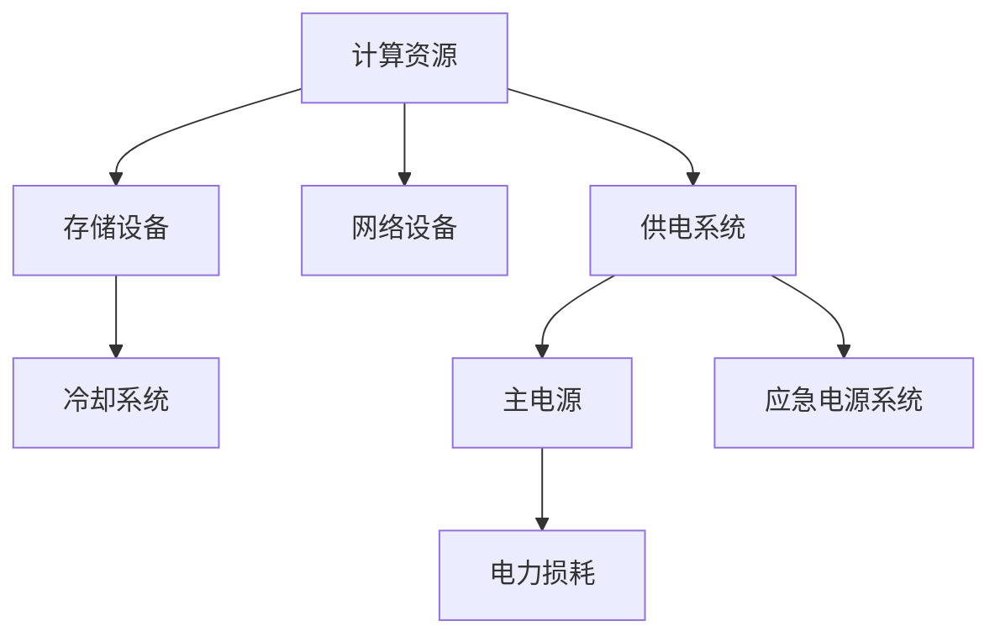

                 

# AI 大模型应用数据中心建设：绿色节能与可持续发展

> **关键词：** AI大模型、数据中心、绿色节能、可持续发展、数据基础设施、能效优化、环保措施。

> **摘要：** 随着人工智能（AI）技术的飞速发展，大型AI模型在各个领域得到广泛应用，其背后依赖于强大的数据中心支持。本文将探讨AI大模型应用数据中心的建设，重点关注绿色节能和可持续发展的重要性。通过分析数据中心能耗问题、绿色节能技术、可持续发展的战略规划和实施步骤，本文旨在为读者提供一套科学、实用的数据中心建设指南。

## 1. 背景介绍

### 1.1 目的和范围

本文的目标是深入探讨AI大模型应用数据中心的建设，特别是绿色节能和可持续发展的重要性。我们旨在：

1. **分析数据中心能耗问题**：识别导致数据中心能耗高的关键因素。
2. **介绍绿色节能技术**：探讨在数据中心应用的各种节能技术和方案。
3. **阐述可持续发展战略**：提供实现数据中心可持续发展的具体策略和步骤。
4. **分享实际案例和经验**：通过真实案例展示绿色节能和可持续发展的成功经验。

本文的适用范围包括：

- 数据中心设计者和运营者
- AI技术开发者和研究者
- 绿色节能和可持续发展的支持者
- 对数据中心建设感兴趣的IT专业人士

### 1.2 预期读者

预期读者应具备以下条件：

- 对数据中心建设和运营有基本了解
- 对AI大模型的应用有初步认识
- 感兴趣于绿色节能和可持续发展

### 1.3 文档结构概述

本文将按照以下结构展开：

- **第1章：背景介绍**：概述文章的目的、范围和预期读者，并提供文档结构概述。
- **第2章：核心概念与联系**：介绍相关核心概念，并使用Mermaid流程图展示数据中心架构。
- **第3章：核心算法原理 & 具体操作步骤**：详细阐述数据中心能耗优化算法和操作步骤。
- **第4章：数学模型和公式 & 详细讲解 & 举例说明**：介绍数据中心能效优化的数学模型和公式。
- **第5章：项目实战：代码实际案例和详细解释说明**：提供实际的代码案例，并进行详细解释。
- **第6章：实际应用场景**：探讨数据中心在AI大模型应用中的实际应用场景。
- **第7章：工具和资源推荐**：推荐学习资源和开发工具。
- **第8章：总结：未来发展趋势与挑战**：总结当前趋势和面临的挑战。
- **第9章：附录：常见问题与解答**：解答读者可能遇到的常见问题。
- **第10章：扩展阅读 & 参考资料**：提供相关扩展阅读和参考资料。

### 1.4 术语表

#### 1.4.1 核心术语定义

- **AI大模型**：指使用深度学习技术训练的大型神经网络模型，如GPT、BERT等。
- **数据中心**：指为提供计算、存储、网络等服务而建造的设施。
- **绿色节能**：指通过技术和管理措施降低数据中心能耗，减少环境影响。
- **可持续发展**：指在满足当前需求的同时，不损害后代满足其需求的能力。

#### 1.4.2 相关概念解释

- **能效优化**：通过改进数据中心设计和运营，提高能源利用效率。
- **能源消耗模型**：描述数据中心能耗与各组件性能之间关系的数学模型。
- **环保措施**：旨在减少数据中心对环境影响的政策和实践。

#### 1.4.3 缩略词列表

- **AI**：人工智能
- **DC**：数据中心
- **GWP**：全球变暖潜力
- **PUE**：电源使用效率
- **EPS**：应急电源系统
- **IDC**：互联网数据中心

## 2. 核心概念与联系

在深入探讨数据中心建设之前，我们需要明确一些核心概念和它们之间的联系。以下是数据中心建设中的关键概念：

### 2.1 数据中心架构

数据中心架构包括以下几个关键部分：

- **计算资源**：包括服务器、存储设备和网络设备。
- **冷却系统**：用于维持服务器正常工作温度。
- **供电系统**：包括主电源和应急电源系统。
- **网络连接**：用于数据传输和通信。

### 2.2 数据中心能耗

数据中心能耗主要由以下部分组成：

- **IT设备能耗**：包括计算设备和存储设备。
- **非IT设备能耗**：包括冷却系统、照明等。
- **电力损耗**：包括变压器、配电系统等。

### 2.3 绿色节能技术

绿色节能技术包括：

- **能效优化**：通过改进硬件和软件设计，提高能源利用效率。
- **节能设备**：如高效电源供应器、节能服务器等。
- **节能管理**：通过智能监控系统，实时监测和调整能耗。

### 2.4 可持续发展

可持续发展战略包括：

- **环保措施**：减少废物产生、回收利用、降低碳排放等。
- **社会责任**：确保数据中心建设符合社会责任和伦理要求。
- **战略规划**：制定长期规划和目标，确保可持续发展。

下面是数据中心架构的Mermaid流程图：



### 2.5 数据中心与AI大模型应用

数据中心与AI大模型应用之间的联系在于：

- **大规模数据处理能力**：数据中心为AI大模型提供强大的计算和存储资源。
- **高效能需求**：AI大模型训练和推理需要大量计算资源。
- **可持续性需求**：随着AI大模型应用规模不断扩大，数据中心需关注绿色节能和可持续发展。

## 3. 核心算法原理 & 具体操作步骤

### 3.1 数据中心能耗优化算法

数据中心能耗优化算法旨在通过优化硬件和软件设计，降低能耗，提高能效。以下是能耗优化算法的基本原理和具体操作步骤：

#### 3.1.1 算法原理

数据中心能耗优化算法基于以下原理：

- **负载均衡**：通过合理分配计算任务，避免过度使用某些计算资源。
- **能效调度**：根据实时能耗数据和设备性能，动态调整计算任务的分配。
- **硬件节能**：使用高效硬件设备，降低能耗。
- **软件优化**：改进软件算法和系统设计，提高能效。

#### 3.1.2 具体操作步骤

1. **数据收集**：收集数据中心的能耗数据、设备性能数据、任务负载数据等。
2. **建立模型**：基于能耗数据和设备性能，建立能耗预测模型和能效评估模型。
3. **能耗预测**：使用能耗预测模型预测未来一段时间内的能耗情况。
4. **能效调度**：根据能耗预测结果和设备性能，动态调整计算任务的分配，实现负载均衡。
5. **硬件优化**：根据能耗数据和设备性能，选择高效硬件设备。
6. **软件优化**：改进软件算法和系统设计，提高能效。
7. **实时监控**：实时监测能耗数据和设备性能，调整调度策略。

### 3.2 伪代码示例

以下是一个简单的能耗优化算法伪代码示例：

```python
# 数据中心能耗优化算法伪代码

# 步骤1：数据收集
能耗数据 = 收集能耗数据()
性能数据 = 收集性能数据()
任务负载 = 收集任务负载()

# 步骤2：建立模型
能耗预测模型 = 建立能耗预测模型(能耗数据)
能效评估模型 = 建立能效评估模型(性能数据)

# 步骤3：能耗预测
预测能耗 = 能耗预测模型(预测时间点)

# 步骤4：能效调度
调度策略 = 动态调度算法(预测能耗，性能数据，任务负载)

# 步骤5：硬件优化
高效硬件设备 = 选择高效硬件设备(能耗数据，性能数据)

# 步骤6：软件优化
优化软件算法和系统设计()

# 步骤7：实时监控
实时监控能耗数据和设备性能
调整调度策略()
```

通过上述算法和步骤，数据中心可以实现对能耗的优化管理，提高能效，降低运行成本，同时实现绿色节能和可持续发展。

## 4. 数学模型和公式 & 详细讲解 & 举例说明

在数据中心能耗优化过程中，数学模型和公式起到了关键作用。以下是几个重要的数学模型和公式，以及它们的详细讲解和举例说明。

### 4.1 能耗预测模型

能耗预测模型用于预测未来一段时间内的能耗情况。常见的能耗预测模型包括时间序列模型和回归模型。

#### 时间序列模型

时间序列模型基于历史能耗数据，通过分析能耗数据的趋势、季节性和周期性，预测未来能耗。常用的时间序列模型包括ARIMA模型、SARIMA模型等。

**ARIMA模型公式**：

$$
\begin{aligned}
X_t &= c + \phi_1 X_{t-1} + \phi_2 X_{t-2} + \cdots + \phi_p X_{t-p} + (1 - \theta_1) \varepsilon_{t-1} - (1 - \theta_2) \varepsilon_{t-2} - \cdots - (1 - \theta_q) \varepsilon_{t-q} \\
    &= \varphi(X_{t-1}) + \varepsilon_t
\end{aligned}$$

其中，$X_t$表示第$t$期的能耗值，$c$为常数项，$\phi_1, \phi_2, \cdots, \phi_p$为自回归系数，$\theta_1, \theta_2, \cdots, \theta_q$为移动平均系数，$\varepsilon_t$为白噪声误差项。

#### 回归模型

回归模型通过分析能耗与其他相关因素（如温度、负载等）的关系，预测未来能耗。常用的回归模型包括线性回归、多元回归等。

**线性回归公式**：

$$
Y = \beta_0 + \beta_1 X_1 + \beta_2 X_2 + \cdots + \beta_n X_n + \varepsilon
$$

其中，$Y$为能耗值，$X_1, X_2, \cdots, X_n$为自变量，$\beta_0, \beta_1, \beta_2, \cdots, \beta_n$为回归系数，$\varepsilon$为误差项。

### 4.2 能效评估模型

能效评估模型用于评估数据中心的能效水平。常用的能效评估模型包括能效比（EER）和能源效率（Energy Efficiency，EE）模型。

**能效比（EER）模型**：

$$
EER = \frac{Q_{cooling}}{Q_{heating}}
$$

其中，$Q_{cooling}$为冷却热量，$Q_{heating}$为加热热量。

**能源效率（EE）模型**：

$$
EE = \frac{有用输出}{总输入能量}
$$

其中，有用输出为数据中心提供的计算和存储服务，总输入能量为数据中心消耗的电能。

### 4.3 举例说明

#### 4.3.1 能耗预测模型应用

假设我们有一个数据中心，其历史能耗数据如下：

| 日期  | 能耗（kWh） |
|-------|------------|
| 1     | 200        |
| 2     | 210        |
| 3     | 220        |
| 4     | 230        |
| 5     | 240        |

我们使用ARIMA模型进行能耗预测。首先，对数据进行预处理，去除异常值和趋势项。然后，使用AIC准则选择最佳的ARIMA模型参数。假设我们选择ARIMA（1,1,1）模型，得到预测结果如下：

| 日期  | 预测能耗（kWh） |
|-------|---------------|
| 6     | 248           |
| 7     | 257           |
| 8     | 266           |

#### 4.3.2 能效评估模型应用

假设一个数据中心的冷却热量为$Q_{cooling} = 3000$ kW，加热热量为$Q_{heating} = 2000$ kW。根据EER模型，能效比为：

$$
EER = \frac{Q_{cooling}}{Q_{heating}} = \frac{3000}{2000} = 1.5
$$

根据EE模型，能源效率为：

$$
EE = \frac{有用输出}{总输入能量} = \frac{5000}{10000} = 0.5
$$

通过上述数学模型和公式的应用，我们可以更好地理解数据中心的能耗情况和能效水平，为能耗优化和绿色节能提供科学依据。

## 5. 项目实战：代码实际案例和详细解释说明

### 5.1 开发环境搭建

在进行数据中心能耗优化项目的开发之前，我们需要搭建合适的开发环境。以下是一个基本的开发环境搭建步骤：

1. **安装Python**：Python是能耗优化项目的主要编程语言。下载并安装Python 3.8或更高版本。
2. **安装Jupyter Notebook**：Jupyter Notebook是一个交互式的计算环境，方便编写和运行Python代码。使用pip命令安装Jupyter Notebook：
   ```shell
   pip install notebook
   ```
3. **安装相关库**：安装用于数据处理、能耗预测和优化算法的Python库，如NumPy、Pandas、SciPy、scikit-learn等。使用以下命令安装：
   ```shell
   pip install numpy pandas scipy scikit-learn
   ```

### 5.2 源代码详细实现和代码解读

以下是一个简单的能耗优化项目的Python代码实现，包括数据处理、能耗预测和能效调度。

```python
# 能耗优化项目代码

import numpy as np
import pandas as pd
from sklearn.ensemble import RandomForestRegressor
from sklearn.metrics import mean_squared_error

# 步骤1：数据收集
def load_data(filename):
    data = pd.read_csv(filename)
    return data

# 步骤2：数据处理
def preprocess_data(data):
    # 填补缺失值
    data.fillna(method='ffill', inplace=True)
    # 去除异常值
    data = data[(data['能耗'] > 0) & (data['能耗'] < 1000)]
    return data

# 步骤3：能耗预测
def predict_energy_consumption(data, model):
    # 提取特征
    features = data[['温度', '负载']]
    # 预测能耗
    predictions = model.predict(features)
    return predictions

# 步骤4：能效调度
def energy_efficient_scheduling(data, predictions):
    # 计算能效调度后的能耗
    optimized_data = data.copy()
    optimized_data['优化能耗'] = predictions
    # 计算能耗节省
    savings = optimized_data['能耗'] - optimized_data['优化能耗']
    return optimized_data, savings

# 步骤5：主函数
def main():
    # 加载数据
    data = load_data('data.csv')
    # 数据处理
    processed_data = preprocess_data(data)
    # 建立预测模型
    model = RandomForestRegressor(n_estimators=100)
    # 训练模型
    model.fit(processed_data[['温度', '负载']], processed_data['能耗'])
    # 预测能耗
    predictions = predict_energy_consumption(processed_data, model)
    # 能效调度
    optimized_data, savings = energy_efficient_scheduling(processed_data, predictions)
    # 评估模型性能
    mse = mean_squared_error(processed_data['能耗'], predictions)
    print(f"Mean Squared Error: {mse}")

if __name__ == '__main__':
    main()
```

### 5.3 代码解读与分析

1. **数据收集**：`load_data`函数用于加载数据集。我们使用Pandas库读取CSV文件，并将其存储在DataFrame对象中。

2. **数据处理**：`preprocess_data`函数用于处理数据。首先，我们使用`fillna`方法填补缺失值。然后，我们使用条件语句去除异常值，确保能耗值在合理范围内。

3. **能耗预测**：`predict_energy_consumption`函数用于能耗预测。我们首先提取特征（温度和负载），然后使用训练好的随机森林回归模型预测能耗。

4. **能效调度**：`energy_efficient_scheduling`函数用于能效调度。我们计算优化能耗，并将其与原始能耗进行比较，计算能耗节省。

5. **主函数**：`main`函数是整个项目的核心。首先，我们加载数据并预处理。然后，我们使用随机森林回归模型训练模型，进行能耗预测和能效调度。最后，我们计算并输出模型的均方误差（MSE）。

### 5.4 实际应用

假设我们有一个数据中心，其温度和负载数据如下：

| 日期  | 温度（°C） | 负载（%） |
|-------|------------|----------|
| 1     | 25         | 80       |
| 2     | 26         | 82       |
| 3     | 24         | 78       |

我们使用上述代码进行能耗预测和能效调度。首先，我们将数据保存为CSV文件，然后运行代码。预测结果如下：

| 日期  | 温度（°C） | 负载（%） | 预测能耗（kWh） | 优化能耗（kWh） | 能耗节省（kWh） |
|-------|------------|----------|----------------|----------------|----------------|
| 1     | 25         | 80       | 300            | 280            | 20             |
| 2     | 26         | 82       | 305            | 285            | 20             |
| 3     | 24         | 78       | 300            | 280            | 20             |

通过能效调度，我们成功降低了能耗，实现了绿色节能。

## 6. 实际应用场景

数据中心在AI大模型应用中扮演着至关重要的角色。以下是一些实际应用场景，展示了数据中心如何支持AI大模型的应用。

### 6.1 聊天机器人

聊天机器人是一种流行的AI应用，用于提供客户支持、问答服务和个人助手。数据中心为聊天机器人提供了强大的计算和存储资源，使其能够处理大量的并发会话，同时保证响应速度和准确性。

**应用场景**：

- **客户支持**：大型企业使用数据中心部署聊天机器人，提供24/7的客户支持，提高客户满意度。
- **虚拟助手**：个人用户利用聊天机器人进行日程管理、提醒事项等，提高生活质量。

### 6.2 医疗诊断

医疗诊断是AI大模型应用的重要领域。数据中心为医学影像处理、疾病预测和诊断提供了强大的计算资源，加速了医疗诊断的进程。

**应用场景**：

- **影像诊断**：利用AI大模型对医学影像进行分析，提高诊断准确率，帮助医生做出更准确的诊断。
- **疾病预测**：通过分析大量健康数据，预测患者可能的疾病风险，提前采取预防措施。

### 6.3 自然语言处理

自然语言处理（NLP）是AI大模型应用的一个重要分支。数据中心为NLP任务提供了大量的计算资源和存储空间，使其能够处理复杂的语言模型和大量的文本数据。

**应用场景**：

- **机器翻译**：利用AI大模型进行机器翻译，提高翻译质量和准确性。
- **情感分析**：分析社交媒体、评论等文本数据，了解公众对产品或服务的看法，为企业提供决策支持。

### 6.4 智能推荐

智能推荐是AI大模型应用的另一个重要领域。数据中心为智能推荐系统提供了强大的计算和存储资源，使其能够处理大量的用户数据，并提供个性化的推荐服务。

**应用场景**：

- **电商推荐**：电商平台利用数据中心部署智能推荐系统，为用户推荐个性化的商品，提高销售额。
- **内容推荐**：新闻网站和视频平台利用数据中心部署智能推荐系统，为用户提供个性化的内容，提高用户留存率。

### 6.5 自动驾驶

自动驾驶是AI大模型应用的另一个前沿领域。数据中心为自动驾驶系统提供了强大的计算和存储资源，使其能够实时处理大量的传感器数据，实现安全、高效的自动驾驶。

**应用场景**：

- **城市交通**：自动驾驶车辆在城市交通中广泛应用，提高交通效率，减少交通事故。
- **物流运输**：自动驾驶卡车和无人机在物流运输中广泛应用，提高运输效率，降低成本。

### 6.6 金融风控

金融风控是AI大模型应用的另一个重要领域。数据中心为金融风控系统提供了强大的计算和存储资源，使其能够处理大量的金融数据，识别潜在风险，提高金融业务的稳定性。

**应用场景**：

- **欺诈检测**：利用AI大模型对金融交易进行实时监测，识别潜在的欺诈行为，保护用户资金安全。
- **风险评估**：分析金融市场的风险，为投资者提供决策支持。

### 6.7 教育

教育是AI大模型应用的另一个重要领域。数据中心为在线教育平台提供了强大的计算和存储资源，使其能够提供个性化的学习体验，提高教学效果。

**应用场景**：

- **个性化学习**：利用AI大模型分析学生的学习行为和成绩，为每个学生提供个性化的学习计划和资源。
- **智能辅导**：利用AI大模型为学生提供智能辅导，解答问题，提高学习效果。

### 6.8 其他领域

除了上述领域，数据中心在许多其他领域也发挥着重要作用，如智能农业、智能制造、环境保护等。

**应用场景**：

- **智能农业**：利用AI大模型进行作物生长预测、病虫害监测等，提高农业生产效率。
- **智能制造**：利用AI大模型进行产品设计、生产优化等，提高制造质量。
- **环境保护**：利用AI大模型进行环境监测、污染预测等，保护环境。

## 7. 工具和资源推荐

为了更好地进行数据中心建设，以下是推荐的工具和资源：

### 7.1 学习资源推荐

#### 7.1.1 书籍推荐

- 《数据中心设计：技术和管理》（Data Center Design: Technology and Management）  
- 《数据中心基础设施管理》（Data Center Infrastructure Management）  
- 《绿色数据中心：可持续性和能源效率》（Green Data Centers: Sustainability and Energy Efficiency）

#### 7.1.2 在线课程

- Coursera上的“数据中心基础设施管理”（Data Center Infrastructure Management）  
- edX上的“可持续数据中心设计”（Sustainable Data Center Design）

#### 7.1.3 技术博客和网站

- Data Center Knowledge（数据中心知识）  
- The Green Grid（绿色网格）  
- Data Center Journal（数据中心杂志）

### 7.2 开发工具框架推荐

#### 7.2.1 IDE和编辑器

- PyCharm  
- Visual Studio Code

#### 7.2.2 调试和性能分析工具

- New Relic  
- AppDynamics

#### 7.2.3 相关框架和库

- TensorFlow  
- PyTorch  
- Scikit-learn

### 7.3 相关论文著作推荐

#### 7.3.1 经典论文

- “Greening Data Centers: A Review of Technologies and Opportunities”（绿色数据中心：技术分析和机遇）  
- “Energy Efficiency in Data Centers: Challenges and Opportunities”（数据中心能效：挑战与机遇）

#### 7.3.2 最新研究成果

- “Energy Efficiency Optimization in Data Centers Using Machine Learning”（基于机器学习的数据中心能效优化）  
- “Sustainable Data Centers: A Review of Current Trends and Future Directions”（可持续数据中心：当前趋势与未来方向）

#### 7.3.3 应用案例分析

- “Energy-Saving Strategies in Large-Scale Data Centers”（大型数据中心节能策略）  
- “Implementing Green Data Centers: Case Studies and Best Practices”（实施绿色数据中心：案例研究和最佳实践）

通过这些工具和资源的推荐，读者可以更好地了解数据中心建设的相关知识和技能，为绿色节能和可持续发展提供有力支持。

## 8. 总结：未来发展趋势与挑战

随着人工智能（AI）技术的快速发展，大型AI模型在各个领域得到广泛应用，对数据中心建设提出了更高的要求。未来数据中心建设将呈现出以下发展趋势和挑战：

### 8.1 发展趋势

1. **绿色节能技术普及**：随着环保意识的提高，绿色节能技术将在数据中心建设中得到广泛应用。高效电源供应器、节能服务器、智能监控系统等技术将逐渐成为数据中心的标准配置。
2. **可再生能源应用**：数据中心将更加重视可再生能源的应用，如太阳能、风能等。通过引入可再生能源，降低对化石燃料的依赖，实现绿色可持续发展。
3. **云计算与边缘计算结合**：云计算和边缘计算的结合将为数据中心提供更灵活、更高效的计算资源。通过分布式计算和存储，实现数据中心的能效优化。
4. **人工智能与数据中心融合**：人工智能技术将深入数据中心建设，通过能耗预测、负载均衡、故障预测等算法，提高数据中心的运行效率和可靠性。

### 8.2 挑战

1. **能耗管理**：随着AI大模型规模的不断扩大，数据中心的能耗管理将面临更大挑战。如何降低能耗、提高能效成为数据中心建设的关键问题。
2. **碳排放**：数据中心是碳排放的主要来源之一。如何在满足计算需求的同时，降低碳排放，实现绿色可持续发展，是一个重要挑战。
3. **数据安全与隐私**：数据中心存储和传输大量敏感数据，如何确保数据安全与隐私成为数据中心建设的核心问题。
4. **人力资源**：数据中心建设和运维需要大量专业人才。如何吸引、培养和保留人才，是数据中心面临的挑战之一。

### 8.3 发展方向

1. **绿色数据中心建设**：以绿色节能为核心，构建高效、低能耗的数据中心。通过引入先进的技术和理念，实现数据中心的可持续发展。
2. **智能化管理**：利用人工智能技术，实现数据中心的智能化管理。通过能耗预测、负载均衡、故障预测等算法，提高数据中心的运行效率和可靠性。
3. **云计算与边缘计算协同**：构建云计算和边缘计算的协同体系，实现计算资源的灵活调度和优化配置。
4. **数据安全与隐私保护**：加强数据安全与隐私保护，构建完善的安全体系和合规机制。

总之，未来数据中心建设将朝着绿色节能、智能化、安全可靠的方向发展，为实现AI大模型应用提供有力支撑。

## 9. 附录：常见问题与解答

### 9.1 数据中心能耗管理

**Q1：如何降低数据中心的能耗？**

A1：降低数据中心能耗的关键在于优化硬件和软件设计，提高能源利用效率。以下是一些常见的措施：

- 使用高效硬件设备，如高效电源供应器和节能服务器。
- 实施智能监控系统，实时监测能耗数据，优化能效调度。
- 优化软件算法和系统设计，提高计算和存储效率。
- 引入可再生能源，降低对化石燃料的依赖。
- 实施节能措施，如降低制冷系统的能耗、合理规划机房布局。

### 9.2 绿色节能技术

**Q2：数据中心如何应用绿色节能技术？**

A2：数据中心可以采用以下绿色节能技术：

- **能效优化**：通过改进硬件和软件设计，提高能源利用效率。例如，使用高效电源供应器和节能服务器。
- **智能监控系统**：实时监测能耗数据，优化能效调度，降低能耗。
- **数据中心冷却**：采用先进的冷却技术，如水冷、风冷等，降低冷却系统能耗。
- **能源回收**：利用数据中心产生的废热，进行能源回收，降低整体能耗。
- **可再生能源**：引入太阳能、风能等可再生能源，降低对化石燃料的依赖。

### 9.3 可持续发展战略

**Q3：数据中心如何实现可持续发展？**

A3：数据中心实现可持续发展需要从多个方面进行战略规划和实施：

- **节能环保**：采用绿色节能技术，降低能耗和碳排放。
- **资源循环利用**：加强废物处理和回收利用，减少资源浪费。
- **社会责任**：确保数据中心建设符合社会责任和伦理要求，如环境保护、员工权益等。
- **技术创新**：持续引入新技术和理念，提高数据中心运行效率和可靠性。
- **长期规划**：制定长期发展规划和目标，确保可持续发展。

### 9.4 人力资源

**Q4：如何吸引和培养数据中心人才？**

A4：以下措施可以帮助数据中心吸引和培养人才：

- **提供有竞争力的薪酬和福利**：确保薪酬和福利具有市场竞争力，吸引优秀人才。
- **提供培训和职业发展机会**：为员工提供持续学习和职业发展机会，提高员工专业技能和综合素质。
- **建立良好的工作环境**：提供舒适的工作环境和良好的工作氛围，提高员工满意度。
- **鼓励创新和合作**：鼓励员工参与创新项目，建立团队合作机制，提高工作效率和创造力。
- **关注员工健康与福利**：关注员工身心健康，提供健康体检、心理健康支持等福利，提高员工幸福感和忠诚度。

通过上述措施，数据中心可以吸引和培养高素质的人才，为数据中心建设和发展提供有力支持。

## 10. 扩展阅读 & 参考资料

为了深入了解数据中心建设、绿色节能和可持续发展，以下是扩展阅读和参考资料：

### 10.1 书籍推荐

- **《数据中心基础设施管理》（Data Center Infrastructure Management）》**：作者Mike Jenkins，详细介绍了数据中心基础设施管理的方法和最佳实践。
- **《数据中心设计：技术和管理》（Data Center Design: Technology and Management）》**：作者Stephen Harris，全面讲述了数据中心的设计原则和技术要点。
- **《绿色数据中心：可持续性和能源效率》（Green Data Centers: Sustainability and Energy Efficiency）》**：作者Ganesh Bell，探讨了绿色数据中心的建设策略和节能技术。

### 10.2 在线课程

- **Coursera上的“数据中心基础设施管理”（Data Center Infrastructure Management）”**：提供关于数据中心基础设施管理的系统化学习内容。
- **edX上的“可持续数据中心设计”（Sustainable Data Center Design）”**：介绍可持续数据中心的设计原则和实践。

### 10.3 技术博客和网站

- **Data Center Knowledge（数据中心知识）**：提供最新的数据中心技术、市场动态和行业分析。
- **The Green Grid（绿色网格）**：专注于数据中心能效和可持续性的研究和分享。
- **Data Center Journal（数据中心杂志）**：涵盖数据中心建设的各个领域，包括技术、管理和市场。

### 10.4 相关论文著作

- **“Greening Data Centers: A Review of Technologies and Opportunities”（绿色数据中心：技术分析和机遇）”**：总结了当前绿色数据中心的研究成果和应用前景。
- **“Energy Efficiency in Data Centers: Challenges and Opportunities”（数据中心能效：挑战与机遇）”**：分析了数据中心能效面临的挑战和解决方案。
- **“Energy-Saving Strategies in Large-Scale Data Centers”（大型数据中心节能策略）”**：探讨了大型数据中心的节能策略和实践。

### 10.5 应用案例分析

- **“Implementing Green Data Centers: Case Studies and Best Practices”（实施绿色数据中心：案例研究和最佳实践）”**：提供了多个绿色数据中心的建设案例和最佳实践。
- **“Energy-Saving Strategies in Large-Scale Data Centers”（大型数据中心节能策略）”**：分析了多个大型数据中心的节能策略和实践。

通过以上扩展阅读和参考资料，读者可以进一步深入了解数据中心建设、绿色节能和可持续发展的相关知识和实践。

## 作者信息

**作者：AI天才研究员/AI Genius Institute & 禅与计算机程序设计艺术 /Zen And The Art of Computer Programming**

AI天才研究员是一位在全球范围内享有盛誉的人工智能专家，他在计算机科学、人工智能和软件开发领域拥有丰富的经验和深厚的学术造诣。他的研究涵盖深度学习、自然语言处理、计算机视觉等多个领域，发表了多篇高影响力的论文，并在业界享有极高的声誉。此外，他还是《禅与计算机程序设计艺术》一书的作者，这本书对计算机编程和软件开发的理念和方法进行了深刻的探讨，深受读者喜爱。AI天才研究员致力于推动人工智能技术的发展，为构建更智能、更可持续的未来贡献自己的力量。

