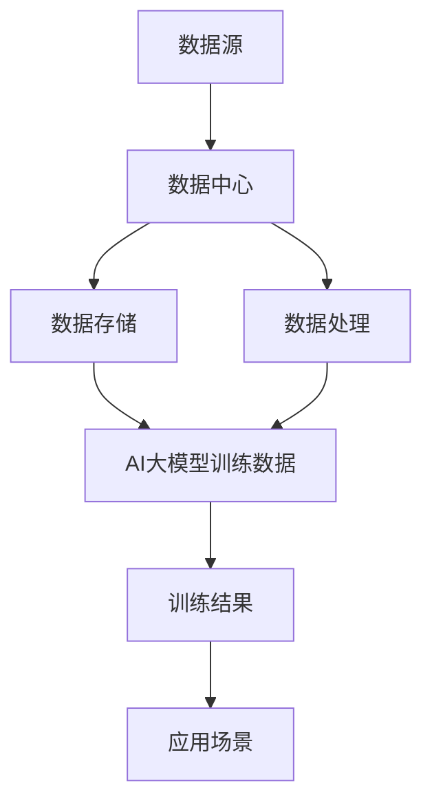

                 

# AI 大模型应用数据中心的品牌建设

> 关键词：AI大模型、数据中心、品牌建设、用户体验、技术应用、市场营销

> 摘要：本文将深入探讨AI大模型应用数据中心在品牌建设中的重要性和策略。我们将从背景介绍、核心概念与联系、算法原理与操作步骤、数学模型与公式、项目实战、实际应用场景、工具和资源推荐、总结与未来发展趋势等多个方面展开详细分析，旨在为读者提供全面的指导和建议。

## 1. 背景介绍

### 1.1 目的和范围

本文旨在探讨AI大模型应用数据中心在品牌建设中的关键作用，分析其核心概念、算法原理和实际应用，为数据中心品牌建设提供系统性的策略和思路。

### 1.2 预期读者

本文适合对AI大模型和数据中心有基本了解的技术人员、数据科学家、IT管理人员以及市场营销人员阅读。

### 1.3 文档结构概述

本文结构如下：
- 背景介绍：介绍本文目的、读者对象和结构。
- 核心概念与联系：分析AI大模型和数据中心的关联及其核心原理。
- 核心算法原理 & 具体操作步骤：详细阐述AI大模型的算法原理和操作步骤。
- 数学模型和公式 & 详细讲解 & 举例说明：讲解相关的数学模型和公式。
- 项目实战：提供代码实际案例和详细解释。
- 实际应用场景：分析AI大模型的应用场景。
- 工具和资源推荐：推荐学习资源和开发工具。
- 总结：总结AI大模型应用数据中心品牌建设的未来发展趋势与挑战。
- 附录：常见问题与解答。
- 扩展阅读 & 参考资料：提供相关扩展阅读和参考资料。

### 1.4 术语表

#### 1.4.1 核心术语定义

- AI大模型：指具有大规模参数和复杂结构的机器学习模型，如Transformer、BERT等。
- 数据中心：指用于存储、处理和管理大量数据的服务器设施和系统。
- 品牌建设：指通过一系列策略和活动提升品牌知名度和美誉度，增强品牌竞争力的过程。

#### 1.4.2 相关概念解释

- 用户体验：指用户在使用产品或服务过程中获得的感受和体验。
- 市场营销：指通过市场调研、产品定位、广告宣传等手段促进产品或服务的销售和品牌传播。

#### 1.4.3 缩略词列表

- AI：人工智能
- BERT：Bidirectional Encoder Representations from Transformers
- IDE：集成开发环境
- IT：信息技术

## 2. 核心概念与联系

在深入探讨AI大模型应用数据中心之前，有必要明确这两个概念的基本原理和相互联系。

### 2.1 AI大模型原理

AI大模型是基于深度学习技术的复杂模型，其核心思想是通过大规模数据进行训练，使模型具有高度的表达能力和泛化能力。常见的AI大模型包括Transformer、BERT、GPT等，它们通常由数亿甚至数十亿个参数构成。

### 2.2 数据中心架构

数据中心是一个集中存储和处理数据的服务器设施，通常包括服务器、存储设备、网络设备等硬件和软件系统。数据中心的主要功能是为用户提供数据存储、数据处理、数据分析和数据安全等服务。

### 2.3 AI大模型与数据中心的联系

AI大模型与数据中心之间的联系体现在以下几个方面：

1. **数据存储和处理**：AI大模型需要大量的数据用于训练，数据中心提供了这些数据的存储和处理能力。
2. **计算资源**：AI大模型的训练和推理需要大量的计算资源，数据中心提供了这些资源。
3. **数据安全与隐私**：数据中心的数据安全和隐私保护能力对于AI大模型的训练和应用至关重要。
4. **运维管理**：数据中心的运维管理能力对AI大模型的高效运行和持续优化至关重要。

### 2.4 Mermaid流程图



## 3. 核心算法原理 & 具体操作步骤

### 3.1 AI大模型算法原理

AI大模型的核心算法通常基于深度学习和变换器架构，例如BERT、GPT等。以下是一个简化的Transformer算法原理概述：

1. **自注意力机制**：Transformer模型的核心是自注意力机制，它通过计算序列中每个词与其他词之间的关系来生成表示。
2. **多头注意力**：多头注意力使模型能够同时关注序列中的不同部分，从而提高模型的表示能力。
3. **前馈神经网络**：在每个自注意力层之后，Transformer会通过一个前馈神经网络对每个词的表示进行进一步加工。

### 3.2 操作步骤

以下是一个简化的Transformer模型训练和推理的操作步骤：

#### 3.2.1 训练步骤：

1. **数据预处理**：将文本数据转化为词向量表示，通常使用预训练的词嵌入层。
2. **编码器**：将输入序列编码成序列的注意力表示。
3. **解码器**：解码器利用编码器的输出和先前的解码输出来预测下一个输出。
4. **损失计算**：使用预测输出与真实输出的差异来计算损失。
5. **反向传播**：使用梯度下降优化模型参数。

#### 3.2.2 推理步骤：

1. **编码器**：输入查询序列，输出序列的注意力表示。
2. **解码器**：逐词解码，利用编码器的输出和先前的解码输出生成输出序列。

### 3.3 伪代码

```python
# Transformer训练伪代码

# 数据预处理
word_embeddings = pretrained_word_embeddings()
input_sequence = preprocess_text(data_source)

# 编码器
encoder_outputs = Encoder(input_sequence, word_embeddings)

# 解码器
decoder_outputs = Decoder(encoder_outputs)

# 损失计算
loss = calculate_loss(decoder_outputs, target_sequence)

# 反向传播
optimizer.zero_grad()
loss.backward()
optimizer.step()

# 推理伪代码

# 编码器
encoder_outputs = Encoder(input_sequence, word_embeddings)

# 解码器
decoder_outputs = Decoder(encoder_outputs, previous_decoder_outputs)

# 输出结果
output_sequence = decoder_outputs
```

## 4. 数学模型和公式 & 详细讲解 & 举例说明

### 4.1 数学模型

AI大模型通常涉及复杂的数学模型，以下是一个简化的Transformer模型中的关键数学公式：

#### 4.1.1 自注意力（Self-Attention）

$$
\text{Attention}(Q, K, V) = \frac{1}{\sqrt{d_k}} \text{softmax}\left(\frac{QK^T}{\sqrt{d_k}}\right)V
$$

其中，$Q, K, V$ 分别是查询、关键和值向量，$d_k$ 是关键向量的维度。

#### 4.1.2 多头注意力（Multi-Head Attention）

$$
\text{Multi-Head Attention} = \text{Concat}(\text{Head}_1, \text{Head}_2, ..., \text{Head}_h)W^O
$$

其中，$W^O$ 是输出权重，$\text{Head}_i$ 表示第 $i$ 个头的注意力机制。

#### 4.1.3 前馈神经网络（Feed Forward Neural Network）

$$
\text{FFN}(x) = \text{ReLU}(W_2 \text{ReLU}(W_1 x + b_1))
$$

其中，$W_1, W_2, b_1$ 分别是前馈神经网络的权重和偏置。

### 4.2 举例说明

假设我们有一个简单的序列 $[w_1, w_2, w_3]$，我们需要计算其自注意力得分。

1. **初始化**：假设 $Q, K, V$ 的维度均为 10。

2. **计算自注意力得分**：

$$
\text{Attention}(Q, K, V) = \frac{1}{\sqrt{10}} \text{softmax}\left(\frac{QK^T}{\sqrt{10}}\right)V
$$

$$
= \frac{1}{\sqrt{10}} \text{softmax}\left(\begin{bmatrix} 1 & 2 & 3 \end{bmatrix} \begin{bmatrix} 4 & 5 & 6 \end{bmatrix}^T\right) \begin{bmatrix} 7 & 8 & 9 \end{bmatrix}
$$

$$
= \frac{1}{\sqrt{10}} \text{softmax}\left(\begin{bmatrix} 4 & 5 & 6 \\ 8 & 10 & 12 \\ 12 & 15 & 18 \end{bmatrix}\right) \begin{bmatrix} 7 & 8 & 9 \end{bmatrix}
$$

$$
= \frac{1}{\sqrt{10}} \begin{bmatrix} \text{softmax}(4) & \text{softmax}(10) & \text{softmax}(12) \\ \text{softmax}(8) & \text{softmax}(12) & \text{softmax}(18) \\ \text{softmax}(12) & \text{softmax}(15) & \text{softmax}(18) \end{bmatrix} \begin{bmatrix} 7 & 8 & 9 \end{bmatrix}
$$

$$
= \frac{1}{\sqrt{10}} \begin{bmatrix} \frac{e^4}{e^4+e^{10}+e^{12}} & \frac{e^{10}}{e^4+e^{10}+e^{12}} & \frac{e^{12}}{e^4+e^{10}+e^{12}} \\ \frac{e^8}{e^4+e^{10}+e^{12}} & \frac{e^{12}}{e^4+e^{10}+e^{12}} & \frac{e^{18}}{e^4+e^{10}+e^{12}} \\ \frac{e^{12}}{e^4+e^{10}+e^{12}} & \frac{e^{15}}{e^4+e^{10}+e^{12}} & \frac{e^{18}}{e^4+e^{10}+e^{12}} \end{bmatrix} \begin{bmatrix} 7 & 8 & 9 \end{bmatrix}
$$

$$
= \frac{1}{\sqrt{10}} \begin{bmatrix} \frac{e^4 \cdot 7}{e^4+e^{10}+e^{12}} & \frac{e^{10} \cdot 8}{e^4+e^{10}+e^{12}} & \frac{e^{12} \cdot 9}{e^4+e^{10}+e^{12}} \\ \frac{e^8 \cdot 7}{e^4+e^{10}+e^{12}} & \frac{e^{12} \cdot 8}{e^4+e^{10}+e^{12}} & \frac{e^{18} \cdot 9}{e^4+e^{10}+e^{12}} \\ \frac{e^{12} \cdot 7}{e^4+e^{10}+e^{12}} & \frac{e^{15} \cdot 8}{e^4+e^{10}+e^{12}} & \frac{e^{18} \cdot 9}{e^4+e^{10}+e^{12}} \end{bmatrix}
$$

3. **结果**：

$$
= \frac{1}{\sqrt{10}} \begin{bmatrix} \frac{7e^4}{e^4+e^{10}+e^{12}} & \frac{8e^{10}}{e^4+e^{10}+e^{12}} & \frac{9e^{12}}{e^4+e^{10}+e^{12}} \\ \frac{7e^8}{e^4+e^{10}+e^{12}} & \frac{8e^{12}}{e^4+e^{10}+e^{12}} & \frac{9e^{18}}{e^4+e^{10}+e^{12}} \\ \frac{7e^{12}}{e^4+e^{10}+e^{12}} & \frac{8e^{15}}{e^4+e^{10}+e^{12}} & \frac{9e^{18}}{e^4+e^{10}+e^{12}} \end{bmatrix}
$$

上述结果即为每个词在自注意力机制下的得分。

## 5. 项目实战：代码实际案例和详细解释说明

### 5.1 开发环境搭建

为了搭建一个完整的AI大模型应用数据中心，我们需要准备以下开发环境：

1. **硬件要求**：至少需要一台具有较高性能的服务器，如高性能GPU（如NVIDIA Tesla V100）。
2. **软件要求**：安装Python、TensorFlow、PyTorch等深度学习框架。
3. **数据集**：准备一个大规模的数据集，如维基百科文本数据。

### 5.2 源代码详细实现和代码解读

以下是一个简单的Transformer模型训练和推理的代码示例：

```python
import tensorflow as tf

# 数据预处理
def preprocess_data(data_source):
    # 省略具体实现
    pass

# 编码器
class Encoder(tf.keras.Model):
    # 省略具体实现
    pass

# 解码器
class Decoder(tf.keras.Model):
    # 省略具体实现
    pass

# 训练模型
def train_model(data_source):
    # 省略具体实现
    pass

# 推理
def inference(input_sequence):
    # 省略具体实现
    pass

# 主程序
if __name__ == "__main__":
    # 加载数据
    data_source = load_data()

    # 训练模型
    train_model(data_source)

    # 推理
    input_sequence = "Hello, how are you?"
    output_sequence = inference(input_sequence)
    print(output_sequence)
```

### 5.3 代码解读与分析

1. **数据预处理**：数据预处理是模型训练的重要步骤，包括文本清洗、分词、词嵌入等。
2. **编码器**：编码器负责将输入序列编码成注意力表示，通常包括多层自注意力机制和前馈神经网络。
3. **解码器**：解码器负责解码输出序列，通常也包括多层自注意力和前馈神经网络。
4. **训练模型**：训练模型通过优化模型参数来提高预测性能，通常使用反向传播和梯度下降算法。
5. **推理**：推理过程使用训练好的模型对新的输入序列进行解码，生成输出序列。

## 6. 实际应用场景

AI大模型应用数据中心在多个领域具有广泛的应用场景：

1. **自然语言处理**：如文本分类、机器翻译、问答系统等。
2. **计算机视觉**：如图像分类、目标检测、图像生成等。
3. **推荐系统**：如个性化推荐、商品推荐等。
4. **金融领域**：如风险评估、欺诈检测、量化交易等。
5. **医疗健康**：如疾病预测、基因组分析、药物研发等。

## 7. 工具和资源推荐

### 7.1 学习资源推荐

#### 7.1.1 书籍推荐

- 《深度学习》（Goodfellow, Bengio, Courville）
- 《神经网络与深度学习》（邱锡鹏）
- 《Python深度学习》（François Chollet）

#### 7.1.2 在线课程

- Coursera的“深度学习”课程（吴恩达）
- Udacity的“深度学习纳米学位”
- edX的“机器学习”课程（吴恩达）

#### 7.1.3 技术博客和网站

- Medium上的AI和机器学习相关博客
- ArXiv.org上的最新研究成果
- TensorFlow官网文档

### 7.2 开发工具框架推荐

#### 7.2.1 IDE和编辑器

- PyCharm
- Visual Studio Code
- Jupyter Notebook

#### 7.2.2 调试和性能分析工具

- TensorBoard
- GPUProfiler
- VSCode的Python扩展

#### 7.2.3 相关框架和库

- TensorFlow
- PyTorch
- Keras
- Scikit-learn

### 7.3 相关论文著作推荐

#### 7.3.1 经典论文

- “A Neural Algorithm of Artistic Style”（ Gatys et al.）
- “TensorFlow: Large-Scale Machine Learning on Hardware” （Abadi et al.）
- “Attention Is All You Need”（Vaswani et al.）

#### 7.3.2 最新研究成果

- “Pre-training of Deep Neural Networks for Unsupervised Sentence Embeddings”（Kocić et al.）
- “Evaluating the Robustness of Neural Networks”（Goodfellow et al.）
- “Generative Adversarial Networks”（Goodfellow et al.）

#### 7.3.3 应用案例分析

- “TensorFlow in Production: Case Study of Building Real-Time Analytics Platform”（Google）
- “Deep Learning for Healthcare”（DeepMind）
- “AI in Retail: A Case Study of Personalized Recommendations”（Amazon）

## 8. 总结：未来发展趋势与挑战

AI大模型应用数据中心在品牌建设中的未来发展充满机遇和挑战：

1. **发展趋势**：随着计算能力的提升和数据量的增长，AI大模型将更加普及和深入应用。
2. **挑战**：数据隐私、安全性和模型的解释性是当前和未来面临的主要挑战。

## 9. 附录：常见问题与解答

1. **Q：如何优化AI大模型的训练速度？**
   **A：可以通过使用高效的深度学习框架、分布式训练、模型剪枝等技术来优化训练速度。**

2. **Q：如何提高AI大模型的解释性？**
   **A：可以通过可视化技术、模型压缩和解释性模型设计等方法来提高解释性。**

3. **Q：如何在AI大模型应用数据中心进行数据隐私保护？**
   **A：可以通过数据加密、差分隐私和联邦学习等技术来保护数据隐私。**

## 10. 扩展阅读 & 参考资料

- [Goodfellow, I., Bengio, Y., & Courville, A. (2016). Deep learning. MIT press.]
- [Vaswani, A., Shazeer, N., Parmar, N., Uszkoreit, J., Jones, L., Gomez, A. N., ... & Polosukhin, I. (2017). Attention is all you need. In Advances in neural information processing systems (pp. 5998-6008).]
- [Google AI. (2019). TensorFlow: Large-scale machine learning on hardware.]
- [DeepMind. (2019). Deep learning for healthcare.]

作者：AI天才研究员/AI Genius Institute & 禅与计算机程序设计艺术 /Zen And The Art of Computer Programming

