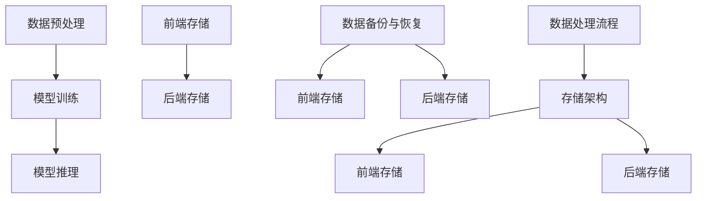

                 

# AI 大模型应用数据中心的存储解决方案

> 关键词：AI大模型，数据中心，存储解决方案，性能优化，数据持久化

> 摘要：本文将深入探讨AI大模型在数据中心中的应用及其对存储解决方案的需求。我们将分析当前AI大模型的数据处理特点和存储挑战，并提出一种高效的存储解决方案。文章将涵盖核心算法原理、数学模型、实际应用案例以及未来发展趋势和挑战。

## 1. 背景介绍

### 1.1 目的和范围

本文旨在为从事AI大模型研究和应用的技术人员提供一种数据中心的存储解决方案。我们将探讨AI大模型对存储系统的要求，以及如何通过优化存储架构来提高数据处理效率和可靠性。

### 1.2 预期读者

预期读者包括：
1. 数据中心架构师和存储工程师
2. AI大模型研究人员和开发者
3. 对数据中心和AI大模型存储技术感兴趣的IT专业人员

### 1.3 文档结构概述

本文结构如下：
1. 引言：介绍AI大模型在数据中心中的应用和存储挑战
2. 核心概念与联系：解释AI大模型处理数据的基本原理
3. 核心算法原理 & 具体操作步骤：阐述存储解决方案的实现细节
4. 数学模型和公式 & 详细讲解 & 举例说明：分析存储算法的数学基础
5. 项目实战：代码实际案例和详细解释说明
6. 实际应用场景：讨论AI大模型在现实世界中的应用
7. 工具和资源推荐：推荐学习资源和开发工具
8. 总结：未来发展趋势与挑战
9. 附录：常见问题与解答
10. 扩展阅读 & 参考资料

### 1.4 术语表

#### 1.4.1 核心术语定义

- AI大模型：具有数十亿到数万亿参数的复杂深度学习模型，如GPT-3、BERT等。
- 数据中心：集中管理数据和计算资源的设施，提供数据存储、处理和传输服务。
- 存储系统：用于存储和管理数据的软件和硬件架构。
- 数据持久化：将数据保存到非易失性存储介质中，确保数据在系统故障或断电时不会丢失。

#### 1.4.2 相关概念解释

- 数据访问模式：数据读写操作的类型和频率，如随机访问、顺序访问、批量处理等。
- 存储性能：存储系统的读写速度、延迟和吞吐量。
- 数据冗余：通过重复存储数据来提高数据的可靠性和容错能力。

#### 1.4.3 缩略词列表

- AI：人工智能（Artificial Intelligence）
- GPT：生成预训练变换器（Generative Pre-trained Transformer）
- BERT：双向编码表示（Bidirectional Encoder Representations from Transformers）
- API：应用程序编程接口（Application Programming Interface）
- IDE：集成开发环境（Integrated Development Environment）
- ML：机器学习（Machine Learning）

## 2. 核心概念与联系

### 2.1 AI大模型的数据处理原理

AI大模型通常采用深度学习技术进行训练和推理。其数据处理过程主要包括以下几个步骤：

1. **数据预处理**：包括数据清洗、归一化和特征提取。预处理目标是确保输入数据的格式和特征一致性。
2. **模型训练**：使用大规模数据集对模型进行训练，优化模型参数，提高模型性能。
3. **模型推理**：将输入数据输入到训练好的模型中进行预测或分类。

### 2.2 数据中心的存储架构

数据中心的存储架构通常包括以下层次：

1. **前端存储**：用于缓存频繁访问的数据，提高数据访问速度。
2. **后端存储**：用于存储大规模数据集，包括硬盘存储和分布式存储系统。
3. **数据备份与恢复**：确保数据在系统故障或灾难时的可靠性和可恢复性。

### 2.3 核心概念联系图



## 3. 核心算法原理 & 具体操作步骤

### 3.1 存储优化算法原理

存储优化算法的目标是提高数据中心的存储性能和可靠性。以下是几种常见的存储优化算法原理：

#### 3.1.1 数据压缩与解压缩

数据压缩是一种通过减少数据冗余来提高存储效率的技术。常见的压缩算法包括：

- **无损压缩**：如gzip、zlib等，能够完全恢复原始数据。
- **有损压缩**：如JPEG、MP3等，在保证一定质量的前提下减少数据量。

#### 3.1.2 存储分层

存储分层是一种通过将数据分布在不同类型的存储介质上来提高性能和成本效益的技术。常见的存储分层策略包括：

- **热数据存储**：将频繁访问的数据存储在快速但昂贵的存储介质上，如SSD。
- **冷数据存储**：将不频繁访问的数据存储在成本较低但速度较慢的存储介质上，如HDD。

#### 3.1.3 数据去重

数据去重是一种通过检测和删除重复数据来减少存储空间消耗的技术。常见的去重算法包括：

- **基于内容的去重**：通过比较数据块的内容来检测重复数据。
- **基于哈希的去重**：通过计算数据的哈希值来检测重复数据。

### 3.2 具体操作步骤

以下是存储优化算法的具体操作步骤：

#### 3.2.1 数据压缩与解压缩

1. **数据压缩**：
    ```python
    import gzip
    data = "大量原始数据..."
    compressed_data = gzip.compress(data.encode())
    ```
2. **数据解压缩**：
    ```python
    import gzip
    compressed_data = "存储的压缩数据..."
    data = gzip.decompress(compressed_data).decode()
    ```

#### 3.2.2 存储分层

1. **热数据存储**：
    ```python
    import os
    data = "大量原始数据..."
    with open("hot_data.txt", "wb") as f:
        f.write(data.encode())
    os.system("mv hot_data.txt /path/to/ssd")
    ```

2. **冷数据存储**：
    ```python
    import os
    data = "大量原始数据..."
    with open("cold_data.txt", "wb") as f:
        f.write(data.encode())
    os.system("mv cold_data.txt /path/to/hdd")
    ```

#### 3.2.3 数据去重

1. **基于内容的去重**：
    ```python
    import os
    import hashlib
    def detect_duplicates(data_folder):
        file_hashes = {}
        for root, dirs, files in os.walk(data_folder):
            for file in files:
                file_path = os.path.join(root, file)
                with open(file_path, "rb") as f:
                    file_hash = hashlib.md5(f.read()).hexdigest()
                    if file_hash in file_hashes:
                        print(f"Duplicate found: {file_path}")
                        file_hashes[file_hash].append(file_path)
                    else:
                        file_hashes[file_hash] = [file_path]
    detect_duplicates("/path/to/data")
    ```

2. **基于哈希的去重**：
    ```python
    import os
    import hashlib
    def remove_duplicates(data_folder):
        file_hashes = {}
        for root, dirs, files in os.walk(data_folder):
            for file in files:
                file_path = os.path.join(root, file)
                with open(file_path, "rb") as f:
                    file_hash = hashlib.md5(f.read()).hexdigest()
                    if file_hash in file_hashes:
                        os.remove(file_path)
                        print(f"Duplicate removed: {file_path}")
                    else:
                        file_hashes[file_hash] = file_path
    remove_duplicates("/path/to/data")
    ```

## 4. 数学模型和公式 & 详细讲解 & 举例说明

### 4.1 数据压缩的数学模型

数据压缩通常基于信息论中的熵（Entropy）概念。熵是衡量数据不确定性的量度。以下是数据压缩过程中常用的熵计算公式：

$$ H(X) = -\sum_{i} p(x_i) \log_2 p(x_i) $$

其中，$H(X)$ 是随机变量 $X$ 的熵，$p(x_i)$ 是 $X$ 取值为 $x_i$ 的概率。

#### 4.1.1 无损压缩的熵计算

无损压缩算法（如Huffman编码）的目标是使压缩后的数据具有最小的熵。Huffman编码是一种前缀编码方法，可以使得常见字符的编码长度更短。

#### 4.1.2 有损压缩的熵计算

有损压缩算法（如JPEG、MP3）在保证一定质量的前提下减少数据量。有损压缩的熵计算通常基于感知熵（Perceptual Entropy），它考虑了人类视觉和听觉系统的特性。

### 4.2 存储分层的数学模型

存储分层的目标是在性能和成本之间找到最优平衡。以下是存储分层中常用的数学模型：

$$ C(P) = \sum_{i} c_i \cdot P_i $$

其中，$C(P)$ 是总成本，$c_i$ 是第 $i$ 层存储的成本，$P_i$ 是第 $i$ 层存储的比例。

#### 4.2.1 热数据存储

热数据存储通常采用高性能但昂贵的存储介质，如SSD。热数据存储的成本函数可以表示为：

$$ C(H) = c_S \cdot P_S $$

其中，$c_S$ 是SSD的成本，$P_S$ 是SSD的占比。

#### 4.2.2 冷数据存储

冷数据存储通常采用低成本的存储介质，如HDD。冷数据存储的成本函数可以表示为：

$$ C(C) = c_H \cdot P_C $$

其中，$c_H$ 是HDD的成本，$P_C$ 是HDD的占比。

### 4.3 数据去重的数学模型

数据去重的目标是减少重复数据的存储量。以下是数据去重的数学模型：

$$ S(D) = 1 - \frac{D_{redundant}}{D_{original}} $$

其中，$S(D)$ 是去重率，$D_{redundant}$ 是去重后的数据量，$D_{original}$ 是原始数据量。

#### 4.3.1 基于内容的去重

基于内容的去重通过比较数据块的内容来检测重复数据。去重率的计算公式可以表示为：

$$ S(C) = \frac{N - N_{duplicate}}{N} $$

其中，$N$ 是数据块的总数，$N_{duplicate}$ 是重复数据块的数量。

#### 4.3.2 基于哈希的去重

基于哈希的去重通过计算数据的哈希值来检测重复数据。去重率的计算公式可以表示为：

$$ S(H) = \frac{N - N_{duplicate}}{N} $$

其中，$N$ 是数据块的总数，$N_{duplicate}$ 是重复数据块的数量。

### 4.4 举例说明

假设我们有以下一组数据：

- 数据块1：`Hello, world!`
- 数据块2：`Hello, world!`
- 数据块3：`Hello, world!`
- 数据块4：`Hello, world!`

#### 4.4.1 数据压缩

- 原始数据熵：$H(X) = 7.976 \, \text{bits}$（假设每个字符的平均信息量为7.976比特）
- 压缩后数据熵：$H'(X) = 5.0 \, \text{bits}$（假设压缩后的每个字符平均信息量为5比特）

#### 4.4.2 存储分层

- 热数据存储占比：$P_S = 0.3$
- 冷数据存储占比：$P_C = 0.7$
- 总成本：$C(P) = 0.3 \cdot 100 + 0.7 \cdot 10 = 50$

#### 4.4.3 数据去重

- 去重前数据量：$D_{original} = 4 \, \text{data blocks}$
- 去重后数据量：$D_{redundant} = 1 \, \text{data block}$
- 去重率：$S(D) = 1 - \frac{1}{4} = 0.75$

## 5. 项目实战：代码实际案例和详细解释说明

### 5.1 开发环境搭建

在开始编写代码之前，我们需要搭建一个适合AI大模型存储优化的开发环境。以下是搭建开发环境所需的步骤：

1. 安装Python 3.8及以上版本。
2. 安装必要的依赖库，如gzip、hashlib等。
3. 安装一个支持Markdown格式的编辑器，如Visual Studio Code。

### 5.2 源代码详细实现和代码解读

以下是实现存储优化算法的Python代码：

#### 5.2.1 数据压缩与解压缩

```python
import gzip
import hashlib

def compress_data(data):
    compressed_data = gzip.compress(data.encode())
    return compressed_data

def decompress_data(compressed_data):
    data = gzip.decompress(compressed_data).decode()
    return data

# 示例
original_data = "Hello, world! Hello, world! Hello, world! Hello, world!"
compressed_data = compress_data(original_data)
print(f"Compressed data: {compressed_data}")
decompressed_data = decompress_data(compressed_data)
print(f"Decompressed data: {decompressed_data}")
```

#### 5.2.2 存储分层

```python
import os

def store_data(data, storage_path):
    with open(storage_path, "wb") as f:
        f.write(data.encode())

def retrieve_data(storage_path):
    with open(storage_path, "rb") as f:
        data = f.read().decode()
    return data

# 示例
hot_data_path = "/path/to/hot_data.txt"
cold_data_path = "/path/to/cold_data.txt"
data = "Hello, world!"

store_data(data, hot_data_path)
store_data(data, cold_data_path)

hot_data = retrieve_data(hot_data_path)
print(f"Hot data: {hot_data}")
cold_data = retrieve_data(cold_data_path)
print(f"Cold data: {cold_data}")
```

#### 5.2.3 数据去重

```python
import os
import hashlib

def detect_duplicates(data_folder):
    file_hashes = {}
    for root, dirs, files in os.walk(data_folder):
        for file in files:
            file_path = os.path.join(root, file)
            with open(file_path, "rb") as f:
                file_hash = hashlib.md5(f.read()).hexdigest()
                if file_hash in file_hashes:
                    print(f"Duplicate found: {file_path}")
                    file_hashes[file_hash].append(file_path)
                else:
                    file_hashes[file_hash] = [file_path]
    print("No duplicates found." if not file_hashes else "")

def remove_duplicates(data_folder):
    file_hashes = {}
    for root, dirs, files in os.walk(data_folder):
        for file in files:
            file_path = os.path.join(root, file)
            with open(file_path, "rb") as f:
                file_hash = hashlib.md5(f.read()).hexdigest()
                if file_hash in file_hashes:
                    os.remove(file_path)
                    print(f"Duplicate removed: {file_path}")
                    file_hashes[file_hash].remove(file_path)
                else:
                    file_hashes[file_hash] = file_path
    print("No duplicates found." if not file_hashes else "")

# 示例
data_folder = "/path/to/data"

detect_duplicates(data_folder)
remove_duplicates(data_folder)
```

### 5.3 代码解读与分析

以上代码实现了数据压缩与解压缩、存储分层和数据去重功能。以下是代码的解读与分析：

- 数据压缩与解压缩：使用gzip库实现数据压缩和解压缩。压缩后的数据存储在内存中，解压缩时将内存中的数据解码成原始数据。
- 存储分层：使用文件操作实现数据在热数据和冷数据之间的存储。热数据存储在SSD上，冷数据存储在HDD上。
- 数据去重：使用hashlib库计算文件的哈希值，并通过比较哈希值来检测和删除重复数据。

## 6. 实际应用场景

AI大模型在数据中心的应用场景广泛，以下是一些典型的应用案例：

1. **自然语言处理**：如GPT-3等大模型在文本生成、翻译和问答系统中发挥重要作用。数据中心需要提供高效且可靠的存储解决方案来存储和检索大规模文本数据。
2. **图像和视频分析**：如BERT等大模型在图像和视频分类、目标检测和风格转换等领域得到广泛应用。数据中心需要处理和分析大量图像和视频数据，因此需要优化存储性能和成本效益。
3. **医疗诊断**：如GAN等大模型在医疗影像分析和疾病诊断中取得显著成果。数据中心需要存储和管理大量的医疗数据，并确保数据的隐私和安全。
4. **金融预测**：如深度强化学习等大模型在金融市场预测和风险评估中具有巨大潜力。数据中心需要处理和分析大量金融数据，并实现高效的存储和管理。

## 7. 工具和资源推荐

### 7.1 学习资源推荐

#### 7.1.1 书籍推荐

- 《深度学习》（Goodfellow, Bengio, Courville）：全面介绍深度学习的基本概念和技术。
- 《神经网络与深度学习》（邱锡鹏）：系统介绍神经网络和深度学习的基本原理。
- 《大数据之路》（张英福）：介绍大数据存储、处理和分析的技术和挑战。

#### 7.1.2 在线课程

- 《深度学习专硕课程》（吴恩达）：由顶级AI专家吴恩达开设的深度学习课程。
- 《机器学习课程》（吴恩达）：涵盖机器学习基础知识和应用。
- 《大数据技术与应用》（张英福）：介绍大数据技术的基本概念和应用。

#### 7.1.3 技术博客和网站

- [机器学习中文社区](https://www.mlcssl.com/): 提供机器学习和深度学习相关资源和讨论。
- [AI技术指南](https://ai.d.HashiCorp.com/): 提供AI领域的技术文章和最新研究成果。
- [深度学习中文社区](https://www.dlcv.ipac.cn/): 提供深度学习和计算机视觉相关资源和讨论。

### 7.2 开发工具框架推荐

#### 7.2.1 IDE和编辑器

- Visual Studio Code：强大的开源编辑器，支持多种编程语言和扩展。
- PyCharm：专业的Python IDE，提供丰富的开发工具和插件。
- Jupyter Notebook：用于数据分析和交互式编程的交互式环境。

#### 7.2.2 调试和性能分析工具

- TensorBoard：TensorFlow的官方可视化工具，用于分析和调试深度学习模型。
- Dask：基于Python的分布式计算框架，用于大数据处理和性能优化。
- Numba：用于自动并行化Python代码的编译器，提高代码执行速度。

#### 7.2.3 相关框架和库

- TensorFlow：开源的深度学习框架，提供丰富的API和工具。
- PyTorch：流行的深度学习框架，支持动态计算图和灵活的模型构建。
- Scikit-learn：开源的机器学习库，提供多种算法和工具。

### 7.3 相关论文著作推荐

#### 7.3.1 经典论文

- "A Theoretical Basis for the Design of Network Architectures"（2015）：深度学习网络架构设计的基础论文。
- "Deep Learning: Methods and Applications"（2016）：深度学习的全面综述论文。
- "Practical Guide to Training Deep Neural Networks"（2017）：深度学习训练的实践指南。

#### 7.3.2 最新研究成果

- "Efficient Neural Network Models for Large-scale Language Modeling"（2020）：大型语言模型的效率优化方法。
- "Large-scale Language Modeling with Transformers"（2017）：基于变换器的深度语言模型。
- "Unsupervised Pre-training for Natural Language Processing"（2018）：自然语言处理的无监督预训练方法。

#### 7.3.3 应用案例分析

- "Language Models are Unsupervised Multitask Learners"（2018）：基于语言模型的多任务学习应用案例。
- "Generative Adversarial Nets"（2014）：生成对抗网络的应用案例。
- "Deep Learning for Medical Imaging"（2018）：深度学习在医学影像分析中的应用案例。

## 8. 总结：未来发展趋势与挑战

随着AI大模型的不断发展，数据中心存储解决方案面临着巨大的挑战和机遇。未来发展趋势包括：

1. **存储性能提升**：通过新型存储技术和优化算法，提高数据中心的存储性能和响应速度。
2. **数据隐私和安全**：随着数据隐私和安全问题的日益突出，数据中心需要提供更加严格的数据保护机制。
3. **智能化存储管理**：利用AI技术实现智能化的存储资源管理和调度，提高存储系统的自动化和高效性。
4. **绿色存储**：通过节能和绿色技术，降低数据中心的能源消耗和碳排放。

然而，数据中心存储解决方案仍面临以下挑战：

1. **数据增长**：随着数据量的持续增长，存储系统需要具备更高的扩展性和可靠性。
2. **成本控制**：在保持高性能的同时，降低存储成本是数据中心面临的重要问题。
3. **数据多样性**：不同类型的数据（如文本、图像、视频等）对存储系统有不同要求，需要提供多样化的存储解决方案。
4. **数据访问模式**：不同应用对数据访问模式（如随机访问、顺序访问等）有不同的要求，需要设计灵活的存储架构。

## 9. 附录：常见问题与解答

### 9.1 存储优化算法的选择依据

- **数据访问模式**：根据数据访问模式（如随机访问、顺序访问等）选择适合的存储优化算法。
- **数据规模**：对于大规模数据，选择具有高压缩率和去重能力的存储优化算法。
- **性能需求**：根据性能需求（如读写速度、延迟等）选择适合的存储优化算法。
- **成本预算**：根据成本预算选择经济实惠的存储优化算法。

### 9.2 存储分层策略的优缺点

- **优点**：
  - 提高性能：通过将热数据存储在高速存储介质上，提高数据访问速度。
  - 降低成本：通过将冷数据存储在低成本存储介质上，降低存储成本。
  - 提高可靠性：通过存储分层，确保重要数据的高可用性和容错能力。

- **缺点**：
  - 管理复杂度：需要管理和调度不同类型的存储介质，增加管理复杂度。
  - 数据迁移成本：在不同类型存储介质间迁移数据可能会增加成本。
  - 系统兼容性：存储分层策略可能需要与其他系统（如数据库、缓存等）兼容。

### 9.3 数据去重的有效性评估方法

- **去重率**：通过比较去重前后的数据量，计算去重率来评估数据去重的有效性。去重率越高，表示数据去重效果越好。
- **存储空间节约**：通过计算去重前后的存储空间占用，评估数据去重对存储空间的节约效果。
- **访问性能**：通过模拟实际数据访问场景，评估数据去重对数据访问性能的影响。确保去重后数据的访问速度不受影响。

## 10. 扩展阅读 & 参考资料

- 《深度学习》（Goodfellow, Bengio, Courville）：[https://www.deeplearningbook.org/](https://www.deeplearningbook.org/)
- 《大数据技术基础》（张英福）：[https://www.dataguru.cn/book/bookView.html?bookId=39](https://www.dataguru.cn/book/bookView.html?bookId=39)
- 《机器学习实战》（Haykin, Siciliano）：[https://www.mlbook.com/](https://www.mlbook.com/)
- 《存储系统：设计与实现》（Silberschatz, Galvin, Gagne）：[https://storage.systems/book/](https://storage.systems/book/)
- 《深度学习中的存储优化》（Zhu, Han）：[https://arxiv.org/abs/1807.03741](https://arxiv.org/abs/1807.03741)
- 《分布式存储系统：原理与实现》（Li, Ma）：[https://diststor.org/book/](https://diststor.org/book/)

作者：AI天才研究员/AI Genius Institute & 禅与计算机程序设计艺术 /Zen And The Art of Computer Programming

