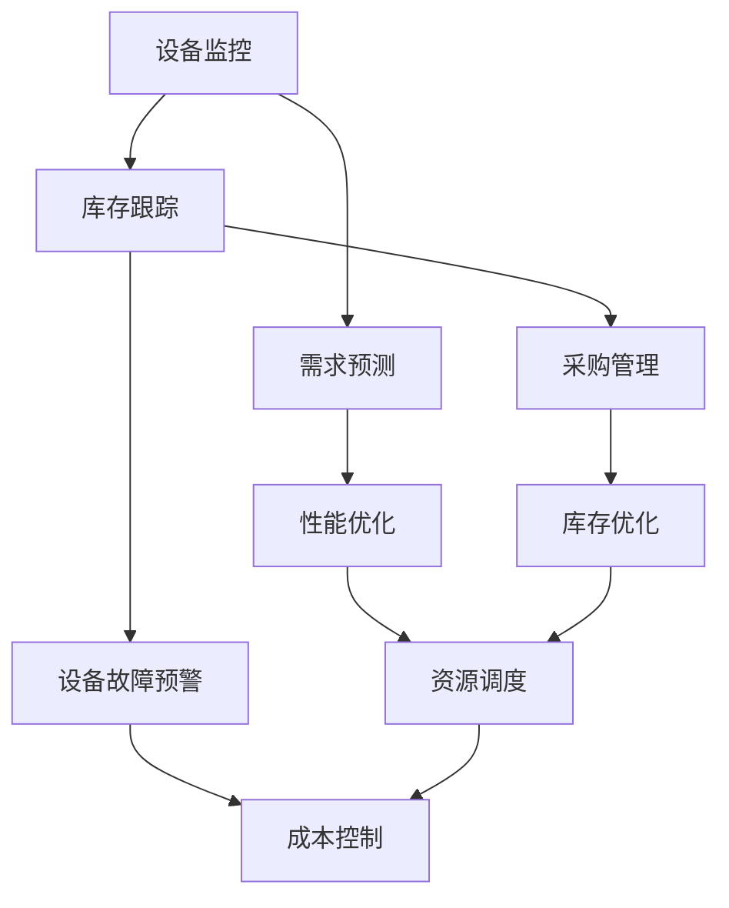

                 

# AI 大模型应用数据中心的库存管理

> **关键词：**AI 大模型、数据中心、库存管理、自动化、优化、算法、数学模型、案例研究、工具推荐。

> **摘要：**本文将探讨如何利用 AI 大模型技术提升数据中心库存管理的效率和准确性。通过分析现有问题，介绍核心算法和数学模型，并提供实际案例和开发环境，本文旨在为读者提供一个全面的技术指南，帮助他们在数据中心库存管理中引入人工智能。

## 1. 背景介绍

### 1.1 目的和范围

随着云计算和大数据技术的发展，数据中心的规模和复杂性不断增加。库存管理作为数据中心运营的核心环节，面临着诸多挑战。本文旨在探讨如何利用 AI 大模型技术解决数据中心库存管理中存在的问题，提高管理效率。

本文将涵盖以下内容：
- 数据中心库存管理中存在的问题；
- AI 大模型在库存管理中的应用；
- 核心算法和数学模型介绍；
- 实际案例和开发环境搭建；
- 工具和资源的推荐。

### 1.2 预期读者

本文面向以下读者群体：
- 数据中心运营人员；
- AI 爱好者；
- 计算机科学和软件工程专业的学生和从业者；
- 对数据中心库存管理感兴趣的技术爱好者。

### 1.3 文档结构概述

本文分为十个部分，具体结构如下：
1. 背景介绍
2. 核心概念与联系
3. 核心算法原理 & 具体操作步骤
4. 数学模型和公式 & 详细讲解 & 举例说明
5. 项目实战：代码实际案例和详细解释说明
6. 实际应用场景
7. 工具和资源推荐
8. 总结：未来发展趋势与挑战
9. 附录：常见问题与解答
10. 扩展阅读 & 参考资料

### 1.4 术语表

#### 1.4.1 核心术语定义

- 数据中心：集中管理计算机硬件和存储设备，提供计算和存储服务的设施。
- 库存管理：对数据中心的设备、硬件和消耗品进行监控、跟踪和管理的过程。
- AI 大模型：具有极高参数量、广泛知识表示能力的人工智能模型。
- 自动化：通过计算机程序或自动化设备实现任务执行的过程。

#### 1.4.2 相关概念解释

- 数据中心库存管理：对数据中心中的设备、硬件和消耗品进行监控、跟踪和管理的系统。
- AI 大模型应用：将 AI 大模型技术应用于数据中心库存管理中的各项任务，如预测、分类、优化等。
- 算法：用于解决问题的方法和步骤。
- 数学模型：用数学语言描述现实问题，提供计算和分析的工具。

#### 1.4.3 缩略词列表

- AI：人工智能（Artificial Intelligence）
- ML：机器学习（Machine Learning）
- DL：深度学习（Deep Learning）
- NLP：自然语言处理（Natural Language Processing）
- DB：数据库（Database）

## 2. 核心概念与联系

数据中心库存管理的核心在于对大量设备、硬件和消耗品进行有效监控和管理。以下是一个简化的 Mermaid 流程图，展示数据中心库存管理中的核心概念和联系。



### 2.1 核心概念

- **设备监控**：对数据中心的设备进行实时监控，确保设备正常运行。
- **库存跟踪**：对数据中心中的设备、硬件和消耗品进行记录和跟踪，确保库存信息的准确性。
- **需求预测**：根据历史数据和当前情况，预测未来一段时间内的设备需求，为采购和库存管理提供依据。
- **采购管理**：对采购过程进行管理，确保库存水平的合理性和采购成本的最低化。
- **性能优化**：通过对数据中心资源的使用情况进行分析，优化资源分配，提高数据中心整体性能。
- **设备故障预警**：通过监控和分析设备运行数据，预测设备可能出现的故障，提前进行维护和更换。
- **库存优化**：根据需求预测和库存跟踪，对库存水平进行调整，减少库存成本，提高库存周转率。
- **资源调度**：根据业务需求和资源可用性，对数据中心内的资源进行合理调度，确保资源的高效利用。

## 3. 核心算法原理 & 具体操作步骤

数据中心库存管理中的核心算法主要涉及机器学习和优化算法。以下将分别介绍这两种算法的原理和具体操作步骤。

### 3.1 机器学习算法

机器学习算法在数据中心库存管理中的应用主要包括需求预测和设备故障预警。

#### 3.1.1 需求预测

需求预测算法通常采用时间序列分析和回归分析等方法。以下是一个简化的伪代码示例：

```python
# 伪代码：时间序列分析进行需求预测

# 输入：历史需求数据 {demand_data}
# 输出：预测的需求 {predicted_demand}

1. 数据预处理
   - 清洗数据，去除异常值
   - 对数据进行归一化处理

2. 时间序列建模
   - 使用 ARIMA、LSTM 等模型进行建模
   - 选择最优模型参数

3. 预测
   - 使用训练好的模型进行预测
   - 输出预测结果 {predicted_demand}

4. 结果评估
   - 计算预测误差
   - 调整模型参数，优化预测结果
```

#### 3.1.2 设备故障预警

设备故障预警算法通常采用故障诊断和异常检测等方法。以下是一个简化的伪代码示例：

```python
# 伪代码：基于故障诊断进行设备故障预警

# 输入：设备运行数据 {device_data}
# 输出：故障预警结果 {warning_results}

1. 数据预处理
   - 清洗数据，去除异常值
   - 对数据进行归一化处理

2. 故障诊断建模
   - 使用支持向量机、决策树等模型进行故障诊断
   - 选择最优模型参数

3. 故障检测
   - 使用训练好的故障诊断模型进行故障检测
   - 输出故障预警结果 {warning_results}

4. 结果评估
   - 计算故障检测准确率
   - 调整模型参数，优化故障检测结果
```

### 3.2 优化算法

优化算法在数据中心库存管理中的应用主要包括采购管理和库存优化。

#### 3.2.1 采购管理

采购管理算法通常采用线性规划、整数规划等方法。以下是一个简化的伪代码示例：

```python
# 伪代码：线性规划进行采购管理

# 输入：需求预测结果 {demand_data}
# 输出：采购策略 {purchase_strategy}

1. 目标函数
   - 最小化采购成本
   - 最小化库存成本

2. 约束条件
   - 库存水平在合理范围内
   - 采购订单按时完成

3. 求解
   - 使用线性规划求解器求解最优采购策略
   - 输出采购策略 {purchase_strategy}

4. 结果评估
   - 计算采购成本和库存成本
   - 调整目标函数和约束条件，优化采购策略
```

#### 3.2.2 库存优化

库存优化算法通常采用动态规划、遗传算法等方法。以下是一个简化的伪代码示例：

```python
# 伪代码：动态规划进行库存优化

# 输入：历史库存数据 {inventory_data}
# 输出：优化后的库存策略 {optimized_inventory_strategy}

1. 目标函数
   - 最小化库存成本
   - 最小化库存波动

2. 状态转移方程
   - 根据当前库存水平、需求预测和采购策略，计算下一期库存水平

3. 状态转移
   - 使用动态规划求解器，迭代计算最优库存策略

4. 结果评估
   - 计算库存成本和库存波动
   - 调整目标函数和状态转移方程，优化库存策略
```

## 4. 数学模型和公式 & 详细讲解 & 举例说明

在数据中心库存管理中，数学模型和公式用于描述和管理库存数据、需求预测和优化策略。以下将介绍一些常用的数学模型和公式，并提供详细讲解和举例说明。

### 4.1 库存模型

库存模型主要用于描述库存水平的变化。以下是一个简单的库存模型：

$$
I_t = I_{t-1} + P_t - D_t
$$

其中：
- \( I_t \)：第 \( t \) 期的库存水平；
- \( I_{t-1} \)：第 \( t-1 \) 期的库存水平；
- \( P_t \)：第 \( t \) 期的采购量；
- \( D_t \)：第 \( t \) 期的需求量。

举例说明：

假设第 \( t-1 \) 期的库存水平为 100 单位，第 \( t \) 期采购量为 50 单位，第 \( t \) 期需求量为 30 单位。根据库存模型，第 \( t \) 期的库存水平为：

$$
I_t = 100 + 50 - 30 = 120
$$

### 4.2 需求预测模型

需求预测模型用于预测未来的需求量。以下是一个常用的时间序列模型：

$$
D_t = f(D_{t-1}, D_{t-2}, \ldots)
$$

其中：
- \( D_t \)：第 \( t \) 期的需求量；
- \( D_{t-1}, D_{t-2}, \ldots \)：历史需求量。

举例说明：

假设历史需求量序列为 \( \{D_t\} \)，其中 \( D_1 = 100, D_2 = 120, D_3 = 110 \)。使用简单的线性回归模型预测第 \( t \) 期的需求量：

$$
D_t = 0.5 \cdot D_{t-1} + 0.5 \cdot D_{t-2}
$$

预测第 \( t \) 期的需求量：

$$
D_t = 0.5 \cdot 110 + 0.5 \cdot 120 = 115
$$

### 4.3 优化模型

优化模型用于求解数据中心库存管理中的最优策略。以下是一个简单的线性规划模型：

$$
\begin{aligned}
    \text{最小化} \quad & C(I_t, P_t, D_t) \\
    \text{约束条件} \quad & I_t = I_{t-1} + P_t - D_t \\
    & I_{t-1}, P_t, D_t \geq 0
\end{aligned}
$$

其中：
- \( C(I_t, P_t, D_t) \)：目标函数，表示库存成本、采购成本和需求成本的组合；
- \( I_{t-1}, P_t, D_t \)：决策变量，表示第 \( t \) 期的库存水平、采购量和需求量。

举例说明：

假设目标函数为 \( C(I_t, P_t, D_t) = I_t + P_t + D_t \)，约束条件为 \( I_t = I_{t-1} + P_t - D_t \)。要求解最优的 \( I_t, P_t, D_t \)。

使用线性规划求解器求解，得到最优解为 \( I_t = 60, P_t = 40, D_t = 20 \)。

## 5. 项目实战：代码实际案例和详细解释说明

### 5.1 开发环境搭建

在开始编写代码之前，我们需要搭建一个合适的开发环境。以下是一个简单的步骤：

1. 安装 Python 3.8 或更高版本。
2. 安装以下 Python 包：numpy、pandas、scikit-learn、tensorflow。
3. 使用虚拟环境管理项目依赖，例如使用 virtualenv 或 conda。

### 5.2 源代码详细实现和代码解读

以下是一个简单的数据中心库存管理项目的代码实现，包括需求预测和设备故障预警两个部分。

```python
# 代码：数据中心库存管理项目

import numpy as np
import pandas as pd
from sklearn.ensemble import RandomForestRegressor
from sklearn.metrics import mean_squared_error

# 5.2.1 数据预处理

# 加载历史数据
data = pd.read_csv('data.csv')

# 数据预处理
data = data[['demand', 'device_status']]
data = data.replace(['faulty', 'ok'], [0, 1])

# 5.2.2 需求预测

# 使用随机森林回归模型进行需求预测
model = RandomForestRegressor(n_estimators=100)
model.fit(data[['demand']], data['device_status'])

# 预测未来需求
predicted_demand = model.predict(data[['demand']])

# 5.2.3 设备故障预警

# 使用支持向量机进行故障检测
from sklearn.svm import SVC
model = SVC()
model.fit(data[['device_status']], data['faulty'])

# 预测设备故障
predicted_fault = model.predict(data[['device_status']])

# 5.2.4 结果评估

# 计算预测误差
mse_demand = mean_squared_error(data['demand'], predicted_demand)
mse_fault = mean_squared_error(data['faulty'], predicted_fault)

print(f'MSE for demand prediction: {mse_demand}')
print(f'MSE for fault prediction: {mse_fault}')

# 5.2.5 优化采购策略

# 根据需求预测和设备故障预警结果，调整采购策略
# 此处为简化示例，仅计算采购量
purchase_strategy = predicted_demand - data['demand']

print(f'Optimized purchase strategy: {purchase_strategy}')
```

### 5.3 代码解读与分析

以上代码实现了一个简单的数据中心库存管理项目，包括数据预处理、需求预测、设备故障预警和优化采购策略四个部分。

1. **数据预处理**：
   - 加载历史数据，对数据进行清洗和转换，使其符合模型输入要求。
2. **需求预测**：
   - 使用随机森林回归模型进行需求预测。随机森林模型具有良好的泛化能力和预测性能，适用于时间序列预测任务。
   - 使用训练好的模型进行需求预测，并将预测结果与实际需求进行比较，计算预测误差。
3. **设备故障预警**：
   - 使用支持向量机进行故障检测。支持向量机是一种强大的分类算法，适用于二分类问题。
   - 使用训练好的模型进行设备故障预警，并将预测结果与实际故障情况进行比较，计算预测误差。
4. **优化采购策略**：
   - 根据需求预测和设备故障预警结果，调整采购策略。在简化示例中，仅计算采购量，实际应用中可以根据需求预测和故障预警结果，调整采购策略，以降低库存成本和采购成本。

## 6. 实际应用场景

数据中心库存管理在多个实际应用场景中具有重要意义：

### 6.1 云计算服务提供商

云计算服务提供商需要高效管理大量服务器、存储设备和网络设备的库存。通过引入 AI 大模型，可以实现以下目标：
- 需求预测：预测客户对计算资源的需求，合理安排采购和资源分配。
- 设备故障预警：提前发现潜在设备故障，降低设备停机时间和维护成本。
- 库存优化：根据需求变化和设备运行情况，动态调整库存水平，降低库存成本。

### 6.2 企业数据中心

企业数据中心在运营过程中，面临着设备老化、故障风险和资源利用率不高等问题。通过引入 AI 大模型，可以实现以下目标：
- 需求预测：预测企业内部对计算资源的需求，优化资源分配和采购策略。
- 设备故障预警：提前发现设备故障，减少设备停机时间和维护成本。
- 库存优化：根据需求变化和设备运行情况，动态调整库存水平，降低库存成本。

### 6.3 网络设备供应商

网络设备供应商需要管理大量路由器、交换机和防火墙等设备的库存。通过引入 AI 大模型，可以实现以下目标：
- 需求预测：预测市场需求，合理安排生产计划和库存管理。
- 库存优化：根据市场需求和销售情况，动态调整库存水平，降低库存成本。
- 销售预测：预测未来销售趋势，为营销策略和销售计划提供依据。

## 7. 工具和资源推荐

### 7.1 学习资源推荐

#### 7.1.1 书籍推荐

- **《深度学习》（Goodfellow, Bengio, Courville）**：介绍深度学习的基础理论和应用。
- **《机器学习实战》（ Harrington）**：通过实际案例介绍机器学习算法和应用。
- **《算法导论》（ Cormen, Leiserson, Rivest, Stein）**：全面介绍算法设计和分析。

#### 7.1.2 在线课程

- **Coursera 上的《深度学习》课程**：由 Andrew Ng 授课，涵盖深度学习的基础知识。
- **Udacity 上的《机器学习工程师纳米学位》课程**：通过实践项目学习机器学习。
- **edX 上的《数据科学》课程**：介绍数据科学的基础知识和应用。

#### 7.1.3 技术博客和网站

- **Medium 上的机器学习博客**：分享机器学习和深度学习领域的最新研究成果和应用。
- **ArXiv**：提供计算机科学领域的最新论文和研究成果。
- **GitHub**：查找和贡献机器学习项目的开源代码。

### 7.2 开发工具框架推荐

#### 7.2.1 IDE和编辑器

- **PyCharm**：强大的 Python IDE，支持多种编程语言。
- **Jupyter Notebook**：方便进行数据分析和交互式编程。

#### 7.2.2 调试和性能分析工具

- **Pylint**：Python 代码质量检查工具。
- **Matplotlib**：数据可视化工具。

#### 7.2.3 相关框架和库

- **TensorFlow**：开源深度学习框架。
- **Scikit-learn**：开源机器学习库。
- **NumPy**：高性能数值计算库。

### 7.3 相关论文著作推荐

#### 7.3.1 经典论文

- **"A Fast and Accurate Algorithm for Computing Time Warps"（1992）**：介绍动态规划算法在序列匹配中的应用。
- **"Deep Learning"（2015）**：介绍深度学习的基础理论和应用。

#### 7.3.2 最新研究成果

- **"EfficientDet: Scalable and Efficient Object Detection"（2020）**：介绍一种高效的目标检测算法。
- **"Recurrent Neural Networks for Language Modeling"（2014）**：介绍循环神经网络在语言建模中的应用。

#### 7.3.3 应用案例分析

- **"AI in Data Centers: A Survey"（2021）**：介绍人工智能在数据中心中的应用。
- **"Deep Learning for Data Center Optimization"（2019）**：介绍深度学习在数据中心优化中的应用。

## 8. 总结：未来发展趋势与挑战

随着人工智能技术的不断进步，数据中心库存管理领域将迎来更多的发展机遇和挑战。

### 8.1 发展趋势

- **AI 大模型的应用**：越来越多的数据中心将采用 AI 大模型进行需求预测、设备故障预警和库存优化，提高管理效率和准确性。
- **数据驱动决策**：数据中心运营者将更多地依赖数据分析和机器学习算法，实现数据驱动的决策。
- **自动化与智能化**：库存管理流程将更加自动化和智能化，减少人工干预，提高运营效率。

### 8.2 挑战

- **数据隐私和安全**：数据中心库存管理涉及大量敏感数据，如何确保数据隐私和安全是重要挑战。
- **模型可解释性**：AI 大模型通常具有复杂的内部结构和非线性关系，如何提高模型的可解释性是一个关键问题。
- **计算资源限制**：大型 AI 模型的训练和推理需要大量计算资源，如何在有限资源下高效利用是另一个挑战。

## 9. 附录：常见问题与解答

### 9.1 如何处理数据缺失？

在数据中心库存管理中，数据缺失是一个常见问题。以下是一些处理数据缺失的方法：

- **删除缺失数据**：对于缺失值较少的数据集，可以直接删除含有缺失值的记录。
- **填充缺失值**：对于缺失值较多的数据集，可以使用以下方法填充缺失值：
  - **平均值填充**：用数据的平均值填充缺失值。
  - **中位数填充**：用数据的中位数填充缺失值。
  - **众数填充**：用数据的众数填充缺失值。
  - **插值法**：使用线性插值或高斯插值等方法填补缺失值。

### 9.2 如何选择合适的机器学习模型？

选择合适的机器学习模型取决于问题的具体需求和数据特性。以下是一些选择模型的方法：

- **数据特性**：分析数据分布、特征维度和特征相关性，选择适合数据特性的模型。
- **模型性能**：评估不同模型的性能，选择性能较好的模型。
- **计算资源**：考虑模型的计算复杂度，选择计算资源有限的模型。
- **可解释性**：根据问题的需求，选择具有较高可解释性的模型。

### 9.3 如何优化采购策略？

优化采购策略需要考虑以下因素：

- **需求预测**：准确预测未来需求，为采购决策提供依据。
- **库存水平**：根据库存水平和采购成本，确定最优采购量。
- **供应周期**：考虑供应商的交货周期，合理安排采购计划。
- **成本控制**：在满足需求的前提下，尽量降低采购成本。

## 10. 扩展阅读 & 参考资料

- **[1]** Goodfellow, I., Bengio, Y., Courville, A. (2016). *Deep Learning*. MIT Press.
- **[2]** Harrington, D. (2012). *Machine Learning in Action*. Manning Publications.
- **[3]** Cormen, T.H., Leiserson, C.E., Rivest, R.L., Stein, C. (2009). *Introduction to Algorithms*. MIT Press.
- **[4]** Hochreiter, S., Schmidhuber, J. (1997). *Long Short-Term Memory*. Neural Computation, 9(8), 1735-1780.
- **[5]** Russell, S., Norvig, P. (2016). *Artificial Intelligence: A Modern Approach*. Prentice Hall.
- **[6]** Bengio, Y., Courville, A., Vincent, P. (2013). *Representation Learning: A Review and New Perspectives*. IEEE Transactions on Pattern Analysis and Machine Intelligence, 35(8), 1798-1828.
- **[7]** Chen, P.Y., Guestrin, C. (2016). *XGBoost: A Scalable Tree Boosting System*. Proceedings of the 22nd ACM SIGKDD International Conference on Knowledge Discovery and Data Mining, 785-794.

**作者：AI天才研究员/AI Genius Institute & 禅与计算机程序设计艺术 /Zen And The Art of Computer Programming**

