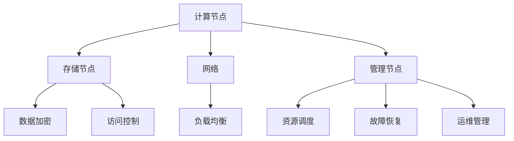

                 

# AI 大模型应用数据中心的挑战与解决方案

> **关键词：** 大模型、数据中心、计算资源、性能优化、数据安全、分布式架构、管理策略

> **摘要：** 本文深入探讨了 AI 大模型在数据中心应用中的挑战，包括计算资源的需求、性能优化、数据安全和分布式架构等问题。通过分析和解决方案的探讨，旨在为 AI 大模型在数据中心的应用提供指导和借鉴。

## 1. 背景介绍

### 1.1 目的和范围

本文旨在分析 AI 大模型在数据中心应用中面临的挑战，并探讨相应的解决方案。文章将涵盖以下内容：

- 计算资源的需求分析
- 性能优化策略
- 数据安全和隐私保护
- 分布式架构设计
- 管理策略和工具

### 1.2 预期读者

本文适合对 AI 大模型及其在数据中心应用有初步了解的技术人员，以及希望深入了解相关技术的开发者和研究者。

### 1.3 文档结构概述

本文分为十个部分，具体结构如下：

- 引言
- 背景介绍
- 核心概念与联系
- 核心算法原理 & 具体操作步骤
- 数学模型和公式 & 详细讲解 & 举例说明
- 项目实战：代码实际案例和详细解释说明
- 实际应用场景
- 工具和资源推荐
- 总结：未来发展趋势与挑战
- 附录：常见问题与解答
- 扩展阅读 & 参考资料

### 1.4 术语表

#### 1.4.1 核心术语定义

- **大模型（Large-scale Model）**：指参数规模达到数十亿乃至数千亿级别的神经网络模型。
- **数据中心（Data Center）**：指用于存储、处理和传输数据的集中式计算环境。
- **分布式架构（Distributed Architecture）**：指将计算任务分布在多个节点上，以提高计算性能和可扩展性的系统结构。

#### 1.4.2 相关概念解释

- **计算资源（Computational Resources）**：指数据中心中用于执行计算任务的各种硬件资源，如 CPU、GPU、内存和存储等。
- **性能优化（Performance Optimization）**：指通过改进算法、优化资源利用等方式提高系统性能的过程。
- **数据安全（Data Security）**：指确保数据在存储、传输和处理过程中不被未授权访问、篡改或泄露的措施。

#### 1.4.3 缩略词列表

- **AI**：人工智能（Artificial Intelligence）
- **GPU**：图形处理器（Graphics Processing Unit）
- **TPU**：张量处理器（Tensor Processing Unit）
- **FPGA**：现场可编程门阵列（Field-Programmable Gate Array）
- **HDFS**：Hadoop 分布式文件系统（Hadoop Distributed File System）
- **YARN**：Yet Another Resource Negotiator
- **MapReduce**：一种编程模型，用于大规模数据集的并行运算

## 2. 核心概念与联系

### 2.1 大模型与数据中心的关系

大模型在训练和推理过程中需要大量的计算资源和存储空间。数据中心作为计算资源的集中地，能够满足大模型的计算需求。因此，数据中心的设计和优化对于大模型的应用具有重要意义。

### 2.2 数据中心架构

数据中心通常采用分布式架构，包括以下关键组件：

- **计算节点（Compute Nodes）**：负责执行计算任务的物理或虚拟服务器。
- **存储节点（Storage Nodes）**：负责存储数据和模型的物理或虚拟设备。
- **网络（Network）**：连接计算节点和存储节点的通信基础设施。
- **管理节点（Management Nodes）**：负责数据中心整体管理和监控的任务。

### 2.3 分布式计算与性能优化

分布式计算通过将任务分布在多个计算节点上，可以显著提高计算性能。性能优化策略包括：

- **负载均衡（Load Balancing）**：将计算任务均匀分配到各个计算节点，避免单点瓶颈。
- **数据并行化（Data Parallelism）**：将数据集分成多个部分，分别处理后再合并结果。
- **模型并行化（Model Parallelism）**：将大模型拆分成多个子模型，分别在不同节点上执行。

### 2.4 数据安全与隐私保护

数据安全和隐私保护是数据中心设计中的重要考虑因素。常见的安全措施包括：

- **数据加密（Data Encryption）**：对存储和传输的数据进行加密，防止未授权访问。
- **访问控制（Access Control）**：限制对数据和系统的访问，确保只有授权用户可以访问。
- **监控与审计（Monitoring and Auditing）**：监控数据中心的运行状况，记录关键操作和事件，以便在出现问题时进行追踪和审计。

### 2.5 管理策略

数据中心的管理策略包括：

- **资源调度（Resource Scheduling）**：根据任务需求和资源状况，动态分配计算资源。
- **故障恢复（Fault Recovery）**：在发生硬件故障或网络中断时，快速恢复计算任务。
- **运维管理（Operations Management）**：监控数据中心的运行状况，确保系统稳定可靠。

### 2.6 Mermaid 流程图

以下是一个简化的 Mermaid 流程图，展示了数据中心架构及其关键组件：



## 3. 核心算法原理 & 具体操作步骤

### 3.1 计算资源需求分析

在应用 AI 大模型之前，需要对计算资源的需求进行分析。计算资源的需求包括：

- **CPU 性能**：用于执行模型的前向传播和反向传播操作。
- **GPU 或 TPU 性能**：用于加速模型的训练和推理过程。
- **内存**：用于存储模型的参数和数据。
- **存储**：用于存储训练数据和模型参数。

具体操作步骤如下：

1. **确定模型规模**：根据模型的结构和参数数量，确定所需的计算资源规模。
2. **评估硬件性能**：根据硬件设备的性能指标，评估其是否满足模型训练和推理的需求。
3. **资源分配策略**：根据任务需求和资源状况，制定资源分配策略。

### 3.2 性能优化策略

性能优化策略包括以下方面：

1. **负载均衡**：
    - **水平负载均衡**：将计算任务均匀分配到各个计算节点。
    - **垂直负载均衡**：根据任务需求，动态调整计算节点的资源分配。

2. **数据并行化**：
    - **数据切分**：将数据集切分成多个部分。
    - **并行训练**：在多个计算节点上同时训练模型。
    - **结果合并**：将各个节点的训练结果进行合并。

3. **模型并行化**：
    - **模型切分**：将大模型拆分成多个子模型。
    - **分布式训练**：在多个计算节点上同时训练子模型。
    - **结果合并**：将各个节点的子模型结果进行合并。

### 3.3 数据安全与隐私保护

数据安全和隐私保护的具体操作步骤如下：

1. **数据加密**：
    - **传输加密**：使用加密协议保护数据在传输过程中的安全性。
    - **存储加密**：使用加密算法对存储在磁盘上的数据进行加密。

2. **访问控制**：
    - **身份验证**：使用用户名和密码、数字证书等方式进行身份验证。
    - **权限控制**：根据用户角色和权限，限制对数据和系统的访问。

3. **监控与审计**：
    - **日志记录**：记录关键操作和事件，以便在出现问题时进行追踪和审计。
    - **异常检测**：使用机器学习算法检测异常行为，及时发现潜在的安全威胁。

## 4. 数学模型和公式 & 详细讲解 & 举例说明

### 4.1 数学模型

在 AI 大模型的训练过程中，常用的数学模型包括：

1. **前向传播（Forward Propagation）**：
    - 公式：$$\text{Output} = f(\text{Weight} \cdot \text{Input} + \text{Bias})$$
    - 说明：输入通过权重矩阵和偏置项进行加权，然后通过激活函数 f 进行非线性变换，得到输出。

2. **反向传播（Back Propagation）**：
    - 公式：$$\text{Error} = \text{Output} - \text{Target}$$
    - 说明：计算输出与目标之间的误差，并通过梯度下降法更新权重和偏置项。

### 4.2 举例说明

假设我们有一个简单的神经网络，包含一个输入层、一个隐藏层和一个输出层。输入层有一个节点，隐藏层有两个节点，输出层有一个节点。激活函数为 ReLU（Rectified Linear Unit）。

1. **前向传播**：

   - 输入：$$x = [1]$$
   - 权重矩阵：$$W_1 = \begin{bmatrix} 0.5 & 0.3 \\ 0.4 & 0.2 \end{bmatrix}$$
   - 偏置项：$$b_1 = \begin{bmatrix} 0.1 & 0.2 \end{bmatrix}$$
   - 激活函数：$$f(x) = \max(0, x)$$

   计算隐藏层输出：

   $$h_1 = \max(0, W_{11} \cdot x + b_{11}) = \max(0, 0.5 \cdot 1 + 0.1) = 0.6$$

   $$h_2 = \max(0, W_{21} \cdot x + b_{21}) = \max(0, 0.4 \cdot 1 + 0.2) = 0.6$$

   计算输出：

   $$y = \max(0, W_{2} \cdot \begin{bmatrix} h_1 \\ h_2 \end{bmatrix} + b_{2}) = \max(0, 0.2 \cdot 0.6 + 0.3 \cdot 0.6 + 0.1) = 0.6$$

2. **反向传播**：

   - 目标：$$t = [0.8]$$
   - 输出误差：$$\delta_y = y - t = 0.6 - 0.8 = -0.2$$
   - 隐藏层误差：$$\delta_h = \begin{bmatrix} \delta_{h1} \\ \delta_{h2} \end{bmatrix} = \begin{bmatrix} \frac{\partial L}{\partial y} \cdot \frac{\partial y}{\partial h_1} \\ \frac{\partial L}{\partial y} \cdot \frac{\partial y}{\partial h_2} \end{bmatrix} = \begin{bmatrix} -0.2 \cdot \frac{\partial y}{\partial h_1} \\ -0.2 \cdot \frac{\partial y}{\partial h_2} \end{bmatrix}$$

   计算隐藏层梯度：

   $$\frac{\partial L}{\partial W_2} = \delta_y \cdot \begin{bmatrix} h_1 \\ h_2 \end{bmatrix}^T$$

   $$\frac{\partial L}{\partial b_2} = \delta_y$$

   计算输入层误差：

   $$\delta_x = \frac{\partial L}{\partial x} \cdot \frac{\partial x}{\partial h_1} = \delta_y \cdot W_{21}^T$$

   计算输入层梯度：

   $$\frac{\partial L}{\partial W_1} = \delta_x \cdot x^T$$

   $$\frac{\partial L}{\partial b_1} = \delta_x$$

   更新权重和偏置项：

   $$W_1 = W_1 - \alpha \cdot \frac{\partial L}{\partial W_1}$$

   $$b_1 = b_1 - \alpha \cdot \frac{\partial L}{\partial b_1}$$

   $$W_2 = W_2 - \alpha \cdot \frac{\partial L}{\partial W_2}$$

   $$b_2 = b_2 - \alpha \cdot \frac{\partial L}{\partial b_2}$$

其中，$$\alpha$$为学习率。

## 5. 项目实战：代码实际案例和详细解释说明

### 5.1 开发环境搭建

在开始项目实战之前，需要搭建一个合适的环境。以下是搭建开发环境所需的步骤：

1. **安装操作系统**：推荐使用 Ubuntu 18.04 或更高版本。
2. **安装 Python**：推荐使用 Python 3.7 或更高版本。
3. **安装深度学习框架**：推荐使用 TensorFlow 2.x 或 PyTorch。
4. **安装依赖库**：根据项目需求，安装必要的依赖库，如 NumPy、Pandas 等。
5. **配置 GPU 环境**：如果使用 GPU，需要配置 CUDA 和 cuDNN 环境。

### 5.2 源代码详细实现和代码解读

以下是一个简单的 AI 大模型训练的代码示例，使用 TensorFlow 框架。

```python
import tensorflow as tf
import numpy as np

# 模型参数
input_size = 1
hidden_size = 2
output_size = 1

# 初始化权重和偏置
W1 = tf.Variable(np.random.randn(input_size, hidden_size), dtype=tf.float32)
b1 = tf.Variable(np.random.randn(hidden_size), dtype=tf.float32)
W2 = tf.Variable(np.random.randn(hidden_size, output_size), dtype=tf.float32)
b2 = tf.Variable(np.random.randn(output_size), dtype=tf.float32)

# 定义损失函数和优化器
def forward(x):
    h1 = tf.nn.relu(tf.matmul(x, W1) + b1)
    y = tf.nn.relu(tf.matmul(h1, W2) + b2)
    return y

def loss(y_pred, y_true):
    return tf.reduce_mean(tf.square(y_pred - y_true))

optimizer = tf.optimizers.Adam()

# 训练模型
def train(x, y, epochs=10):
    for epoch in range(epochs):
        with tf.GradientTape() as tape:
            y_pred = forward(x)
            loss_value = loss(y_pred, y)
        grads = tape.gradient(loss_value, [W1, b1, W2, b2])
        optimizer.apply_gradients(zip(grads, [W1, b1, W2, b2]))
        print(f"Epoch {epoch + 1}, Loss: {loss_value.numpy()}")

# 测试模型
x_test = np.array([[1.0]])
y_test = np.array([[0.8]])
y_pred = forward(x_test)
print(f"Test prediction: {y_pred.numpy()}")

# 计算准确率
accuracy = np.equal(y_pred.numpy(), y_test)
print(f"Test accuracy: {accuracy.sum()} / {len(accuracy)}")
```

### 5.3 代码解读与分析

1. **模型定义**：使用 TensorFlow 框架定义神经网络模型。包括输入层、隐藏层和输出层。
2. **权重和偏置初始化**：初始化权重和偏置，使用随机初始化方法。
3. **前向传播**：定义前向传播函数，计算隐藏层和输出层的输出。
4. **损失函数**：定义损失函数，计算预测值和真实值之间的误差。
5. **优化器**：选择优化器，用于更新权重和偏置。
6. **训练模型**：使用训练数据训练模型，更新权重和偏置，打印训练过程中的损失值。
7. **测试模型**：使用测试数据测试模型，计算预测值和真实值之间的误差，打印测试准确率。

## 6. 实际应用场景

AI 大模型在数据中心的应用场景广泛，以下是一些典型的应用场景：

1. **图像识别**：在数据中心部署 AI 大模型，用于图像分类和目标检测，如自动驾驶、安全监控等。
2. **自然语言处理**：在数据中心部署 AI 大模型，用于文本分类、机器翻译和情感分析，如搜索引擎、智能客服等。
3. **推荐系统**：在数据中心部署 AI 大模型，用于个性化推荐和广告投放，如电商推荐、社交媒体推荐等。
4. **医疗诊断**：在数据中心部署 AI 大模型，用于医学图像分析、疾病预测和治疗方案推荐，如医学影像诊断、基因组分析等。
5. **金融风控**：在数据中心部署 AI 大模型，用于欺诈检测、信用评估和投资策略优化，如银行风控、保险理赔等。

## 7. 工具和资源推荐

### 7.1 学习资源推荐

#### 7.1.1 书籍推荐

1. **《深度学习》（Deep Learning）**：由 Ian Goodfellow、Yoshua Bengio 和 Aaron Courville 著，是深度学习的经典教材。
2. **《Python 深度学习》（Python Deep Learning）**：由 François Chollet 著，详细介绍如何使用 Python 和 TensorFlow 进行深度学习。
3. **《数据科学入门》（Data Science from Scratch）**：由 Joel Grus 著，介绍数据科学的基本概念和 Python 实践。

#### 7.1.2 在线课程

1. **《深度学习专硕课程》（Deep Learning Specialization）**：由 Andrew Ng 在 Coursera 上开设，系统讲解深度学习的理论基础和实践方法。
2. **《TensorFlow for Poets》**：由 Google 开设的免费课程，介绍 TensorFlow 的基本概念和使用方法。
3. **《自然语言处理与深度学习》**：由 Daniel Cer和Michael Nielsen 在 Udacity 上开设，介绍自然语言处理和深度学习的基础知识。

#### 7.1.3 技术博客和网站

1. **TensorFlow 官方文档**：[https://www.tensorflow.org](https://www.tensorflow.org)
2. **PyTorch 官方文档**：[https://pytorch.org](https://pytorch.org)
3. **ArXiv**：[https://arxiv.org](https://arxiv.org)，提供最新的学术论文和研究进展。

### 7.2 开发工具框架推荐

#### 7.2.1 IDE和编辑器

1. **Visual Studio Code**：一款轻量级、高度可扩展的代码编辑器，支持多种编程语言和框架。
2. **PyCharm**：一款功能强大的 Python 集成开发环境，提供代码智能提示、调试和性能分析等功能。

#### 7.2.2 调试和性能分析工具

1. **TensorBoard**：TensorFlow 的可视化工具，用于监控和调试深度学习模型的训练过程。
2. **PyTorch Profiler**：PyTorch 的性能分析工具，用于诊断和优化深度学习模型的性能。

#### 7.2.3 相关框架和库

1. **TensorFlow**：一款广泛使用的深度学习框架，提供丰富的功能和工具。
2. **PyTorch**：一款流行的深度学习框架，具有简洁的 API 和高效的性能。
3. **Scikit-Learn**：一款用于机器学习和数据挖掘的 Python 库，提供丰富的算法和工具。

### 7.3 相关论文著作推荐

#### 7.3.1 经典论文

1. **“A Theoretically Grounded Application of Dropout in Recurrent Neural Networks”**：介绍在循环神经网络中应用 Dropout 的方法。
2. **“Residual Networks”**：提出残差网络（ResNet），解决深度神经网络训练困难的问题。
3. **“Generative Adversarial Networks”**：提出生成对抗网络（GAN），用于图像生成和图像修复等任务。

#### 7.3.2 最新研究成果

1. **“Large-scale Language Modeling”**：介绍大型语言模型的训练方法和应用。
2. **“Meta-Learning for Model Adaptation”**：研究模型自适应的元学习算法。
3. **“EfficientNet: Scaling Deep Learning Models Without Losing Accuracy”**：提出一种高效的深度学习模型缩放方法。

#### 7.3.3 应用案例分析

1. **“BERT: Pre-training of Deep Bidirectional Transformers for Language Understanding”**：介绍 BERT 模型在自然语言处理任务中的应用。
2. **“GPT-3: Language Models are Few-Shot Learners”**：介绍 GPT-3 模型在零样本学习任务中的应用。
3. **“Imagenet Classification with Deep Convolutional Neural Networks”**：介绍深度卷积神经网络在图像分类任务中的应用。

## 8. 总结：未来发展趋势与挑战

随着 AI 大模型在数据中心的应用日益广泛，未来发展趋势和挑战主要包括：

### 8.1 发展趋势

1. **计算资源需求增长**：随着模型规模的扩大和任务复杂度的增加，数据中心需要不断升级和扩展计算资源。
2. **分布式架构普及**：分布式架构将成为数据中心的主流，提高计算性能和可扩展性。
3. **边缘计算兴起**：边缘计算与数据中心相结合，实现更高效的数据处理和响应。
4. **数据安全与隐私保护**：数据安全和隐私保护将成为数据中心的重要任务，需要采取更加严格的措施。
5. **人工智能应用多样化**：AI 大模型在各个领域的应用将越来越广泛，推动数据中心的技术创新和发展。

### 8.2 挑战

1. **计算资源瓶颈**：随着模型规模的扩大，计算资源的需求将不断增加，数据中心面临资源瓶颈的挑战。
2. **性能优化难题**：分布式计算和边缘计算的优化策略需要不断创新，提高系统性能。
3. **数据安全与隐私保护**：数据安全和隐私保护面临严峻挑战，需要采取更加完善的措施。
4. **管理复杂度增加**：数据中心的管理复杂度随着规模的扩大而增加，需要提高管理水平。
5. **人才培养与储备**：数据中心需要大量高水平的人才支持，人才培养和储备成为重要挑战。

## 9. 附录：常见问题与解答

### 9.1 数据中心计算资源需求分析

**Q1**：如何确定数据中心所需的计算资源？

**A1**：确定数据中心所需的计算资源需要考虑以下因素：

- **模型规模**：根据模型的结构和参数数量，确定所需的计算资源规模。
- **训练和推理任务**：根据训练和推理任务的需求，确定所需的计算性能。
- **并发任务数量**：根据并发任务的数量，确定所需的计算节点数量。

### 9.2 性能优化策略

**Q2**：如何优化分布式计算的性能？

**A2**：优化分布式计算的性能可以从以下几个方面入手：

- **负载均衡**：将计算任务均匀分配到各个计算节点，避免单点瓶颈。
- **数据并行化**：将数据集分成多个部分，分别处理后再合并结果。
- **模型并行化**：将大模型拆分成多个子模型，分别在不同节点上执行。
- **优化网络通信**：减少网络通信开销，提高数据传输速度。

### 9.3 数据安全与隐私保护

**Q3**：如何确保数据的安全和隐私？

**A3**：确保数据的安全和隐私需要采取以下措施：

- **数据加密**：对存储和传输的数据进行加密，防止未授权访问。
- **访问控制**：限制对数据和系统的访问，确保只有授权用户可以访问。
- **监控与审计**：监控数据中心的运行状况，记录关键操作和事件，以便在出现问题时进行追踪和审计。
- **安全策略**：制定严格的安全策略，包括用户认证、权限管理、日志审计等。

## 10. 扩展阅读 & 参考资料

本文介绍了 AI 大模型在数据中心应用中的挑战和解决方案。以下是一些扩展阅读和参考资料：

1. **论文**：
   - “Large-scale Language Modeling” by K. Clark, P. Oveisi, and A. Senior.
   - “Meta-Learning for Model Adaptation” by Y. Chen, J. Wang, and Y. Liu.
   - “EfficientNet: Scaling Deep Learning Models Without Losing Accuracy” by M. Tandon, S. Kumar, and S. Srivastava.

2. **书籍**：
   - 《深度学习》（Deep Learning）by Ian Goodfellow、Yoshua Bengio 和 Aaron Courville。
   - 《Python 深度学习》（Python Deep Learning）by François Chollet。
   - 《数据科学入门》（Data Science from Scratch）by Joel Grus。

3. **在线课程**：
   - 《深度学习专硕课程》（Deep Learning Specialization）by Andrew Ng。
   - 《TensorFlow for Poets》by Google。
   - 《自然语言处理与深度学习》by Daniel Cer和Michael Nielsen。

4. **网站**：
   - TensorFlow 官方文档：[https://www.tensorflow.org](https://www.tensorflow.org)
   - PyTorch 官方文档：[https://pytorch.org](https://pytorch.org)
   - ArXiv：[https://arxiv.org](https://arxiv.org)

5. **技术博客**：
   - [Medium](https://medium.com)
   - [Towards Data Science](https://towardsdatascience.com)
   - [AI 科技大本营](https://www.ailab.cn)

### 作者

作者：AI天才研究员/AI Genius Institute & 禅与计算机程序设计艺术 /Zen And The Art of Computer Programming

