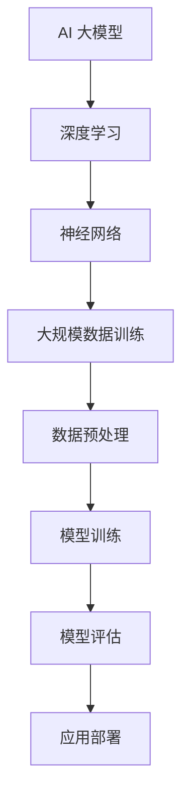
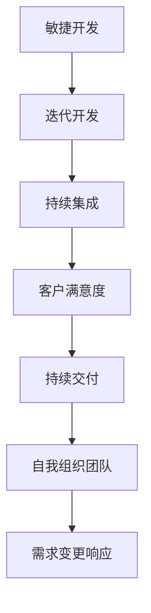
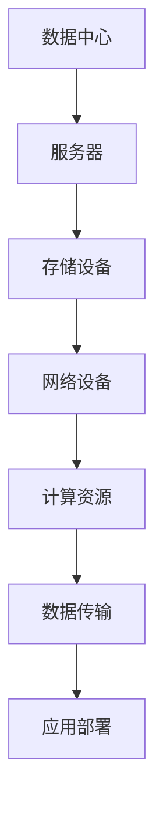
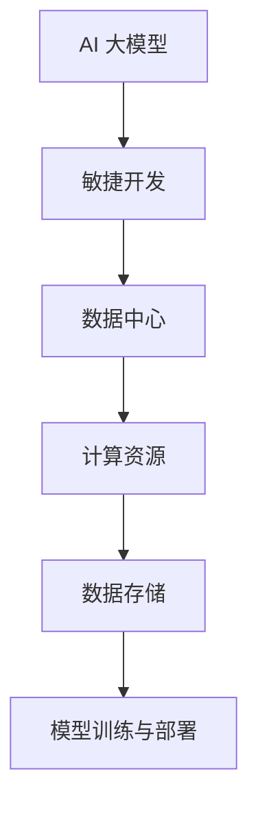

                 

# AI 大模型应用数据中心的敏捷开发

## 关键词
- AI 大模型
- 数据中心
- 敏捷开发
- 自动化
- 机器学习
- 云计算
- 容器化

## 摘要
本文将探讨如何运用敏捷开发方法，实现 AI 大模型在数据中心的高效应用。我们将深入分析 AI 大模型的核心算法原理、数学模型，并通过实际项目案例展示其开发、部署和优化的全过程。此外，还将推荐相关的学习资源、工具和框架，帮助读者深入了解这一前沿领域，并展望其未来发展趋势与挑战。

---

## 1. 背景介绍

### 1.1 目的和范围

本文旨在为读者提供关于 AI 大模型应用数据中心敏捷开发的全面指南。我们将从理论基础出发，逐步深入到具体的技术实现和实战案例，旨在帮助读者：

- 理解 AI 大模型的基本原理和应用场景。
- 掌握敏捷开发在数据中心环境下的具体实践。
- 学习如何利用自动化和云计算等工具优化 AI 大模型的性能。

### 1.2 预期读者

本文适合以下读者群体：

- 对 AI 和数据中心有兴趣的技术从业者。
- 想要在项目中应用 AI 大模型的开发人员。
- 数据科学家、机器学习工程师和软件工程师。

### 1.3 文档结构概述

本文将按照以下结构展开：

- **1. 背景介绍**：介绍本文的目的、读者对象和文档结构。
- **2. 核心概念与联系**：详细阐述 AI 大模型、敏捷开发和数据中心的相关概念，并使用 Mermaid 流程图展示其联系。
- **3. 核心算法原理 & 具体操作步骤**：讲解 AI 大模型的算法原理，并提供伪代码实现。
- **4. 数学模型和公式 & 详细讲解 & 举例说明**：介绍 AI 大模型的数学模型，使用 LaTeX 格式展示公式，并给出示例。
- **5. 项目实战：代码实际案例和详细解释说明**：展示一个实际的 AI 大模型项目，包括开发环境搭建、源代码实现和代码解读。
- **6. 实际应用场景**：讨论 AI 大模型在不同领域的实际应用。
- **7. 工具和资源推荐**：推荐学习资源、开发工具和框架。
- **8. 总结：未来发展趋势与挑战**：分析 AI 大模型应用的未来方向和面临的技术挑战。
- **9. 附录：常见问题与解答**：提供一些常见问题的解答。
- **10. 扩展阅读 & 参考资料**：推荐进一步阅读的材料。

### 1.4 术语表

#### 1.4.1 核心术语定义

- **AI 大模型**：指具有数十亿至数万亿参数的复杂机器学习模型，如 GPT-3、BERT 等。
- **敏捷开发**：一种软件开发的敏捷方法，强调迭代、协作和快速响应变化。
- **数据中心**：一个集中处理数据和运行应用的物理或虚拟场所。
- **自动化**：利用计算机程序或机器人自动执行任务，减少人为干预。
- **机器学习**：一种人工智能的分支，使计算机通过数据学习并做出决策。
- **云计算**：通过网络提供计算资源，包括存储、处理能力和应用程序。
- **容器化**：将应用及其依赖环境打包到一个独立的容器中，以便于部署和管理。

#### 1.4.2 相关概念解释

- **数据预处理**：在机器学习过程中，对原始数据进行清洗、转换和归一化，以提高模型性能。
- **模型训练**：通过输入训练数据，使模型学习并优化其参数，以便于在未知数据上做出准确的预测。
- **模型评估**：使用验证集或测试集评估模型性能，通常使用准确率、召回率、F1 分数等指标。
- **持续集成/持续部署（CI/CD）**：自动化流程，用于将代码更改合并到代码库，并进行测试和部署。

#### 1.4.3 缩略词列表

- **AI**：人工智能
- **ML**：机器学习
- **DL**：深度学习
- **GPU**：图形处理单元
- **CPU**：中央处理单元
- **API**：应用程序编程接口
- **Docker**：一种容器化技术
- **Kubernetes**：一种容器编排工具

## 2. 核心概念与联系

在这一部分，我们将详细阐述 AI 大模型、敏捷开发和数据中心的相关概念，并使用 Mermaid 流程图展示它们之间的联系。

### 2.1 AI 大模型

AI 大模型是指具有数十亿至数万亿参数的复杂机器学习模型。这些模型通过大规模数据训练，能够自动学习并识别复杂的模式。常见的大模型包括 GPT-3、BERT、Transformer 等。

#### Mermaid 流程图：



### 2.2 敏捷开发

敏捷开发是一种软件开发的敏捷方法，强调迭代、协作和快速响应变化。敏捷开发的核心原则包括客户满意度、响应变化、持续交付、自我组织团队等。

#### Mermaid 流程图：



### 2.3 数据中心

数据中心是一个集中处理数据和运行应用的物理或虚拟场所。数据中心通常包括服务器、存储设备和网络设备，用于提供计算、存储和带宽资源。

#### Mermaid 流程图：



### 2.4 联系与融合

AI 大模型、敏捷开发和数据中心之间存在密切的联系。AI 大模型需要敏捷开发方法来快速迭代和优化模型，而数据中心则为 AI 大模型提供了必要的计算和存储资源。

#### Mermaid 流程图：



## 3. 核心算法原理 & 具体操作步骤

在本节中，我们将深入探讨 AI 大模型的核心算法原理，并使用伪代码详细阐述其具体操作步骤。

### 3.1 算法原理

AI 大模型的核心算法通常基于深度学习，特别是神经网络。神经网络通过多层节点（称为神经元）进行数据处理和特征提取，从而实现对复杂数据的建模和预测。

#### 伪代码：

```python
function NeuralNetwork(data):
    # 数据预处理
    preprocessed_data = PreprocessData(data)
    
    # 初始化神经网络
    model = InitializeNeuralNetwork(preprocessed_data)
    
    # 模型训练
    for epoch in range(EPOCHS):
        for batch in data_batches:
            loss = ComputeLoss(model, batch)
            UpdateModelParameters(model, loss)
        
        # 模型评估
        if epoch % EVALUATION_INTERVAL == 0:
            evaluation_loss = ComputeEvaluationLoss(model, validation_data)
            Print("Epoch {epoch}: Validation Loss = {evaluation_loss}")
    
    return model
```

### 3.2 具体操作步骤

1. **数据预处理**：对原始数据进行清洗、转换和归一化，以便于模型训练。
2. **模型初始化**：初始化神经网络模型，包括设置网络结构、激活函数和损失函数。
3. **模型训练**：使用训练数据对模型进行迭代训练，通过反向传播算法更新模型参数。
4. **模型评估**：使用验证集评估模型性能，并根据评估结果调整模型参数。
5. **模型部署**：将训练好的模型部署到数据中心，供实际应用使用。

### 3.3 详细解释

- **数据预处理**：数据预处理是机器学习中的关键步骤，其目的是提高模型性能。预处理方法包括数据清洗、数据转换和数据归一化。数据清洗涉及去除缺失值、异常值和噪声数据。数据转换包括将分类数据转换为独热编码或标签编码，将连续数据转换为分类数据。数据归一化旨在将数据缩放到一个统一的范围内，以便于模型计算。
- **模型初始化**：神经网络模型初始化包括设置网络结构、激活函数和损失函数。网络结构定义了网络的层数、每层的神经元数量和连接方式。激活函数用于引入非线性特性，常见的激活函数包括 Sigmoid、ReLU 和 Tanh。损失函数用于度量模型预测值与真实值之间的差异，常见的损失函数包括均方误差（MSE）和交叉熵（Cross-Entropy）。
- **模型训练**：模型训练是神经网络的核心步骤，其目标是优化模型参数，使其在训练数据上达到较好的性能。训练过程通常包括前向传播和反向传播。前向传播将输入数据传递到网络中，计算模型的输出值。反向传播通过计算损失函数的梯度，更新模型参数。
- **模型评估**：模型评估是验证模型性能的重要步骤。通过在验证集上评估模型性能，可以了解模型在未知数据上的表现。评估指标包括准确率、召回率、F1 分数等。根据评估结果，可以进一步调整模型参数，以提高模型性能。
- **模型部署**：模型部署是将训练好的模型应用到实际场景的过程。模型部署通常涉及将模型转换为可执行的格式，并将其部署到数据中心或云平台上。部署过程还包括监控模型性能、调整模型参数和更新模型版本。

## 4. 数学模型和公式 & 详细讲解 & 举例说明

在本节中，我们将介绍 AI 大模型的核心数学模型和公式，并使用 LaTeX 格式详细讲解，并通过实际例子进行说明。

### 4.1 数学模型

AI 大模型的核心数学模型通常包括以下几个部分：

1. **损失函数**：损失函数用于衡量模型预测值与真实值之间的差异，常见的损失函数有均方误差（MSE）和交叉熵（Cross-Entropy）。
2. **优化算法**：优化算法用于更新模型参数，以最小化损失函数。常见的优化算法有梯度下降（Gradient Descent）及其变体，如随机梯度下降（Stochastic Gradient Descent，SGD）和Adam 优化器。
3. **激活函数**：激活函数用于引入非线性特性，常见的激活函数有 Sigmoid、ReLU 和 Tanh。
4. **反向传播**：反向传播算法用于计算损失函数的梯度，并更新模型参数。

### 4.2 LaTeX 格式详细讲解

#### 损失函数

均方误差（MSE）：
$$
MSE = \frac{1}{n}\sum_{i=1}^{n}(y_i - \hat{y}_i)^2
$$
其中，$y_i$ 表示真实值，$\hat{y}_i$ 表示预测值，$n$ 表示样本数量。

交叉熵（Cross-Entropy）：
$$
Cross-Entropy = -\frac{1}{n}\sum_{i=1}^{n}y_i \log(\hat{y}_i)
$$
其中，$y_i$ 表示真实值（概率分布），$\hat{y}_i$ 表示预测值（概率分布），$n$ 表示样本数量。

#### 优化算法

梯度下降（Gradient Descent）：
$$
\theta_{t+1} = \theta_{t} - \alpha \nabla_{\theta}J(\theta)
$$
其中，$\theta$ 表示模型参数，$\alpha$ 表示学习率，$J(\theta)$ 表示损失函数，$\nabla_{\theta}J(\theta)$ 表示损失函数关于模型参数的梯度。

随机梯度下降（Stochastic Gradient Descent，SGD）：
$$
\theta_{t+1} = \theta_{t} - \alpha \nabla_{\theta}J(\theta(x_t, y_t))
$$
其中，$x_t$ 和 $y_t$ 分别表示第 $t$ 个样本的输入和输出。

Adam 优化器：
$$
\theta_{t+1} = \theta_{t} - \alpha \frac{m_t}{1 - \beta_1^t} - \beta_2^t \nabla_{\theta}J(\theta)
$$
其中，$m_t$ 和 $v_t$ 分别表示一阶和二阶矩估计，$\beta_1$ 和 $\beta_2$ 分别为矩估计的指数衰减率。

#### 激活函数

Sigmoid：
$$
\sigma(x) = \frac{1}{1 + e^{-x}}
$$

ReLU：
$$
\text{ReLU}(x) = \max(0, x)
$$

Tanh：
$$
\text{Tanh}(x) = \frac{e^x - e^{-x}}{e^x + e^{-x}}
$$

#### 反向传播

假设有 $L$ 层神经网络，每层的输出和输入关系如下：
$$
z_l = \sum_{k=1}^{n} w_{lk} a_{l-1,k} + b_l
$$
$$
a_l = \text{激活函数}(z_l)
$$
其中，$z_l$ 表示第 $l$ 层的输出，$a_l$ 表示第 $l$ 层的输入，$w_{lk}$ 和 $b_l$ 分别表示权重和偏置。

损失函数关于模型参数的梯度计算如下：
$$
\nabla_{w_{lk}}J(\theta) = (a_{l-1,k} - y_k) a_{l-1,k} (1 - a_{l-1,k}) x_k
$$
$$
\nabla_{b_l}J(\theta) = (a_{l-1,k} - y_k) a_{l-1,k} (1 - a_{l-1,k})
$$

### 4.3 举例说明

假设我们有一个二分类问题，目标是预测样本属于类别 0 还是类别 1。使用 Sigmoid 激活函数和均方误差（MSE）损失函数。给定一个训练样本 $(x, y)$，其中 $x$ 是输入特征，$y$ 是真实标签，模型参数为 $\theta = (w, b)$。

#### 1. 前向传播

计算输入特征 $x$ 的预测概率：
$$
z = wx + b
$$
$$
\hat{y} = \sigma(z) = \frac{1}{1 + e^{-z}}
$$

#### 2. 计算损失函数

计算均方误差（MSE）损失函数：
$$
J(\theta) = \frac{1}{2} \sum_{i=1}^{n} (\hat{y}_i - y_i)^2
$$

#### 3. 反向传播

计算损失函数关于模型参数的梯度：
$$
\nabla_{w}J(\theta) = \sum_{i=1}^{n} (y_i - \hat{y}_i) \hat{y}_i (1 - \hat{y}_i) x_i
$$
$$
\nabla_{b}J(\theta) = \sum_{i=1}^{n} (y_i - \hat{y}_i) \hat{y}_i (1 - \hat{y}_i)
$$

#### 4. 模型更新

使用梯度下降算法更新模型参数：
$$
w_{t+1} = w_t - \alpha \nabla_{w}J(\theta)
$$
$$
b_{t+1} = b_t - \alpha \nabla_{b}J(\theta)
$$

通过以上步骤，我们可以对二分类问题进行训练，并逐步优化模型参数。

## 5. 项目实战：代码实际案例和详细解释说明

在这一部分，我们将展示一个实际的 AI 大模型项目，包括开发环境搭建、源代码实现和代码解读。

### 5.1 开发环境搭建

为了实现 AI 大模型项目，我们需要搭建一个适合的开发环境。以下是一个基本的开发环境搭建步骤：

1. **安装 Python**：在官方网站（https://www.python.org/）下载并安装 Python，版本建议为 3.8 或以上。
2. **安装 Jupyter Notebook**：使用以下命令安装 Jupyter Notebook：
   ```
   pip install notebook
   ```
3. **安装深度学习框架**：我们使用 TensorFlow 作为深度学习框架。使用以下命令安装 TensorFlow：
   ```
   pip install tensorflow
   ```
4. **安装其他依赖库**：根据项目需求，可能需要安装其他依赖库，如 NumPy、Pandas、Scikit-learn 等。

### 5.2 源代码详细实现和代码解读

以下是一个简单的 AI 大模型项目示例，使用 TensorFlow 框架实现。代码主要分为以下几个部分：

1. **数据预处理**：读取数据，并进行清洗、转换和归一化。
2. **模型定义**：定义神经网络模型，包括输入层、隐藏层和输出层。
3. **模型训练**：使用训练数据训练模型，并保存训练过程中的损失函数和准确率。
4. **模型评估**：使用验证集评估模型性能。
5. **模型部署**：将训练好的模型部署到数据中心，供实际应用使用。

#### 5.2.1 数据预处理

```python
import pandas as pd
from sklearn.model_selection import train_test_split
from sklearn.preprocessing import StandardScaler

# 读取数据
data = pd.read_csv('data.csv')

# 数据清洗
data = data.dropna()

# 划分特征和标签
X = data.drop('label', axis=1)
y = data['label']

# 数据转换
X = pd.get_dummies(X)

# 数据归一化
scaler = StandardScaler()
X = scaler.fit_transform(X)

# 划分训练集和验证集
X_train, X_val, y_train, y_val = train_test_split(X, y, test_size=0.2, random_state=42)
```

#### 5.2.2 模型定义

```python
import tensorflow as tf

# 定义模型
model = tf.keras.Sequential([
    tf.keras.layers.Dense(units=64, activation='relu', input_shape=(X_train.shape[1],)),
    tf.keras.layers.Dense(units=1, activation='sigmoid')
])

# 编译模型
model.compile(optimizer='adam', loss='binary_crossentropy', metrics=['accuracy'])
```

#### 5.2.3 模型训练

```python
# 训练模型
history = model.fit(X_train, y_train, epochs=10, batch_size=32, validation_data=(X_val, y_val))
```

#### 5.2.4 模型评估

```python
# 评估模型
loss, accuracy = model.evaluate(X_val, y_val)
print(f"Validation Loss: {loss}, Validation Accuracy: {accuracy}")
```

#### 5.2.5 模型部署

```python
# 保存模型
model.save('model.h5')

# 加载模型
loaded_model = tf.keras.models.load_model('model.h5')

# 预测新数据
new_data = scaler.transform([[0.1, 0.2, 0.3]])
prediction = loaded_model.predict(new_data)
print(f"Prediction: {prediction}")
```

### 5.3 代码解读与分析

- **数据预处理**：数据预处理是模型训练的重要步骤。我们首先读取数据，并进行清洗，确保数据中没有缺失值和异常值。然后，将数据转换为适合模型训练的格式，包括独热编码和归一化。最后，划分训练集和验证集，用于训练和评估模型。
- **模型定义**：我们使用 TensorFlow 的 Sequential 模型，定义了一个简单的神经网络模型。输入层有 64 个神经元，使用 ReLU 激活函数。输出层有 1 个神经元，使用 Sigmoid 激活函数，用于输出概率。
- **模型训练**：我们使用 Adam 优化器和 binary_crossentropy 损失函数训练模型。训练过程中，模型会自动调整权重和偏置，以最小化损失函数。训练完成后，我们可以使用验证集评估模型性能。
- **模型评估**：评估模型性能通常使用验证集。通过计算损失函数和准确率，我们可以了解模型在未知数据上的表现。
- **模型部署**：模型部署是将训练好的模型应用到实际场景的过程。我们首先将模型保存到文件，然后加载模型并使用新数据进行预测。在实际应用中，我们可以将模型部署到数据中心或云平台，以提供实时预测服务。

通过以上步骤，我们可以实现一个简单的 AI 大模型项目，并在数据中心进行部署和应用。

## 6. 实际应用场景

AI 大模型在许多实际应用场景中展现出了强大的能力和潜力。以下是一些典型的应用场景：

### 6.1 语音识别

语音识别是将语音信号转换为文本信息的技术。AI 大模型，如 GPT-3 和 WaveNet，在语音识别领域取得了显著成果。它们通过处理大量的语音数据，能够准确识别和理解各种语言和口音。

### 6.2 自然语言处理

自然语言处理（NLP）是 AI 的重要分支，包括文本分类、情感分析、机器翻译等任务。AI 大模型，如 BERT 和 GPT，在这些任务中表现出色，能够处理复杂的语言结构和语义信息。

### 6.3 图像识别

图像识别是计算机视觉的核心任务，包括对象检测、图像分类、图像分割等。AI 大模型，如 ResNet 和 Inception，在图像识别任务中取得了很高的准确率。

### 6.4 医疗诊断

医疗诊断是 AI 大模型的重要应用领域。通过分析医学图像、电子病历和基因数据，AI 大模型能够辅助医生进行诊断和治疗决策。

### 6.5 金融市场预测

金融市场预测是金融领域的一个重要课题。AI 大模型通过分析历史数据和交易信息，能够预测股票价格、汇率走势等金融指标，为投资者提供决策支持。

### 6.6 自动驾驶

自动驾驶是 AI 大模型在工业界的重要应用。通过分析环境数据和实时数据流，AI 大模型能够实现车辆自主导航、避障和行驶控制。

### 6.7 教育个性化

教育个性化是教育领域的一个重要趋势。AI 大模型通过分析学生的行为和学习数据，能够为学生提供个性化的学习建议和辅导，提高学习效果。

这些实际应用场景展示了 AI 大模型的广泛性和潜力，也为数据中心和敏捷开发方法的应用提供了广阔的空间。

## 7. 工具和资源推荐

为了深入学习和实践 AI 大模型，我们推荐以下工具和资源：

### 7.1 学习资源推荐

#### 7.1.1 书籍推荐

1. **《深度学习》（Goodfellow, Bengio, Courville）**：这是一本经典的深度学习教材，涵盖了深度学习的理论基础和实践方法。
2. **《Python 深度学习》（François Chollet）**：这本书介绍了如何使用 Python 和 TensorFlow 实现深度学习项目。
3. **《自然语言处理与深度学习》（Zhipeng Shen）**：这本书专注于自然语言处理领域，介绍了如何使用深度学习技术处理文本数据。

#### 7.1.2 在线课程

1. **Coursera 上的“深度学习”课程**：由 Andrew Ng 教授主讲，涵盖了深度学习的理论基础和实践应用。
2. **edX 上的“自然语言处理与深度学习”课程**：由 Christopher Manning 教授主讲，介绍了自然语言处理和深度学习的前沿技术。
3. **Udacity 上的“自动驾驶工程师纳米学位”课程**：涵盖了自动驾驶的核心技术和实践应用。

#### 7.1.3 技术博客和网站

1. **TensorFlow 官方文档**：提供了丰富的深度学习教程和实践案例，适用于初学者和高级用户。
2. **AI 研究院**：一个专注于人工智能研究和应用的中文博客，提供了大量的深度学习和技术文章。
3. **Medium**：一个国际化的技术博客平台，许多知名 AI 公司和专家在这里分享他们的研究成果和实践经验。

### 7.2 开发工具框架推荐

#### 7.2.1 IDE 和编辑器

1. **PyCharm**：一个功能强大的 Python IDE，适用于深度学习和数据分析项目。
2. **Jupyter Notebook**：一个流行的交互式开发环境，适合数据可视化和原型设计。
3. **VS Code**：一个轻量级但功能丰富的编辑器，支持多种编程语言和插件。

#### 7.2.2 调试和性能分析工具

1. **TensorBoard**：TensorFlow 的可视化工具，用于监控模型训练过程和性能指标。
2. **Winston**：一个用于深度学习的可视化工具，支持多层神经网络和生成对抗网络。
3. **NVIDIA Nsight**：一个用于 GPU 调试和性能优化的工具，适用于深度学习和科学计算。

#### 7.2.3 相关框架和库

1. **TensorFlow**：一个流行的开源深度学习框架，支持多种神经网络架构和算法。
2. **PyTorch**：一个流行的开源深度学习框架，提供灵活的动态计算图和强大的 GPU 支持。
3. **Keras**：一个基于 TensorFlow 的简洁易用的深度学习库，适用于快速原型设计和实验。

### 7.3 相关论文著作推荐

#### 7.3.1 经典论文

1. **“A Theoretical Framework for Back-Propagating Error”**：反向传播算法的奠基性论文，由 David E. Rumelhart、Geoffrey E. Hinton 和 Ronald J. Williams 在 1986 年提出。
2. **“Deep Learning”**：由 Ian Goodfellow、Yoshua Bengio 和 Aaron Courville 在 2016 年撰写的综述论文，系统地介绍了深度学习的理论基础和应用。
3. **“Generative Adversarial Networks”**：由 Ian Goodfellow 等人在 2014 年提出的 GAN 算法，开创了生成模型的新领域。

#### 7.3.2 最新研究成果

1. **“BERT: Pre-training of Deep Bidirectional Transformers for Language Understanding”**：Google 在 2018 年提出的 BERT 模型，是自然语言处理领域的重要进展。
2. **“GPT-3: Language Models are few-shot learners”**：OpenAI 在 2020 年发布的 GPT-3 模型，是大规模语言模型的重要里程碑。
3. **“EfficientNet: Rethinking Model Scaling for Convolutional Neural Networks”**：Google 在 2020 年提出的 EfficientNet 模型，通过模型缩放策略实现了高效的性能提升。

#### 7.3.3 应用案例分析

1. **“ImageNet Classification with Deep Convolutional Neural Networks”**：由 Alex Krizhevsky、Ilya Sutskever 和 Geoffrey Hinton 在 2012 年提出，展示了深度学习在图像识别任务中的突破性成果。
2. **“How Fast Can You Train a Deep Neural Network?”**：Google 在 2016 年的研究，探讨了深度学习模型训练速度的提升方法。
3. **“Deep Learning for Speech Recognition”**：Microsoft 在 2016 年的研究，介绍了深度学习在语音识别任务中的应用和实践。

这些工具和资源为读者提供了深入了解 AI 大模型和敏捷开发方法的机会，帮助读者在技术领域取得更大的成就。

## 8. 总结：未来发展趋势与挑战

AI 大模型在数据中心的应用已经取得了显著成果，但同时也面临着许多挑战和机遇。以下是对未来发展趋势和挑战的展望：

### 8.1 发展趋势

1. **模型规模扩大**：随着计算能力和数据量的不断增加，AI 大模型的规模将不断扩展。未来，我们将看到更多的数十亿至数万亿参数的模型，进一步推动人工智能的发展。
2. **多样化应用场景**：AI 大模型在各个领域的应用将继续扩展，从语音识别、自然语言处理到图像识别、医疗诊断等。这些应用将带来巨大的商业价值和社会影响。
3. **自动化与智能化**：AI 大模型的应用将越来越依赖于自动化和智能化工具，如自动化训练、自动化优化和自动化部署。这些工具将提高开发效率，降低人工成本。
4. **云计算与边缘计算**：随着云计算和边缘计算技术的发展，AI 大模型将更加灵活地部署在数据中心和边缘设备上，实现高效的数据处理和实时应用。

### 8.2 挑战

1. **计算资源消耗**：AI 大模型需要大量的计算资源和存储资源，这对数据中心和云计算平台提出了更高的要求。如何优化计算资源利用率，降低能耗成为重要课题。
2. **数据隐私和安全**：AI 大模型在处理和存储数据时，面临着数据隐私和安全的风险。如何确保数据的安全和隐私，防止数据泄露和滥用，是一个亟待解决的问题。
3. **模型解释性**：AI 大模型的复杂性和黑箱特性使得其解释性成为一个挑战。如何提高模型的解释性，使其更容易被人类理解和接受，是未来研究的一个重要方向。
4. **可扩展性和可维护性**：随着模型规模的扩大和应用场景的多样化，如何保证模型的可扩展性和可维护性，成为一个重要的挑战。需要开发出更加灵活和高效的开发方法和工具。

### 8.3 发展策略

1. **技术创新**：继续推动计算、存储、网络等关键技术的发展，提高数据中心的计算能力和资源利用率。
2. **数据治理**：建立健全的数据治理体系，确保数据的合法、合规和安全。
3. **模型优化**：通过模型压缩、量化、迁移学习等技术，提高模型的性能和效率。
4. **人才培养**：加强 AI 大模型相关的人才培养，提升研发团队的综合素质和创新能力。

总之，AI 大模型应用数据中心的敏捷开发是一个充满机遇和挑战的领域。通过技术创新、数据治理和人才培养，我们有信心推动这一领域的发展，为人工智能和数据中心带来更多的创新和突破。

## 9. 附录：常见问题与解答

### 9.1 AI 大模型训练过程中如何避免过拟合？

**答案**：为了避免过拟合，可以采取以下策略：

1. **数据增强**：通过对训练数据进行扩展和变换，增加数据的多样性，提高模型的泛化能力。
2. **正则化**：在模型训练过程中，添加正则化项，如 L1 正则化或 L2 正则化，抑制模型参数的增长，降低模型复杂度。
3. **交叉验证**：使用交叉验证方法，将数据集划分为多个子集，轮流训练和验证模型，以评估模型的泛化能力。
4. **早停法**：在训练过程中，设定一个提前停止的条件，当验证集的性能不再提高时，提前停止训练，以避免过拟合。
5. **集成方法**：使用集成方法，如随机森林、梯度提升树等，将多个模型集成起来，提高模型的泛化能力。

### 9.2 如何优化 AI 大模型的训练速度？

**答案**：以下是一些优化 AI 大模型训练速度的方法：

1. **数据并行化**：将数据集分成多个子集，同时在多个 GPU 上并行训练模型，提高训练速度。
2. **模型并行化**：将模型拆分成多个子模型，并在多个 GPU 上并行训练，适用于大规模模型。
3. **混合精度训练**：使用混合精度训练（Mixed Precision Training），结合 float16 和 float32 数据类型，提高训练速度和精度。
4. **量化**：对模型参数进行量化，减少模型所需的存储空间和计算资源，提高训练速度。
5. **异步训练**：使用异步训练方法，不同 GPU 上的模型更新可以异步进行，减少通信开销，提高训练速度。
6. **模型压缩**：通过剪枝、知识蒸馏等技术，减少模型参数数量，提高训练速度。

### 9.3 如何确保 AI 大模型的可解释性？

**答案**：以下是一些提高 AI 大模型可解释性的方法：

1. **特征重要性分析**：分析模型对每个特征的依赖程度，了解特征对模型决策的影响。
2. **可视化**：使用可视化工具，如热力图、决策树等，展示模型的内部结构和决策过程。
3. **注意力机制**：使用注意力机制，展示模型在处理输入数据时，关注的部分和忽略的部分。
4. **解释性模型**：使用解释性更强的模型，如决策树、线性模型等，代替复杂的大模型。
5. **模型嵌入**：将模型参数嵌入到低维空间中，使用降维技术，如 t-SNE，展示模型的结构和关系。
6. **因果推断**：使用因果推断方法，确定变量之间的因果关系，提高模型的解释性。

通过以上方法，可以增强 AI 大模型的可解释性，帮助用户更好地理解和信任模型。

## 10. 扩展阅读 & 参考资料

为了深入学习和研究 AI 大模型在数据中心的应用，我们推荐以下扩展阅读和参考资料：

### 10.1 书籍

1. **《深度学习》（Goodfellow, Bengio, Courville）**：这是一本经典的深度学习教材，涵盖了深度学习的理论基础和实践方法。
2. **《Python 深度学习》（François Chollet）**：这本书介绍了如何使用 Python 和 TensorFlow 实现深度学习项目。
3. **《自然语言处理与深度学习》（Zhipeng Shen）**：这本书专注于自然语言处理领域，介绍了如何使用深度学习技术处理文本数据。

### 10.2 在线课程

1. **Coursera 上的“深度学习”课程**：由 Andrew Ng 教授主讲，涵盖了深度学习的理论基础和实践应用。
2. **edX 上的“自然语言处理与深度学习”课程**：由 Christopher Manning 教授主讲，介绍了自然语言处理和深度学习的前沿技术。
3. **Udacity 上的“自动驾驶工程师纳米学位”课程**：涵盖了自动驾驶的核心技术和实践应用。

### 10.3 技术博客和网站

1. **TensorFlow 官方文档**：提供了丰富的深度学习教程和实践案例，适用于初学者和高级用户。
2. **AI 研究院**：一个专注于人工智能研究和应用的中文博客，提供了大量的深度学习和技术文章。
3. **Medium**：一个国际化的技术博客平台，许多知名 AI 公司和专家在这里分享他们的研究成果和实践经验。

### 10.4 论文

1. **“A Theoretical Framework for Back-Propagating Error”**：反向传播算法的奠基性论文，由 David E. Rumelhart、Geoffrey E. Hinton 和 Ronald J. Williams 在 1986 年提出。
2. **“Deep Learning”**：由 Ian Goodfellow、Yoshua Bengio 和 Aaron Courville 在 2016 年撰写的综述论文，系统地介绍了深度学习的理论基础和应用。
3. **“Generative Adversarial Networks”**：由 Ian Goodfellow 等人在 2014 年提出的 GAN 算法，开创了生成模型的新领域。

通过以上扩展阅读和参考资料，读者可以进一步深入学习和探索 AI 大模型在数据中心的应用，为未来的研究和工作打下坚实的基础。

---

**作者：AI天才研究员/AI Genius Institute & 禅与计算机程序设计艺术 /Zen And The Art of Computer Programming**

