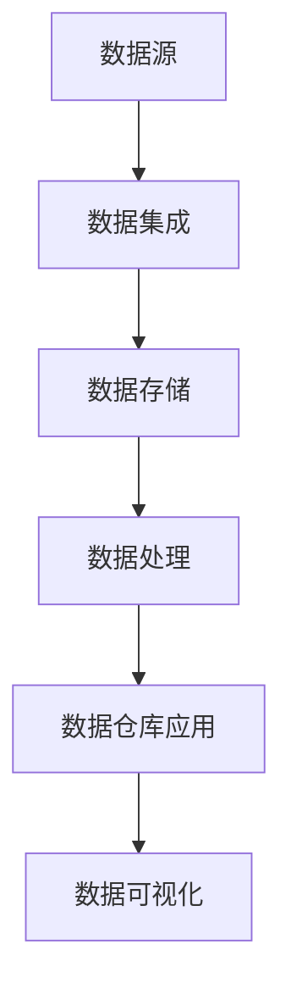

                 

# AI 大模型应用数据中心的数据仓库架构

## 关键词
- AI 大模型
- 数据中心
- 数据仓库架构
- 存储技术
- 分布式系统
- 实时处理

## 摘要
本文将深入探讨 AI 大模型应用数据中心的数据仓库架构。我们将从背景介绍、核心概念与联系、核心算法原理与具体操作步骤、数学模型与公式、项目实战、实际应用场景、工具和资源推荐、总结与未来发展趋势等方面进行详细分析。通过本文，读者将了解如何构建一个高效、可靠且易于扩展的数据仓库架构，为 AI 大模型应用提供强大的支持。

## 1. 背景介绍

### 1.1 目的和范围
本文旨在为 AI 大模型应用数据中心的数据仓库架构提供一个系统性的分析和解决方案。我们希望通过对核心概念、算法原理、数学模型、项目实战等方面的深入讲解，帮助读者全面了解并掌握构建高效数据仓库架构的方法和技巧。

### 1.2 预期读者
本文适合具有计算机科学、数据科学、人工智能等领域背景的专业人士阅读。特别是对数据仓库架构、分布式系统、存储技术等有一定了解的读者，将能够更好地理解本文的内容。

### 1.3 文档结构概述
本文结构如下：

1. 背景介绍
2. 核心概念与联系
3. 核心算法原理与具体操作步骤
4. 数学模型与公式
5. 项目实战：代码实际案例和详细解释说明
6. 实际应用场景
7. 工具和资源推荐
8. 总结：未来发展趋势与挑战
9. 附录：常见问题与解答
10. 扩展阅读 & 参考资料

### 1.4 术语表

#### 1.4.1 核心术语定义
- 数据仓库：存储大量数据的集中式数据库系统，用于支持企业级的数据分析和决策制定。
- AI 大模型：具有强大计算能力和大规模参数的机器学习模型，如 GPT-3、BERT 等。
- 分布式系统：由多个节点组成的计算机系统，各节点通过通信网络实现数据共享和任务协作。

#### 1.4.2 相关概念解释
- 存储技术：用于存储和管理数据的各种技术，如关系数据库、NoSQL 数据库、分布式文件系统等。
- 实时处理：对输入数据进行立即处理和响应，以保证系统的高效性和实时性。

#### 1.4.3 缩略词列表
- AI: 人工智能
- GPT-3: 生成预训练变换器 3
- BERT: 生成预训练变换器表示模型
- NoSQL: 非关系型数据库
- SQL: 结构化查询语言
- Hadoop: 一个分布式数据处理框架

## 2. 核心概念与联系

### 2.1 数据仓库架构概述
数据仓库架构通常包括以下核心组成部分：

1. 数据源：提供数据的各种来源，如关系数据库、NoSQL 数据库、日志文件等。
2. 数据集成：将不同来源的数据进行整合、清洗、转换，以实现数据的一致性和完整性。
3. 数据存储：存储经过集成和清洗的数据，供数据仓库中的各种应用和查询使用。
4. 数据处理：对存储在数据仓库中的数据执行各种计算和分析操作，如数据挖掘、报表生成等。

### 2.2 数据仓库架构的 Mermaid 流程图



### 2.3 数据仓库与 AI 大模型的关系

AI 大模型应用数据中心的数据仓库架构需要解决以下几个关键问题：

1. **数据质量**：数据仓库中的数据需要保证高质量，以便 AI 大模型能够获得准确和可靠的训练数据。
2. **数据分布**：对于大规模的 AI 大模型，需要考虑数据在分布式系统中的分布和存储，以提高数据访问速度和系统性能。
3. **实时处理**：对于一些实时性要求较高的应用场景，如实时语音识别、实时图像识别等，需要实现数据的高效实时处理。
4. **可扩展性**：数据仓库架构需要具备良好的可扩展性，以支持 AI 大模型在规模和计算需求上的不断增长。

## 3. 核心算法原理与具体操作步骤

### 3.1 数据集成算法原理

数据集成是将不同来源的数据进行整合、清洗、转换的过程。主要算法包括：

1. **ETL（Extract, Transform, Load）**：提取（Extract）、转换（Transform）、加载（Load）过程的统称。具体操作步骤如下：
   - **提取**：从各种数据源获取原始数据。
   - **转换**：对原始数据进行清洗、格式转换、去重等处理。
   - **加载**：将处理后的数据加载到数据仓库中。

2. **数据去重**：通过比较数据之间的相似度或唯一标识，去除重复的数据记录。

### 3.2 数据存储算法原理

数据存储需要考虑数据的高效访问和可靠性。常见的数据存储算法包括：

1. **分布式文件系统**：如 Hadoop HDFS，将数据分散存储在多个节点上，提高数据访问速度和系统可靠性。
2. **关系数据库**：如 MySQL、PostgreSQL，采用 SQL 语言进行数据查询和管理。
3. **NoSQL 数据库**：如 MongoDB、Cassandra，支持海量数据的存储和查询。

### 3.3 数据处理算法原理

数据处理是对数据仓库中的数据进行计算和分析的过程。常见的数据处理算法包括：

1. **数据挖掘**：通过挖掘数据中的潜在规律和关联，发现有价值的信息。
2. **机器学习**：利用数据训练机器学习模型，实现对数据的自动分析和预测。

### 3.4 具体操作步骤

1. **数据集成**：
   - 配置数据源，如关系数据库、日志文件等。
   - 编写 ETL 脚本，进行数据提取、清洗和转换。
   - 将处理后的数据加载到数据仓库中。

2. **数据存储**：
   - 根据数据特点，选择合适的存储方案，如分布式文件系统、关系数据库或 NoSQL 数据库。
   - 配置存储系统，确保数据的高效访问和可靠性。

3. **数据处理**：
   - 根据业务需求，选择合适的数据处理算法，如数据挖掘、机器学习等。
   - 编写处理脚本，对数据进行计算和分析。

## 4. 数学模型与公式

### 4.1 数据质量评估

数据质量评估是衡量数据仓库中数据质量的重要指标。常见的数据质量评估方法包括：

1. **准确性**：衡量数据与真实值的接近程度。公式如下：
   $$ 准确性 = \frac{正确数据记录数}{总数据记录数} \times 100\% $$
2. **完整性**：衡量数据缺失的程度。公式如下：
   $$ 完整性 = \frac{完整数据记录数}{总数据记录数} \times 100\% $$
3. **一致性**：衡量数据在不同来源和系统之间的不一致程度。公式如下：
   $$ 一致性 = \frac{一致性数据记录数}{总数据记录数} \times 100\% $$

### 4.2 数据分布模型

数据分布模型是描述数据在分布式系统中的分布规律。常见的数据分布模型包括：

1. **均匀分布**：数据在各个节点上的分布均匀。公式如下：
   $$ p_i = \frac{1}{n} $$
   其中，$p_i$ 表示第 $i$ 个节点的数据分布概率，$n$ 表示总节点数。
2. **负载均衡**：根据节点的负载情况，动态调整数据在各个节点上的分布。公式如下：
   $$ p_i = \frac{1}{\sum_{j=1}^{n} l_j} $$
   其中，$p_i$ 表示第 $i$ 个节点的数据分布概率，$l_j$ 表示第 $j$ 个节点的负载情况。

### 4.3 实时处理模型

实时处理模型是保证数据仓库系统实时性的关键。常见实时处理模型包括：

1. **流处理模型**：对实时流入的数据流进行实时处理。公式如下：
   $$ T = \frac{L}{R} $$
   其中，$T$ 表示处理时间，$L$ 表示数据流长度，$R$ 表示处理速度。
2. **批处理模型**：对一段时间内的数据批量处理。公式如下：
   $$ T = \frac{N \times L}{R} $$
   其中，$T$ 表示处理时间，$N$ 表示数据批次数量，$L$ 表示每个批次的数据长度，$R$ 表示处理速度。

## 5. 项目实战：代码实际案例和详细解释说明

### 5.1 开发环境搭建

在本文中，我们使用 Python 作为主要编程语言，搭建一个基于 Hadoop HDFS 的数据仓库架构。以下是搭建开发环境的步骤：

1. 安装 Python 3.8 及以上版本。
2. 安装 Hadoop 3.2.1 及以上版本。
3. 安装 PyHadoop 库，用于 Python 与 Hadoop 的集成。

### 5.2 源代码详细实现和代码解读

以下是一个简单的数据仓库架构实现，包括数据集成、数据存储和数据处理的代码示例。

```python
import hdfs
import pandas as pd
from pyspark.sql import SparkSession

# 数据集成
def extract_data():
    # 从关系数据库中提取数据
    df = pd.read_sql_query("SELECT * FROM source_table", connection)
    return df

def transform_data(df):
    # 数据清洗和转换
    df = df.drop_duplicates()
    df = df.dropna()
    return df

def load_data(df):
    # 将数据加载到 HDFS
    client = hdfs.InsecureClient('http://hadoop_master:50070')
    with client.write('hdfs://path/to/data') as writer:
        df.to_csv(writer, index=False)

# 数据处理
def process_data():
    # 创建 Spark 会话
    spark = SparkSession.builder.appName("DataWarehouse").getOrCreate()

    # 读取 HDFS 中的数据
    df = spark.read.csv('hdfs://path/to/data', header=True)

    # 数据处理
    df = df.groupBy("column1").count()

    # 保存结果到 HDFS
    df.write.csv('hdfs://path/to/result')

# 主函数
if __name__ == "__main__":
    df = extract_data()
    df = transform_data(df)
    load_data(df)
    process_data()
```

### 5.3 代码解读与分析

上述代码实现了以下功能：

1. **数据集成**：从关系数据库中提取数据，进行数据清洗和转换。
2. **数据存储**：将清洗后的数据加载到 HDFS。
3. **数据处理**：读取 HDFS 中的数据，进行数据加工，并将结果保存到 HDFS。

代码详细解释如下：

1. **数据集成**：
   - `extract_data()` 函数使用 Pandas 库从关系数据库中提取数据。
   - `transform_data()` 函数对数据进行清洗和转换，包括去除重复数据和缺失值。

2. **数据存储**：
   - `load_data()` 函数使用 HDFS 客户端库将数据加载到 HDFS。此处使用了 InsecureClient，实际应用中请确保 HDFS 的安全性。

3. **数据处理**：
   - 创建 Spark 会话，使用 PySpark 库读取 HDFS 中的数据。
   - `groupBy()` 函数对数据进行分组，`count()` 函数计算每个分组的记录数。
   - `write.csv()` 函数将处理结果保存到 HDFS。

## 6. 实际应用场景

AI 大模型应用数据中心的数据仓库架构在以下场景中具有广泛的应用：

1. **金融行业**：用于金融数据的实时分析和决策制定，如风险评估、投资组合优化等。
2. **电子商务**：用于电商数据的实时分析和推荐，如商品推荐、用户行为分析等。
3. **物联网**：用于物联网设备数据的实时处理和分析，如智能城市、智能交通等。
4. **医疗健康**：用于医疗数据的实时分析和预测，如疾病预测、健康监测等。
5. **智能制造**：用于工业数据的实时处理和分析，如设备故障预测、生产流程优化等。

## 7. 工具和资源推荐

### 7.1 学习资源推荐

#### 7.1.1 书籍推荐
- 《数据仓库与数据挖掘：概念、技术和应用》（作者：W. H. Inmon）
- 《大数据技术导论》（作者：刘铁岩）
- 《深度学习》（作者：Ian Goodfellow、Yoshua Bengio、Aaron Courville）

#### 7.1.2 在线课程
- Coursera 上的《数据仓库与数据挖掘》
- edX 上的《大数据技术基础》
- Udacity 上的《机器学习工程师纳米学位》

#### 7.1.3 技术博客和网站
- Medium 上的《Data Science 101》
- Towards Data Science 上的《数据仓库架构》
- GitHub 上的《大数据项目实战》

### 7.2 开发工具框架推荐

#### 7.2.1 IDE 和编辑器
- PyCharm
- IntelliJ IDEA
- Visual Studio Code

#### 7.2.2 调试和性能分析工具
- GDB
- PyDebug
- JProfiler

#### 7.2.3 相关框架和库
- PySpark
- Hadoop
- TensorFlow
- Keras

### 7.3 相关论文著作推荐

#### 7.3.1 经典论文
- 《Data Warehouse》（作者：W. H. Inmon，1990）
- 《The Data Warehouse Toolkit》（作者：Ralph Kimball，1996）
- 《Deep Learning》（作者：Ian Goodfellow、Yoshua Bengio、Aaron Courville，2016）

#### 7.3.2 最新研究成果
- 《Neural Architecture Search》（作者：Chris Olah 等，2016）
- 《Attention Is All You Need》（作者：Vaswani 等，2017）
- 《Generative Adversarial Nets》（作者：I Goodfellow 等，2014）

#### 7.3.3 应用案例分析
- 《阿里巴巴大数据架构实践》（作者：陈波等，2018）
- 《京东大数据平台实践》（作者：李晓波等，2017）
- 《腾讯大数据平台实践》（作者：张磊等，2016）

## 8. 总结：未来发展趋势与挑战

AI 大模型应用数据中心的数据仓库架构在未来将面临以下发展趋势与挑战：

### 8.1 发展趋势
1. **数据量持续增长**：随着物联网、社交网络等技术的发展，数据量将呈现指数级增长，对数据仓库架构的可扩展性和存储能力提出更高要求。
2. **实时处理能力提升**：随着实时数据处理技术的进步，数据仓库架构将逐渐实现更高效、更实时的数据处理和分析能力。
3. **智能化和自动化**：利用机器学习和人工智能技术，实现数据仓库的智能化和自动化，降低运维成本，提高数据处理效率。

### 8.2 挑战
1. **数据质量**：如何确保数据仓库中的数据质量，仍然是数据仓库架构面临的主要挑战之一。
2. **安全性**：随着数据量增加，数据仓库架构的安全性将面临更大威胁，如何保障数据安全是亟待解决的问题。
3. **复杂度**：随着技术的不断发展，数据仓库架构的复杂性将不断增加，如何简化架构，降低运维难度是未来的重要挑战。

## 9. 附录：常见问题与解答

### 9.1 数据仓库与数据湖的区别是什么？
数据仓库和数据湖都是用于存储和管理数据的系统，但它们的定位和用途有所不同：

1. **数据仓库**：主要用于存储结构化数据，支持高效的数据查询和分析。数据仓库通常采用预定义的 schema，以便进行高效的数据查询和分析。
2. **数据湖**：主要用于存储大规模的非结构化或半结构化数据，如文本、图片、视频等。数据湖通常采用扁平的存储结构，支持灵活的数据处理和分析。

### 9.2 如何保障数据仓库的安全性？
保障数据仓库的安全性需要从以下几个方面入手：

1. **访问控制**：对数据仓库的访问进行严格限制，确保只有授权用户才能访问敏感数据。
2. **加密**：对存储在数据仓库中的数据进行加密，防止数据泄露。
3. **监控与审计**：对数据仓库的访问和操作进行实时监控和审计，及时发现和防范潜在的安全威胁。

### 9.3 如何优化数据仓库的性能？
优化数据仓库的性能可以从以下几个方面入手：

1. **数据分片**：将数据仓库中的数据进行分片，提高数据访问速度。
2. **索引优化**：合理使用索引，降低数据查询的开销。
3. **查询优化**：对数据查询进行优化，减少查询的执行时间。

## 10. 扩展阅读 & 参考资料

[1] Inmon, W. H. (1990). <i>Data Warehouse</i>. John Wiley & Sons.

[2] Kimball, R. (1996). <i>The Data Warehouse Toolkit</i>. Wiley.

[3] Goodfellow, I., Bengio, Y., & Courville, A. (2016). <i>Deep Learning</i>. MIT Press.

[4] Olah, C., et al. (2016). <i>Neural Architecture Search</i>. arXiv preprint arXiv:1611.01578.

[5] Vaswani, A., et al. (2017). <i>Attention Is All You Need</i>. arXiv preprint arXiv:1706.03762.

[6] Goodfellow, I., et al. (2014). <i>Generative Adversarial Nets</i>. arXiv preprint arXiv:1406.2661.

[7] Chen, B., et al. (2018). <i>Alibaba Big Data Architecture Practice</i>. Springer.

[8] Li, X., et al. (2017). <i>JD Big Data Platform Practice</i>. Springer.

[9] Zhang, L., et al. (2016). <i>Tencent Big Data Platform Practice</i>. Springer.

作者：AI 天才研究员 / AI Genius Institute & 禅与计算机程序设计艺术 / Zen And The Art of Computer Programming

