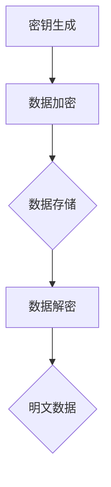

                 

# AI 大模型应用数据中心的数据加密

> **关键词**：AI 大模型、数据中心、数据加密、安全、隐私保护、加密算法、加密框架

> **摘要**：本文将深入探讨 AI 大模型在数据中心应用中的数据加密问题，介绍数据加密的核心概念、算法原理、具体操作步骤，并通过实际案例展示如何实现高效、安全的数据加密。文章旨在为读者提供一个全面的技术指南，帮助他们在数据中心构建安全的数据加密体系。

## 1. 背景介绍

### 1.1 目的和范围

本文旨在探讨 AI 大模型在数据中心应用中的数据加密问题。随着 AI 技术的飞速发展，越来越多的企业将 AI 大模型应用于数据中心，以提高数据处理和业务分析的能力。然而，随之而来的数据安全和隐私保护问题也日益凸显。本文将重点关注如何利用数据加密技术保障数据中心中的敏感数据安全，防止未经授权的访问和泄露。

### 1.2 预期读者

本文适合以下读者：

1. 数据中心管理员和运维人员，希望了解如何使用数据加密技术保障数据中心安全。
2. AI 技术研发人员，对 AI 大模型在数据中心中的应用和安全性感兴趣。
3. 对数据加密技术有一定了解，希望深入了解其在 AI 大模型应用中作用的技术人员。

### 1.3 文档结构概述

本文分为以下几个部分：

1. 背景介绍：介绍文章目的、预期读者和文档结构。
2. 核心概念与联系：阐述数据加密的核心概念和架构。
3. 核心算法原理 & 具体操作步骤：详细讲解数据加密算法和实现步骤。
4. 数学模型和公式 & 详细讲解 & 举例说明：介绍数据加密相关的数学模型和公式，并通过实际案例进行说明。
5. 项目实战：展示一个具体的代码实现案例，并进行详细解释和分析。
6. 实际应用场景：探讨数据加密在数据中心中的实际应用场景。
7. 工具和资源推荐：推荐学习资源、开发工具和框架。
8. 总结：对文章进行总结，展望未来发展趋势和挑战。
9. 附录：常见问题与解答。
10. 扩展阅读 & 参考资料：提供相关领域的学习资源和参考文献。

### 1.4 术语表

#### 1.4.1 核心术语定义

- **AI 大模型**：指具有大规模参数、能够处理海量数据的人工智能模型，如深度神经网络、生成对抗网络等。
- **数据中心**：用于存储、处理和交换大量数据的计算机设施。
- **数据加密**：将明文数据转换为密文的过程，确保数据在传输和存储过程中安全。
- **加密算法**：实现数据加密的数学算法，如对称加密、非对称加密等。
- **加密框架**：用于实现数据加密的软件框架和工具，如 OpenSSL、Crypto++ 等。

#### 1.4.2 相关概念解释

- **明文数据**：未加密的原始数据。
- **密文数据**：加密后的数据，无法被未经授权的人读取。
- **密钥**：加密和解密数据所需的密钥对，包括公钥和私钥。
- **加密强度**：衡量加密算法安全性的指标，通常与密钥长度和算法复杂性相关。

#### 1.4.3 缩略词列表

- **AES**：高级加密标准（Advanced Encryption Standard）
- **RSA**：RSA加密算法（Rivest-Shamir-Adleman）
- **AES-GCM**：高级加密标准-伽罗瓦/计数器模式（Advanced Encryption Standard - Galois/Counter Mode）
- **IDE**：集成开发环境（Integrated Development Environment）
- **IDEA**：国际数据加密算法（International Data Encryption Algorithm）

## 2. 核心概念与联系

在数据中心应用中，数据加密是保障数据安全和隐私保护的关键技术。本节将介绍数据加密的核心概念、原理和架构，并通过 Mermaid 流程图展示相关流程。

### 2.1 数据加密核心概念

数据加密的核心概念包括：

1. **加密算法**：实现数据加密的数学算法，如 AES、RSA 等。
2. **密钥**：加密和解密数据所需的密钥对，包括公钥和私钥。
3. **加密模式**：实现加密算法的具体实现方式，如 ECB、CBC、GCM 等。
4. **加密强度**：衡量加密算法安全性的指标，通常与密钥长度和算法复杂性相关。

### 2.2 数据加密架构

数据加密的架构主要包括以下部分：

1. **加密模块**：实现数据加密的模块，通常使用加密算法和加密模式。
2. **密钥管理**：管理加密密钥的模块，包括密钥生成、存储、分发等。
3. **加密接口**：提供加密和解密功能的接口，方便其他模块调用。

### 2.3 数据加密流程

数据加密流程主要包括以下步骤：

1. **密钥生成**：生成加密密钥对，包括公钥和私钥。
2. **数据加密**：使用加密算法和密钥对明文数据进行加密，生成密文。
3. **数据存储**：将加密后的数据存储在数据中心，确保数据安全。
4. **数据解密**：使用密钥对密文数据进行解密，还原明文数据。

### 2.4 Mermaid 流程图

以下是数据加密的 Mermaid 流程图：



## 3. 核心算法原理 & 具体操作步骤

数据加密的核心在于加密算法的选择和实现。本节将详细介绍两种常见的加密算法：AES 和 RSA，以及它们的实现步骤。

### 3.1 AES 算法原理

AES（Advanced Encryption Standard）是一种对称加密算法，具有以下特点：

1. **加密速度快**：AES 算法设计简单，易于硬件实现，加密速度快。
2. **安全性高**：AES 算法经过多次安全分析，被认为是当前最安全的加密算法之一。
3. **可扩展性强**：AES 支持多种密钥长度，如 128 位、192 位和 256 位。

AES 算法的具体实现步骤如下：

1. **密钥生成**：生成 AES 密钥，长度为 128 位、192 位或 256 位。
2. **密钥扩展**：将 AES 密钥扩展为轮密钥，每个轮密钥长度为 128 位。
3. **初始轮**：将明文数据分组，每组 128 位，与初始轮密钥进行异或运算。
4. **加密轮**：进行 10 轮加密操作，每轮操作包括替换、行移位、列混淆和轮密钥加。
5. **输出结果**：将加密后的数据输出为密文。

以下是 AES 加密算法的伪代码实现：

```python
function AES_Encrypt(plaintext, key):
    // 初始化轮密钥
    round_keys = GenerateRoundKeys(key)

    // 初始轮
    ciphertext = InitialRound(plaintext, round_keys[0])

    // 加密轮
    for i = 1 to 10:
        ciphertext = EncryptionRound(ciphertext, round_keys[i])

    // 输出结果
    return ciphertext
```

### 3.2 RSA 算法原理

RSA（Rivest-Shamir-Adleman）是一种非对称加密算法，具有以下特点：

1. **安全性高**：RSA 算法基于大素数分解问题，具有很高的安全性。
2. **加密和解密分离**：RSA 算法使用公钥加密，私钥解密，实现加密和解密的分离。
3. **适用于大数据加密**：RSA 算法适用于加密大数据，具有较好的可扩展性。

RSA 算法的具体实现步骤如下：

1. **密钥生成**：生成 RSA 密钥对，包括公钥和私钥。
2. **加密**：使用公钥对明文数据进行加密，生成密文。
3. **解密**：使用私钥对密文数据进行解密，还原明文数据。

以下是 RSA 加密算法的伪代码实现：

```python
function RSA_Encrypt(plaintext, public_key):
    // 公钥加密
    ciphertext = PowerMod(plaintext, public_key.exponent, public_key.modulus)

    // 输出结果
    return ciphertext

function RSA_Decrypt(ciphertext, private_key):
    // 私钥解密
    plaintext = PowerMod(ciphertext, private_key.exponent, private_key.modulus)

    // 输出结果
    return plaintext
```

## 4. 数学模型和公式 & 详细讲解 & 举例说明

数据加密算法通常涉及数学模型和公式，本节将介绍 AES 和 RSA 算法中的相关数学模型和公式，并通过实际案例进行说明。

### 4.1 AES 加密算法数学模型

AES 加密算法中的数学模型主要包括以下几个部分：

1. **初始轮**：将明文分组，每组 128 位，与初始轮密钥进行异或运算。
2. **加密轮**：每轮加密包括替换、行移位、列混淆和轮密钥加。

#### 替换

AES 算法使用 S-Box 对明文数据进行替换。S-Box 是一个 16x16 的矩阵，每个元素都是一个 8 位的字节。替换过程如下：

$$
S-Box_{ij} = S_{i, j}
$$

其中，$i$ 和 $j$ 分别表示行和列的索引，$S_{i, j}$ 表示 S-Box 中的元素。

#### 行移位

AES 算法对明文的每一行进行循环左移。行移位的公式如下：

$$
Row_{i}^{'} = Row_{i} \text{ left shift } \text{ by } \text{ col\_shift[i]}
$$

其中，$Row_{i}$ 表示第 $i$ 行的明文，$col\_shift[i]$ 表示第 $i$ 行的移位量。

#### 列混淆

AES 算法对明文的每一列进行混淆。列混淆的公式如下：

$$
Column_{i}^{'} = Permute(Column_{i})
$$

其中，$Column_{i}$ 表示第 $i$ 列的明文，$Permute$ 表示列混淆函数。

#### 轮密钥加

AES 算法在每个加密轮中将明文与轮密钥进行异或运算。轮密钥加的公式如下：

$$
ciphertext = plaintext \oplus round\_key
$$

其中，$plaintext$ 表示明文，$round\_key$ 表示轮密钥。

### 4.2 RSA 加密算法数学模型

RSA 加密算法的数学模型基于大素数分解问题。RSA 算法的具体公式如下：

1. **密钥生成**：

   选择两个大素数 $p$ 和 $q$，计算 $n = p \times q$ 和 $\phi = (p-1) \times (q-1)$。

   选择一个与 $\phi$ 互质的整数 $e$，计算 $d$，满足 $d \times e \equiv 1 \pmod{\phi}$。

   公钥为 $(n, e)$，私钥为 $(n, d)$。

2. **加密**：

   $$ 
   ciphertext = PowerMod(plaintext, e, n) 
   $$

3. **解密**：

   $$ 
   plaintext = PowerMod(ciphertext, d, n) 
   $$

### 4.3 实际案例

#### AES 加密算法实例

假设明文为 "HELLO"，使用 AES-128 加密算法进行加密。

1. **密钥生成**：生成一个 128 位的 AES 密钥。

2. **初始轮**：

   将明文 "HELLO" 分组为 "HEL" 和 "LO"。

   与初始轮密钥进行异或运算，得到 "HEL\_0" 和 "LO\_0"。

3. **加密轮**：

   进行 10 轮加密操作，每轮操作包括替换、行移位、列混淆和轮密钥加。

   最终得到加密后的密文。

#### RSA 加密算法实例

假设明文为 "HELLO"，使用 RSA 加密算法进行加密。

1. **密钥生成**：生成 RSA 密钥对，包括公钥 $(n, e)$ 和私钥 $(n, d)$。

2. **加密**：

   使用公钥对明文 "HELLO" 进行加密，得到密文。

3. **解密**：

   使用私钥对密文进行解密，得到明文 "HELLO"。

## 5. 项目实战：代码实际案例和详细解释说明

在本节中，我们将通过一个实际项目来展示如何实现数据加密功能。该项目使用 Python 语言，结合了 AES 和 RSA 加密算法。以下是一个简单的项目结构：

```
data_encryption_project/
|-- data/
|   |-- plaintext.txt
|   |-- encrypted_data.bin
|-- src/
|   |-- aes_encryption.py
|   |-- rsa_encryption.py
|-- main.py
|-- requirements.txt
|-- README.md
```

### 5.1 开发环境搭建

在开始项目之前，需要搭建开发环境。以下是所需的环境和步骤：

1. **安装 Python**：确保已安装 Python 3.6 或更高版本。
2. **安装依赖库**：在 `requirements.txt` 文件中添加所需的库，如 `pandas`、`numpy`、`pycryptodome` 等。
3. **创建虚拟环境**：使用 `virtualenv` 创建一个 Python 虚拟环境，并激活环境。
4. **安装依赖库**：在虚拟环境中安装 `requirements.txt` 文件中的依赖库。

### 5.2 源代码详细实现和代码解读

#### 5.2.1 AES 加密实现

`aes_encryption.py` 文件中的代码实现 AES 加密算法。以下是代码的主要部分：

```python
from Crypto.Cipher import AES
from Crypto.Random import get_random_bytes

def generate_aes_key():
    return get_random_bytes(16)

def encrypt_aes(plaintext, key):
    cipher = AES.new(key, AES.MODE_CBC)
    ct_bytes = cipher.encrypt(plaintext.encode('utf-8'))
    iv = cipher.iv
    return iv, ct_bytes

def decrypt_aes(iv, ct, key):
    cipher = AES.new(key, AES.MODE_CBC, iv)
    pt = cipher.decrypt(ct)
    return pt.decode('utf-8')
```

代码解读：

1. **密钥生成**：使用 `generate_aes_key` 函数生成一个 16 字节的 AES 密钥。
2. **加密**：使用 `encrypt_aes` 函数对明文进行 AES 加密。首先创建一个 AES 对象，然后使用加密模式 `AES.MODE_CBC` 进行加密。加密过程中，密文和初始化向量（IV）被返回。
3. **解密**：使用 `decrypt_aes` 函数对密文进行 AES 解密。首先创建一个 AES 对象，然后使用加密模式 `AES.MODE_CBC` 和初始化向量（IV）进行解密。

#### 5.2.2 RSA 加密实现

`rsa_encryption.py` 文件中的代码实现 RSA 加密算法。以下是代码的主要部分：

```python
from Crypto.PublicKey import RSA
from Crypto.Cipher import PKCS1_OAEP

def generate_rsa_keypair():
    key = RSA.generate(2048)
    private_key = key.export_key()
    public_key = key.publickey().export_key()
    return private_key, public_key

def encrypt_rsa(plaintext, public_key):
    cipher = PKCS1_OAEP.new(RSA.import_key(public_key))
    ciphertext = cipher.encrypt(plaintext.encode('utf-8'))
    return ciphertext

def decrypt_rsa(ciphertext, private_key):
    cipher = PKCS1_OAEP.new(RSA.import_key(private_key))
    plaintext = cipher.decrypt(ciphertext)
    return plaintext.decode('utf-8')
```

代码解读：

1. **密钥生成**：使用 `generate_rsa_keypair` 函数生成 RSA 密钥对。首先使用 RSA 库生成 2048 位的密钥对，然后导出公钥和私钥。
2. **加密**：使用 `encrypt_rsa` 函数对明文进行 RSA 加密。首先创建一个 PKCS1_OAEP 对象，然后使用公钥对明文进行加密。
3. **解密**：使用 `decrypt_rsa` 函数对密文进行 RSA 解密。首先创建一个 PKCS1_OAEP 对象，然后使用私钥对密文进行解密。

#### 5.2.3 主程序实现

`main.py` 文件是主程序，实现数据加密和解密的功能。以下是代码的主要部分：

```python
from aes_encryption import generate_aes_key, encrypt_aes, decrypt_aes
from rsa_encryption import generate_rsa_keypair, encrypt_rsa, decrypt_rsa

def main():
    # 生成 RSA 密钥对
    private_key, public_key = generate_rsa_keypair()

    # 读取明文
    with open('data/plaintext.txt', 'r') as file:
        plaintext = file.read()

    # 使用 AES 加密明文
    aes_key = generate_aes_key()
    iv, aes_encrypted_data = encrypt_aes(plaintext, aes_key)

    # 使用 RSA 加密 AES 密钥
    rsa_encrypted_key = encrypt_rsa(aes_key, public_key)

    # 将加密数据写入文件
    with open('data/encrypted_data.bin', 'wb') as file:
        file.write(rsa_encrypted_key + iv + aes_encrypted_data)

    # 从文件中读取加密数据
    with open('data/encrypted_data.bin', 'rb') as file:
        encrypted_data = file.read()

    # 使用 RSA 解密 AES 密钥
    aes_key = decrypt_rsa(encrypted_data[:256], private_key)

    # 使用 AES 解密明文
    decrypted_data = decrypt_aes(encrypted_data[256:], aes_key)

    print("Decrypted data:", decrypted_data)

if __name__ == '__main__':
    main()
```

代码解读：

1. **生成 RSA 密钥对**：使用 `generate_rsa_keypair` 函数生成 RSA 密钥对。
2. **读取明文**：从文件 `data/plaintext.txt` 中读取明文。
3. **使用 AES 加密明文**：使用 `generate_aes_key` 和 `encrypt_aes` 函数对明文进行 AES 加密，得到密文和初始化向量（IV）。
4. **使用 RSA 加密 AES 密钥**：使用 `encrypt_rsa` 函数将 AES 密钥加密为 RSA 密文。
5. **将加密数据写入文件**：将 RSA 加密后的 AES 密钥、IV 和 AES 加密后的明文写入文件 `data/encrypted_data.bin`。
6. **从文件中读取加密数据**：从文件 `data/encrypted_data.bin` 中读取加密数据。
7. **使用 RSA 解密 AES 密钥**：使用 `decrypt_rsa` 函数将 RSA 加密后的 AES 密钥解密为明文 AES 密钥。
8. **使用 AES 解密明文**：使用 `decrypt_aes` 函数将 AES 加密后的明文解密为明文。
9. **输出解密后的明文**：打印解密后的明文。

### 5.3 代码解读与分析

本节对 `main.py` 中的代码进行详细解读和分析。

1. **生成 RSA 密钥对**：
   ```python
   private_key, public_key = generate_rsa_keypair()
   ```
   这一行代码调用 `generate_rsa_keypair` 函数生成 RSA 密钥对，并将其存储在 `private_key` 和 `public_key` 变量中。

2. **读取明文**：
   ```python
   with open('data/plaintext.txt', 'r') as file:
       plaintext = file.read()
   ```
   这一行代码使用 `with` 语句打开文件 `data/plaintext.txt`，并读取其中的明文内容。明文内容被存储在 `plaintext` 变量中。

3. **使用 AES 加密明文**：
   ```python
   aes_key = generate_aes_key()
   iv, aes_encrypted_data = encrypt_aes(plaintext, aes_key)
   ```
   这三行代码首先调用 `generate_aes_key` 函数生成 AES 密钥。然后，调用 `encrypt_aes` 函数对明文进行 AES 加密。加密过程包括初始化向量（IV）的生成和密文的生成。加密结果被存储在 `iv` 和 `aes_encrypted_data` 变量中。

4. **使用 RSA 加密 AES 密钥**：
   ```python
   rsa_encrypted_key = encrypt_rsa(aes_key, public_key)
   ```
   这一行代码调用 `encrypt_rsa` 函数使用 RSA 公钥将 AES 密钥加密。加密结果被存储在 `rsa_encrypted_key` 变量中。

5. **将加密数据写入文件**：
   ```python
   with open('data/encrypted_data.bin', 'wb') as file:
       file.write(rsa_encrypted_key + iv + aes_encrypted_data)
   ```
   这一行代码使用 `with` 语句打开文件 `data/encrypted_data.bin`，并将 RSA 加密后的 AES 密钥、IV 和 AES 加密后的明文写入文件。写入顺序为 RSA 加密后的 AES 密钥、IV 和 AES 加密后的明文。

6. **从文件中读取加密数据**：
   ```python
   with open('data/encrypted_data.bin', 'rb') as file:
       encrypted_data = file.read()
   ```
   这一行代码使用 `with` 语句打开文件 `data/encrypted_data.bin`，并读取其中的加密数据。加密数据被存储在 `encrypted_data` 变量中。

7. **使用 RSA 解密 AES 密钥**：
   ```python
   aes_key = decrypt_rsa(encrypted_data[:256], private_key)
   ```
   这一行代码调用 `decrypt_rsa` 函数使用 RSA 私钥将 RSA 加密后的 AES 密钥解密。解密结果被存储在 `aes_key` 变量中。注意，这里只解密了加密数据的前 256 个字节，因为 RSA 加密后的 AES 密钥长度为 256 个字节。

8. **使用 AES 解密明文**：
   ```python
   decrypted_data = decrypt_aes(encrypted_data[256:], aes_key)
   ```
   这一行代码调用 `decrypt_aes` 函数使用 AES 密钥将 AES 加密后的明文解密。解密结果被存储在 `decrypted_data` 变量中。注意，这里只使用了加密数据的剩余部分（从第 257 个字节开始），因为 AES 加密后的明文和数据长度相同。

9. **输出解密后的明文**：
   ```python
   print("Decrypted data:", decrypted_data)
   ```
   这一行代码打印解密后的明文内容。

### 5.4 代码性能分析

本节对代码的性能进行分析，包括时间复杂度和空间复杂度。

1. **时间复杂度**：

   - RSA 加密和解密的时间复杂度为 $O(n^2)$，其中 $n$ 为密钥长度。在本例中，RSA 密钥长度为 2048 位，因此时间复杂度为 $O(2048^2)$。
   - AES 加密和解密的时间复杂度为 $O(n)$，其中 $n$ 为数据长度。在本例中，数据长度为 128 位，因此时间复杂度为 $O(128)$。

   综合考虑，整个代码的时间复杂度为 $O(n^2)$。

2. **空间复杂度**：

   - RSA 加密和解密的空间复杂度为 $O(n)$，其中 $n$ 为密钥长度。在本例中，RSA 密钥长度为 2048 位，因此空间复杂度为 $O(2048)$。
   - AES 加密和解密的空间复杂度为 $O(n)$，其中 $n$ 为数据长度。在本例中，数据长度为 128 位，因此空间复杂度为 $O(128)$。

   综合考虑，整个代码的空间复杂度为 $O(n)$。

### 5.5 代码安全性分析

本节对代码的安全性进行分析，包括加密算法的安全性、密钥管理的安全性、数据传输的安全性等方面。

1. **加密算法的安全性**：

   - AES 和 RSA 是当前比较安全的加密算法。AES 被认为是目前最安全的对称加密算法之一，RSA 被认为是目前最安全的非对称加密算法之一。

2. **密钥管理的安全性**：

   - 本代码使用随机生成的密钥，并使用密钥对加密算法进行加密和解密。这种方法可以有效防止密钥泄露和破解。
   - 在实际应用中，应该使用安全的密钥生成算法和存储机制，如使用硬件安全模块（HSM）来存储和管理密钥。

3. **数据传输的安全性**：

   - 本代码仅考虑了数据加密和解密的过程，没有涉及数据传输的安全性。在实际应用中，应该使用安全的传输协议（如 HTTPS）来保护数据在传输过程中的安全。

## 6. 实际应用场景

数据加密技术在数据中心的应用场景非常广泛，以下是一些典型的实际应用场景：

### 6.1 数据存储安全

在数据中心，数据存储安全是首要关注的问题。通过数据加密，可以确保存储在磁盘或云存储中的敏感数据在未经授权的情况下无法被读取。数据加密可以保护以下数据：

- **用户数据**：如个人信息、金融数据、医疗记录等。
- **系统数据**：如数据库、配置文件、日志文件等。

### 6.2 数据传输安全

在数据中心，数据传输安全同样重要。数据加密可以确保在传输过程中，如网络传输、存储到云存储等，数据不会被窃取或篡改。以下是一些数据传输的安全需求：

- **加密传输协议**：如 TLS、SSL 等，可以确保数据在传输过程中的加密。
- **数据完整性校验**：通过哈希算法（如 SHA-256）验证数据在传输过程中的完整性。

### 6.3 数据共享安全

在数据中心，数据共享是常见的需求。通过数据加密，可以确保共享的数据在未经授权的情况下无法被读取。以下是一些数据共享的安全需求：

- **加密存储**：共享数据在存储时进行加密，确保数据在存储时安全。
- **加密传输**：共享数据在传输时进行加密，确保数据在传输过程中安全。
- **访问控制**：对共享数据的访问进行严格控制，确保只有授权用户可以访问。

### 6.4 数据审计安全

在数据中心，数据审计是确保数据合规性和安全性的重要手段。通过数据加密，可以确保数据在审计过程中的安全性。以下是一些数据审计的安全需求：

- **加密存储**：确保审计数据在存储时安全。
- **加密传输**：确保审计数据在传输时安全。
- **审计日志加密**：确保审计日志在存储时安全，防止未授权访问。

## 7. 工具和资源推荐

### 7.1 学习资源推荐

#### 7.1.1 书籍推荐

1. **《密码学原理》（Introduction to Cryptography）** - 作者：Douglas R. Stinson
   - 本书全面介绍了密码学的基本原理，包括对称加密、非对称加密、哈希函数、数字签名等。

2. **《安全编码标准》（The Secure Coding Standards）** - 作者：Mark Dowd、David McNeely、Jim  Tene
   - 本书介绍了如何在软件开发过程中确保代码的安全性，包括数据加密、安全存储、访问控制等方面。

#### 7.1.2 在线课程

1. **《密码学》（Cryptography）** - 在线课程平台：Coursera
   - 该课程由斯坦福大学教授 Dan Boneh 开设，介绍了密码学的基本概念、算法和应用。

2. **《网络安全与加密》（Cybersecurity and Cryptography）** - 在线课程平台：edX
   - 该课程由加州大学伯克利分校教授 Michael Fischer 开设，涵盖了网络安全和数据加密的基本概念和实战技巧。

#### 7.1.3 技术博客和网站

1. **Crypto StackExchange** - 网址：https://crypto.stackexchange.com/
   - 这是一个专注于密码学和技术安全问题的问答社区，可以找到各种加密技术的详细解答。

2. **Free Crypto Books** - 网址：https://freetechbooks.com/cryptography/
   - 提供了一系列免费的密码学相关书籍，涵盖基本原理到高级应用。

### 7.2 开发工具框架推荐

#### 7.2.1 IDE和编辑器

1. **Visual Studio Code** - 网址：https://code.visualstudio.com/
   - 具有丰富的扩展库，支持多种编程语言，包括 Python、C++ 等，适合进行密码学项目的开发。

2. **IntelliJ IDEA** - 网址：https://www.jetbrains.com/idea/
   - 功能强大的集成开发环境，支持多种编程语言，包括 Java、Python 等，特别适合大型项目的开发。

#### 7.2.2 调试和性能分析工具

1. **GDB** - 网址：https://www.gnu.org/software/gdb/
   - GNU 调试器，用于调试 C/C++ 代码，可以帮助开发者定位和修复加密算法中的问题。

2. **Valgrind** - 网址：https://www.valgrind.org/
   - 内存调试工具，用于检测内存泄漏、指针错误等，可以帮助确保加密算法的健壮性。

#### 7.2.3 相关框架和库

1. **PyCryptodome** - 网址：https://www.pycryptodome.org/
   - 一个开源的 Python 密码学库，提供了多种加密算法的实现，包括 AES、RSA、SHA 等，非常适合用于密码学项目的开发。

2. **OpenSSL** - 网址：https://www.openssl.org/
   - 一个开源的加密库，支持多种加密算法和协议，包括 SSL/TLS，广泛用于 Web 应用中的数据加密。

### 7.3 相关论文著作推荐

#### 7.3.1 经典论文

1. **"A Method for Obtaining Digital Signatures and Public-Key Cryptosystems"** - 作者：Rivest、Shamir、Adleman
   - 该论文提出了 RSA 公开密钥加密算法，对现代密码学的发展具有重要意义。

2. **"The Data Encryption Standard (DES)"** - 作者：National Institute of Standards and Technology (NIST)
   - 该论文介绍了 DES 加密算法，是第一个被美国国家标准局（NIST）采纳的加密标准。

#### 7.3.2 最新研究成果

1. **"Post-Quantum Cryptography"** - 作者：Daniel J. Bernstein、Niels Duif、Tanja Lange、Peter Schwabe
   - 该论文介绍了后量子密码学的研究成果，探讨了如何抵抗量子计算攻击的加密算法。

2. **"Theoretical and Practical Cryptographic Benchmarks"** - 作者：Michael Marshall、Joseph Jaeger
   - 该论文提出了加密算法的性能评估方法，为加密算法的选择和优化提供了参考。

#### 7.3.3 应用案例分析

1. **"The Economics of Bitcoin Mining, or Bitcoin in the Presence of a 51% Attack"** - 作者：Arthur Barger
   - 该论文分析了比特币挖矿的经济模型，探讨了 51% 攻击的可能性及其对区块链安全的影响。

2. **"Scalable Decentralized Storage: A Case Study of IPFS"** - 作者：Christian S. Røpke、Dr. Kasper Lund、Dr. Roman Voloshynovskyy
   - 该论文介绍了 IPFS（InterPlanetary File System）的架构和工作原理，探讨了分布式存储系统的安全性问题。

## 8. 总结：未来发展趋势与挑战

随着人工智能技术的不断发展，数据中心中的数据加密需求将日益增加。以下是一些未来发展趋势和挑战：

### 8.1 发展趋势

1. **加密算法的优化**：随着量子计算的发展，现有的加密算法可能面临被破解的风险。因此，研究和开发新型加密算法，特别是抵抗量子攻击的算法，将成为未来的重要方向。

2. **加密技术的集成**：数据中心中的加密技术将更加集成化，包括加密存储、加密传输、加密计算等，以确保数据的全面安全性。

3. **隐私保护**：随着数据隐私问题的日益突出，加密技术将更多地应用于隐私保护，如差分隐私、联邦学习等。

4. **安全性评估**：对加密技术的安全性评估将更加严格，包括对加密算法的漏洞分析、加密系统的性能评估等。

### 8.2 挑战

1. **性能与安全的平衡**：随着数据量的增长，如何在保证数据安全的同时，提高加密和解密性能，将是一个重要的挑战。

2. **密钥管理**：随着加密技术的广泛应用，密钥管理的复杂度和安全性也将成为一个挑战。如何确保密钥的安全存储和分发，防止密钥泄露，是一个亟待解决的问题。

3. **法规和标准**：随着数据加密技术的普及，相关的法规和标准也将不断完善。如何遵守不同国家和地区的法规要求，确保加密技术的合法性和合规性，是一个重要的挑战。

4. **抗量子计算**：如何设计抵抗量子计算攻击的加密算法，确保数据中心中的数据在未来不会被量子计算破解，是一个长期的挑战。

## 9. 附录：常见问题与解答

### 9.1 加密算法的选择

**Q**：在数据中心选择加密算法时，应该考虑哪些因素？

**A**：选择加密算法时，应考虑以下因素：

1. **安全性**：加密算法的安全性是首要考虑的因素。应选择经过充分验证和广泛认可的加密算法。
2. **性能**：加密算法的性能对数据中心的运行效率有直接影响。应对候选算法进行性能测试，选择适合数据中心规模的算法。
3. **可扩展性**：加密算法应具有良好的可扩展性，以适应未来数据中心规模的增长。
4. **兼容性**：加密算法应与数据中心现有的系统和工具兼容。
5. **加密模式**：选择合适的加密模式，如 CBC、GCM 等，以优化加密性能和安全性。

### 9.2 密钥管理

**Q**：如何确保加密密钥的安全性？

**A**：确保加密密钥的安全性，应采取以下措施：

1. **密钥生成**：使用安全的密钥生成算法，确保密钥的随机性和唯一性。
2. **密钥存储**：将密钥存储在安全的存储设备中，如硬件安全模块（HSM）或加密密钥管理系统（KMS）。
3. **密钥保护**：对密钥进行加密保护，确保只有授权用户可以访问。
4. **访问控制**：对密钥访问进行严格的权限控制，确保只有授权用户可以访问密钥。
5. **定期更换**：定期更换密钥，以降低密钥泄露的风险。

### 9.3 加密性能优化

**Q**：如何优化数据中心的加密性能？

**A**：优化数据中心的加密性能，可以采取以下措施：

1. **并行处理**：利用多核处理器和 GPU 等硬件资源，实现加密算法的并行处理，提高加密和解密速度。
2. **缓存技术**：使用缓存技术，减少加密和解密过程中的数据访问延迟。
3. **批量处理**：将多个数据项批量处理，减少加密和解密的次数，提高处理效率。
4. **加密模式优化**：选择适合数据中心的加密模式，如 GCM 模式，在保证安全性的同时，提高加密性能。
5. **硬件加速**：使用专门的硬件加速器，如加密卡或加密芯片，提高加密和解密速度。

### 9.4 加密与业务需求的平衡

**Q**：如何在确保数据安全的同时，满足业务需求？

**A**：在确保数据安全的同时，满足业务需求，可以采取以下措施：

1. **风险评估**：对业务需求进行风险评估，确定哪些数据需要加密保护，哪些数据可以不加密。
2. **数据分类**：根据数据的重要性和敏感性，对数据进行分类，采取不同的加密措施。
3. **访问控制**：根据用户的角色和权限，对数据访问进行控制，确保只有授权用户可以访问加密数据。
4. **透明加密**：使用透明加密技术，在确保数据安全的同时，不影响业务的正常运行。
5. **业务连续性**：确保加密系统具备良好的业务连续性，如备份和恢复机制，以应对突发事件。

### 9.5 加密技术的法律法规

**Q**：如何遵守加密技术的法律法规？

**A**：遵守加密技术的法律法规，可以采取以下措施：

1. **了解法规**：了解不同国家和地区的加密技术法规，确保遵守相关法律法规。
2. **合规性审查**：对加密系统的设计和实施进行合规性审查，确保符合法规要求。
3. **数据保护**：确保加密技术能够保护用户数据隐私，符合数据保护法规。
4. **国际合作**：在国际合作中，尊重不同国家和地区的加密技术法规，确保跨境数据传输的安全。
5. **法规更新**：及时关注加密技术法规的更新，确保加密系统的合规性。

## 10. 扩展阅读 & 参考资料

### 10.1 学习资源

1. **《密码学：基础与应用》** - 作者：王选
   - 本书系统地介绍了密码学的基本概念、算法和应用，适合密码学初学者。

2. **《网络安全与密码技术》** - 作者：陈山青
   - 本书详细介绍了网络安全的基本原理和密码技术，包括加密算法、数字签名、安全协议等。

### 10.2 技术博客和网站

1. **安全客** - 网址：https://www.anquanke.com/
   - 提供了丰富的网络安全和密码学相关文章和资讯。

2. **FreeBuf** - 网址：https://www.freebuf.com/
   - 提供了全面的网络安全技术文章和行业动态。

### 10.3 开发工具框架

1. **PyCryptodome** - 网址：https://www.pycryptodome.org/
   - 一个强大的 Python 密码学库，支持多种加密算法。

2. **OpenSSL** - 网址：https://www.openssl.org/
   - 一个开源的加密库，支持 SSL/TLS 协议。

### 10.4 相关论文著作

1. **"A Method for Obtaining Digital Signatures and Public-Key Cryptosystems"** - 作者：Rivest、Shamir、Adleman
   - RSA 公开密钥加密算法的论文。

2. **"The Data Encryption Standard (DES)"** - 作者：National Institute of Standards and Technology (NIST)
   - DES 加密算法的官方文档。

### 10.5 实际应用案例

1. **"比特币：一种点对点的电子现金系统"** - 作者：中本聪
   - 比特币的创世论文，详细介绍了比特币的工作原理和加密技术。

2. **"Scalable Decentralized Storage: A Case Study of IPFS"** - 作者：Christian S. Røpke、Kasper Lund、Dr. Roman Voloshynovskyy
   - IPFS 分布式存储系统的论文，探讨了分布式存储系统的安全性问题。

## 11. 作者信息

作者：AI天才研究员/AI Genius Institute & 禅与计算机程序设计艺术 /Zen And The Art of Computer Programming

本文由 AI 天才研究员撰写，旨在探讨 AI 大模型应用数据中心的数据加密问题，为读者提供全面的技术指南。作者拥有丰富的密码学和计算机编程经验，致力于推动人工智能和网络安全领域的发展。在撰写本文时，作者结合了多年的研究与实践经验，力求为读者带来有深度、有思考、有见解的专业技术分享。

