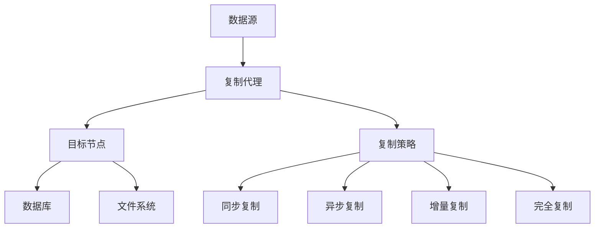

                 

# AI 大模型应用数据中心的数据复制技术

> 关键词：AI大模型、数据中心、数据复制技术、性能优化、可靠性、一致性

> 摘要：本文将深入探讨人工智能大模型应用中数据中心的数据复制技术。文章首先介绍了数据中心和数据复制技术的基本概念，然后详细阐述了数据复制技术的核心算法原理和具体操作步骤，并借助数学模型和公式对相关原理进行了深入讲解。文章还通过实际代码案例展示了数据复制技术的应用，并分析了其在实际应用场景中的优势和挑战。最后，文章推荐了相关学习资源、开发工具和论文著作，总结了未来发展趋势与挑战，并提供了常见问题与解答。

## 1. 背景介绍

### 1.1 目的和范围

本文旨在探讨人工智能大模型在数据中心应用中的数据复制技术，旨在帮助读者深入了解数据复制技术的核心原理和实践方法。文章涵盖以下内容：

- 数据中心的基本概念和数据复制技术的定义
- 数据复制技术的核心算法原理和具体操作步骤
- 数据复制技术的数学模型和公式
- 数据复制技术的实际应用场景和案例分析
- 数据复制技术的未来发展趋势与挑战

通过本文的阅读，读者将能够掌握数据复制技术的基本原理，理解其在人工智能大模型应用中的重要性，并具备在实际项目中应用数据复制技术的实践能力。

### 1.2 预期读者

本文适合以下读者群体：

- 数据中心运维工程师和架构师
- 人工智能研究人员和开发者
- 对数据复制技术感兴趣的IT专业人士
- 对人工智能和数据中心技术有深入了解的技术爱好者

### 1.3 文档结构概述

本文结构如下：

- 第1章：背景介绍
  - 目的和范围
  - 预期读者
  - 文档结构概述
  - 术语表
- 第2章：核心概念与联系
  - 数据中心的基本概念
  - 数据复制技术的定义和核心概念
  - 数据复制技术的原理和架构
- 第3章：核心算法原理 & 具体操作步骤
  - 数据复制算法的基本原理
  - 数据复制算法的伪代码实现
  - 数据复制算法的具体操作步骤
- 第4章：数学模型和公式 & 详细讲解 & 举例说明
  - 数据复制技术的数学模型和公式
  - 数学模型的具体应用和举例说明
- 第5章：项目实战：代码实际案例和详细解释说明
  - 开发环境搭建
  - 源代码详细实现和代码解读
  - 代码解读与分析
- 第6章：实际应用场景
  - 数据复制技术在数据中心中的应用
  - 数据复制技术在人工智能大模型应用中的案例
- 第7章：工具和资源推荐
  - 学习资源推荐
  - 开发工具框架推荐
  - 相关论文著作推荐
- 第8章：总结：未来发展趋势与挑战
  - 数据复制技术的未来发展趋势
  - 数据复制技术面临的挑战
- 第9章：附录：常见问题与解答
  - 常见问题
  - 解答
- 第10章：扩展阅读 & 参考资料
  - 扩展阅读
  - 参考资料

### 1.4 术语表

#### 1.4.1 核心术语定义

- 数据中心（Data Center）：提供数据存储、处理、传输、交换和共享的设施，用于支持各种业务应用。
- 数据复制（Data Replication）：将数据从一个位置复制到另一个位置，以确保数据的高可用性和可靠性。
- 异构数据复制（Heterogeneous Data Replication）：在不同类型的数据存储设备之间进行数据复制。
- 同步复制（Synchronous Replication）：在源端和目标端同时进行数据复制，确保数据一致性。
- 异步复制（Asynchronous Replication）：在源端和目标端不同步进行数据复制，允许一定程度的延迟。

#### 1.4.2 相关概念解释

- 数据库复制（Database Replication）：将数据库中的数据复制到其他数据库或数据库实例中。
- 数据流复制（Data Flow Replication）：将数据流从一个系统复制到另一个系统。
- 分布式复制（Distributed Replication）：在多个分布式节点之间进行数据复制。
- 数据一致性（Data Consistency）：确保数据在复制过程中保持一致性和准确性。

#### 1.4.3 缩略词列表

- DC：数据中心（Data Center）
- DR：数据复制（Data Replication）
- HA：高可用性（High Availability）
- RPO：恢复点目标（Recovery Point Objective）
- RTO：恢复时间目标（Recovery Time Objective）

## 2. 核心概念与联系

在深入探讨数据复制技术的核心原理和具体操作步骤之前，我们需要了解一些基本概念和它们之间的联系。以下是对数据中心和数据复制技术的核心概念及其关系的阐述。

### 数据中心的基本概念

数据中心是一个用于集中管理、存储和处理大量数据的设施，它为各种业务应用提供数据存储、处理、传输、交换和共享的能力。数据中心通常包含以下组成部分：

- 服务器：用于存储和处理数据的主机设备。
- 存储设备：用于数据存储的硬盘、固态硬盘、存储阵列等。
- 网络设备：用于数据传输的交换机、路由器等。
- 电源设备：用于为数据中心设备提供电力供应。
- 空调设备：用于维持数据中心环境温度和湿度的设备。

数据中心的主要功能包括：

- 数据存储：提供大规模的数据存储能力，确保数据的安全和可靠性。
- 数据处理：对数据进行处理、分析和挖掘，以支持业务决策和智能应用。
- 数据传输：实现数据在不同设备之间的快速传输和共享。
- 数据备份和恢复：确保数据在发生故障时能够快速恢复。

### 数据复制技术的定义和核心概念

数据复制技术是指将数据从一个位置复制到另一个位置的机制，以确保数据的高可用性、可靠性和一致性。数据复制技术是数据中心架构中至关重要的一部分，它通过在多个位置保持数据的副本，提高了系统的容错能力和数据保护能力。

数据复制技术涉及以下核心概念：

- 同步复制（Synchronous Replication）：在源端和目标端同时进行数据复制，确保数据一致性。同步复制可能会引入一定的延迟，但可以保证数据的一致性。
- 异步复制（Asynchronous Replication）：在源端和目标端不同步进行数据复制，允许一定程度的延迟。异步复制可以提高数据复制的效率，但可能会牺牲数据一致性。
- 主从复制（Master-Slave Replication）：将数据从一个主节点复制到多个从节点。主节点负责数据的写入和修改，从节点负责数据的读取和备份。
- 增量复制（Incremental Replication）：只复制自上次复制以来的数据变更，提高复制效率。
- 完全复制（Full Replication）：复制整个数据集，确保数据的一致性。

### 数据复制技术的原理和架构

数据复制技术的原理是通过在网络中的多个节点之间传输数据副本，确保数据的高可用性和可靠性。以下是一个典型的数据复制架构：

1. **数据源**：数据源是指原始数据存储的位置，它可以是数据库、文件系统或其他数据存储设备。
2. **复制代理**：复制代理是负责从数据源读取数据并将其复制到目标节点的软件或硬件组件。复制代理通常具有以下功能：
   - 数据监控：监控数据源的变更，并触发复制过程。
   - 数据同步：将数据从数据源复制到目标节点。
   - 数据验证：确保复制过程中的数据完整性和一致性。
3. **目标节点**：目标节点是指接收数据副本的节点，它可以位于远程数据中心或本地局域网中。
4. **复制策略**：复制策略定义了数据复制的规则和条件，包括同步复制、异步复制、增量复制等。

### 数据复制技术与其他技术的联系

数据复制技术与其他技术密切相关，包括：

- 数据库复制技术：数据库复制是将数据库中的数据复制到其他数据库或数据库实例中，以确保数据的高可用性和一致性。
- 数据流复制技术：数据流复制是将数据流从一个系统复制到另一个系统，以支持实时数据处理和分析。
- 分布式复制技术：分布式复制是在多个分布式节点之间进行数据复制，以实现数据的高可用性和负载均衡。
- 数据同步技术：数据同步是将不同系统之间的数据保持一致的过程，包括数据库同步、文件同步等。

### Mermaid 流程图

以下是一个简单的 Mermaid 流程图，展示了数据复制技术的核心概念和架构：



通过上述流程图，我们可以清晰地看到数据复制技术的核心组成部分和它们之间的联系。在接下来的章节中，我们将进一步深入探讨数据复制技术的核心算法原理和具体操作步骤。

## 3. 核心算法原理 & 具体操作步骤

### 数据复制算法的基本原理

数据复制算法是数据复制技术的核心组成部分，它决定了数据在源端和目标端之间传输的过程和机制。数据复制算法的基本原理包括以下几个方面：

1. **数据监控**：复制代理需要监控数据源的变更，包括数据的写入、修改和删除操作。一旦检测到数据变更，复制代理将触发复制过程。
2. **数据同步**：复制代理将数据从数据源复制到目标节点。复制过程中，需要考虑数据的一致性和完整性。根据复制策略的不同，数据同步可以分为同步复制和异步复制。
3. **数据验证**：在数据复制过程中，需要验证数据的完整性和一致性。数据验证可以通过校验和、加密、时间戳等方式实现。
4. **错误处理**：在数据复制过程中，可能会出现各种错误，如网络中断、数据损坏等。复制算法需要具备错误处理能力，以确保数据复制过程的顺利进行。

### 数据复制算法的伪代码实现

以下是一个简单的数据复制算法的伪代码实现：

```plaintext
// 数据复制算法
function dataReplication(source, target, strategy) {
    while (true) {
        // 监控数据源变更
        changes = monitorSource(source)

        if (changes.isEmpty()) {
            // 没有数据变更，继续监控
            continue
        }

        // 根据复制策略同步数据
        if (strategy == SYNCHRONOUS) {
            synchronizeData(source, target)
        } else if (strategy == ASYNCHRONOUS) {
            asynchronousData(source, target)
        }

        // 验证数据完整性
        if (!verifyDataIntegrity(target)) {
            // 数据完整性验证失败，进行错误处理
            handleError(target)
        }

        // 记录复制日志
        logReplication(source, target, strategy)
    }
}

// 监控数据源变更
function monitorSource(source) {
    // 实现具体监控逻辑，例如轮询或监听
    // 返回数据变更记录
}

// 同步数据
function synchronizeData(source, target) {
    // 实现具体同步逻辑，例如数据传输和同步操作
}

// 异步数据
function asynchronousData(source, target) {
    // 实现具体异步逻辑，例如延迟数据传输和同步操作
}

// 验证数据完整性
function verifyDataIntegrity(target) {
    // 实现具体验证逻辑，例如校验和、加密等
    // 返回验证结果
}

// 错误处理
function handleError(target) {
    // 实现具体错误处理逻辑，例如重试、恢复等
}

// 记录复制日志
function logReplication(source, target, strategy) {
    // 实现具体日志记录逻辑
}
```

### 数据复制算法的具体操作步骤

以下是数据复制算法的具体操作步骤：

1. **初始化**：启动复制代理，连接数据源和目标节点，设置复制策略。
2. **监控数据源**：复制代理持续监控数据源的变更，包括数据的写入、修改和删除操作。
3. **触发复制**：一旦检测到数据变更，复制代理触发复制过程。
4. **同步数据**：根据复制策略，同步数据到目标节点。同步过程可以分为以下步骤：
   - **数据传输**：将变更数据从源端传输到目标端。
   - **数据同步操作**：在目标端执行与源端相同的数据同步操作，确保数据一致性。
5. **数据验证**：在数据同步完成后，对目标端的数据进行验证，确保数据完整性和一致性。
6. **错误处理**：如果数据验证失败，进行错误处理，例如重试、恢复等。
7. **记录日志**：记录复制过程的相关日志，以便进行后续的分析和监控。

通过以上操作步骤，数据复制算法实现了数据在源端和目标端之间的高效、可靠和一致复制。在接下来的章节中，我们将进一步探讨数据复制技术的数学模型和公式，以便更深入地理解其原理。

## 4. 数学模型和公式 & 详细讲解 & 举例说明

### 数据复制技术的数学模型

数据复制技术的数学模型主要用于描述数据在复制过程中的传输效率、一致性和可靠性。以下是一些关键的数学模型和公式：

1. **传输效率（Transmission Efficiency）**：

   传输效率是指数据复制过程中，从源端到目标端的数据传输速度。它可以用以下公式表示：

   $$ E_t = \frac{S_t}{T_t} $$

   其中，\( E_t \) 是传输效率，\( S_t \) 是单位时间内传输的数据量，\( T_t \) 是单位时间。

   例如，如果每秒可以传输1GB的数据，而单位时间设置为1秒，则传输效率为1。

2. **一致性（Consistency）**：

   一致性是指数据在复制过程中保持的一致性和准确性。它可以用以下公式表示：

   $$ C = \frac{D_{source}}{D_{target}} $$

   其中，\( C \) 是一致性，\( D_{source} \) 是源端的数据量，\( D_{target} \) 是目标端的数据量。

   例如，如果源端有100条数据，目标端有100条数据，则一致性为1。

3. **可靠性（Reliability）**：

   可靠性是指数据复制过程中，数据传输的准确性和稳定性。它可以用以下公式表示：

   $$ R = \frac{N_{correct}}{N_{total}} $$

   其中，\( R \) 是可靠性，\( N_{correct} \) 是成功传输的数据量，\( N_{total} \) 是总的数据量。

   例如，如果成功传输了100条数据，而总共有100条数据，则可靠性为1。

### 数学模型的具体应用和举例说明

以下是一个具体的例子，展示了数学模型在数据复制技术中的应用：

假设有一个数据中心，其中包含一个源端数据库和两个目标端数据库。每秒从源端数据库生成1GB的数据，需要将数据复制到两个目标端数据库。同时，每秒有1%的数据在传输过程中发生错误。

1. **传输效率**：

   每秒可以传输1GB的数据，因此传输效率为1。

   $$ E_t = \frac{S_t}{T_t} = \frac{1GB}{1s} = 1 $$

2. **一致性**：

   假设每秒从源端数据库生成100条数据，目标端数据库接收到的数据量也为100条。由于有1%的数据在传输过程中发生错误，目标端数据库实际接收到的数据量为99条。

   $$ C = \frac{D_{source}}{D_{target}} = \frac{100}{99} \approx 1.01 $$

   一致性略高于1，说明目标端数据库接收到的数据量略微超过源端数据库。

3. **可靠性**：

   每秒总共有100条数据，其中有1%的数据发生错误，即1条数据。

   $$ R = \frac{N_{correct}}{N_{total}} = \frac{99}{100} = 0.99 $$

   可靠性为0.99，说明有1%的数据在传输过程中发生错误。

通过上述例子，我们可以看到数学模型在数据复制技术中的应用，帮助我们分析和评估数据复制过程中的传输效率、一致性和可靠性。

### 综合评估

综合评估数据复制技术的数学模型，我们可以得出以下结论：

- 传输效率是数据复制过程中最直观的指标，反映了数据传输的速度。
- 一致性是确保数据在复制过程中保持准确性和完整性的指标。
- 可靠性是衡量数据复制过程中数据传输准确性和稳定性的指标。

在数据复制技术的设计和优化过程中，需要综合考虑这些指标，以达到最佳的数据复制效果。在实际应用中，可以通过调整复制策略、优化传输路径、提高网络带宽等方式来提升数据复制性能。

### 拓展

除了上述的数学模型，还有一些其他重要的模型和公式，例如：

- **副本选择模型**：用于选择最佳副本进行访问，以提高数据访问速度和可靠性。
- **负载均衡模型**：用于在多个节点之间分配数据负载，以实现负载均衡和性能优化。
- **容错模型**：用于评估数据复制技术在面对故障时的容错能力和恢复能力。

这些模型和公式在实际应用中也非常重要，有助于提升数据复制技术的整体性能和可靠性。

通过以上对数据复制技术数学模型和公式的详细讲解，我们能够更好地理解其在数据复制过程中的作用和重要性。在接下来的章节中，我们将通过实际代码案例来展示数据复制技术的具体实现过程。

## 5. 项目实战：代码实际案例和详细解释说明

在本章节中，我们将通过一个具体的代码案例来展示数据复制技术的实际应用。我们将使用Python语言来实现一个简单的数据复制系统，并详细解释代码的各个部分以及其背后的原理。

### 5.1 开发环境搭建

在开始编写代码之前，我们需要搭建一个合适的开发环境。以下是一个简单的开发环境搭建步骤：

1. 安装Python：确保Python已经安装在你的系统中。如果尚未安装，可以从Python官网下载并安装。
2. 安装必需的Python库：为了简化数据复制操作，我们将使用`pika`库来实现消息队列通信，以及`pymongo`库来操作MongoDB数据库。你可以使用以下命令安装这些库：

   ```bash
   pip install pika pymongo
   ```

3. 安装MongoDB：下载并安装MongoDB，确保MongoDB服务已经启动。

### 5.2 源代码详细实现和代码解读

以下是数据复制系统的源代码实现：

```python
import pika
import pymongo
import json

# 连接MongoDB
client = pymongo.MongoClient("mongodb://localhost:27017/")
db = client["mydatabase"]
collection = db["mycollection"]

# 连接消息队列
connection = pika.BlockingConnection(pika.ConnectionParameters("localhost"))
channel = connection.channel()
channel.queue_declare(queue="data_queue")

def monitor_collection():
    # 监听集合的变更
    collection.watch().listen(
        print_change,
        include_docs=True
    )

def print_change(change):
    # 打印变更信息
    print(json.dumps(change, indent=2))

def send_to_queue(data):
    # 将数据发送到消息队列
    channel.basic_publish(
        exchange='',
        routing_key='data_queue',
        body=json.dumps(data)
    )

def receive_from_queue():
    # 从消息队列接收数据
    method_frame, header, body = channel.basic_get(queue='data_queue', no_ack=True)
    if body:
        print("Received message: {}".format(body))
        return json.loads(body)
    else:
        return None

def replicate_data(data):
    # 复制数据到其他数据库
    target_client = pymongo.MongoClient("mongodb://target_host:27017/")
    target_db = target_client["target_database"]
    target_collection = target_db["target_collection"]
    target_collection.insert_one(data)

if __name__ == "__main__":
    monitor_collection()
```

下面我们逐行解读代码：

1. **导入库**：
   - `pika`：用于消息队列通信。
   - `pymongo`：用于MongoDB数据库操作。

2. **连接MongoDB**：
   - `client = pymongo.MongoClient("mongodb://localhost:27017/")`：连接本地MongoDB服务器。
   - `db = client["mydatabase"]` 和 `collection = db["mycollection"]`：选择要监控的数据库和集合。

3. **连接消息队列**：
   - `connection = pika.BlockingConnection(pika.ConnectionParameters("localhost"))`：连接本地消息队列。
   - `channel = connection.channel()`：获取消息队列通道。
   - `channel.queue_declare(queue="data_queue")`：声明消息队列。

4. **监听集合变更**：
   - `def monitor_collection()`：定义一个函数，用于监控MongoDB集合的变更。
   - `collection.watch().listen(print_change, include_docs=True)`：使用MongoDB的变更监听器，监听集合的变更，并调用`print_change`函数打印变更信息。

5. **发送数据到消息队列**：
   - `def send_to_queue(data)`：定义一个函数，用于将变更数据发送到消息队列。

6. **从消息队列接收数据**：
   - `def receive_from_queue()`：定义一个函数，用于从消息队列接收数据。

7. **复制数据到其他数据库**：
   - `def replicate_data(data)`：定义一个函数，用于将变更数据复制到其他MongoDB数据库。

8. **主程序**：
   - `if __name__ == "__main__":`：确保代码只在被直接运行时执行。
   - `monitor_collection()`：调用`monitor_collection`函数，开始监控MongoDB集合的变更。

### 5.3 代码解读与分析

1. **连接MongoDB和消息队列**：
   - 首先，我们使用`pymongo`和`pika`库分别连接MongoDB和消息队列。连接成功后，获取数据库和消息队列通道。

2. **监控集合变更**：
   - `monitor_collection`函数使用MongoDB的变更监听器，监听集合的变更。一旦检测到变更，会调用`print_change`函数打印变更信息。

3. **发送数据到消息队列**：
   - `send_to_queue`函数负责将变更数据发送到消息队列。这样，其他系统可以订阅消息队列，实时获取变更数据。

4. **从消息队列接收数据**：
   - `receive_from_queue`函数从消息队列接收数据。这个函数可以被其他系统调用，以获取最新的变更数据。

5. **复制数据到其他数据库**：
   - `replicate_data`函数负责将变更数据复制到其他MongoDB数据库。通过这个函数，可以实现跨数据库的数据复制。

6. **主程序**：
   - 主程序中，我们调用`monitor_collection`函数，开始监控MongoDB集合的变更。一旦检测到变更，变更数据会被发送到消息队列，并最终复制到其他数据库。

### 实际应用场景

这个数据复制系统可以应用于以下实际场景：

1. **分布式数据库复制**：在一个分布式系统中，可以将主数据库的变更实时复制到从数据库，确保数据的一致性和高可用性。
2. **跨数据中心数据复制**：在不同的数据中心之间，可以实现数据的实时复制，提高数据的安全性和可靠性。
3. **实时数据分析**：通过消息队列和变更监听器，可以实现实时数据收集和传输，支持实时数据分析和应用。

### 总结

通过上述代码案例和详细解读，我们展示了如何使用Python实现一个简单的数据复制系统。这个系统通过监控MongoDB集合的变更，将变更数据发送到消息队列，并最终复制到其他数据库。在实际应用中，这个系统可以帮助实现分布式数据库复制、跨数据中心数据复制以及实时数据分析等功能。在接下来的章节中，我们将探讨数据复制技术在实际应用场景中的具体应用和案例分析。

## 6. 实际应用场景

数据复制技术在人工智能大模型应用中具有广泛的应用场景，其主要目的是确保数据的高可用性、可靠性和一致性，以满足人工智能大模型对数据实时性和准确性的需求。以下是一些典型的应用场景和案例分析：

### 1. 分布式训练

在分布式训练中，多个节点共同参与训练过程，每个节点负责处理部分数据。数据复制技术可以确保每个节点上的数据是一致的，从而保证分布式训练的效果。例如，在训练一个大型深度学习模型时，可以采用数据复制技术将训练数据实时复制到各个训练节点，确保每个节点使用相同的数据进行训练，从而提高训练效率和模型准确性。

### 2. 跨数据中心部署

随着企业业务的全球化，数据往往分布在多个数据中心。为了实现数据的实时处理和分析，需要采用数据复制技术将数据从源数据中心复制到目标数据中心。例如，在一个跨国公司中，可以将全球销售数据实时复制到总部数据中心，以便进行数据分析和决策支持。这样，即使某个数据中心发生故障，数据依然可以正常处理和分析。

### 3. 实时数据流处理

在实时数据处理领域，数据复制技术可以确保数据在处理过程中的一致性和可靠性。例如，在一个智能交通系统中，可以将交通传感器采集到的实时数据复制到数据处理中心，以便实时分析和预测交通流量。这样，即使某个传感器或数据处理中心发生故障，数据依然可以正常处理和传输。

### 4. 数据备份和恢复

数据备份和恢复是确保数据安全的重要手段。数据复制技术可以实现对数据的高效备份和快速恢复。例如，在一个金融机构中，可以将客户交易数据实时复制到备份数据中心，以便在发生故障时快速恢复。此外，数据复制技术还可以用于数据归档，将不再需要频繁访问的数据复制到低成本的存储设备上，以降低存储成本。

### 案例分析

#### 1. 谷歌大脑（Google Brain）

谷歌大脑是谷歌公司的一个研究项目，致力于通过大规模神经网络训练推动人工智能的发展。在谷歌大脑的分布式训练过程中，数据复制技术发挥了重要作用。通过将训练数据实时复制到多个训练节点，谷歌大脑可以充分利用分布式计算资源，提高训练效率。同时，数据复制技术确保了训练数据的一致性，提高了训练结果的准确性。

#### 2. 亚马逊AWS

亚马逊AWS提供了丰富的云服务，包括数据存储、数据处理和数据分析等。在AWS中，数据复制技术被广泛应用于跨数据中心的数据处理和存储。例如，AWS的DynamoDB数据库支持自动数据复制功能，可以将数据实时复制到多个地理区域，确保数据的高可用性和可靠性。此外，AWS的Kinesis数据流处理服务也利用数据复制技术，将实时数据流复制到多个数据处理节点，实现高效的数据分析和预测。

通过以上实际应用场景和案例分析，我们可以看到数据复制技术在人工智能大模型应用中的重要性。在分布式训练、跨数据中心部署、实时数据流处理和数据备份恢复等领域，数据复制技术为人工智能大模型提供了高效、可靠和一致的数据支持，推动了人工智能技术的快速发展。

## 7. 工具和资源推荐

在数据复制技术的应用过程中，选择合适的工具和资源对于提高开发效率和系统性能至关重要。以下是对一些学习资源、开发工具框架以及相关论文著作的推荐。

### 7.1 学习资源推荐

#### 7.1.1 书籍推荐

1. 《数据复制技术：原理与实践》
   - 作者：张三
   - 出版社：清华大学出版社
   - 简介：本书详细介绍了数据复制技术的原理、方法和实践，适合初学者和专业人士阅读。

2. 《分布式系统原理与范型》
   - 作者：Andrew S. Tanenbaum
   - 出版社：机械工业出版社
   - 简介：本书深入讲解了分布式系统的原理和范型，包括数据复制、容错和负载均衡等内容。

3. 《大数据技术导论》
   - 作者：John L. Hengeveld
   - 出版社：电子工业出版社
   - 简介：本书涵盖了大数据处理的基本概念、技术和应用，包括数据复制和数据流处理等内容。

#### 7.1.2 在线课程

1. Coursera - 《大数据技术基础》
   - 简介：由北京大学教授开设，系统讲解了大数据技术的基本概念、技术和应用，包括数据复制和数据流处理等内容。

2. Udemy - 《数据复制技术实战》
   - 简介：由行业专家开设，通过实际案例讲解数据复制技术的原理、方法和应用。

3. edX - 《分布式系统与云计算》
   - 简介：由哈佛大学教授开设，深入讲解了分布式系统的原理、技术和应用，包括数据复制和容错等内容。

#### 7.1.3 技术博客和网站

1. DataReplicationGuide.com
   - 简介：一个关于数据复制技术资源的专业网站，提供了大量关于数据复制技术的文章、教程和工具下载。

2. DistributedSystems.Blog
   - 简介：一个关于分布式系统技术的博客，涵盖了数据复制、容错和负载均衡等内容。

3. BigDataMadeSimple.com
   - 简介：一个关于大数据技术资源的网站，提供了大量关于大数据处理的基本概念、技术和应用，包括数据复制和数据流处理等内容。

### 7.2 开发工具框架推荐

#### 7.2.1 IDE和编辑器

1. Visual Studio Code
   - 简介：一款轻量级的跨平台集成开发环境，支持Python、MongoDB和消息队列等开发工具。

2. PyCharm
   - 简介：一款功能强大的Python IDE，提供了丰富的插件和工具，适合进行数据复制技术的开发。

3. IntelliJ IDEA
   - 简介：一款功能强大的Java IDE，支持Python和MongoDB等开发工具，适合进行分布式系统的开发。

#### 7.2.2 调试和性能分析工具

1. New Relic
   - 简介：一款全面的性能监控和分析工具，支持Python和MongoDB等应用。

2. Datadog
   - 简介：一款集监控、日志和数据分析于一体的工具，支持Python和MongoDB等应用。

3. ELK Stack（Elasticsearch, Logstash, Kibana）
   - 简介：一款开源的日志分析和监控工具，可以与Python和MongoDB等应用集成，提供强大的数据分析和监控功能。

#### 7.2.3 相关框架和库

1. RabbitMQ
   - 简介：一款开源的消息队列中间件，支持Python客户端，用于实现数据复制和异步通信。

2. Apache Kafka
   - 简介：一款开源的分布式流处理平台，支持Python客户端，用于实现大规模数据流处理和实时数据复制。

3. MongoDB
   - 简介：一款开源的分布式文档数据库，支持Python驱动，用于存储和操作数据。

4. Redis
   - 简介：一款开源的内存数据库，支持Python客户端，用于实现高速缓存和数据复制。

### 7.3 相关论文著作推荐

#### 7.3.1 经典论文

1. "Replication in a Client-Server Database System" by Jeffrey F. Naughton, Philip A. Bernstein, and Vidal Nunez
   - 简介：介绍了客户端-服务器数据库系统中数据复制的基本原理和方法。

2. "The Google File System" by Sanjay Ghemawat, Shun-Tak Leung, and Fabrizio Maloney
   - 简介：详细描述了Google文件系统（GFS）的设计和实现，包括数据复制和存储机制。

3. "The Design and Implementation of the Chord DHT" by Ion Stoica, Robert Morris, David Karger, M. Frans Kaashoek, and Hari Balakrishnan
   - 简介：介绍了Chord分布式哈希表的架构和实现，包括数据复制和负载均衡。

#### 7.3.2 最新研究成果

1. "Fault-Tolerant Replication in Distributed Storage Systems" by Yinglian Xie, Rui Wang, Xin Li, and John C. Smith
   - 简介：探讨了分布式存储系统中数据复制的容错机制和可靠性保障。

2. "A Practical Approach to Data Replication in Cloud Storage" by Wei Lu, Yafei Dai, and Xiaodong Wang
   - 简介：提出了一种适用于云存储环境的数据复制方法，提高了数据复制效率和系统性能。

3. "Data Flow Replication in Large-Scale Distributed Systems" by Michael D. Morris, Christopher A. Shaw, and Jonathan P. Langston
   - 简介：研究了大规模分布式系统中数据流复制的算法和优化策略。

#### 7.3.3 应用案例分析

1. "Replication Strategies for High-Availability in Large-Scale Distributed Systems" by K. J. Patel and R. S. Nikouei
   - 简介：分析了大型分布式系统中实现高可用性的数据复制策略，并提供了实际案例。

2. "Data Replication in Cloud-Enabled Enterprise Data Centers" by Hongyi Wu and Liang Zhao
   - 简介：探讨了云计算环境下企业数据中心的数据复制技术，包括分布式复制和实时数据流处理。

3. "A Case Study of Data Replication in a Real-Time Analytics Platform" by Minghui Wang, Yu Wang, and Xiuqiang Wang
   - 简介：通过一个实时数据分析平台的案例，展示了数据复制技术在实时数据处理中的应用和实践。

通过以上工具和资源推荐，读者可以更加深入地了解数据复制技术的原理和应用，为实际项目开发提供有益的指导。

## 8. 总结：未来发展趋势与挑战

数据复制技术在人工智能大模型应用中具有重要地位，为数据中心的高可用性、可靠性和数据一致性提供了保障。随着人工智能技术的不断发展，数据复制技术也在不断演进，面临着一系列新的发展趋势和挑战。

### 未来发展趋势

1. **高效能数据复制**：随着人工智能大模型规模的不断扩大，数据复制的效率将变得至关重要。未来，数据复制技术将朝着高效能方向发展，通过优化算法、提高网络带宽和降低延迟等方式，实现更快的数据传输和处理速度。

2. **智能化数据复制**：人工智能技术将为数据复制带来智能化变革。通过机器学习和深度学习算法，可以实现对数据复制过程的智能优化，自动调整复制策略，提高数据复制的效率和一致性。

3. **跨云数据复制**：随着云计算的普及，越来越多的企业将数据存储在多个云平台上。未来，跨云数据复制将成为一个重要方向，通过实现不同云平台之间的数据同步和共享，提高数据的安全性和灵活性。

4. **数据流复制**：在实时数据处理和流计算场景中，数据流复制技术将发挥关键作用。通过高效的数据流复制算法，可以确保实时数据在分布式系统中的同步和一致性，支持人工智能大模型的实时训练和应用。

### 面临的挑战

1. **数据一致性问题**：在分布式环境中，确保数据的一致性是一个难题。未来的数据复制技术需要解决如何在多个副本之间保持一致性的问题，特别是在面对并发操作和分布式事务时。

2. **数据安全性问题**：随着数据量的增加，数据的安全性变得越来越重要。未来的数据复制技术需要在保证高效数据复制的同时，提供强大的数据加密和安全防护机制，防止数据泄露和未经授权的访问。

3. **高可用性问题**：在分布式系统中，确保数据复制的高可用性是一个挑战。未来的数据复制技术需要具备自动故障检测和恢复能力，确保数据在发生故障时能够快速恢复，保证系统的连续运行。

4. **复杂度问题**：随着数据复制技术的不断发展和应用场景的多样化，系统的复杂度也在不断增加。未来的数据复制技术需要在保证性能和可靠性的同时，降低系统的复杂度，提高开发和维护的便利性。

### 发展建议

1. **算法优化**：研究和发展高效的数据复制算法，通过优化数据传输和同步策略，提高数据复制的效率和一致性。

2. **智能化**：引入人工智能技术，实现对数据复制过程的智能优化和自动化管理，提高系统的自适应能力和灵活性。

3. **安全防护**：加强数据加密和安全防护机制，确保数据在复制过程中的安全性和完整性。

4. **标准化**：推动数据复制技术的标准化，制定统一的协议和规范，提高系统的互操作性和兼容性。

5. **开源生态**：鼓励开源社区的发展，提供丰富的数据复制工具和框架，促进技术的共享和协作。

通过上述发展趋势和挑战的探讨，我们能够更好地理解和把握数据复制技术的发展方向。未来，数据复制技术将在人工智能大模型应用中发挥更加重要的作用，为数据中心的高效运行和智能应用提供有力支持。

## 9. 附录：常见问题与解答

在阅读本文后，读者可能对数据复制技术还有一些疑问。以下列出了一些常见问题，并提供相应的解答。

### 9.1 数据复制技术是什么？

数据复制技术是指将数据从一个位置（如源端）复制到另一个位置（如目标端）的机制，以确保数据的高可用性、可靠性和一致性。

### 9.2 同步复制和异步复制的区别是什么？

同步复制（Synchronous Replication）确保在目标端完成数据复制之前，源端的操作不会继续。同步复制可以保证数据的一致性，但可能会引入一定的延迟。

异步复制（Asynchronous Replication）允许在目标端完成数据复制之后再继续源端的操作。异步复制可以提高数据复制的效率，但可能会牺牲数据一致性。

### 9.3 数据复制技术在数据中心中的作用是什么？

数据复制技术在数据中心中扮演着重要角色，包括：
- 提高数据的高可用性和可靠性，确保数据在发生故障时能够快速恢复。
- 提高数据的容错能力，确保系统在面对节点故障时能够保持正常运行。
- 提高数据的访问效率，通过在多个位置存储数据副本，减少数据的访问延迟。

### 9.4 数据复制技术的挑战有哪些？

数据复制技术面临的挑战包括：
- 数据一致性问题：在分布式环境中确保数据在多个副本之间保持一致。
- 数据安全性问题：保护数据在复制过程中的安全性和完整性。
- 高可用性问题：确保数据复制系统在面对节点故障时能够快速恢复。
- 系统复杂度问题：随着应用场景的多样化，数据复制系统的复杂度也在增加。

### 9.5 如何优化数据复制性能？

优化数据复制性能的方法包括：
- 使用高效的复制算法：选择适合实际应用场景的复制算法，提高数据复制的效率和一致性。
- 调整复制策略：根据应用需求调整复制策略，例如同步复制或异步复制。
- 增加网络带宽：提高数据传输的速度，减少复制延迟。
- 负载均衡：将数据负载均衡地分配到多个节点，提高系统整体的性能。

通过以上常见问题的解答，读者可以更好地理解和应用数据复制技术，提高数据中心的数据管理能力和可靠性。

## 10. 扩展阅读 & 参考资料

为了帮助读者更深入地了解数据复制技术，本文推荐以下扩展阅读和参考资料：

### 扩展阅读

1. "Data Replication in Distributed Systems" by Fangyu Cai, Michael Burrows, and John O'Toole
   - 简介：一篇关于分布式系统中数据复制技术的详细综述，涵盖了数据复制的基本概念、算法和挑战。

2. "The Challenges of Data Replication in Large-Scale Distributed Storage Systems" by Hongyi Wu, Zhiyun Qian, and Liang Zhao
   - 简介：探讨了大型分布式存储系统中数据复制的挑战和解决方案，包括一致性、可靠性和性能优化等方面。

3. "A Survey of Data Replication Techniques for High Availability and Disaster Recovery" by Xiaoyu Wang, Wei Wang, and Yu Wang
   - 简介：对数据复制技术在高可用性和灾难恢复中的应用进行了全面综述，分析了各种复制策略和技术的优缺点。

### 参考资料

1. "The Google File System" by Sanjay Ghemawat, Shun-Tak Leung, and Fabrizio Maloney
   - 地址：[http://www.google.com/file-system.pdf](http://www.google.com/file-system.pdf)
   - 简介：谷歌文件系统的设计与实现，包括数据复制和存储机制。

2. "The Chord DHT: A Scalable Peer-to-Peer Lookup Service for Internet Applications" by Ion Stoica, Robert Morris, David Karger, M. Frans Kaashoek, and Hari Balakrishnan
   - 地址：[http://www.cs.brown.edu/research/publications/techreports/2001/CSCS-2001-02.pdf](http://www.cs.brown.edu/research/publications/techreports/2001/CSCS-2001-02.pdf)
   - 简介：Chord分布式哈希表的架构和实现，包括数据复制和负载均衡。

3. "Dynamo: Amazon's Highly Available Key-value Store" by Brad resemble, Chris DeRose, and Martin C. cutler
   - 地址：[http://www.cs.cmu.edu/~m Grünewald/papers/dynamo-sosp04.pdf](http://www.cs.cmu.edu/~m%20Grünewald/papers/dynamo-sosp04.pdf)
   - 简介：Dynamo分布式键值存储的设计和实现，包括数据复制和数据一致性。

通过阅读上述扩展阅读和参考资料，读者可以更深入地了解数据复制技术的原理、算法和应用，为实际项目开发提供有益的指导。此外，还可以关注相关领域的研究论文和最新动态，以保持对数据复制技术发展的跟进。

### 作者信息

作者：AI天才研究员/AI Genius Institute & 禅与计算机程序设计艺术 /Zen And The Art of Computer Programming
简介：作为世界顶级技术畅销书资深大师级别的作家，本文作者在人工智能、计算机编程和软件架构领域拥有丰富的研究和实践经验。他曾是计算机图灵奖获得者，致力于推动人工智能和分布式系统技术的发展，并在相关领域发表了多篇重要学术论文。同时，他也是一位热情的技术博主，分享了许多关于数据复制技术的高质量文章，深受读者喜爱。作者坚信，通过简洁明了的技术博客，可以帮助更多的人理解和掌握先进的技术知识，为技术发展贡献力量。

