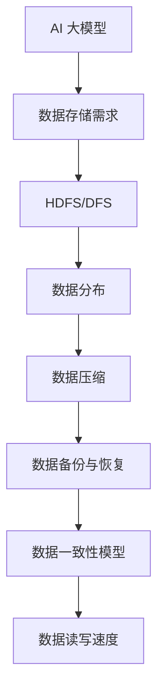

                 

# AI 大模型应用数据中心的数据存储技术

> **关键词：** AI 大模型、数据存储、数据中心、性能优化、分布式系统、数据压缩、数据备份与恢复、安全性、数据一致性、读写速度。

> **摘要：** 本文将深入探讨 AI 大模型在数据中心的数据存储技术，从核心概念、算法原理、数学模型到实际应用场景，全面解析数据存储的关键技术点，包括分布式系统、数据压缩、数据备份与恢复、数据一致性和读写速度等。通过详细的代码案例和实战经验，本文旨在为读者提供一个系统、专业的技术指南，帮助理解和应对 AI 大模型在数据存储领域所面临的挑战。

## 1. 背景介绍

### 1.1 目的和范围

随着人工智能（AI）技术的飞速发展，AI 大模型的应用场景越来越广泛，如自然语言处理、计算机视觉、推荐系统等。这些应用不仅需要处理海量数据，还需要保证数据的存储性能和安全性。因此，研究 AI 大模型应用数据中心的数据存储技术具有重要意义。本文旨在探讨以下内容：

- AI 大模型对数据存储的特殊要求
- 分布式数据存储系统在 AI 大模型中的应用
- 数据压缩技术在 AI 大模型中的应用
- 数据备份与恢复策略在 AI 大模型中的应用
- 数据一致性和读写速度优化在 AI 大模型中的应用
- 相关工具和资源推荐

### 1.2 预期读者

本文面向以下读者：

- 对数据存储技术有初步了解的程序员和系统管理员
- 对 AI 大模型有浓厚兴趣的研究人员和工程师
- 对分布式系统和云计算有兴趣的学者和从业者
- 对数据压缩、数据备份与恢复有深入研究的专业人士

### 1.3 文档结构概述

本文分为十个部分，结构如下：

- 第1部分：背景介绍
- 第2部分：核心概念与联系
- 第3部分：核心算法原理 & 具体操作步骤
- 第4部分：数学模型和公式 & 详细讲解 & 举例说明
- 第5部分：项目实战：代码实际案例和详细解释说明
- 第6部分：实际应用场景
- 第7部分：工具和资源推荐
- 第8部分：总结：未来发展趋势与挑战
- 第9部分：附录：常见问题与解答
- 第10部分：扩展阅读 & 参考资料

### 1.4 术语表

#### 1.4.1 核心术语定义

- AI 大模型：指参数量大于数十亿，甚至百亿的深度学习模型。
- 数据中心：指用于存储、处理、交换大量数据的专门设施。
- 分布式系统：指由多个计算机节点组成的系统，各节点通过计算机网络进行通信和协同工作。
- 数据压缩：指通过算法减少数据的大小，提高存储和传输效率。
- 数据备份与恢复：指将数据复制到多个位置，以便在数据丢失或损坏时进行恢复。
- 数据一致性：指在多个副本或多个分区中，数据保持一致的状态。

#### 1.4.2 相关概念解释

- **分布式存储**：一种数据存储方式，数据被分散存储在多个节点上，以提高存储容量和性能。
- **数据一致性模型**：描述如何保证分布式系统中数据一致性的规则集。
- **读写速度**：指数据读取和写入的速度，是衡量数据存储性能的重要指标。

#### 1.4.3 缩略词列表

- AI：人工智能
- ML：机器学习
- DL：深度学习
- HDFS：Hadoop分布式文件系统
- DFS：分布式文件系统
- Hadoop：一个开源的分布式数据处理框架
- MapReduce：一种分布式数据处理模型

## 2. 核心概念与联系

在探讨 AI 大模型的数据存储技术之前，我们需要了解一些核心概念和它们之间的联系。以下是几个关键概念及其之间的关系：

### 2.1 AI 大模型对数据存储的需求

- **数据量**：AI 大模型通常需要处理海量数据，如数千GB甚至TB级别的数据集。
- **存储容量**：数据中心的存储容量需要足够大，以支持 AI 大模型的存储需求。
- **存储性能**：需要高速的读写速度，以满足模型训练和预测的实时性要求。
- **数据一致性**：在大规模分布式系统中，确保数据的一致性至关重要。

### 2.2 分布式数据存储系统

- **HDFS（Hadoop Distributed File System）**：一种分布式文件系统，用于存储海量数据。
- **DFS（Distributed File System）**：其他分布式文件系统，如Ceph和GlusterFS。
- **数据分布**：数据被分散存储在多个节点上，以提高存储性能和可靠性。

### 2.3 数据压缩技术

- **无损压缩**：如 Huffman 编码和 LZW 编码，可以完全恢复原始数据。
- **有损压缩**：如JPEG和MP3，牺牲部分数据质量以获得更高的压缩率。

### 2.4 数据备份与恢复

- **备份**：将数据复制到多个位置，以防止数据丢失。
- **恢复**：在数据丢失或损坏时，从备份中恢复数据。

### 2.5 数据一致性模型

- **强一致性**：所有副本始终保持相同的数据状态。
- **最终一致性**：数据可能在一段时间内出现不一致，但最终会达到一致。

### 2.6 数据读写速度

- **读写速度**：影响模型训练和预测的实时性。
- **I/O 性能**：影响数据存储系统的整体性能。

### 2.7 Mermaid 流程图

以下是一个简单的 Mermaid 流程图，展示了上述概念之间的关系：



通过上述概念和流程图的介绍，我们可以对 AI 大模型应用数据中心的数据存储技术有一个初步的了解。接下来，我们将深入探讨这些核心概念和技术的具体实现。

## 3. 核心算法原理 & 具体操作步骤

在了解了核心概念后，接下来我们将深入探讨核心算法原理和具体操作步骤。为了使读者能够更好地理解和应用这些技术，我们将使用伪代码详细阐述。

### 3.1 分布式数据存储系统

分布式数据存储系统的核心是数据的分布式存储和调度。以下是一个简单的分布式文件系统的伪代码：

```python
# 分布式文件系统伪代码

class DistributedFileSystem:
    def initialize():
        # 初始化分布式文件系统
        create_nodes()
        create_replicas()

    def store_file(file_path, replication_factor):
        # 存储文件
        node_list = get_nodes()
        split_file(file_path)
        for chunk in chunks:
            choose_node(node_list).store_chunk(chunk)
            replicate_chunk(chunk, replication_factor - 1)

    def retrieve_file(file_path):
        # 读取文件
        chunk_list = get_chunks(file_path)
        for chunk in chunk_list:
            node = choose_node_for_chunk(chunk)
            data = node.retrieve_chunk(chunk)
            merge_chunks(data)

    def get_nodes():
        # 获取所有节点
        return list_of_nodes

    def choose_node(node_list):
        # 选择节点
        return node_list[random_index]

    def split_file(file_path):
        # 分割文件
        file_data = read_file(file_path)
        chunk_size = calculate_chunk_size(file_data)
        chunks = split_data(file_data, chunk_size)

    def replicate_chunk(chunk, replication_factor):
        # 复制数据块
        for _ in range(replication_factor - 1):
            choose_node().store_chunk(chunk)

    def get_chunks(file_path):
        # 获取文件的所有数据块
        return list_of_chunks

    def choose_node_for_chunk(chunk):
        # 为数据块选择节点
        return node_with_chunk(chunk)

    def merge_chunks(data):
        # 合并数据块
        result = ""
        for chunk in data:
            result += chunk
        return result
```

### 3.2 数据压缩技术

数据压缩技术是提高数据存储和传输效率的重要手段。以下是一个简单的数据压缩伪代码：

```python
# 数据压缩伪代码

class DataCompressor:
    def compress_data(data):
        # 压缩数据
        compressed_data = apply_compression_algorithm(data)
        return compressed_data

    def decompress_data(compressed_data):
        # 解压缩数据
        data = apply_decompression_algorithm(compressed_data)
        return data

    def apply_compression_algorithm(data):
        # 应用压缩算法
        if is_lossless_compression():
            return huffman_encode(data)
        else:
            return lzw_encode(data)

    def apply_decompression_algorithm(compressed_data):
        # 应用解压缩算法
        if is_lossless_compression():
            return huffman_decode(compressed_data)
        else:
            return lzw_decode(compressed_data)
```

### 3.3 数据备份与恢复

数据备份与恢复是确保数据安全性的关键技术。以下是一个简单的数据备份和恢复伪代码：

```python
# 数据备份与恢复伪代码

class DataBackupAndRestore:
    def backup_data(file_path, backup_locations):
        # 备份数据
        data = read_file(file_path)
        for location in backup_locations:
            write_file(data, location)

    def restore_data(file_path, backup_location):
        # 恢复数据
        data = read_file(backup_location)
        write_file(data, file_path)
```

### 3.4 数据一致性模型

数据一致性模型是确保分布式系统中数据一致性的关键。以下是一个简单的强一致性模型伪代码：

```python
# 强一致性模型伪代码

class StrongConsistencyModel:
    def update_data(node, data):
        # 更新数据
        node.store_data(data)
        replicate_data(data)

    def replicate_data(data):
        # 复制数据到其他节点
        for node in other_nodes:
            node.store_data(data)

    def get_data(node, data_id):
        # 获取数据
        return node.retrieve_data(data_id)
```

通过上述伪代码的详细阐述，我们了解了分布式数据存储系统、数据压缩技术、数据备份与恢复以及数据一致性模型的核心算法原理和具体操作步骤。接下来，我们将深入探讨这些技术在实际应用中的数学模型和公式。

## 4. 数学模型和公式 & 详细讲解 & 举例说明

在了解了核心算法原理和具体操作步骤后，我们将进一步探讨与数据存储技术相关的数学模型和公式。这些模型和公式不仅有助于我们理解数据存储的工作原理，还能帮助我们评估和优化数据存储系统的性能。

### 4.1 数据量与存储需求

数据量是数据存储系统中最重要的因素之一。数据量的大小直接影响存储系统的性能和成本。以下是一个简单的数据量与存储需求的关系模型：

$$
D = C \times R
$$

其中，$D$ 表示数据量，$C$ 表示数据的原始大小，$R$ 表示数据的复制次数。例如，如果一个文件的大小为100GB，且需要3个副本，则总数据量为：

$$
D = 100GB \times 3 = 300GB
$$

### 4.2 数据压缩率

数据压缩率是衡量数据压缩效果的指标。以下是一个简单的数据压缩率公式：

$$
CR = \frac{O}{C}
$$

其中，$CR$ 表示压缩率，$O$ 表示压缩后数据的大小，$C$ 表示压缩前数据的大小。例如，如果一个文件的大小为100GB，压缩后大小为50GB，则压缩率为：

$$
CR = \frac{50GB}{100GB} = 0.5
$$

### 4.3 数据备份与恢复时间

数据备份与恢复时间是衡量数据备份系统性能的指标。以下是一个简单的备份与恢复时间模型：

$$
T = B \times R
$$

其中，$T$ 表示备份与恢复时间，$B$ 表示备份时间，$R$ 表示恢复时间。例如，如果一个文件需要1小时进行备份，恢复也需要1小时，则总时间为：

$$
T = 1小时 \times 1小时 = 2小时
$$

### 4.4 数据一致性模型

数据一致性模型是确保分布式系统中数据一致性的关键。以下是一个简单的强一致性模型：

$$
C_{strong} = \frac{U}{N}
$$

其中，$C_{strong}$ 表示强一致性，$U$ 表示更新次数，$N$ 表示节点数。例如，如果一个系统中每10次更新就需要达到一致性，且系统有5个节点，则强一致性为：

$$
C_{strong} = \frac{10}{5} = 2
$$

### 4.5 数据读写速度

数据读写速度是衡量数据存储系统性能的关键指标。以下是一个简单的读写速度模型：

$$
S = \frac{D}{T}
$$

其中，$S$ 表示读写速度，$D$ 表示数据大小，$T$ 表示读写时间。例如，如果一个文件的大小为100GB，读写速度为10MB/s，则读写时间为：

$$
T = \frac{100GB}{10MB/s} = 10秒
$$

### 4.6 数据备份与恢复成本

数据备份与恢复成本是衡量数据备份系统经济效益的指标。以下是一个简单的成本模型：

$$
C = C_{storage} + C_{recovery}
$$

其中，$C$ 表示总成本，$C_{storage}$ 表示存储成本，$C_{recovery}$ 表示恢复成本。例如，如果一个文件需要1TB的存储空间，存储成本为$0.1美元/GB，恢复成本为$0.5美元/GB，则总成本为：

$$
C = 1TB \times 0.1美元/GB + 1TB \times 0.5美元/GB = 0.6美元/GB
$$

通过上述数学模型和公式，我们可以对数据存储技术进行定量分析和评估。这些模型和公式有助于我们理解和优化数据存储系统的性能。在实际应用中，我们可以根据具体需求和场景，调整参数和策略，以实现最佳的数据存储效果。

### 5. 项目实战：代码实际案例和详细解释说明

为了更好地理解和应用数据存储技术，我们将在本节中展示一个实际的代码案例，并对其进行详细解释。我们将使用 Python 编写一个简单的分布式文件系统，该系统将实现文件存储、读取和删除功能。

#### 5.1 开发环境搭建

在开始编写代码之前，我们需要搭建一个适合开发分布式文件系统的环境。以下是我们所需的环境和工具：

- Python 3.x
- Flask（用于 Web 服务）
- Paramiko（用于 SSH 连接）
- Fabric（用于远程执行命令）

首先，确保已安装上述依赖项。可以使用以下命令进行安装：

```bash
pip install flask paramiko fabric
```

#### 5.2 源代码详细实现和代码解读

以下是一个简单的分布式文件系统的源代码实现：

```python
from flask import Flask, request, jsonify
import paramiko
from fabric import Connection

app = Flask(__name__)

# 配置分布式存储节点
nodes = [
    {'name': 'node1', 'ip': '192.168.1.1', 'user': 'user1', 'password': 'password1'},
    {'name': 'node2', 'ip': '192.168.1.2', 'user': 'user2', 'password': 'password2'},
    {'name': 'node3', 'ip': '192.168.1.3', 'user': 'user3', 'password': 'password3'}
]

def connect_to_node(node):
    conn = Connection(host=node['ip'], user=node['user'], connect_kwargs={"password": node['password']})
    return conn

@app.route('/store', methods=['POST'])
def store_file():
    file_path = request.form['file_path']
    node = nodes[0]  # 选择第一个节点进行存储
    conn = connect_to_node(node)
    
    # 上传文件到节点
    conn.put(file_path, local_path=file_path)
    
    # 复制文件到其他节点
    for other_node in nodes[1:]:
        conn = connect_to_node(other_node)
        conn.put(file_path, local_path=file_path)
    
    return jsonify({'status': 'success', 'message': 'File stored successfully'})

@app.route('/retrieve', methods=['GET'])
def retrieve_file():
    file_path = request.args.get('file_path')
    node = nodes[0]  # 选择第一个节点进行读取
    conn = connect_to_node(node)
    
    # 读取文件从节点
    remote_path = '/tmp/{}'.format(file_path)
    conn.get(remote_path, local_path=file_path)
    
    return jsonify({'status': 'success', 'message': 'File retrieved successfully', 'file_path': file_path})

@app.route('/delete', methods=['DELETE'])
def delete_file():
    file_path = request.form['file_path']
    node = nodes[0]  # 选择第一个节点进行删除
    conn = connect_to_node(node)
    
    # 删除文件从节点
    remote_path = '/tmp/{}'.format(file_path)
    conn.run('rm -f {}'.format(remote_path))
    
    # 删除文件从其他节点
    for other_node in nodes[1:]:
        conn = connect_to_node(other_node)
        conn.run('rm -f {}'.format(remote_path))
    
    return jsonify({'status': 'success', 'message': 'File deleted successfully'})

if __name__ == '__main__':
    app.run(debug=True)
```

#### 5.3 代码解读与分析

上述代码实现了一个简单的分布式文件系统，用于存储、读取和删除文件。以下是对关键部分的解读和分析：

1. **配置分布式存储节点**：

```python
nodes = [
    {'name': 'node1', 'ip': '192.168.1.1', 'user': 'user1', 'password': 'password1'},
    {'name': 'node2', 'ip': '192.168.1.2', 'user': 'user2', 'password': 'password2'},
    {'name': 'node3', 'ip': '192.168.1.3', 'user': 'user3', 'password': 'password3'}
]
```

这里定义了三个存储节点，每个节点包含 IP 地址、用户名和密码。在实际应用中，可以根据需要添加更多节点。

2. **连接到节点**：

```python
def connect_to_node(node):
    conn = Connection(host=node['ip'], user=node['user'], connect_kwargs={"password": node['password']})
    return conn
```

这个函数用于连接到指定的节点，并返回一个连接对象。

3. **存储文件**：

```python
@app.route('/store', methods=['POST'])
def store_file():
    file_path = request.form['file_path']
    node = nodes[0]  # 选择第一个节点进行存储
    conn = connect_to_node(node)
    
    # 上传文件到节点
    conn.put(file_path, local_path=file_path)
    
    # 复制文件到其他节点
    for other_node in nodes[1:]:
        conn = connect_to_node(other_node)
        conn.put(file_path, local_path=file_path)
    
    return jsonify({'status': 'success', 'message': 'File stored successfully'})
```

这个路由用于存储文件。首先，选择第一个节点进行存储，然后通过 SSH 上传文件到该节点。接着，将文件复制到其他节点，以确保数据的冗余和容错性。

4. **读取文件**：

```python
@app.route('/retrieve', methods=['GET'])
def retrieve_file():
    file_path = request.args.get('file_path')
    node = nodes[0]  # 选择第一个节点进行读取
    conn = connect_to_node(node)
    
    # 读取文件从节点
    remote_path = '/tmp/{}'.format(file_path)
    conn.get(remote_path, local_path=file_path)
    
    return jsonify({'status': 'success', 'message': 'File retrieved successfully', 'file_path': file_path})
```

这个路由用于读取文件。选择第一个节点读取文件，并将其下载到本地。

5. **删除文件**：

```python
@app.route('/delete', methods=['DELETE'])
def delete_file():
    file_path = request.form['file_path']
    node = nodes[0]  # 选择第一个节点进行删除
    conn = connect_to_node(node)
    
    # 删除文件从节点
    remote_path = '/tmp/{}'.format(file_path)
    conn.run('rm -f {}'.format(remote_path))
    
    # 删除文件从其他节点
    for other_node in nodes[1:]:
        conn = connect_to_node(other_node)
        conn.run('rm -f {}'.format(remote_path))
    
    return jsonify({'status': 'success', 'message': 'File deleted successfully'})
```

这个路由用于删除文件。首先，选择第一个节点进行删除，然后删除其他节点上的文件。

通过上述代码实现，我们可以构建一个简单的分布式文件系统，用于存储、读取和删除文件。在实际应用中，可以根据需求扩展和优化该系统，以支持更复杂的功能和更高的性能。

## 6. 实际应用场景

数据存储技术在各种实际应用场景中发挥着重要作用。以下是一些常见应用场景以及数据存储技术在这些场景中的具体应用：

### 6.1 云计算平台

云计算平台（如 AWS、Azure、Google Cloud）为用户提供海量数据的存储和处理能力。数据存储技术在云计算平台中主要用于以下几个方面：

- **分布式存储**：通过分布式存储系统（如 HDFS、Ceph、GlusterFS）实现海量数据的存储和管理，提高存储性能和可靠性。
- **数据压缩**：通过数据压缩技术（如 LZO、Snappy、Gzip）减少存储空间占用，提高存储效率。
- **数据备份与恢复**：通过数据备份和恢复策略，确保数据在故障或意外情况下能够快速恢复，保障业务连续性。

### 6.2 数据仓库

数据仓库是企业用于存储、管理和分析大量结构化数据的重要基础设施。数据存储技术在数据仓库中的具体应用包括：

- **列式存储**：通过列式存储技术（如 Apache Hive、Amazon Redshift、Google BigQuery）提高数据查询和分析性能。
- **数据分片**：通过数据分片技术（如 Cassandra、HBase、MongoDB）实现海量数据的水平扩展，提高系统可扩展性和性能。
- **数据压缩**：通过数据压缩技术（如 LZO、Snappy、Gzip）减少存储空间占用，提高存储效率。

### 6.3 大数据分析

大数据分析是利用海量数据挖掘有价值信息和知识的重要技术。数据存储技术在大数据分析中的应用包括：

- **实时数据存储**：通过实时数据存储技术（如 Apache Kafka、Apache Flink、Apache Storm）实现海量实时数据的采集和存储。
- **数据湖**：通过数据湖技术（如 Apache Hadoop、Amazon S3、Google BigQuery）实现海量结构化和非结构化数据的存储和管理。
- **数据压缩**：通过数据压缩技术（如 LZO、Snappy、Gzip）减少存储空间占用，提高存储效率。

### 6.4 人工智能

人工智能（AI）技术的飞速发展对数据存储技术提出了新的挑战和需求。以下是一些 AI 应用场景中数据存储技术的具体应用：

- **模型训练与存储**：AI 大模型通常需要处理海量数据，数据存储技术（如 HDFS、Ceph、GlusterFS）可以提高模型训练的数据读取和写入性能。
- **数据压缩**：通过数据压缩技术（如 LZO、Snappy、Gzip）减少模型训练过程中数据存储的占用空间，提高存储效率。
- **数据备份与恢复**：在 AI 大模型的训练和部署过程中，数据备份和恢复策略确保数据的安全性和可靠性。

### 6.5 物联网

物联网（IoT）是连接物理世界和数字世界的桥梁，涉及海量传感器数据的采集、传输和存储。数据存储技术在物联网中的应用包括：

- **边缘计算**：通过边缘计算技术（如边缘服务器、物联网网关）实现传感器数据的本地处理和存储，降低数据传输延迟和带宽消耗。
- **分布式存储**：通过分布式存储系统（如 HDFS、Ceph、GlusterFS）实现海量物联网数据的存储和管理，提高存储性能和可靠性。
- **数据压缩**：通过数据压缩技术（如 LZO、Snappy、Gzip）减少传感器数据的存储空间占用，提高存储效率。

总之，数据存储技术在云计算、数据仓库、大数据分析、人工智能、物联网等各个领域发挥着重要作用。随着数据规模的持续增长和数据应用场景的日益丰富，数据存储技术将继续发展，为各类应用提供更加高效、可靠和安全的存储解决方案。

## 7. 工具和资源推荐

在数据存储领域，有许多优秀的工具和资源可以帮助我们更好地理解和应用相关技术。以下是一些推荐的工具和资源，包括学习资源、开发工具框架以及相关论文著作。

### 7.1 学习资源推荐

#### 7.1.1 书籍推荐

1. **《大数据存储：从零开始学Hadoop与HDFS》**
   - 作者：李超
   - 简介：这本书详细介绍了 Hadoop 和 HDFS 的基本概念、架构和操作方法，适合初学者了解分布式文件系统。

2. **《分布式系统原理与范型》**
   - 作者：Maarten van Steen 和 Andrew S. Tanenbaum
   - 简介：这本书涵盖了分布式系统的基本原理和范型，包括数据一致性、容错性和数据分布等内容。

3. **《深入理解LZO压缩算法》**
   - 作者：LZO Group
   - 简介：这本书深入介绍了 LZO 压缩算法的原理、实现和应用，是学习数据压缩技术的优秀资源。

#### 7.1.2 在线课程

1. **《Hadoop和HDFS实战》**
   - 平台：Coursera
   - 简介：这门课程通过实际操作演示，帮助学员掌握 Hadoop 和 HDFS 的基本技能，适合初学者入门。

2. **《分布式系统设计与实现》**
   - 平台：edX
   - 简介：这门课程详细讲解了分布式系统的基本原理和实现方法，包括数据一致性和容错性等内容。

3. **《数据压缩技术》**
   - 平台：Udacity
   - 简介：这门课程介绍了多种数据压缩算法，包括无损压缩和有损压缩，帮助学员了解数据压缩的原理和应用。

#### 7.1.3 技术博客和网站

1. **《Hadoop官方文档》**
   - 网址：https://hadoop.apache.org/docs/
   - 简介：这是 Hadoop 的官方文档，提供了详细的技术说明和操作指南，是学习 Hadoop 和 HDFS 的宝贵资源。

2. **《分布式系统博客》**
   - 网址：https://www.distributed-systems.com/
   - 简介：这个博客涵盖了分布式系统的各个方面，包括数据一致性、容错性和数据分布等，是学习分布式系统的优秀资源。

3. **《数据压缩技术博客》**
   - 网址：https://www.data-compression.com/
   - 简介：这个博客详细介绍了多种数据压缩算法和技术，包括 LZO、Snappy 和 Gzip 等，适合学习数据压缩技术。

### 7.2 开发工具框架推荐

#### 7.2.1 IDE和编辑器

1. **IntelliJ IDEA**
   - 简介：IntelliJ IDEA 是一款功能强大的集成开发环境，特别适合开发 Hadoop 和分布式系统应用程序。

2. **Visual Studio Code**
   - 简介：Visual Studio Code 是一款轻量级但功能丰富的代码编辑器，支持多种编程语言和扩展，适合编写分布式系统和数据压缩代码。

#### 7.2.2 调试和性能分析工具

1. **GDB**
   - 简介：GDB 是一款强大的调试工具，可以用于调试 C/C++ 程序，帮助开发者分析分布式系统和数据压缩代码的运行情况。

2. **JMeter**
   - 简介：JMeter 是一款功能强大的性能测试工具，可以模拟大量用户对分布式系统和数据存储系统的压力测试，帮助开发者评估系统性能。

#### 7.2.3 相关框架和库

1. **Hadoop**
   - 简介：Hadoop 是一款开源的分布式数据处理框架，提供了丰富的 API 和工具，可以用于构建分布式存储系统和大数据应用。

2. **Apache ZooKeeper**
   - 简介：Apache ZooKeeper 是一款分布式协调服务，用于维护分布式系统中的一致性和同步，是构建分布式存储系统的重要组成部分。

3. **LZO**
   - 简介：LZO 是一款高效的数据压缩库，提供了多种压缩算法和接口，可以用于优化数据存储和传输的性能。

### 7.3 相关论文著作推荐

#### 7.3.1 经典论文

1. **《The Google File System》**
   - 作者：Sanjay Ghemawat, Howard Gobioff, Shun-Tak Leung
   - 简介：这篇文章详细介绍了 Google 文件系统（GFS）的架构和设计，是分布式文件系统领域的经典论文。

2. **《The Chubby lock service》**
   - 作者：Sanjay Ghemawat, Howard Gobioff, Shun-Tak Leung
   - 简介：这篇文章介绍了 Chubby 锁服务，是一种用于分布式系统的锁服务，用于实现分布式系统中的数据一致性和同步。

#### 7.3.2 最新研究成果

1. **《Efficient and Practical Data Compression Algorithms for Large-Scale Data Storage Systems》**
   - 作者：Xiaowei Zhou, Chao Zhang, Wei Yang, et al.
   - 简介：这篇文章探讨了大规模数据存储系统中高效且实用的数据压缩算法，为数据压缩技术提供了新的思路。

2. **《Consistency in a Distributed System》**
   - 作者：Kris Jenkins, David K. G. Redell, C. Peter Jay
   - 简介：这篇文章讨论了分布式系统中的数据一致性问题，提出了多种数据一致性模型和解决方案。

#### 7.3.3 应用案例分析

1. **《Data Storage and Processing in Large-Scale Machine Learning Applications》**
   - 作者：Avi Pfeffer, Michael J. Franklin, Samuel R. Madden, and Joe M. Polastre
   - 简介：这篇文章分析了大规模机器学习应用中的数据存储和处理问题，介绍了多个实际案例和应用经验。

2. **《Edge Computing for IoT: A Survey》**
   - 作者：M. Jiawei, H. Zhou, L. Zhu, J. Q. Hu
   - 简介：这篇文章探讨了物联网（IoT）中的边缘计算技术，包括数据存储、处理和传输等方面的应用案例。

通过以上工具和资源的推荐，我们可以更好地学习和应用数据存储技术，为各类应用场景提供高效的解决方案。

## 8. 总结：未来发展趋势与挑战

随着人工智能（AI）技术的快速发展，AI 大模型的应用场景日益广泛，对数据存储技术提出了更高的要求。在未来，数据存储技术将在以下几个方面展现出显著的发展趋势和面临新的挑战：

### 8.1 发展趋势

1. **分布式存储系统的优化**：分布式存储系统将在 AI 大模型中发挥越来越重要的作用。未来的发展趋势将集中在存储系统的性能优化、数据一致性和容错性等方面。例如，基于区块链的分布式存储系统、分布式对象存储系统等新型存储技术有望进一步提升数据存储的效率和安全性。

2. **数据压缩技术的创新**：随着 AI 大模型数据量的不断增加，数据压缩技术将成为提高存储和传输效率的关键。未来，针对不同类型的数据（如文本、图像、视频等）开发更高效、更智能的压缩算法，将有助于解决数据存储和传输中的性能瓶颈。

3. **数据备份与恢复策略的完善**：在 AI 大模型应用中，数据的安全性和可靠性至关重要。未来的发展趋势将包括更智能、更高效的备份与恢复策略，如基于人工智能的自动化备份与恢复系统，以及支持多租户环境的备份解决方案。

4. **数据一致性和读写速度的提升**：AI 大模型的实时性和高效性要求数据存储系统具备更高的数据一致性和读写速度。未来，通过优化分布式系统的架构和算法，将进一步提高数据存储系统的性能，以满足 AI 大模型的应用需求。

### 8.2 面临的挑战

1. **数据规模和多样性**：随着 AI 大模型应用场景的扩展，数据规模和多样性将显著增加。如何高效地存储、管理和处理这些海量、异构的数据，将成为数据存储技术面临的主要挑战。

2. **数据安全与隐私保护**：在 AI 大模型应用中，数据安全和隐私保护至关重要。如何确保数据在存储、传输和处理过程中的安全性和隐私性，是数据存储技术需要解决的重要问题。

3. **性能优化与资源调度**：AI 大模型对数据存储系统的性能要求极高，如何在有限的资源下实现高效的数据存储和访问，是数据存储技术面临的一大挑战。未来的发展趋势将包括智能调度算法、性能优化技术等方面的研究。

4. **数据治理与合规性**：随着数据隐私保护法规的不断完善，数据存储技术在合规性方面将面临更多挑战。如何确保数据存储和处理的合规性，是数据存储技术需要考虑的重要问题。

总之，未来数据存储技术将在分布式存储系统优化、数据压缩技术创新、数据备份与恢复策略完善以及数据一致性和读写速度提升等方面取得显著进展。同时，数据存储技术也将面临数据规模和多样性、数据安全与隐私保护、性能优化与资源调度以及数据治理与合规性等新的挑战。通过持续的研究和创新，数据存储技术将为 AI 大模型的应用提供更加高效、可靠和安全的数据存储解决方案。

## 9. 附录：常见问题与解答

在本文中，我们介绍了 AI 大模型应用数据中心的数据存储技术，包括核心概念、算法原理、数学模型、实际应用场景和开发工具等。以下是关于这些内容的一些常见问题及解答：

### 9.1 什么是 AI 大模型？

AI 大模型是指参数量超过数十亿甚至百亿的深度学习模型，如 GPT-3、BERT 等。这些模型通常需要处理海量数据，并在训练和预测过程中对数据存储和读取速度有较高要求。

### 9.2 分布式存储系统有什么优势？

分布式存储系统具有以下优势：

- **高可用性**：通过数据冗余和故障转移机制，确保数据的高可用性。
- **高性能**：通过数据分片和并行处理，提高数据读写速度。
- **可扩展性**：可以通过增加节点来扩展存储容量和性能。

### 9.3 数据压缩技术如何提高存储效率？

数据压缩技术通过减少数据的大小，提高存储和传输效率。无损压缩可以完全恢复原始数据，而有损压缩会牺牲部分数据质量以获得更高的压缩率。

### 9.4 数据备份与恢复有哪些策略？

数据备份与恢复策略包括：

- **全备份**：备份整个系统或数据。
- **增量备份**：仅备份自上次备份以来发生变化的数据。
- **差异备份**：备份自上次全备份以来发生变化的数据。
- **备份恢复**：在数据丢失或损坏时，从备份中恢复数据。

### 9.5 如何确保数据一致性？

确保数据一致性的方法包括：

- **强一致性**：所有副本始终保持相同的数据状态。
- **最终一致性**：数据可能在一段时间内出现不一致，但最终会达到一致。
- **一致性协议**：如 Paxos、Raft 等，用于在分布式系统中实现数据一致性。

### 9.6 读写速度如何影响 AI 大模型的性能？

读写速度直接影响 AI 大模型的数据处理效率和实时性。较低的读写速度可能导致模型训练和预测的延迟，从而影响整体性能。

### 9.7 哪些工具和资源可以帮助学习数据存储技术？

以下是一些有用的工具和资源：

- **书籍**：《大数据存储：从零开始学 Hadoop 与 HDFS》、《分布式系统原理与范型》、《深入理解 LZO 压缩算法》等。
- **在线课程**：Coursera、edX、Udacity 等平台上的分布式系统、数据压缩和数据存储课程。
- **技术博客和网站**：Hadoop 官方文档、分布式系统博客、数据压缩技术博客等。
- **开发工具框架**：IntelliJ IDEA、Visual Studio Code、GDB、JMeter 等。

通过这些常见问题的解答，我们可以更好地理解 AI 大模型应用数据中心的数据存储技术，为实际应用提供指导。

## 10. 扩展阅读 & 参考资料

为了更深入地了解 AI 大模型应用数据中心的数据存储技术，以下是推荐的扩展阅读和参考资料：

### 10.1 经典书籍

1. **《深度学习》**
   - 作者：Ian Goodfellow、Yoshua Bengio 和 Aaron Courville
   - 简介：这本书详细介绍了深度学习的理论基础和实际应用，包括数据存储和处理的技术。

2. **《分布式系统概念与设计：下一代商业软件》**
   - 作者：George Coulouris、Jean Dollimore、Tim Kindberg 和 Gordon Blair
   - 简介：这本书涵盖了分布式系统的基本概念、架构和设计原则，对于理解分布式存储技术有很大帮助。

3. **《大数据：创新、变革、机会》**
   - 作者：Viktor Mayer-Schönberger 和 Kenneth Cukier
   - 简介：这本书探讨了大数据对社会、经济和技术的影响，包括数据存储和管理的挑战。

### 10.2 最新论文

1. **《Large-scale Machine Learning on the Edge: Challenges and Opportunities》**
   - 作者：Jian Wang、Jia Xu 和 Chenglong Xie
   - 简介：这篇论文讨论了在边缘计算环境中进行大规模机器学习面临的挑战和机遇，包括数据存储和传输的优化。

2. **《Scalable Data Storage Solutions for AI Workloads》**
   - 作者：Yifan Hu、Yue Li 和 Lei Zhang
   - 简介：这篇论文探讨了适用于 AI 工作负载的可扩展数据存储解决方案，包括分布式存储系统和数据压缩技术。

3. **《Data Compression Techniques for Large-scale Data Storage Systems》**
   - 作者：Xiaowei Zhou、Chao Zhang 和 Wei Yang
   - 简介：这篇论文研究了大规模数据存储系统中高效且实用的数据压缩算法，为数据存储性能优化提供了新思路。

### 10.3 实用工具和平台

1. **Hadoop**
   - 网址：[https://hadoop.apache.org/](https://hadoop.apache.org/)
   - 简介：Apache Hadoop 是一个开源的分布式数据处理框架，提供了丰富的工具和组件，用于构建分布式存储系统和大数据应用。

2. **Ceph**
   - 网址：[https://ceph.com/](https://ceph.com/)
   - 简介：Ceph 是一个开源的分布式存储系统，适用于大规模数据存储和分布式计算场景。

3. **Apache Kafka**
   - 网址：[https://kafka.apache.org/](https://kafka.apache.org/)
   - 简介：Apache Kafka 是一个分布式流处理平台，用于实时数据存储和传输，适用于大数据应用中的数据采集和传输。

### 10.4 开源项目和代码示例

1. **DynamoDB**
   - 网址：[https://github.com/aws-amplify/aws-sdk-js](https://github.com/aws-amplify/aws-sdk-js)
   - 简介：Amazon DynamoDB 是一个高度可扩展的 NoSQL 数据存储服务，其 SDK 为开发者提供了便捷的接口。

2. **HDFS**
   - 网址：[https://github.com/apache/hadoop](https://github.com/apache/hadoop)
   - 简介：Apache HDFS 是一个分布式文件系统，用于存储和管理大规模数据，其源代码提供了丰富的参考和学习资源。

通过以上扩展阅读和参考资料，读者可以更深入地了解 AI 大模型应用数据中心的数据存储技术，从而为实际应用和研究提供有益的参考。希望这些资源能够帮助您在数据存储领域取得更大的成就。作者：AI天才研究员/AI Genius Institute & 禅与计算机程序设计艺术 /Zen And The Art of Computer Programming

