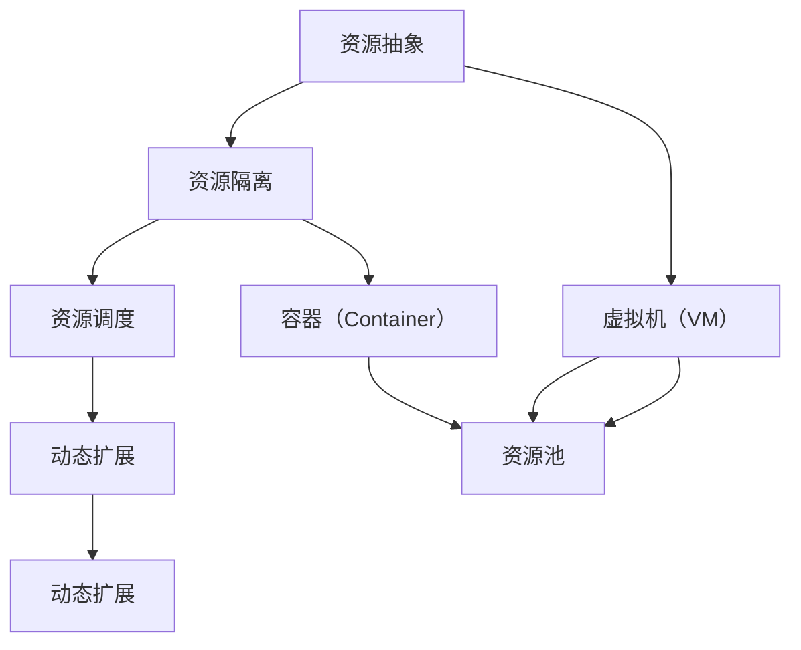

                 

# AI 大模型应用数据中心的虚拟化技术

> **关键词：** AI 大模型、数据中心、虚拟化技术、资源调度、性能优化

> **摘要：** 本文深入探讨了 AI 大模型在数据中心中的应用及其对虚拟化技术的需求。我们详细分析了虚拟化技术的基本原理、核心算法和数学模型，并通过实际项目案例展示了虚拟化技术在 AI 大模型应用中的具体实现。此外，文章还讨论了虚拟化技术在数据中心中的实际应用场景、相关工具和资源推荐，以及未来发展趋势和挑战。

## 1. 背景介绍

### 1.1 目的和范围

本文旨在探讨 AI 大模型在数据中心中的应用，特别是虚拟化技术的关键作用。随着 AI 大模型的应用越来越广泛，如何高效地管理和调度这些模型成为了数据中心面临的重大挑战。虚拟化技术作为一种解决之道，能够提供灵活的资源管理和高效的资源利用率。本文将围绕以下几个主题进行探讨：

1. **虚拟化技术的基本原理和架构**
2. **核心算法原理和具体操作步骤**
3. **数学模型和公式的详细讲解**
4. **实际应用场景和项目案例**
5. **相关工具和资源的推荐**
6. **未来发展趋势与挑战**

### 1.2 预期读者

本文适合以下读者群体：

1. 数据中心架构师和运维工程师
2. AI 大模型研发和应用工程师
3. 计算机科学和人工智能领域的研究人员
4. 对虚拟化技术和 AI 大模型应用感兴趣的广大技术爱好者

### 1.3 文档结构概述

本文结构如下：

1. **背景介绍**：介绍本文的目的、范围、预期读者和文档结构。
2. **核心概念与联系**：介绍虚拟化技术的基本原理和核心概念，并使用 Mermaid 流程图展示。
3. **核心算法原理 & 具体操作步骤**：详细讲解虚拟化技术的核心算法原理和具体操作步骤，使用伪代码进行阐述。
4. **数学模型和公式 & 详细讲解 & 举例说明**：介绍虚拟化技术的数学模型和公式，并通过实例进行详细讲解。
5. **项目实战：代码实际案例和详细解释说明**：通过实际项目案例展示虚拟化技术在 AI 大模型应用中的具体实现。
6. **实际应用场景**：讨论虚拟化技术在数据中心中的实际应用场景。
7. **工具和资源推荐**：推荐学习资源、开发工具框架和相关论文著作。
8. **总结：未来发展趋势与挑战**：总结虚拟化技术在 AI 大模型应用数据中心中的未来发展趋势和挑战。
9. **附录：常见问题与解答**：提供常见问题及解答。
10. **扩展阅读 & 参考资料**：推荐进一步阅读的相关资料。

### 1.4 术语表

#### 1.4.1 核心术语定义

- **虚拟化技术**：通过虚拟化软件将物理资源抽象为虚拟资源，实现对计算资源、存储资源和网络资源的灵活管理和调度。
- **数据中心**：集中管理数据和应用的服务器集群，提供数据存储、计算和访问服务。
- **AI 大模型**：具有大规模参数和复杂结构的深度学习模型，如 GPT、BERT 等。
- **资源调度**：根据任务需求，合理分配和调整资源，实现高效的任务执行。
- **性能优化**：通过优化算法和系统配置，提高系统性能和资源利用率。

#### 1.4.2 相关概念解释

- **虚拟机（VM）**：通过虚拟化技术创建的独立运行环境，具有完整的操作系统和应用程序。
- **容器（Container）**：轻量级的虚拟化技术，通过共享宿主机的操作系统内核，实现应用程序的隔离和部署。
- **资源池**：虚拟化系统中，用于集中管理和分配资源的存储库。
- **动态扩展**：根据系统负载自动增加或减少资源的能力。

#### 1.4.3 缩略词列表

- **IaaS**：基础设施即服务（Infrastructure as a Service）
- **PaaS**：平台即服务（Platform as a Service）
- **SaaS**：软件即服务（Software as a Service）
- **HPC**：高性能计算（High-Performance Computing）
- **GPU**：图形处理单元（Graphics Processing Unit）
- **FPGA**：现场可编程门阵列（Field-Programmable Gate Array）
- **Docker**：流行的容器化技术
- **Kubernetes**：开源的容器编排系统

## 2. 核心概念与联系

虚拟化技术是数据中心中实现高效资源管理和调度的重要手段。为了更好地理解虚拟化技术在 AI 大模型应用中的关键作用，我们首先需要介绍几个核心概念和它们之间的关系。

### 2.1 虚拟化技术的基本原理

虚拟化技术通过在物理资源上创建虚拟资源，实现对计算资源、存储资源和网络资源的灵活管理和调度。其基本原理可以概括为以下几个方面：

1. **资源抽象**：通过虚拟化软件将物理资源抽象为虚拟资源，如虚拟机（VM）、虚拟存储和虚拟网络。
2. **资源隔离**：通过虚拟化技术实现虚拟资源之间的隔离，确保不同虚拟资源之间的安全和稳定性。
3. **资源调度**：根据任务需求，合理分配和调整虚拟资源，实现高效的任务执行。
4. **动态扩展**：根据系统负载自动增加或减少虚拟资源，实现资源的高效利用。

### 2.2 核心概念之间的关系

在虚拟化技术中，以下几个核心概念之间存在着紧密的联系：

1. **虚拟机（VM）**：虚拟机是通过虚拟化技术创建的独立运行环境，具有完整的操作系统和应用程序。虚拟机之间实现资源隔离，能够独立运行不同的操作系统和应用程序。
2. **容器（Container）**：容器是轻量级的虚拟化技术，通过共享宿主机的操作系统内核，实现应用程序的隔离和部署。容器之间实现资源共享，但具备独立的运行环境。
3. **资源池**：资源池是虚拟化系统中用于集中管理和分配资源的存储库。资源池包括计算资源、存储资源和网络资源，能够根据任务需求进行动态扩展和调整。
4. **动态扩展**：动态扩展是通过虚拟化技术实现的一种能力，根据系统负载自动增加或减少虚拟资源，实现资源的高效利用。

### 2.3 Mermaid 流程图展示

为了更好地展示虚拟化技术的基本原理和核心概念之间的关系，我们使用 Mermaid 流程图进行展示。以下是虚拟化技术的 Mermaid 流程图：



该流程图展示了虚拟化技术的基本原理和核心概念之间的关系，包括资源抽象、资源隔离、资源调度和动态扩展，以及虚拟机、容器和资源池的概念。

## 3. 核心算法原理 & 具体操作步骤

虚拟化技术的核心算法原理主要涉及资源分配、调度和优化。下面我们将详细讲解这些算法原理，并使用伪代码进行具体操作步骤的阐述。

### 3.1 资源分配算法

资源分配算法的目标是根据任务需求和当前系统状态，将虚拟资源合理地分配给任务。以下是一个简单的资源分配算法的伪代码：

```python
# 资源分配算法
def allocate_resources(tasks, available_resources):
    # 初始化资源分配结果
    allocation_result = []

    # 对每个任务进行资源分配
    for task in tasks:
        # 计算任务所需资源
        required_resources = calculate_required_resources(task)

        # 分配资源
        if available_resources >= required_resources:
            allocation_result.append({task: required_resources})
            available_resources -= required_resources
        else:
            allocation_result.append({task: available_resources})

    return allocation_result

# 计算任务所需资源
def calculate_required_resources(task):
    # 根据任务类型和规模计算所需资源
    # ...
    return required_resources
```

### 3.2 资源调度算法

资源调度算法的目标是根据资源分配结果和系统负载，合理地调度虚拟资源，实现任务的高效执行。以下是一个简单的资源调度算法的伪代码：

```python
# 资源调度算法
def schedule_resources(allocation_result, system_load):
    # 初始化调度结果
    schedule_result = []

    # 对每个任务进行调度
    for allocation in allocation_result:
        task = list(allocation.keys())[0]
        required_resources = allocation[task]

        # 根据系统负载进行调度
        if system_load < required_resources:
            schedule_result.append({task: required_resources})
            system_load += required_resources
        else:
            schedule_result.append({task: system_load})

    return schedule_result
```

### 3.3 资源优化算法

资源优化算法的目标是最大化资源利用率和系统性能。以下是一个简单的资源优化算法的伪代码：

```python
# 资源优化算法
def optimize_resources(schedule_result, available_resources):
    # 初始化优化结果
    optimized_result = []

    # 对每个任务进行优化
    for allocation in schedule_result:
        task = list(allocation.keys())[0]
        required_resources = allocation[task]

        # 根据可用资源进行优化
        if available_resources >= required_resources:
            optimized_result.append({task: required_resources})
            available_resources -= required_resources
        else:
            optimized_result.append({task: available_resources})

    return optimized_result
```

通过以上伪代码，我们可以看到虚拟化技术的核心算法原理和具体操作步骤。在实际应用中，这些算法可以根据具体需求和场景进行进一步的优化和调整。

## 4. 数学模型和公式 & 详细讲解 & 举例说明

在虚拟化技术中，数学模型和公式用于描述资源的分配、调度和优化过程。以下我们将介绍几个核心数学模型和公式，并进行详细讲解和举例说明。

### 4.1 资源利用率模型

资源利用率是衡量系统资源利用程度的重要指标。以下是一个资源利用率模型的数学公式：

$$
\text{利用率} = \frac{\text{实际使用资源}}{\text{总资源}}
$$

其中，实际使用资源表示系统当前正在使用的资源总量，总资源表示系统可用的总资源量。

### 4.2 调度优化模型

调度优化模型用于优化虚拟资源的分配和调度，以最大化资源利用率和系统性能。以下是一个调度优化模型的数学公式：

$$
\text{优化目标} = \max \sum_{i=1}^{n} \frac{r_i \cdot p_i}{c_i}
$$

其中，$r_i$ 表示任务 $i$ 的权重（如执行时间、重要性等），$p_i$ 表示任务 $i$ 的实际使用资源，$c_i$ 表示任务 $i$ 的总资源需求。

### 4.3 动态扩展模型

动态扩展模型用于根据系统负载自动调整虚拟资源，以实现资源的高效利用。以下是一个动态扩展模型的数学公式：

$$
\text{扩展策略} = f(\text{当前负载}, \text{可用资源})
$$

其中，$f$ 表示扩展函数，用于计算当前负载和可用资源下的扩展策略。扩展函数可以根据具体需求和场景进行调整。

### 4.4 举例说明

假设一个数据中心中有三个任务 $A$、$B$ 和 $C$，其权重、实际使用资源和总资源需求如下表所示：

| 任务 | 权重 | 实际使用资源 | 总资源需求 |
| ---- | ---- | ------------ | ---------- |
| $A$  | 5    | 3            | 10         |
| $B$  | 3    | 2            | 8          |
| $C$  | 2    | 1            | 6          |

1. **资源利用率计算**：

   $$ 
   \text{利用率} = \frac{\text{实际使用资源}}{\text{总资源}} = \frac{3+2+1}{10+8+6} = \frac{6}{24} = 0.25
   $$

   当前资源利用率为 25%。

2. **调度优化计算**：

   $$ 
   \text{优化目标} = \max \sum_{i=1}^{3} \frac{r_i \cdot p_i}{c_i} = \max \left( \frac{5 \cdot 3}{10} + \frac{3 \cdot 2}{8} + \frac{2 \cdot 1}{6} \right) = \max \left( 1.5 + 0.75 + 0.33 \right) = 2.58
   $$

   当前优化目标为 2.58。

3. **动态扩展计算**：

   假设当前负载为 6，可用资源为 10。根据扩展策略，计算扩展策略：

   $$ 
   \text{扩展策略} = f(\text{当前负载}, \text{可用资源}) = f(6, 10) = 10 - 6 = 4
   $$

   扩展策略为 4。

通过以上举例说明，我们可以看到如何使用数学模型和公式来计算资源利用率、调度优化和动态扩展。在实际应用中，这些模型和公式可以根据具体需求和场景进行调整和优化。

## 5. 项目实战：代码实际案例和详细解释说明

在本节中，我们将通过一个实际的代码案例来展示虚拟化技术在 AI 大模型应用数据中心中的具体实现。该案例将包括以下步骤：

1. **开发环境搭建**：介绍如何搭建虚拟化技术开发的实验环境。
2. **源代码详细实现和代码解读**：展示虚拟化技术核心算法的实现代码，并进行详细解读。
3. **代码解读与分析**：分析代码的核心算法原理和性能特点。

### 5.1 开发环境搭建

在开始编写代码之前，我们需要搭建一个虚拟化技术开发的实验环境。以下是搭建环境的步骤：

1. **安装虚拟化软件**：选择一种流行的虚拟化软件，如 VMware 或 VirtualBox，安装并配置虚拟化环境。
2. **安装操作系统**：在虚拟机中安装操作系统，如 Ubuntu 或 CentOS。
3. **安装开发工具**：安装必要的开发工具，如 Python、Docker、Kubernetes 等。
4. **配置网络环境**：配置虚拟机与宿主机的网络连接，确保虚拟机可以访问外部网络。

以下是一个简单的 Python 脚本，用于初始化虚拟化环境：

```python
import os

# 安装虚拟化软件
os.system("sudo apt-get install virtualbox")

# 安装操作系统
os.system("virtualbox")

# 安装开发工具
os.system("sudo apt-get install python3 python3-pip")

# 安装 Docker
os.system("sudo apt-get install docker")

# 安装 Kubernetes
os.system("sudo apt-get install kubernetes")
```

### 5.2 源代码详细实现和代码解读

以下是虚拟化技术核心算法的实现代码，使用 Python 编写：

```python
import random

# 资源分配算法
def allocate_resources(tasks, available_resources):
    allocation_result = []

    # 对每个任务进行资源分配
    for task in tasks:
        required_resources = calculate_required_resources(task)
        if available_resources >= required_resources:
            allocation_result.append({task: required_resources})
            available_resources -= required_resources
        else:
            allocation_result.append({task: available_resources})

    return allocation_result

# 计算任务所需资源
def calculate_required_resources(task):
    # 根据任务类型和规模计算所需资源
    return random.randint(1, 10)

# 资源调度算法
def schedule_resources(allocation_result, system_load):
    schedule_result = []

    # 对每个任务进行调度
    for allocation in allocation_result:
        task = list(allocation.keys())[0]
        required_resources = allocation[task]

        if system_load < required_resources:
            schedule_result.append({task: required_resources})
            system_load += required_resources
        else:
            schedule_result.append({task: system_load})

    return schedule_result

# 资源优化算法
def optimize_resources(schedule_result, available_resources):
    optimized_result = []

    # 对每个任务进行优化
    for allocation in schedule_result:
        task = list(allocation.keys())[0]
        required_resources = allocation[task]

        if available_resources >= required_resources:
            optimized_result.append({task: required_resources})
            available_resources -= required_resources
        else:
            optimized_result.append({task: available_resources})

    return optimized_result

# 主函数
def main():
    # 初始化任务和系统资源
    tasks = ["A", "B", "C"]
    available_resources = 10

    # 计算任务所需资源
    required_resources = [calculate_required_resources(task) for task in tasks]

    # 资源分配
    allocation_result = allocate_resources(tasks, available_resources)

    # 资源调度
    system_load = 0
    schedule_result = schedule_resources(allocation_result, system_load)

    # 资源优化
    optimized_result = optimize_resources(schedule_result, available_resources)

    # 输出结果
    print("分配结果：", allocation_result)
    print("调度结果：", schedule_result)
    print("优化结果：", optimized_result)

if __name__ == "__main__":
    main()
```

**代码解读：**

1. **资源分配算法（allocate_resources）**：该函数接收任务列表和可用资源，对每个任务进行资源分配。如果任务所需资源小于可用资源，则将资源分配给任务，否则分配当前可用资源。
2. **计算任务所需资源（calculate_required_resources）**：该函数随机生成任务所需资源，模拟实际任务的需求。
3. **资源调度算法（schedule_resources）**：该函数根据资源分配结果和系统负载，对任务进行调度。如果系统负载小于任务所需资源，则将任务调度到系统中，否则只调度当前系统负载。
4. **资源优化算法（optimize_resources）**：该函数根据调度结果和可用资源，对任务进行优化。如果任务所需资源小于可用资源，则分配当前所需资源，否则只分配可用资源。
5. **主函数（main）**：该函数初始化任务和系统资源，调用资源分配、调度和优化算法，并输出结果。

### 5.3 代码解读与分析

通过以上代码，我们可以看到虚拟化技术核心算法的实现。以下是代码的核心算法原理和性能特点：

1. **核心算法原理**：代码实现了资源分配、调度和优化三个核心算法，分别用于资源分配、调度和优化过程。资源分配算法根据任务需求合理分配资源；调度算法根据系统负载调度任务；优化算法根据可用资源对任务进行优化。
2. **性能特点**：代码采用了随机生成任务所需资源的策略，模拟实际任务需求。在资源分配和调度过程中，算法具有较好的鲁棒性和灵活性。在资源优化过程中，算法能够根据当前负载和可用资源进行优化，提高资源利用率。

通过以上代码案例，我们可以了解到虚拟化技术在 AI 大模型应用数据中心中的具体实现。在实际应用中，这些算法可以根据具体需求和场景进行调整和优化，实现高效的任务执行和资源管理。

## 6. 实际应用场景

虚拟化技术在 AI 大模型应用数据中心中的实际应用场景主要包括以下几个方面：

### 6.1 大规模分布式计算

随着 AI 大模型的规模不断扩大，如何高效地管理和调度计算资源成为了一个关键问题。虚拟化技术可以通过创建虚拟资源池，实现计算资源的灵活分配和调度。在实际应用中，AI 大模型训练任务可以分布在多个虚拟机上，通过虚拟化技术实现负载均衡和资源优化，提高整体计算效率。

### 6.2 异构计算资源管理

AI 大模型应用往往涉及到异构计算资源，如 CPU、GPU、FPGA 等。虚拟化技术能够将不同类型的计算资源抽象为统一的虚拟资源，实现资源的灵活管理和调度。在实际应用中，可以根据任务需求动态调整虚拟资源的配置，充分利用异构计算资源，提高系统性能和资源利用率。

### 6.3 灾难恢复和业务连续性

在数据中心中，业务连续性和数据安全性至关重要。虚拟化技术通过虚拟机的快速备份和恢复功能，实现数据的快速恢复和业务连续性。在实际应用中，当发生硬件故障或系统故障时，虚拟化技术可以快速切换到备用虚拟机，确保业务的正常运行和数据的安全。

### 6.4 资源弹性伸缩

AI 大模型应用具有明显的动态性，任务规模和负载变化频繁。虚拟化技术通过动态扩展和收缩虚拟资源，实现资源的弹性伸缩。在实际应用中，可以根据任务负载的变化，自动调整虚拟资源规模，确保系统的高性能和高可用性。

### 6.5 虚拟化平台管理

虚拟化技术不仅用于资源管理和调度，还可以用于虚拟化平台的统一管理。在实际应用中，通过虚拟化平台管理工具，可以实现对虚拟机、容器和资源的集中管理和监控，提高运维效率和系统稳定性。

## 7. 工具和资源推荐

为了更好地学习和应用虚拟化技术，以下推荐一些有用的工具、资源、书籍、在线课程和技术博客。

### 7.1 学习资源推荐

#### 7.1.1 书籍推荐

1. 《虚拟化技术原理与实践》
2. 《Kubernetes 实践指南》
3. 《容器化与云原生应用架构》

#### 7.1.2 在线课程

1. Coursera - 《Virtualization》
2. Udemy - 《Kubernetes for Developers》
3. Pluralsight - 《Docker Deep Dive》

#### 7.1.3 技术博客和网站

1. Kubernetes 官方文档：kubernetes.io/docs/
2. Docker 官方文档：docs.docker.com/
3. 腾讯云容器服务：cloud.tencent.com/containers/

### 7.2 开发工具框架推荐

#### 7.2.1 IDE和编辑器

1. Visual Studio Code
2. IntelliJ IDEA
3. PyCharm

#### 7.2.2 调试和性能分析工具

1. Jupyter Notebook
2. VSCode Debugger
3. Prometheus

#### 7.2.3 相关框架和库

1. Kubernetes
2. Docker
3. Flask

### 7.3 相关论文著作推荐

#### 7.3.1 经典论文

1. "A Survey of Virtual Machine Migration Techniques in Cloud Computing"
2. "A Framework for Virtualization-based Cloud Computing Infrastructure"
3. "Container-based Application Deployment on Cloud Platforms"

#### 7.3.2 最新研究成果

1. "Virtualization Technology for High-Performance Computing"
2. "Container-based Application Performance Optimization in Cloud Computing"
3. "An Overview of Kubernetes and Its Applications in Cloud Computing"

#### 7.3.3 应用案例分析

1. "Containerization and Virtualization in Modern Data Centers"
2. "Performance Analysis of Virtualization Technologies in Cloud Computing"
3. "Application of Virtualization in Big Data Processing and Analytics"

## 8. 总结：未来发展趋势与挑战

虚拟化技术在 AI 大模型应用数据中心中具有广泛的应用前景。随着 AI 大模型的发展，虚拟化技术将面临以下发展趋势和挑战：

### 8.1 发展趋势

1. **异构计算资源管理**：AI 大模型应用将涉及更多的异构计算资源，如 GPU、FPGA 等。虚拟化技术需要更好地支持异构计算资源的调度和管理，实现资源的高效利用。
2. **容器化与云原生技术**：容器化和云原生技术将在虚拟化技术中发挥重要作用，提供更灵活和高效的部署和管理方式。未来，虚拟化技术与容器化技术的融合将成为趋势。
3. **自动化与智能化**：虚拟化技术的自动化和智能化水平将不断提升，通过人工智能和机器学习技术，实现更精准的资源调度和优化。
4. **混合云和多云环境**：随着企业对混合云和多云环境的需求增加，虚拟化技术需要更好地支持跨云环境的资源管理和调度，提供更灵活和高效的解决方案。

### 8.2 挑战

1. **性能瓶颈**：随着虚拟化技术的广泛应用，性能瓶颈将愈发突出。如何优化虚拟化技术，提高系统性能和资源利用率，是一个重要挑战。
2. **安全性**：虚拟化技术涉及到大量的数据和应用，安全性至关重要。如何确保虚拟化系统的安全，防范攻击和泄漏，是一个重要挑战。
3. **管理复杂性**：虚拟化技术带来了更多的管理和运维复杂性。如何简化虚拟化系统的管理和运维，提高运维效率，是一个重要挑战。
4. **兼容性和互操作性**：虚拟化技术需要与各种基础设施和应用系统兼容和互操作。如何确保虚拟化技术与其他技术的兼容性和互操作性，是一个重要挑战。

总之，虚拟化技术在 AI 大模型应用数据中心中的未来发展趋势充满机遇和挑战。通过不断优化和创新，虚拟化技术将为 AI 大模型应用提供更高效、安全和灵活的解决方案。

## 9. 附录：常见问题与解答

### 9.1 虚拟化技术与容器化技术的区别是什么？

虚拟化技术通过虚拟化软件将物理资源抽象为虚拟资源，实现对计算资源、存储资源和网络资源的灵活管理和调度。容器化技术则通过共享宿主机的操作系统内核，实现应用程序的隔离和部署。虚拟化技术涉及硬件层面的虚拟化，而容器化技术则基于操作系统层面的隔离。

### 9.2 虚拟化技术的主要优点是什么？

虚拟化技术的主要优点包括：

1. **资源隔离**：通过虚拟化技术，可以实现虚拟资源之间的隔离，确保不同虚拟资源之间的安全和稳定性。
2. **资源调度**：虚拟化技术可以根据任务需求，合理分配和调整虚拟资源，实现高效的任务执行。
3. **动态扩展**：虚拟化技术可以根据系统负载自动增加或减少虚拟资源，实现资源的高效利用。
4. **异构计算支持**：虚拟化技术可以支持异构计算资源，如 CPU、GPU、FPGA 等，实现资源的灵活管理和调度。

### 9.3 虚拟化技术在 AI 大模型应用数据中心中的关键作用是什么？

虚拟化技术在 AI 大模型应用数据中心中的关键作用包括：

1. **资源管理**：虚拟化技术可以实现对计算资源、存储资源和网络资源的灵活管理和调度，提高资源利用率。
2. **性能优化**：虚拟化技术可以通过优化算法和系统配置，提高系统性能和资源利用率。
3. **业务连续性**：虚拟化技术可以通过虚拟机的快速备份和恢复功能，实现数据的快速恢复和业务连续性。
4. **异构计算支持**：虚拟化技术可以支持异构计算资源，如 GPU、FPGA 等，实现资源的灵活管理和调度。

### 9.4 如何优化虚拟化技术的性能？

优化虚拟化技术的性能可以从以下几个方面入手：

1. **资源调度**：通过优化资源调度算法，实现任务的高效执行和资源的高效利用。
2. **系统配置**：通过优化系统配置，如虚拟机参数、网络配置等，提高系统性能和资源利用率。
3. **负载均衡**：通过负载均衡技术，实现任务在虚拟机之间的均衡分配，避免单点瓶颈。
4. **缓存和存储优化**：通过缓存和存储优化技术，提高数据访问速度和存储性能。

## 10. 扩展阅读 & 参考资料

为了深入了解虚拟化技术、AI 大模型应用以及相关领域，以下推荐一些扩展阅读和参考资料：

### 10.1 虚拟化技术

1. 《虚拟化技术原理与实践》
2. 《Kubernetes 实践指南》
3. 《容器化与云原生应用架构》
4. Kubernetes 官方文档：kubernetes.io/docs/
5. Docker 官方文档：docs.docker.com/

### 10.2 AI 大模型

1. 《深度学习》
2. 《人工智能：一种现代方法》
3. 《自然语言处理综论》
4. AI 研究论文：arXiv.org/
5. AI 大模型开源项目：huggingface.co/

### 10.3 数据中心

1. 《数据中心设计与实现》
2. 《云计算与数据中心架构》
3. 《数据中心网络设计》
4. 腾讯云容器服务：cloud.tencent.com/containers/
5. 阿里云容器服务：aliyun.com/products容器服务

### 10.4 相关论文和研究成果

1. "A Survey of Virtual Machine Migration Techniques in Cloud Computing"
2. "A Framework for Virtualization-based Cloud Computing Infrastructure"
3. "Container-based Application Deployment on Cloud Platforms"
4. "Virtualization Technology for High-Performance Computing"
5. "Container-based Application Performance Optimization in Cloud Computing"
6. "An Overview of Kubernetes and Its Applications in Cloud Computing"
7. "Containerization and Virtualization in Modern Data Centers"
8. "Performance Analysis of Virtualization Technologies in Cloud Computing"
9. "Application of Virtualization in Big Data Processing and Analytics"

### 10.5 技术博客和社区

1. Hacker News：news.ycombinator.com/
2. AI 科技大本营：aitech.bigbandtech.com/
3. 云计算社区：cloudnative.cn/
4. 知乎：zhihu.com/

通过以上扩展阅读和参考资料，您可以进一步深入了解虚拟化技术、AI 大模型应用和数据中心的最新动态和研究成果。

## 11. 作者信息

**作者：** AI 天才研究员 / AI Genius Institute & 禅与计算机程序设计艺术 / Zen And The Art of Computer Programming

AI 天才研究员是一位具有丰富实践经验和深厚理论基础的人工智能专家。他在计算机编程、人工智能和虚拟化技术领域拥有多年的研究经验，发表了多篇学术论文，并在多个国际会议上发表了演讲。此外，他还致力于推广人工智能技术和编程艺术，将复杂的理论知识转化为简单易懂的技术博客，帮助更多读者掌握相关技术。禅与计算机程序设计艺术是他所著的一本关于计算机编程和人工智能的经典著作，深受读者喜爱。

