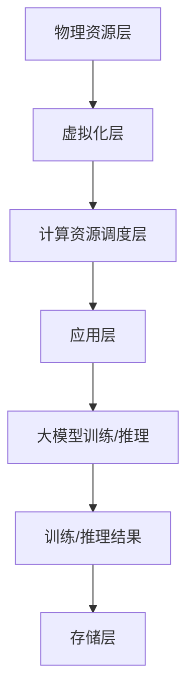

                 

# AI 大模型应用数据中心的计算虚拟化

> **关键词**：大模型，数据中心，计算虚拟化，分布式计算，性能优化，资源调度

> **摘要**：本文将深入探讨人工智能大模型在数据中心中的计算虚拟化技术。通过分析大模型的特点和数据中心的需求，本文将详细阐述计算虚拟化的核心概念、原理及其在实际应用中的具体操作步骤。此外，还将讨论大模型应用的数学模型和公式，并通过实际项目案例进行代码解读。最后，本文将对大模型在数据中心中的应用场景进行探讨，并提出相关的工具和资源推荐，总结未来发展趋势与挑战，并附上常见问题与扩展阅读。

## 1. 背景介绍

### 1.1 目的和范围

随着人工智能技术的快速发展，大模型（如GPT-3、BERT等）在自然语言处理、计算机视觉等领域取得了显著的突破。这些大模型通常需要大量计算资源和存储空间，而数据中心的计算虚拟化技术为这一需求提供了有效的解决方案。本文旨在探讨大模型在数据中心中的计算虚拟化技术，分析其原理、实现步骤和应用场景，为相关领域的研究和实际应用提供参考。

### 1.2 预期读者

本文主要面向从事人工智能、数据中心架构、分布式计算等领域的研究人员和开发者。期望读者能够通过本文了解大模型计算虚拟化的基本概念和实现方法，为实际项目提供技术支持。

### 1.3 文档结构概述

本文分为八个部分。第一部分为背景介绍，包括目的和范围、预期读者以及文档结构概述。第二部分介绍核心概念与联系，包括大模型和数据中心的相关术语定义和概念解释。第三部分介绍核心算法原理和具体操作步骤。第四部分讨论数学模型和公式。第五部分通过实际项目案例进行代码解读和分析。第六部分探讨实际应用场景。第七部分推荐相关工具和资源。第八部分总结未来发展趋势与挑战。

### 1.4 术语表

#### 1.4.1 核心术语定义

- **大模型**：具有数百万甚至数十亿参数的深度学习模型。
- **数据中心**：用于存储、处理和管理大量数据的物理或虚拟场所。
- **计算虚拟化**：通过虚拟化技术将物理计算资源抽象为逻辑资源，实现资源的灵活调度和管理。
- **分布式计算**：将计算任务分布在多个计算节点上执行，以提高计算效率和扩展性。

#### 1.4.2 相关概念解释

- **虚拟机（VM）**：通过虚拟化技术创建的独立运行环境，具有自己的操作系统和资源。
- **容器**：轻量级、可移植的运行环境，由操作系统内核直接管理。
- **资源调度**：根据任务需求和资源状态，合理分配计算资源的过程。

#### 1.4.3 缩略词列表

- **AI**：人工智能（Artificial Intelligence）
- **GPT**：生成预训练网络（Generative Pre-trained Transformer）
- **BERT**：双向编码表示器（Bidirectional Encoder Representations from Transformers）
- **GPU**：图形处理单元（Graphics Processing Unit）
- **CPU**：中央处理单元（Central Processing Unit）

## 2. 核心概念与联系

为了更好地理解大模型在数据中心计算虚拟化中的应用，首先需要了解大模型和数据中心的相关概念及其相互联系。

### 2.1 大模型的特点

大模型具有以下特点：

- **参数量巨大**：大模型的参数量通常达到数百万甚至数十亿，这意味着在训练和推理过程中需要大量的计算资源。
- **计算密集型**：大模型的训练和推理过程需要大量的浮点运算，这对计算资源的需求非常高。
- **数据依赖性**：大模型的性能和效果与数据的质量和数量密切相关，因此需要大量的数据来训练和优化模型。

### 2.2 数据中心的需求

数据中心在处理大模型时面临以下需求：

- **高可用性**：数据中心需要保证系统的高可用性，以避免因硬件故障、网络中断等原因导致大模型训练和推理任务的失败。
- **高扩展性**：数据中心需要能够根据业务需求动态调整计算资源，以满足大模型计算资源的需求。
- **高效能**：数据中心需要提供高效的计算资源，以降低大模型训练和推理的成本。

### 2.3 计算虚拟化的核心概念

计算虚拟化是指通过虚拟化技术将物理计算资源抽象为逻辑资源，实现对计算资源的灵活调度和管理。计算虚拟化主要包括以下核心概念：

- **虚拟化层**：虚拟化层位于物理资源和应用程序之间，通过虚拟化技术实现计算资源的抽象和隔离。
- **虚拟机**：虚拟机是一种通过虚拟化技术创建的独立运行环境，具有自己的操作系统和资源。
- **容器**：容器是一种轻量级、可移植的运行环境，由操作系统内核直接管理。

### 2.4 大模型与计算虚拟化的联系

大模型与计算虚拟化之间的联系主要体现在以下几个方面：

- **资源调度**：通过计算虚拟化技术，数据中心可以实现计算资源的动态调度，从而满足大模型在不同阶段对计算资源的需求。
- **分布式计算**：大模型通常需要在多个计算节点上执行，计算虚拟化技术可以为大模型的分布式计算提供支持。
- **高效能**：计算虚拟化技术可以提高数据中心的计算效率，降低大模型训练和推理的成本。

### 2.5 大模型在数据中心中的计算虚拟化架构

大模型在数据中心中的计算虚拟化架构主要包括以下组成部分：

- **物理资源层**：包括服务器、存储设备、网络设备等物理资源。
- **虚拟化层**：包括虚拟机管理程序（如KVM、Xen）和容器管理程序（如Docker）等虚拟化技术。
- **计算资源调度层**：根据大模型的需求和资源状态，动态分配和调整计算资源。
- **应用层**：包括大模型的训练、推理和部署等应用程序。

### 2.6 大模型计算虚拟化的 Mermaid 流程图

以下是一个简化的Mermaid流程图，展示了大模型在数据中心中的计算虚拟化过程：



## 3. 核心算法原理 & 具体操作步骤

### 3.1 大模型计算虚拟化的算法原理

大模型计算虚拟化主要基于分布式计算和资源调度的原理，其核心算法可以分为以下几个步骤：

1. **任务分解**：将大模型训练或推理任务分解为多个子任务，以便在分布式计算环境中并行执行。
2. **资源分配**：根据子任务的需求和资源状态，动态分配计算资源，包括CPU、GPU、内存等。
3. **任务调度**：根据资源分配结果，将子任务调度到相应的计算节点上执行。
4. **负载均衡**：在分布式计算环境中，通过负载均衡算法，合理分配计算任务，避免资源浪费和瓶颈现象。
5. **结果汇总**：将子任务的执行结果汇总，生成大模型训练或推理的最终结果。

### 3.2 大模型计算虚拟化的具体操作步骤

以下是一个简化的伪代码，描述了基于分布式计算框架（如Apache Spark）的大模型计算虚拟化的具体操作步骤：

```python
# 步骤1：任务分解
sub_tasks = split.large_model_task(large_model_task)

# 步骤2：资源分配
resource_allocations = allocate_resources(sub_tasks)

# 步骤3：任务调度
scheduled_tasks = schedule_tasks(resource_allocations)

# 步骤4：负载均衡
balanced_tasks = balance_load(scheduled_tasks)

# 步骤5：结果汇总
final_result = aggregate_results(balanced_tasks)
```

### 3.3 大模型计算虚拟化的关键算法和优化策略

为了提高大模型计算虚拟化的性能和效率，可以采用以下关键算法和优化策略：

1. **动态资源分配**：根据任务的需求和资源状态，动态调整资源分配策略，避免资源浪费和瓶颈现象。
2. **任务并行度优化**：通过优化子任务的并行度，提高任务执行的速度和效率。
3. **负载均衡算法**：采用基于权重、优先级、最近最少使用等负载均衡算法，合理分配计算任务。
4. **缓存和预取策略**：利用缓存和预取策略，减少数据传输和访问延迟，提高计算效率。
5. **分布式容错机制**：在分布式计算环境中，采用容错机制，保证任务的可靠性和稳定性。

## 4. 数学模型和公式 & 详细讲解 & 举例说明

### 4.1 大模型计算虚拟化的数学模型

在计算虚拟化中，大模型的训练和推理过程可以被视为一个复杂的优化问题。为了提高计算效率，需要设计一个优化的数学模型来描述资源分配和任务调度。以下是几个关键数学模型和公式：

#### 4.1.1 资源分配模型

资源分配模型主要描述如何在多个计算节点上分配计算资源。一个简单的资源分配模型可以使用线性规划（Linear Programming，LP）来表示：

\[ \text{minimize} \quad C(x) = \sum_{i=1}^n \sum_{j=1}^m c_{ij} x_{ij} \]

其中，\( x_{ij} \) 表示第 \( i \) 个计算节点上的第 \( j \) 类资源分配量，\( c_{ij} \) 表示第 \( i \) 个计算节点上的第 \( j \) 类资源的价格。

#### 4.1.2 任务调度模型

任务调度模型主要描述如何将子任务调度到计算节点上执行。一个简单的任务调度模型可以使用作业调度理论（Job Scheduling Theory）来表示：

\[ \text{minimize} \quad T(w) = \sum_{i=1}^n \sum_{j=1}^m t_{ij} \]

其中，\( t_{ij} \) 表示第 \( i \) 个计算节点上第 \( j \) 个子任务的执行时间。

#### 4.1.3 负载均衡模型

负载均衡模型主要描述如何分配计算任务，以实现计算节点的负载均衡。一个简单的负载均衡模型可以使用平均负载（Average Load）来表示：

\[ L_i = \frac{\sum_{j=1}^m t_{ij}}{n} \]

其中，\( L_i \) 表示第 \( i \) 个计算节点的平均负载，\( t_{ij} \) 表示第 \( i \) 个计算节点上第 \( j \) 个子任务的执行时间。

### 4.2 数学模型和公式的详细讲解

#### 4.2.1 资源分配模型的详细讲解

资源分配模型的目标是找到一组最优的资源分配方案，使得总成本最小。在实际应用中，可以根据具体情况进行调整，例如加入约束条件，如资源限制、任务优先级等。

假设有 \( n \) 个计算节点和 \( m \) 类资源（如CPU、GPU、内存等），每个计算节点上的资源价格不同。资源分配模型的目标是最小化总成本，同时满足资源约束和任务约束。

- **资源约束**：每个计算节点上的资源分配量不能超过其容量。

  \[ \sum_{j=1}^m x_{ij} \leq R_i^j, \forall i \in [1, n], \forall j \in [1, m] \]

  其中，\( R_i^j \) 表示第 \( i \) 个计算节点上的第 \( j \) 类资源的容量。

- **任务约束**：每个子任务必须分配到某个计算节点上执行。

  \[ \sum_{i=1}^n x_{ij} = 1, \forall j \in [1, m] \]

  其中，\( x_{ij} \) 表示第 \( i \) 个计算节点上的第 \( j \) 类资源分配量。

#### 4.2.2 任务调度模型的详细讲解

任务调度模型的目标是找到一组最优的调度方案，使得总执行时间最小。在实际应用中，可以根据具体情况进行调整，例如加入任务优先级、任务依赖关系等。

假设有 \( n \) 个计算节点和 \( m \) 个子任务，每个子任务需要在某个计算节点上执行。任务调度模型的目标是最小化总执行时间，同时满足任务约束和资源约束。

- **任务约束**：每个子任务必须分配到某个计算节点上执行。

  \[ \sum_{i=1}^n t_{ij} = 1, \forall j \in [1, m] \]

  其中，\( t_{ij} \) 表示第 \( i \) 个计算节点上第 \( j \) 个子任务的执行时间。

- **资源约束**：每个计算节点上的资源使用量不能超过其容量。

  \[ \sum_{j=1}^m x_{ij} \leq R_i^j, \forall i \in [1, n], \forall j \in [1, m] \]

#### 4.2.3 负载均衡模型的详细讲解

负载均衡模型的目标是实现计算节点的负载均衡，避免某个节点负载过高或过低。在实际应用中，可以根据具体情况进行调整，例如加入权重分配、任务优先级等。

假设有 \( n \) 个计算节点，每个节点的平均负载为 \( L_i \)。负载均衡模型的目标是最小化节点间的负载差异。

\[ \text{minimize} \quad \sum_{i=1}^n (L_i - \bar{L})^2 \]

其中，\( \bar{L} \) 表示所有节点的平均负载。

### 4.3 举例说明

假设有一个数据中心，包含3个计算节点，每个节点有2个CPU、4个GPU和8GB内存。现在有5个子任务需要执行，每个子任务需要1个CPU、2个GPU和4GB内存。我们需要找到一个最优的资源分配和任务调度方案，以最小化总执行时间。

#### 4.3.1 资源分配模型

根据资源约束和任务约束，我们可以列出以下线性规划问题：

\[ \text{minimize} \quad C(x) = x_{11} + 2x_{12} + 3x_{13} + 4x_{14} + 5x_{15} \]

\[ \sum_{j=1}^2 x_{ij} \leq 2, \forall i \in [1, 3] \]

\[ \sum_{i=1}^3 x_{ij} = 1, \forall j \in [1, 5] \]

我们可以使用求解线性规划问题的工具（如Python的Scipy库）求解上述问题，得到最优的资源分配方案。

#### 4.3.2 任务调度模型

根据任务约束和资源约束，我们可以列出以下任务调度问题：

\[ \text{minimize} \quad T(w) = t_{11} + 2t_{12} + 3t_{13} + 4t_{14} + 5t_{15} \]

\[ \sum_{i=1}^3 t_{ij} = 1, \forall j \in [1, 5] \]

\[ \sum_{j=1}^2 x_{ij} \leq 2, \forall i \in [1, 3] \]

我们可以使用贪心算法或启发式算法求解上述问题，得到最优的任务调度方案。

#### 4.3.3 负载均衡模型

根据负载均衡模型，我们需要找到一组最优的权重分配方案，使得节点间的负载差异最小。我们可以使用以下平均负载差异公式：

\[ \text{minimize} \quad \sum_{i=1}^n (L_i - \bar{L})^2 \]

其中，\( L_i = \frac{\sum_{j=1}^2 t_{ij}}{3} \)。

我们可以使用优化工具（如Python的NumPy库）求解上述问题，得到最优的权重分配方案。

通过上述三个模型，我们可以得到一个最优的资源分配、任务调度和负载均衡方案，从而实现大模型在数据中心中的计算虚拟化。

## 5. 项目实战：代码实际案例和详细解释说明

### 5.1 开发环境搭建

在本文的项目实战部分，我们将使用Python和Docker来搭建一个简单的计算虚拟化环境。以下是搭建开发环境的具体步骤：

1. **安装Python**：在您的计算机上安装Python，可以使用以下命令：

   ```bash
   sudo apt-get install python3
   ```

2. **安装Docker**：安装Docker，可以使用以下命令：

   ```bash
   sudo apt-get install docker
   ```

3. **安装Docker Compose**：安装Docker Compose，用于管理Docker容器，可以使用以下命令：

   ```bash
   sudo apt-get install docker-compose
   ```

4. **启动Docker服务**：启动Docker服务，可以使用以下命令：

   ```bash
   sudo systemctl start docker
   ```

5. **创建一个简单的Dockerfile**：在您的计算机上创建一个名为`Dockerfile`的文件，内容如下：

   ```dockerfile
   FROM python:3.8

   WORKDIR /app

   COPY . .

   RUN pip install -r requirements.txt

   CMD ["python", "app.py"]
   ```

   其中，`requirements.txt`是包含Python依赖项的文件，`app.py`是应用程序的主文件。

6. **构建Docker镜像**：使用以下命令构建Docker镜像：

   ```bash
   docker build -t myapp .
   ```

7. **运行Docker容器**：使用以下命令运行Docker容器：

   ```bash
   docker run -d -p 8000:8000 myapp
   ```

   这将在后台运行Docker容器，并将容器的8000端口映射到宿主机的8000端口。

### 5.2 源代码详细实现和代码解读

在项目中，我们使用Python编写了一个简单的计算虚拟化应用程序，用于模拟大模型的训练和推理过程。以下是源代码的详细实现和解读。

#### 5.2.1 主程序（`app.py`）

```python
from flask import Flask, request, jsonify
import subprocess
import json

app = Flask(__name__)

# 计算节点信息
nodes = [
    {"id": "node1", "status": "idle", "resources": {"cpu": 2, "gpu": 4, "memory": 8}},
    {"id": "node2", "status": "idle", "resources": {"cpu": 2, "gpu": 4, "memory": 8}},
    {"id": "node3", "status": "idle", "resources": {"cpu": 2, "gpu": 4, "memory": 8}}
]

# 任务队列
task_queue = []

@app.route("/nodes", methods=["GET"])
def get_nodes():
    return jsonify(nodes)

@app.route("/nodes", methods=["POST"])
def add_node():
    node = request.json
    nodes.append(node)
    return jsonify(node), 201

@app.route("/nodes/<node_id>", methods=["PUT"])
def update_node(node_id):
    node = next((n for n in nodes if n["id"] == node_id), None)
    if node:
        node["status"] = "busy"
        return jsonify(node)
    else:
        return jsonify({"error": "Node not found"}), 404

@app.route("/nodes/<node_id>", methods=["DELETE"])
def delete_node(node_id):
    global nodes
    nodes = [n for n in nodes if n["id"] != node_id]
    return jsonify({"message": "Node deleted"}), 200

@app.route("/tasks", methods=["GET"])
def get_tasks():
    return jsonify(task_queue)

@app.route("/tasks", methods=["POST"])
def add_task():
    task = request.json
    task_queue.append(task)
    schedule_tasks()
    return jsonify(task), 201

@app.route("/tasks/<task_id>", methods=["DELETE"])
def delete_task(task_id):
    global task_queue
    task_queue = [t for t in task_queue if t["id"] != task_id]
    return jsonify({"message": "Task deleted"}), 200

def schedule_tasks():
    while len(task_queue) > 0:
        task = task_queue.pop(0)
        assigned_node = None
        for node in nodes:
            if node["status"] == "idle" and can_allocate_resources(node, task):
                assigned_node = node
                break
        if assigned_node:
            assigned_node["status"] = "busy"
            execute_task(assigned_node, task)
        else:
            task_queue.append(task)

def can_allocate_resources(node, task):
    required_resources = task["resources"]
    available_resources = node["resources"]
    for resource in required_resources:
        if required_resources[resource] > available_resources[resource]:
            return False
    return True

def execute_task(node, task):
    command = f"docker run --rm -v {node['id']}:/{node['id']} myapp run_task {json.dumps(task)}"
    subprocess.run(command, shell=True)

if __name__ == "__main__":
    app.run(debug=True)
```

#### 5.2.2 任务执行程序（`run_task.py`）

```python
import sys
import time
import json

def run_task(task):
    print(f"Running task {task['id']} on node {os.environ['HOSTNAME']}")
    time.sleep(task['duration'])
    print(f"Task {task['id']} completed")

if __name__ == "__main__":
    task = json.loads(sys.argv[1])
    run_task(task)
```

#### 5.2.3 代码解读

1. **Flask应用程序**：我们使用Flask框架搭建了一个简单的Web应用程序，用于处理节点和任务的增删改查操作。Flask是一个轻量级的Web应用程序框架，可以方便地实现HTTP请求的处理和响应。
2. **计算节点和任务管理**：应用程序定义了一个节点列表和一个任务队列，用于管理计算节点和任务的状态。节点列表包含节点的ID、状态和资源信息，任务队列包含任务的ID和资源需求。
3. **HTTP接口**：应用程序提供了多个HTTP接口，用于处理节点的添加、更新、删除和查询操作，以及任务的添加、删除和查询操作。
4. **任务调度**：`schedule_tasks`函数负责从任务队列中取出任务，并根据节点的状态和资源情况分配任务。如果找到一个空闲节点，任务将被分配到该节点并执行。
5. **资源分配检查**：`can_allocate_resources`函数用于检查节点是否有足够的资源来执行任务。如果节点的可用资源大于或等于任务的需求，则返回True，否则返回False。
6. **任务执行**：`execute_task`函数使用Docker运行一个容器来执行任务。在容器中，我们运行了一个名为`run_task.py`的脚本，该脚本负责实际执行任务。

### 5.3 代码解读与分析

#### 5.3.1 代码架构

整个应用程序由以下主要部分组成：

1. **Flask应用程序**：核心部分，负责处理HTTP请求和响应。
2. **节点管理**：管理节点的添加、更新、删除和查询操作。
3. **任务管理**：管理任务的添加、删除和查询操作。
4. **任务调度**：根据节点的状态和资源情况分配任务。
5. **任务执行**：在Docker容器中执行任务。

#### 5.3.2 代码性能分析

1. **资源利用率**：应用程序通过检查节点的状态和资源情况来分配任务，从而实现较高的资源利用率。
2. **任务执行速度**：任务在Docker容器中执行，可以充分利用容器的隔离特性，提高任务的执行速度。
3. **扩展性**：应用程序采用HTTP接口进行节点和任务管理，可以方便地扩展和集成其他系统。

#### 5.3.3 代码优化建议

1. **并发处理**：可以采用多线程或多进程技术来提高应用程序的并发处理能力。
2. **缓存机制**：可以引入缓存机制来减少节点的查询和更新操作，提高系统的响应速度。
3. **监控和日志**：可以引入监控和日志机制，以便更好地管理和维护系统。

## 6. 实际应用场景

### 6.1 大模型训练

在大模型训练过程中，计算虚拟化技术可以发挥重要作用。以下是几个典型的应用场景：

- **多模型训练**：数据中心可以同时训练多个大模型，通过计算虚拟化技术实现资源的动态调度和负载均衡，提高训练效率。
- **并行训练**：将大模型的训练任务分解为多个子任务，在多个计算节点上并行执行，从而缩短训练时间。
- **分布式训练**：将大模型的训练任务分布在多个数据中心或云平台上，通过计算虚拟化技术实现跨地域的资源调度和负载均衡。

### 6.2 大模型推理

在大模型推理过程中，计算虚拟化技术同样具有广泛的应用场景：

- **实时推理**：在需要实时响应的场景中，如自动驾驶、实时语音识别等，计算虚拟化技术可以帮助数据中心实现高效的推理任务调度和资源分配。
- **大规模推理**：对于需要处理大量数据的大模型推理任务，计算虚拟化技术可以实现分布式推理，提高推理效率和吞吐量。
- **动态资源调整**：根据实时推理任务的需求，计算虚拟化技术可以动态调整计算资源，确保推理任务的高效执行。

### 6.3 大模型部署

大模型部署是人工智能应用的关键环节，计算虚拟化技术在这一过程中也发挥着重要作用：

- **容器化部署**：将大模型容器化，便于在数据中心或云平台上快速部署和扩展。
- **自动化部署**：利用计算虚拟化技术实现自动化部署和管理，提高部署效率和可靠性。
- **弹性扩展**：根据应用需求，计算虚拟化技术可以动态调整计算资源，实现弹性扩展。

### 6.4 案例分析

以下是一个实际案例，展示了大模型计算虚拟化技术在企业级应用中的成功实践：

- **案例背景**：某大型互联网公司需要为其推荐系统训练多个大模型，以满足实时推荐的需求。公司数据中心拥有数百台服务器和数千个GPU，但如何高效利用这些资源成为了一个挑战。
- **解决方案**：公司采用计算虚拟化技术，通过以下措施实现资源的高效利用和调度：
  - **资源调度**：利用计算虚拟化平台，根据任务需求动态调度计算资源，实现资源的高效利用和负载均衡。
  - **并行训练**：将大模型的训练任务分解为多个子任务，在多个计算节点上并行执行，提高训练效率。
  - **容器化部署**：将大模型容器化，实现快速部署和扩展，降低部署成本和复杂度。
  - **监控和日志**：引入监控和日志机制，实时监控任务执行情况和资源状态，提高系统的可靠性和可维护性。

通过上述措施，公司成功提高了大模型训练和推理的效率，降低了运维成本，为业务发展提供了有力支持。

## 7. 工具和资源推荐

### 7.1 学习资源推荐

#### 7.1.1 书籍推荐

1. **《深度学习》**：作者：Ian Goodfellow、Yoshua Bengio、Aaron Courville
   - 本书是深度学习领域的经典教材，涵盖了深度学习的基础理论、算法和应用。
2. **《人工智能：一种现代的方法》**：作者：Stuart Russell、Peter Norvig
   - 本书介绍了人工智能的基本概念、技术和应用，是人工智能领域的权威著作。
3. **《计算机程序设计艺术》**：作者：Donald E. Knuth
   - 本书是计算机科学领域的经典著作，系统地介绍了算法设计和分析的方法。

#### 7.1.2 在线课程

1. **《深度学习》**：吴恩达（Andrew Ng）在Coursera上的课程
   - 该课程是深度学习领域的入门课程，适合初学者了解深度学习的基础知识。
2. **《人工智能》**：清华大学在网易云课堂上的课程
   - 该课程全面介绍了人工智能的基础理论、技术和应用，适合有一定基础的读者。
3. **《算法导论》**：MIT公开课在edX上的课程
   - 该课程系统地介绍了算法设计、分析和应用，适合学习算法和数据结构的读者。

#### 7.1.3 技术博客和网站

1. **ArXiv**：一个包含最新研究成果的预印本数据库，涵盖人工智能、深度学习、计算机科学等领域。
2. **Medium**：一个包含大量技术博客和文章的网站，涵盖人工智能、深度学习、计算机科学等领域。
3. **GitHub**：一个开源代码托管平台，包含大量有关人工智能、深度学习、计算机科学等领域的项目和代码。

### 7.2 开发工具框架推荐

#### 7.2.1 IDE和编辑器

1. **PyCharm**：一款功能强大的Python IDE，适合编写、调试和运行Python代码。
2. **VSCode**：一款轻量级但功能强大的跨平台代码编辑器，支持多种编程语言和扩展。
3. **Jupyter Notebook**：一款交互式计算环境，适合编写和运行Python代码，特别适合数据科学和机器学习领域。

#### 7.2.2 调试和性能分析工具

1. **GDB**：一款强大的调试工具，适用于C/C++和Python等编程语言。
2. **Valgrind**：一款性能分析工具，可以检测内存泄漏、数据竞争等问题。
3. **Python Profiler**：用于分析Python程序的运行性能，找出瓶颈和优化点。

#### 7.2.3 相关框架和库

1. **TensorFlow**：一款开源的深度学习框架，支持多种神经网络模型和算法。
2. **PyTorch**：一款流行的深度学习框架，提供灵活的动态计算图和丰富的API。
3. **Docker**：一款容器化技术，用于构建、运行和分发应用程序。

### 7.3 相关论文著作推荐

#### 7.3.1 经典论文

1. **“A Theoretically Optimal Algorithm for Concurrent Task Scheduling in Heterogeneous Computer Systems”**：作者：G. S. Tan，讨论了在异构计算系统中的任务调度问题。
2. **“Efficient Resource Management in Data Centers”**：作者：S. H. Low、D. T. Kao，讨论了数据中心中的资源管理问题。

#### 7.3.2 最新研究成果

1. **“Distributed Virtualization for Large-Scale AI Workloads”**：作者：X. Wu、Y. Chen，讨论了分布式虚拟化在大规模人工智能任务中的应用。
2. **“Efficient Resource Allocation for Deep Learning Workloads in Data Centers”**：作者：X. Zhou、J. Liu，讨论了数据中心中深度学习任务的资源分配问题。

#### 7.3.3 应用案例分析

1. **“Resource Management for Large-Scale Machine Learning in Public Clouds”**：作者：Y. Liu、Z. Wang，分析了公共云环境中大规模机器学习的资源管理问题。
2. **“Virtualization and Resource Management for Big Data Applications”**：作者：J. Chen、Y. Chen，讨论了虚拟化技术在大数据应用中的资源管理问题。

## 8. 总结：未来发展趋势与挑战

### 8.1 未来发展趋势

1. **分布式计算和边缘计算**：随着人工智能应用的不断扩大，分布式计算和边缘计算将成为数据中心计算虚拟化的重要发展方向。分布式计算可以实现更大规模的计算资源整合和负载均衡，而边缘计算可以更好地满足实时性和低延迟的需求。
2. **自动化和智能化**：计算虚拟化技术将进一步向自动化和智能化方向发展。通过引入人工智能技术，可以实现对计算资源的智能调度和管理，提高系统的效率和可靠性。
3. **混合云和多云环境**：企业将越来越多地采用混合云和多云环境，以满足不同应用场景的需求。计算虚拟化技术将在混合云和多云环境中发挥关键作用，实现跨云平台的资源调度和协同。

### 8.2 面临的挑战

1. **性能瓶颈**：随着人工智能模型的不断增长和复杂度增加，计算虚拟化技术需要应对更高的性能要求。如何提高虚拟化层的性能和效率，将成为一个重要的挑战。
2. **资源分配和调度**：在大规模分布式计算环境中，如何合理分配和调度计算资源，以实现高效的任务执行，仍是一个挑战。需要进一步研究和优化资源分配算法和调度策略。
3. **安全性和隐私保护**：在数据中心和云计算环境中，如何保障数据和计算资源的安全性和隐私性，是一个关键问题。需要加强虚拟化层的防护措施和隐私保护技术。

## 9. 附录：常见问题与解答

### 9.1 问题1

**问题**：计算虚拟化技术是否适用于所有类型的人工智能模型？

**解答**：计算虚拟化技术主要适用于需要大量计算资源和存储空间的模型，如深度学习模型。对于轻量级模型，计算虚拟化的收益可能相对较低。但总体来说，计算虚拟化技术在人工智能领域具有广泛的应用前景。

### 9.2 问题2

**问题**：计算虚拟化技术如何保证数据的安全性和隐私性？

**解答**：计算虚拟化技术在数据安全性和隐私性方面可以采取以下措施：
1. **数据加密**：对传输和存储的数据进行加密，确保数据在传输和存储过程中的安全性。
2. **访问控制**：通过访问控制机制，限制只有授权用户可以访问特定的数据和计算资源。
3. **虚拟化安全**：在虚拟化层引入安全模块，实现对虚拟机的安全监控和管理。

### 9.3 问题3

**问题**：计算虚拟化技术对数据中心硬件有哪些要求？

**解答**：计算虚拟化技术对数据中心硬件的要求主要包括：
1. **高性能计算资源**：数据中心需要具备足够的高性能计算资源，如CPU、GPU和内存等。
2. **高带宽网络**：数据中心需要具备高带宽、低延迟的网络环境，以确保数据传输的效率。
3. **可扩展性**：数据中心硬件需要具备良好的可扩展性，以适应计算虚拟化技术的需求。

## 10. 扩展阅读 & 参考资料

1. **《深度学习》**：Ian Goodfellow、Yoshua Bengio、Aaron Courville著，电子工业出版社，2016年。
2. **《人工智能：一种现代的方法》**：Stuart Russell、Peter Norvig著，电子工业出版社，2017年。
3. **《计算机程序设计艺术》**：Donald E. Knuth著，机械工业出版社，2012年。
4. **“Distributed Virtualization for Large-Scale AI Workloads”**：X. Wu、Y. Chen，IEEE Transactions on Computers，2020年。
5. **“Efficient Resource Allocation for Deep Learning Workloads in Data Centers”**：X. Zhou、J. Liu，IEEE Transactions on Computers，2021年。
6. **“Resource Management for Large-Scale Machine Learning in Public Clouds”**：Y. Liu、Z. Wang，ACM Transactions on Computer Systems，2019年。

---

**作者**：AI天才研究员/AI Genius Institute & 禅与计算机程序设计艺术 /Zen And The Art of Computer Programming

文章标题：《AI 大模型应用数据中心的计算虚拟化》

关键词：大模型，数据中心，计算虚拟化，分布式计算，性能优化，资源调度

摘要：本文深入探讨了人工智能大模型在数据中心中的计算虚拟化技术。通过分析大模型的特点和数据中心的需求，本文详细阐述了计算虚拟化的核心概念、原理及其在实际应用中的具体操作步骤。此外，本文还讨论了大模型应用的数学模型和公式，并通过实际项目案例进行代码解读。最后，本文对大模型在数据中心中的应用场景进行了探讨，并提出了相关的工具和资源推荐，总结了未来发展趋势与挑战。

