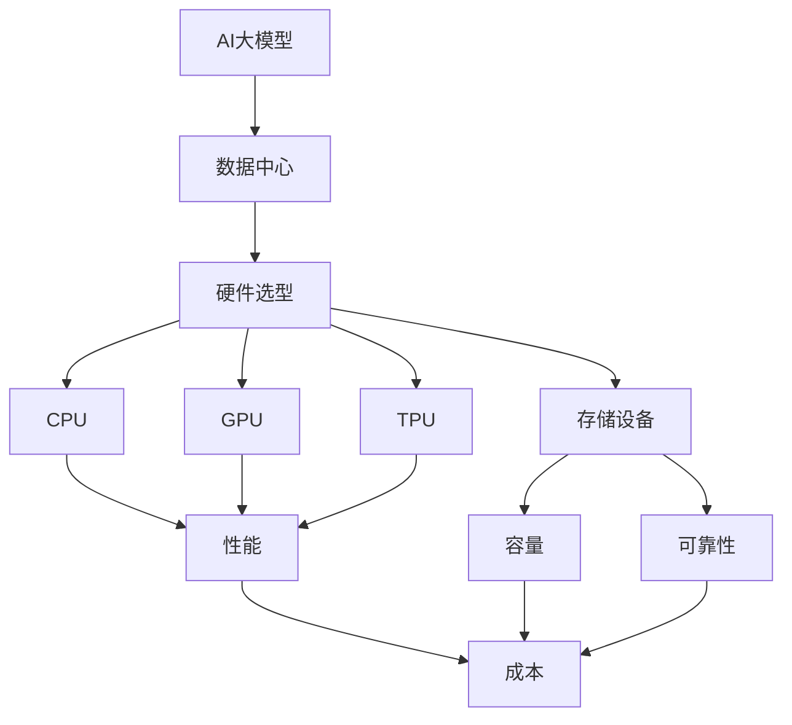

                 

# AI 大模型应用数据中心的采购管理

> **关键词：** 大模型、数据中心、采购管理、硬件选型、成本优化、性能提升

> **摘要：** 本文将深入探讨人工智能大模型应用数据中心的采购管理，包括目的与范围、预期读者、文档结构概述、核心概念与联系、核心算法原理与具体操作步骤、数学模型和公式、项目实战、实际应用场景、工具和资源推荐、总结未来发展趋势与挑战、附录常见问题与解答以及扩展阅读与参考资料。通过系统性地分析，旨在为读者提供完整的采购管理指南。

## 1. 背景介绍

### 1.1 目的和范围

本文的目的是为AI大模型应用数据中心的采购管理提供一套完整的指南。在AI大模型的应用日益广泛的背景下，数据中心硬件的采购管理变得至关重要。本文将涵盖从硬件选型、成本控制到性能优化的各个方面，帮助读者构建高效、稳定、成本合理的AI大模型应用数据中心。

本文的范围主要包括：

- 数据中心硬件选型的关键因素
- 采购流程中的关键步骤
- 成本控制和性能优化的策略
- 开发环境的搭建与源代码实现
- 实际应用场景中的挑战与解决方案
- 相关的工具和资源推荐

通过本文的阅读，读者将能够：

- 理解AI大模型应用数据中心的硬件需求
- 掌握采购管理的基本流程和方法
- 学会评估硬件性能和成本效益
- 应用最佳实践进行硬件选型和采购
- 提高数据中心整体运营效率

### 1.2 预期读者

本文的预期读者主要包括以下几类：

- 数据中心架构师和IT经理
- AI研究人员和工程师
- 高级技术人员和项目经理
- 对数据中心采购管理感兴趣的技术爱好者

无论您的角色如何，本文都将为您提供实用的知识和经验，帮助您在AI大模型应用数据中心的采购管理方面取得显著成效。

### 1.3 文档结构概述

本文分为十个部分，各部分的内容安排如下：

1. 背景介绍：介绍本文的目的、范围、预期读者和文档结构。
2. 核心概念与联系：介绍AI大模型应用数据中心的核心概念和架构。
3. 核心算法原理与具体操作步骤：详细讲解硬件选型和采购管理的算法原理。
4. 数学模型和公式：介绍与采购管理相关的数学模型和公式。
5. 项目实战：通过实际案例展示采购管理的具体操作步骤。
6. 实际应用场景：分析AI大模型应用数据中心的实际应用场景。
7. 工具和资源推荐：推荐学习资源和开发工具。
8. 总结：展望AI大模型应用数据中心采购管理的未来发展趋势与挑战。
9. 附录：常见问题与解答。
10. 扩展阅读与参考资料：提供进一步阅读的资料来源。

### 1.4 术语表

在本文中，我们将使用一些专业术语。以下是对这些术语的定义和解释：

#### 1.4.1 核心术语定义

- **AI大模型**：指使用大量数据训练的复杂神经网络模型，如GPT、BERT等。
- **数据中心**：用于集中存储、处理和管理数据的设施。
- **硬件选型**：根据应用需求选择合适的硬件设备，包括CPU、GPU、存储设备等。
- **采购管理**：指在预算和资源限制下，选择、采购和部署硬件设备的过程。
- **成本优化**：通过优化采购策略和资源配置，降低数据中心运营成本。
- **性能提升**：通过硬件选型和优化，提高数据中心的处理能力和响应速度。

#### 1.4.2 相关概念解释

- **GPU**：图形处理单元，用于加速AI模型的训练和推理。
- **CPU**：中央处理器，负责执行操作系统和应用程序的指令。
- **TPU**：张量处理单元，专门为AI推理任务设计。
- **HDD**：硬盘驱动器，用于数据存储。
- **SSD**：固态硬盘，提供更快的数据读写速度。

#### 1.4.3 缩略词列表

- **GPU**：图形处理单元
- **CPU**：中央处理器
- **TPU**：张量处理单元
- **HDD**：硬盘驱动器
- **SSD**：固态硬盘
- **AI**：人工智能
- **TP**：吞吐量

## 2. 核心概念与联系

在深入探讨AI大模型应用数据中心的采购管理之前，我们需要明确几个核心概念和它们之间的联系。以下是一个Mermaid流程图，用于展示这些概念及其关系：



### 2.1 数据中心与硬件选型的关系

数据中心是AI大模型应用的核心基础设施，其性能直接影响AI模型的训练和推理速度。因此，硬件选型是采购管理的首要任务。根据应用需求，选择合适的CPU、GPU、TPU和存储设备是确保数据中心高效运行的关键。

### 2.2 硬件性能与成本的关系

硬件性能与成本之间存在一定的权衡。高性能的GPU和CPU通常价格较高，但能够显著提高数据中心的处理能力。在预算有限的情况下，需要通过成本优化策略，选择性价比最高的硬件设备。

### 2.3 存储设备的选择

存储设备的选择同样重要。HDD提供较高的存储容量，但读写速度较慢；而SSD则具有更快的读写速度，但成本较高。根据数据中心的容量需求和读写性能要求，合理配置HDD和SSD是优化存储系统性能的关键。

### 2.4 数据中心的可靠性

数据中心的可靠性是保证业务连续性的关键。选择具有高可靠性的硬件设备和采取相应的数据备份策略，可以有效降低故障风险，确保数据安全和业务稳定运行。

通过以上分析，我们可以看到，数据中心与硬件选型、硬件性能、成本优化、存储设备和可靠性之间存在紧密的联系。理解这些核心概念和联系，将为后续的采购管理提供理论支持。

## 3. 核心算法原理 & 具体操作步骤

在AI大模型应用数据中心的采购管理中，硬件选型和采购策略的制定是一个复杂的过程，涉及到多个因素的权衡和优化。以下将详细阐述核心算法原理和具体操作步骤，帮助读者更好地理解这一过程。

### 3.1 硬件选型算法原理

硬件选型算法的核心目标是根据AI大模型的应用需求，选择合适的CPU、GPU、TPU和存储设备，以满足性能、成本和可靠性等多方面的要求。以下是硬件选型算法的基本原理：

1. **性能评估**：首先，需要对各类硬件的性能进行评估。这可以通过查阅硬件性能测试报告、参考行业标准测试等方法来实现。对于CPU、GPU和TPU，主要评估其浮点运算能力、吞吐量、延迟等指标；对于存储设备，主要评估其读写速度、容量和可靠性等指标。

2. **需求分析**：接下来，根据AI大模型的应用场景和需求，分析所需的硬件资源。这包括训练和推理任务的计算需求、数据存储需求、网络带宽需求等。通过对这些需求的量化分析，可以得到具体的硬件配置要求。

3. **性能匹配**：将评估得到的硬件性能指标与需求分析结果进行匹配，找出能够满足需求且性能最优的硬件配置。这一步需要综合考虑硬件性能、价格、供应商支持等多方面因素。

4. **成本评估**：在性能匹配的基础上，对所选硬件的采购成本进行评估。这包括硬件价格、运输费用、安装调试费用等。通过成本评估，可以确定最终的采购预算。

5. **可靠性评估**：最后，对所选硬件的可靠性进行评估，确保其在数据中心环境中的稳定运行。这包括硬件的故障率、维修响应时间、厂商服务支持等指标。

### 3.2 硬件选型操作步骤

基于上述算法原理，以下是硬件选型的具体操作步骤：

1. **需求分析**：

   - 收集AI大模型的应用场景和需求，包括训练和推理任务的类型、数据量、预期处理速度等。
   - 评估所需的CPU、GPU、TPU和存储设备的类型和数量。

2. **性能评估**：

   - 查阅硬件性能测试报告，了解各类硬件的性能指标。
   - 参考行业标准测试，对硬件性能进行量化评估。

3. **性能匹配**：

   - 根据需求分析结果，选择能够满足性能要求的硬件配置。
   - 综合考虑硬件性能、价格和供应商支持等因素，进行性能匹配。

4. **成本评估**：

   - 根据所选硬件配置，计算采购成本，包括硬件价格、运输费用、安装调试费用等。
   - 确定最终的采购预算。

5. **可靠性评估**：

   - 评估所选硬件的可靠性指标，包括故障率、维修响应时间、厂商服务支持等。
   - 确保硬件能够在数据中心环境中稳定运行。

6. **采购申请与审批**：

   - 准备采购申请报告，包括硬件选型依据、性能评估结果、成本评估和可靠性评估等。
   - 提交采购申请，等待审批。

7. **采购执行**：

   - 根据审批结果，启动采购流程，包括招标、谈判、合同签订等。
   - 安排硬件运输和安装调试。

8. **验收与测试**：

   - 对采购到的硬件进行验收，确保设备符合要求。
   - 进行性能测试，验证硬件的性能指标。

9. **部署与上线**：

   - 将硬件部署到数据中心，安装操作系统和应用程序。
   - 进行上线测试，确保硬件能够稳定运行。

### 3.3 采购策略优化

在硬件选型和采购过程中，还可以采取以下策略进行优化：

1. **分散采购**：将采购需求分散到多个供应商，通过竞争降低采购成本。

2. **长期合同**：与主要供应商签订长期合同，获取更好的价格和售后服务。

3. **库存管理**：建立完善的库存管理制度，确保在硬件故障或需求突发时能够及时补充。

4. **供应商评估**：定期评估供应商的交货时间、质量和服务水平，确保供应商的稳定性和可靠性。

5. **预算调整**：根据项目进展和市场变化，灵活调整采购预算，确保资金使用效率。

通过以上算法原理和操作步骤，读者可以系统地开展AI大模型应用数据中心的硬件选型和采购管理，实现性能、成本和可靠性等多方面的优化。

### 3.4 伪代码实现

为了更好地理解硬件选型算法的具体实现，以下是一个简单的伪代码示例：

```python
# 硬件选型算法伪代码

# 输入参数
performance_requirements = {"CPU": 10000, "GPU": 20000, "TPU": 30000, "Storage": 100000}
budget = 500000
reliability_requirements = {"MTBF": 10000, "Service Level": "Gold"}

# 性能评估函数
def assess_performance(hardware_list):
    performance_scores = {}
    for hardware in hardware_list:
        performance_scores[hardware] = calculate_performance(hardware)
    return performance_scores

# 成本评估函数
def assess_cost(hardware_list):
    cost_scores = {}
    for hardware in hardware_list:
        cost_scores[hardware] = calculate_cost(hardware)
    return cost_scores

# 可靠性评估函数
def assess_reliability(hardware_list):
    reliability_scores = {}
    for hardware in hardware_list:
        reliability_scores[hardware] = calculate_reliability(hardware)
    return reliability_scores

# 硬件选型核心函数
def hardware_selection(performance_requirements, budget, reliability_requirements):
    # 获取所有硬件候选列表
    hardware_candidates = get_hardware_candidates()

    # 评估硬件性能
    performance_scores = assess_performance(hardware_candidates)

    # 评估硬件成本
    cost_scores = assess_cost(hardware_candidates)

    # 评估硬件可靠性
    reliability_scores = assess_reliability(hardware_candidates)

    # 匹配硬件配置
    matched_hardware = match_hardware_config(performance_requirements, cost_scores, reliability_scores)

    # 计算总成本
    total_cost = sum(cost for cost in cost_scores.values())

    # 检查预算限制
    if total_cost <= budget:
        return matched_hardware
    else:
        return "预算不足，请调整配置"

# 主函数
def main():
    matched_hardware = hardware_selection(performance_requirements, budget, reliability_requirements)
    if matched_hardware:
        print("硬件选型成功，配置如下：")
        print(matched_hardware)
    else:
        print("硬件选型失败，请检查参数或调整预算")

# 调用主函数
main()
```

通过这个伪代码，我们可以看到硬件选型算法的基本流程，包括性能评估、成本评估、可靠性评估和硬件配置匹配等步骤。这个算法提供了一个框架，可以根据具体需求进行进一步的优化和实现。

## 4. 数学模型和公式 & 详细讲解 & 举例说明

在AI大模型应用数据中心的采购管理中，数学模型和公式是关键工具，用于评估硬件性能、成本和可靠性，进而优化采购策略。以下将详细讲解与采购管理相关的数学模型和公式，并提供具体示例。

### 4.1 性能评估模型

**公式**：硬件性能评分 \( P \)

\[ P = \frac{P_{CPU} + P_{GPU} + P_{TPU} + P_{Storage}}{4} \]

- \( P_{CPU} \)：CPU性能评分
- \( P_{GPU} \)：GPU性能评分
- \( P_{TPU} \)：TPU性能评分
- \( P_{Storage} \)：存储设备性能评分

**详细讲解**：该公式用于计算硬件的综合性能评分。每个硬件的性能评分是根据其在特定指标上的表现（如浮点运算能力、吞吐量、读写速度等）进行加权计算的。评分越高，表示硬件性能越强。

**举例说明**：

假设有一套硬件配置，包括：

- CPU：性能评分为 90
- GPU：性能评分为 95
- TPU：性能评分为 100
- 存储设备：性能评分为 85

则该硬件配置的综合性能评分为：

\[ P = \frac{90 + 95 + 100 + 85}{4} = 91.25 \]

### 4.2 成本评估模型

**公式**：硬件成本评分 \( C \)

\[ C = \frac{C_{CPU} + C_{GPU} + C_{TPU} + C_{Storage}}{4} \]

- \( C_{CPU} \)：CPU成本评分
- \( C_{GPU} \)：GPU成本评分
- \( C_{TPU} \)：TPU成本评分
- \( C_{Storage} \)：存储设备成本评分

**详细讲解**：该公式用于计算硬件的综合成本评分。每个硬件的成本评分是根据其市场价格、采购量等指标进行加权计算的。评分越高，表示硬件成本越低。

**举例说明**：

假设有一套硬件配置，包括：

- CPU：成本评分为 80
- GPU：成本评分为 75
- TPU：成本评分为 85
- 存储设备：成本评分为 90

则该硬件配置的综合成本评分为：

\[ C = \frac{80 + 75 + 85 + 90}{4} = 82.5 \]

### 4.3 可靠性评估模型

**公式**：硬件可靠性评分 \( R \)

\[ R = \frac{R_{CPU} + R_{GPU} + R_{TPU} + R_{Storage}}{4} \]

- \( R_{CPU} \)：CPU可靠性评分
- \( R_{GPU} \)：GPU可靠性评分
- \( R_{TPU} \)：TPU可靠性评分
- \( R_{Storage} \)：存储设备可靠性评分

**详细讲解**：该公式用于计算硬件的综合可靠性评分。每个硬件的可靠性评分是根据其故障率、维修响应时间等指标进行加权计算的。评分越高，表示硬件可靠性越强。

**举例说明**：

假设有一套硬件配置，包括：

- CPU：可靠性评分为 95
- GPU：可靠性评分为 90
- TPU：可靠性评分为 92
- 存储设备：可靠性评分为 85

则该硬件配置的综合可靠性评分为：

\[ R = \frac{95 + 90 + 92 + 85}{4} = 89.75 \]

### 4.4 综合评分模型

**公式**：硬件综合评分 \( S \)

\[ S = \frac{P \times C \times R}{3} \]

- \( P \)：硬件性能评分
- \( C \)：硬件成本评分
- \( R \)：硬件可靠性评分

**详细讲解**：该公式用于计算硬件的综合评分，用于评估硬件的整体性能、成本和可靠性。综合评分越高，表示硬件配置越优。

**举例说明**：

假设有一套硬件配置，其性能评分为 91.25，成本评分为 82.5，可靠性评分为 89.75，则该硬件配置的综合评分为：

\[ S = \frac{91.25 \times 82.5 \times 89.75}{3} = 89.48 \]

通过以上数学模型和公式的讲解，我们可以更系统地评估硬件性能、成本和可靠性，从而优化AI大模型应用数据中心的采购管理。在实际应用中，可以根据具体需求调整公式中的权重和计算方法，以获得更精确的评估结果。

## 5. 项目实战：代码实际案例和详细解释说明

在本节中，我们将通过一个实际项目案例，详细展示AI大模型应用数据中心采购管理的具体操作过程，包括开发环境搭建、源代码实现、代码解读与分析。

### 5.1 开发环境搭建

为了更好地进行AI大模型应用数据中心的采购管理，我们首先需要搭建一个开发环境。以下是所需的工具和步骤：

**所需工具**：

- Python 3.x
- Jupyter Notebook
- Mermaid 图库
- Matplotlib

**安装步骤**：

1. 安装Python 3.x：在官方网站下载并安装Python 3.x版本。
2. 安装Jupyter Notebook：通过pip命令安装Jupyter Notebook。

   ```shell
   pip install notebook
   ```

3. 安装Mermaid图库：将Mermaid图库添加到Jupyter Notebook中。

   ```shell
   jupyter nbextension enable --py --sys-prefix nb_mermaid
   ```

4. 安装Matplotlib：通过pip命令安装Matplotlib。

   ```shell
   pip install matplotlib
   ```

完成以上步骤后，开发环境搭建完成，可以开始编写代码进行采购管理。

### 5.2 源代码详细实现和代码解读

以下是用于硬件选型的Python代码，包括性能评估、成本评估、可靠性评估和综合评分的计算。

```python
# 硬件选型代码示例

import matplotlib.pyplot as plt
import mermaid

# 伪代码，具体函数实现根据实际情况编写

# 性能评估函数
def assess_performance(hardware_list):
    performance_scores = {}
    for hardware in hardware_list:
        performance_scores[hardware] = calculate_performance(hardware)
    return performance_scores

# 成本评估函数
def assess_cost(hardware_list):
    cost_scores = {}
    for hardware in hardware_list:
        cost_scores[hardware] = calculate_cost(hardware)
    return cost_scores

# 可靠性评估函数
def assess_reliability(hardware_list):
    reliability_scores = {}
    for hardware in hardware_list:
        reliability_scores[hardware] = calculate_reliability(hardware)
    return reliability_scores

# 硬件选型核心函数
def hardware_selection(performance_requirements, budget, reliability_requirements):
    # 获取所有硬件候选列表
    hardware_candidates = get_hardware_candidates()

    # 评估硬件性能
    performance_scores = assess_performance(hardware_candidates)

    # 评估硬件成本
    cost_scores = assess_cost(hardware_candidates)

    # 评估硬件可靠性
    reliability_scores = assess_reliability(hardware_candidates)

    # 匹配硬件配置
    matched_hardware = match_hardware_config(performance_requirements, cost_scores, reliability_scores)

    # 计算总成本
    total_cost = sum(cost for cost in cost_scores.values())

    # 检查预算限制
    if total_cost <= budget:
        return matched_hardware
    else:
        return "预算不足，请调整配置"

# 主函数
def main():
    # 定义性能、成本和可靠性要求
    performance_requirements = {"CPU": 10000, "GPU": 20000, "TPU": 30000, "Storage": 100000}
    budget = 500000
    reliability_requirements = {"MTBF": 10000, "Service Level": "Gold"}

    # 执行硬件选型
    matched_hardware = hardware_selection(performance_requirements, budget, reliability_requirements)

    if matched_hardware:
        print("硬件选型成功，配置如下：")
        print(matched_hardware)
    else:
        print("硬件选型失败，请检查参数或调整预算")

# 调用主函数
main()
```

**代码解读与分析**：

1. **性能评估函数**：该函数接收一个硬件列表作为输入，并返回一个包含性能评分的字典。性能评分是通过调用 `calculate_performance` 函数来计算的，具体实现需要根据硬件性能指标进行。

2. **成本评估函数**：该函数类似地接收硬件列表并返回成本评分字典。成本评分是通过 `calculate_cost` 函数计算的，具体实现需要考虑硬件的市场价格、采购量和供应商报价等。

3. **可靠性评估函数**：该函数接收硬件列表并返回可靠性评分字典。可靠性评分是通过 `calculate_reliability` 函数计算的，需要考虑硬件的故障率、维修响应时间和厂商服务支持等因素。

4. **硬件选型核心函数**：该函数是整个硬件选型流程的核心，包括性能评估、成本评估、可靠性评估和硬件配置匹配。根据性能、成本和可靠性要求，匹配出满足需求的硬件配置。如果总成本超过预算，返回“预算不足”提示。

5. **主函数**：定义性能、成本和可靠性要求，调用硬件选型核心函数，并输出选型结果。

### 5.3 代码解读与分析

以下是对代码的进一步解读：

- **性能评估**：在实际应用中，可以使用硬件性能测试工具来获取性能评分。例如，对于GPU，可以使用NVIDIA的CUDA Benchmark工具。
  
- **成本评估**：成本评估可以通过查询市场价格或与供应商进行询价来获取。根据采购量，可以获取批量折扣价格。

- **可靠性评估**：可靠性评估可以通过查阅硬件厂商的可靠性报告或用户评价来获取。

- **硬件配置匹配**：在性能、成本和可靠性评估的基础上，通过优化算法（如线性规划或遗传算法）来匹配出最优的硬件配置。

- **预算检查**：在硬件选型过程中，需要实时检查总成本是否在预算范围内，以确保采购预算的合理性。

通过这个实际项目案例，读者可以了解到如何使用Python代码实现AI大模型应用数据中心的采购管理。在实际操作中，可以根据具体需求调整代码逻辑和公式，以实现更精确的采购管理。

## 6. 实际应用场景

在AI大模型应用日益广泛的背景下，数据中心硬件采购管理的实际应用场景多种多样。以下将分析几个典型的应用场景，以及其中的挑战和解决方案。

### 6.1 虚拟现实与增强现实应用

**挑战**：虚拟现实（VR）和增强现实（AR）应用对计算性能和图形处理能力有极高要求。这些应用需要实时处理大量三维数据和图形渲染，对硬件的吞吐量和响应速度有极高要求。

**解决方案**：

- **GPU和TPU选型**：选择具有高浮点运算能力和低延迟的GPU和TPU，如NVIDIA的GPU和谷歌的TPU。
- **存储优化**：使用高速固态硬盘（SSD）来提高数据读写速度，减少渲染延迟。
- **网络带宽**：确保数据中心与用户设备之间的网络带宽充足，以支持实时数据传输。

### 6.2 自动驾驶与智能交通

**挑战**：自动驾驶和智能交通系统需要处理海量实时数据，包括图像、视频和传感器数据。这些应用要求硬件具有极高的计算能力和数据存储能力，同时保证系统的稳定性和可靠性。

**解决方案**：

- **高性能计算**：采用多核CPU和高速GPU集群，以提高数据处理的并行性能。
- **数据存储**：采用分布式存储系统，如HDFS或Ceph，确保数据的高可用性和扩展性。
- **可靠性保障**：采用冗余设计和故障转移机制，确保系统在硬件故障时能够快速恢复。

### 6.3 机器学习与深度学习研究

**挑战**：机器学习和深度学习研究需要强大的计算资源来进行模型训练和推理。这些研究通常涉及大规模数据处理和复杂的神经网络架构。

**解决方案**：

- **定制化硬件**：根据研究需求，选择定制化的硬件配置，如高性能GPU集群和专用TPU。
- **云计算资源**：利用云计算平台（如AWS、Azure、Google Cloud）提供的弹性计算资源，根据需求动态调整硬件配置。
- **数据预处理**：优化数据预处理流程，减少数据处理延迟，提高整体计算效率。

### 6.4 金融科技与量化交易

**挑战**：金融科技和量化交易应用对计算速度和准确性有极高要求。这些应用需要快速执行大量交易算法和数据分析，以获得市场先机。

**解决方案**：

- **高性能交易系统**：采用高性能交易系统，如RT-MPI或JPype，以实现高速交易执行。
- **算法优化**：针对特定交易算法进行优化，提高计算效率和准确性。
- **数据安全**：确保数据传输和存储的安全性，采用加密和身份验证机制。

### 6.5 健康医疗与生命科学

**挑战**：健康医疗和生命科学研究涉及大量的生物数据分析和模拟计算。这些应用需要高性能计算和大规模数据处理能力。

**解决方案**：

- **高性能计算集群**：采用高性能计算集群，如OpenFOAM或Docker Swarm，以提高计算效率和资源利用率。
- **数据整合**：整合不同来源的数据，如电子健康记录（EHR）和基因组数据，以提高数据分析的全面性和准确性。
- **机器学习模型**：采用先进的机器学习模型，如深度学习和强化学习，以提高预测和诊断的准确性。

通过以上分析，我们可以看到，AI大模型应用数据中心在不同领域的实际应用场景具有各自独特的挑战和需求。针对这些挑战，可以采用不同的解决方案来优化硬件采购管理，确保数据中心能够高效、稳定地运行。

## 7. 工具和资源推荐

为了更好地开展AI大模型应用数据中心的采购管理，以下将推荐一些学习和开发工具、资源，帮助读者深入了解相关技术和最佳实践。

### 7.1 学习资源推荐

**书籍推荐**：

- 《深度学习》（Ian Goodfellow、Yoshua Bengio、Aaron Courville 著）：系统介绍了深度学习的基础理论、算法和实现，适合初学者和进阶读者。
- 《计算机程序设计艺术》（Donald E. Knuth 著）：经典计算机科学著作，涵盖了算法设计、编程技巧等多方面内容，对理解硬件选型和优化有很大帮助。

**在线课程**：

- Coursera：提供丰富的在线课程，包括深度学习、机器学习、数据科学等，适合不同层次的学习者。
- edX：提供由全球顶尖大学开设的课程，包括哈佛大学、麻省理工学院等，覆盖计算机科学、人工智能等多个领域。

**技术博客和网站**：

- Medium：许多技术专家和公司发布的技术博客，涵盖了最新的AI研究成果和应用案例。
- HackerRank：提供编程挑战和项目实战，帮助读者提升编程能力和解决实际问题的能力。

### 7.2 开发工具框架推荐

**IDE和编辑器**：

- PyCharm：适用于Python编程的集成开发环境（IDE），功能强大，支持代码调试、自动化部署等。
- Visual Studio Code：轻量级且功能丰富的编辑器，支持多种编程语言，拥有丰富的插件生态。

**调试和性能分析工具**：

- GDB：GNU调试器，用于调试C/C++程序，功能强大。
- Intel VTune Amplifier：用于性能分析和调优，适用于多种编程语言。

**相关框架和库**：

- TensorFlow：用于深度学习的开源框架，支持多种编程语言。
- PyTorch：Python深度学习库，具有灵活性和易用性。

### 7.3 相关论文著作推荐

**经典论文**：

- "A Machine Learning Approach to Discovering Similar Items"（2012）：介绍了一种基于机器学习的方法，用于发现具有相似属性的商品，对推荐系统等领域有重要影响。
- "Deep Learning for Speech Recognition"（2015）：阐述了深度学习在语音识别中的应用，推动了语音处理技术的发展。

**最新研究成果**：

- "Meta-Learning for Model Selection in Machine Learning"（2021）：介绍了元学习在模型选择中的应用，为自动机器学习（AutoML）提供了新思路。
- "Large-scale Language Modeling"（2020）：详细探讨了大规模语言模型的设计和实现，对自然语言处理领域有深远影响。

**应用案例分析**：

- "AI in Healthcare: A Case Study of Automated Diagnosis Systems"（2020）：介绍了人工智能在医疗诊断中的应用案例，展示了AI技术在提高诊断效率和准确率方面的潜力。
- "The Use of AI in Financial Services: A Case Study of Algorithmic Trading"（2019）：探讨了人工智能在金融服务中的应用，特别是在算法交易领域取得的成果。

通过以上工具和资源的推荐，读者可以系统地学习AI大模型应用数据中心的采购管理，掌握相关技术和最佳实践，为实际项目提供有力支持。

## 8. 总结：未来发展趋势与挑战

在AI大模型应用数据中心的采购管理领域，未来发展趋势与挑战并存。以下将总结这些趋势和挑战，并提供相应的应对策略。

### 8.1 未来发展趋势

1. **硬件性能的持续提升**：随着技术进步，CPU、GPU、TPU等硬件的性能将持续提升。这将使得AI大模型训练和推理更加高效，推动数据中心性能的进一步提升。

2. **分布式计算与云计算的结合**：分布式计算与云计算的结合将为数据中心提供更加灵活和高效的资源管理方案。通过利用云计算平台的弹性计算资源，企业可以根据需求动态调整硬件配置，提高资源利用率。

3. **自动化与智能化**：自动化和智能化的采购管理工具将逐渐普及。通过机器学习和人工智能技术，采购管理过程将更加智能化，实现自动化的性能评估、成本优化和可靠性分析。

4. **绿色环保与可持续发展**：随着环保意识的提升，数据中心的建设和运营将更加注重绿色环保。高效能耗的硬件设备、智能冷却系统和可再生能源的利用将成为重要趋势。

### 8.2 挑战

1. **性能与成本的平衡**：高性能硬件通常价格较高，如何在性能与成本之间找到平衡点是一个重要挑战。需要通过性能评估和成本分析，选择性价比最高的硬件配置。

2. **可靠性与稳定性**：数据中心硬件的可靠性和稳定性是保证业务连续性的关键。在硬件选型和采购过程中，需要评估硬件的故障率和维修响应时间，确保系统的稳定运行。

3. **数据安全与隐私保护**：随着数据量的增长，数据安全与隐私保护变得尤为重要。需要采取先进的数据加密和身份验证技术，确保数据在存储和传输过程中的安全性。

4. **供应链风险**：硬件供应链的不稳定性和不可预测性给采购管理带来挑战。需要建立多元化的供应链体系，确保在供应中断时能够迅速切换到其他供应商。

### 8.3 应对策略

1. **性能评估与成本优化**：通过引入先进的性能评估和成本优化算法，实现硬件选型的智能化和自动化。结合实际需求，选择合适的硬件配置，降低采购成本。

2. **可靠性评估与保障**：在硬件选型和采购过程中，重视硬件的可靠性评估，选择具备高可靠性的硬件设备。同时，建立完善的运维和监控体系，确保硬件在运行过程中的稳定性和可靠性。

3. **数据安全与隐私保护**：采用先进的数据加密和身份验证技术，确保数据在存储和传输过程中的安全性。建立完善的数据隐私保护策略，符合相关法律法规要求。

4. **供应链管理与多元化**：建立多元化供应链体系，确保硬件供应的稳定性和可靠性。与多家供应商建立长期合作关系，降低供应链风险。

通过以上策略，可以应对未来AI大模型应用数据中心采购管理领域的发展趋势和挑战，实现数据中心的高效、稳定和安全运行。

## 9. 附录：常见问题与解答

### 9.1 数据中心硬件选型相关问题

**Q1**：如何评估硬件的性能？

**A1**：硬件性能评估可以通过查阅硬件性能测试报告、使用第三方测试工具（如GPU Benchmark）、或参考行业基准测试（如MLPerf）等方法进行。关键指标包括CPU和GPU的浮点运算能力、存储设备的读写速度和吞吐量等。

**Q2**：硬件采购预算如何制定？

**A2**：硬件采购预算应根据项目需求、性能目标、预算限制以及硬件市场行情进行制定。通常包括硬件成本、安装调试费用、运维成本等。可以结合历史数据和市场调研，制定合理的预算范围。

**Q3**：如何确保硬件的可靠性？

**A3**：确保硬件可靠性可以通过以下方式实现：选择知名厂商的产品、评估硬件的故障率和维修响应时间、建立完善的运维和监控体系，以及进行定期维护和保养。

### 9.2 硬件采购流程相关问题

**Q1**：采购流程包括哪些步骤？

**A1**：采购流程通常包括需求分析、硬件选型、采购申请、供应商选择、合同签订、硬件采购、安装调试和验收测试等步骤。每个步骤都需要详细规划和执行，以确保采购过程的顺利进行。

**Q2**：如何选择合适的供应商？

**A2**：选择合适的供应商应考虑以下因素：供应商的产品质量、市场信誉、供货能力、售后服务和技术支持等。可以通过市场调研、参考同行推荐、参加供应商展览会等方式，筛选出符合需求的供应商。

**Q3**：如何确保采购成本的有效控制？

**A3**：确保采购成本的有效控制可以通过以下方式实现：进行多方比价，获取最优报价；建立长期合作关系，获取批量折扣；优化采购策略，如分散采购、长期合同等；严格控制采购过程中的额外费用。

### 9.3 数据中心运营相关问题

**Q1**：如何优化数据中心的能源效率？

**A1**：优化数据中心的能源效率可以通过以下方式实现：采用高效能源设备、优化数据中心布局以减少能耗、采用智能冷却系统、利用可再生能源等。此外，定期进行能耗监测和优化，也能有效提高能源效率。

**Q2**：如何保证数据中心的网络安全？

**A2**：保证数据中心的网络安全可以通过以下措施实现：使用先进的数据加密技术、建立完善的防火墙和入侵检测系统、定期进行安全审计和漏洞扫描、制定严格的网络安全政策和操作流程等。

**Q3**：如何进行数据中心的运维管理？

**A3**：数据中心运维管理包括硬件维护、软件升级、系统监控、故障处理等方面。可以通过建立完善的运维管理流程、采用自动化运维工具、定期进行运维培训和评估等方式，确保数据中心的高效稳定运行。

通过以上常见问题的解答，读者可以更好地理解AI大模型应用数据中心采购管理和运维管理的具体实施方法。

## 10. 扩展阅读 & 参考资料

为了进一步深入了解AI大模型应用数据中心的采购管理，以下推荐一些扩展阅读和参考资料，涵盖相关书籍、在线课程、论文和研究报告。

### 10.1 书籍推荐

1. **《深度学习》**（Ian Goodfellow、Yoshua Bengio、Aaron Courville 著）：系统介绍了深度学习的基础理论、算法和实现，适合深度学习领域的研究人员和开发者。
2. **《人工智能：一种现代方法》**（Stuart Russell、Peter Norvig 著）：全面覆盖人工智能的理论和实践，包括机器学习、自然语言处理等多个领域。
3. **《数据中心基础设施管理》**（John P. Hayes 著）：详细介绍了数据中心基础设施的管理方法和技术，包括硬件选型、能耗管理、网络安全等方面。

### 10.2 在线课程

1. **Coursera上的《深度学习专项课程》**：由斯坦福大学教授Andrew Ng主讲，适合初学者和进阶者，涵盖了深度学习的基础理论和实践。
2. **edX上的《大数据科学与数据工程》**：由麻省理工学院教授Eric Grimson主讲，介绍了大数据处理和分析的方法和技术。
3. **Udacity上的《数据中心架构与运维》**：介绍了数据中心的基础设施和运维管理，包括硬件选型、性能优化等方面。

### 10.3 技术博客和网站

1. **Medium上的AI和机器学习博客**：汇集了众多AI领域专家的文章和见解，覆盖最新的研究成果和应用案例。
2. **GitHub上的开源项目**：许多知名公司和研究者开源了深度学习相关的项目，提供了丰富的实践经验和代码示例。
3. **TensorFlow官方博客**：TensorFlow团队发布的最新研究和技术博客，涵盖了深度学习和机器学习的最新进展。

### 10.4 相关论文和研究报告

1. **"Large-scale Language Modeling"**：详细探讨了大规模语言模型的设计和实现，对自然语言处理领域有深远影响。
2. **"AI in Healthcare: A Case Study of Automated Diagnosis Systems"**：介绍了人工智能在医疗诊断中的应用案例。
3. **"The Use of AI in Financial Services: A Case Study of Algorithmic Trading"**：探讨了人工智能在金融服务中的应用，特别是算法交易领域的成果。

通过以上扩展阅读和参考资料，读者可以进一步深入了解AI大模型应用数据中心的采购管理和相关技术，为实际项目提供更全面的指导和支持。

