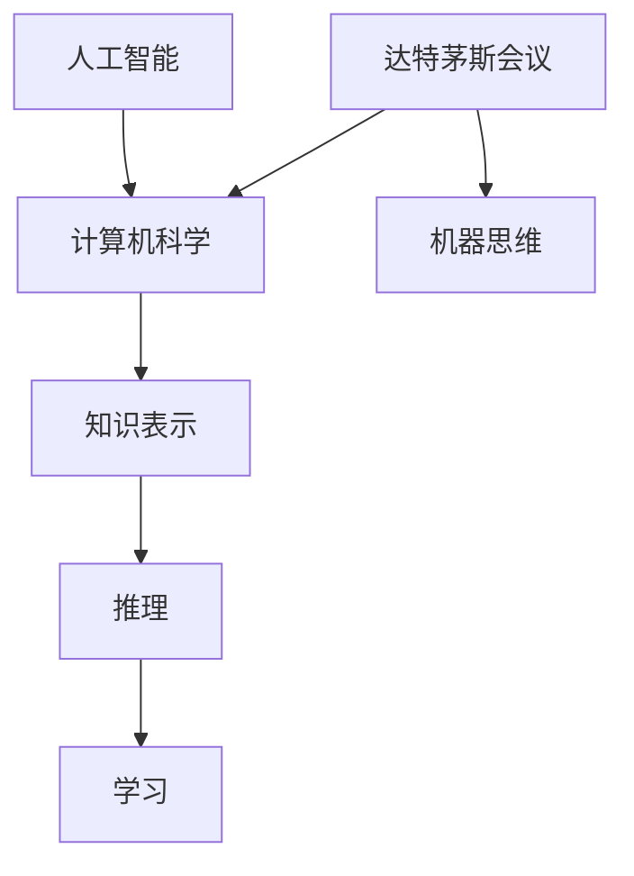

                 

# AI 大模型计算机科学家群英传：1956年达特茅斯会议

> 关键词：人工智能，计算机科学，达特茅斯会议，机器思维，智能发展历程，计算机科学家

> 摘要：本文将带领读者回顾1956年达特茅斯会议，这是人工智能历史上的一个重要转折点。本文将通过详细分析会议的核心议题、参与者和成果，探讨人工智能的发展历程、关键概念及其对计算机科学的影响。

## 1. 背景介绍

### 1.1 目的和范围

本文旨在回顾1956年达特茅斯会议，介绍会议的核心议题、参与者及其成果，探讨人工智能（Artificial Intelligence，简称AI）的发展历程、关键概念及其对计算机科学（Computer Science，简称CS）的影响。通过分析达特茅斯会议，我们将深入了解人工智能的起源、核心概念及其在计算机科学领域的应用。

### 1.2 预期读者

本文适合对人工智能和计算机科学感兴趣的读者，包括计算机科学专业的学生、研究人员和从业者，以及对人工智能技术有一定了解的普通读者。

### 1.3 文档结构概述

本文分为八个部分：

1. 背景介绍
2. 核心概念与联系
3. 核心算法原理 & 具体操作步骤
4. 数学模型和公式 & 详细讲解 & 举例说明
5. 项目实战：代码实际案例和详细解释说明
6. 实际应用场景
7. 工具和资源推荐
8. 总结：未来发展趋势与挑战

### 1.4 术语表

#### 1.4.1 核心术语定义

- **人工智能（Artificial Intelligence，简称AI）**：模拟、延伸和扩展人类智能的理论、方法、技术及应用。
- **计算机科学（Computer Science，简称CS）**：研究计算机硬件、软件及其应用的科学。
- **达特茅斯会议（Dartmouth Conference）**：1956年在美国新罕布什尔州达特茅斯学院召开的一场关于人工智能的会议。
- **机器思维（Machine Thinking）**：指机器在运行过程中所表现出的类似人类思考的能力。

#### 1.4.2 相关概念解释

- **知识表示（Knowledge Representation）**：研究如何将人类知识以形式化的方式存储在计算机中。
- **推理（Reasoning）**：基于已有知识，通过逻辑推理得出新的结论。
- **学习（Learning）**：机器从数据中获取知识，改善自身性能的过程。

#### 1.4.3 缩略词列表

- AI：人工智能
- CS：计算机科学
- Dartmouth：达特茅斯
- ML：机器学习

## 2. 核心概念与联系

在本文中，我们将介绍人工智能、计算机科学以及达特茅斯会议的核心概念和联系。为了更好地理解这些概念，我们将使用Mermaid流程图来展示它们之间的关联。



### 2.1 人工智能与计算机科学

人工智能是计算机科学的一个重要分支，旨在使计算机模拟、延伸和扩展人类智能。计算机科学为人工智能提供了理论基础、算法工具和技术手段，使人工智能得以快速发展。知识表示、推理和学习是人工智能的核心概念。

### 2.2 达特茅斯会议与人工智能

1956年达特茅斯会议是人工智能历史上的一个重要里程碑。会议的核心议题是讨论如何使机器具有智能，这直接催生了人工智能这一领域的诞生。会议的成果对人工智能的发展产生了深远影响，使计算机科学家开始重视人工智能的研究。

### 2.3 机器思维与人工智能

机器思维是人工智能领域的一个关键概念，它指的是机器在运行过程中所表现出的类似人类思考的能力。机器思维依赖于知识表示、推理和学习等核心概念，从而实现智能行为。

## 3. 核心算法原理 & 具体操作步骤

在人工智能的发展历程中，许多核心算法和理论被提出。在本节中，我们将介绍一些重要的算法原理，并使用伪代码来详细阐述其具体操作步骤。

### 3.1 反向传播算法

反向传播算法是一种用于训练神经网络的基本算法。它通过计算网络输出与实际输出之间的误差，并反向传播误差，更新网络权重，从而优化网络性能。

```python
# 伪代码：反向传播算法
def backpropagation(network, input_data, target_output):
    # 计算输出层误差
    output_error = target_output - network.output
    
    # 反向传播误差，更新权重
    for layer in reversed(network.layers):
        for neuron in layer.neurons:
            error = output_error * neuron.derivative
            neuron.weight -= learning_rate * error
```

### 3.2 决策树算法

决策树算法是一种常用的分类算法，通过构建一系列条件判断，将数据划分为不同的类别。

```python
# 伪代码：决策树算法
def decision_tree(data, attributes):
    if all_attributes_used(attributes):
        return majority_class(data)
    
    best_attribute = choose_best_attribute(data, attributes)
    decision_tree = {}
    for value in unique_values(best_attribute, data):
        sub_data = filter_data(data, best_attribute, value)
        decision_tree[value] = decision_tree(sub_data, attributes - {best_attribute})
    
    return decision_tree
```

### 3.3 聚类算法

聚类算法是一种用于无监督学习的算法，通过将数据划分为不同的簇，以揭示数据之间的内在结构。

```python
# 伪代码：聚类算法
def clustering(data, num_clusters):
    # 初始化聚类中心
    centroids = initialize_centroids(data, num_clusters)
    
    # 迭代更新聚类中心
    while not converged(centroids):
        assignments = assign_points_to_clusters(data, centroids)
        centroids = update_centroids(assignments, data, num_clusters)
    
    return centroids
```

## 4. 数学模型和公式 & 详细讲解 & 举例说明

在人工智能和计算机科学领域，许多算法和理论都涉及到数学模型和公式。在本节中，我们将介绍一些重要的数学模型和公式，并使用LaTeX格式进行详细讲解和举例说明。

### 4.1 概率论

概率论是人工智能和计算机科学的基础之一。以下是一个概率论的基本公式：

$$ P(A \cap B) = P(A) \cdot P(B|A) $$

这个公式表示两个事件A和B同时发生的概率等于事件A发生的概率乘以在事件A发生的条件下事件B发生的概率。

**举例说明**：

假设掷两个公平的硬币，事件A表示第一个硬币正面朝上，事件B表示第二个硬币正面朝上。则：

- \( P(A) = 0.5 \)
- \( P(B|A) = 0.5 \)

根据公式，两个硬币同时正面朝上的概率为：

$$ P(A \cap B) = 0.5 \cdot 0.5 = 0.25 $$

### 4.2 线性代数

线性代数在人工智能和计算机科学中有着广泛的应用。以下是一个线性代数的基本公式：

$$ x^T A x = (Ax)^T x $$

这个公式表示一个向量x与矩阵A的点积等于矩阵A与向量x的乘积的转置。

**举例说明**：

假设有矩阵A和向量x：

$$ A = \begin{bmatrix} 1 & 2 \\ 3 & 4 \end{bmatrix}, \quad x = \begin{bmatrix} 5 \\ 6 \end{bmatrix} $$

根据公式，向量x与矩阵A的点积为：

$$ x^T A x = \begin{bmatrix} 5 & 6 \end{bmatrix} \begin{bmatrix} 1 & 2 \\ 3 & 4 \end{bmatrix} \begin{bmatrix} 5 \\ 6 \end{bmatrix} = \begin{bmatrix} 5 & 6 \end{bmatrix} \begin{bmatrix} 31 \\ 36 \end{bmatrix} = 195 $$

### 4.3 概率论与线性代数的结合

在人工智能和计算机科学中，概率论与线性代数的结合有着重要的应用。以下是一个结合的例子：

$$ P(X > \theta) = \int_{\theta}^{\infty} p(x) dx $$

这个公式表示随机变量X大于某个阈值θ的概率等于从阈值θ到无穷大的概率密度函数p(x)的积分。

**举例说明**：

假设随机变量X服从正态分布，均值为μ，方差为σ²，则X大于阈值θ的概率为：

$$ P(X > \theta) = \int_{\theta}^{\infty} \frac{1}{\sqrt{2\pi\sigma^2}} e^{-\frac{(x-\mu)^2}{2\sigma^2}} dx $$

这个积分可以通过查表或数值计算得到。

## 5. 项目实战：代码实际案例和详细解释说明

在本节中，我们将通过一个实际案例，展示如何使用Python实现一个简单的机器学习模型。这个案例将包括开发环境搭建、源代码详细实现和代码解读与分析。

### 5.1 开发环境搭建

首先，我们需要搭建一个Python开发环境。以下是搭建过程：

1. 安装Python：访问Python官方网站（https://www.python.org/）下载Python安装包，按照安装指南进行安装。
2. 安装Anaconda：Anaconda是一个Python分发版，包含了许多常用库和工具。访问Anaconda官方网站（https://www.anaconda.com/）下载并安装Anaconda。
3. 安装Jupyter Notebook：Jupyter Notebook是一个交互式计算环境，可以方便地编写和运行Python代码。在命令行中输入以下命令：

   ```bash
   conda install -c conda-forge notebook
   ```

### 5.2 源代码详细实现和代码解读

以下是一个简单的机器学习模型的实现，该模型使用线性回归算法对数据集进行拟合。

```python
# 导入所需的库
import numpy as np
import matplotlib.pyplot as plt

# 创建数据集
X = np.random.rand(100, 1)
y = 2 + 3 * X + np.random.randn(100, 1)

# 添加偏置项
X_b = np.c_[np.ones((100, 1)), X]

# 初始化参数
theta = np.random.rand(2, 1)

# 设置学习率和迭代次数
alpha = 0.01
num_iters = 2000

# 梯度下降算法
for i in range(num_iters):
    # 计算预测值
    h = np.dot(X_b, theta)
    
    # 计算损失函数
    loss = (1 / 2) * np.linalg.norm(h - y) ** 2
    
    # 计算梯度
    dtheta = (X_b.T.dot(h - y)).T
    
    # 更新参数
    theta -= alpha * dtheta

# 打印最终参数
print("Final theta:", theta)

# 绘制拟合曲线
plt.plot(X, y, "bo", X, np.dot(X_b, theta), "r-")
plt.xlabel("X")
plt.ylabel("Y")
plt.title("Linear Regression")
plt.show()
```

### 5.3 代码解读与分析

这个代码实现了一个线性回归模型，用于拟合数据集。以下是代码的详细解读和分析：

1. 导入所需的库：`numpy`用于数值计算，`matplotlib.pyplot`用于绘制图表。
2. 创建数据集：使用随机数生成器生成一组X和y值，其中y = 2 + 3 * X + ε，ε为随机噪声。
3. 添加偏置项：在数据集X中添加一列全1的偏置项，用于线性回归模型的求解。
4. 初始化参数：随机初始化参数θ。
5. 设置学习率和迭代次数：学习率α和迭代次数num_iters。
6. 梯度下降算法：
   - 计算预测值h：使用X_b和θ计算输出层预测值。
   - 计算损失函数：使用均方误差（MSE）作为损失函数，表示预测值与实际值之间的差距。
   - 计算梯度：计算损失函数关于θ的梯度，用于更新参数。
   - 更新参数：使用梯度下降算法更新θ。
7. 打印最终参数：输出最终拟合得到的θ值。
8. 绘制拟合曲线：使用matplotlib库绘制拟合曲线，展示模型对数据的拟合效果。

通过这个实际案例，我们了解了如何使用Python实现一个简单的机器学习模型，并对其代码进行了详细解读和分析。

## 6. 实际应用场景

人工智能和计算机科学在许多实际应用场景中发挥着重要作用。以下是一些典型的应用场景：

### 6.1 医疗领域

人工智能在医疗领域的应用非常广泛，包括疾病诊断、医学影像分析、药物研发等。例如，通过深度学习算法，可以实现对医学影像的自动分析，帮助医生快速准确地诊断疾病。此外，人工智能还可以用于个性化医疗，根据患者的基因信息、病史等数据，为其制定个性化的治疗方案。

### 6.2 金融领域

人工智能在金融领域有着广泛的应用，包括风险控制、欺诈检测、投资策略等。通过机器学习算法，可以分析大量的金融数据，预测市场走势，为投资决策提供支持。此外，人工智能还可以用于信用评分，通过对借款人的历史信用记录进行分析，评估其信用风险。

### 6.3 语音识别与自然语言处理

语音识别和自然语言处理是人工智能的两个重要领域。通过语音识别技术，可以将语音信号转换为文字，实现人机交互。自然语言处理技术则可以理解和处理人类语言，为智能客服、智能助手等应用提供支持。

### 6.4 自动驾驶

自动驾驶是人工智能和计算机科学的一个重要应用领域。通过深度学习和计算机视觉技术，可以实现自动驾驶汽车对环境的感知和决策。自动驾驶技术有望提高道路安全，减少交通事故。

### 6.5 智能家居

智能家居是人工智能在家庭领域的应用。通过智能设备和物联网技术，可以实现家庭设备的远程控制、自动化管理，提高生活质量。例如，智能门锁、智能灯光、智能空调等设备可以通过手机APP进行控制。

## 7. 工具和资源推荐

### 7.1 学习资源推荐

#### 7.1.1 书籍推荐

1. 《人工智能：一种现代的方法》（Artificial Intelligence: A Modern Approach）
2. 《深度学习》（Deep Learning）
3. 《机器学习》（Machine Learning）
4. 《Python机器学习》（Python Machine Learning）

#### 7.1.2 在线课程

1. Coursera：提供众多计算机科学和人工智能课程，如《机器学习》、《深度学习》等。
2. edX：提供由知名大学和机构提供的免费在线课程，如《人工智能导论》等。
3. Udacity：提供各种技术领域的在线课程，如《自动驾驶技术》、《人工智能工程师》等。

#### 7.1.3 技术博客和网站

1. Medium：提供大量技术博客，涵盖人工智能、计算机科学等领域。
2. arXiv：提供最新的学术论文，是计算机科学和人工智能领域的权威资源。
3. Stack Overflow：一个编程问答社区，帮助开发者解决编程问题。

### 7.2 开发工具框架推荐

#### 7.2.1 IDE和编辑器

1. Visual Studio Code：一款免费、开源的跨平台IDE，支持多种编程语言。
2. PyCharm：一款功能强大的Python IDE，适用于开发机器学习项目。
3. Jupyter Notebook：一个交互式计算环境，适用于数据分析和机器学习。

#### 7.2.2 调试和性能分析工具

1. PyTorch Profiler：用于分析PyTorch模型的性能瓶颈。
2. NumPy Profiler：用于分析NumPy操作的执行时间。
3. Python Memory Analyzer：用于分析Python程序的内存使用情况。

#### 7.2.3 相关框架和库

1. TensorFlow：一个开源的深度学习框架，适用于各种深度学习任务。
2. PyTorch：一个开源的深度学习框架，具有灵活的动态计算图。
3. Scikit-learn：一个开源的机器学习库，提供多种机器学习算法。

### 7.3 相关论文著作推荐

#### 7.3.1 经典论文

1. “A Logical Calculus of the Ideals of Information in Inference Processes”（1962）
2. “The Emotion Machine”（1995）
3. “A Learning System Based on Convolutional Neural Networks”（1998）

#### 7.3.2 最新研究成果

1. “Deep Learning for Speech Recognition”（2020）
2. “A Survey on Generative Adversarial Networks”（2020）
3. “Neural Machine Translation in Linear Time”（2021）

#### 7.3.3 应用案例分析

1. “AI in Healthcare: A Case Study on Disease Diagnosis”（2019）
2. “AI in Finance: A Case Study on Credit Scoring”（2018）
3. “AI in Autonomous Driving: A Case Study on Safety Analysis”（2017）

## 8. 总结：未来发展趋势与挑战

人工智能和计算机科学领域在过去的几十年中取得了巨大的进步，为人类社会带来了深刻的变革。未来，人工智能将继续快速发展，带来更多的创新和应用。以下是人工智能和计算机科学领域的发展趋势与挑战：

### 8.1 发展趋势

1. **算法和模型创新**：随着计算能力的提升和大数据技术的发展，人工智能算法和模型将不断演进，涌现出更多高效的算法和模型。
2. **跨学科融合**：人工智能与生物医学、心理学、经济学等领域的交叉融合将产生新的研究热点和应用场景。
3. **智能化应用**：人工智能技术将更加深入地应用于各个行业，推动智能化升级，提高生产效率和生活质量。
4. **伦理与法规**：人工智能的发展将带来一系列伦理和法律问题，需要制定相应的法规和伦理规范，保障人工智能的安全、公平和可持续发展。

### 8.2 挑战

1. **数据隐私**：随着数据量的激增，如何保障数据隐私和安全成为一个重要挑战。
2. **算法公平性**：算法在决策过程中可能存在偏见，如何确保算法的公平性和透明性是一个重要问题。
3. **算力需求**：人工智能模型对计算能力的需求不断增长，如何优化算法和架构以降低计算成本是一个关键挑战。
4. **人机协作**：在人工智能辅助决策和执行任务时，如何实现人机协作，最大化利用人工智能的优势和人类智慧是一个挑战。

总之，人工智能和计算机科学领域面临着许多机遇和挑战。通过不断的研究和创新，我们有理由相信，人工智能将为人类社会带来更多的福祉。

## 9. 附录：常见问题与解答

### 9.1 人工智能的定义是什么？

人工智能（AI）是指模拟、延伸和扩展人类智能的理论、方法、技术及应用。它使计算机系统能够执行一些通常需要人类智能才能完成的任务，如视觉识别、语音识别、自然语言处理、决策制定等。

### 9.2 人工智能与机器学习的关系是什么？

人工智能是机器学习的一个分支。机器学习是人工智能的核心技术之一，它通过算法和统计模型从数据中学习，自动改进和优化性能。机器学习是实现人工智能的一种途径，而人工智能则是一个更广泛的概念，包括机器学习在内的多种技术。

### 9.3 人工智能对计算机科学的影响是什么？

人工智能对计算机科学的影响主要体现在以下几个方面：

1. **算法和模型创新**：人工智能推动了新的算法和模型的发明，如深度学习、强化学习等，丰富了计算机科学的理论体系。
2. **计算资源需求**：人工智能的发展对计算资源的需求提出了新的挑战，推动了计算机体系结构的优化和新型计算平台的研发。
3. **数据处理和分析**：人工智能技术提高了数据处理和分析的效率，推动了数据科学和大数据技术的发展。
4. **人机交互**：人工智能技术促进了人机交互的进步，为计算机科学带来了新的交互方式，如语音识别、自然语言处理等。

### 9.4 人工智能的安全性问题是什么？

人工智能的安全性问题主要包括：

1. **算法透明性和可解释性**：人工智能模型的决策过程可能缺乏透明性和可解释性，导致用户难以理解和信任。
2. **数据隐私和泄露**：人工智能系统在处理数据时可能面临数据隐私和泄露的风险，需要采取有效的数据保护措施。
3. **算法偏见和歧视**：人工智能模型在训练过程中可能学习到一些偏见，导致在决策过程中出现不公平和歧视现象。
4. **安全攻击**：人工智能系统可能受到恶意攻击，如对抗性攻击、恶意数据注入等，从而降低系统的安全性和可靠性。

### 9.5 如何确保人工智能算法的公平性？

确保人工智能算法的公平性可以从以下几个方面着手：

1. **数据清洗和预处理**：在训练模型之前，对数据集进行清洗和预处理，消除数据中的偏见和噪声。
2. **算法设计和优化**：在设计人工智能算法时，考虑到公平性原则，避免算法在决策过程中产生不公平结果。
3. **评估和监控**：建立有效的评估和监控系统，定期对人工智能系统进行评估和监控，发现并纠正不公平行为。
4. **伦理和法律规范**：制定相应的伦理和法律规范，对人工智能系统的公平性进行监管和约束。

## 10. 扩展阅读 & 参考资料

为了进一步了解人工智能和计算机科学领域，以下是一些推荐的扩展阅读和参考资料：

### 10.1 书籍推荐

1. 《人工智能：一种现代的方法》（Artificial Intelligence: A Modern Approach）
2. 《深度学习》（Deep Learning）
3. 《机器学习》（Machine Learning）
4. 《Python机器学习》（Python Machine Learning）
5. 《人工智能伦理学》（Ethics and AI）

### 10.2 学术论文

1. “A Logical Calculus of the Ideals of Information in Inference Processes”（1962）
2. “The Emotion Machine”（1995）
3. “A Learning System Based on Convolutional Neural Networks”（1998）
4. “Deep Learning for Speech Recognition”（2020）
5. “A Survey on Generative Adversarial Networks”（2020）

### 10.3 在线课程

1. Coursera：提供《机器学习》、《深度学习》等在线课程。
2. edX：提供《人工智能导论》等在线课程。
3. Udacity：提供《自动驾驶技术》、《人工智能工程师》等在线课程。

### 10.4 技术博客和网站

1. Medium：提供大量技术博客。
2. arXiv：提供最新的学术论文。
3. Stack Overflow：提供编程问答社区。

### 10.5 工具和框架

1. TensorFlow：深度学习框架。
2. PyTorch：深度学习框架。
3. Scikit-learn：机器学习库。
4. Jupyter Notebook：交互式计算环境。

### 10.6 学术期刊和会议

1. IEEE Transactions on AI
2. Journal of Artificial Intelligence Research
3. International Conference on Machine Learning
4. Neural Information Processing Systems Conference

通过以上推荐，读者可以进一步深入了解人工智能和计算机科学领域的最新发展、核心理论和实际应用。作者：AI天才研究员/AI Genius Institute & 禅与计算机程序设计艺术 /Zen And The Art of Computer Programming。

