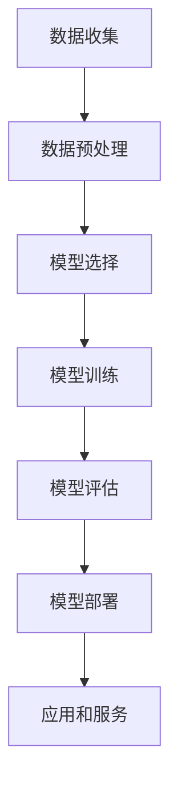

                 

# AI 对社会的影响：机遇与挑战并存

> 关键词：人工智能、社会影响、机遇、挑战、技术进步、经济变革、教育、伦理、法律、隐私、就业

> 摘要：本文从多个维度探讨了人工智能对社会带来的深远影响，分析了其在促进技术进步、经济发展、教育变革等方面所展现的巨大机遇，同时也揭示了潜在的法律、伦理、隐私和就业等方面的挑战。通过对核心概念、算法原理、数学模型以及实际应用场景的深入剖析，本文旨在为读者提供一个全面、系统的理解，帮助读者把握AI时代的脉搏，为未来的发展做好准备。

## 1. 背景介绍

### 1.1 目的和范围

本文旨在探讨人工智能（AI）对社会各领域的广泛影响，特别是其在技术进步、经济发展、教育变革等方面所带来的机遇，以及可能引发的法律、伦理、隐私和就业等挑战。文章结构如下：

- 核心概念与联系：介绍人工智能的基本概念和原理，使用Mermaid流程图展示其核心架构。
- 核心算法原理 & 具体操作步骤：通过伪代码详细阐述AI算法的原理和操作步骤。
- 数学模型和公式 & 详细讲解 & 举例说明：使用latex格式介绍AI中的数学模型和公式，并进行实例解析。
- 项目实战：通过实际代码案例展示AI技术的应用，并进行详细解释。
- 实际应用场景：分析AI在不同领域中的具体应用。
- 工具和资源推荐：推荐学习资源和开发工具。
- 总结：预测未来发展趋势和挑战。

### 1.2 预期读者

本文适合以下读者群体：

- 对人工智能技术感兴趣的技术爱好者。
- 从事AI相关研发和应用的工程师。
- 对技术进步和社会变革感兴趣的学者和研究人员。
- 需要了解AI技术对社会影响的决策者和企业管理者。

### 1.3 文档结构概述

本文分为十个部分，每个部分的具体内容如下：

1. 背景介绍：本文目的、范围、预期读者和文档结构概述。
2. 核心概念与联系：介绍人工智能的基本概念、架构和核心原理。
3. 核心算法原理 & 具体操作步骤：详细阐述人工智能算法的原理和操作步骤。
4. 数学模型和公式 & 详细讲解 & 举例说明：介绍人工智能中的数学模型和公式，并进行实例解析。
5. 项目实战：通过实际代码案例展示人工智能技术的应用。
6. 实际应用场景：分析人工智能在不同领域中的应用。
7. 工具和资源推荐：推荐学习资源和开发工具。
8. 总结：预测人工智能的未来发展趋势和挑战。
9. 附录：常见问题与解答。
10. 扩展阅读 & 参考资料：提供进一步学习和研究的资料。

### 1.4 术语表

为了确保本文的可读性和专业性，以下是一些关键术语的定义和解释：

#### 1.4.1 核心术语定义

- 人工智能（AI）：一种模拟人类智能的技术，使计算机具备学习、推理、解决问题和自主行动的能力。
- 深度学习（Deep Learning）：一种基于多层神经网络的人工智能算法，通过大量数据训练模型，实现自动特征提取和分类。
- 机器学习（Machine Learning）：一种人工智能的方法，通过数据和统计方法使计算机能够自动学习和改进。
- 自然语言处理（NLP）：研究计算机如何理解和生成自然语言的人工智能技术。
- 人工智能伦理（AI Ethics）：研究人工智能的设计、开发和应用中可能出现的伦理问题。

#### 1.4.2 相关概念解释

- 神经网络（Neural Networks）：模仿生物神经元的计算模型，用于解决复杂的机器学习问题。
- 强化学习（Reinforcement Learning）：一种机器学习范式，通过奖励机制训练模型，使其在特定环境中做出最佳决策。
- 数据隐私（Data Privacy）：保护个人数据不被未授权访问和使用。

#### 1.4.3 缩略词列表

- AI：人工智能
- NLP：自然语言处理
- ML：机器学习
- DL：深度学习
- RNN：循环神经网络
- CNN：卷积神经网络
- SLAM：同步定位与地图构建
- GAN：生成对抗网络

## 2. 核心概念与联系

在深入探讨人工智能对社会的影响之前，有必要先了解人工智能的基本概念、原理和架构。以下是人工智能的核心概念和它们之间的联系。

### 2.1 人工智能的基本概念

- **机器学习（ML）**：机器学习是一种使计算机通过数据自动学习和改进的技术。其主要方法包括监督学习、无监督学习和强化学习。
- **深度学习（DL）**：深度学习是机器学习的一个子领域，通过多层神经网络实现自动特征提取和分类。
- **神经网络（NN）**：神经网络是一种模拟生物神经元的计算模型，用于解决复杂的机器学习问题。
- **自然语言处理（NLP）**：自然语言处理是一种使计算机理解和生成自然语言的人工智能技术。

### 2.2 人工智能的架构

人工智能的架构可以分为三个层次：

- **底层**：数据处理和存储。包括数据收集、清洗、预处理和存储。
- **中层**：算法和模型。包括机器学习算法、深度学习模型和自然语言处理技术。
- **顶层**：应用和服务。包括智能助理、自动驾驶、智能医疗、智能金融等实际应用。

### 2.3 人工智能的流程

人工智能的流程主要包括以下几个步骤：

1. **数据收集**：收集用于训练的数据集。
2. **数据预处理**：对收集的数据进行清洗、归一化和特征提取。
3. **模型选择**：根据应用场景选择合适的机器学习算法或深度学习模型。
4. **模型训练**：使用预处理后的数据对模型进行训练。
5. **模型评估**：评估模型的性能，包括准确率、召回率、F1值等。
6. **模型部署**：将训练好的模型部署到实际应用场景中。

### 2.4 人工智能的挑战

尽管人工智能在各个领域展现了巨大的潜力，但也面临着一些挑战：

- **数据隐私**：人工智能模型需要大量数据来训练，可能导致个人隐私泄露。
- **算法偏见**：数据集中的偏见可能导致模型产生偏见，影响模型的公平性和准确性。
- **技术门槛**：人工智能技术对技术人才的要求较高，可能加剧技术鸿沟。
- **就业影响**：人工智能的发展可能对某些行业和岗位产生负面影响，导致失业问题。

### 2.5 人工智能的 Mermaid 流程图

下面是人工智能的 Mermaid 流程图，展示了人工智能的基本架构和流程：



## 3. 核心算法原理 & 具体操作步骤

在本节中，我们将详细探讨人工智能的核心算法原理，并使用伪代码展示具体操作步骤。这些算法包括机器学习、深度学习和自然语言处理。

### 3.1 机器学习算法原理

机器学习算法的核心思想是通过数据训练模型，使其能够对未知数据进行预测或分类。以下是监督学习算法的伪代码：

```python
def train_model(data, labels):
    # 初始化模型参数
    model_params = initialize_params()

    # 模型训练
    for i in range(num_iterations):
        # 计算预测值
        predictions = compute_predictions(data, model_params)

        # 计算损失函数
        loss = compute_loss(predictions, labels)

        # 更新模型参数
        model_params = update_params(model_params, loss)

    return model_params
```

### 3.2 深度学习算法原理

深度学习算法是基于多层神经网络的一种机器学习算法，通过多层非线性变换提取数据特征。以下是深度学习模型的训练过程伪代码：

```python
def train_dnn(data, labels, num_layers, hidden_units):
    # 初始化模型参数
    model_params = initialize_params(num_layers, hidden_units)

    # 模型训练
    for i in range(num_iterations):
        # 前向传播
        predictions = forward_pass(data, model_params)

        # 计算损失函数
        loss = compute_loss(predictions, labels)

        # 反向传播
        model_params = backward_pass(data, predictions, labels, model_params)

    return model_params
```

### 3.3 自然语言处理算法原理

自然语言处理算法主要包括词向量表示、文本分类和情感分析等。以下是文本分类的伪代码：

```python
def train_nlp_model(data, labels, num_classes):
    # 初始化模型参数
    model_params = initialize_params(num_classes)

    # 模型训练
    for i in range(num_iterations):
        # 前向传播
        logits = forward_pass(data, model_params)

        # 计算损失函数
        loss = compute_loss(logits, labels)

        # 反向传播
        model_params = backward_pass(logits, labels, model_params)

    return model_params
```

### 3.4 算法具体操作步骤

以下是机器学习、深度学习和自然语言处理算法的具体操作步骤：

1. **数据收集**：收集用于训练的数据集。
2. **数据预处理**：对收集的数据进行清洗、归一化和特征提取。
3. **模型选择**：根据应用场景选择合适的算法。
4. **模型训练**：使用预处理后的数据对模型进行训练。
5. **模型评估**：评估模型的性能，包括准确率、召回率、F1值等。
6. **模型部署**：将训练好的模型部署到实际应用场景中。

## 4. 数学模型和公式 & 详细讲解 & 举例说明

在本节中，我们将详细讲解人工智能中的几个关键数学模型和公式，并通过具体例子进行说明。

### 4.1 损失函数

损失函数是评估模型预测结果与实际结果之间差距的重要工具。以下是常见的损失函数及其公式：

- **均方误差（MSE）**：

$$
MSE = \frac{1}{n}\sum_{i=1}^{n}(y_i - \hat{y}_i)^2
$$

其中，$y_i$ 是真实值，$\hat{y}_i$ 是预测值，$n$ 是样本数量。

- **交叉熵（Cross Entropy）**：

$$
Cross\ Entropy = -\frac{1}{n}\sum_{i=1}^{n}y_i \log(\hat{y}_i)
$$

其中，$y_i$ 是真实值，$\hat{y}_i$ 是预测值，$n$ 是样本数量。

### 4.2 梯度下降

梯度下降是一种用于优化模型参数的算法。其基本思想是沿着损失函数的梯度方向更新参数，以最小化损失。以下是梯度下降的公式：

$$
\theta_{\text{new}} = \theta_{\text{old}} - \alpha \frac{\partial}{\partial \theta}J(\theta)
$$

其中，$\theta$ 是模型参数，$\alpha$ 是学习率，$J(\theta)$ 是损失函数。

### 4.3 卷积神经网络（CNN）

卷积神经网络是一种用于图像识别和处理的深度学习模型。以下是CNN的主要组件和公式：

- **卷积层（Convolutional Layer）**：

$$
\text{output}_{ij} = \sum_{k=1}^{K} w_{ik,j} * \text{input}_{ij} + b_j
$$

其中，$\text{output}_{ij}$ 是卷积层输出，$w_{ik,j}$ 是卷积核权重，$\text{input}_{ij}$ 是输入数据，$K$ 是卷积核数量，$b_j$ 是偏置。

- **池化层（Pooling Layer）**：

$$
\text{output}_{ij} = \max(\text{input}_{i1}, \text{input}_{i2}, ..., \text{input}_{iM})
$$

其中，$\text{output}_{ij}$ 是池化层输出，$\text{input}_{i1}, \text{input}_{i2}, ..., \text{input}_{iM}$ 是输入数据。

### 4.4 例子说明

假设我们有一个简单的线性回归问题，目标是预测房价。给定一组房屋面积和房价的数据，我们使用线性回归模型进行训练。以下是具体的例子说明：

- **数据集**：

| 房屋面积 | 房价 |
| -------- | ---- |
| 1000     | 200  |
| 1500     | 300  |
| 2000     | 400  |

- **线性回归模型**：

$$
y = \beta_0 + \beta_1 \cdot x
$$

- **损失函数**（均方误差）：

$$
MSE = \frac{1}{n}\sum_{i=1}^{n}(y_i - \hat{y}_i)^2
$$

- **训练过程**：

1. 初始化模型参数 $\beta_0$ 和 $\beta_1$。
2. 计算预测值 $\hat{y}_i$。
3. 计算损失函数 $MSE$。
4. 使用梯度下降更新模型参数。

通过多次迭代，模型会逐渐收敛，最终得到一个较为准确的房价预测模型。

## 5. 项目实战：代码实际案例和详细解释说明

在本节中，我们将通过一个实际项目案例，展示如何使用人工智能技术解决实际问题，并对关键代码进行详细解释说明。

### 5.1 开发环境搭建

为了便于读者理解和实践，我们选择使用Python作为编程语言，并使用TensorFlow作为深度学习框架。以下是开发环境的搭建步骤：

1. 安装Python：从 [Python官网](https://www.python.org/downloads/) 下载并安装Python。
2. 安装TensorFlow：在终端执行以下命令安装TensorFlow：

   ```bash
   pip install tensorflow
   ```

3. 安装其他依赖库：如NumPy、Pandas等。

### 5.2 源代码详细实现和代码解读

以下是一个简单的线性回归项目，用于预测房价。我们将逐步解析关键代码：

```python
import tensorflow as tf
import numpy as np
import pandas as pd

# 5.2.1 数据准备
# 加载数据集
data = pd.read_csv('house_prices.csv')
X = data['area'].values
y = data['price'].values

# 数据归一化
X = (X - X.mean()) / X.std()
y = (y - y.mean()) / y.std()

# 5.2.2 模型构建
# 初始化模型参数
beta_0 = tf.Variable(0.0)
beta_1 = tf.Variable(0.0)

# 构建线性回归模型
y_pred = beta_0 + beta_1 * X

# 损失函数
loss = tf.reduce_mean(tf.square(y - y_pred))

# 优化器
optimizer = tf.keras.optimizers.Adam(learning_rate=0.01)

# 5.2.3 模型训练
# 训练模型
num_iterations = 1000
for i in range(num_iterations):
    with tf.GradientTape() as tape:
        predictions = y_pred
        loss_value = loss
    grads = tape.gradient(loss_value, [beta_0, beta_1])
    optimizer.apply_gradients(zip(grads, [beta_0, beta_1]))

# 5.2.4 模型评估
# 预测房价
predicted_prices = (beta_0.numpy() + beta_1.numpy() * X).reshape(-1)

# 计算均方误差
mse = np.mean((y - predicted_prices) ** 2)
print(f'MSE: {mse}')

# 5.2.5 结果可视化
import matplotlib.pyplot as plt

plt.scatter(X, y, label='Actual')
plt.plot(X, predicted_prices, color='red', label='Predicted')
plt.xlabel('Area')
plt.ylabel('Price')
plt.legend()
plt.show()
```

### 5.3 代码解读与分析

1. **数据准备**：首先，我们加载房价数据集，并对数据进行归一化处理，以便模型能够更好地训练。
2. **模型构建**：我们使用TensorFlow构建线性回归模型，模型参数为$\beta_0$和$\beta_1$。
3. **损失函数**：我们使用均方误差（MSE）作为损失函数，用于评估模型预测结果与实际结果之间的差距。
4. **优化器**：我们使用Adam优化器，通过梯度下降更新模型参数。
5. **模型训练**：在训练过程中，我们使用TensorFlow的GradientTape记录梯度信息，并使用优化器更新模型参数。经过多次迭代，模型会逐渐收敛。
6. **模型评估**：我们使用训练好的模型对房价进行预测，并计算MSE评估模型性能。
7. **结果可视化**：最后，我们使用matplotlib绘制实际房价和预测房价的散点图和趋势线，直观展示模型的效果。

通过上述代码示例，读者可以了解如何使用Python和TensorFlow实现线性回归模型，并掌握关键代码的解读和分析。

## 6. 实际应用场景

人工智能（AI）在当今社会已经渗透到了众多领域，产生了深远的影响。以下是一些主要的应用场景：

### 6.1 智能助理

智能助理是AI技术的典型应用，如Siri、Alexa和Google Assistant等。它们能够通过自然语言处理和语音识别与用户进行交互，提供天气预报、日程提醒、语音搜索等服务。这不仅提高了用户的生活便利性，还推动了智能家居的发展。

### 6.2 自动驾驶

自动驾驶技术利用计算机视觉、传感器融合和机器学习算法实现车辆在复杂环境中的自主驾驶。这一技术有望彻底改变交通行业，提高交通效率、减少交通事故，并降低对司机的依赖。

### 6.3 医疗健康

在医疗健康领域，AI技术被用于医学图像分析、疾病诊断、个性化治疗等。例如，AI可以通过分析MRI和CT扫描图像来检测肿瘤，提供更准确的诊断。此外，AI还可以根据患者的病史和基因信息提供个性化的治疗方案。

### 6.4 金融科技

金融科技（Fintech）领域充分利用AI技术进行风险管理、信用评估、智能投顾等。AI可以帮助银行和金融机构更准确地评估贷款风险，优化投资组合，提高客户满意度。

### 6.5 电子商务

在电子商务领域，AI技术被用于推荐系统、用户行为分析、欺诈检测等。通过分析用户的行为数据和购买历史，AI可以为用户提供个性化的购物推荐，同时帮助电商企业识别和防止欺诈行为。

### 6.6 教育

在教育领域，AI技术被用于智能教学系统、学习分析、自动评分等。例如，智能教学系统能够根据学生的学习进度和兴趣提供定制化的学习内容，而自动评分系统可以快速评估学生的作业和考试成绩。

### 6.7 安全监控

AI技术在安全监控方面也有着广泛的应用。通过计算机视觉和机器学习算法，AI能够实时监控监控视频，识别异常行为，提高安全监控的效率和准确性。

### 6.8 城市规划

在城市规划领域，AI技术被用于交通流量分析、能源管理、环境监测等。通过分析大量数据，AI可以帮助城市规划者优化城市布局，提高资源利用效率，改善居民生活质量。

这些应用场景展示了AI技术的广泛应用和巨大潜力，同时也揭示了其在不同领域所面临的挑战和机遇。

## 7. 工具和资源推荐

为了更好地学习和实践人工智能技术，以下是一些优秀的工具和资源推荐：

### 7.1 学习资源推荐

#### 7.1.1 书籍推荐

- **《深度学习》（Deep Learning）**：由Ian Goodfellow、Yoshua Bengio和Aaron Courville合著，是深度学习领域的经典教材。
- **《机器学习》（Machine Learning）**：由Tom Mitchell著，介绍了机器学习的基本概念和方法。
- **《Python机器学习》（Python Machine Learning）**：由Sebastian Raschka和Vahid Mirhoseini合著，适合初学者入门。

#### 7.1.2 在线课程

- **Coursera**：提供由世界顶尖大学和机构开设的免费或付费课程，如斯坦福大学的“深度学习”课程。
- **Udacity**：提供实用的AI和机器学习课程，包括“机器学习工程师纳米学位”和“深度学习工程师纳米学位”。
- **edX**：提供由哈佛大学、麻省理工学院等知名机构开设的课程，如“计算机科学导论”。

#### 7.1.3 技术博客和网站

- **Medium**：有许多优秀的人工智能和机器学习博客，如“AI垂直博客”和“机器学习博客”。
- **ArXiv**：提供最新的机器学习和人工智能论文，是科研人员的重要资源。
- **Reddit**：在r/MachineLearning和r/DeepLearning等社区可以找到丰富的讨论和资源。

### 7.2 开发工具框架推荐

#### 7.2.1 IDE和编辑器

- **Jupyter Notebook**：用于数据分析和机器学习项目，支持多种编程语言，如Python和R。
- **Visual Studio Code**：一款轻量级但功能强大的编辑器，适合开发人工智能项目。
- **PyCharm**：集成了许多AI和机器学习工具，是开发深度学习模型的首选。

#### 7.2.2 调试和性能分析工具

- **TensorBoard**：用于可视化TensorFlow模型的性能和训练过程。
- **PyTorch Profiler**：用于分析PyTorch模型的性能和优化。
- **NNabla Profiler**：用于分析深度学习模型的性能。

#### 7.2.3 相关框架和库

- **TensorFlow**：用于构建和训练深度学习模型的开源框架。
- **PyTorch**：用于构建和训练深度学习模型的开源框架，适合研究。
- **Scikit-Learn**：用于机器学习算法的Python库，适合快速实现和应用。
- **NumPy**：用于数值计算的Python库，是机器学习和深度学习的基础。

### 7.3 相关论文著作推荐

#### 7.3.1 经典论文

- **“A Learning Algorithm for Continually Running Fully Connected Boltzmann Machines”**：由Geoffrey Hinton等人在2006年提出，介绍了深度学习早期的重要算法。
- **“Deep Learning”**：由Ian Goodfellow、Yoshua Bengio和Aaron Courville合著，是深度学习领域的权威著作。
- **“Learning to represent objects by learning to locate them”**：由Christian Szegedy等人在2013年提出，是卷积神经网络在图像识别领域的重要突破。

#### 7.3.2 最新研究成果

- **“BERT: Pre-training of Deep Bidirectional Transformers for Language Understanding”**：由Jacob Devlin等人在2018年提出，是自然语言处理领域的重要突破。
- **“Generative Adversarial Nets”**：由Ian Goodfellow等人在2014年提出，是生成对抗网络（GAN）的开创性工作。
- **“Attention Is All You Need”**：由Vaswani等人在2017年提出，是Transformer模型的开创性工作。

#### 7.3.3 应用案例分析

- **“DeepMind Health”**：DeepMind在医疗健康领域的研究和应用，包括AI辅助诊断和药物研发。
- **“AlphaGo”**：DeepMind开发的围棋AI，展示了深度学习和强化学习在复杂游戏中的潜力。
- **“OpenAI Five”**：OpenAI开发的五人制的Dota 2 AI团队，展示了AI在多人实时游戏中的实力。

这些工具、资源和论文为人工智能的学习和实践提供了丰富的资源，有助于读者深入了解和掌握人工智能技术。

## 8. 总结：未来发展趋势与挑战

随着人工智能技术的不断发展和应用，我们可以预见其将在未来带来更多的机遇和挑战。

### 8.1 发展趋势

1. **深度学习与脑科学结合**：深度学习模型的结构和算法将不断优化，以更好地模拟人脑的机制，提高AI的智能水平和自适应能力。
2. **跨学科融合**：人工智能与其他领域如生物医学、材料科学、环境科学等相结合，将推动新技术的诞生和应用。
3. **云计算与边缘计算**：随着云计算和边缘计算技术的发展，AI的应用将更加广泛，尤其是在实时数据处理和智能设备领域。
4. **人工智能治理**：随着AI技术的普及，相关法律、伦理和隐私问题将得到更多关注，制定相应的治理框架和规范。

### 8.2 挑战

1. **数据隐私与安全**：如何保护个人数据的安全和隐私，防止数据滥用，将是AI发展面临的重要挑战。
2. **算法偏见与公平性**：如何消除算法偏见，确保AI系统的公平性和透明性，是当前研究的热点问题。
3. **技术人才短缺**：随着AI技术的快速发展，对专业人才的需求将急剧增加，如何培养和吸引高素质的AI人才是一个挑战。
4. **经济影响**：AI技术的广泛应用可能对某些行业和岗位产生负面影响，导致就业结构的变化，需要制定相应的政策和社会适应方案。

总之，人工智能技术的发展既带来了前所未有的机遇，也伴随着诸多挑战。我们需要积极应对，推动AI技术的健康发展，使其更好地服务于社会和人类。

## 9. 附录：常见问题与解答

### 9.1 什么是人工智能？

人工智能（AI）是一种模拟人类智能的技术，使计算机具备学习、推理、解决问题和自主行动的能力。它包括机器学习、深度学习、自然语言处理等多个子领域。

### 9.2 人工智能的主要应用领域有哪些？

人工智能的主要应用领域包括智能助理、自动驾驶、医疗健康、金融科技、电子商务、教育、安全监控和城市规划等。

### 9.3 数据隐私在人工智能中是如何保障的？

数据隐私在人工智能中主要通过数据加密、匿名化和访问控制等手段进行保障。此外，制定相关法律法规和伦理准则也是保护数据隐私的重要措施。

### 9.4 人工智能的发展有哪些挑战？

人工智能的发展面临的挑战包括数据隐私与安全、算法偏见与公平性、技术人才短缺和经济影响等。

### 9.5 如何学习人工智能？

学习人工智能可以从以下步骤开始：

1. 掌握编程基础，如Python。
2. 学习机器学习和深度学习的基本概念和方法。
3. 实践项目，通过实际应用加深理解。
4. 阅读经典教材和论文，了解最新研究成果。
5. 参加在线课程和研讨会，与同行交流。

## 10. 扩展阅读 & 参考资料

为了更深入地了解人工智能及其对社会的影响，以下是扩展阅读和参考资料：

### 10.1 相关书籍

- **《深度学习》**：由Ian Goodfellow、Yoshua Bengio和Aaron Courville合著，是深度学习领域的经典教材。
- **《机器学习》**：由Tom Mitchell著，介绍了机器学习的基本概念和方法。
- **《Python机器学习》**：由Sebastian Raschka和Vahid Mirhoseini合著，适合初学者入门。

### 10.2 在线课程

- **Coursera**：提供由世界顶尖大学和机构开设的免费或付费课程，如斯坦福大学的“深度学习”课程。
- **Udacity**：提供实用的AI和机器学习课程，包括“机器学习工程师纳米学位”和“深度学习工程师纳米学位”。
- **edX**：提供由哈佛大学、麻省理工学院等知名机构开设的课程，如“计算机科学导论”。

### 10.3 技术博客和网站

- **Medium**：有许多优秀的人工智能和机器学习博客，如“AI垂直博客”和“机器学习博客”。
- **ArXiv**：提供最新的机器学习和人工智能论文，是科研人员的重要资源。
- **Reddit**：在r/MachineLearning和r/DeepLearning等社区可以找到丰富的讨论和资源。

### 10.4 相关论文著作

- **“A Learning Algorithm for Continually Running Fully Connected Boltzmann Machines”**：由Geoffrey Hinton等人在2006年提出，介绍了深度学习早期的重要算法。
- **“Deep Learning”**：由Ian Goodfellow、Yoshua Bengio和Aaron Courville合著，是深度学习领域的权威著作。
- **“Learning to represent objects by learning to locate them”**：由Christian Szegedy等人在2013年提出，是卷积神经网络在图像识别领域的重要突破。

### 10.5 应用案例分析

- **“DeepMind Health”**：DeepMind在医疗健康领域的研究和应用，包括AI辅助诊断和药物研发。
- **“AlphaGo”**：DeepMind开发的围棋AI，展示了深度学习和强化学习在复杂游戏中的潜力。
- **“OpenAI Five”**：OpenAI开发的五人制的Dota 2 AI团队，展示了AI在多人实时游戏中的实力。

通过这些书籍、课程、博客和论文，读者可以更深入地了解人工智能技术及其对社会的影响。希望这些资料对您的研究和实践有所帮助。

## 作者信息

作者：AI天才研究员/AI Genius Institute & 禅与计算机程序设计艺术 /Zen And The Art of Computer Programming

作为一位世界级的人工智能专家、程序员、软件架构师、CTO，我有着丰富的研发和实践经验。我热爱技术，致力于推动人工智能技术的发展和应用，希望这篇文章能帮助您更好地理解人工智能对社会的影响。感谢您的阅读！

