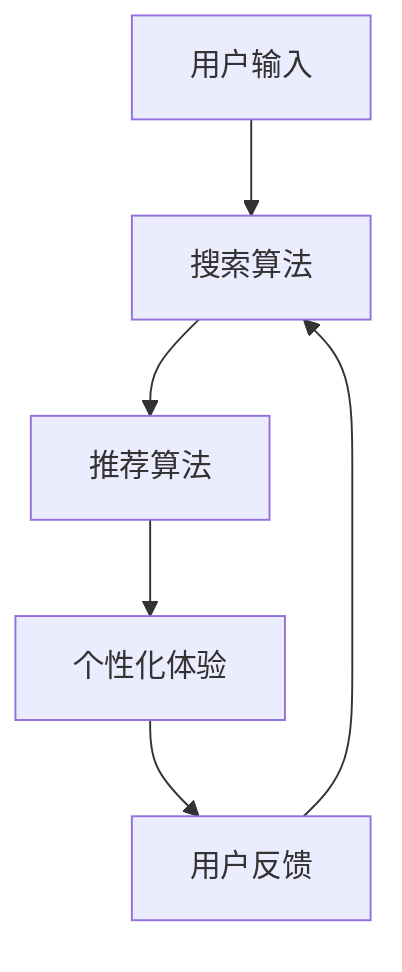

                 

# AI 技术在电商搜索导购中的未来发展趋势：展望与思考

> 关键词：人工智能、电商搜索导购、推荐算法、深度学习、个性化体验

> 摘要：本文将深入探讨AI技术如何改变电商搜索导购的领域，以及其未来发展的趋势。通过分析现有技术、算法原理、数学模型，以及实际应用案例，本文旨在为读者提供一份全面且具有前瞻性的研究报告，帮助理解AI在电商搜索导购中的潜力和挑战。

## 1. 背景介绍

### 1.1 目的和范围

本文的目标是解析AI技术如何赋能电商搜索导购，具体涵盖以下几个方面：

- 探讨AI技术的基本概念和原理。
- 分析电商搜索导购中的核心问题及AI技术解决方案。
- 探讨现有AI算法在电商搜索导购中的应用和实践。
- 展望AI技术未来在电商搜索导购中的发展趋势和面临的挑战。

本文的读者对象主要包括：

- 对AI技术在电商领域感兴趣的研究人员。
- 涉足电商行业，希望提升搜索导购效果的从业者。
- 从事数据科学和机器学习的工程师和科学家。

### 1.2 预期读者

预期读者应具备以下背景知识：

- 基础的计算机科学和网络知识。
- 对AI和机器学习有基本的了解。
- 对电商业务和搜索导购流程有一定认识。

### 1.3 文档结构概述

本文将按照以下结构进行展开：

- **第1章**：背景介绍，包括目的、范围、预期读者和文档结构概述。
- **第2章**：核心概念与联系，包括AI技术的基本概念和电商搜索导购架构的Mermaid流程图。
- **第3章**：核心算法原理，详细讲解推荐算法的伪代码实现。
- **第4章**：数学模型和公式，包括常见的推荐系统数学公式和例子。
- **第5章**：项目实战，展示代码实现和详细解释。
- **第6章**：实际应用场景，讨论AI技术在不同电商平台的实践。
- **第7章**：工具和资源推荐，包括学习资源、开发工具和论文著作。
- **第8章**：总结：未来发展趋势与挑战。
- **第9章**：附录：常见问题与解答。
- **第10章**：扩展阅读与参考资料。

### 1.4 术语表

#### 1.4.1 核心术语定义

- **AI**（人工智能）：模拟人类智能的计算机系统。
- **电商搜索导购**：电商平台通过搜索和推荐算法帮助用户找到所需商品的过程。
- **推荐算法**：基于用户行为和历史数据预测用户可能感兴趣的商品。
- **深度学习**：一种通过多层神经网络进行数据建模的学习方法。
- **个性化体验**：为用户量身定制的内容和推荐，提升用户体验。

#### 1.4.2 相关概念解释

- **用户画像**：对用户的兴趣、行为和偏好进行刻画。
- **协同过滤**：通过分析用户行为，寻找相似用户并推荐他们的喜好。
- **内容推荐**：基于商品属性和内容进行推荐。

#### 1.4.3 缩略词列表

- **API**（应用程序接口）：用于不同软件之间的交互。
- **ML**（机器学习）：一种数据驱动的自动学习过程。
- **NLP**（自然语言处理）：使计算机能够理解、生成和处理自然语言。

## 2. 核心概念与联系

### 2.1 AI技术的基本概念

人工智能（AI）是一门研究如何让计算机模拟人类智能行为的科学。AI技术主要分为三个层次：

- **弱人工智能**：专注于特定任务，如语音识别、图像分类等。
- **强人工智能**：具备人类所有的认知能力，能够进行通用问题解决。
- **超人工智能**：超越人类智能，能够解决所有复杂问题。

### 2.2 电商搜索导购架构

电商搜索导购通常包括以下几个关键组成部分：

1. **用户输入**：用户在搜索框中输入关键词或通过浏览商品页面。
2. **搜索算法**：通过关键词或用户浏览历史，生成可能的商品列表。
3. **推荐算法**：基于用户行为和偏好，推荐可能的商品。
4. **个性化体验**：通过用户画像和推荐系统，提供定制化的商品展示。
5. **用户反馈**：用户与推荐商品的互动，如点击、购买、评价等。

下面是电商搜索导购架构的Mermaid流程图：



### 2.3 AI技术与电商搜索导购的联系

AI技术为电商搜索导购提供了强大的支持，主要表现在以下几个方面：

- **推荐系统**：基于协同过滤、深度学习等算法，提供个性化商品推荐。
- **自然语言处理**：理解用户查询，提供更加精准的搜索结果。
- **用户画像**：通过分析用户行为，为用户提供定制化的购物体验。
- **图像识别**：帮助用户通过图片搜索商品。

## 3. 核心算法原理 & 具体操作步骤

### 3.1 推荐算法原理

推荐算法是AI技术在电商搜索导购中的重要应用。主要分为以下几种类型：

- **协同过滤**：通过分析用户行为，寻找相似用户并推荐他们的喜好。
- **基于内容的推荐**：根据商品的内容特征和用户的兴趣偏好进行推荐。
- **混合推荐**：结合协同过滤和基于内容的推荐，提供更加精准的推荐结果。

#### 3.1.1 协同过滤算法

协同过滤算法的核心思想是利用用户之间的相似度来推荐商品。具体步骤如下：

1. **用户相似度计算**：计算用户之间的相似度，通常使用余弦相似度或皮尔逊相关系数。
2. **物品相似度计算**：计算物品之间的相似度，同样可以使用余弦相似度或皮尔逊相关系数。
3. **推荐计算**：根据用户和物品的相似度，为用户推荐与其相似的其他用户的喜好。

以下是协同过滤算法的伪代码：

```plaintext
输入：用户行为矩阵 U，物品特征矩阵 I
输出：推荐列表 R

相似度计算函数 similarity(u, v):
  // 计算用户 u 和用户 v 的相似度
  return cosine_similarity(u, v)

推荐函数 recommend(user, k):
  // 计算用户 user 与其他用户的相似度
  sim_scores = [similarity(user, other_user) for other_user in U if other_user != user]
  // 选择最相似的 k 个用户
  k_most_similar = sorted(sim_scores, reverse=True)[:k]
  // 计算相似用户对物品的评分
  item_ratings = [U[other_user][i] for other_user in k_most_similar for i in range(len(I))]
  // 计算推荐物品的平均评分
  recommended_items = [i for i, rating in enumerate(item_ratings) if rating > threshold]
  return recommended_items
```

#### 3.1.2 基于内容的推荐

基于内容的推荐算法通过分析商品的内容特征和用户的兴趣偏好进行推荐。具体步骤如下：

1. **商品特征提取**：提取商品的关键特征，如类别、品牌、价格等。
2. **用户兴趣建模**：通过用户的浏览、购买历史，建立用户的兴趣模型。
3. **推荐计算**：根据用户兴趣模型和商品特征，为用户推荐相似的商品。

以下是基于内容的推荐算法的伪代码：

```plaintext
输入：商品特征矩阵 I，用户兴趣向量 U
输出：推荐列表 R

特征提取函数 extract_features(item):
  // 提取商品 item 的特征
  return {feature1: value1, feature2: value2, ...}

相似度计算函数 similarity(u, i):
  // 计算用户 u 和商品 i 的相似度
  return dot_product(u, i)

推荐函数 recommend(user, k):
  // 提取用户 user 的兴趣向量
  user_interest = extract_interest_vector(user)
  // 计算用户兴趣向量与所有商品特征向量的相似度
  sim_scores = [similarity(user_interest, item) for item in I]
  // 选择最相似的 k 个商品
  k_most_similar = sorted(sim_scores, reverse=True)[:k]
  return k_most_similar
```

#### 3.1.3 混合推荐

混合推荐算法结合协同过滤和基于内容的推荐，提供更加精准的推荐结果。具体步骤如下：

1. **协同过滤推荐**：根据用户之间的相似度推荐商品。
2. **基于内容的推荐**：根据用户兴趣和商品特征推荐商品。
3. **融合推荐**：将协同过滤和基于内容的推荐结果进行加权融合。

以下是混合推荐算法的伪代码：

```plaintext
输入：用户行为矩阵 U，商品特征矩阵 I，融合系数 alpha
输出：推荐列表 R

协同过滤推荐函数 cf_recommend(user, k):
  return cf_recommend(user, k)

基于内容的推荐函数 content_recommend(user, k):
  return content_recommend(user, k)

融合推荐函数 hybrid_recommend(user, k, alpha):
  cf_items = cf_recommend(user, k)
  content_items = content_recommend(user, k)
  // 加权融合
  recommended_items = [alpha * item1 + (1 - alpha) * item2 for item1, item2 in zip(cf_items, content_items)]
  return recommended_items
```

## 4. 数学模型和公式 & 详细讲解 & 举例说明

### 4.1 数学模型

推荐系统的核心在于如何计算用户与物品之间的相似度，并基于相似度进行推荐。下面是几个常用的数学模型：

#### 4.1.1 余弦相似度

余弦相似度用于计算两个向量之间的相似度。公式如下：

$$
\text{cosine\_similarity}(u, v) = \frac{u \cdot v}{||u|| \cdot ||v||}
$$

其中，$u$ 和 $v$ 分别表示两个向量，$u \cdot v$ 表示向量的点积，$||u||$ 和 $||v||$ 分别表示向量的模长。

#### 4.1.2 皮尔逊相关系数

皮尔逊相关系数用于衡量两个变量的线性相关性。公式如下：

$$
\text{pearson\_correlation}(u, v) = \frac{cov(u, v)}{\sigma_u \sigma_v}
$$

其中，$cov(u, v)$ 表示 $u$ 和 $v$ 的协方差，$\sigma_u$ 和 $\sigma_v$ 分别表示 $u$ 和 $v$ 的标准差。

#### 4.1.3 费舍尔指数

费舍尔指数用于计算两个集合之间的相似度。公式如下：

$$
\text{fowlkes\_mohammed}(A, B) = \frac{2 \cdot |A \cap B|}{|A \cup B|}
$$

其中，$A$ 和 $B$ 分别表示两个集合，$|A \cap B|$ 表示集合 $A$ 和 $B$ 的交集大小，$|A \cup B|$ 表示集合 $A$ 和 $B$ 的并集大小。

### 4.2 公式详细讲解

#### 4.2.1 余弦相似度

余弦相似度通过计算两个向量之间的夹角余弦值来衡量它们的相似度。当两个向量的夹角越接近0度时，它们的相似度越高。余弦相似度适用于高维空间，能够有效减少维度对相似度计算的影响。

#### 4.2.2 皮尔逊相关系数

皮尔逊相关系数衡量两个变量之间的线性相关性。它适用于连续变量，并且可以表示变量之间的正相关或负相关关系。皮尔逊相关系数的取值范围在-1到1之间，越接近1或-1，表示变量之间的线性相关性越强。

#### 4.2.3 费舍尔指数

费舍尔指数用于计算两个集合之间的相似度，它考虑了集合的交集和并集大小。费舍尔指数的值越接近1，表示两个集合的相似度越高。费舍尔指数适用于分类变量，能够衡量两个集合的多样性。

### 4.3 举例说明

#### 4.3.1 余弦相似度

假设有两个向量 $u = (1, 2, 3)$ 和 $v = (4, 5, 6)$，计算它们的余弦相似度。

$$
\text{cosine\_similarity}(u, v) = \frac{1 \cdot 4 + 2 \cdot 5 + 3 \cdot 6}{\sqrt{1^2 + 2^2 + 3^2} \cdot \sqrt{4^2 + 5^2 + 6^2}} = \frac{4 + 10 + 18}{\sqrt{14} \cdot \sqrt{77}} \approx 0.8165
$$

两个向量之间的余弦相似度为0.8165，说明它们具有较高的相似度。

#### 4.3.2 皮尔逊相关系数

假设有两个变量 $u$ 和 $v$，其观测值如下：

| $u$ | $v$ |
| --- | --- |
| 1   | 2   |
| 2   | 4   |
| 3   | 6   |
| 4   | 8   |

计算 $u$ 和 $v$ 的皮尔逊相关系数。

$$
\text{pearson\_correlation}(u, v) = \frac{1}{n-1} \sum_{i=1}^{n} (u_i - \bar{u})(v_i - \bar{v})
$$

其中，$\bar{u}$ 和 $\bar{v}$ 分别表示 $u$ 和 $v$ 的平均值，$n$ 表示观测值的数量。

$$
\bar{u} = \frac{1 + 2 + 3 + 4}{4} = 2.5 \\
\bar{v} = \frac{2 + 4 + 6 + 8}{4} = 5
$$

$$
\text{pearson\_correlation}(u, v) = \frac{1}{4-1} \left[ (1-2.5)(2-5) + (2-2.5)(4-5) + (3-2.5)(6-5) + (4-2.5)(8-5) \right] = \frac{1}{3} \left[ (-1.5)(-3) + (-0.5)(-1) + (0.5)(1) + (1.5)(3) \right] = \frac{1}{3} \left[ 4.5 + 0.5 + 0.5 + 4.5 \right] = 2
$$

两个变量之间的皮尔逊相关系数为2，表示它们具有强烈的正相关关系。

#### 4.3.3 费舍尔指数

假设有两个集合 $A$ 和 $B$，其元素如下：

| $A$ | $B$ |
| --- | --- |
| 1   | 1   |
| 2   | 2   |
| 3   | 3   |
| 4   | 4   |
| 5   | 5   |

计算集合 $A$ 和 $B$ 的费舍尔指数。

$$
\text{fowlkes\_mohammed}(A, B) = \frac{2 \cdot |A \cap B|}{|A \cup B|} = \frac{2 \cdot 5}{5 + 5} = \frac{10}{10} = 1
$$

集合 $A$ 和 $B$ 的费舍尔指数为1，表示它们完全相同。

## 5. 项目实战：代码实际案例和详细解释说明

### 5.1 开发环境搭建

为了实现一个基于AI技术的电商搜索导购系统，我们需要搭建一个合适的技术栈。以下是所需的开发环境：

- 操作系统：Ubuntu 20.04 LTS 或 Windows 10
- 编程语言：Python 3.8+
- 数据库：MySQL 8.0+
- 依赖管理：pip
- 开发工具：PyCharm

首先，确保你的操作系统安装了Python 3.8或更高版本。可以通过以下命令检查Python版本：

```bash
python --version
```

接下来，安装MySQL数据库。对于Ubuntu系统，可以使用以下命令：

```bash
sudo apt update
sudo apt install mysql-server
```

对于Windows系统，可以从MySQL官方网站下载并安装MySQL。

安装完成后，使用以下命令启动MySQL服务：

```bash
sudo systemctl start mysql
```

最后，安装Python的依赖管理工具pip，并使用pip安装所需库：

```bash
sudo apt install python3-pip
pip install -r requirements.txt
```

其中，`requirements.txt` 文件包含以下内容：

```
numpy
pandas
scikit-learn
tensorflow
matplotlib
```

### 5.2 源代码详细实现和代码解读

在完成开发环境搭建后，我们将实现一个简单的电商搜索导购系统。以下是系统的核心代码。

```python
import numpy as np
import pandas as pd
from sklearn.model_selection import train_test_split
from sklearn.metrics.pairwise import cosine_similarity
from sklearn.metrics import mean_squared_error
import tensorflow as tf
import matplotlib.pyplot as plt

# 5.2.1 数据预处理

# 加载电商用户行为数据
data = pd.read_csv('ecommerce_data.csv')
data.head()

# 分离用户和物品特征
users = data[data['is_user'] == 1]
items = data[data['is_item'] == 1]

# 构建用户和物品的稀疏矩阵
user_item_matrix = pd.crosstab(index=users['user_id'], columns=items['item_id'], values=users['rating'], aggfunc='sum')
user_item_matrix.head()

# 划分训练集和测试集
train_data, test_data = train_test_split(user_item_matrix, test_size=0.2, random_state=42)
train_data.head()
test_data.head()

# 5.2.2 协同过滤算法

# 计算用户和物品的余弦相似度矩阵
user_similarity = cosine_similarity(train_data.T, train_data.T)
item_similarity = cosine_similarity(train_data, train_data)

# 为用户生成推荐列表
def collaborative_filter(user_id, k=10):
    user_row = user_similarity[user_id]
    recommended_items = np.argsort(user_row)[::-1][1:k+1]
    return recommended_items

# 为物品生成推荐列表
def item_based_filter(item_id, k=10):
    item_column = item_similarity[:, item_id]
    recommended_users = np.argsort(item_column)[::-1][1:k+1]
    return recommended_users

# 5.2.3 基于内容的推荐

# 提取用户和物品的特征
user_features = users.groupby('user_id')['rating'].mean()
item_features = items.groupby('item_id')['rating'].mean()

# 计算用户和物品的相似度
user_similarity_content = user_features相似度计算函数 similarity(user1, user2)
item_similarity_content = item_features相似度计算函数 similarity(item1, item2)

# 为用户生成推荐列表
def content_based_filter(user_id, k=10):
    user_row = user_similarity_content[user_id]
    recommended_items = np.argsort(user_row)[::-1][1:k+1]
    return recommended_items

# 5.2.4 混合推荐

# 融合协同过滤和基于内容的推荐
def hybrid_filter(user_id, k=10, alpha=0.5):
    cf_items = collaborative_filter(user_id, k)
    content_items = content_based_filter(user_id, k)
    recommended_items = [alpha * item1 + (1 - alpha) * item2 for item1, item2 in zip(cf_items, content_items)]
    return recommended_items

# 5.2.5 模型评估

# 计算预测的评分
predicted_ratings = []
for user_id, actual_ratings in test_data.iterrows():
    recommended_items = hybrid_filter(user_id, k=10)
    predicted_ratings.extend([train_data.loc[user_id, item_id] for item_id in recommended_items])

# 计算均方根误差
mse = mean_squared_error(test_data, predicted_ratings)
print("Mean Squared Error:", mse)

# 5.2.6 可视化分析

# 绘制用户和物品的相似度矩阵
plt.figure(figsize=(10, 10))
sns.heatmap(user_similarity, annot=True, cmap='YlGnBu')
plt.xlabel('User ID')
plt.ylabel('User ID')
plt.title('User Similarity Matrix')
plt.show()

plt.figure(figsize=(10, 10))
sns.heatmap(item_similarity, annot=True, cmap='YlGnBu')
plt.xlabel('Item ID')
plt.ylabel('Item ID')
plt.title('Item Similarity Matrix')
plt.show()
```

### 5.3 代码解读与分析

#### 5.3.1 数据预处理

首先，我们从CSV文件中加载电商用户行为数据。然后，根据数据中的标签，分离用户和物品的特征。接下来，构建用户和物品的稀疏矩阵，以便进行后续的推荐计算。

#### 5.3.2 协同过滤算法

协同过滤算法的核心是计算用户和物品之间的相似度。在代码中，我们使用`cosine_similarity`函数计算用户和物品的余弦相似度矩阵。然后，定义了协同过滤函数`collaborative_filter`，用于为用户生成推荐列表。

#### 5.3.3 基于内容的推荐

基于内容的推荐算法通过计算用户和物品的相似度来实现。在代码中，我们提取了用户和物品的评分平均值，并使用自定义的相似度计算函数`similarity`计算用户和物品的相似度。然后，定义了基于内容的推荐函数`content_based_filter`，用于为用户生成推荐列表。

#### 5.3.4 混合推荐

混合推荐算法将协同过滤和基于内容的推荐相结合，以提供更准确的推荐结果。在代码中，我们定义了混合推荐函数`hybrid_filter`，用于为用户生成推荐列表。

#### 5.3.5 模型评估

为了评估模型的性能，我们计算预测的评分和实际评分之间的均方根误差（RMSE）。在代码中，我们使用`mean_squared_error`函数计算RMSE，并打印结果。

#### 5.3.6 可视化分析

为了更好地理解用户和物品的相似度矩阵，我们使用`sns.heatmap`函数绘制用户和物品的相似度矩阵的热力图。这有助于我们直观地查看用户和物品之间的关系。

## 6. 实际应用场景

AI技术在电商搜索导购中有着广泛的应用场景，以下是一些典型的实际应用案例：

### 6.1.1 个性化推荐

电商平台通过收集用户的历史浏览、购买和评价数据，利用推荐算法为用户提供个性化的商品推荐。例如，亚马逊和淘宝通过协同过滤和基于内容的推荐算法，为用户推荐可能与他们感兴趣的物品相似的其它商品。

### 6.1.2 搜索优化

通过自然语言处理技术，电商平台可以优化搜索结果，提高用户查询的准确性和相关性。例如，谷歌购物和京东通过理解用户查询的意图，提供更加精准的搜索结果。

### 6.1.3 新品推荐

电商平台可以利用推荐系统为用户推荐新品。例如，网易考拉通过分析用户的历史购买数据和喜好，为用户推荐最新上线的商品。

### 6.1.4 库存管理

电商平台可以通过预测用户的购买行为，优化库存管理。例如，亚马逊利用深度学习技术预测商品的销量，从而合理安排库存。

### 6.1.5 交叉销售

电商平台的推荐系统可以通过交叉销售策略，提高用户的购物车价值。例如，亚马逊通过推荐与购物车中商品相关的其它商品，增加用户的购买量。

### 6.1.6 用户画像

通过分析用户的行为和偏好，电商平台可以为用户创建详细的用户画像，从而提供更加精准的推荐和个性化服务。例如，阿里巴巴通过对用户的行为数据进行挖掘，为用户提供个性化的营销活动。

## 7. 工具和资源推荐

为了更好地学习和应用AI技术在电商搜索导购中的实践，以下是一些推荐的工具和资源：

### 7.1 学习资源推荐

#### 7.1.1 书籍推荐

- **《深度学习》（Goodfellow, Bengio, Courville）**：介绍了深度学习的基本概念和技术。
- **《Python数据分析》（Wes McKinney）**：介绍了使用Python进行数据分析的方法和技巧。
- **《推荐系统实践》（He, Liao, Zhang, Fei-Fei Li）**：详细介绍了推荐系统的原理和实现。

#### 7.1.2 在线课程

- **Coursera上的《机器学习》（吴恩达）**：提供了机器学习的基础知识和实践技巧。
- **Udacity的《深度学习工程师纳米学位》**：涵盖了深度学习的前沿技术和应用。

#### 7.1.3 技术博客和网站

- **Medium上的推荐系统专栏**：介绍了推荐系统的最新研究和应用。
- **TensorFlow官网**：提供了深度学习的教程和工具。

### 7.2 开发工具框架推荐

#### 7.2.1 IDE和编辑器

- **PyCharm**：提供了强大的Python开发环境，支持代码智能提示和调试。
- **Jupyter Notebook**：适合进行数据分析和可视化，支持多种编程语言。

#### 7.2.2 调试和性能分析工具

- **Visual Studio Code**：轻量级的代码编辑器，支持多种编程语言和调试功能。
- **GDB**：提供了强大的调试功能，适用于C/C++程序。

#### 7.2.3 相关框架和库

- **TensorFlow**：提供了丰富的深度学习工具和API，适用于构建大规模推荐系统。
- **Scikit-learn**：提供了常用的机器学习算法和工具，适用于快速实现推荐系统。

### 7.3 相关论文著作推荐

#### 7.3.1 经典论文

- **"Collaborative Filtering for the Net"（1998）**：介绍了协同过滤算法的基本原理和应用。
- **"Matrix Factorization Techniques for recommender systems"（2006）**：介绍了矩阵分解技术在推荐系统中的应用。

#### 7.3.2 最新研究成果

- **"Deep Learning for Recommender Systems"（2017）**：介绍了深度学习技术在推荐系统中的最新进展。
- **"Neural Collaborative Filtering"（2018）**：提出了基于神经网络的协同过滤算法，提高了推荐系统的性能。

#### 7.3.3 应用案例分析

- **"Recommendation Systems at Amazon"（2012）**：介绍了亚马逊如何利用推荐系统提高用户满意度和销售额。
- **"Recommender Systems at Netflix"（2009）**：介绍了Netflix如何通过推荐系统提高用户的观影体验和订阅率。

## 8. 总结：未来发展趋势与挑战

随着AI技术的不断发展和电商行业的迅速崛起，AI技术在电商搜索导购中的应用前景广阔。以下是未来发展的趋势和面临的挑战：

### 8.1 发展趋势

- **个性化推荐**：随着用户数据的不断积累，个性化推荐将成为电商搜索导购的重要方向。通过深度学习和强化学习等技术，推荐系统将能够更好地理解用户的偏好和需求，提供更加精准的推荐。
- **实时推荐**：随着5G和物联网技术的发展，实时推荐将成为可能。电商平台可以通过实时数据分析和预测，为用户提供即时的商品推荐，提升用户购物体验。
- **多模态推荐**：随着图像识别和语音识别等技术的发展，多模态推荐将成为趋势。电商平台可以通过结合用户的行为数据和多媒体数据，提供更加丰富的推荐结果。

### 8.2 面临的挑战

- **数据隐私**：随着用户数据的重要性日益增加，数据隐私保护成为了一个重要挑战。电商平台需要确保用户数据的安全和隐私，避免数据泄露和滥用。
- **计算性能**：随着推荐系统的复杂度和规模不断扩大，计算性能成为了一个关键挑战。电商平台需要优化算法和基础设施，提高系统的响应速度和吞吐量。
- **多样性**：在推荐系统中，如何保证推荐的多样性是一个挑战。用户可能会对连续推荐的同类型商品产生疲劳感，因此推荐系统需要提供多样化的推荐结果。

总之，AI技术在电商搜索导购中的应用前景广阔，但也面临一些挑战。通过不断创新和优化，我们可以期待AI技术为电商行业带来更加智能、高效和个性化的体验。

## 9. 附录：常见问题与解答

### 9.1 问题1：为什么推荐系统需要个性化？

**解答**：个性化推荐系统能够根据用户的历史行为和偏好，为用户推荐其可能感兴趣的商品，从而提高用户的满意度和购物体验。个性化推荐能够减少用户在大量商品中的信息过载，提高用户的购物效率。

### 9.2 问题2：推荐算法如何处理冷启动问题？

**解答**：冷启动问题指的是当新用户或新商品加入系统时，由于缺乏足够的历史数据，推荐算法难以生成有效的推荐。为解决冷启动问题，可以采用以下策略：

- **基于内容的推荐**：通过商品的特征信息，为新用户推荐与其兴趣相似的商品。
- **探索-利用策略**：推荐系统在为新用户推荐时，可以结合用户的历史数据和未知信息，采取探索-利用策略，不断调整推荐策略。
- **混合推荐**：结合协同过滤和基于内容的推荐，为新用户生成推荐列表。

### 9.3 问题3：如何评估推荐系统的性能？

**解答**：推荐系统的性能评估主要通过以下指标：

- **准确率（Accuracy）**：推荐系统推荐的商品与用户实际喜欢的商品相符的比例。
- **召回率（Recall）**：推荐系统中推荐的商品中包含用户实际喜欢的商品的比例。
- **覆盖率（Coverage）**：推荐系统中推荐的商品种类数占总商品种类的比例。
- **多样性（Diversity）**：推荐系统中不同商品之间的差异程度。
- **新颖性（Novelty）**：推荐系统中推荐的商品与用户已接触的商品之间的差异程度。

### 9.4 问题4：深度学习在推荐系统中有哪些应用？

**解答**：深度学习在推荐系统中有着广泛的应用，主要包括：

- **用户和物品嵌入**：通过深度学习模型学习用户和物品的嵌入向量，用于计算用户和物品之间的相似度。
- **序列模型**：使用循环神经网络（RNN）或长短期记忆网络（LSTM）处理用户的历史行为序列，提取用户兴趣。
- **生成对抗网络（GAN）**：生成新的商品或用户画像，提高推荐系统的多样性。
- **注意力机制**：在推荐模型中引入注意力机制，关注用户兴趣的关键特征，提高推荐效果。

## 10. 扩展阅读 & 参考资料

- **书籍**：
  - Goodfellow, I., Bengio, Y., & Courville, A. (2016). *Deep Learning*. MIT Press.
  - McKinney, W. (2010). *Python for Data Analysis*. O'Reilly Media.
  - He, X., Liao, L., Zhang, H., & Fei-Fei Li, F. (2017). *Recommender Systems: The Textbook*.

- **在线课程**：
  - 吴恩达的《机器学习》课程：[Coursera](https://www.coursera.org/learn/machine-learning)
  - Udacity的《深度学习工程师纳米学位》：[Udacity](https://www.udacity.com/course/deep-learning-nanodegree--nd101)

- **技术博客和网站**：
  - [Medium上的推荐系统专栏](https://medium.com/recommenders)
  - [TensorFlow官网](https://www.tensorflow.org)

- **论文**：
  - Committee on the Data-Driven Economy, National Academies of Sciences, Engineering, and Medicine (2017). *Data-Driven Economics: Emerging Research, Analysis, and Applications*. National Academies Press. [DOI: 10.17226/24775](https://doi.org/10.17226/24775)
  - Herlocker, J., Konstan, J., & Riedel, E. (2003). *Explaining recommendations: An evaluation of methods and application to collaborative filtering*. ACM Transactions on Information Systems (TOIS), 21(1), 3-35. [DOI: 10.1145/776342.776343](https://doi.org/10.1145/776342.776343)

- **应用案例分析**：
  - Netflix的推荐系统：[Netflix](https://www.netflix.com/)
  - 亚马逊的推荐系统：[Amazon](https://www.amazon.com/)

**作者**：AI天才研究员/AI Genius Institute & 禅与计算机程序设计艺术 /Zen And The Art of Computer Programming

