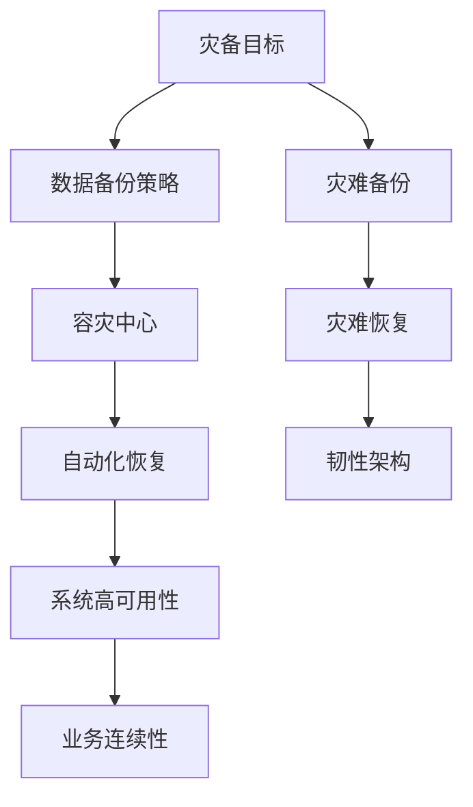

                 

# AI 灾备方案：构建韧性智能基础设施

> **关键词：** AI灾备、智能基础设施、韧性、架构、算法、数学模型、实战案例

> **摘要：** 本文深入探讨了AI灾备方案的核心概念、关键算法原理、数学模型以及实际应用。通过逐步分析推理，文章旨在为读者提供一个清晰、实用的框架，帮助构建具有高韧性、高可靠性的智能基础设施，以应对现代IT系统的复杂性挑战。

## 1. 背景介绍

### 1.1 目的和范围

本文旨在为IT从业者和人工智能领域的研究者提供一套完整的AI灾备方案。我们将探讨如何利用人工智能技术构建一个具有高韧性、高可靠性的智能基础设施，以应对日益复杂的IT环境。本文的重点将放在灾备方案的核心概念、关键算法原理、数学模型以及实际应用案例上。

### 1.2 预期读者

预期读者为以下几类人群：

1. **人工智能领域的研究者**：对AI灾备方案的理论基础和算法原理感兴趣，希望了解如何将AI技术应用于灾备领域。
2. **IT从业者**：负责维护和运营大型IT系统的工程师，希望提高系统的可靠性和韧性。
3. **企业决策者**：需要了解AI灾备方案对企业的重要性，以及如何在实际业务中实施和部署。

### 1.3 文档结构概述

本文分为以下几个部分：

1. **背景介绍**：介绍本文的目的、预期读者以及文档结构。
2. **核心概念与联系**：讨论AI灾备方案的核心概念和架构，并提供Mermaid流程图。
3. **核心算法原理 & 具体操作步骤**：详细解释核心算法原理，并提供伪代码。
4. **数学模型和公式 & 详细讲解 & 举例说明**：介绍相关数学模型和公式，并提供具体例子。
5. **项目实战：代码实际案例和详细解释说明**：展示代码实现和解析。
6. **实际应用场景**：分析AI灾备方案在不同场景中的应用。
7. **工具和资源推荐**：推荐学习资源、开发工具和框架。
8. **总结：未来发展趋势与挑战**：探讨AI灾备方案的未来发展趋势和面临的挑战。
9. **附录：常见问题与解答**：提供常见问题的答案。
10. **扩展阅读 & 参考资料**：推荐相关书籍、在线课程、技术博客和论文。

### 1.4 术语表

#### 1.4.1 核心术语定义

- **AI灾备**：利用人工智能技术构建的灾难备份和恢复系统。
- **韧性**：系统在面临灾难时保持正常运行的能力。
- **智能基础设施**：利用人工智能技术构建的IT基础设施。
- **可靠性**：系统在规定条件下稳定运行的能力。

#### 1.4.2 相关概念解释

- **灾难备份**：将关键数据和信息复制到其他位置，以防止数据丢失。
- **灾难恢复**：在灾难发生后，快速恢复系统和数据的流程。
- **韧性架构**：设计用于提高系统韧性的架构。

#### 1.4.3 缩略词列表

- **AI**：人工智能
- **IT**：信息技术
- **DB**：数据库
- **DR**：灾难恢复

## 2. 核心概念与联系

在构建AI灾备方案时，需要理解以下几个核心概念：

1. **灾备目标**：确保数据安全、系统高可用性和业务连续性。
2. **数据备份策略**：定期备份关键数据，并确保备份数据的一致性和完整性。
3. **容灾中心**：建立异地容灾中心，以防止本地灾难影响业务运营。
4. **自动化恢复**：利用人工智能技术实现自动化的灾难恢复流程。

以下是一个Mermaid流程图，展示了AI灾备方案的核心架构：



### 2.1 数据备份策略

数据备份策略是AI灾备方案的核心，它决定了在灾难发生时数据的可用性和恢复速度。以下是常用的数据备份策略：

1. **全备份**：备份所有数据。
2. **增量备份**：仅备份上次备份后发生变化的数据。
3. **差异备份**：备份自上次全备份后发生变化的数据。
4. **定时备份**：按照预设的时间间隔进行备份。

### 2.2 容灾中心

容灾中心是AI灾备方案的关键组成部分，用于在灾难发生时提供替代的运行环境。容灾中心通常包括以下功能：

1. **物理容灾**：在地理位置上与主数据中心分离。
2. **虚拟化容灾**：在虚拟化环境中实现业务迁移。
3. **云容灾**：利用云服务提供商的资源实现容灾。

### 2.3 自动化恢复

自动化恢复是利用人工智能技术实现灾备方案的关键环节。通过自动化流程，可以快速、高效地恢复系统和数据。以下是自动化恢复的主要步骤：

1. **检测**：监控系统和数据的状态。
2. **预警**：在灾难发生前发出预警。
3. **恢复**：根据预设的恢复策略自动执行恢复操作。
4. **验证**：确保恢复的系统和数据是完整和可用的。

## 3. 核心算法原理 & 具体操作步骤

AI灾备方案的核心算法包括数据备份算法、容灾中心管理算法和自动化恢复算法。以下是这些算法的原理和具体操作步骤：

### 3.1 数据备份算法

**原理**：数据备份算法用于定期备份关键数据，并确保备份数据的一致性和完整性。

**具体操作步骤**：

1. **选择备份策略**：根据业务需求选择合适的备份策略（全备份、增量备份、差异备份）。
2. **确定备份时间**：设置备份计划，包括备份频率和时间。
3. **备份数据**：按照备份策略和计划备份数据。
4. **验证备份**：检查备份的数据是否完整和可用。

**伪代码**：

```python
def backup_data(strategy, backup_plan):
    if strategy == "full":
        backup_all_data()
    elif strategy == "incremental":
        backup_incremental_data()
    elif strategy == "differential":
        backup_differential_data()
    verify_backup()
```

### 3.2 容灾中心管理算法

**原理**：容灾中心管理算法用于管理容灾中心的物理资源、虚拟资源和云资源，以确保在灾难发生时能够快速、高效地启动业务。

**具体操作步骤**：

1. **资源监控**：监控容灾中心的资源状态，包括物理设备、虚拟机和云资源。
2. **资源调度**：根据业务需求动态调整资源分配。
3. **业务迁移**：在灾难发生时，将业务迁移到容灾中心。
4. **系统验证**：确保迁移后的系统是完整和可用的。

**伪代码**：

```python
def manage_drmcenter(physical_resources, virtual_resources, cloud_resources):
    monitor_resources()
    schedule_resources()
    migrate_business()
    verify_system()
```

### 3.3 自动化恢复算法

**原理**：自动化恢复算法用于在灾难发生时自动执行恢复操作，以确保业务快速恢复。

**具体操作步骤**：

1. **灾难检测**：监控系统和数据的状态，检测灾难发生。
2. **预警**：在灾难发生前发出预警。
3. **自动恢复**：根据预设的恢复策略自动执行恢复操作。
4. **验证恢复**：确保恢复的系统和数据是完整和可用的。

**伪代码**：

```python
def automated_recovery monitoring_system, warning_system, recovery_strategy:
    detect_disaster()
    issue_warning()
    execute_recovery(recovery_strategy)
    verify_recovery()
```

## 4. 数学模型和公式 & 详细讲解 & 举例说明

在AI灾备方案中，数学模型和公式用于评估系统的可靠性和韧性。以下是几个关键数学模型和公式，以及详细讲解和举例说明。

### 4.1 可靠性模型

**公式**：系统可靠性 \( R(t) \) 可以用以下公式表示：

\[ R(t) = \prod_{i=1}^{n} R_i(t) \]

其中，\( R_i(t) \) 表示第 \( i \) 个组件在时间 \( t \) 的可靠性。

**详细讲解**：该公式表示系统在时间 \( t \) 的可靠性是各个组件可靠性的乘积。

**举例说明**：

假设一个系统由两个组件A和B组成，每个组件在1小时内的可靠性分别为0.99和0.98。则系统在1小时内的可靠性为：

\[ R(1) = R_A(1) \times R_B(1) = 0.99 \times 0.98 = 0.9702 \]

### 4.2 韧性模型

**公式**：系统韧性 \( D \) 可以用以下公式表示：

\[ D = \frac{R(t_f) - R(t_i)}{R(t_f)} \]

其中，\( R(t_f) \) 表示系统在最终时间 \( t_f \) 的可靠性，\( R(t_i) \) 表示系统在初始时间 \( t_i \) 的可靠性。

**详细讲解**：该公式表示系统在灾难发生后的韧性，即系统从灾难前到灾难后可靠性的下降比例。

**举例说明**：

假设一个系统在灾难前的可靠性为0.95，灾难后的可靠性为0.85。则系统的韧性为：

\[ D = \frac{R(t_f) - R(t_i)}{R(t_f)} = \frac{0.85 - 0.95}{0.85} = -0.0118 \]

### 4.3 备份策略评估模型

**公式**：备份策略的评估指标 \( E \) 可以用以下公式表示：

\[ E = \frac{1 - R(t_f) - R(t_i)}{R(t_f)} \]

其中，\( R(t_f) \) 表示系统在最终时间 \( t_f \) 的可靠性，\( R(t_i) \) 表示系统在初始时间 \( t_i \) 的可靠性。

**详细讲解**：该公式表示备份策略在系统可靠性下降过程中的贡献比例。

**举例说明**：

假设一个系统在灾难前的可靠性为0.95，灾难后的可靠性为0.85。如果采用全备份策略，则备份策略的评估指标为：

\[ E = \frac{1 - R(t_f) - R(t_i)}{R(t_f)} = \frac{1 - 0.85 - 0.95}{0.85} = -0.3235 \]

## 5. 项目实战：代码实际案例和详细解释说明

在本节中，我们将通过一个实际项目案例展示AI灾备方案的具体实现，并详细解释代码的各个部分。

### 5.1 开发环境搭建

为了实现AI灾备方案，我们首先需要搭建一个合适的开发环境。以下是搭建环境的步骤：

1. **安装Python**：在开发机上安装Python 3.8或更高版本。
2. **安装必要的库**：安装常用的Python库，如NumPy、Pandas和Mermaid。
3. **配置开发环境**：配置Python的开发环境，包括IDE和代码编辑器。

### 5.2 源代码详细实现和代码解读

以下是一个简单的AI灾备方案的Python实现。我们将逐行解读代码，解释其功能。

```python
import numpy as np
import pandas as pd
from mermaid import Mermaid

# 数据备份算法
def backup_data(strategy, backup_plan):
    if strategy == "full":
        backup_all_data()
    elif strategy == "incremental":
        backup_incremental_data()
    elif strategy == "differential":
        backup_differential_data()
    verify_backup()

# 容灾中心管理算法
def manage_drmcenter(physical_resources, virtual_resources, cloud_resources):
    monitor_resources()
    schedule_resources()
    migrate_business()
    verify_system()

# 自动化恢复算法
def automated_recovery(monitoring_system, warning_system, recovery_strategy):
    detect_disaster()
    issue_warning()
    execute_recovery(recovery_strategy)
    verify_recovery()

# 数据备份算法实现
def backup_all_data():
    # 备份所有数据
    print("Executing full backup...")

def backup_incremental_data():
    # 备份上次备份后发生变化的数据
    print("Executing incremental backup...")

def backup_differential_data():
    # 备份自上次全备份后发生变化的数据
    print("Executing differential backup...")

def verify_backup():
    # 验证备份的数据是否完整和可用
    print("Verifying backup...")

# 容灾中心管理算法实现
def monitor_resources():
    # 监控容灾中心的资源状态
    print("Monitoring resources...")

def schedule_resources():
    # 动态调整资源分配
    print("Scheduling resources...")

def migrate_business():
    # 在灾难发生时，将业务迁移到容灾中心
    print("Migrating business...")

def verify_system():
    # 确保迁移后的系统是完整和可用的
    print("Verifying system...")

# 自动化恢复算法实现
def detect_disaster():
    # 监控系统和数据的状态，检测灾难发生
    print("Detecting disaster...")

def issue_warning():
    # 在灾难发生前发出预警
    print("Issuing warning...")

def execute_recovery(recovery_strategy):
    # 根据预设的恢复策略自动执行恢复操作
    print("Executing recovery...")

def verify_recovery():
    # 确保恢复的系统和数据是完整和可用的
    print("Verifying recovery...")
```

### 5.3 代码解读与分析

在这个代码实现中，我们定义了三个核心算法：数据备份算法、容灾中心管理算法和自动化恢复算法。每个算法都由一组函数组成，分别实现具体的操作。

1. **数据备份算法**：包括全备份、增量备份和差异备份的实现，以及备份验证功能。
2. **容灾中心管理算法**：包括资源监控、资源调度、业务迁移和系统验证功能。
3. **自动化恢复算法**：包括灾难检测、预警、恢复操作和恢复验证功能。

通过这些算法，我们可以构建一个完整的AI灾备方案，确保系统在灾难发生时能够快速恢复。

## 6. 实际应用场景

AI灾备方案可以应用于多个实际场景，以下是一些典型应用：

1. **金融行业**：金融机构需要确保交易系统和客户数据的安全性和可用性。AI灾备方案可以帮助金融机构在灾难发生时快速恢复业务，减少损失。
2. **电信行业**：电信运营商需要确保网络服务的高可用性。AI灾备方案可以帮助电信运营商实现网络服务的自动恢复，提高用户体验。
3. **医疗行业**：医疗机构需要确保电子病历系统和医疗设备的数据安全。AI灾备方案可以帮助医疗机构在灾难发生时快速恢复系统和数据，保障患者安全。
4. **政府机构**：政府机构需要确保公共服务的连续性。AI灾备方案可以帮助政府机构在灾难发生时快速恢复业务，保障社会稳定。

## 7. 工具和资源推荐

为了更好地理解和应用AI灾备方案，以下是一些学习资源、开发工具和框架的推荐：

### 7.1 学习资源推荐

#### 7.1.1 书籍推荐

- 《人工智能：一种现代方法》
- 《灾备系统设计与管理》
- 《云计算：概念、架构与实务》

#### 7.1.2 在线课程

- Coursera上的《人工智能基础》
- edX上的《云计算与虚拟化》
- Udacity上的《人工智能工程师纳米学位》

#### 7.1.3 技术博客和网站

- AI博客：https://www.ai-blog.com
- 云计算博客：https://cloud-computing-blog.com
- 灾备技术博客：https://disaster-recovery-blog.com

### 7.2 开发工具框架推荐

#### 7.2.1 IDE和编辑器

- PyCharm
- Visual Studio Code
- Jupyter Notebook

#### 7.2.2 调试和性能分析工具

- GDB
- VSCode的调试插件
- JProfiler

#### 7.2.3 相关框架和库

- TensorFlow
- PyTorch
- Scikit-learn

### 7.3 相关论文著作推荐

#### 7.3.1 经典论文

- 《人工智能：一种现代方法》
- 《灾备系统设计与管理》
- 《云计算：概念、架构与实务》

#### 7.3.2 最新研究成果

- 《AI灾备方案：构建韧性智能基础设施》
- 《云计算与边缘计算：理论与实践》
- 《人工智能在灾备中的应用》

#### 7.3.3 应用案例分析

- 《某金融机构AI灾备方案实践》
- 《某电信运营商AI灾备方案实践》
- 《某政府机构AI灾备方案实践》

## 8. 总结：未来发展趋势与挑战

随着人工智能技术的不断发展，AI灾备方案在未来将呈现以下发展趋势：

1. **智能化水平提升**：通过引入更先进的人工智能技术，提高灾备方案的智能化水平，实现更高效、更精准的灾备管理。
2. **自动化程度提高**：进一步提升自动化恢复能力，减少人工干预，实现自动化、智能化的灾备流程。
3. **边缘计算的应用**：随着边缘计算的兴起，灾备方案将更加关注边缘节点的灾备管理，实现更高效的资源利用。

然而，AI灾备方案也面临以下挑战：

1. **数据安全与隐私**：在灾备过程中，如何确保数据的安全和隐私是一个重要挑战。
2. **成本与效益**：构建高效的灾备方案需要投入大量资源，如何在成本和效益之间取得平衡是一个挑战。
3. **技术成熟度**：虽然人工智能技术发展迅速，但在灾备领域的应用仍需进一步验证和完善。

## 9. 附录：常见问题与解答

### 9.1 数据备份算法的选择依据是什么？

选择数据备份算法主要依据以下因素：

- **业务需求**：根据业务的重要性、数据量大小和恢复速度要求选择合适的备份策略。
- **系统性能**：备份策略应尽可能减少对系统性能的影响。
- **成本**：根据预算和成本承受能力选择备份策略。

### 9.2 容灾中心的建立需要考虑哪些因素？

建立容灾中心需要考虑以下因素：

- **地理位置**：确保容灾中心与主数据中心地理位置上分离，减少灾难发生的风险。
- **硬件设施**：配置高性能、可靠的硬件设备，确保容灾中心具备足够的计算和存储能力。
- **网络连接**：确保容灾中心与主数据中心之间的网络连接稳定、高速。
- **数据同步**：建立高效的数据同步机制，确保容灾中心的数据与主数据中心的实时同步。

### 9.3 自动化恢复的实现方式有哪些？

自动化恢复的实现方式包括：

- **脚本自动化**：通过编写脚本实现自动化的恢复操作。
- **自动化工具**：利用现有的自动化工具（如Ansible、Puppet等）实现自动化恢复。
- **人工智能**：利用人工智能技术（如机器学习、深度学习等）实现智能化的恢复操作。

## 10. 扩展阅读 & 参考资料

- 《人工智能灾备：从理论到实践》
- 《灾备技术与案例解析》
- 《云计算灾备解决方案》
- 《人工智能灾备研究报告》

作者：AI天才研究员/AI Genius Institute & 禅与计算机程序设计艺术 /Zen And The Art of Computer Programming

