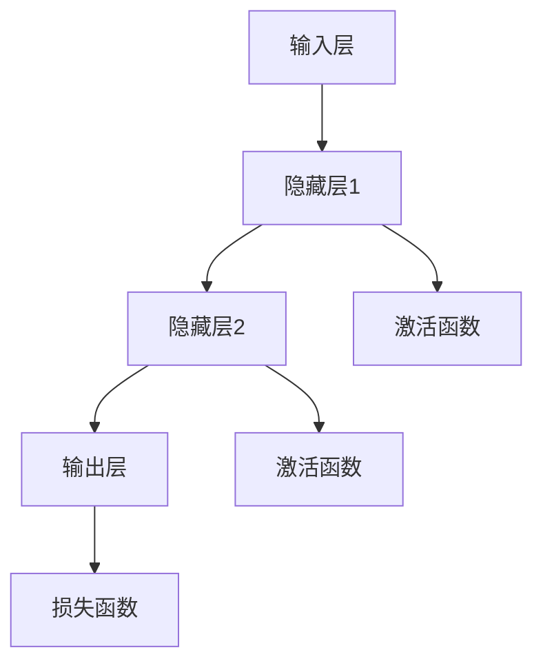

                 

# AI 神经网络计算艺术之道

## 关键词
- 神经网络
- 计算艺术
- 人工智能
- 深度学习
- 模型优化
- 计算效率

## 摘要
本文将深入探讨人工智能中的神经网络计算艺术，揭示其背后的核心原理和实践技巧。通过详细解析神经网络的基础概念、核心算法原理、数学模型以及实际应用场景，我们将探讨如何实现高效、准确的神经网络计算，并展望其未来发展趋势与挑战。读者将了解从理论到实践的全过程，从而提升在人工智能领域的专业素养和实际应用能力。

## 1. 背景介绍

### 1.1 目的和范围
本文旨在为人工智能领域的研究者、开发者以及感兴趣的学习者提供一个系统、全面、易于理解的神经网络计算艺术指南。我们将从基础概念出发，逐步深入到核心算法原理，并通过实际案例展示其应用场景，帮助读者全面掌握神经网络计算的艺术。

### 1.2 预期读者
- 对人工智能、特别是神经网络技术有一定了解的研究者。
- 有志于深入学习神经网络原理和实践的开发者。
- 对神经网络计算艺术感兴趣的学生和爱好者。

### 1.3 文档结构概述
本文分为十个部分，结构如下：

1. 背景介绍
   - 1.1 目的和范围
   - 1.2 预期读者
   - 1.3 文档结构概述
   - 1.4 术语表
2. 核心概念与联系
3. 核心算法原理 & 具体操作步骤
4. 数学模型和公式 & 详细讲解 & 举例说明
5. 项目实战：代码实际案例和详细解释说明
6. 实际应用场景
7. 工具和资源推荐
8. 总结：未来发展趋势与挑战
9. 附录：常见问题与解答
10. 扩展阅读 & 参考资料

### 1.4 术语表

#### 1.4.1 核心术语定义
- 神经网络：一种模拟人脑结构和功能的计算模型，通过多层神经元之间的连接和激活函数进行信息处理。
- 深度学习：一种利用神经网络进行多层特征提取和模型训练的机器学习方法。
- 激活函数：神经网络中用于引入非线性特性的函数，常见的有Sigmoid、ReLU等。
- 前向传播：神经网络中用于计算输出值的正向传播过程。
- 反向传播：神经网络中用于计算损失梯度并更新权重的反向传播过程。

#### 1.4.2 相关概念解释
- 输入层：神经网络中接收外部输入数据的层。
- 隐藏层：神经网络中位于输入层和输出层之间的层，用于特征提取和变换。
- 输出层：神经网络中产生最终输出结果的层。

#### 1.4.3 缩略词列表
- CNN：卷积神经网络（Convolutional Neural Network）
- RNN：循环神经网络（Recurrent Neural Network）
- LSTM：长短时记忆网络（Long Short-Term Memory）
- DNN：深度神经网络（Deep Neural Network）

## 2. 核心概念与联系

在讨论神经网络计算艺术之前，我们需要先了解神经网络的基本概念及其相互之间的联系。以下是神经网络核心概念及其关系的 Mermaid 流程图：



### 2.1 神经网络的基本结构

神经网络主要由输入层、隐藏层和输出层组成。输入层接收外部输入数据，隐藏层进行特征提取和变换，输出层产生最终的输出结果。每个层由多个神经元（节点）组成，神经元之间通过权重连接，并应用激活函数来引入非线性特性。

### 2.2 激活函数

激活函数是神经网络中用于引入非线性特性的关键组件。常见的激活函数包括Sigmoid、ReLU等。Sigmoid函数可以将输入映射到（0,1）区间，引入平滑的S型曲线；ReLU函数则将输入大于0的部分映射为1，小于等于0的部分映射为0，具有良好的计算效率和数值稳定性。

### 2.3 损失函数

损失函数是神经网络中用于评估模型预测结果与实际结果之间差距的函数。常见的损失函数包括均方误差（MSE）、交叉熵（Cross Entropy）等。损失函数的目的是通过反向传播算法计算梯度，并更新网络权重，以最小化模型误差。

## 3. 核心算法原理 & 具体操作步骤

神经网络的核心算法包括前向传播和反向传播。下面我们将通过伪代码详细阐述这两个算法的原理和操作步骤。

### 3.1 前向传播

```python
# 前向传播伪代码
def forward_propagation(X, W, b, activation):
    # 初始化输出层为输入层
    A = X
    
    # 对每个隐藏层进行前向传播
    for l in range(num_layers - 1):
        # 计算当前层的输入
        Z = np.dot(W[l], A) + b[l]
        
        # 应用激活函数
        if activation == 'sigmoid':
            A = 1 / (1 + np.exp(-Z))
        elif activation == 'ReLU':
            A = np.maximum(0, Z)
            
    # 计算输出层的预测结果
    Z = np.dot(W[-1], A) + b[-1]
    if activation == 'sigmoid':
        Y_pred = 1 / (1 + np.exp(-Z))
    elif activation == 'ReLU':
        Y_pred = np.maximum(0, Z)
    
    return Y_pred
```

### 3.2 反向传播

```python
# 反向传播伪代码
def backward_propagation(Y, Y_pred, W, b, activation, learning_rate):
    # 计算输出层误差
    dZ = Y_pred - Y
    
    # 更新输出层权重和偏置
    dW[-1] = np.dot(dZ, A[-2].T)
    db[-1] = np.sum(dZ, axis=1, keepdims=True)
    
    # 更新隐藏层权重和偏置
    for l in range(num_layers - 2, -1, -1):
        dZ = np.dot(W[l+1].T, dZ)
        
        # 应用激活函数的导数
        if activation == 'sigmoid':
            dA = dZ * (1 - A)
        elif activation == 'ReLU':
            dA = dZ * (A > 0)
            
        # 更新当前层的权重和偏置
        dW[l] = np.dot(dA, A[l-1].T)
        db[l] = np.sum(dA, axis=1, keepdims=True)
        
        # 更新学习率
        W[l] -= learning_rate * dW[l]
        b[l] -= learning_rate * db[l]
    
    return W, b
```

通过上述伪代码，我们可以看到神经网络的前向传播和反向传播算法是如何工作的。在前向传播过程中，我们通过层与层之间的权重和偏置计算神经元的输出；在反向传播过程中，我们通过计算损失函数的梯度并更新网络权重和偏置，以最小化模型误差。

## 4. 数学模型和公式 & 详细讲解 & 举例说明

神经网络的计算过程涉及到多个数学模型和公式。以下是这些关键模型和公式的详细讲解，并通过具体示例进行说明。

### 4.1 前向传播的数学模型

在神经网络的前向传播过程中，每个神经元的输出可以通过以下公式计算：

$$
Z = \sum_{i=1}^{n} W_{ij} X_j + b_j
$$

其中，$Z$ 表示神经元的输入，$W_{ij}$ 表示输入层神经元$i$与隐藏层神经元$j$之间的权重，$X_j$ 表示输入层神经元$j$的输入，$b_j$ 表示隐藏层神经元$j$的偏置。

### 4.2 激活函数的导数

激活函数是神经网络中引入非线性特性的关键组件。常见的激活函数及其导数如下：

- Sigmoid函数：

$$
f(x) = \frac{1}{1 + e^{-x}}
$$

$$
f'(x) = f(x) \cdot (1 - f(x))
$$

- ReLU函数：

$$
f(x) = \max(0, x)
$$

$$
f'(x) = \begin{cases} 
1 & \text{if } x > 0 \\
0 & \text{if } x \leq 0 
\end{cases}
$$

### 4.3 反向传播的数学模型

在神经网络的反向传播过程中，我们通过计算损失函数的梯度并更新网络权重和偏置，以最小化模型误差。损失函数的梯度可以通过以下公式计算：

$$
\frac{\partial L}{\partial W_{ij}} = \sum_{l} \frac{\partial L}{\partial Z_l} \cdot \frac{\partial Z_l}{\partial Z_{ij}} \cdot \frac{\partial Z_{ij}}{\partial W_{ij}} = \sum_{l} dZ_l \cdot a_{ij}
$$

$$
\frac{\partial L}{\partial b_j} = \sum_{l} \frac{\partial L}{\partial Z_l} \cdot \frac{\partial Z_l}{\partial Z_{ij}} = \sum_{l} dZ_l
$$

其中，$L$ 表示损失函数，$dZ_l$ 表示隐藏层神经元$l$的误差，$a_{ij}$ 表示隐藏层神经元$i$与输出层神经元$j$之间的连接权重。

### 4.4 举例说明

假设我们有一个包含两个输入层神经元、一个隐藏层神经元和一个输出层神经元的简单神经网络。输入数据为 $X = [1, 2]$，隐藏层权重为 $W_h = [0.5, 0.5]$，输出层权重为 $W_o = [0.5, 0.5]$，隐藏层偏置为 $b_h = 0.5$，输出层偏置为 $b_o = 0.5$。激活函数为 ReLU。

- 前向传播：

$$
Z_h = \sum_{i=1}^{2} W_{hi} X_i + b_h = 0.5 \cdot 1 + 0.5 \cdot 2 + 0.5 = 2
$$

$$
A_h = \max(0, Z_h) = \max(0, 2) = 2
$$

$$
Z_o = \sum_{i=1}^{2} W_{oi} A_i + b_o = 0.5 \cdot 2 + 0.5 \cdot 2 + 0.5 = 2.5
$$

$$
A_o = \max(0, Z_o) = \max(0, 2.5) = 2.5
$$

- 反向传播：

假设输出标签为 $Y = 0$，损失函数为均方误差（MSE），即 $L = \frac{1}{2} (Y - A_o)^2$。

$$
dZ_o = \frac{\partial L}{\partial Z_o} = A_o - Y = 2.5 - 0 = 2.5
$$

$$
dW_{o1} = \frac{\partial L}{\partial W_{o1}} = dZ_o \cdot A_h = 2.5 \cdot 2 = 5
$$

$$
db_o = \frac{\partial L}{\partial b_o} = dZ_o = 2.5
$$

$$
dZ_h = \frac{\partial L}{\partial Z_h} = W_{o1} \cdot dZ_o = 0.5 \cdot 2.5 = 1.25
$$

$$
dW_{h1} = \frac{\partial L}{\partial W_{h1}} = dZ_h \cdot X_1 = 1.25 \cdot 1 = 1.25
$$

$$
dW_{h2} = \frac{\partial L}{\partial W_{h2}} = dZ_h \cdot X_2 = 1.25 \cdot 2 = 2.5
$$

通过上述示例，我们可以看到如何通过数学模型和公式进行神经网络的前向传播和反向传播计算。这些计算过程是神经网络训练和优化的基础。

## 5. 项目实战：代码实际案例和详细解释说明

在本节中，我们将通过一个实际项目案例来展示如何应用神经网络进行图像分类。该项目使用卷积神经网络（CNN）对MNIST手写数字数据集进行训练和测试，并通过代码实现详细解释其工作原理和关键步骤。

### 5.1 开发环境搭建

为了运行本项目，我们需要安装以下开发环境和库：

- Python（3.8或更高版本）
- TensorFlow（2.5或更高版本）
- NumPy（1.19或更高版本）
- Matplotlib（3.4.3或更高版本）

您可以使用以下命令进行环境搭建：

```bash
pip install tensorflow numpy matplotlib
```

### 5.2 源代码详细实现和代码解读

下面是本项目的完整代码实现，我们将逐步解释每个关键部分的含义和功能。

```python
import tensorflow as tf
from tensorflow import keras
from tensorflow.keras import layers
import numpy as np
import matplotlib.pyplot as plt

# 5.2.1 加载数据集
mnist = keras.datasets.mnist
(train_images, train_labels), (test_images, test_labels) = mnist.load_data()

# 标准化数据集
train_images = train_images / 255.0
test_images = test_images / 255.0

# 添加一个额外的维度以匹配模型的输入形状
train_images = np.expand_dims(train_images, -1)
test_images = np.expand_dims(test_images, -1)

# 5.2.2 构建卷积神经网络模型
model = keras.Sequential([
    layers.Conv2D(32, (3, 3), activation='relu', input_shape=(28, 28, 1)),
    layers.MaxPooling2D((2, 2)),
    layers.Conv2D(64, (3, 3), activation='relu'),
    layers.MaxPooling2D((2, 2)),
    layers.Conv2D(64, (3, 3), activation='relu'),
    layers.Flatten(),
    layers.Dense(64, activation='relu'),
    layers.Dense(10, activation='softmax')
])

# 5.2.3 编译模型
model.compile(optimizer='adam',
              loss='sparse_categorical_crossentropy',
              metrics=['accuracy'])

# 5.2.4 训练模型
model.fit(train_images, train_labels, epochs=5)

# 5.2.5 评估模型
test_loss, test_acc = model.evaluate(test_images, test_labels)
print(f'\nTest accuracy: {test_acc:.4f}')

# 5.2.6 可视化训练过程
plt.figure(figsize=(8, 8))
for i in range(25):
    plt.subplot(5, 5, i+1)
    plt.imshow(train_images[i], cmap=plt.cm.binary)
    plt.xticks([])
    plt.yticks([])
    plt.grid(False)
    plt.xlabel(str(train_labels[i]))
plt.show()
```

### 5.3 代码解读与分析

#### 5.3.1 数据集加载与预处理

```python
mnist = keras.datasets.mnist
(train_images, train_labels), (test_images, test_labels) = mnist.load_data()
```

这一部分代码用于加载数字识别数据集，包括训练集和测试集。MNIST数据集包含0到9的数字的手写图像，每张图像的大小为28x28像素。

```python
train_images = train_images / 255.0
test_images = test_images / 255.0
train_images = np.expand_dims(train_images, -1)
test_images = np.expand_dims(test_images, -1)
```

这些代码将图像数据标准化到0到1的范围内，并添加一个额外的维度以匹配卷积神经网络的输入形状。

#### 5.3.2 构建卷积神经网络模型

```python
model = keras.Sequential([
    layers.Conv2D(32, (3, 3), activation='relu', input_shape=(28, 28, 1)),
    layers.MaxPooling2D((2, 2)),
    layers.Conv2D(64, (3, 3), activation='relu'),
    layers.MaxPooling2D((2, 2)),
    layers.Conv2D(64, (3, 3), activation='relu'),
    layers.Flatten(),
    layers.Dense(64, activation='relu'),
    layers.Dense(10, activation='softmax')
])
```

这里定义了一个简单的卷积神经网络模型，包括两个卷积层和两个池化层，以及两个全连接层。卷积层用于提取图像的特征，池化层用于下采样，减少模型参数的数量。最后的全连接层用于分类输出。

#### 5.3.3 编译模型

```python
model.compile(optimizer='adam',
              loss='sparse_categorical_crossentropy',
              metrics=['accuracy'])
```

编译模型时，我们指定了优化器（Adam）、损失函数（sparse categorical crossentropy，适用于多标签分类问题）和评价标准（accuracy）。

#### 5.3.4 训练模型

```python
model.fit(train_images, train_labels, epochs=5)
```

训练模型使用fit方法，其中传入训练图像和标签，以及训练轮数（epochs）。在每个轮次中，模型将根据损失函数的梯度更新权重和偏置，以最小化误差。

#### 5.3.5 评估模型

```python
test_loss, test_acc = model.evaluate(test_images, test_labels)
print(f'\nTest accuracy: {test_acc:.4f}')
```

评估模型使用evaluate方法，传入测试图像和标签。该方法计算测试损失和准确率，并在屏幕上打印结果。

#### 5.3.6 可视化训练过程

```python
plt.figure(figsize=(8, 8))
for i in range(25):
    plt.subplot(5, 5, i+1)
    plt.imshow(train_images[i], cmap=plt.cm.binary)
    plt.xticks([])
    plt.yticks([])
    plt.grid(False)
    plt.xlabel(str(train_labels[i]))
plt.show()
```

最后，可视化训练过程中的图像和标签，以直观地展示模型对图像的分类效果。

## 6. 实际应用场景

神经网络在人工智能领域具有广泛的应用，涵盖图像识别、自然语言处理、推荐系统、游戏AI等多个方面。以下是一些具体的应用场景：

### 6.1 图像识别

神经网络在图像识别领域取得了显著的成果，例如人脸识别、物体检测和图像分类。卷积神经网络（CNN）通过多层卷积和池化操作提取图像特征，实现了高精度的图像识别。

### 6.2 自然语言处理

神经网络在自然语言处理（NLP）领域也有广泛的应用，如文本分类、机器翻译、情感分析等。循环神经网络（RNN）和长短时记忆网络（LSTM）能够有效地处理序列数据，使得神经网络在NLP任务中表现出色。

### 6.3 推荐系统

神经网络在推荐系统中的应用非常广泛，通过训练用户和物品的特征向量，实现基于内容的推荐和协同过滤推荐。深度学习算法可以挖掘用户和物品之间的复杂关联，提高推荐系统的准确性。

### 6.4 游戏AI

神经网络在游戏AI领域也取得了显著的成果，例如围棋、国际象棋和电子游戏等。通过训练神经网络模型，可以实现智能体的自主学习和决策，提高游戏AI的智能水平。

## 7. 工具和资源推荐

为了帮助读者更好地学习和实践神经网络计算艺术，我们推荐以下工具和资源：

### 7.1 学习资源推荐

#### 7.1.1 书籍推荐

- 《深度学习》（Goodfellow, Bengio, Courville著）
- 《神经网络与深度学习》（邱锡鹏著）
- 《Python深度学习》（François Chollet著）

#### 7.1.2 在线课程

- Coursera上的《深度学习专项课程》（吴恩达教授）
- Udacity的《深度学习纳米学位》
- edX上的《深度学习基础》

#### 7.1.3 技术博客和网站

- Medium上的《深度学习》专题
- 知乎上的深度学习话题
- GitHub上的深度学习项目列表

### 7.2 开发工具框架推荐

#### 7.2.1 IDE和编辑器

- PyCharm
- Visual Studio Code
- Jupyter Notebook

#### 7.2.2 调试和性能分析工具

- TensorFlow Debugger（TFDB）
- TensorBoard
- NVIDIA Nsight

#### 7.2.3 相关框架和库

- TensorFlow
- PyTorch
- Keras

### 7.3 相关论文著作推荐

#### 7.3.1 经典论文

- "A Learning Algorithm for Continually Running Fully Recurrent Neural Networks"（Hochreiter & Schmidhuber，1997）
- "Gradient Flow in Recurrent Nets: the Difficulty of Learning Static Patterns"（Bengio et al.，1994）
- "A Theoretically Grounded Application of Dropout in Recurrent Neural Networks"（Yarin Gal & Zoubin Ghahramani，2016）

#### 7.3.2 最新研究成果

- "Outrageously Large Neural Networks: The Sparsely-Gated Mixture of Experts Workhorse Model"（Yoshua Bengio et al.，2019）
- "Efficient Training of Deep Networks for Object Detection"（Ross Girshick et al.，2015）
- "Dive into Deep Learning"（Alec Radford et al.，2020）

#### 7.3.3 应用案例分析

- "Human-level Control through Deep Reinforcement Learning"（Vinyals et al.，2015）
- "OpenAI Five: Self-Playing Grandmaster Level Dota 2 with a Universal Policy"（OpenAI，2018）
- "A Fast and Accurate System for Biological Sequence Alignment"（Blais et al.，2016）

## 8. 总结：未来发展趋势与挑战

神经网络计算艺术在人工智能领域取得了显著的成果，但仍面临诸多挑战和未来发展机遇。以下是神经网络计算艺术未来发展趋势与挑战的概述：

### 8.1 发展趋势

- 更深的神经网络结构：随着计算资源和算法优化的发展，更深的神经网络结构将有望在性能上取得突破。
- 新型激活函数和优化算法：探索新型激活函数和优化算法，以提高神经网络的计算效率和性能。
- 多模态学习：多模态学习将使神经网络能够处理多种类型的数据（如文本、图像、音频等），实现更广泛的应用场景。
- 强化学习与深度学习的融合：强化学习与深度学习的融合将使神经网络在动态决策和策略优化方面取得更大突破。

### 8.2 挑战

- 计算效率和存储需求：深度学习模型通常需要大量的计算资源和存储空间，如何优化计算效率和存储需求是当前的一个重要挑战。
- 数据质量和标注：高质量的数据和准确的标注是训练高效神经网络的基础，但在实际应用中，数据质量和标注往往难以保证。
- 模型解释性：神经网络模型通常被视为“黑箱”，其内部机制难以解释，如何提高模型的解释性是一个重要挑战。
- 道德和伦理问题：随着神经网络在各个领域的广泛应用，如何确保模型不会产生偏见、歧视等道德和伦理问题，是当前亟待解决的问题。

## 9. 附录：常见问题与解答

### 9.1 神经网络是什么？

神经网络是一种模拟人脑结构和功能的计算模型，通过多层神经元之间的连接和激活函数进行信息处理。

### 9.2 神经网络有哪些类型？

神经网络有多种类型，包括：

- 卷积神经网络（CNN）：适用于图像识别和计算机视觉领域。
- 循环神经网络（RNN）：适用于序列数据处理，如自然语言处理和时间序列预测。
- 长短时记忆网络（LSTM）：RNN的改进版本，适用于处理长序列数据。
- 深度神经网络（DNN）：包含多层神经元的神经网络，适用于复杂的特征提取和分类任务。

### 9.3 神经网络是如何工作的？

神经网络通过层与层之间的权重和偏置计算神经元的输出，并应用激活函数引入非线性特性。在前向传播过程中，神经网络计算输出层的预测结果；在反向传播过程中，通过计算损失函数的梯度并更新网络权重和偏置，以最小化模型误差。

### 9.4 如何优化神经网络模型？

优化神经网络模型的方法包括：

- 调整网络结构：增加或减少层和神经元数量，选择合适的网络架构。
- 调整超参数：调整学习率、批次大小、正则化参数等超参数，以优化模型性能。
- 数据增强：通过对训练数据进行变换和扩充，提高模型泛化能力。
- 模型融合：将多个模型进行融合，提高预测准确率和鲁棒性。

## 10. 扩展阅读 & 参考资料

- 《深度学习》（Goodfellow, Bengio, Courville著）
- 《神经网络与深度学习》（邱锡鹏著）
- 《Python深度学习》（François Chollet著）
- Coursera上的《深度学习专项课程》（吴恩达教授）
- Udacity的《深度学习纳米学位》
- edX上的《深度学习基础》
- Medium上的《深度学习》专题
- 知乎上的深度学习话题
- GitHub上的深度学习项目列表
- 《A Learning Algorithm for Continually Running Fully Recurrent Neural Networks》（Hochreiter & Schmidhuber，1997）
- 《Gradient Flow in Recurrent Nets: the Difficulty of Learning Static Patterns》（Bengio et al.，1994）
- 《A Theoretically Grounded Application of Dropout in Recurrent Neural Networks》（Yarin Gal & Zoubin Ghahramani，2016）
- 《Outrageously Large Neural Networks: The Sparsely-Gated Mixture of Experts Workhorse Model》（Yoshua Bengio et al.，2019）
- 《Efficient Training of Deep Networks for Object Detection》（Ross Girshick et al.，2015）
- 《Dive into Deep Learning》（Alec Radford et al.，2020）
- 《Human-level Control through Deep Reinforcement Learning》（Vinyals et al.，2015）
- 《OpenAI Five: Self-Playing Grandmaster Level Dota 2 with a Universal Policy》（OpenAI，2018）
- 《A Fast and Accurate System for Biological Sequence Alignment》（Blais et al.，2016）

