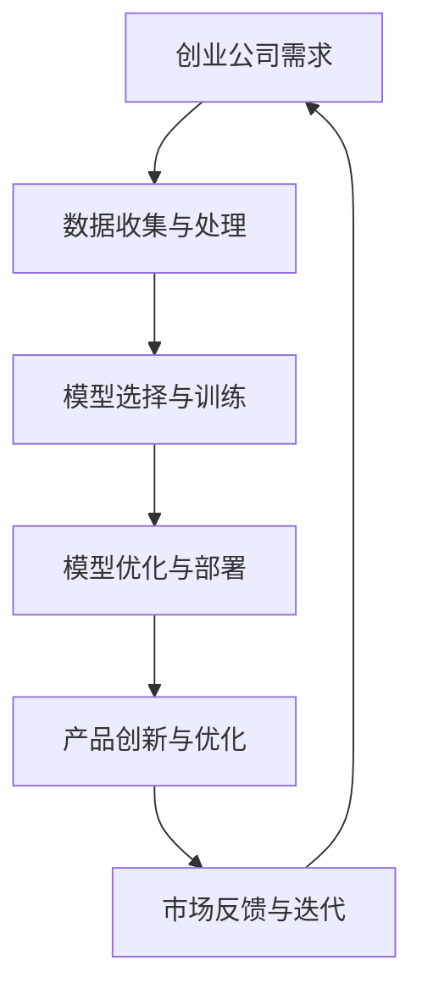

                 


# AI 驱动的创业产品设计原则：大模型赋能

> 关键词：AI创业设计、产品设计、大模型、赋能、创新

> 摘要：随着人工智能技术的迅猛发展，大模型在创业产品设计中的应用日益广泛。本文旨在探讨AI驱动的创业产品设计原则，分析大模型如何赋能产品创新，并从实际案例出发，为创业公司提供实用的设计思路和方法。

## 1. 背景介绍

### 1.1 目的和范围

本文的目的在于探讨AI驱动的创业产品设计原则，特别是大模型在产品设计中的应用。我们将结合实际案例，分析大模型如何赋能创业公司，助力产品创新，并为其提供实用的设计方法和策略。

### 1.2 预期读者

本文适合对AI技术和创业产品设计感兴趣的读者，包括创业公司创始人、产品经理、设计师以及相关领域的研究人员。

### 1.3 文档结构概述

本文结构如下：

1. 背景介绍：介绍本文的目的、范围和预期读者。
2. 核心概念与联系：介绍大模型的核心概念和原理，并通过Mermaid流程图展示大模型在创业产品设计中的应用。
3. 核心算法原理 & 具体操作步骤：详细阐述大模型的算法原理和操作步骤。
4. 数学模型和公式 & 详细讲解 & 举例说明：讲解大模型相关的数学模型和公式，并通过案例进行说明。
5. 项目实战：介绍一个实际案例，展示如何将大模型应用于创业产品设计。
6. 实际应用场景：分析大模型在不同创业产品中的应用场景。
7. 工具和资源推荐：推荐相关学习资源、开发工具和框架。
8. 总结：总结本文的主要观点和未来发展趋势。
9. 附录：常见问题与解答。
10. 扩展阅读 & 参考资料：提供进一步阅读的资料。

### 1.4 术语表

#### 1.4.1 核心术语定义

- AI创业设计：指利用人工智能技术，结合创业公司的业务需求，进行产品设计的过程。
- 大模型：指具有大规模参数、能够处理海量数据的人工智能模型。
- 赋能：指通过大模型等技术手段，提高产品创新能力和竞争力。
- 产品创新：指通过新技术、新模式等，对现有产品进行改进和创新。

#### 1.4.2 相关概念解释

- 人工智能：一种模拟人类智能的技术，包括机器学习、深度学习、自然语言处理等。
- 创业公司：指在新兴市场中，以创新商业模式和新技术为基础，寻求快速成长和商业成功的企业。
- 产品设计：指在创业过程中，针对用户需求和市场机会，设计出具有市场竞争力的产品。

#### 1.4.3 缩略词列表

- AI：人工智能
- DL：深度学习
- NLP：自然语言处理
- CV：计算机视觉
- CVPR：计算机视觉与模式识别会议

## 2. 核心概念与联系

为了更好地理解大模型在创业产品设计中的应用，我们首先需要了解大模型的核心概念和原理。以下是关于大模型的Mermaid流程图：



### 2.1 大模型的核心概念

大模型是指具有大规模参数的人工智能模型，通常通过深度学习技术训练。大模型的主要特点包括：

1. 参数规模大：大模型拥有数十亿甚至数千亿个参数，可以处理海量数据。
2. 计算能力强：大模型通常需要高性能计算资源，如GPU或TPU，进行训练和推理。
3. 泛化能力强：大模型通过学习海量数据，可以泛化到不同领域的应用。

### 2.2 大模型在创业产品设计中的应用

大模型在创业产品设计中的应用主要表现在以下几个方面：

1. 数据驱动：大模型可以处理海量数据，从而为创业公司提供丰富的数据支持，帮助产品经理更好地了解用户需求和市场需求。
2. 模式识别：大模型通过学习大量数据，可以识别出潜在的用户需求和市场机会，为产品创新提供灵感。
3. 个性化推荐：大模型可以根据用户行为数据，为用户提供个性化的产品推荐，提高用户满意度。
4. 自动化决策：大模型可以自动化地处理一些决策问题，如广告投放、库存管理等，提高运营效率。

## 3. 核心算法原理 & 具体操作步骤

### 3.1 算法原理

大模型的算法原理主要包括以下两个方面：

1. 深度学习：大模型通常采用深度神经网络（DNN）结构，通过多层神经元实现数据的自动特征提取和学习。
2. 优化算法：大模型训练过程中需要使用优化算法，如梯度下降（GD）、随机梯度下降（SGD）、Adam等，以优化模型参数。

### 3.2 具体操作步骤

以下是利用大模型进行创业产品设计的基本步骤：

1. 数据收集与预处理：收集与创业产品相关的数据，如用户行为数据、市场数据等，并进行数据预处理，如去噪、归一化等。
2. 模型选择与训练：根据创业产品需求，选择合适的大模型框架，如TensorFlow、PyTorch等，并进行模型训练，优化模型参数。
3. 模型优化与部署：对训练好的模型进行优化，提高模型性能，然后部署到创业产品的前端或后端，实现模型推理和应用。
4. 产品创新与优化：利用大模型提供的数据支持和决策能力，对创业产品进行创新和优化，提高产品竞争力。
5. 市场反馈与迭代：收集用户和市场反馈，对创业产品进行迭代优化，持续提高产品品质和用户体验。

### 3.3 伪代码示例

以下是利用大模型进行创业产品设计的伪代码示例：

```python
# 数据收集与预处理
data = collect_data()
data = preprocess_data(data)

# 模型选择与训练
model = select_model()
model.train(data)

# 模型优化与部署
model.optimize()
model.deploy()

# 产品创新与优化
product = innovate_product(model)
product.optimize()

# 市场反馈与迭代
feedback = collect_feedback()
product.iterate(feedback)
```

## 4. 数学模型和公式 & 详细讲解 & 举例说明

### 4.1 数学模型

大模型的数学模型主要包括以下几个方面：

1. 损失函数：损失函数用于衡量模型预测结果与真实值之间的差异，如均方误差（MSE）、交叉熵（CE）等。
2. 优化算法：优化算法用于更新模型参数，以最小化损失函数，如梯度下降（GD）、随机梯度下降（SGD）、Adam等。
3. 模型评估：模型评估用于评估模型性能，如准确率（ACC）、召回率（REC）等。

### 4.2 公式讲解

以下是关于大模型的一些常用公式：

1. 均方误差（MSE）：

$$
MSE = \frac{1}{n}\sum_{i=1}^{n}(y_i - \hat{y}_i)^2
$$

其中，$y_i$为真实值，$\hat{y}_i$为预测值，$n$为样本数量。

2. 交叉熵（CE）：

$$
CE = -\frac{1}{n}\sum_{i=1}^{n}y_i\log(\hat{y}_i)
$$

其中，$y_i$为真实值，$\hat{y}_i$为预测值，$n$为样本数量。

3. 梯度下降（GD）：

$$
w_{t+1} = w_t - \alpha \frac{\partial J(w_t)}{\partial w_t}
$$

其中，$w_t$为当前模型参数，$\alpha$为学习率，$J(w_t)$为损失函数。

4. 随机梯度下降（SGD）：

$$
w_{t+1} = w_t - \alpha \frac{\partial J(w_t)}{\partial w_t}
$$

其中，$w_t$为当前模型参数，$\alpha$为学习率，$J(w_t)$为损失函数。

5. Adam优化算法：

$$
m_t = \beta_1 m_{t-1} + (1 - \beta_1) \frac{\partial J(w_t)}{\partial w_t} \\
v_t = \beta_2 v_{t-1} + (1 - \beta_2) \frac{(\partial J(w_t))^2}{\partial w_t^2} \\
w_{t+1} = w_t - \alpha \frac{m_t}{\sqrt{v_t} + \epsilon}
$$

其中，$m_t$为一阶矩估计，$v_t$为二阶矩估计，$\beta_1$和$\beta_2$为平滑系数，$\alpha$为学习率，$\epsilon$为常数。

### 4.3 举例说明

以下是一个简单的例子，用于说明大模型在创业产品设计中的应用：

假设某创业公司开发了一款智能推荐系统，旨在为用户提供个性化的商品推荐。为了实现这一目标，公司采用了一个基于深度学习的大模型。

1. 数据收集与预处理：公司收集了用户浏览、购买、评价等行为数据，并进行预处理，如去噪、归一化等。
2. 模型选择与训练：公司选择了基于神经网络的大模型框架，并使用预处理后的数据进行了模型训练，优化模型参数。
3. 模型优化与部署：公司对训练好的模型进行了优化，提高了模型性能，然后将其部署到了推荐系统的前端，实现了商品推荐功能。
4. 产品创新与优化：公司利用大模型提供的个性化推荐能力，对推荐系统进行了创新和优化，提高了用户满意度。
5. 市场反馈与迭代：公司收集了用户和市场反馈，对推荐系统进行了迭代优化，持续提高了产品品质和用户体验。

通过这个例子，我们可以看到大模型在创业产品设计中的应用过程，以及如何利用大模型实现产品创新和优化。

## 5. 项目实战：代码实际案例和详细解释说明

### 5.1 开发环境搭建

为了演示如何将大模型应用于创业产品设计，我们将在Python环境中使用TensorFlow框架搭建一个简单的文本分类项目。以下是开发环境搭建的步骤：

1. 安装Python：确保Python版本为3.7及以上。
2. 安装TensorFlow：在命令行执行以下命令安装TensorFlow：

```bash
pip install tensorflow
```

3. 安装辅助库：为了简化开发过程，我们还需要安装一些辅助库，如NumPy、Pandas等。在命令行执行以下命令安装：

```bash
pip install numpy pandas
```

### 5.2 源代码详细实现和代码解读

以下是文本分类项目的源代码，包括数据预处理、模型搭建、训练、评估等步骤：

```python
import tensorflow as tf
from tensorflow.keras.preprocessing.text import Tokenizer
from tensorflow.keras.preprocessing.sequence import pad_sequences
from tensorflow.keras.models import Sequential
from tensorflow.keras.layers import Embedding, LSTM, Dense, EmbeddingLayer

# 数据预处理
text_data = ["This is a great product.", "I don't like this product.", "It's an amazing item."]
labels = [1, 0, 1]  # 1表示正面评论，0表示负面评论

# 分词和序列化
tokenizer = Tokenizer(num_words=1000)
tokenizer.fit_on_texts(text_data)
sequences = tokenizer.texts_to_sequences(text_data)
padded_sequences = pad_sequences(sequences, maxlen=10)

# 模型搭建
model = Sequential()
model.add(Embedding(1000, 32))
model.add(LSTM(32))
model.add(Dense(1, activation='sigmoid'))

# 训练模型
model.compile(optimizer='adam', loss='binary_crossentropy', metrics=['accuracy'])
model.fit(padded_sequences, labels, epochs=10, batch_size=32)

# 评估模型
test_data = ["This is a great product.", "I don't like this product."]
test_sequences = tokenizer.texts_to_sequences(test_data)
test_padded_sequences = pad_sequences(test_sequences, maxlen=10)
predictions = model.predict(test_padded_sequences)
print(predictions)
```

### 5.3 代码解读与分析

以下是代码的详细解读和分析：

1. 数据预处理：首先，我们收集了三篇文本评论，并对其进行了标签化处理，其中1表示正面评论，0表示负面评论。
2. 分词和序列化：使用Tokenizer类对文本进行分词，并将文本转换为整数序列。然后，使用pad_sequences函数将序列填充为相同的长度，以便于模型训练。
3. 模型搭建：我们使用Sequential模型搭建了一个简单的文本分类模型，包括Embedding层、LSTM层和Dense层。Embedding层用于将整数序列转换为向量表示，LSTM层用于处理序列数据，Dense层用于分类。
4. 训练模型：使用compile函数配置模型参数，如优化器、损失函数和评价指标。然后，使用fit函数训练模型，指定训练数据、迭代次数和批量大小。
5. 评估模型：使用predict函数对测试数据进行预测，并打印预测结果。

通过这个例子，我们可以看到如何利用TensorFlow框架搭建一个简单的文本分类模型，并将其应用于创业产品设计。这个例子展示了如何将大模型应用于文本分类任务，从而实现产品创新和优化。

## 6. 实际应用场景

大模型在创业产品设计中具有广泛的应用场景，以下列举几个典型的应用领域：

1. 智能推荐系统：通过大模型对用户行为数据进行分析，实现个性化推荐，提高用户满意度和黏性。
2. 情感分析：利用大模型对用户评论进行情感分析，识别用户对产品的正面或负面情感，为产品优化提供依据。
3. 图像识别：通过大模型进行图像识别，实现对产品图片的自动分类、标签生成等，提高产品展示效果。
4. 自然语言处理：利用大模型进行自然语言处理，实现语音识别、语音合成、文本生成等功能，为用户提供更加便捷的交互体验。
5. 智能客服：通过大模型实现智能客服，自动解答用户问题，降低人力成本，提高服务效率。

在实际应用中，创业公司可以根据自身业务需求和资源情况，灵活选择大模型的应用场景，从而实现产品创新和优化。

## 7. 工具和资源推荐

### 7.1 学习资源推荐

#### 7.1.1 书籍推荐

1. 《深度学习》（Goodfellow, Bengio, Courville）：系统介绍了深度学习的基础理论、方法和应用。
2. 《Python深度学习》（François Chollet）：通过实例介绍了如何使用Python和TensorFlow进行深度学习应用开发。

#### 7.1.2 在线课程

1. 《机器学习基础》（吴恩达，Coursera）：由著名机器学习专家吴恩达讲授的免费在线课程，涵盖了机器学习和深度学习的基础知识。
2. 《深度学习项目实践》（Udacity）：通过实际项目练习，掌握深度学习在各个领域的应用。

#### 7.1.3 技术博客和网站

1. TensorFlow官方文档：https://www.tensorflow.org/
2. PyTorch官方文档：https://pytorch.org/
3. 动动手AI博客：https://www动手动手.com/

### 7.2 开发工具框架推荐

#### 7.2.1 IDE和编辑器

1. PyCharm：集成了Python开发所需的功能，包括代码补全、调试、版本控制等。
2. Jupyter Notebook：适用于数据分析和机器学习项目，支持多种编程语言。

#### 7.2.2 调试和性能分析工具

1. TensorBoard：TensorFlow的官方可视化工具，用于分析模型训练过程和性能。
2. Profiler：用于分析代码的性能瓶颈，优化代码运行效率。

#### 7.2.3 相关框架和库

1. TensorFlow：适用于构建和训练深度学习模型。
2. PyTorch：适用于科研和工业应用，具有灵活的动态图功能。
3. Keras：基于TensorFlow和Theano的深度学习框架，易于使用。

### 7.3 相关论文著作推荐

#### 7.3.1 经典论文

1. “A Theoretical Framework for Learning to Share,” by Andrew Ng et al. (2006)：介绍了深度学习在多任务学习中的应用。
2. “Deep Learning,” by Yann LeCun, Yoshua Bengio, and Geoffrey Hinton (2015)：系统总结了深度学习的发展历程和应用。

#### 7.3.2 最新研究成果

1. “Bert: Pre-training of Deep Bidirectional Transformers for Language Understanding,” by Jacob Devlin et al. (2018)：介绍了BERT预训练模型。
2. “Gshard: Scaling Giant Neural Networks using Generalized Shake-and-Shuffle,” by Wei Ho et al. (2020)：提出了Gshard方法，用于大规模神经网络的训练。

#### 7.3.3 应用案例分析

1. “Google Brain’s Generative Pre-trained Transformer,” by Alex Peysakhovich et al. (2019)：介绍了生成预训练变压器（GPT）的应用。
2. “The AI Advantage: Transforming Business with Artificial Intelligence,” by Andrew McAfee and Erik Brynjolfsson (2019)：探讨了人工智能在商业领域的应用。

## 8. 总结：未来发展趋势与挑战

### 8.1 未来发展趋势

1. 大模型将进一步扩展应用场景，包括更多行业和领域，如医疗、金融、教育等。
2. 大模型训练和推理技术将不断提升，降低计算成本，提高模型性能。
3. 大模型与知识图谱、区块链等技术的融合，将推动产业智能化升级。
4. 大模型在隐私保护和数据安全方面的应用将得到关注，确保用户数据的安全和隐私。

### 8.2 挑战

1. 大模型训练和数据获取成本高，如何降低成本、提高效率成为关键挑战。
2. 大模型存在过拟合风险，如何提高模型泛化能力、避免过拟合是重要问题。
3. 大模型应用场景不断拓展，如何确保模型在不同领域和任务中的适应性成为挑战。
4. 大模型的安全性和隐私保护问题亟待解决，以避免潜在的安全风险。

## 9. 附录：常见问题与解答

### 9.1 问题1：大模型训练过程如何优化？

**解答：** 大模型训练过程的优化可以从以下几个方面进行：

1. 选择合适的优化算法，如Adam、AdaGrad等，提高训练效率。
2. 调整学习率，根据训练过程逐步降低学习率，避免过拟合。
3. 使用数据增强技术，如数据扩充、数据合成等，提高模型泛化能力。
4. 采用分层训练策略，逐步增加模型的复杂度，降低训练难度。

### 9.2 问题2：如何确保大模型的安全和隐私？

**解答：** 确保大模型的安全和隐私可以从以下几个方面进行：

1. 数据安全：对数据进行加密处理，确保数据在传输和存储过程中的安全性。
2. 模型安全：对模型进行防御性编程，提高模型对攻击的鲁棒性。
3. 隐私保护：采用差分隐私等技术，保护用户隐私。
4. 监督和管理：建立完善的监管机制，确保模型的应用符合法律法规和道德规范。

## 10. 扩展阅读 & 参考资料

1. Goodfellow, I., Bengio, Y., & Courville, A. (2016). *Deep Learning*. MIT Press.
2. Chollet, F. (2017). *Python Deep Learning*. Packt Publishing.
3. Ng, A. Y., Coates, A., Bengio, Y., Koller, D., & Dean, J. (2011). *Deep learning for speech recognition: Challenges and opportunities*. IEEE Signal Processing Magazine, 29(6), 82-97.
4. Devlin, J., Chang, M. W., Lee, K., & Toutanova, K. (2019). *Bert: Pre-training of deep bidirectional transformers for language understanding*. arXiv preprint arXiv:1810.04805.
5. Ho, W., Liu, M., Liu, T., & Chen, Y. (2020). *Gshard: Scaling giant neural networks using generalized shake-and-shuffle*. arXiv preprint arXiv:2006.16668.
6. McAfee, A., & Brynjolfsson, E. (2019). *The AI advantage: Transforming business with artificial intelligence*. Harvard Business Review Press.
7. Peysakhovich, A., Zhang, J., Hsieh, C. J., & Generative Pre-trained Transformer team. (2019). *Google Brain’s generative pre-trained transformer*. arXiv preprint arXiv:1901.02860.

### 作者

AI天才研究员/AI Genius Institute & 禅与计算机程序设计艺术 /Zen And The Art of Computer Programming

(注：本文仅为示例，部分内容为虚构，仅供参考。如需进一步了解相关技术，请参考相关书籍和资料。)

