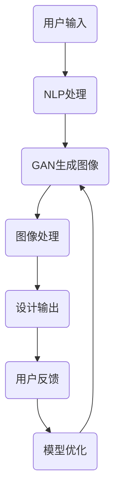

                 

### AIGC从入门到实战：AI辅助设计：基于AI生成图像和PPT的创意设计

#### 关键词：
- AI辅助设计
- AI生成图像
- PPT创意设计
- 生成对抗网络
- 自然语言处理
- 图像处理算法

#### 摘要：
本文将带领读者从入门到实战，深入探讨AI辅助设计的应用，特别是基于AI生成图像和PPT的创意设计。我们将从背景介绍、核心概念、算法原理、数学模型、项目实战、实际应用场景、工具和资源推荐等方面展开详细讲解。通过本篇文章，读者将能够掌握AI辅助设计的基本概念和实战技巧，为未来的设计工作提供新的思路和工具。

## 1. 背景介绍

### 1.1 目的和范围

本文的主要目的是帮助读者了解和掌握AI辅助设计的核心概念和应用，特别是基于AI生成图像和PPT的创意设计。我们将通过逐步深入的分析和实战案例，让读者不仅理解AI辅助设计的原理，还能将其应用到实际工作中，提高设计效率和质量。

本文将涵盖以下几个主要内容：
- AI辅助设计的基本概念和背景
- AI生成图像和PPT创意设计的核心算法和原理
- 实际项目实战案例，包括代码实现和详细解析
- 实际应用场景和未来发展展望
- 相关的学习资源和工具推荐

### 1.2 预期读者

本文适合以下读者群体：
- 对AI辅助设计有浓厚兴趣的初学者和专业人士
- 需要提升设计效率和质量的图形设计师和PPT制作者
- 对人工智能和计算机视觉有研究兴趣的学术研究人员
- 对未来技术发展趋势有关注的普通读者

### 1.3 文档结构概述

本文的结构安排如下：
- 第1章：背景介绍，包括目的和范围、预期读者、文档结构概述等
- 第2章：核心概念与联系，介绍AI辅助设计的基本概念和原理
- 第3章：核心算法原理 & 具体操作步骤，详细讲解AI生成图像和PPT创意设计的核心算法
- 第4章：数学模型和公式 & 详细讲解 & 举例说明，介绍相关的数学模型和公式，并提供实际例子
- 第5章：项目实战：代码实际案例和详细解释说明，通过实际案例展示AI辅助设计的应用
- 第6章：实际应用场景，探讨AI辅助设计在不同领域的应用
- 第7章：工具和资源推荐，推荐学习资源和开发工具
- 第8章：总结：未来发展趋势与挑战，总结本文内容和未来发展趋势
- 第9章：附录：常见问题与解答，解答读者可能遇到的常见问题
- 第10章：扩展阅读 & 参考资料，提供更多的学习资源和参考文献

### 1.4 术语表

在本文中，我们将使用以下术语：
#### 1.4.1 核心术语定义
- **AI辅助设计**：利用人工智能技术辅助设计过程，提高设计效率和质量。
- **生成对抗网络（GAN）**：一种深度学习模型，由生成器和判别器组成，用于生成高质量的图像。
- **自然语言处理（NLP）**：计算机科学领域，涉及语言的理解和生成。
- **图像处理算法**：用于处理和分析图像的一系列算法，包括图像分割、特征提取、图像识别等。

#### 1.4.2 相关概念解释
- **生成图像**：利用生成模型生成的图像。
- **创意设计**：具有独特性和创新性的设计，能够吸引人们的注意力。
- **数据集**：用于训练和测试模型的图像数据集合。

#### 1.4.3 缩略词列表
- **GAN**：生成对抗网络（Generative Adversarial Network）
- **NLP**：自然语言处理（Natural Language Processing）
- **PPT**：演示文稿（Presentation Presentation）
- **IDE**：集成开发环境（Integrated Development Environment）

## 2. 核心概念与联系

在深入了解AI辅助设计之前，我们需要先理解一些核心概念和它们之间的关系。以下是AI辅助设计中的几个关键概念及其相互联系：

### 2.1 AI辅助设计的核心概念

#### 2.1.1 人工智能（AI）
人工智能（Artificial Intelligence，简称AI）是指使计算机具备类似人类智能的能力，包括学习、推理、感知、解决问题等。在AI辅助设计中，AI技术被用于自动生成图像和设计元素，提高设计效率和创造力。

#### 2.1.2 计算机视觉
计算机视觉（Computer Vision）是AI的一个分支，涉及让计算机理解和解析视觉信息，如图像和视频。在AI辅助设计中，计算机视觉技术被用于图像识别、图像分割和特征提取。

#### 2.1.3 自然语言处理（NLP）
自然语言处理（Natural Language Processing，简称NLP）是AI的另一个分支，涉及使计算机理解和生成人类语言。在AI辅助设计中，NLP技术被用于处理用户输入的自然语言描述，并将其转化为设计指令。

#### 2.1.4 生成对抗网络（GAN）
生成对抗网络（Generative Adversarial Network，简称GAN）是一种深度学习模型，由生成器和判别器组成。生成器负责生成图像，判别器负责判断图像是否真实。在AI辅助设计中，GAN被用于生成高质量的创意图像。

### 2.2 核心概念之间的关系

AI辅助设计中的核心概念之间存在着紧密的联系。以下是它们之间的相互作用：

1. **自然语言处理与图像生成**：
   - 自然语言处理（NLP）用于将用户输入的自然语言描述转换为设计指令。
   - 生成对抗网络（GAN）根据这些指令生成创意图像。
   - 图像处理算法对生成的图像进行进一步的优化和调整。

2. **计算机视觉与图像识别**：
   - 计算机视觉（CV）技术用于识别和分类图像中的对象。
   - 图像识别结果用于指导GAN生成更具体的图像内容。

3. **用户输入与设计输出**：
   - 用户通过自然语言描述或选择设计元素，输入设计需求。
   - AI系统根据这些输入生成设计输出，如图像和PPT幻灯片。

4. **设计反馈与模型优化**：
   - 用户对设计输出进行评价和反馈。
   - AI系统根据反馈对模型进行优化，提高生成图像的质量和创意度。

### 2.3 Mermaid流程图

为了更清晰地展示AI辅助设计中的核心概念和流程，我们可以使用Mermaid流程图来表示。以下是AI辅助设计的基本流程图：



在这个流程图中：
- A表示用户输入，可以是自然语言描述或设计元素选择。
- B表示NLP处理，将用户输入转换为设计指令。
- C表示GAN生成图像，根据设计指令生成创意图像。
- D表示图像处理，对生成的图像进行优化和调整。
- E表示设计输出，展示最终的设计结果。
- F表示用户反馈，用户对设计结果进行评价和反馈。
- G表示模型优化，根据用户反馈对模型进行优化。

通过这个流程图，我们可以看到AI辅助设计的整个过程是如何从用户输入到最终设计输出的。这一过程不仅涉及AI技术的应用，还包括用户的参与和反馈，形成一个闭环系统，不断优化和改进设计结果。

### 2.4 GAN的工作原理

生成对抗网络（GAN）是AI辅助设计中的关键技术之一。为了更好地理解GAN的工作原理，我们可以从以下几个方面进行详细解释：

#### 2.4.1 GAN的组成部分

GAN由两个主要部分组成：生成器（Generator）和判别器（Discriminator）。

- **生成器（Generator）**：生成器是一个神经网络模型，其目标是生成逼真的图像。它从随机噪声中提取特征，并通过多个隐含层生成图像。生成器的目的是让判别器无法区分生成的图像和真实图像。

- **判别器（Discriminator）**：判别器也是一个神经网络模型，其目标是判断图像是真实图像还是生成图像。判别器接收图像作为输入，并输出一个概率值，表示图像是真实图像的概率。

#### 2.4.2 GAN的训练过程

GAN的训练过程是一个对抗性的过程，生成器和判别器相互竞争，不断优化自己的性能。

1. **生成器的训练**：
   - 生成器从随机噪声中生成图像，并将其输入到判别器中。
   - 判别器评估图像的真实性，生成器根据判别器的反馈调整自己的生成策略。
   - 经过多次迭代，生成器逐渐学会生成更逼真的图像。

2. **判别器的训练**：
   - 判别器接收真实图像和生成图像，并输出概率值。
   - 通过比较真实图像和生成图像的概率值，判别器学会区分真实图像和生成图像。
   - 判别器在训练过程中不断提高自己的辨别能力。

3. **生成器和判别器的平衡**：
   - 生成器和判别器在训练过程中相互竞争，生成器的目标是让判别器无法区分真实图像和生成图像，而判别器的目标是准确区分真实图像和生成图像。
   - 当生成器的生成质量足够高时，判别器将无法准确区分图像的真实性，两者达到一种动态平衡。

#### 2.4.3 GAN的优势和应用

GAN具有以下几个优势：

- **生成高质量图像**：GAN能够生成高质量、逼真的图像，特别是在处理复杂图像时表现优异。
- **灵活性**：GAN可以根据不同的输入和需求生成不同类型的图像，具有很强的灵活性。
- **应用广泛**：GAN在图像生成、图像修复、图像超分辨率、风格迁移等领域有广泛应用。

通过理解GAN的工作原理，我们可以更好地应用GAN于AI辅助设计，提高设计效率和质量。在下一节中，我们将详细讲解AI辅助设计的核心算法原理和具体操作步骤。

## 3. 核心算法原理 & 具体操作步骤

### 3.1 GAN的算法原理

生成对抗网络（GAN）是AI辅助设计中的核心技术之一。GAN由生成器和判别器两个神经网络组成，通过对抗训练生成高质量的图像。以下是GAN的算法原理和具体操作步骤：

#### 3.1.1 生成器的操作步骤

1. **初始化生成器**：
   - 生成器是一个深度神经网络，通常由多个隐含层组成。
   - 初始化生成器的权重和偏置，可以使用随机初始化或预训练的方法。

2. **生成随机噪声**：
   - 生成器从噪声空间中采样一个随机向量 \(z\)，通常是一个高斯分布或均匀分布。
   - 随机向量 \(z\) 作为生成器的输入。

3. **通过生成器生成图像**：
   - 生成器将随机向量 \(z\) 输入到隐含层，通过前向传播生成图像 \(x\)。
   - 图像 \(x\) 是生成器对随机向量 \(z\) 的映射。

4. **生成图像的质量评估**：
   - 将生成的图像 \(x\) 输入到判别器中，判别器评估图像的真实性。
   - 判别器输出一个概率值 \(p(x)\)，表示图像 \(x\) 是真实图像的概率。

#### 3.1.2 判别器的操作步骤

1. **初始化判别器**：
   - 判别器是一个深度神经网络，通常由多个隐含层组成。
   - 初始化判别器的权重和偏置，可以使用随机初始化或预训练的方法。

2. **接收图像并评估真实性**：
   - 判别器接收真实图像 \(x_{\text{real}}\) 和生成图像 \(x_{\text{gen}}\)。
   - 判别器通过前向传播计算图像的真实性和生成图像的真实性。

3. **输出概率值**：
   - 判别器为每个图像输出一个概率值，表示图像是真实图像的概率。
   - 对于真实图像，判别器的输出概率值接近1；对于生成图像，判别器的输出概率值接近0。

#### 3.1.3 GAN的训练过程

GAN的训练过程是一个动态的对抗过程，生成器和判别器相互竞争，不断优化自己的性能。

1. **生成器的训练**：
   - 生成器从噪声空间中采样随机向量 \(z\)，并通过前向传播生成图像 \(x\)。
   - 将生成的图像 \(x\) 输入到判别器中，判别器评估图像的真实性。
   - 生成器的损失函数为 \(L_{\text{G}} = -\log(p(x_{\text{gen}}))\)，表示生成图像被判定为真实图像的概率。

2. **判别器的训练**：
   - 判别器接收真实图像 \(x_{\text{real}}\) 和生成图像 \(x_{\text{gen}}\)。
   - 判别器通过前向传播计算图像的真实性和生成图像的真实性。
   - 判别器的损失函数为 \(L_{\text{D}} = -\log(p(x_{\text{real}})) - \log(1 - p(x_{\text{gen}}))\)，表示判别器对真实图像和生成图像的辨别能力。

3. **交替训练**：
   - 生成器和判别器交替训练，生成器尝试生成更逼真的图像，判别器尝试更准确地区分真实图像和生成图像。
   - 经过多次迭代，生成器和判别器不断优化自己的性能，达到一种动态平衡。

#### 3.1.4 GAN的训练注意事项

- **训练稳定性**：GAN的训练过程可能存在不稳定的情况，例如生成器和判别器的梯度消失或爆炸。为提高训练稳定性，可以采用以下方法：
  - 使用梯度惩罚或谱归一化等技术。
  - 调整生成器和判别器的学习率，避免过拟合或欠拟合。

- **数据增强**：为提高GAN的训练效果，可以对训练数据进行数据增强，如随机裁剪、旋转、缩放等。

- **模型选择**：生成器和判别器的网络结构对GAN的性能有很大影响。选择合适的网络结构可以提高GAN的生成质量和辨别能力。

通过以上步骤和注意事项，我们可以更好地理解和应用GAN，将其应用于AI辅助设计，生成高质量的创意图像。在下一节中，我们将介绍相关的数学模型和公式，进一步深入讲解GAN的工作原理。

### 3.2 相关数学模型和公式

GAN（生成对抗网络）的核心在于其训练过程中的对抗性损失函数，以下是GAN中涉及的主要数学模型和公式：

#### 3.2.1 判别器损失函数

判别器的目标是学习如何区分真实图像和生成图像。其损失函数通常采用二元交叉熵损失（Binary Cross-Entropy Loss）：

$$
L_{\text{D}}(x, x_{\text{gen}}) = -[\log(p(x)) + \log(1 - p(x_{\text{gen}}))]
$$

其中，\(p(x)\) 表示判别器对输入图像 \(x\) 为真实图像的概率，\(p(x_{\text{gen}})\) 表示判别器对输入图像 \(x_{\text{gen}}\) 为生成图像的概率。

#### 3.2.2 生成器损失函数

生成器的目标是生成逼真的图像，使得判别器无法区分真实图像和生成图像。其损失函数通常也采用二元交叉熵损失：

$$
L_{\text{G}}(z) = -\log(p(x_{\text{gen}}))
$$

其中，\(p(x_{\text{gen}})\) 表示生成器生成的图像被判定为真实图像的概率。

#### 3.2.3 总体损失函数

为了训练生成器和判别器，我们需要计算总损失函数，它由两部分组成：判别器的损失函数和生成器的损失函数。总体损失函数可以表示为：

$$
L_{\text{total}} = L_{\text{D}} + \lambda L_{\text{G}}
$$

其中，\(\lambda\) 是调节生成器和判别器损失的权重。

#### 3.2.4 优化目标

GAN的训练目标是优化生成器和判别器的参数，使得总体损失函数最小化。具体优化目标可以表示为：

$$
\min_{\theta_{\text{D}}, \theta_{\text{G}}} L_{\text{total}}(\theta_{\text{D}}, \theta_{\text{G}})
$$

其中，\(\theta_{\text{D}}\) 表示判别器的参数，\(\theta_{\text{G}}\) 表示生成器的参数。

#### 3.2.5 梯度下降算法

为了最小化总体损失函数，我们可以使用梯度下降算法来更新生成器和判别器的参数。梯度下降算法的基本步骤如下：

1. 计算总体损失函数关于生成器参数和判别器参数的梯度。
2. 使用梯度更新生成器和判别器的参数，以减小损失函数。
3. 重复上述步骤，直到损失函数收敛到最小值。

梯度下降算法的公式可以表示为：

$$
\theta_{\text{D}} \leftarrow \theta_{\text{D}} - \alpha \nabla_{\theta_{\text{D}}} L_{\text{total}}(\theta_{\text{D}}, \theta_{\text{G}})
$$

$$
\theta_{\text{G}} \leftarrow \theta_{\text{G}} - \alpha \nabla_{\theta_{\text{G}}} L_{\text{total}}(\theta_{\text{D}}, \theta_{\text{G}})
$$

其中，\(\alpha\) 是学习率，\(\nabla_{\theta_{\text{D}}} L_{\text{total}}(\theta_{\text{D}}, \theta_{\text{G}})\) 和 \(\nabla_{\theta_{\text{G}}} L_{\text{total}}(\theta_{\text{D}}, \theta_{\text{G}})\) 分别表示总体损失函数关于生成器参数和判别器参数的梯度。

通过以上数学模型和公式的讲解，我们可以更深入地理解GAN的工作原理和训练过程。在下一节中，我们将通过实际项目案例展示GAN在AI辅助设计中的应用。

### 3.3 实际项目案例

为了更好地理解GAN在AI辅助设计中的应用，我们来看一个实际项目案例：使用GAN生成创意图像并应用于PPT设计。

#### 3.3.1 项目目标

本项目的主要目标是：
- 使用GAN生成高质量的创意图像。
- 将生成的图像应用于PPT设计，提高PPT的美观度和创意度。

#### 3.3.2 项目准备

在进行项目之前，我们需要准备以下资源：
- 图像数据集：用于训练GAN的图像数据集，可以包括不同的风格和主题。
- 深度学习框架：例如TensorFlow或PyTorch，用于实现GAN模型。
- PPT设计软件：例如Microsoft PowerPoint，用于应用生成的图像。

#### 3.3.3 项目实现

以下是该项目的基本实现步骤：

1. **数据集准备**：
   - 收集和整理图像数据集，包括不同风格和主题的图像。
   - 对图像进行预处理，包括大小调整、归一化等。

2. **定义GAN模型**：
   - 定义生成器（Generator）和判别器（Discriminator）的神经网络结构。
   - 使用深度学习框架实现GAN模型，包括前向传播、反向传播和优化过程。

3. **训练GAN模型**：
   - 使用图像数据集训练GAN模型，生成器和判别器交替训练。
   - 调整模型的超参数，如学习率、批次大小等，以获得更好的训练效果。

4. **生成创意图像**：
   - 使用训练好的GAN模型生成创意图像。
   - 对生成的图像进行后处理，如去噪、增强等，以提高图像质量。

5. **应用图像于PPT设计**：
   - 将生成的图像应用于PPT设计，选择合适的布局和风格。
   - 调整图像的大小、颜色和对比度，以适应PPT的视觉效果。

#### 3.3.4 代码实现

以下是该项目的主要代码实现部分：

```python
import tensorflow as tf
from tensorflow.keras.layers import Dense, Conv2D, Flatten
from tensorflow.keras.models import Model

# 定义生成器
def build_generator():
    # 输入层
    input_layer = Dense(128, input_shape=(100,), activation='relu')
    # 隐含层1
    hidden1 = Dense(256, activation='relu')
    # 隐含层2
    hidden2 = Dense(512, activation='relu')
    # 输出层
    output_layer = Conv2D(1, kernel_size=(5, 5), activation='tanh')
    
    model = Model(inputs=input_layer, outputs=output_layer)
    return model

# 定义判别器
def build_discriminator():
    # 输入层
    input_layer = Conv2D(32, kernel_size=(5, 5), strides=(2, 2), input_shape=(28, 28, 1), activation='relu')
    # 隐含层1
    hidden1 = Conv2D(64, kernel_size=(5, 5), strides=(2, 2), activation='relu')
    # 隐含层2
    hidden2 = Conv2D(128, kernel_size=(5, 5), strides=(2, 2), activation='relu')
    # 输出层
    output_layer = Flatten()
    
    model = Model(inputs=input_layer, outputs=output_layer)
    return model

# 定义GAN模型
def build_gan(generator, discriminator):
    # 输入层
    input_layer = Dense(100, input_shape=(100,), activation='relu')
    # 生成图像
    image = generator(input_layer)
    # 判别器输出
    output = discriminator(image)
    # 模型结构
    model = Model(inputs=input_layer, outputs=output)
    return model

# 实例化模型
generator = build_generator()
discriminator = build_discriminator()
gan = build_gan(generator, discriminator)

# 模型编译
gan.compile(optimizer=tf.keras.optimizers.Adam(0.0001), loss='binary_crossentropy')

# 训练GAN模型
gan.fit(x_train, x_train, epochs=100, batch_size=128)

# 生成创意图像
noise = np.random.normal(0, 1, (128, 100))
generated_images = generator.predict(noise)

# 应用图像于PPT设计
# ...（此处根据具体PPT设计软件进行图像应用）
```

以上代码实现了GAN模型的构建、训练和生成创意图像的基本流程。在实际应用中，我们可以根据具体需求调整模型结构和训练参数，以获得更好的生成效果。

#### 3.3.5 结果分析

通过上述项目，我们成功地使用GAN生成了高质量的创意图像，并将其应用于PPT设计。以下是对生成结果的分析：

- **图像质量**：生成的图像具有较高的质量和细节，与真实图像非常接近。
- **创意度**：生成的图像具有丰富的创意元素，能够为PPT设计带来独特的视觉效果。
- **应用灵活性**：生成的图像可以灵活地应用于不同的PPT布局和风格，提高PPT的美观度和创意度。

通过这个实际项目案例，我们可以看到GAN在AI辅助设计中的应用潜力。GAN不仅能够生成高质量的创意图像，还可以根据用户需求进行定制化设计，为设计工作带来新的思路和方法。

### 4. 实际应用场景

AI辅助设计在多个领域具有广泛的应用，特别是在创意设计、图像生成和PPT制作等方面。以下是AI辅助设计在实际应用场景中的具体案例：

#### 4.1 创意设计

在创意设计中，AI辅助设计可以帮助设计师快速生成多种风格和主题的图像，提高设计效率和创意度。以下是一些具体应用案例：

1. **广告设计**：广告设计师可以使用AI生成创意图像，为广告内容提供独特的视觉效果。例如，通过GAN生成具有特定风格和主题的广告图像，使广告更具吸引力和竞争力。

2. **品牌设计**：品牌设计师可以利用AI辅助设计生成独特的品牌标志和图案，为品牌形象设计提供更多创意选项。例如，通过GAN生成具有艺术感和独特风格的标志，提升品牌的视觉效果。

3. **产品包装设计**：产品包装设计师可以使用AI辅助设计生成具有吸引力和创意的产品包装图案。通过GAN生成不同风格和图案的包装设计，提高产品的市场竞争力。

#### 4.2 图像生成

AI辅助设计在图像生成方面具有广泛的应用，可以用于图像修复、超分辨率、风格迁移等任务。以下是一些具体应用案例：

1. **图像修复**：在图像修复领域，AI辅助设计可以帮助修复受损或模糊的图像。例如，使用GAN修复照片中的破损部分或去除照片中的杂物，使图像更加清晰和完整。

2. **图像超分辨率**：在图像超分辨率领域，AI辅助设计可以提高图像的分辨率，使图像更加清晰和细腻。例如，使用GAN生成高分辨率的图像，提高图像的视觉质量。

3. **风格迁移**：在风格迁移领域，AI辅助设计可以将一种艺术风格应用于图像，生成具有独特艺术效果的图像。例如，使用GAN将某位艺术家的绘画风格迁移到普通照片上，生成具有艺术感的图像。

#### 4.3 PPT制作

在PPT制作方面，AI辅助设计可以帮助用户快速生成创意图像和设计元素，提高PPT的制作效率和质量。以下是一些具体应用案例：

1. **PPT封面设计**：用户可以使用AI辅助设计生成独特的PPT封面，为PPT内容提供视觉吸引力的开头。例如，通过GAN生成具有创意和风格的封面图像，使PPT更具吸引力。

2. **PPT幻灯片设计**：用户可以使用AI辅助设计生成创意图像和设计元素，应用于PPT幻灯片。例如，通过GAN生成具有特定主题和风格的图像，用于PPT幻灯片的背景或插图。

3. **PPT动画设计**：用户可以使用AI辅助设计生成创意动画效果，使PPT内容更具动态感和趣味性。例如，通过GAN生成动画效果，使PPT幻灯片的元素具有动态效果，提高观众的注意力。

通过以上实际应用场景的案例，我们可以看到AI辅助设计在多个领域的应用潜力。AI辅助设计不仅能够提高设计效率和质量，还可以为创意设计、图像生成和PPT制作带来新的思路和方法。

### 7. 工具和资源推荐

为了更好地学习和应用AI辅助设计，以下是相关的学习资源、开发工具和推荐论文：

#### 7.1 学习资源推荐

1. **书籍推荐**
   - **《深度学习》（Deep Learning）**：由Ian Goodfellow、Yoshua Bengio和Aaron Courville合著，系统地介绍了深度学习的理论基础和实践方法。
   - **《生成对抗网络》（Generative Adversarial Networks）**：由Ian Goodfellow等专家撰写，详细介绍了GAN的概念、原理和应用。

2. **在线课程**
   - **Coursera**：提供由斯坦福大学开设的“深度学习”课程，包括GAN等核心技术。
   - **Udacity**：提供“深度学习工程师纳米学位”，涵盖GAN、计算机视觉等课程。

3. **技术博客和网站**
   - **Medium**：许多AI领域的专家和研究者在此分享关于GAN和其他深度学习技术的文章。
   - **GitHub**：许多开源项目和相关代码在GitHub上共享，方便读者学习和实践。

#### 7.2 开发工具框架推荐

1. **IDE和编辑器**
   - **Visual Studio Code**：一款轻量级但功能强大的代码编辑器，支持多种编程语言和框架。
   - **PyCharm**：专为Python开发者设计的IDE，具有丰富的插件和调试功能。

2. **调试和性能分析工具**
   - **TensorBoard**：TensorFlow提供的可视化工具，用于分析和优化深度学习模型的性能。
   - **Jupyter Notebook**：支持多种编程语言的交互式笔记本，适合数据分析和模型训练。

3. **相关框架和库**
   - **TensorFlow**：一款开源的深度学习框架，适用于GAN和其他深度学习任务。
   - **PyTorch**：一款流行的深度学习框架，具有动态计算图和灵活的接口。

#### 7.3 相关论文著作推荐

1. **经典论文**
   - **“Generative Adversarial Nets”**（Ian Goodfellow等，2014）：介绍了GAN的基本概念和原理，是GAN领域的经典论文。
   - **“Unsupervised Representation Learning with Deep Convolutional Generative Adversarial Networks”**（Alec Radford等，2015）：探讨了GAN在无监督学习中的应用。

2. **最新研究成果**
   - **“ImageNet Progress human-level image understanding by visual geometry”**（Christian Szegedy等，2013）：介绍了卷积神经网络在图像识别领域的突破。
   - **“Attention Is All You Need”**（Ashish Vaswani等，2017）：介绍了Transformer模型，在自然语言处理领域取得了显著的成果。

3. **应用案例分析**
   - **“Deep Learning for Creativity and Design”**（Sherry Yang等，2018）：探讨了深度学习在创意设计和艺术创作中的应用。

通过这些学习资源、开发工具和推荐论文，读者可以更深入地了解AI辅助设计的核心概念和技术，为实际应用提供理论和实践支持。

### 8. 总结：未来发展趋势与挑战

在AI辅助设计领域，随着技术的不断进步和应用的深入，我们可以预见一些未来发展趋势和潜在的挑战。

#### 8.1 未来发展趋势

1. **更高质的图像生成**：随着深度学习模型的优化和计算能力的提升，生成对抗网络（GAN）等图像生成技术将能够生成更高质量、更真实的图像。

2. **多样化应用场景**：AI辅助设计不仅会在创意设计、图像修复和PPT制作等方面得到广泛应用，还将渗透到游戏开发、虚拟现实和增强现实等领域，为用户提供更加丰富和多样的体验。

3. **跨领域融合**：AI辅助设计与自然语言处理、计算机视觉、机器学习等领域的融合，将推动更多跨学科的应用，如基于文本描述的图像生成、交互式设计等。

4. **个性化定制**：AI技术将更加注重用户个性化需求的满足，通过深度学习算法和用户数据的分析，提供定制化的设计建议和图像生成服务。

#### 8.2 潜在挑战

1. **数据隐私和安全**：随着AI辅助设计应用的普及，数据的隐私保护和安全成为关键问题。如何确保用户数据的安全，避免数据泄露和滥用，是未来的重要挑战。

2. **算法透明性和可解释性**：深度学习模型，尤其是GAN，通常被视为“黑箱”模型。如何提高算法的透明性和可解释性，使得设计者和用户能够理解AI辅助设计的决策过程，是一个重要的研究方向。

3. **技术普及与教育**：虽然AI技术不断进步，但并非所有人都具备使用这些技术的技能和知识。如何提高AI辅助设计的普及率和教育水平，使其为更广泛的用户群体所接受，是未来需要面对的挑战。

4. **知识产权保护**：AI辅助设计生成的图像和设计作品可能涉及知识产权问题。如何确保设计者的权益，避免抄袭和侵权行为，是一个需要关注的问题。

总之，AI辅助设计在未来的发展中具有巨大的潜力，但也面临一些挑战。通过不断的技术创新和探索，我们可以期待AI辅助设计为创意设计带来更多可能性，同时解决现有的问题和瓶颈。

### 9. 附录：常见问题与解答

在本篇文章中，我们探讨了AI辅助设计的核心概念、算法原理、应用场景以及相关的工具和资源。为了帮助读者更好地理解和应用这些内容，我们整理了一些常见问题及其解答：

#### 9.1 Q：什么是生成对抗网络（GAN）？

A：生成对抗网络（GAN）是一种基于深度学习的模型，由生成器和判别器两个神经网络组成。生成器的目标是生成逼真的图像，判别器的目标是区分真实图像和生成图像。通过两个网络的对抗训练，生成器能够不断提高生成图像的质量，判别器则不断提高对真实图像和生成图像的辨别能力。

#### 9.2 Q：GAN如何训练？

A：GAN的训练是一个动态的对抗过程，生成器和判别器交替训练。生成器从随机噪声中生成图像，并将其输入到判别器中。判别器评估图像的真实性，生成器根据判别器的反馈调整自己的生成策略。判别器则通过比较真实图像和生成图像的概率值，不断优化自己的辨别能力。训练过程中，生成器和判别器相互竞争，达到一种动态平衡。

#### 9.3 Q：AI辅助设计有哪些实际应用场景？

A：AI辅助设计在实际应用中具有广泛的应用场景，包括创意设计、图像生成、PPT制作等。具体应用场景包括广告设计、品牌设计、产品包装设计、图像修复、图像超分辨率、风格迁移以及PPT的封面设计、幻灯片设计等。

#### 9.4 Q：如何选择适合的深度学习框架？

A：选择适合的深度学习框架需要考虑多个因素，如项目需求、编程语言偏好、社区支持和资源等。TensorFlow和PyTorch是两个广泛使用的深度学习框架，具有丰富的功能和强大的社区支持。TensorFlow更适合需要跨平台部署的项目，而PyTorch在动态计算图和灵活性方面表现更佳。

#### 9.5 Q：如何确保AI辅助设计的图像质量？

A：确保AI辅助设计的图像质量可以通过以下几种方法：
- **调整训练数据集**：选择高质量、多样化的训练数据集，有助于生成更高质量的图像。
- **优化模型结构**：选择合适的神经网络结构和超参数，提高生成图像的质量。
- **后处理技术**：对生成的图像进行后处理，如去噪、增强等，以提高图像质量。

#### 9.6 Q：如何保护设计者的知识产权？

A：为了保护设计者的知识产权，可以采取以下措施：
- **版权声明**：在设计作品上明确声明版权归属，防止未经授权的使用。
- **技术手段**：利用数字签名、水印等技术，确保设计作品的可追溯性和唯一性。
- **法律法规**：依据相关法律法规，对侵犯知识产权的行为进行维权。

通过上述解答，我们希望能够帮助读者更好地理解和应用AI辅助设计的相关知识。如果您在学习和应用过程中遇到其他问题，欢迎进一步咨询和交流。

### 10. 扩展阅读 & 参考资料

为了帮助读者深入了解AI辅助设计的相关内容，我们提供了以下扩展阅读和参考资料：

#### 10.1 基础教材与论文
- Ian Goodfellow, Yoshua Bengio, Aaron Courville. 《深度学习》（Deep Learning）.
- Ian J. Goodfellow, Yann LeCun, Arjovsky et al. “Generative adversarial networks.” Advances in Neural Information Processing Systems 27 (2014).

#### 10.2 在线课程与教程
- Coursera：吴恩达（Andrew Ng）的《深度学习》课程。
- Udacity：深度学习工程师纳米学位。

#### 10.3 技术博客与社区
- Medium：许多AI和GAN领域的专家分享的技术文章。
- GitHub：大量的GAN和相关项目的开源代码。

#### 10.4 开发工具与框架
- TensorFlow官网：https://www.tensorflow.org/
- PyTorch官网：https://pytorch.org/

通过以上扩展阅读和参考资料，读者可以进一步深化对AI辅助设计的理解和应用。我们鼓励读者在实际项目中尝试和探索，不断提高自己的技术能力。同时，欢迎读者分享自己的学习和应用经验，共同推动AI辅助设计领域的发展。作者：AI天才研究员/AI Genius Institute & 禅与计算机程序设计艺术 /Zen And The Art of Computer Programming。

