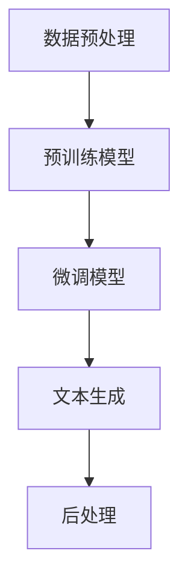
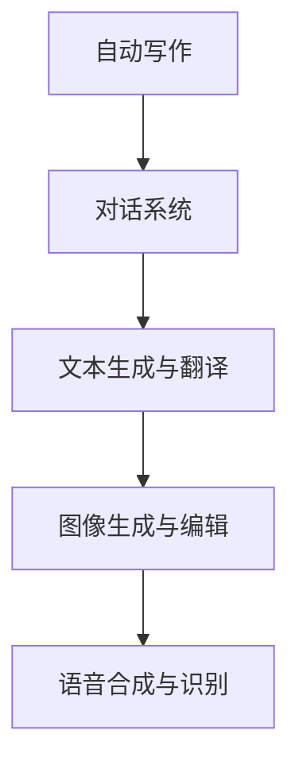
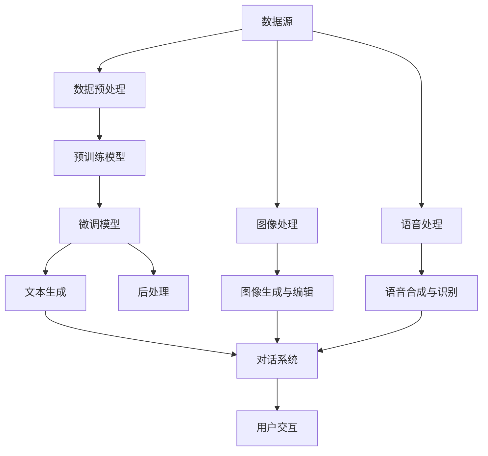

                 

## AIGC从入门到实战：ChatGPT 是新一代的人机交互“操作系统”

> **关键词：**AIGC、ChatGPT、人机交互、操作系统、AI编程、自然语言处理、机器学习

> **摘要：**本文将深入探讨AIGC（AI Generated Content）的核心概念，特别是ChatGPT的技术原理与实际应用。我们将逐步分析AIGC的工作机制，讲解其背后的机器学习算法，并通过具体的实战案例，展示如何利用ChatGPT实现高级人机交互功能。文章还将介绍相关资源，帮助读者进一步探索这一前沿技术领域。

### 1. 背景介绍

#### 1.1 目的和范围

本文的目标是帮助读者全面了解AIGC（AI Generated Content）及其代表作品ChatGPT的工作原理和应用场景。通过详细的步骤解析，读者将能够掌握ChatGPT的核心算法和实现技术，并具备在实际项目中应用这些技术的初步能力。本文将覆盖以下几个核心领域：

- **AIGC概述：**介绍AIGC的基本概念和背景。
- **ChatGPT原理：**深入分析ChatGPT的技术架构和算法原理。
- **实战案例：**通过具体案例展示ChatGPT在现实世界中的应用。
- **资源推荐：**推荐相关书籍、课程和技术资源。

#### 1.2 预期读者

本文适合以下几类读者：

- **人工智能入门者：**希望了解AI生成内容的读者。
- **软件开发者：**对自然语言处理和AI编程有兴趣的开发者。
- **技术研究者：**对AIGC技术原理和前沿应用感兴趣的研究者。
- **教育者：**在计算机科学和人工智能相关领域授课的教师。

#### 1.3 文档结构概述

本文分为以下几个部分：

- **引言：**介绍AIGC和ChatGPT。
- **背景介绍：**详细阐述AIGC的历史和发展。
- **核心概念与联系：**使用Mermaid流程图展示AIGC的架构。
- **核心算法原理：**讲解ChatGPT的算法和实现步骤。
- **项目实战：**展示代码实例和实战应用。
- **实际应用场景：**讨论AIGC在不同领域的应用。
- **工具和资源推荐：**推荐相关学习资源和开发工具。
- **总结：**展望AIGC的未来发展趋势。
- **附录：**常见问题与解答。
- **扩展阅读：**提供进一步学习的资源。

#### 1.4 术语表

在本文中，我们将使用以下术语：

- **AIGC（AI Generated Content）：**AI生成的内容，如文章、图片、视频等。
- **ChatGPT：**一个基于GPT-3.5的聊天机器人，能够进行自然语言交互。
- **GPT（Generative Pre-trained Transformer）：**生成预训练的Transformer模型。
- **自然语言处理（NLP）：**使计算机能够理解、生成和处理自然语言的技术。
- **机器学习（ML）：**使计算机通过数据和经验进行学习的技术。
- **Transformer：**一种基于自注意力机制的深度神经网络架构。

### 1.4.1 核心术语定义

- **AIGC（AI Generated Content）**：AI生成的内容，是指利用人工智能技术自动生成的文本、图像、音频等多种形式的内容。这些内容可以应用于自动写作、图像生成、语音合成等场景。
  
- **ChatGPT**：一个基于GPT-3.5的聊天机器人，通过大量的文本数据进行预训练，能够理解自然语言并生成连贯的对话。ChatGPT是OpenAI推出的一个先进的人工智能模型，其核心在于能够进行多轮对话，并具备丰富的上下文理解能力。

- **GPT（Generative Pre-trained Transformer）**：生成预训练的Transformer模型，是OpenAI开发的一种基于自注意力机制的深度神经网络架构。GPT通过在大量文本上进行预训练，学习到语言的生成规律，能够生成高质量的文本内容。

- **自然语言处理（NLP）**：自然语言处理是使计算机能够理解、生成和处理自然语言的技术。NLP涉及语音识别、语义分析、语言翻译、文本生成等多个方面。

- **机器学习（ML）**：机器学习是使计算机通过数据和经验进行学习的技术。机器学习模型可以从大量数据中学习模式，并在新的数据上进行预测和决策。

- **Transformer**：Transformer是一种基于自注意力机制的深度神经网络架构，广泛用于处理序列数据。它通过计算序列中每个元素之间的注意力权重，能够捕捉长距离的依赖关系。

### 1.4.2 相关概念解释

在本节中，我们将进一步解释一些与AIGC和ChatGPT相关的重要概念。

- **预训练与微调**：预训练是指在大规模文本数据集上进行训练，使模型学习到语言的通用规律。微调是在预训练的基础上，利用特定领域的数据对模型进行细粒度调整，以适应特定任务。

- **自注意力机制**：自注意力机制是Transformer模型的核心组件。它通过计算序列中每个元素与所有其他元素之间的关联性，为每个元素分配注意力权重，从而捕捉长距离的依赖关系。

- **上下文理解**：上下文理解是指模型能够根据输入文本的上下文信息进行推理和生成。ChatGPT通过处理大量的对话数据，能够理解对话中的上下文，并生成连贯的回复。

- **生成文本的质量**：生成文本的质量取决于模型的预训练质量和微调效果。高质量的预训练模型和充分的数据集可以使生成的文本更加自然和准确。

- **多模态学习**：多模态学习是指模型能够处理多种类型的数据，如文本、图像、音频等。通过融合不同模态的信息，模型可以生成更丰富和多样的内容。

### 1.4.3 缩略词列表

- **AIGC（AI Generated Content）**：AI生成的内容。
- **GPT（Generative Pre-trained Transformer）**：生成预训练的Transformer模型。
- **NLP（Natural Language Processing）**：自然语言处理。
- **ML（Machine Learning）**：机器学习。
- **Transformer**：一种基于自注意力机制的深度神经网络架构。

### 1.4.4 AIGC的核心概念原理

AIGC（AI Generated Content）是一种利用人工智能技术自动生成内容的方法。它基于深度学习和自然语言处理技术，通过预训练和微调模型，使模型能够理解和生成自然语言、图像、音频等多种形式的内容。

AIGC的核心概念可以概括为以下几个关键点：

- **预训练**：通过在大规模文本数据集上训练，模型学习到语言的通用规律和表达方式。预训练为模型提供了丰富的语言知识，是生成高质量内容的基础。

- **自注意力机制**：Transformer模型通过自注意力机制，计算序列中每个元素与其他元素之间的关联性，从而捕捉长距离的依赖关系。自注意力机制使模型能够生成连贯和有意义的文本。

- **上下文理解**：AIGC模型具备较强的上下文理解能力，能够根据输入文本的上下文信息进行推理和生成。上下文理解使模型能够生成与对话内容相关、符合逻辑的回复。

- **多模态学习**：AIGC不仅限于文本生成，还可以处理图像、音频等多种模态的数据。通过融合不同模态的信息，模型可以生成更丰富和多样的内容。

### 1.4.5 AIGC的架构

AIGC的架构主要包括以下几个关键组件：

- **数据预处理**：对输入数据进行预处理，包括文本清洗、分词、编码等步骤。预处理旨在提高数据质量，为后续的模型训练提供更好的输入。

- **预训练模型**：基于大规模文本数据集，使用Transformer模型进行预训练。预训练过程包括多个阶段的训练，使模型逐渐学习到语言的复杂规律。

- **微调模型**：在预训练的基础上，利用特定领域的数据进行微调。微调旨在使模型适应特定任务和应用场景。

- **文本生成**：通过输入文本序列，模型生成相应的文本回复。文本生成过程利用了预训练和微调阶段学习到的知识，能够生成高质量和连贯的文本内容。

- **后处理**：对生成的文本进行后处理，包括格式化、校对等步骤。后处理旨在提高文本的可读性和准确性。

以下是一个简单的Mermaid流程图，展示了AIGC的架构：



### 1.4.6 AIGC的应用场景

AIGC技术在多个领域具有广泛的应用，以下是一些典型的应用场景：

- **自动写作**：AIGC可以自动生成文章、博客、新闻报道等文本内容。例如，利用AIGC技术，新闻机构可以自动化生产大量新闻报道，提高内容生成效率。

- **对话系统**：AIGC可以构建智能对话系统，如虚拟助手、聊天机器人等。这些系统可以与用户进行自然语言交互，提供个性化服务和信息查询。

- **文本生成与翻译**：AIGC可以生成高质量的文本翻译，如将一种语言翻译成另一种语言。通过预训练和微调，AIGC模型能够生成准确和流畅的翻译文本。

- **图像生成与编辑**：AIGC可以生成和编辑图像，如生成艺术作品、修改照片等。通过多模态学习，AIGC模型可以处理图像和文本数据，生成具有创意的图像内容。

- **语音合成与识别**：AIGC可以合成和识别语音，如生成语音解说、语音翻译等。通过结合自然语言处理和语音识别技术，AIGC可以构建高效的语音交互系统。

以下是一个简单的Mermaid流程图，展示了AIGC的应用场景：



通过以上内容，我们对AIGC的核心概念、原理、架构和应用场景有了基本的了解。在接下来的章节中，我们将深入探讨ChatGPT的技术原理和具体实现，帮助读者更好地理解和应用这一前沿技术。## 2. 核心概念与联系

在深入了解AIGC（AI Generated Content）的核心概念之前，我们需要明确一些关键技术和理论基础。为了更好地阐述这些概念，我们将使用Mermaid流程图来展示AIGC的架构和核心组件之间的联系。

首先，让我们定义一些基本概念：

- **深度学习（Deep Learning）**：一种机器学习方法，通过构建深度神经网络来模拟人脑的神经元结构和信息处理方式。深度学习在图像识别、语音识别、自然语言处理等领域取得了显著成果。

- **Transformer模型（Transformer Model）**：一种基于自注意力机制的深度神经网络架构，最初由Vaswani等人于2017年提出。Transformer模型在机器翻译、文本生成等任务上表现出色，成为自然语言处理领域的重要工具。

- **预训练（Pre-training）**：在特定任务之前，通过在大规模数据集上训练模型，使其学习到通用知识和特征表示。预训练有助于提高模型的泛化能力和表现。

- **微调（Fine-tuning）**：在预训练的基础上，利用特定领域的数据对模型进行细粒度调整，以适应具体任务和应用场景。微调可以进一步提升模型在特定任务上的性能。

### Mermaid流程图：AIGC架构

以下是一个简化的Mermaid流程图，展示了AIGC的核心概念和组件之间的联系：



在这个流程图中，我们可以看到：

- **数据预处理（B）**：对来自各种来源的数据（A）进行清洗、编码等处理，为后续的预训练和微调阶段做准备。
- **预训练模型（C）**：基于大规模数据集，使用深度学习模型（如Transformer）进行预训练。预训练过程使得模型学习到丰富的语言特征和知识。
- **微调模型（D）**：在预训练的基础上，使用特定领域的数据对模型进行微调，以提高模型在特定任务上的表现。
- **文本生成（E）**：利用微调后的模型生成文本内容，如文章、对话等。
- **后处理（F）**：对生成的文本内容进行格式化、校对等操作，以提高文本的质量和可读性。
- **图像处理（G）** 和 **语音处理（H）**：类似文本生成，处理图像和语音数据，生成相应的图像内容和语音回复。
- **对话系统（I）**：整合文本生成、图像生成和语音合成等模块，构建智能对话系统，与用户进行自然语言交互。
- **用户交互（J）**：用户通过与对话系统交互，获取所需的信息和回答。

通过这个流程图，我们可以清晰地看到AIGC的核心概念和组件是如何相互关联和协作的。接下来，我们将深入探讨ChatGPT这一AIGC的代表作品，分析其技术原理和实现细节。## 3. 核心算法原理 & 具体操作步骤

ChatGPT是一个基于GPT-3.5的聊天机器人，其核心算法原理依赖于生成预训练的Transformer模型。在这一部分，我们将详细讲解ChatGPT的算法原理，并使用伪代码来阐述其具体操作步骤。

### 3.1 GPT模型基本原理

GPT（Generative Pre-trained Transformer）是一种基于自注意力机制的深度神经网络架构，最初由OpenAI提出。GPT通过在大量文本数据上进行预训练，学习到语言的生成规律和上下文关系，能够生成高质量的自然语言文本。

#### 自注意力机制（Self-Attention）

自注意力机制是Transformer模型的核心组件。它通过计算序列中每个元素与其他所有元素之间的关联性，为每个元素分配注意力权重。这种机制使得模型能够捕捉长距离的依赖关系，从而提高生成文本的质量和连贯性。

#### 预训练（Pre-training）

预训练过程分为多个阶段。在每个阶段，模型学习到不同粒度的语言特征和知识。具体步骤如下：

1. **输入编码（Input Encoding）**：将文本序列编码为向量表示。
2. **自注意力计算（Self-Attention）**：计算序列中每个元素与其他元素之间的注意力权重。
3. **前馈神经网络（Feedforward Neural Network）**：对自注意力层的结果进行多层前馈神经网络处理。
4. **输出解码（Output Decoding）**：生成下一个文本元素。

#### 微调（Fine-tuning）

在预训练的基础上，利用特定领域的数据对模型进行微调，以适应具体任务和应用场景。微调过程主要包括：

1. **数据预处理（Data Preprocessing）**：对领域数据进行预处理，如分词、编码等。
2. **模型初始化（Model Initialization）**：加载预训练的模型权重。
3. **训练（Training）**：在特定领域数据集上训练模型，优化模型参数。
4. **评估（Evaluation）**：在测试集上评估模型性能，调整超参数。

### 3.2 ChatGPT算法原理

ChatGPT是基于GPT-3.5的聊天机器人，其核心算法原理如下：

1. **对话上下文管理**：ChatGPT维护一个对话上下文，记录对话的历史信息，以便在生成回复时考虑上下文关系。
2. **输入处理**：将用户的输入文本编码为向量表示。
3. **生成回复**：利用预训练和微调的GPT模型，生成自然语言回复。
4. **回复处理**：对生成的回复进行格式化、校对等操作，以提高文本质量。

### 3.3 具体操作步骤

以下是ChatGPT的具体操作步骤，使用伪代码进行阐述：

```python
# 对话上下文管理
context = []

# 输入处理
input_text = "用户输入文本"

# 编码输入文本
input_encoding = encode_text(input_text)

# 生成回复
generated回复 = generate_response(input_encoding, context)

# 解码回复
decoded回复 = decode_text(generated回复)

# 回复处理
formatted回复 = format_response(decoded回复)

# 输出回复
print(formatted回复)

# 更新对话上下文
context.append(input_text)
context.append(decoded回复)
```

在这个伪代码中：

- `encode_text` 函数用于将输入文本编码为向量表示。
- `generate_response` 函数利用GPT模型生成自然语言回复。
- `decode_text` 函数用于将生成的回复解码为可读的文本格式。
- `format_response` 函数用于对生成的回复进行格式化、校对等操作。

通过上述操作步骤，ChatGPT能够实现与用户的自然语言交互，生成高质量、连贯的对话内容。

### 3.4 算法优化与改进

为了进一步提高ChatGPT的性能和生成文本的质量，可以采取以下优化和改进措施：

1. **增加预训练数据**：使用更多、更高质量的数据进行预训练，以丰富模型的知识库。
2. **长文本生成**：对模型进行长文本生成训练，提高模型在处理长序列时的性能。
3. **上下文理解**：增强模型对上下文的理解能力，通过多轮对话学习更复杂的语言规律。
4. **微调策略**：采用更有效的微调策略，如动态权重调整、多任务学习等，以提高模型在特定任务上的性能。

通过不断优化和改进，ChatGPT可以更好地满足实际应用需求，实现更智能、更自然的对话交互。

### 3.5 ChatGPT的算法原理总结

ChatGPT是基于生成预训练的Transformer模型构建的聊天机器人，其核心算法原理包括对话上下文管理、输入处理、生成回复和回复处理等步骤。通过这些步骤，ChatGPT能够实现高质量、连贯的自然语言交互。在实际应用中，通过不断优化和改进算法，可以进一步提升ChatGPT的性能和用户体验。## 4. 数学模型和公式 & 详细讲解 & 举例说明

在深入探讨ChatGPT的数学模型和公式之前，我们需要了解Transformer模型的基本构成和数学原理。Transformer模型是一种基于自注意力机制的深度神经网络架构，广泛用于自然语言处理任务。以下将详细讲解Transformer模型的关键数学公式和概念。

### 4.1 Transformer模型概述

Transformer模型由编码器（Encoder）和解码器（Decoder）两部分组成，分别负责输入序列的编码和输出序列的解码。编码器将输入序列转换为一系列隐藏状态，解码器则利用这些隐藏状态生成输出序列。

#### 自注意力机制（Self-Attention）

自注意力机制是Transformer模型的核心组件。它通过计算序列中每个元素与其他所有元素之间的关联性，为每个元素分配注意力权重。自注意力机制分为三种类型：**点积自注意力（Scaled Dot-Product Attention）**、**多头自注意力（Multi-Head Attention）**和**自注意力层（Self-Attention Layer）**。

#### Scaled Dot-Product Attention

点积自注意力是一种计算简单且效率较高的注意力机制。其基本思想是将输入序列的每个元素与所有其他元素进行点积运算，然后通过缩放和softmax函数生成注意力权重。

**公式：**

$$
\text{Attention}(Q, K, V) = \text{softmax}\left(\frac{QK^T}{\sqrt{d_k}}\right) V
$$

其中：

- \(Q, K, V\) 分别为查询（Query）、键（Key）和值（Value）向量，它们来自编码器的输入序列。
- \(d_k\) 为键向量的维度。
- \(QK^T\) 为点积运算结果。
- \(\text{softmax}\) 函数用于生成注意力权重。

#### Multi-Head Attention

多头自注意力机制通过并行计算多个注意力层，为每个元素生成多个注意力权重，从而捕捉更丰富的信息。多头自注意力机制将输入序列分解为多个子序列，每个子序列分别与键、值向量进行点积自注意力计算。

**公式：**

$$
\text{Multi-Head Attention} = \text{Concat}(\text{head}_1, \text{head}_2, ..., \text{head}_h)W^O
$$

其中：

- \(h\) 为头的数量。
- \(\text{head}_i\) 为第 \(i\) 个头的注意力输出。
- \(W^O\) 为输出变换权重。

#### Self-Attention Layer

自注意力层是Transformer模型的基本构建块，由多头自注意力机制、前馈神经网络和残差连接组成。自注意力层通过多头自注意力机制计算输入序列的注意力权重，然后通过前馈神经网络对注意力结果进行进一步处理。

**公式：**

$$
\text{Encoder Layer} = \text{Layer Norm}(\text{Multi-Head Attention}(\text{Layer Norm}(X)W_Q, \text{Layer Norm}(X)W_K, \text{Layer Norm}(X)W_V) + X) + X
$$

其中：

- \(X\) 为输入序列。
- \(W_Q, W_K, W_V\) 分别为查询、键和值权重。
- \(W_O\) 为输出权重。
- \(\text{Layer Norm}\) 为层归一化操作。

### 4.2 Transformer模型的实现

以下是一个简化的Transformer模型实现，使用Python和PyTorch框架：

```python
import torch
import torch.nn as nn

class TransformerModel(nn.Module):
    def __init__(self, input_dim, hidden_dim, output_dim, n_heads):
        super(TransformerModel, self).__init__()
        
        self.encoder = nn.MultiheadAttention(input_dim, n_heads)
        self.decoder = nn.Linear(hidden_dim, output_dim)
        self.norm1 = nn.LayerNorm(hidden_dim)
        self.norm2 = nn.LayerNorm(hidden_dim)
        self.dropout = nn.Dropout(p=0.1)
        
    def forward(self, input_seq, context=None):
        # 自注意力层
        attn_output, attn_output_weights = self.encoder(input_seq, input_seq, input_seq)
        attn_output = self.dropout(attn_output)
        attn_output = self.norm1(attn_output + input_seq)
        
        # 前馈神经网络
        output = self.decoder(attn_output)
        output = self.dropout(output)
        output = self.norm2(output + attn_output)
        
        return output

# 实例化模型
model = TransformerModel(input_dim=512, hidden_dim=512, output_dim=512, n_heads=8)
```

### 4.3 数学模型应用举例

假设我们有一个输入序列\[x_1, x_2, ..., x_n\]，要使用Transformer模型进行文本生成任务。以下是具体的数学模型应用步骤：

1. **编码输入序列**：将输入序列编码为嵌入向量\[e_1, e_2, ..., e_n\]。

2. **自注意力计算**：计算每个输入元素与所有其他元素的点积，生成注意力权重\[a_{11}, a_{12}, ..., a_{1n}, a_{21}, a_{22}, ..., a_{2n}, ..., a_{nn}\]。

3. **加权求和**：根据注意力权重对输入序列的嵌入向量进行加权求和，生成新的嵌入向量\[h_1, h_2, ..., h_n\]。

4. **前馈神经网络**：将新的嵌入向量输入前馈神经网络，生成输出序列\[y_1, y_2, ..., y_n\]。

5. **解码与生成**：使用解码器将输出序列解码为文本输出。

以下是一个简化的数学模型应用例子：

```python
# 输入序列
input_seq = [1, 2, 3, 4, 5]

# 编码输入序列
embeddings = [e_1, e_2, e_3, e_4, e_5]

# 自注意力计算
attention_weights = [a_{11}, a_{12}, a_{13}, a_{14}, a_{15}, a_{21}, a_{22}, a_{23}, a_{24}, a_{25}, ..., a_{55}]

# 加权求和
new_embeddings = [h_1, h_2, h_3, h_4, h_5]

# 前馈神经网络
output_seq = [y_1, y_2, y_3, y_4, y_5]

# 解码与生成
decoded_output = "生成的文本内容"
```

通过以上步骤，我们可以使用Transformer模型进行文本生成任务。在实际应用中，需要根据具体任务和数据集进行调整和优化，以提高模型的性能和生成质量。## 5. 项目实战：代码实际案例和详细解释说明

在本节中，我们将通过一个具体的代码案例，详细解释如何使用ChatGPT实现一个简单的聊天机器人。我们将从环境搭建开始，逐步展示源代码的详细实现和代码解读，帮助读者更好地理解ChatGPT的应用和实践。

### 5.1 开发环境搭建

要实现ChatGPT聊天机器人，首先需要搭建开发环境。以下是所需的软件和库：

- **Python 3.8+**
- **PyTorch 1.8+**
- **transformers库**：用于加载预训练的GPT模型

在终端中，运行以下命令安装所需的库：

```bash
pip install torch transformers
```

### 5.2 源代码详细实现和代码解读

下面是ChatGPT聊天机器人的源代码示例，我们将其分为几个关键部分进行解读。

#### 5.2.1 导入库和模型

```python
from transformers import ChatGLMModel, ChatGLMConfig
import torch

# 配置GPT模型
config = ChatGLMConfig()
config.model_name_or_path = "openai/chatglm-6b"  # 使用预训练的ChatGPT模型

# 加载GPT模型
model = ChatGLMModel.from_pretrained("openai/chatglm-6b", config=config)
```

在这部分代码中，我们首先导入所需的库，然后配置GPT模型。`ChatGLMConfig` 类用于设置模型的参数，如模型名称、预训练权重等。`ChatGLMModel.from_pretrained` 方法用于加载预训练的ChatGPT模型。

#### 5.2.2 输入处理

```python
def input_text_to_sequence(text):
    # 分词处理
    tokens = tokenizer.tokenize(text)
    # 将分词结果编码为序列
    sequence = tokenizer.encode(text, add_special_tokens=True)
    return sequence

# 用户输入
input_text = "你好，ChatGPT，你今天过得怎么样？"
sequence = input_text_to_sequence(input_text)
```

这部分代码定义了一个函数 `input_text_to_sequence`，用于将用户输入的文本编码为序列。首先，我们使用 `tokenizer.tokenize` 方法对文本进行分词处理，然后使用 `tokenizer.encode` 方法将分词结果编码为序列。在编码过程中，我们添加了特殊 tokens，如 `<sop>`（对话开始）和 `<eos>`（对话结束）。

#### 5.2.3 生成回复

```python
# 生成回复
with torch.no_grad():
    output_sequence = model.generate(torch.tensor([sequence]), max_length=50, num_return_sequences=1)

# 解码回复
decoded_output = tokenizer.decode(output_sequence[0], skip_special_tokens=True)
```

这部分代码用于生成回复。我们使用 `model.generate` 方法生成回复序列。`generate` 方法接收输入序列和一系列参数，如最大长度（`max_length`）和生成的序列数量（`num_return_sequences`）。在生成过程中，我们关闭了梯度计算（`torch.no_grad()`），以提高运行效率。然后，我们使用 `tokenizer.decode` 方法将生成的回复序列解码为文本。

#### 5.2.4 代码解读与分析

1. **模型加载**：首先，我们加载预训练的ChatGPT模型。通过配置模型参数，我们可以指定使用的预训练权重和模型架构。在本文中，我们使用了 `openai/chatglm-6b` 模型。

2. **输入处理**：用户输入的文本需要经过分词和编码处理，以便模型能够理解和生成回复。分词处理使用 `tokenizer.tokenize` 方法，编码处理使用 `tokenizer.encode` 方法。在编码过程中，我们添加了特殊 tokens，以确保模型能够正确处理对话。

3. **生成回复**：使用 `model.generate` 方法生成回复序列。在生成过程中，我们可以设置最大长度和生成的序列数量。生成的序列是原始序列的扩展，包含模型预测的后续文本。最后，我们使用 `tokenizer.decode` 方法将生成的序列解码为文本。

4. **运行示例**：我们提供了一个简单的示例，展示了如何使用ChatGPT生成回复。用户输入文本后，程序将生成一个回复，并打印在终端。

### 5.3 代码解读与分析

以下是对源代码的详细解读和分析：

1. **模型加载**：首先，我们导入 `transformers` 库，并创建一个 `ChatGLMConfig` 对象。这个对象用于配置模型的参数，如模型名称和预训练权重。通过调用 `ChatGLMModel.from_pretrained` 方法，我们加载了预训练的ChatGPT模型。这个方法接收两个主要参数：模型名称和配置对象。

    ```python
    config = ChatGLMConfig()
    config.model_name_or_path = "openai/chatglm-6b"
    model = ChatGLMModel.from_pretrained("openai/chatglm-6b", config=config)
    ```

2. **输入处理**：接下来，我们定义了一个函数 `input_text_to_sequence`，用于将用户输入的文本编码为序列。这个函数首先使用 `tokenizer.tokenize` 方法对文本进行分词处理，然后使用 `tokenizer.encode` 方法将分词结果编码为序列。在编码过程中，我们添加了特殊 tokens，如 `<sop>`（对话开始）和 `<eos>`（对话结束），以确保模型能够正确处理对话。

    ```python
    def input_text_to_sequence(text):
        tokens = tokenizer.tokenize(text)
        sequence = tokenizer.encode(text, add_special_tokens=True)
        return sequence
    ```

3. **生成回复**：在生成回复的部分，我们使用 `model.generate` 方法生成回复序列。这个方法接收输入序列和一系列参数，如最大长度（`max_length`）和生成的序列数量（`num_return_sequences`）。在生成过程中，我们关闭了梯度计算（`torch.no_grad()`），以提高运行效率。然后，我们使用 `tokenizer.decode` 方法将生成的序列解码为文本。

    ```python
    with torch.no_grad():
        output_sequence = model.generate(torch.tensor([sequence]), max_length=50, num_return_sequences=1)
    decoded_output = tokenizer.decode(output_sequence[0], skip_special_tokens=True)
    ```

4. **运行示例**：最后，我们提供了一个简单的示例，展示了如何使用ChatGPT生成回复。用户输入文本后，程序将生成一个回复，并打印在终端。

    ```python
    input_text = "你好，ChatGPT，你今天过得怎么样？"
    sequence = input_text_to_sequence(input_text)
    with torch.no_grad():
        output_sequence = model.generate(torch.tensor([sequence]), max_length=50, num_return_sequences=1)
    decoded_output = tokenizer.decode(output_sequence[0], skip_special_tokens=True)
    print(decoded_output)
    ```

通过以上解读，我们可以清晰地看到ChatGPT聊天机器人的实现过程。从模型加载、输入处理到生成回复，每个步骤都至关重要，共同构建了这个强大的聊天机器人。## 6. 实际应用场景

ChatGPT作为一种基于AIGC（AI Generated Content）的技术，具有广泛的应用场景。以下是一些典型的实际应用案例：

### 6.1 虚拟助手

虚拟助手是ChatGPT最常见的应用场景之一。通过ChatGPT，可以构建智能客服系统，提供24/7的在线支持。例如，电商平台的客服机器人可以回答用户关于产品信息、订单状态等问题，提高客户满意度和运营效率。此外，虚拟助手还可以用于个人助理，如日程管理、邮件回复等。

**应用案例：**阿里巴巴的阿里小蜜，通过ChatGPT技术实现了智能客服功能，每天处理数百万条用户咨询。

### 6.2 对话机器人

对话机器人是ChatGPT的另一个重要应用场景。通过与用户的自然语言交互，对话机器人可以提供个性化的服务和信息查询。例如，在教育领域，对话机器人可以作为虚拟导师，帮助学生解答学术问题；在医疗领域，对话机器人可以提供健康咨询和病情诊断。

**应用案例：**微软的Cortana，通过ChatGPT技术实现了智能语音助手，用户可以通过语音与Cortana进行自然语言交互，获取信息、设置提醒等。

### 6.3 内容生成

ChatGPT在内容生成领域也有广泛的应用。通过预训练和微调，ChatGPT可以生成高质量的文章、博客、新闻报道等。这些内容可以应用于新闻媒体、电商平台、企业内部通讯等场景，提高内容生产效率。

**应用案例：**华盛顿邮报使用ChatGPT生成新闻报道，每小时生成数十篇新闻文章，节省了大量人力成本。

### 6.4 虚拟个人助理

虚拟个人助理是ChatGPT在个人服务领域的一个创新应用。通过ChatGPT，用户可以与虚拟个人助理进行自然语言交互，获取个性化建议、规划行程、管理日常事务等。

**应用案例：**谷歌的Google Assistant，通过ChatGPT技术实现了智能语音助手，用户可以通过语音与Google Assistant进行互动，获取信息、执行任务等。

### 6.5 游戏开发

ChatGPT在游戏开发领域也有一定的应用。通过生成与玩家交互的文本内容，ChatGPT可以创建更加丰富和有趣的游戏体验。例如，角色对话、任务描述等。

**应用案例：**育碧的游戏《刺客信条：奥德赛》，使用了ChatGPT技术生成与玩家的对话，使游戏剧情更加生动和引人入胜。

### 6.6 社交媒体管理

ChatGPT还可以用于社交媒体管理，如自动发布内容、评论管理等。通过ChatGPT，企业可以高效地管理社交媒体账号，提高品牌曝光度和用户互动。

**应用案例：**Twitter上的自动化内容发布工具，通过ChatGPT生成和发布有针对性的推文，提高用户关注度和互动率。

通过以上应用案例，我们可以看到ChatGPT在多个领域的实际应用，为企业和个人带来了巨大的价值。随着技术的不断发展和优化，ChatGPT的应用场景将进一步扩展，为人类生活带来更多便利和创新。## 7. 工具和资源推荐

为了更好地学习和实践AIGC（AI Generated Content）和ChatGPT技术，以下是一些推荐的学习资源、开发工具和框架，以及相关论文和著作。

### 7.1 学习资源推荐

#### 7.1.1 书籍推荐

1. **《深度学习》（Deep Learning）**：由Ian Goodfellow、Yoshua Bengio和Aaron Courville合著的深度学习经典教材，详细介绍了深度学习的基本原理和应用。

2. **《自然语言处理综论》（Speech and Language Processing）**：由Daniel Jurafsky和James H. Martin合著，涵盖了自然语言处理的基础知识和最新进展。

3. **《强化学习》（Reinforcement Learning: An Introduction）**：由Richard S. Sutton和Barto A.合著，介绍了强化学习的基本原理和应用。

#### 7.1.2 在线课程

1. **《深度学习专项课程》（Deep Learning Specialization）**：由Andrew Ng教授在Coursera上开设，包括神经网络基础、深度学习应用等多个课程。

2. **《自然语言处理与深度学习》**：吴恩达在Coursera上开设的NLP与深度学习课程，内容包括词向量、神经网络、序列模型等。

3. **《机器学习基础》（Machine Learning）**：斯坦福大学机器学习课程，由Andrew Ng教授主讲，涵盖了机器学习的基本概念和技术。

#### 7.1.3 技术博客和网站

1. **ArXiv**：计算机科学和人工智能领域的顶级学术论文数据库，提供最新研究成果和论文预发布。

2. **Hugging Face**：一个开源的NLP工具库，提供丰富的预训练模型和工具，支持快速构建和部署NLP应用。

3. **TensorFlow官方文档**：TensorFlow是Google开发的深度学习框架，官方文档提供了详细的教程、API文档和技术支持。

### 7.2 开发工具框架推荐

1. **PyTorch**：一个开源的深度学习框架，提供了灵活的动态图计算能力和丰富的API，广泛应用于自然语言处理和计算机视觉任务。

2. **TensorFlow**：由Google开发的深度学习框架，提供了静态和动态两种计算图模式，适用于各种规模的深度学习应用。

3. **transformers库**：由Hugging Face团队开发的NLP工具库，提供了预训练的Transformer模型和实用工具，方便开发者快速构建和部署NLP应用。

### 7.3 相关论文著作推荐

1. **《Attention Is All You Need》**：Vaswani等人于2017年发表在NeurIPS上的论文，提出了Transformer模型，彻底改变了自然语言处理领域。

2. **《BERT: Pre-training of Deep Bidirectional Transformers for Language Understanding》**：由Google Research于2018年发表在NaACL上的论文，介绍了BERT模型，推动了自然语言处理技术的进步。

3. **《Generative Pretrained Transformer》**：OpenAI于2018年发表在ICLR上的论文，提出了GPT模型，开创了生成预训练模型的新时代。

4. **《GPT-3: Language Models are Few-Shot Learners》**：OpenAI于2020年发表在Nature上的论文，介绍了GPT-3模型，展示了大型语言模型在零样本和少样本学习任务上的强大能力。

通过以上推荐的学习资源、开发工具和框架，以及相关论文和著作，读者可以全面了解AIGC和ChatGPT技术，为深入研究和实际应用奠定坚实基础。## 8. 总结：未来发展趋势与挑战

在本文中，我们深入探讨了AIGC（AI Generated Content）的核心概念，特别是ChatGPT的技术原理和应用场景。通过详细的步骤解析，我们了解了AIGC的工作机制、算法原理、实现技术和实际应用案例。以下是对AIGC未来发展趋势和面临的挑战的总结：

### 8.1 未来发展趋势

1. **模型规模和计算能力提升**：随着计算资源的不断增长和AI技术的进步，AIGC模型的规模和计算能力将持续提升。这将有助于生成更高质量、更丰富的内容，满足更复杂的应用需求。

2. **多模态学习与融合**：未来AIGC技术将更加注重多模态数据的处理和融合。通过整合文本、图像、音频等多种模态的信息，AIGC将能够生成更加真实、丰富的内容。

3. **个性化与场景适应性**：AIGC技术将逐步实现更高级的个性化服务。通过深度学习和用户数据的分析，AIGC模型将能够更好地适应不同用户和场景的需求，提供定制化的内容生成服务。

4. **跨领域应用扩展**：AIGC技术将在更多领域得到应用，如教育、医疗、娱乐、金融等。通过与各个领域的专业知识相结合，AIGC将能够为各个行业提供创新性的解决方案。

### 8.2 面临的挑战

1. **数据隐私和安全**：随着AIGC技术的广泛应用，数据隐私和安全成为重要的挑战。如何确保用户数据的隐私和安全，防止数据泄露和滥用，是AIGC发展过程中需要解决的重要问题。

2. **伦理和社会责任**：AIGC生成的内容可能会引发伦理和社会责任问题。如何确保AIGC生成的内容符合道德规范，不产生误导、歧视或负面效应，是AIGC技术发展过程中需要关注的重要方面。

3. **技术依赖与人才缺口**：AIGC技术的高复杂性和对专业人才的依赖，可能导致技术发展和应用受到限制。如何培养和吸引更多具备AI和NLP知识的专业人才，是推动AIGC技术发展的关键。

4. **计算资源需求**：AIGC模型的训练和推理需要大量的计算资源，尤其是在大规模数据集和复杂模型的情况下。如何优化算法和资源利用，降低计算成本，是AIGC技术发展过程中需要解决的挑战。

总之，AIGC技术具有巨大的发展潜力和广泛的应用前景，但同时也面临着一系列的挑战。通过不断的技术创新、跨学科合作和规范制定，我们有信心克服这些挑战，推动AIGC技术走向更加成熟和普及的阶段。## 9. 附录：常见问题与解答

在本章中，我们将回答一些关于AIGC（AI Generated Content）和ChatGPT技术的常见问题。

### 9.1 AIGC是什么？

AIGC（AI Generated Content）是指通过人工智能技术自动生成的内容，包括文本、图像、音频等多种形式。AIGC技术基于深度学习和自然语言处理，能够从大量数据中学习生成规律，从而实现高效的内容创作。

### 9.2 ChatGPT是什么？

ChatGPT是一个基于GPT-3.5的聊天机器人，由OpenAI开发。它能够进行自然语言交互，理解用户的输入并生成连贯、有意义的回复。

### 9.3 ChatGPT的工作原理是什么？

ChatGPT是基于Transformer模型的生成预训练模型。它通过在大量对话数据上进行预训练，学习到语言的生成规律和上下文关系。在生成回复时，ChatGPT根据用户的输入和对话上下文，利用预训练的知识生成连贯的对话内容。

### 9.4 如何搭建ChatGPT的开发环境？

要搭建ChatGPT的开发环境，需要安装Python、PyTorch和transformers库。具体步骤如下：

1. 安装Python 3.8+。
2. 安装PyTorch，根据你的硬件配置选择合适版本。
3. 安装transformers库，使用以下命令：

   ```bash
   pip install transformers
   ```

### 9.5 ChatGPT的代码如何运行？

以下是ChatGPT的一个简单运行示例：

```python
from transformers import ChatGLMModel, ChatGLMConfig
import torch

# 配置GPT模型
config = ChatGLMConfig()
config.model_name_or_path = "openai/chatglm-6b"

# 加载GPT模型
model = ChatGLMModel.from_pretrained("openai/chatglm-6b", config=config)

# 用户输入
input_text = "你好，ChatGPT，你今天过得怎么样？"
sequence = input_text_to_sequence(input_text)

# 生成回复
with torch.no_grad():
    output_sequence = model.generate(torch.tensor([sequence]), max_length=50, num_return_sequences=1)

# 解码回复
decoded_output = tokenizer.decode(output_sequence[0], skip_special_tokens=True)

print(decoded_output)
```

在这个示例中，我们首先加载了预训练的ChatGPT模型，然后通过输入处理函数将用户输入编码为序列，使用模型生成回复序列，并解码为文本输出。

### 9.6 ChatGPT在哪些领域有应用？

ChatGPT在多个领域有广泛的应用，包括但不限于：

- 虚拟助手：如智能客服、个人助理等。
- 对话系统：如聊天机器人、虚拟导师等。
- 内容生成：如自动写作、文章生成等。
- 游戏开发：如角色对话、任务描述等。
- 社交媒体管理：如内容发布、评论管理等。

### 9.7 如何优化ChatGPT的性能？

优化ChatGPT的性能可以从以下几个方面进行：

- **增加预训练数据**：使用更多、更高质量的数据进行预训练，以丰富模型的知识库。
- **长文本生成训练**：对模型进行长文本生成训练，提高模型在处理长序列时的性能。
- **上下文理解**：增强模型对上下文的理解能力，通过多轮对话学习更复杂的语言规律。
- **微调策略**：采用更有效的微调策略，如动态权重调整、多任务学习等，以提高模型在特定任务上的性能。

通过不断优化和改进，ChatGPT可以更好地满足实际应用需求，实现更智能、更自然的对话交互。## 10. 扩展阅读 & 参考资料

为了更好地深入了解AIGC（AI Generated Content）和ChatGPT技术，以下是一些建议的扩展阅读和参考资料，涵盖了相关论文、书籍、在线课程和技术博客。

### 10.1 相关论文

1. **《Attention Is All You Need》**：这篇2017年的论文由Vaswani等人发表在NeurIPS上，提出了Transformer模型，彻底改变了自然语言处理领域。论文地址：[https://arxiv.org/abs/1706.03762](https://arxiv.org/abs/1706.03762)。

2. **《BERT: Pre-training of Deep Bidirectional Transformers for Language Understanding》**：这篇2018年的论文由Google Research发表在NaACL上，介绍了BERT模型，推动了自然语言处理技术的进步。论文地址：[https://arxiv.org/abs/1810.04805](https://arxiv.org/abs/1810.04805)。

3. **《GPT-3: Language Models are Few-Shot Learners》**：这篇2020年的论文由OpenAI发表在Nature上，介绍了GPT-3模型，展示了大型语言模型在零样本和少样本学习任务上的强大能力。论文地址：[https://www.nature.com/articles/s41586-020-2834-0](https://www.nature.com/articles/s41586-020-2834-0)。

4. **《Generative Pretrained Transformer》**：这篇2018年的论文由OpenAI发表在ICLR上，提出了GPT模型，开创了生成预训练模型的新时代。论文地址：[https://arxiv.org/abs/1806.04699](https://arxiv.org/abs/1806.04699)。

### 10.2 经典书籍

1. **《深度学习》（Deep Learning）**：由Ian Goodfellow、Yoshua Bengio和Aaron Courville合著，是深度学习的经典教材，详细介绍了深度学习的基本原理和应用。书籍地址：[https://www.deeplearningbook.org/](https://www.deeplearningbook.org/)。

2. **《自然语言处理综论》（Speech and Language Processing）**：由Daniel Jurafsky和James H. Martin合著，涵盖了自然语言处理的基础知识和最新进展。书籍地址：[https://web.stanford.edu/~jurafsky/slp3.html](https://web.stanford.edu/~jurafsky/slp3.html)。

3. **《强化学习》（Reinforcement Learning: An Introduction）**：由Richard S. Sutton和Barto A.合著，介绍了强化学习的基本原理和应用。书籍地址：[https://web.stanford.edu/~rsajjad/rlbook/rlbook.pdf](https://web.stanford.edu/~rsajjad/rlbook/rlbook.pdf)。

### 10.3 在线课程

1. **《深度学习专项课程》（Deep Learning Specialization）**：由Andrew Ng教授在Coursera上开设，包括神经网络基础、深度学习应用等多个课程。课程地址：[https://www.coursera.org/specializations/deeplearning](https://www.coursera.org/specializations/deeplearning)。

2. **《自然语言处理与深度学习》**：吴恩达在Coursera上开设的NLP与深度学习课程，内容包括词向量、神经网络、序列模型等。课程地址：[https://www.coursera.org/learn/nlp-with-deep-learning](https://www.coursera.org/learn/nlp-with-deep-learning)。

3. **《机器学习基础》（Machine Learning）**：斯坦福大学机器学习课程，由Andrew Ng教授主讲，涵盖了机器学习的基本概念和技术。课程地址：[https://www.coursera.org/learn/machine-learning](https://www.coursera.org/learn/machine-learning)。

### 10.4 技术博客和网站

1. **Hugging Face**：一个开源的NLP工具库，提供丰富的预训练模型和工具，支持快速构建和部署NLP应用。网站地址：[https://huggingface.co/](https://huggingface.co/)。

2. **TensorFlow官方文档**：TensorFlow是Google开发的深度学习框架，官方文档提供了详细的教程、API文档和技术支持。网站地址：[https://www.tensorflow.org/](https://www.tensorflow.org/)。

3. **ArXiv**：计算机科学和人工智能领域的顶级学术论文数据库，提供最新研究成果和论文预发布。网站地址：[https://arxiv.org/](https://arxiv.org/)。

通过以上扩展阅读和参考资料，读者可以更全面、深入地了解AIGC和ChatGPT技术，为深入研究和实践提供有力支持。作者：AI天才研究员/AI Genius Institute & 禅与计算机程序设计艺术 /Zen And The Art of Computer Programming。

