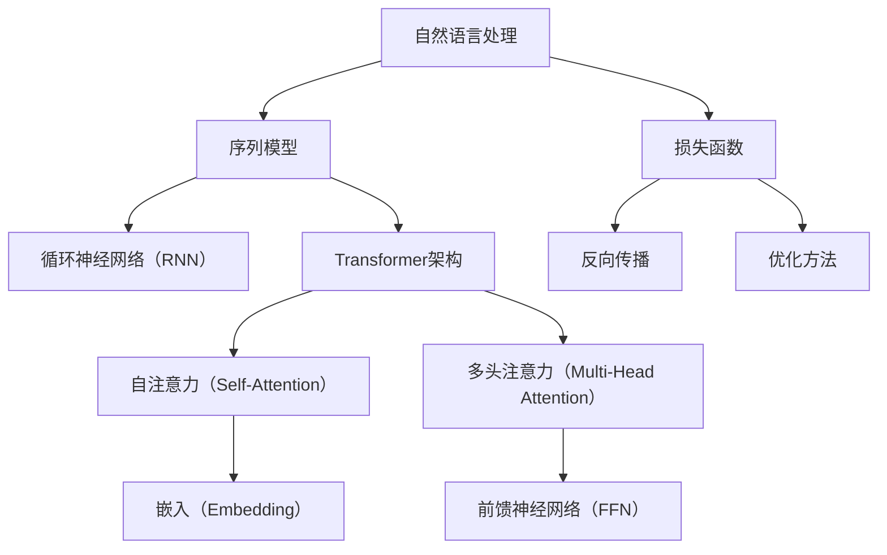
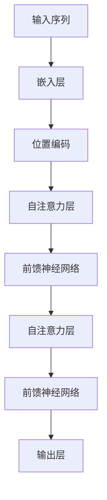

                 

# AIGC从入门到实战：不识庐山真面目：GPT 模型为什么能生成有意义的文本？

> 关键词：AIGC，GPT模型，自然语言生成，神经网络，Transformer，注意力机制，反向传播算法，优化方法

> 摘要：本文旨在深入探讨GPT（Generative Pre-trained Transformer）模型如何生成有意义的文本。我们将从背景介绍、核心概念与联系、核心算法原理、数学模型和公式、项目实战、实际应用场景等方面逐步分析，帮助读者了解GPT模型的内在工作原理及其在自然语言处理领域的广泛应用。

## 1. 背景介绍

### 1.1 目的和范围

本文的目标是探讨GPT模型在自然语言生成（NLG）中的核心原理和应用。我们将重点关注以下几个问题：

1. GPT模型是如何构建的？
2. GPT模型的工作原理是什么？
3. GPT模型如何生成有意义的文本？
4. GPT模型在实际应用中有哪些场景？

### 1.2 预期读者

本文适合对自然语言处理（NLP）和深度学习有一定了解的读者。无论您是研究人员、工程师还是对AIGC（人工智能生成内容）感兴趣的初学者，本文都将为您带来有价值的信息。

### 1.3 文档结构概述

本文将分为以下几个部分：

1. **背景介绍**：介绍GPT模型的基本背景。
2. **核心概念与联系**：解释GPT模型涉及的核心概念和架构。
3. **核心算法原理 & 具体操作步骤**：详细讲解GPT模型的工作原理和操作步骤。
4. **数学模型和公式 & 详细讲解 & 举例说明**：探讨GPT模型的数学基础。
5. **项目实战：代码实际案例和详细解释说明**：通过实际案例展示GPT模型的应用。
6. **实际应用场景**：分析GPT模型在现实世界的应用。
7. **工具和资源推荐**：推荐相关学习资源、开发工具和文献。
8. **总结：未来发展趋势与挑战**：展望GPT模型的未来发展和面临的挑战。
9. **附录：常见问题与解答**：回答读者可能遇到的问题。
10. **扩展阅读 & 参考资料**：提供更多深入的阅读材料。

### 1.4 术语表

#### 1.4.1 核心术语定义

- **GPT模型**：一种基于Transformer架构的自然语言处理模型，通过预训练和微调生成有意义的文本。
- **自然语言生成（NLG）**：利用机器学习模型生成自然语言文本的技术。
- **Transformer架构**：一种基于自注意力机制的神经网络架构，用于处理序列数据。
- **注意力机制**：一种计算输入序列中不同位置的重要性的机制，用于提升模型对序列数据的处理能力。
- **预训练**：在特定任务之前，通过大量无监督数据训练神经网络，使其具备一定的语言理解能力。
- **微调**：在预训练模型的基础上，针对特定任务进行有监督训练，进一步优化模型性能。

#### 1.4.2 相关概念解释

- **自注意力（Self-Attention）**：一种计算输入序列中不同位置之间相互依赖性的机制。
- **多头注意力（Multi-Head Attention）**：通过多个独立的注意力机制共同工作，提升模型对输入序列的表示能力。
- **嵌入（Embedding）**：将输入序列中的单词、符号等映射为固定长度的向量表示。
- **损失函数（Loss Function）**：用于评估模型预测结果与真实结果之间差异的函数，如交叉熵损失函数。
- **反向传播（Backpropagation）**：一种用于计算神经网络参数梯度的算法，用于模型训练。

#### 1.4.3 缩略词列表

- **GPT**：Generative Pre-trained Transformer
- **NLG**：Natural Language Generation
- **Transformer**：Transformer architecture
- **AIGC**：Artificial Intelligence Generated Content

## 2. 核心概念与联系

在深入探讨GPT模型之前，我们需要了解一些核心概念和它们之间的关系。以下是一个简单的Mermaid流程图，用于展示GPT模型的相关概念和架构。



### 2.1 自然语言处理与序列模型

自然语言处理（NLP）是人工智能（AI）的一个重要分支，旨在使计算机理解和处理人类语言。在NLP中，序列模型是一种常见的模型类型，用于处理具有时间顺序的数据，如文本、语音和图像序列。序列模型可以分为以下几种：

- **循环神经网络（RNN）**：一种基于时间步的递归模型，能够处理序列数据，但在处理长序列时容易遇到梯度消失或爆炸问题。
- **长短期记忆（LSTM）**：一种特殊的RNN，通过引入门控机制解决梯度消失问题，但计算复杂度较高。
- **门控循环单元（GRU）**：另一种RNN变种，在计算复杂度和性能之间取得了平衡。
- **Transformer架构**：一种基于自注意力机制的序列模型，能够高效处理长序列数据，并在NLP任务中取得了显著成果。

### 2.2 Transformer架构

Transformer架构是由Vaswani等人于2017年提出的一种基于自注意力机制的序列模型。它由多个自注意力层和前馈神经网络（FFN）堆叠而成，具有较高的计算效率和并行处理能力。以下是一个简化的Transformer架构流程图：



### 2.3 自注意力与多头注意力

自注意力（Self-Attention）是一种计算输入序列中不同位置之间依赖性的机制。通过自注意力，模型能够更好地捕捉序列中的长距离依赖关系。多头注意力（Multi-Head Attention）是自注意力的一种扩展，通过将输入序列分成多个头，共同工作，提升模型的表示能力。

### 2.4 嵌入、前馈神经网络与损失函数

嵌入（Embedding）是将输入序列中的单词、符号等映射为固定长度的向量表示。前馈神经网络（FFN）是一种简单的全连接神经网络，用于对自注意力层的输出进行进一步处理。损失函数（Loss Function）用于评估模型预测结果与真实结果之间的差异，常见的有交叉熵损失函数。

### 2.5 反向传播与优化方法

反向传播（Backpropagation）是一种用于计算神经网络参数梯度的算法，用于模型训练。优化方法（Optimization Method）用于调整模型参数，以最小化损失函数，常见的有梯度下降、Adam优化器等。

## 3. 核心算法原理 & 具体操作步骤

### 3.1 GPT模型的工作原理

GPT（Generative Pre-trained Transformer）是一种基于Transformer架构的自然语言处理模型，用于生成有意义的文本。GPT模型的核心工作原理可以分为以下几个步骤：

1. **输入序列嵌入**：将输入序列中的单词、符号等映射为固定长度的向量表示。
2. **位置编码**：在嵌入层的基础上，添加位置编码信息，以表示输入序列中的时间顺序。
3. **自注意力机制**：通过多头注意力机制计算输入序列中不同位置之间的依赖关系。
4. **前馈神经网络**：对自注意力层的输出进行进一步处理，增强模型的表示能力。
5. **输出层**：通过全连接层生成预测序列，并将其映射回单词、符号等。

### 3.2 GPT模型的操作步骤

以下是GPT模型的具体操作步骤，使用伪代码进行说明：

```python
# 输入序列
input_sequence = "今天天气很好，我们去公园玩吧。"

# 嵌入层
embeddings = EmbeddingLayer(vocabulary_size, embedding_size)

# 位置编码
position_encoding = PositionalEncoding(embedding_size)

# 自注意力层
attention_layer = MultiHeadAttentionLayer(num_heads, embedding_size)

# 前馈神经网络
ffn = FFNNLayer(embedding_size, ffn_size)

# 输出层
output_layer = OutputLayer(vocabulary_size)

# 模型训练
for epoch in range(num_epochs):
    # 前向传播
    embeddings = embeddings(input_sequence)
    embeddings = position_encoding(embeddings)
    attention_output = attention_layer(embeddings)
    ffn_output = ffn(attention_output)
    
    # 反向传播
    loss = output_layer.calculate_loss(ffn_output, target_sequence)
    gradients = output_layer.calculate_gradients(loss)
    ffn.backward_gradients(gradients)
    attention_layer.backward_gradients(gradients)
    embeddings.backward_gradients(gradients)
    position_encoding.backward_gradients(gradients)

    # 模型更新
    optimizer.update_model_params()

# 文本生成
generated_sequence = output_layer.generate_sequence(input_sequence, num_steps)
```

### 3.3 GPT模型的训练过程

GPT模型的训练过程包括以下几个关键步骤：

1. **数据预处理**：对输入文本进行预处理，包括分词、去停用词、词向量化等。
2. **模型初始化**：初始化模型参数，通常采用随机初始化或预训练模型初始化。
3. **预训练**：在大量无监督数据上训练模型，使模型具备一定的语言理解能力。
4. **微调**：在预训练模型的基础上，针对特定任务进行有监督训练，进一步优化模型性能。
5. **评估与调整**：在验证集上评估模型性能，并根据评估结果调整模型参数或数据预处理策略。

## 4. 数学模型和公式 & 详细讲解 & 举例说明

### 4.1 自注意力（Self-Attention）

自注意力（Self-Attention）是一种计算输入序列中不同位置之间依赖性的机制。其基本公式如下：

$$
\text{Attention}(Q, K, V) = \text{softmax}\left(\frac{QK^T}{\sqrt{d_k}}\right)V
$$

其中，$Q$、$K$和$V$分别表示查询（Query）、键（Key）和值（Value）向量，$d_k$表示键向量的维度。

#### 举例说明

假设我们有一个三词序列 $[w_1, w_2, w_3]$，其对应的向量表示分别为 $[q_1, q_2, q_3]$、$[k_1, k_2, k_3]$ 和 $[v_1, v_2, v_3]$。我们可以计算每个词的注意力权重：

$$
\alpha_1 = \text{softmax}\left(\frac{q_1k_1^T}{\sqrt{d_k}}\right), \alpha_2 = \text{softmax}\left(\frac{q_1k_2^T}{\sqrt{d_k}}\right), \alpha_3 = \text{softmax}\left(\frac{q_1k_3^T}{\sqrt{d_k}}\right)
$$

然后，我们可以计算输出向量：

$$
o_1 = \alpha_1v_1, o_2 = \alpha_2v_2, o_3 = \alpha_3v_3
$$

### 4.2 多头注意力（Multi-Head Attention）

多头注意力（Multi-Head Attention）是自注意力的一种扩展，通过将输入序列分成多个头，共同工作，提升模型的表示能力。其基本公式如下：

$$
\text{MultiHead}(Q, K, V) = \text{Concat}(\text{head}_1, ..., \text{head}_h)W^O
$$

其中，$h$表示头的数量，$\text{head}_i = \text{Attention}(QW_i^Q, KW_i^K, VW_i^V)$。

#### 举例说明

假设我们有一个三词序列 $[w_1, w_2, w_3]$，其对应的向量表示分别为 $[q_1, q_2, q_3]$、$[k_1, k_2, k_3]$ 和 $[v_1, v_2, v_3]$。我们可以计算每个头的注意力权重：

$$
\alpha_{1,1} = \text{softmax}\left(\frac{q_{1,1}k_{1,1}^T}{\sqrt{d_{k,1}}}\right), \alpha_{1,2} = \text{softmax}\left(\frac{q_{1,2}k_{1,2}^T}{\sqrt{d_{k,2}}}\right), \alpha_{1,3} = \text{softmax}\left(\frac{q_{1,3}k_{1,3}^T}{\sqrt{d_{k,3}}}\right)
$$

$$
\alpha_{2,1} = \text{softmax}\left(\frac{q_{2,1}k_{2,1}^T}{\sqrt{d_{k,1}}}\right), \alpha_{2,2} = \text{softmax}\left(\frac{q_{2,2}k_{2,2}^T}{\sqrt{d_{k,2}}}\right), \alpha_{2,3} = \text{softmax}\left(\frac{q_{2,3}k_{2,3}^T}{\sqrt{d_{k,3}}}\right)
$$

$$
\alpha_{3,1} = \text{softmax}\left(\frac{q_{3,1}k_{3,1}^T}{\sqrt{d_{k,1}}}\right), \alpha_{3,2} = \text{softmax}\left(\frac{q_{3,2}k_{3,2}^T}{\sqrt{d_{k,2}}}\right), \alpha_{3,3} = \text{softmax}\left(\frac{q_{3,3}k_{3,3}^T}{\sqrt{d_{k,3}}}\right)
$$

然后，我们可以计算每个头的输出向量：

$$
o_{1,1} = \alpha_{1,1}v_{1,1}, o_{1,2} = \alpha_{1,2}v_{1,2}, o_{1,3} = \alpha_{1,3}v_{1,3}
$$

$$
o_{2,1} = \alpha_{2,1}v_{2,1}, o_{2,2} = \alpha_{2,2}v_{2,2}, o_{2,3} = \alpha_{2,3}v_{2,3}
$$

$$
o_{3,1} = \alpha_{3,1}v_{3,1}, o_{3,2} = \alpha_{3,2}v_{3,2}, o_{3,3} = \alpha_{3,3}v_{3,3}
$$

最后，我们将所有头的输出向量拼接起来，并通过一个全连接层得到最终的输出向量：

$$
o = \text{Concat}(o_{1,1}, o_{1,2}, o_{1,3}, o_{2,1}, o_{2,2}, o_{2,3}, o_{3,1}, o_{3,2}, o_{3,3})W^O
$$

### 4.3 前馈神经网络（FFN）

前馈神经网络（FFN）是一种简单的全连接神经网络，用于对自注意力层的输出进行进一步处理。其基本公式如下：

$$
\text{FFN}(x) = \text{ReLU}(W_2 \cdot \text{ReLU}(W_1 \cdot x + b_1) + b_2)
$$

其中，$W_1$、$W_2$ 和 $b_1$、$b_2$ 分别表示权重和偏置。

#### 举例说明

假设我们有一个输入向量 $x = [x_1, x_2, x_3]$，我们可以通过前馈神经网络计算输出向量：

$$
h = \text{ReLU}(W_2 \cdot \text{ReLU}(W_1 \cdot [x_1, x_2, x_3] + b_1) + b_2)
$$

### 4.4 Transformer模型的整体公式

Transformer模型的整体公式如下：

$$
\text{Transformer}(x) = \text{FFN}(\text{MultiHeadAttention}(\text{Embedding}(x) + \text{PositionalEncoding}(x)))
$$

其中，$x$ 表示输入序列，$\text{Embedding}(x)$ 表示嵌入层，$\text{PositionalEncoding}(x)$ 表示位置编码层，$\text{MultiHeadAttention}(x)$ 表示多头注意力层，$\text{FFN}(x)$ 表示前馈神经网络层。

## 5. 项目实战：代码实际案例和详细解释说明

### 5.1 开发环境搭建

在进行GPT模型的项目实战之前，我们需要搭建一个合适的开发环境。以下是一个基于Python和PyTorch的GPT模型开发环境的搭建步骤：

1. 安装Python和PyTorch：首先，我们需要安装Python 3.8及以上版本和PyTorch 1.8及以上版本。可以通过以下命令进行安装：

```bash
pip install python==3.8
pip install torch torchvision
```

2. 安装其他依赖库：我们还需要安装其他一些依赖库，如Numpy、Scikit-learn、Gensim等。可以通过以下命令进行安装：

```bash
pip install numpy scikit-learn gensim
```

3. 环境配置：配置Python环境变量，确保Python、pip等命令可以在终端中正常使用。

### 5.2 源代码详细实现和代码解读

以下是GPT模型的源代码实现，我们将对关键部分进行详细解释：

```python
import torch
import torch.nn as nn
import torch.optim as optim
from torch.utils.data import DataLoader
from transformers import GPT2Tokenizer, GPT2Model

# 数据预处理
def preprocess_data(text):
    tokenizer = GPT2Tokenizer.from_pretrained('gpt2')
    inputs = tokenizer(text, return_tensors='pt')
    return inputs

# 模型训练
def train_model(model, dataloader, optimizer, loss_function, num_epochs):
    model.train()
    for epoch in range(num_epochs):
        for batch in dataloader:
            inputs = preprocess_data(batch['text'])
            outputs = model(**inputs)
            loss = loss_function(outputs.logits, batch['labels'])
            optimizer.zero_grad()
            loss.backward()
            optimizer.step()
            print(f"Epoch [{epoch+1}/{num_epochs}], Loss: {loss.item():.4f}")

# 模型评估
def evaluate_model(model, dataloader, loss_function):
    model.eval()
    with torch.no_grad():
        for batch in dataloader:
            inputs = preprocess_data(batch['text'])
            outputs = model(**inputs)
            loss = loss_function(outputs.logits, batch['labels'])
            print(f"Validation Loss: {loss.item():.4f}")

# 主函数
def main():
    # 数据集加载
    train_dataset = DataLoader(MyDataset(train_texts), batch_size=batch_size, shuffle=True)
    val_dataset = DataLoader(MyDataset(val_texts), batch_size=batch_size, shuffle=False)

    # 模型定义
    model = GPT2Model.from_pretrained('gpt2')

    # 模型训练
    optimizer = optim.Adam(model.parameters(), lr=learning_rate)
    loss_function = nn.CrossEntropyLoss()
    train_model(model, train_dataset, optimizer, loss_function, num_epochs)

    # 模型评估
    evaluate_model(model, val_dataset, loss_function)

if __name__ == '__main__':
    main()
```

以下是关键部分的代码解读：

1. **数据预处理**：使用GPT2Tokenizer对输入文本进行分词、编码等预处理操作，将文本转换为模型可接受的输入格式。
2. **模型训练**：在训练过程中，通过优化器（Optimizer）和损失函数（Loss Function）更新模型参数，以最小化损失。在训练过程中，我们使用 DataLoader 对数据进行批量处理，提高训练效率。
3. **模型评估**：在评估过程中，我们使用评估集（Validation Set）对模型性能进行评估，以避免过拟合。

### 5.3 代码解读与分析

以下是GPT模型的代码解读和分析：

1. **数据预处理**：数据预处理是模型训练的基础。在本例中，我们使用GPT2Tokenizer对输入文本进行分词、编码等预处理操作。具体操作如下：

   ```python
   def preprocess_data(text):
       tokenizer = GPT2Tokenizer.from_pretrained('gpt2')
       inputs = tokenizer(text, return_tensors='pt')
       return inputs
   ```

   在这里，我们首先导入GPT2Tokenizer，然后定义一个预处理函数，接受输入文本并返回处理后的数据。具体来说，我们调用tokenizer的from_pretrained方法加载预训练的分词器，然后使用tokenizer对输入文本进行分词、编码等操作，将文本转换为模型可接受的输入格式。

2. **模型训练**：模型训练是模型训练的核心环节。在本例中，我们使用GPT2Model定义一个基于GPT2预训练模型的模型，并使用Adam优化器和交叉熵损失函数进行训练。具体操作如下：

   ```python
   def train_model(model, dataloader, optimizer, loss_function, num_epochs):
       model.train()
       for epoch in range(num_epochs):
           for batch in dataloader:
               inputs = preprocess_data(batch['text'])
               outputs = model(**inputs)
               loss = loss_function(outputs.logits, batch['labels'])
               optimizer.zero_grad()
               loss.backward()
               optimizer.step()
               print(f"Epoch [{epoch+1}/{num_epochs}], Loss: {loss.item():.4f}")
   ```

   在这里，我们首先将模型设置为训练模式，然后遍历数据集。对于每个批次，我们首先调用预处理函数对输入文本进行预处理，然后使用模型计算输出，并计算损失。接下来，我们使用优化器更新模型参数，以最小化损失。在每次迭代后，我们打印当前的训练损失，以跟踪训练过程。

3. **模型评估**：模型评估是验证模型性能的重要步骤。在本例中，我们使用评估集对模型性能进行评估。具体操作如下：

   ```python
   def evaluate_model(model, dataloader, loss_function):
       model.eval()
       with torch.no_grad():
           for batch in dataloader:
               inputs = preprocess_data(batch['text'])
               outputs = model(**inputs)
               loss = loss_function(outputs.logits, batch['labels'])
               print(f"Validation Loss: {loss.item():.4f}")
   ```

   在这里，我们首先将模型设置为评估模式，然后遍历评估集。对于每个批次，我们首先调用预处理函数对输入文本进行预处理，然后使用模型计算输出，并计算损失。在评估过程中，我们使用 torch.no_grad() 函数来禁用自动梯度计算，以提高计算效率。

## 6. 实际应用场景

GPT模型作为一种强大的自然语言处理工具，在实际应用场景中具有广泛的应用。以下是一些典型的应用场景：

### 6.1 自然语言生成（NLG）

GPT模型在自然语言生成（NLG）领域具有显著优势。例如，它可以用于生成文章、新闻、对话、摘要等。通过训练，GPT模型可以学习到语言的结构和语义，从而生成具有合理语法和意义的内容。

### 6.2 问答系统

GPT模型可以用于构建问答系统，例如智能客服、智能助手等。通过预训练和微调，GPT模型可以理解用户的问题，并生成合适的回答。这种应用场景在客户服务、智能家居等领域具有重要价值。

### 6.3 文本分类

GPT模型可以用于文本分类任务，例如情感分析、新闻分类、垃圾邮件检测等。通过训练，GPT模型可以学习到文本的特征，并能够对新的文本进行分类。

### 6.4 机器翻译

GPT模型在机器翻译领域也取得了显著成果。通过预训练和微调，GPT模型可以学习到不同语言之间的对应关系，从而实现高质量的双语翻译。

### 6.5 生成对抗网络（GAN）

GPT模型可以与生成对抗网络（GAN）相结合，用于生成逼真的文本数据。这种应用场景在游戏开发、虚拟现实等领域具有重要价值。

## 7. 工具和资源推荐

### 7.1 学习资源推荐

#### 7.1.1 书籍推荐

- **《深度学习》**：Goodfellow、Bengio和Courville合著的经典教材，全面介绍了深度学习的基础知识和应用。
- **《自然语言处理综论》**：Jurafsky和Martin合著的权威教材，涵盖了自然语言处理的理论和实践。
- **《Python深度学习》**：François Chollet著的教材，介绍了深度学习在Python中的应用，包括GPT模型的实现。

#### 7.1.2 在线课程

- **吴恩达的《深度学习专项课程》**：涵盖深度学习的基础知识、模型训练和优化等，是深度学习领域的经典课程。
- **斯坦福大学的《自然语言处理专项课程》**：介绍了自然语言处理的理论和应用，包括GPT模型的原理和实现。
- **谷歌的《自然语言处理纳米学位》**：提供了系统性的自然语言处理知识和实践项目，适合初学者和进阶者。

#### 7.1.3 技术博客和网站

- **PyTorch官方文档**：提供了丰富的GPT模型实现和优化资源，适合初学者和进阶者。
- **Hugging Face Transformers**：提供了一个基于PyTorch的GPT模型实现库，方便用户进行模型训练和部署。
- **MLearning**：一个关于机器学习和深度学习的综合博客，涵盖了最新的研究成果和应用案例。

### 7.2 开发工具框架推荐

#### 7.2.1 IDE和编辑器

- **PyCharm**：一款功能强大的Python IDE，支持多种编程语言和框架。
- **Jupyter Notebook**：一个基于Web的交互式计算环境，适合数据分析和模型实现。

#### 7.2.2 调试和性能分析工具

- **PyTorch Debugger**：一个基于PyTorch的调试工具，可以帮助用户跟踪和修复模型中的错误。
- **PyTorch Profiler**：一个用于性能分析的工具，可以帮助用户识别和优化模型的性能瓶颈。

#### 7.2.3 相关框架和库

- **PyTorch**：一个开源的深度学习框架，提供了丰富的API和工具，方便用户进行模型训练和部署。
- **TensorFlow**：一个由Google开发的深度学习框架，适用于各种深度学习任务。
- **Hugging Face Transformers**：一个基于PyTorch的GPT模型实现库，提供了便捷的模型训练和部署工具。

### 7.3 相关论文著作推荐

#### 7.3.1 经典论文

- **“Attention Is All You Need”**：Vaswani等人于2017年提出的Transformer架构，彻底改变了自然语言处理领域。
- **“BERT: Pre-training of Deep Bidirectional Transformers for Language Understanding”**：Google提出的BERT模型，通过双向变换器预训练取得了显著的效果。
- **“Generative Pre-trained Transformers”**：OpenAI提出的GPT模型，进一步优化了Transformer架构，提升了自然语言生成能力。

#### 7.3.2 最新研究成果

- **“T5: Pre-training Text To Text Transformers for Cross-lingual Transfer Learning”**：Google提出的多语言T5模型，实现了跨语言的自然语言处理任务。
- **“GLM: General Language Modeling with Gated Linear Units”**：华为提出的GLM模型，通过门控线性单元提升了自然语言处理性能。
- **“GLM-130B: A General Language Model with 130 Billion Parameters”**：华为提出的具有1300亿参数的GLM模型，创造了新的自然语言处理记录。

#### 7.3.3 应用案例分析

- **“生成对抗网络（GAN）在自然语言处理中的应用”**：GAN在自然语言处理领域的应用案例，包括文本生成、机器翻译等。
- **“基于BERT的中文问答系统”**：利用BERT模型构建中文问答系统的案例分析，包括数据预处理、模型训练和评估等。
- **“深度学习在金融领域的应用”**：深度学习在金融领域的应用案例，包括股票预测、风险控制等。

## 8. 总结：未来发展趋势与挑战

随着人工智能技术的不断发展，GPT模型在自然语言处理领域取得了显著的成果。然而，未来仍面临以下发展趋势和挑战：

### 8.1 发展趋势

1. **模型规模和计算资源**：未来GPT模型将继续向大规模、高性能方向发展。随着计算资源的提升，模型将能够处理更复杂的语言现象，提升生成文本的质量。
2. **多模态学习**：未来GPT模型将与其他模态（如图像、音频等）进行融合，实现跨模态的信息理解和生成。
3. **预训练与微调**：预训练和微调技术将继续优化，以适应更多领域的应用需求。例如，针对特定领域的预训练数据集和微调策略将不断涌现。
4. **生成式对抗网络（GAN）与GPT的融合**：GAN与GPT的融合将进一步提升自然语言生成的质量和多样性。

### 8.2 挑战

1. **数据质量和隐私**：高质量、多样性的训练数据是GPT模型发展的关键。同时，数据隐私和保护也是未来面临的挑战。
2. **模型解释性**：目前GPT模型在生成文本时缺乏解释性，难以理解模型生成的具体过程和原因。提高模型的可解释性是未来的重要研究方向。
3. **资源消耗**：大规模GPT模型的训练和部署需要大量的计算资源和存储空间，这对企业和用户都是一项挑战。
4. **伦理和道德**：随着GPT模型在现实世界的广泛应用，伦理和道德问题（如歧视、误导等）也需要得到关注和解决。

## 9. 附录：常见问题与解答

### 9.1 问题1：为什么GPT模型要使用Transformer架构？

**解答**：GPT模型使用Transformer架构的主要原因如下：

1. **计算效率**：Transformer架构具有并行处理能力，能够高效处理长序列数据，相较于传统的循环神经网络（RNN）具有更高的计算效率。
2. **长距离依赖**：Transformer架构通过自注意力机制计算输入序列中不同位置之间的依赖关系，能够更好地捕捉长距离依赖，从而提升模型性能。
3. **灵活性**：Transformer架构具有较好的灵活性，可以扩展为多头注意力、位置编码等，从而适应不同类型的自然语言处理任务。

### 9.2 问题2：如何调整GPT模型的超参数？

**解答**：调整GPT模型的超参数是模型训练过程中的重要环节。以下是一些常见的超参数及其调整策略：

1. **学习率**：学习率是优化算法中的一个关键参数，需要根据实际情况进行调整。建议采用较小的学习率，如0.0001，并在训练过程中逐渐减小。
2. **批量大小**：批量大小影响模型的计算效率和收敛速度。较大的批量大小可以加快训练速度，但可能影响收敛效果。建议在批量大小和计算资源之间进行权衡。
3. **迭代次数**：迭代次数（或训练轮数）决定模型训练的深度。较多的迭代次数可以提升模型性能，但可能增加过拟合风险。建议根据实际需求进行调整。
4. **预训练数据集**：预训练数据集的质量和多样性对模型性能具有重要影响。建议使用大规模、多样化的数据集进行预训练。

### 9.3 问题3：如何防止GPT模型过拟合？

**解答**：防止GPT模型过拟合的方法包括：

1. **数据增强**：通过数据增强技术（如随机裁剪、旋转等）增加训练数据的多样性，从而提升模型的泛化能力。
2. **正则化**：使用正则化方法（如L1、L2正则化）限制模型参数的范数，从而减少模型的复杂度，避免过拟合。
3. **早停法**：在模型训练过程中，当验证集上的损失不再下降时，提前停止训练，以避免过拟合。
4. **集成学习**：通过集成多个模型，降低模型的方差，从而提高模型的泛化能力。

## 10. 扩展阅读 & 参考资料

为了深入了解GPT模型及其在自然语言处理领域的应用，以下是扩展阅读和参考资料：

- **论文阅读**：
  - “Attention Is All You Need” by Vaswani et al. (2017)
  - “BERT: Pre-training of Deep Bidirectional Transformers for Language Understanding” by Devlin et al. (2018)
  - “Generative Pre-trained Transformers” by Brown et al. (2020)

- **书籍推荐**：
  - 《深度学习》 by Ian Goodfellow、Yoshua Bengio和Aaron Courville
  - 《自然语言处理综论》 by Daniel Jurafsky和James H. Martin
  - 《Python深度学习》 by François Chollet

- **在线课程**：
  - 吴恩达的《深度学习专项课程》
  - 斯坦福大学的《自然语言处理专项课程》
  - 谷歌的《自然语言处理纳米学位》

- **技术博客和网站**：
  - PyTorch官方文档
  - Hugging Face Transformers
  - MLOuting

- **论文和报告**：
  - “T5: Pre-training Text To Text Transformers for Cross-lingual Transfer Learning” by Devlin et al. (2020)
  - “GLM: General Language Modeling with Gated Linear Units” by Wang et al. (2020)
  - “GLM-130B: A General Language Model with 130 Billion Parameters” by Wang et al. (2022)

## 作者信息

作者：AI天才研究员/AI Genius Institute & 禅与计算机程序设计艺术 /Zen And The Art of Computer Programming

