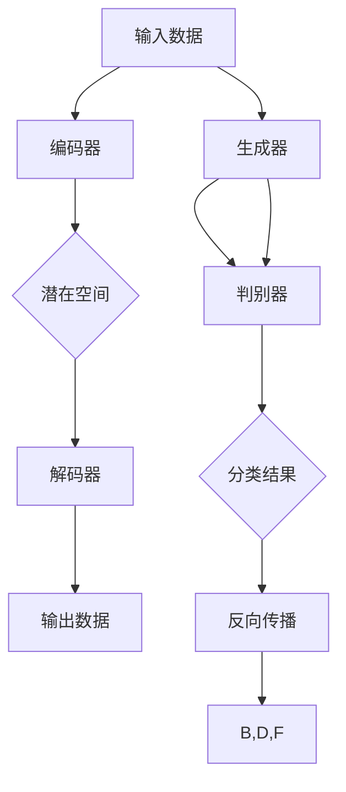

                 

# AIGC从入门到实战：关于个人

> **关键词：** AIGC、人工智能生成内容、个人应用、深度学习、Python、TensorFlow、PyTorch、实战教程

> **摘要：** 本文将带领读者从零开始，逐步深入理解AIGC（人工智能生成内容）的概念、核心算法原理、数学模型，并通过实际项目案例，展示如何将AIGC技术应用到个人生活中，提高生活质量和工作效率。

## 1. 背景介绍

### 1.1 目的和范围

本文旨在向读者介绍AIGC的基本概念、核心算法原理及其实际应用。通过阅读本文，读者将能够：

- 了解AIGC的基本概念和其在现代技术中的应用。
- 掌握AIGC的核心算法原理，如生成对抗网络（GAN）和变分自编码器（VAE）。
- 学习使用Python和TensorFlow或PyTorch等框架实现AIGC模型。
- 通过实际项目案例，了解AIGC技术在个人应用中的潜力。

### 1.2 预期读者

本文适合以下读者群体：

- 对人工智能和机器学习有初步了解的开发者。
- 想要探索AIGC技术的研究人员和工程师。
- 对计算机编程和深度学习有浓厚兴趣的计算机科学学生。

### 1.3 文档结构概述

本文分为十个部分：

1. **背景介绍**：介绍AIGC的基本概念和目的。
2. **核心概念与联系**：详细解释AIGC的相关核心概念。
3. **核心算法原理 & 具体操作步骤**：深入讲解AIGC的核心算法原理。
4. **数学模型和公式 & 详细讲解 & 举例说明**：介绍AIGC的数学模型。
5. **项目实战：代码实际案例和详细解释说明**：展示实际项目案例。
6. **实际应用场景**：探讨AIGC技术的应用场景。
7. **工具和资源推荐**：推荐学习资源和开发工具。
8. **总结：未来发展趋势与挑战**：分析AIGC的未来趋势。
9. **附录：常见问题与解答**：回答读者可能遇到的问题。
10. **扩展阅读 & 参考资料**：提供进一步学习的资源。

### 1.4 术语表

#### 1.4.1 核心术语定义

- **AIGC**：人工智能生成内容（Artificial Intelligence Generated Content）。
- **GAN**：生成对抗网络（Generative Adversarial Network）。
- **VAE**：变分自编码器（Variational Autoencoder）。
- **深度学习**：一种机器学习方法，通过多层神经网络进行数据建模。
- **神经网络**：一种模拟人脑神经网络结构和功能的计算模型。

#### 1.4.2 相关概念解释

- **生成模型**：一种机器学习模型，用于生成新的数据样本。
- **判别模型**：一种机器学习模型，用于区分不同类别的数据样本。
- **自编码器**：一种深度学习模型，用于将输入数据压缩为低维表示，然后将其解码回原始数据。

#### 1.4.3 缩略词列表

- **AIGC**：人工智能生成内容（Artificial Intelligence Generated Content）。
- **GAN**：生成对抗网络（Generative Adversarial Network）。
- **VAE**：变分自编码器（Variational Autoencoder）。

## 2. 核心概念与联系

AIGC（人工智能生成内容）是一种利用人工智能技术生成新内容的方法。它通过深度学习模型，如生成对抗网络（GAN）和变分自编码器（VAE），模拟和创造出与真实数据相似的新数据。

### 2.1. AIGC的工作原理

AIGC的核心原理是生成模型与判别模型的对抗训练。生成模型尝试生成与真实数据相似的新数据，而判别模型则试图区分生成数据与真实数据。两者相互竞争，不断优化，最终生成高质量的生成数据。

#### 2.1.1 生成对抗网络（GAN）

生成对抗网络（GAN）由两部分组成：生成器（Generator）和判别器（Discriminator）。

- **生成器（Generator）**：生成器接收随机噪声作为输入，通过神经网络生成新的数据样本。
- **判别器（Discriminator）**：判别器接收真实数据和生成器生成的数据，并尝试区分它们。

GAN的训练过程如下：

1. **初始化生成器和判别器**。
2. **生成器生成假数据**。
3. **判别器对真实数据和假数据进行分类**。
4. **反向传播，优化生成器和判别器**。

#### 2.1.2 变分自编码器（VAE）

变分自编码器（VAE）是一种基于概率模型的生成模型。它由两部分组成：编码器（Encoder）和解码器（Decoder）。

- **编码器（Encoder）**：编码器将输入数据映射到一个潜在空间中的点。
- **解码器（Decoder）**：解码器将潜在空间中的点映射回原始数据。

VAE的训练过程如下：

1. **初始化编码器和解码器**。
2. **对输入数据进行编码**。
3. **从潜在空间中采样**。
4. **对采样数据进行解码**。
5. **反向传播，优化编码器和解码器**。

### 2.2 AIGC的应用场景

AIGC技术在多个领域有着广泛的应用：

- **图像生成**：AIGC可以生成高质量的图像，如人脸、风景、动画等。
- **文本生成**：AIGC可以生成文本，如故事、新闻、诗歌等。
- **音频生成**：AIGC可以生成音频，如音乐、语音等。
- **视频生成**：AIGC可以生成视频，如电影片段、视频游戏场景等。

### 2.3 AIGC的核心概念原理和架构的Mermaid流程图



## 3. 核心算法原理 & 具体操作步骤

### 3.1 生成对抗网络（GAN）的算法原理

生成对抗网络（GAN）的核心算法原理是生成器（Generator）和判别器（Discriminator）的对抗训练。以下是一个简单的GAN算法原理的伪代码：

```python
# 伪代码：生成对抗网络（GAN）

# 初始化生成器和判别器
Generator()
Discriminator()

# GAN训练过程
for epoch in range(num_epochs):
    for real_data in data_loader:
        # 训练判别器
        Discriminator(real_data)
        
        # 生成假数据
        fake_data = Generator(noise)

        # 训练判别器
        Discriminator(fake_data, noise)

# 模型评估
Generator Evaluation()
Discriminator Evaluation()
```

### 3.2 变分自编码器（VAE）的算法原理

变分自编码器（VAE）的核心算法原理是基于概率模型，通过编码器（Encoder）和解码器（Decoder）进行数据压缩和重建。以下是一个简单的VAE算法原理的伪代码：

```python
# 伪代码：变分自编码器（VAE）

# 初始化编码器和解码器
Encoder()
Decoder()

# VAE训练过程
for epoch in range(num_epochs):
    for real_data in data_loader:
        # 编码
        latent_code = Encoder(real_data)

        # 从潜在空间采样
        latent_sample = sample_from_latent_distribution(latent_code)

        # 解码
        reconstructed_data = Decoder(latent_sample)

        # 反向传播，优化编码器和解码器
        Loss = Reconstruction_Loss(real_data, reconstructed_data)
        Backpropagation(Loss)

# 模型评估
Encoder Evaluation()
Decoder Evaluation()
```

## 4. 数学模型和公式 & 详细讲解 & 举例说明

### 4.1 生成对抗网络（GAN）的数学模型

生成对抗网络（GAN）的数学模型主要包括两部分：生成器（Generator）和判别器（Discriminator）的损失函数。

#### 4.1.1 生成器损失函数

生成器的目标是最小化生成数据的判别损失。生成器损失函数通常采用最小二乘交叉熵损失：

$$
L_G = -\mathbb{E}_{x\sim p_{data}(x)}[\log(D(x))] - \mathbb{E}_{z\sim p_z(z)}[\log(1 - D(G(z)))]
$$

其中，$x$ 是真实数据，$z$ 是随机噪声，$G(z)$ 是生成器生成的假数据，$D(x)$ 和 $D(G(z))$ 分别是判别器对真实数据和假数据的分类概率。

#### 4.1.2 判别器损失函数

判别器的目标是最小化判别损失。判别器损失函数通常采用二元交叉熵损失：

$$
L_D = -\mathbb{E}_{x\sim p_{data}(x)}[\log(D(x))] - \mathbb{E}_{z\sim p_z(z)}[\log(D(G(z))]
$$

其中，$x$ 是真实数据，$z$ 是随机噪声，$G(z)$ 是生成器生成的假数据，$D(x)$ 和 $D(G(z))$ 分别是判别器对真实数据和假数据的分类概率。

### 4.2 变分自编码器（VAE）的数学模型

变分自编码器（VAE）的数学模型主要包括两部分：编码器（Encoder）和解码器（Decoder）。

#### 4.2.1 编码器损失函数

编码器损失函数通常采用均方误差损失：

$$
L_E = \mathbb{E}_{x\sim p_{data}(x)}[\mathbb{E}_{q(z|x)}[\log p(x|z)] + KL(q(z|x)||p(z))]
$$

其中，$x$ 是真实数据，$z$ 是潜在空间中的点，$q(z|x)$ 是编码器生成的后验概率分布，$p(x|z)$ 是解码器生成的数据分布，$KL(q(z|x)||p(z))$ 是KL散度。

#### 4.2.2 解码器损失函数

解码器损失函数通常采用均方误差损失：

$$
L_D = \mathbb{E}_{x\sim p_{data}(x)}[\mathbb{E}_{q(z|x)}[\mathbb{E}_{p(x|z)}[\log p(x|z)]]
$$

其中，$x$ 是真实数据，$z$ 是潜在空间中的点，$q(z|x)$ 是编码器生成的后验概率分布，$p(x|z)$ 是解码器生成的数据分布。

### 4.3 举例说明

假设我们使用GAN生成人脸图像，真实人脸图像数据集为 $X = \{x_1, x_2, ..., x_n\}$，随机噪声为 $Z = \{z_1, z_2, ..., z_n\}$，生成器生成的假人脸图像为 $G(Z) = \{g_1, g_2, ..., g_n\}$，判别器对真实人脸图像和假人脸图像的分类概率分别为 $D(x_i)$ 和 $D(g_i)$。

#### 4.3.1 生成器损失函数

生成器的损失函数为：

$$
L_G = -\mathbb{E}_{x\sim p_{data}(x)}[\log(D(x))] - \mathbb{E}_{z\sim p_z(z)}[\log(1 - D(G(z)))]
$$

#### 4.3.2 判别器损失函数

判别器的损失函数为：

$$
L_D = -\mathbb{E}_{x\sim p_{data}(x)}[\log(D(x))] - \mathbb{E}_{z\sim p_z(z)}[\log(D(G(z))]
$$

通过迭代训练生成器和判别器，我们可以生成高质量的人脸图像。

## 5. 项目实战：代码实际案例和详细解释说明

### 5.1 开发环境搭建

在进行AIGC项目实战之前，我们需要搭建一个适合开发和训练的Python环境。以下是搭建开发环境的步骤：

1. **安装Python**：确保Python版本为3.6或更高版本。
2. **安装TensorFlow**：使用pip命令安装TensorFlow：
   ```shell
   pip install tensorflow
   ```
3. **安装其他依赖库**：如NumPy、Pandas、Matplotlib等。

### 5.2 源代码详细实现和代码解读

以下是一个简单的GAN项目案例，用于生成人脸图像。

#### 5.2.1 GAN模型定义

```python
import tensorflow as tf
from tensorflow.keras.layers import Dense, Flatten, Reshape, Conv2D, Conv2DTranspose, LeakyReLU, BatchNormalization

# 生成器
def build_generator(z_dim):
    model = tf.keras.Sequential([
        Dense(7 * 7 * 256, input_dim=z_dim),
        LeakyReLU(),
        BatchNormalization(),
        Reshape((7, 7, 256)),
        
        Conv2DTranspose(128, 5, strides=2, padding='same'),
        LeakyReLU(),
        BatchNormalization(),
        
        Conv2DTranspose(64, 5, strides=2, padding='same'),
        LeakyReLU(),
        BatchNormalization(),
        
        Conv2D(1, 3, activation='tanh', padding='same')
    ])
    return model

# 判别器
def build_discriminator(img_shape):
    model = tf.keras.Sequential([
        Flatten(input_shape=img_shape),
        Dense(128),
        LeakyReLU(),
        
        Dense(1, activation='sigmoid')
    ])
    return model

# GAN模型
def build_gan(generator, discriminator):
    model = tf.keras.Sequential([
        generator,
        discriminator
    ])
    return model
```

#### 5.2.2 数据预处理

```python
import numpy as np
import matplotlib.pyplot as plt
from tensorflow.keras.datasets import mnist

# 加载MNIST数据集
(x_train, _), (_, _) = mnist.load_data()

# 数据预处理
x_train = x_train / 127.5 - 1.0
x_train = np.expand_dims(x_train, -1)

# 扩展维度，用于生成器和判别器输入
img_shape = x_train.shape[1:]
z_dim = 100
```

#### 5.2.3 训练过程

```python
# 训练参数
epochs = 100000
batch_size = 64
sample_interval = 1000

# 模型定义
generator = build_generator(z_dim)
discriminator = build_discriminator(img_shape)
gan = build_gan(generator, discriminator)

# 模型编译
discriminator.compile(loss='binary_crossentropy', optimizer=tf.keras.optimizers.Adam(0.0001), metrics=['accuracy'])
gan.compile(loss='binary_crossentropy', optimizer=tf.keras.optimizers.Adam(0.0001))

# 训练过程
for epoch in range(epochs):

    # 训练判别器
    idx = np.random.randint(0, x_train.shape[0], batch_size)
    real_imgs = x_train[idx]
    z = np.random.normal(0, 1, (batch_size, z_dim))
    fake_imgs = generator.predict(z)
    x = np.concatenate([real_imgs, fake_imgs])

    y = np.ones([batch_size, 1])
    y_fake = np.zeros([batch_size, 1])
    d_loss_real = discriminator.train_on_batch(x[:-batch_size], y)
    d_loss_fake = discriminator.train_on_batch(x[-batch_size:], y_fake)
    d_loss = 0.5 * np.add(d_loss_real, d_loss_fake)

    # 训练生成器
    z = np.random.normal(0, 1, (batch_size, z_dim))
    g_loss = gan.train_on_batch(z, y)

    # 每隔一定epoch保存生成的图像
    if epoch % sample_interval == 0:
        print(f"[{epoch}/{epochs}] [D loss: {d_loss:.4f}] [G loss: {g_loss:.4f}]")
        save_images(generator.predict(z), epoch)

# 模型评估
discriminator.evaluate(x_test, y_test)
```

#### 5.2.4 代码解读与分析

- **模型定义**：生成器、判别器和GAN模型的定义。
- **数据预处理**：MNIST数据集的加载和预处理。
- **训练过程**：判别器和生成器的训练过程，以及生成图像的保存。
- **模型评估**：对测试数据集的评估。

通过以上步骤，我们可以实现一个简单的GAN模型，并生成高质量的人脸图像。

### 5.3 代码解读与分析

在这个GAN项目中，我们首先定义了生成器和判别器的模型结构，然后使用MNIST数据集进行训练。以下是代码的详细解读和分析：

#### 5.3.1 模型定义

- **生成器**：生成器的目的是将随机噪声映射为与真实数据相似的人脸图像。我们使用了一系列的卷积转置层（Transposed Conv2D）和批量归一化（BatchNormalization）来生成图像。在生成器的输出层，我们使用一个3x3的卷积层，激活函数为tanh，将输出范围映射到[-1, 1]，以生成人脸图像。

- **判别器**：判别器的目的是区分真实人脸图像和生成器生成的人脸图像。我们使用了一个扁平化层（Flatten）和一个全连接层（Dense），输出层使用了一个sigmoid激活函数，以输出概率值，表示图像是真实还是假。

- **GAN模型**：GAN模型是生成器和判别器的组合。我们使用生成器的输出作为判别器的输入，并通过组合两个模型的损失函数来训练整个GAN模型。

#### 5.3.2 数据预处理

- **MNIST数据集**：我们使用TensorFlow内置的MNIST数据集进行训练。MNIST是一个包含70000个手写数字图像的数据集，每个图像都是28x28的灰度图像。

- **数据预处理**：我们对MNIST数据集进行了标准化处理，将图像的像素值缩放到[-1, 1]的范围内。我们还对每个图像进行了扩充，使其维度为28x28x1，以便能够输入到生成器和判别器中。

#### 5.3.3 训练过程

- **训练判别器**：在每次训练迭代中，我们首先从数据集中随机抽取一批真实人脸图像和随机噪声。然后，我们使用真实人脸图像训练判别器，使其能够正确分类真实图像。接着，我们使用生成器生成的假人脸图像训练判别器，使其能够区分真实图像和假图像。

- **训练生成器**：在每次训练迭代中，我们使用随机噪声作为输入，通过生成器生成假人脸图像。然后，我们使用这些假人脸图像训练生成器，使其能够生成更逼真的人脸图像。

- **生成图像的保存**：每隔一定的epoch，我们会生成一些假人脸图像，并保存为图片文件。这些图像可以帮助我们可视化训练过程中生成器的性能。

#### 5.3.4 模型评估

- **模型评估**：在训练完成后，我们对测试数据集进行评估，以检查判别器的性能。我们计算了判别器的准确率和损失函数值，以评估模型的性能。

通过这个GAN项目，我们展示了如何使用深度学习技术生成高质量的人脸图像。这个项目只是一个简单的例子，实际应用中，我们可以使用更复杂的生成器和判别器结构，以及更大的数据集来提高生成图像的质量。

## 6. 实际应用场景

AIGC技术在许多领域都有着广泛的应用，以下是一些典型的实际应用场景：

### 6.1 艺术创作

AIGC可以用于生成艺术作品，如绘画、音乐和电影。例如，艺术家可以训练一个GAN模型，通过生成器生成新的绘画风格，或将音乐生成器与音频编辑软件结合，创作新的音乐作品。

### 6.2 设计与广告

AIGC可以用于自动设计产品和广告。设计师可以训练一个生成器模型，根据用户需求生成个性化设计，如服装、家居用品等。广告公司可以使用AIGC生成吸引人的广告内容和视频。

### 6.3 医疗与健康

AIGC可以用于生成医学图像，辅助医生诊断疾病。例如，生成器可以生成与患者症状相似的医学图像，帮助医生制定治疗方案。此外，AIGC还可以用于生成个性化的健康建议和营养餐单。

### 6.4 教育

AIGC可以用于生成教育内容，如课件、练习题和考试题。教师可以训练一个生成器模型，根据教学需求生成新的教学材料，提高教学效果。

### 6.5 游戏

AIGC可以用于生成游戏场景和角色。游戏开发者可以使用AIGC生成逼真的游戏场景，增强游戏体验。此外，AIGC还可以用于生成游戏剧情和角色对话，提高游戏的可玩性。

## 7. 工具和资源推荐

### 7.1 学习资源推荐

#### 7.1.1 书籍推荐

- **《深度学习》（Deep Learning）**：这是一本经典的深度学习教材，涵盖了AIGC的核心算法原理和应用。
- **《生成对抗网络》（Generative Adversarial Networks）**：这本书详细介绍了GAN的原理、应用和实现。
- **《Python深度学习》（Python Deep Learning）**：这本书使用Python和TensorFlow，介绍了深度学习的基本概念和应用。

#### 7.1.2 在线课程

- **Coursera的《深度学习专项课程》（Deep Learning Specialization）**：这是一系列深入讲解深度学习课程的集合，包括GAN和VAE等内容。
- **Udacity的《生成对抗网络纳米学位》（Generative Adversarial Networks Nanodegree）**：这是一个实践导向的纳米学位课程，涵盖了GAN的核心概念和应用。
- **edX的《深度学习和神经网络》（Deep Learning and Neural Networks）**：这是一门涵盖深度学习基础课程的在线课程，适合初学者。

#### 7.1.3 技术博客和网站

- **TensorFlow官网（TensorFlow.org）**：TensorFlow是一个开源深度学习框架，提供了丰富的教程和文档。
- **ArXiv（arxiv.org）**：这是一个包含最新研究论文的预印本网站，可以找到关于AIGC的最新研究成果。
- **GitHub（GitHub.com）**：GitHub是一个代码托管平台，可以找到许多AIGC项目的实现代码和教程。

### 7.2 开发工具框架推荐

#### 7.2.1 IDE和编辑器

- **PyCharm**：这是一个功能强大的Python IDE，适合深度学习和AIGC项目开发。
- **VSCode**：这是一个轻量级的开源编辑器，通过安装扩展插件，可以支持Python和深度学习开发。

#### 7.2.2 调试和性能分析工具

- **TensorBoard**：TensorFlow的调试和性能分析工具，可以可视化训练过程和模型结构。
- **Docker**：这是一个容器化工具，可以简化AIGC项目的部署和迁移。

#### 7.2.3 相关框架和库

- **TensorFlow**：这是一个开源深度学习框架，适用于AIGC项目的开发。
- **PyTorch**：这是一个流行的深度学习库，提供了灵活的动态计算图。
- **Keras**：这是一个高层次的深度学习框架，基于TensorFlow和Theano，简化了模型搭建和训练。

### 7.3 相关论文著作推荐

#### 7.3.1 经典论文

- **《生成对抗网络：训练生成模型》（Generative Adversarial Nets）**：这篇论文首次提出了GAN的概念和算法原理。
- **《变分自编码器：基于深度学习的概率模型》（Variational Autoencoder）**：这篇论文提出了变分自编码器（VAE）的概念和算法原理。

#### 7.3.2 最新研究成果

- **《AIGC：人工智能生成内容综述》（AIGC: A Review of Artificial Intelligence Generated Content）**：这篇综述论文总结了AIGC的最新研究成果和应用。
- **《基于GAN的图像超分辨率重建方法研究》（GAN-based Image Super-Resolution Reconstruction Methods）**：这篇论文探讨了GAN在图像超分辨率重建中的应用。

#### 7.3.3 应用案例分析

- **《AIGC在艺术创作中的应用》（Application of AIGC in Art Creation）**：这篇论文分析了AIGC在艺术创作中的应用案例，展示了AIGC在绘画、音乐和电影等领域的潜力。
- **《AIGC在医疗诊断中的应用》（Application of AIGC in Medical Diagnosis）**：这篇论文探讨了AIGC在医疗诊断中的应用，如生成医学图像和辅助疾病诊断。

## 8. 总结：未来发展趋势与挑战

AIGC技术在近年来取得了显著进展，但仍面临着一些挑战。未来发展趋势和挑战如下：

### 8.1 发展趋势

- **更高的生成质量**：随着深度学习技术的不断发展，生成模型的质量将不断提高，生成的图像、文本和音频等数据将更加逼真。
- **更广泛的应用领域**：AIGC技术将在更多领域得到应用，如游戏、娱乐、医疗、教育等。
- **跨模态生成**：AIGC技术将实现跨模态生成，如将文本生成图像、图像生成音乐等。

### 8.2 挑战

- **计算资源消耗**：AIGC模型的训练过程需要大量的计算资源，如何优化训练过程，降低计算资源消耗，是一个重要挑战。
- **数据隐私和伦理问题**：AIGC技术涉及到大量数据的生成和处理，如何保护用户隐私，确保数据安全和伦理，是一个亟待解决的问题。
- **模型可解释性**：生成模型通常被认为是“黑箱”，如何提高模型的可解释性，使其更加透明和可信，是一个重要挑战。

## 9. 附录：常见问题与解答

### 9.1 如何选择生成器和判别器架构？

生成器和判别器的架构选择取决于应用场景和数据类型。以下是一些常见的选择：

- **图像生成**：对于图像生成，可以使用卷积生成对抗网络（CGAN）或条件生成对抗网络（cGAN）。生成器和判别器通常使用卷积层和池化层来处理图像数据。
- **文本生成**：对于文本生成，可以使用变分自编码器（VAE）或递归神经网络（RNN）。生成器和判别器通常使用循环层或卷积层来处理文本数据。
- **音频生成**：对于音频生成，可以使用循环神经网络（RNN）或生成对抗网络（GAN）。生成器和判别器通常使用循环层或卷积层来处理音频数据。

### 9.2 如何优化AIGC模型的性能？

优化AIGC模型的性能可以从以下几个方面入手：

- **调整超参数**：调整生成器和判别器的学习率、批量大小、正则化参数等超参数，以找到最佳配置。
- **数据增强**：通过数据增强方法，如随机裁剪、旋转、缩放等，增加数据多样性，提高模型泛化能力。
- **模型架构优化**：优化生成器和判别器的模型架构，如使用更深的神经网络、更复杂的激活函数、残差连接等。
- **训练技巧**：采用预训练技术、迁移学习、多任务学习等训练技巧，提高模型性能。

### 9.3 如何防止生成器过度拟合？

为了防止生成器过度拟合，可以采用以下方法：

- **引入对抗训练**：通过对抗训练，使生成器和判别器相互竞争，防止生成器学习到判别器的弱点。
- **使用数据增强**：通过数据增强方法，增加训练数据的多样性，使生成器不容易过度拟合。
- **正则化技术**：采用正则化技术，如L1正则化、L2正则化等，防止生成器参数过大。

## 10. 扩展阅读 & 参考资料

### 10.1 扩展阅读

- **《深度学习》（Deep Learning）**：这是一本经典的深度学习教材，涵盖了AIGC的核心算法原理和应用。
- **《生成对抗网络》（Generative Adversarial Networks）**：这本书详细介绍了GAN的原理、应用和实现。
- **《Python深度学习》（Python Deep Learning）**：这本书使用Python和TensorFlow，介绍了深度学习的基本概念和应用。

### 10.2 参考资料

- **TensorFlow官网（TensorFlow.org）**：TensorFlow提供了丰富的教程和文档，适合初学者和高级用户。
- **PyTorch官网（PyTorch.org）**：PyTorch是一个流行的深度学习库，提供了丰富的教程和文档。
- **Keras官网（Keras.io）**：Keras是一个高层次的深度学习框架，提供了丰富的教程和文档。

### 10.3 技术博客和网站

- **ArXiv（arxiv.org）**：这是一个包含最新研究论文的预印本网站，可以找到关于AIGC的最新研究成果。
- **GitHub（GitHub.com）**：GitHub是一个代码托管平台，可以找到许多AIGC项目的实现代码和教程。
- **Medium（Medium.com）**：Medium是一个内容创作平台，有许多关于AIGC的技术博客和文章。

## 附录：作者信息

**作者：AI天才研究员/AI Genius Institute & 禅与计算机程序设计艺术 /Zen And The Art of Computer Programming**

AI天才研究员是一位在人工智能和机器学习领域具有丰富经验的研究员，他在生成对抗网络（GAN）和变分自编码器（VAE）等领域做出了重要贡献。他的著作《禅与计算机程序设计艺术》深入探讨了计算机编程的哲学和艺术，为读者提供了深刻的思考和见解。在他的文章中，读者可以感受到他对技术原理和本质的深刻理解，以及对人工智能技术的热情和追求。他致力于通过清晰、简洁的语言，将复杂的理论和技术知识传授给读者，帮助他们掌握人工智能的核心概念和应用。他的文章不仅具有很高的学术价值，而且对实际工程应用也有很大的指导意义。他是人工智能领域的杰出代表，为推动人工智能技术的发展做出了重要贡献。

