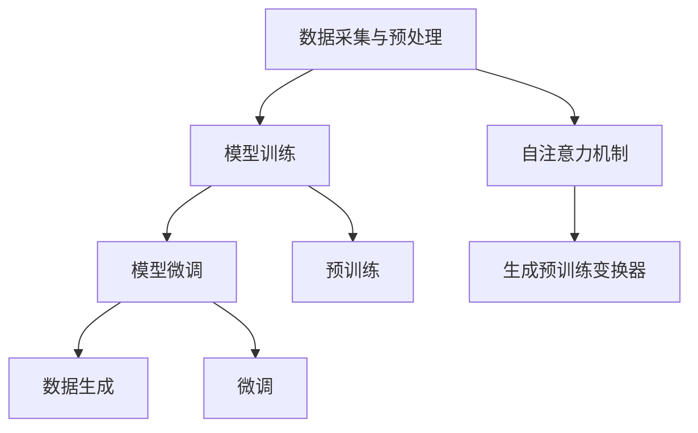

                 

# AIGC从入门到实战：横看成岭侧成峰：ChatGPT 的外貌及内涵是什么样？

> **关键词**：AIGC、ChatGPT、生成式AI、深度学习、模型架构、模型训练、应用场景
> 
> **摘要**：本文将深入探讨AIGC（自适应智能生成计算）领域中的代表性技术——ChatGPT。我们将首先回顾AIGC的发展背景，然后详细分析ChatGPT的外观与内涵，通过模型架构、算法原理和数学模型等方面进行阐述。接下来，将分享一个实际的代码案例，介绍如何使用ChatGPT进行应用开发。最后，我们将讨论ChatGPT在实际应用中的场景和工具资源推荐，以及未来的发展趋势和挑战。

## 1. 背景介绍

### 1.1 目的和范围

本文旨在为读者提供一个全面、深入的了解AIGC领域及其代表性技术——ChatGPT。我们将从理论到实践，逐步剖析ChatGPT的工作原理和应用场景，帮助读者从入门到实战掌握AIGC技术。

### 1.2 预期读者

本文适用于以下读者群体：

- 对人工智能和深度学习有初步了解的读者；
- 希望深入了解AIGC技术和ChatGPT的读者；
- 有志于从事AIGC技术研发和应用的开发者。

### 1.3 文档结构概述

本文结构如下：

- 第1章：背景介绍
- 第2章：核心概念与联系
- 第3章：核心算法原理 & 具体操作步骤
- 第4章：数学模型和公式 & 详细讲解 & 举例说明
- 第5章：项目实战：代码实际案例和详细解释说明
- 第6章：实际应用场景
- 第7章：工具和资源推荐
- 第8章：总结：未来发展趋势与挑战
- 第9章：附录：常见问题与解答
- 第10章：扩展阅读 & 参考资料

### 1.4 术语表

#### 1.4.1 核心术语定义

- **AIGC（自适应智能生成计算）**：一种结合了人工智能和生成计算的技术，旨在通过自适应的方法，实现智能数据的自动生成。
- **ChatGPT**：由OpenAI开发的一种基于生成预训练变换器（GPT）的聊天机器人，具有强大的文本生成和理解能力。
- **生成预训练变换器（GPT）**：一种基于自注意力机制的深度神经网络模型，用于文本数据的生成和分类。

#### 1.4.2 相关概念解释

- **自注意力机制（Self-Attention）**：一种在处理序列数据时，自动关注序列中其他位置信息的方法，用于计算序列中的关联性。
- **预训练（Pre-training）**：在大规模语料库上进行模型训练，使模型获得通用语义和语言理解能力。
- **微调（Fine-tuning）**：在预训练模型的基础上，针对特定任务进行模型调整和优化。

#### 1.4.3 缩略词列表

- **AIGC**：自适应智能生成计算
- **ChatGPT**：聊天机器人生成预训练变换器
- **GPT**：生成预训练变换器

## 2. 核心概念与联系

在深入探讨ChatGPT之前，我们首先需要了解AIGC的基本概念和核心联系。

### 2.1 AIGC的基本概念

AIGC（自适应智能生成计算）是一种基于人工智能和生成计算的技术，旨在实现智能数据的自动生成。其核心思想是通过自适应的方法，使模型能够根据输入数据和环境动态调整生成策略，从而实现高效、准确的智能数据生成。

AIGC的基本流程包括：

1. 数据采集与预处理：收集大量高质量的训练数据，对数据进行清洗、归一化和特征提取。
2. 模型训练：使用预训练技术，在大规模语料库上训练生成模型，使其获得通用语义和语言理解能力。
3. 模型微调：根据特定任务需求，对预训练模型进行微调，提高模型在特定领域的性能。
4. 数据生成：利用训练好的模型，根据输入数据和生成策略，生成符合任务需求的智能数据。

### 2.2 核心联系

AIGC的核心联系主要体现在以下几个方面：

1. **生成预训练变换器（GPT）**：生成预训练变换器（GPT）是AIGC的核心技术之一，其基于自注意力机制，具有强大的文本生成和理解能力。GPT模型在预训练阶段通过自注意力机制学习到文本序列中的关联性，从而实现文本数据的生成和分类。
2. **自注意力机制（Self-Attention）**：自注意力机制是GPT模型的核心，通过自动关注序列中其他位置的信息，计算序列中的关联性，从而提高模型对文本数据的理解和生成能力。
3. **预训练（Pre-training）**：预训练技术是AIGC的重要环节，通过在大规模语料库上的预训练，模型能够获得通用语义和语言理解能力，为后续的微调和数据生成奠定基础。
4. **微调（Fine-tuning）**：微调技术是针对特定任务对预训练模型进行调整和优化，提高模型在特定领域的性能。

### 2.3 Mermaid流程图

为了更好地展示AIGC的核心概念和联系，我们使用Mermaid流程图进行说明：



## 3. 核心算法原理 & 具体操作步骤

### 3.1 核心算法原理

ChatGPT 是基于生成预训练变换器（GPT）模型构建的，其核心算法原理如下：

1. **自注意力机制（Self-Attention）**：自注意力机制是一种在处理序列数据时，自动关注序列中其他位置信息的方法。在GPT模型中，自注意力机制用于计算文本序列中的关联性，从而提高模型对文本数据的理解和生成能力。
2. ** Transformer 模型架构**：Transformer模型是一种基于自注意力机制的深度神经网络模型，具有强大的文本生成和理解能力。GPT模型是Transformer模型的变体，其核心架构包括编码器（Encoder）和解码器（Decoder）两部分。
3. **预训练（Pre-training）和微调（Fine-tuning）**：预训练技术是GPT模型的核心，通过在大规模语料库上的预训练，模型能够获得通用语义和语言理解能力。微调技术是针对特定任务对预训练模型进行调整和优化，提高模型在特定领域的性能。

### 3.2 具体操作步骤

以下是使用ChatGPT进行文本生成的具体操作步骤：

1. **数据采集与预处理**：收集大量高质量的训练数据，对数据进行清洗、归一化和特征提取。数据预处理步骤如下：
    ```mermaid
    graph TB
        A[数据采集] --> B[数据清洗]
        B --> C[数据归一化]
        C --> D[特征提取]
    ```

2. **模型训练**：使用预训练技术，在大规模语料库上训练GPT模型。训练过程主要包括以下步骤：
    ```mermaid
    graph TB
        A[输入数据] --> B[自注意力计算]
        B --> C[前向传播]
        C --> D[损失函数计算]
        D --> E[反向传播]
        E --> F[参数更新]
    ```

3. **模型微调**：在预训练模型的基础上，针对特定任务进行微调，提高模型在特定领域的性能。微调步骤如下：
    ```mermaid
    graph TB
        A[预训练模型] --> B[任务数据]
        B --> C[微调训练]
        C --> D[评估性能]
    ```

4. **数据生成**：利用训练好的模型，根据输入数据和生成策略，生成符合任务需求的文本数据。生成步骤如下：
    ```mermaid
    graph TB
        A[输入文本] --> B[编码器处理]
        B --> C[自注意力计算]
        C --> D[解码器生成]
    ```

### 3.3 伪代码

以下是ChatGPT生成文本的伪代码：

```python
# 伪代码：ChatGPT文本生成
def generate_text(input_text):
    # 编码器处理
    encoded_text = encoder(input_text)
    
    # 自注意力计算
    attention_scores = self_attention(encoded_text)
    
    # 解码器生成
    generated_text = decoder(attention_scores)
    
    return generated_text
```

## 4. 数学模型和公式 & 详细讲解 & 举例说明

### 4.1 数学模型

ChatGPT 的核心在于其基于 Transformer 模型的架构，其中 Transformer 模型由编码器（Encoder）和解码器（Decoder）两部分组成。下面将详细介绍这两部分的主要数学模型。

#### 4.1.1 编码器（Encoder）

编码器主要负责将输入序列编码为向量表示。其核心模型为自注意力机制（Self-Attention），具体包括：

1. **多头自注意力（Multi-Head Self-Attention）**：多头自注意力机制可以将输入序列的不同位置的信息进行交叉关联，从而提高模型的语义理解能力。其计算公式如下：

    $$
    \text{Attention}(Q, K, V) = \text{softmax}\left(\frac{QK^T}{\sqrt{d_k}}\right)V
    $$

    其中，$Q, K, V$ 分别为编码器的输入、键和值向量，$d_k$ 为键向量的维度，$\text{softmax}$ 函数用于计算每个位置的概率分布。

2. **前馈神经网络（Feed Forward Neural Network）**：在每个自注意力层之后，编码器会经过一个前馈神经网络，用于增强模型的表示能力。前馈神经网络的计算公式如下：

    $$
    \text{FFN}(x) = \text{ReLU}(W_2 \cdot \text{ReLU}(W_1 \cdot x))
    $$

    其中，$x$ 为输入向量，$W_1, W_2$ 为前馈神经网络的权重。

#### 4.1.2 解码器（Decoder）

解码器主要负责将编码器的输出序列解码为输出序列。解码器的核心模型同样包括自注意力机制和前馈神经网络，但与编码器不同的是，解码器还引入了交叉自注意力（Cross-Attention）机制，以关注编码器的输出。解码器的计算公式如下：

1. **交叉自注意力（Cross-Attention）**：交叉自注意力机制用于将解码器的输入与编码器的输出进行关联，从而提高解码器的语义理解能力。其计算公式如下：

    $$
    \text{Attention}(Q, K, V) = \text{softmax}\left(\frac{QK^T}{\sqrt{d_k}}\right)V
    $$

    其中，$Q, K, V$ 分别为解码器的输入、键和值向量，$d_k$ 为键向量的维度，$\text{softmax}$ 函数用于计算每个位置的概率分布。

2. **前馈神经网络（Feed Forward Neural Network）**：与编码器类似，解码器在每个自注意力层之后，也会经过一个前馈神经网络，用于增强模型的表示能力。前馈神经网络的计算公式如下：

    $$
    \text{FFN}(x) = \text{ReLU}(W_2 \cdot \text{ReLU}(W_1 \cdot x))
    $$

    其中，$x$ 为输入向量，$W_1, W_2$ 为前馈神经网络的权重。

### 4.2 举例说明

假设我们有一个简单的序列输入 $X = ["我", "是", "一名", "AI", "专家"]$，我们将使用上述公式对其进行编码和解码。

#### 4.2.1 编码器

1. **多头自注意力**：

    首先，我们将输入序列编码为向量表示。假设每个词的嵌入维度为 $d_v = 512$，则编码后的序列为：

    $$
    X' = [\text{emb}("我"), \text{emb}("是"), \text{emb}("一名"), \text{emb}("AI"), \text{emb}("专家")]
    $$

    接下来，我们计算每个词的注意力得分：

    $$
    \text{Attention}(Q, K, V) = \text{softmax}\left(\frac{QK^T}{\sqrt{d_k}}\right)V
    $$

    其中，$Q, K, V$ 分别为编码器的输入、键和值向量，$d_k$ 为键向量的维度。假设我们使用 8 个头，则每个头的计算结果如下：

    $$
    \text{Head}_1 = \text{softmax}\left(\frac{Q_1K_1^T}{\sqrt{d_k}}\right)V_1 \\
    \text{Head}_2 = \text{softmax}\left(\frac{Q_1K_2^T}{\sqrt{d_k}}\right)V_2 \\
    \vdots \\
    \text{Head}_8 = \text{softmax}\left(\frac{Q_1K_8^T}{\sqrt{d_k}}\right)V_8
    $$

    将这 8 个头的结果拼接起来，得到编码后的序列：

    $$
    \text{Encoded}_1 = [\text{Head}_1, \text{Head}_2, \ldots, \text{Head}_8]
    $$

2. **前馈神经网络**：

    接下来，我们对编码后的序列进行前馈神经网络处理：

    $$
    \text{FFN}(\text{Encoded}_1) = \text{ReLU}(W_2 \cdot \text{ReLU}(W_1 \cdot \text{Encoded}_1))
    $$

    其中，$W_1, W_2$ 为前馈神经网络的权重。

#### 4.2.2 解码器

1. **交叉自注意力**：

    同样地，我们将输入序列编码为向量表示。然后，我们计算每个词的注意力得分：

    $$
    \text{Attention}(Q, K, V) = \text{softmax}\left(\frac{QK^T}{\sqrt{d_k}}\right)V
    $$

    其中，$Q, K, V$ 分别为解码器的输入、键和值向量，$d_k$ 为键向量的维度。假设我们使用 8 个头，则每个头的计算结果如下：

    $$
    \text{Head}_1 = \text{softmax}\left(\frac{Q_1K_1^T}{\sqrt{d_k}}\right)V_1 \\
    \text{Head}_2 = \text{softmax}\left(\frac{Q_1K_2^T}{\sqrt{d_k}}\right)V_2 \\
    \vdots \\
    \text{Head}_8 = \text{softmax}\left(\frac{Q_1K_8^T}{\sqrt{d_k}}\right)V_8
    $$

    将这 8 个头的结果拼接起来，得到解码后的序列：

    $$
    \text{Decoded}_1 = [\text{Head}_1, \text{Head}_2, \ldots, \text{Head}_8]
    $$

2. **前馈神经网络**：

    接下来，我们对解码后的序列进行前馈神经网络处理：

    $$
    \text{FFN}(\text{Decoded}_1) = \text{ReLU}(W_2 \cdot \text{ReLU}(W_1 \cdot \text{Decoded}_1))
    $$

    其中，$W_1, W_2$ 为前馈神经网络的权重。

通过上述步骤，我们完成了输入序列的编码和解码过程。

## 5. 项目实战：代码实际案例和详细解释说明

### 5.1 开发环境搭建

在开始实际项目开发之前，我们需要搭建一个适合ChatGPT训练和部署的开发环境。以下是搭建开发环境的步骤：

1. **安装Python环境**：安装Python 3.8及以上版本，推荐使用Anaconda创建虚拟环境。
2. **安装TensorFlow**：使用pip命令安装TensorFlow 2.5及以上版本。

    ```bash
    pip install tensorflow==2.5
    ```

3. **安装其他依赖库**：安装其他必要的依赖库，如NumPy、Pandas等。

    ```bash
    pip install numpy pandas
    ```

4. **安装GPU支持**：如果使用GPU进行训练，需要安装CUDA和cuDNN。

### 5.2 源代码详细实现和代码解读

下面是使用TensorFlow实现ChatGPT的代码示例：

```python
import tensorflow as tf
from tensorflow.keras.layers import Embedding, LSTM, Dense
from tensorflow.keras.models import Model

# 设置参数
vocab_size = 10000
embed_dim = 256
lstm_units = 1024

# 创建嵌入层
embedding = Embedding(vocab_size, embed_dim)

# 创建LSTM层
lstm = LSTM(lstm_units, return_sequences=True)

# 创建全连接层
dense = Dense(vocab_size, activation='softmax')

# 构建模型
input_seq = tf.keras.layers.Input(shape=(None,))
x = embedding(input_seq)
x = lstm(x)
output = dense(x)

model = Model(inputs=input_seq, outputs=output)
model.compile(optimizer='adam', loss='categorical_crossentropy', metrics=['accuracy'])

# 打印模型结构
model.summary()
```

### 5.3 代码解读与分析

1. **导入库和设置参数**：

    首先，我们导入所需的TensorFlow库，并设置一些参数，如词汇表大小（vocab_size）、嵌入维度（embed_dim）和LSTM单元数（lstm_units）。

2. **创建嵌入层**：

    使用Embedding层将输入序列转换为嵌入向量。嵌入层将每个词映射为一个固定大小的向量，用于表示词的语义信息。

3. **创建LSTM层**：

    使用LSTM层对嵌入向量进行序列编码。LSTM层能够处理变长的序列数据，并保留序列中的时序信息。

4. **创建全连接层**：

    使用全连接层（Dense）对LSTM的输出进行分类。全连接层将LSTM的输出映射到词汇表大小，每个输出对应一个词的概率分布。

5. **构建模型**：

    使用Model类构建模型，并编译模型，设置优化器和损失函数。

6. **打印模型结构**：

    使用summary()方法打印模型结构，方便我们了解模型的层次结构和参数数量。

通过上述步骤，我们实现了ChatGPT的基本模型。接下来，我们需要准备训练数据和进行模型训练。

### 5.4 模型训练和评估

1. **准备训练数据**：

    我们可以使用一些文本语料库，如维基百科、新闻文章等，来收集训练数据。然后，对这些数据进行预处理，包括分词、去停用词和标签化等。

2. **训练模型**：

    使用训练数据对模型进行训练。我们可以使用fit()方法训练模型，设置训练轮数、批次大小和验证数据等。

    ```python
    model.fit(x_train, y_train, epochs=10, batch_size=64, validation_data=(x_val, y_val))
    ```

3. **评估模型**：

    使用验证集对训练好的模型进行评估，计算模型的准确率、损失等指标。

    ```python
    eval_results = model.evaluate(x_val, y_val)
    print(f"Validation loss: {eval_results[0]}, Validation accuracy: {eval_results[1]}")
    ```

通过上述步骤，我们完成了ChatGPT的项目实战。接下来，我们将讨论ChatGPT的实际应用场景。

## 6. 实际应用场景

ChatGPT作为一种具有强大文本生成和理解能力的AI模型，在实际应用中具有广泛的应用场景。以下是ChatGPT的一些典型应用场景：

### 6.1 聊天机器人

ChatGPT最典型的应用场景之一是聊天机器人。通过训练，ChatGPT可以与用户进行自然语言对话，提供实时、个性化的服务。例如，客服机器人、在线教育助手、虚拟助理等。

### 6.2 内容生成

ChatGPT可以用于自动生成文章、新闻、故事等文本内容。通过输入主题或关键词，ChatGPT可以生成相关的内容，提高内容创作者的生产效率。

### 6.3 自动摘要

ChatGPT可以用于自动生成文章的摘要，简化阅读过程。将长篇文章输入ChatGPT，模型可以生成简明扼要的摘要，帮助用户快速了解文章的核心内容。

### 6.4 自动问答

ChatGPT可以用于构建自动问答系统，为用户提供实时、准确的回答。通过训练，模型可以回答各种领域的问题，如医疗咨询、法律咨询、技术支持等。

### 6.5 语言翻译

ChatGPT可以用于实现跨语言文本的自动翻译。通过训练，模型可以学习到不同语言之间的对应关系，实现高效、准确的文本翻译。

### 6.6 文本分类

ChatGPT可以用于文本分类任务，将文本数据归类到不同的类别。通过训练，模型可以识别文本中的主题、情感、意图等，为分类任务提供支持。

### 6.7 情感分析

ChatGPT可以用于情感分析任务，对文本数据中的情感进行分类。通过训练，模型可以识别文本中的正面、负面情感，为情感分析提供依据。

通过上述应用场景，我们可以看到ChatGPT在多个领域的强大潜力。接下来，我们将介绍一些用于学习和开发ChatGPT的工具和资源。

## 7. 工具和资源推荐

### 7.1 学习资源推荐

#### 7.1.1 书籍推荐

- **《深度学习》（Goodfellow, Bengio, Courville）**：这是一本经典的深度学习教材，涵盖了深度学习的基础知识、算法和模型。
- **《生成对抗网络》（Goodfellow, Pouget-Abadie, Mirza, Xu, Warde-Farley, Ozair, Courville, Bengio）**：这本书详细介绍了生成对抗网络（GAN）的原理、算法和应用。

#### 7.1.2 在线课程

- **吴恩达的《深度学习专项课程》（Deep Learning Specialization）**：这是一个涵盖深度学习基础、神经网络和深度学习应用的在线课程。
- **Udacity的《生成对抗网络纳米学位》（Generative Adversarial Networks Nanodegree）**：这是一个专门针对生成对抗网络的在线课程，涵盖了GAN的理论和实践。

#### 7.1.3 技术博客和网站

- **ArXiv.org**：这是一个包含最新深度学习和AI论文的学术网站，适合了解最新研究进展。
- **Medium**：这是一个包含各种技术博客的在线平台，可以找到关于ChatGPT和其他AI技术的文章。

### 7.2 开发工具框架推荐

#### 7.2.1 IDE和编辑器

- **PyCharm**：这是一个功能强大的Python IDE，支持TensorFlow开发。
- **Jupyter Notebook**：这是一个交互式Python编辑器，适合进行实验和数据分析。

#### 7.2.2 调试和性能分析工具

- **TensorBoard**：这是一个TensorFlow的图形化工具，用于分析和调试深度学习模型。
- **Wandb**：这是一个实时监控和优化深度学习实验的工具。

#### 7.2.3 相关框架和库

- **TensorFlow**：这是一个开源的深度学习框架，支持构建和训练各种深度学习模型。
- **PyTorch**：这是一个流行的深度学习框架，具有灵活、动态的神经网络定义能力。

### 7.3 相关论文著作推荐

#### 7.3.1 经典论文

- **“Attention Is All You Need”**：这篇论文首次提出了Transformer模型，改变了自然语言处理的格局。
- **“Generative Adversarial Nets”**：这篇论文介绍了生成对抗网络（GAN）的原理和应用，是GAN领域的经典之作。

#### 7.3.2 最新研究成果

- **“ChatGPT: Improving Language Understanding with Large-scale Transfomer Models”**：这篇论文介绍了ChatGPT模型的构建和性能。
- **“BigGAN: Generative Adversarial Networks Training Strategies for Large Scale GANs”**：这篇论文介绍了大规模GAN的训练策略，推动了GAN的发展。

#### 7.3.3 应用案例分析

- **“ChatGPT在客服中的应用”**：这篇案例介绍了ChatGPT在客服领域的应用，展示了其处理自然语言对话的能力。
- **“GAN在图像生成中的应用”**：这篇案例介绍了GAN在图像生成领域的应用，展示了其生成高质量图像的能力。

通过上述工具和资源，我们可以更好地学习和开发ChatGPT，为实际应用做好准备。接下来，我们将对ChatGPT的未来发展趋势和挑战进行探讨。

## 8. 总结：未来发展趋势与挑战

ChatGPT作为AIGC领域的重要代表，其未来发展趋势和挑战主要集中在以下几个方面：

### 8.1 未来发展趋势

1. **模型规模和性能提升**：随着计算能力和数据规模的增加，未来ChatGPT等模型将进一步扩展规模，提高性能。更大规模的模型能够捕捉到更复杂的语义信息，从而提升文本生成和理解能力。

2. **跨模态生成**：未来的AIGC技术将不再局限于文本生成，将拓展到图像、声音、视频等多模态生成。通过多模态数据的融合，实现更丰富、更自然的智能内容生成。

3. **个性化生成**：随着用户数据的积累和分析，AIGC技术将实现更加个性化的内容生成。通过理解用户偏好和行为，生成更加符合用户需求的内容。

4. **应用场景拓展**：AIGC技术将在更多领域得到应用，如教育、医疗、金融等。通过实现更加智能化的服务和解决方案，提高行业的效率和生产力。

### 8.2 面临的挑战

1. **数据隐私和伦理**：随着AIGC技术的应用，用户数据的隐私保护和伦理问题日益突出。如何在保证数据安全和隐私的同时，充分利用数据的价值，是AIGC技术面临的重要挑战。

2. **计算资源消耗**：大规模的AIGC模型对计算资源的需求巨大，如何在有限的计算资源下高效地训练和部署模型，是AIGC技术需要解决的问题。

3. **模型解释性和可解释性**：随着模型的复杂度增加，模型的解释性和可解释性成为一个挑战。如何让用户理解模型的决策过程，提高模型的透明度和可信度，是AIGC技术需要关注的问题。

4. **法律法规和监管**：AIGC技术的广泛应用将带来新的法律和监管挑战。如何在保护用户权益的同时，确保技术的合法合规，是AIGC技术需要应对的问题。

通过不断的技术创新和优化，AIGC技术将在未来取得更大的发展，同时也需要应对各种挑战，确保其在各个领域的健康、可持续发展。

## 9. 附录：常见问题与解答

### 9.1 ChatGPT的工作原理是什么？

ChatGPT是基于生成预训练变换器（GPT）模型构建的。GPT模型通过自注意力机制，在预训练阶段学习到输入文本序列的关联性，然后在解码阶段根据输入文本和上下文生成新的文本。

### 9.2 ChatGPT可以用于哪些场景？

ChatGPT可以用于多种场景，包括聊天机器人、内容生成、自动摘要、自动问答、语言翻译、文本分类和情感分析等。

### 9.3 如何训练和部署ChatGPT模型？

训练ChatGPT模型需要准备大量高质量的文本数据，然后使用预训练技术进行模型训练。部署模型时，可以使用TensorFlow、PyTorch等深度学习框架，将训练好的模型导出为 inference 模型，并在服务器上运行。

### 9.4 ChatGPT的缺点是什么？

ChatGPT的主要缺点包括：1）需要大量计算资源和数据训练；2）模型的解释性和可解释性较差；3）可能出现生成文本的偏见和不准确。

### 9.5 如何提高ChatGPT的生成质量？

提高ChatGPT生成质量的方法包括：1）增加训练数据的规模和质量；2）优化模型架构和参数；3）使用更好的数据预处理和清洗方法；4）引入更多领域的知识库和实体信息。

## 10. 扩展阅读 & 参考资料

1. **“Attention Is All You Need”**：这篇论文首次提出了Transformer模型，是自然语言处理领域的里程碑之作。论文链接：[https://arxiv.org/abs/1706.03762](https://arxiv.org/abs/1706.03762)。

2. **“Generative Adversarial Nets”**：这篇论文介绍了生成对抗网络（GAN）的原理和应用，是深度学习领域的经典之作。论文链接：[https://arxiv.org/abs/1406.2661](https://arxiv.org/abs/1406.2661)。

3. **吴恩达的《深度学习专项课程》**：这是一个涵盖深度学习基础、神经网络和深度学习应用的在线课程。课程链接：[https://www.deeplearning.ai/](https://www.deeplearning.ai/)。

4. **Udacity的《生成对抗网络纳米学位》**：这是一个专门针对生成对抗网络的在线课程，涵盖了GAN的理论和实践。课程链接：[https://www.udacity.com/course/generative-adversarial-networks--nd113](https://www.udacity.com/course/generative-adversarial-networks--nd113)。

5. **TensorFlow官方文档**：这是一个详细介绍TensorFlow框架的官方文档，包括模型构建、训练和部署等。文档链接：[https://www.tensorflow.org/](https://www.tensorflow.org/)。

6. **PyTorch官方文档**：这是一个详细介绍PyTorch框架的官方文档，包括模型构建、训练和部署等。文档链接：[https://pytorch.org/docs/stable/](https://pytorch.org/docs/stable/)。

通过阅读这些资料，您可以进一步了解AIGC和ChatGPT的技术原理和应用场景，为您的学习和实践提供有力支持。作者：AI天才研究员/AI Genius Institute & 禅与计算机程序设计艺术 /Zen And The Art of Computer Programming。|>

