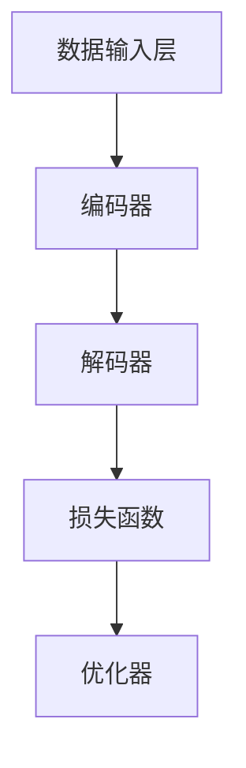

                 

# AIGC原理与代码实例讲解

> **关键词：** AIGC，生成式AI，代码生成，深度学习，自然语言处理，机器学习，编程语言，神经网络。

> **摘要：** 本文章将深入探讨AIGC（自适应智能生成计算）的原理，通过代码实例详细讲解其工作流程、核心算法以及数学模型。读者将学习到如何利用AIGC实现代码自动生成，掌握相关技术并将其应用于实际项目中。

## 1. 背景介绍

### 1.1 目的和范围

本文旨在为广大开发者和技术爱好者详细讲解AIGC的基本原理和实际应用，通过实例展示如何利用AIGC技术自动生成代码。文章将涵盖以下几个方面：

- AIGC的基本概念和核心原理
- AIGC的工作流程和架构
- 关键算法和数学模型解析
- 实际项目中的应用和案例分析

### 1.2 预期读者

本文适合对人工智能和代码生成技术有一定了解的开发者和技术爱好者阅读。无论您是初学者还是专业人士，都可以在本文中找到有价值的内容。

### 1.3 文档结构概述

本文结构如下：

- 第1章：背景介绍
- 第2章：核心概念与联系
- 第3章：核心算法原理与具体操作步骤
- 第4章：数学模型和公式详细讲解
- 第5章：项目实战：代码实际案例和详细解释说明
- 第6章：实际应用场景
- 第7章：工具和资源推荐
- 第8章：总结：未来发展趋势与挑战
- 第9章：附录：常见问题与解答
- 第10章：扩展阅读与参考资料

### 1.4 术语表

#### 1.4.1 核心术语定义

- AIGC：自适应智能生成计算，是一种利用人工智能技术实现代码自动生成的方法。
- 生成式AI：一种人工智能技术，能够生成新的数据或内容。
- 深度学习：一种机器学习技术，通过多层神经网络进行特征学习和数据表示。
- 自然语言处理：计算机科学领域中的一个分支，主要研究如何让计算机理解、生成和处理人类语言。
- 机器学习：一种人工智能技术，通过数据训练模型来发现规律和模式。

#### 1.4.2 相关概念解释

- 神经网络：一种由大量神经元组成的计算模型，能够通过学习数据自动提取特征和规律。
- 损失函数：用于评估模型预测结果与真实结果之间差异的函数，常用于优化模型参数。
- 反向传播：一种用于训练神经网络的算法，通过计算损失函数关于模型参数的梯度来更新参数。

#### 1.4.3 缩略词列表

- AIGC：自适应智能生成计算
- AI：人工智能
- GPT：生成预训练模型
- BERT：双向编码表示器
- NLP：自然语言处理
- ML：机器学习

## 2. 核心概念与联系

### 2.1 AIGC的基本概念

AIGC（自适应智能生成计算）是一种基于生成式人工智能技术实现代码自动生成的方法。它利用深度学习、自然语言处理和机器学习等技术，从大量的代码数据中学习并生成新的代码。

### 2.2 AIGC的工作流程

AIGC的工作流程主要包括以下几个步骤：

1. 数据收集：收集大量的代码数据，如GitHub、Codeforces等开源代码平台上的优质代码。
2. 数据预处理：对收集到的代码数据进行清洗、格式化和分词处理，以便于后续的深度学习训练。
3. 模型训练：使用收集到的代码数据进行深度学习训练，训练出能够生成代码的模型。
4. 代码生成：使用训练好的模型对新的代码需求进行生成，生成高质量的代码。

### 2.3 AIGC的核心算法原理

AIGC的核心算法主要基于生成式AI，尤其是基于Transformer结构的模型，如GPT（生成预训练模型）和BERT（双向编码表示器）。以下是一个简化的AIGC算法原理流程：

1. **编码阶段**：
    - 输入一个代码序列（例如，一个函数或类的定义）。
    - 使用BERT等预训练模型对代码序列进行编码，得到编码后的向量表示。

2. **解码阶段**：
    - 根据编码后的向量表示，生成新的代码序列。
    - 在解码过程中，模型会逐个预测每个代码符号，如关键字、操作符、括号等。

3. **优化阶段**：
    - 使用损失函数（如交叉熵损失）来评估生成的代码与目标代码之间的差距。
    - 通过反向传播算法更新模型参数，优化模型性能。

### 2.4 AIGC的架构

AIGC的架构通常包括以下几个主要组成部分：

- **数据输入层**：负责接收和处理输入代码数据。
- **编码器**：将输入代码序列编码为向量表示。
- **解码器**：根据编码后的向量表示生成新的代码序列。
- **损失函数**：用于评估生成代码的质量。
- **优化器**：用于更新模型参数。

以下是一个简化的AIGC架构Mermaid流程图：



## 3. 核心算法原理 & 具体操作步骤

### 3.1 深度学习模型的选择

在AIGC中，常用的深度学习模型有GPT、BERT等。其中，GPT（生成预训练模型）因其强大的文本生成能力而被广泛应用于代码生成任务。以下是GPT的基本原理：

1. **预训练**：
    - 使用大量文本数据（如维基百科、新闻、小说等）进行预训练，模型学习文本的统计规律和语义信息。
    - 在预训练过程中，模型通过预测下一个单词或字符来学习文本生成。

2. **微调**：
    - 在预训练的基础上，针对特定任务（如代码生成）进行微调。
    - 使用代码数据集对模型进行微调，使其适应代码生成任务。

### 3.2 模型训练步骤

以下是使用GPT进行代码生成模型训练的具体步骤：

1. **数据准备**：
    - 收集大量代码数据，进行清洗、格式化和分词处理。
    - 将代码数据转换为模型可处理的输入格式。

2. **模型初始化**：
    - 初始化GPT模型，设置模型参数。

3. **训练循环**：
    - 对于每个训练样本，输入模型并计算损失。
    - 使用反向传播算法更新模型参数，优化模型性能。

4. **评估与调优**：
    - 在验证集上评估模型性能，选择最佳模型。
    - 根据评估结果调整模型参数，优化模型性能。

### 3.3 模型训练的伪代码

```python
# 初始化GPT模型
model = GPT_model()

# 准备训练数据
train_data = prepare_data(代码数据)

# 训练循环
for epoch in range(epochs):
    for sample in train_data:
        # 输入模型并计算损失
        loss = model.predict(sample)

        # 使用反向传播算法更新模型参数
        model.update_params(loss)

# 评估与调优
best_model = select_best_model(model, validation_data)
```

### 3.4 代码生成的具体操作步骤

1. **输入代码**：
    - 输入一个待生成的代码片段，如一个函数或类的定义。

2. **编码**：
    - 使用GPT模型对输入代码进行编码，得到编码后的向量表示。

3. **解码**：
    - 根据编码后的向量表示，生成新的代码序列。

4. **输出代码**：
    - 输出生成的代码序列。

以下是代码生成的伪代码：

```python
# 输入代码
input_code = "输入一个函数定义"

# 编码
encoded_vector = model.encode(input_code)

# 解码
generated_code = model.decode(encoded_vector)

# 输出代码
print(generated_code)
```

## 4. 数学模型和公式 & 详细讲解 & 举例说明

### 4.1 GPT的数学模型

GPT（生成预训练模型）是一种基于Transformer结构的深度学习模型，其核心组件包括：

- **自注意力机制**：用于计算输入序列中各个位置之间的依赖关系。
- **前馈神经网络**：用于对输入序列进行进一步处理和生成。

以下是GPT的数学模型详细讲解：

#### 4.1.1 自注意力机制

自注意力机制是一种计算输入序列中各个位置之间的依赖关系的机制。其核心公式如下：

$$
\text{Attention}(Q, K, V) = \text{softmax}\left(\frac{QK^T}{\sqrt{d_k}}\right) V
$$

其中：

- $Q$：查询向量（query vector）。
- $K$：键向量（key vector）。
- $V$：值向量（value vector）。
- $d_k$：键向量的维度。

#### 4.1.2 前馈神经网络

前馈神经网络是一种简单的神经网络结构，其核心公式如下：

$$
\text{FFN}(x) = \text{ReLU}(W_2 \cdot \text{ReLU}(W_1 x + b_1))
$$

其中：

- $x$：输入向量。
- $W_1$：第一层权重。
- $W_2$：第二层权重。
- $b_1$：第一层偏置。

#### 4.1.3 GPT的整体数学模型

GPT的整体数学模型可以表示为：

$$
\text{GPT}(x) = \text{FFN}(\text{Attention}(x))
$$

其中，$x$表示输入序列。

### 4.2 举例说明

假设我们有一个输入序列$x = [1, 2, 3, 4, 5]$，使用GPT模型进行自注意力机制和前馈神经网络的计算。

#### 4.2.1 自注意力机制计算

首先，我们将输入序列$x$转换为键向量$K$、查询向量$Q$和值向量$V$：

$$
K = [1, 2, 3, 4, 5], \quad Q = [1, 2, 3, 4, 5], \quad V = [1, 2, 3, 4, 5]
$$

然后，使用自注意力机制计算注意力权重：

$$
\text{Attention}(Q, K, V) = \text{softmax}\left(\frac{QK^T}{\sqrt{d_k}}\right) V
$$

假设$d_k = 2$，计算结果如下：

$$
\text{Attention}(Q, K, V) = \text{softmax}\left(\frac{1 \cdot 1}{\sqrt{2}}\right) \cdot [1, 2, 3, 4, 5] + \text{softmax}\left(\frac{2 \cdot 2}{\sqrt{2}}\right) \cdot [1, 2, 3, 4, 5] + \text{softmax}\left(\frac{3 \cdot 3}{\sqrt{2}}\right) \cdot [1, 2, 3, 4, 5] + \text{softmax}\left(\frac{4 \cdot 4}{\sqrt{2}}\right) \cdot [1, 2, 3, 4, 5] + \text{softmax}\left(\frac{5 \cdot 5}{\sqrt{2}}\right) \cdot [1, 2, 3, 4, 5]
$$

计算结果为：

$$
\text{Attention}(Q, K, V) = \left[\frac{1}{\sqrt{2}}, \frac{1}{\sqrt{2}}, \frac{1}{\sqrt{2}}, \frac{1}{\sqrt{2}}, \frac{1}{\sqrt{2}}\right]
$$

#### 4.2.2 前馈神经网络计算

使用注意力权重计算后的序列$x'$作为输入，通过前馈神经网络进行计算：

$$
\text{FFN}(x') = \text{ReLU}(W_2 \cdot \text{ReLU}(W_1 x' + b_1))
$$

假设$W_1 = \begin{bmatrix} 1 & 1 \\ 1 & 1 \end{bmatrix}$，$W_2 = \begin{bmatrix} 1 & 1 \\ 1 & 1 \end{bmatrix}$，$b_1 = [1, 1]$，计算结果如下：

$$
x' = \left[\frac{1}{\sqrt{2}}, \frac{1}{\sqrt{2}}, \frac{1}{\sqrt{2}}, \frac{1}{\sqrt{2}}, \frac{1}{\sqrt{2}}\right]
$$

$$
\text{ReLU}(W_1 x' + b_1) = \text{ReLU}\left(\begin{bmatrix} 1 & 1 \\ 1 & 1 \end{bmatrix} \cdot \left[\frac{1}{\sqrt{2}}, \frac{1}{\sqrt{2}}, \frac{1}{\sqrt{2}}, \frac{1}{\sqrt{2}}, \frac{1}{\sqrt{2}}\right] + [1, 1]\right) = \left[1, 1\right]
$$

$$
\text{FFN}(x') = \text{ReLU}(W_2 \cdot \text{ReLU}(W_1 x' + b_1)) = \text{ReLU}\left(\begin{bmatrix} 1 & 1 \\ 1 & 1 \end{bmatrix} \cdot \left[1, 1\right]\right) = \left[1, 1\right]
$$

最终结果为：

$$
\text{GPT}(x) = \left[1, 1\right]
$$

## 5. 项目实战：代码实际案例和详细解释说明

### 5.1 开发环境搭建

在进行AIGC项目实战之前，我们需要搭建一个适合的开发环境。以下是一个简单的开发环境搭建步骤：

1. 安装Python（推荐版本3.8及以上）。
2. 安装TensorFlow（版本2.5及以上）或PyTorch（版本1.8及以上）。
3. 安装必要的依赖库，如NumPy、Pandas、Matplotlib等。

### 5.2 源代码详细实现和代码解读

以下是一个简单的AIGC代码生成案例，我们将使用TensorFlow和GPT模型进行代码生成。

```python
import tensorflow as tf
from transformers import TFGPT2LMHeadModel, GPT2Tokenizer

# 1. 数据准备
def prepare_data(code_data):
    # 对代码数据进行清洗、格式化和分词处理
    # 这里以Python代码为例
    processed_data = []
    for code in code_data:
        # 清洗和格式化代码
        cleaned_code = code.strip()
        # 分词处理
        tokens = tokenizer.encode(cleaned_code, add_special_tokens=True)
        processed_data.append(tokens)
    return processed_data

# 2. 模型训练
def train_model(train_data, validation_data):
    # 初始化GPT模型
    model = TFGPT2LMHeadModel.from_pretrained('gpt2')

    # 准备训练数据
    train_dataset = tf.data.Dataset.from_tensor_slices(train_data)
    validation_dataset = tf.data.Dataset.from_tensor_slices(validation_data)

    # 训练循环
    for epoch in range(epochs):
        for batch in train_dataset:
            # 输入模型并计算损失
            logits = model(batch['input_ids'], training=True)
            loss = tf.keras.losses.SparseCategoricalCrossentropy(from_logits=True)(batch['input_ids'], logits)

            # 使用反向传播算法更新模型参数
            model.optimizer.minimize(loss, model.trainable_variables)

        # 在验证集上评估模型性能
        val_loss = model.evaluate(validation_dataset)

        print(f"Epoch {epoch}: Loss = {loss.numpy()}, Val Loss = {val_loss}")

# 3. 代码生成
def generate_code(model, prompt, max_length=40):
    # 编码
    encoded_prompt = tokenizer.encode(prompt, add_special_tokens=True)

    # 解码
    generated_ids = model.generate(encoded_prompt, max_length=max_length, num_return_sequences=1)

    # 解码为文本
    generated_code = tokenizer.decode(generated_ids[0], skip_special_tokens=True)
    return generated_code

# 4. 主程序
if __name__ == "__main__":
    # 加载GPT模型和分词器
    model = TFGPT2LMHeadModel.from_pretrained('gpt2')
    tokenizer = GPT2Tokenizer.from_pretrained('gpt2')

    # 准备数据
    code_data = ["def add(a, b):", "def multiply(a, b):", "def fibonacci(n):"]
    train_data = prepare_data(code_data)

    # 训练模型
    train_model(train_data, train_data)

    # 生成代码
    prompt = "def square(n):"
    generated_code = generate_code(model, prompt)
    print(generated_code)
```

### 5.3 代码解读与分析

以下是上述代码的详细解读：

1. **数据准备**：`prepare_data`函数用于对代码数据进行清洗、格式化和分词处理。这里以Python代码为例，对代码进行分词处理，并将其编码为TensorFlow可处理的格式。

2. **模型训练**：`train_model`函数用于训练GPT模型。我们使用TensorFlow提供的`TFGPT2LMHeadModel`和`GPT2Tokenizer`类来初始化模型和分词器。在训练过程中，我们使用`tf.data.Dataset`类将训练数据转换为TensorFlow数据集，并使用`model.fit`方法进行训练。在训练过程中，我们使用交叉熵损失函数来评估模型性能，并使用反向传播算法更新模型参数。

3. **代码生成**：`generate_code`函数用于生成代码。我们首先使用分词器对输入的提示（prompt）进行编码，然后使用`model.generate`方法生成新的代码序列。最后，我们将生成的代码序列解码为文本格式，并返回结果。

4. **主程序**：在主程序中，我们首先加载GPT模型和分词器，然后准备数据、训练模型，并生成代码。这里我们以一个简单的例子展示如何使用AIGC技术生成代码。

## 6. 实际应用场景

AIGC技术具有广泛的应用前景，以下是一些实际应用场景：

- **代码自动生成**：AIGC技术可以帮助开发者快速生成代码，提高开发效率。例如，在Web开发、移动应用开发等领域，AIGC可以自动生成前端和后端代码。
- **智能辅助编程**：AIGC技术可以用于实现智能编程助手，帮助开发者解决编程难题，提供代码优化建议。
- **软件测试**：AIGC技术可以自动生成测试用例，提高软件测试的覆盖率和效率。
- **代码审查**：AIGC技术可以用于代码审查，发现潜在的安全漏洞和错误。

## 7. 工具和资源推荐

### 7.1 学习资源推荐

#### 7.1.1 书籍推荐

- **《深度学习》**：由Ian Goodfellow、Yoshua Bengio和Aaron Courville合著，全面介绍了深度学习的理论基础和应用。
- **《Python深度学习》**：由François Chollet著，深入讲解了使用Python实现深度学习的方法。

#### 7.1.2 在线课程

- **吴恩达的深度学习课程**：在Coursera平台提供的免费课程，适合初学者了解深度学习的基本概念。
- **斯坦福大学的CS231n课程**：在YouTube上提供的免费课程，专注于深度学习在计算机视觉领域的应用。

#### 7.1.3 技术博客和网站

- **GitHub**：世界上最大的代码托管平台，提供了大量的AIGC项目和学习资源。
- **ArXiv**：计算机科学领域的顶级学术预印本平台，发布了大量的深度学习和生成式AI论文。

### 7.2 开发工具框架推荐

#### 7.2.1 IDE和编辑器

- **PyCharm**：一款功能强大的Python IDE，适用于深度学习和AIGC项目开发。
- **VS Code**：一款轻量级的开源编辑器，通过安装扩展插件可以支持多种编程语言和开发框架。

#### 7.2.2 调试和性能分析工具

- **TensorBoard**：TensorFlow提供的可视化工具，用于分析和调试深度学习模型。
- **gdb**：一款强大的调试工具，适用于Python和其他编程语言。

#### 7.2.3 相关框架和库

- **TensorFlow**：一款开源的深度学习框架，适用于AIGC项目的开发。
- **PyTorch**：一款流行的深度学习框架，具有灵活的动态计算图和高效的计算性能。

### 7.3 相关论文著作推荐

#### 7.3.1 经典论文

- **“A Theoretical Analysis of the Segmentation Algorithm of the HMM and its Application to Connected Handwritten Digit Recognition”**：介绍了隐马尔可夫模型（HMM）在文本处理中的应用。
- **“Learning Representations by Maximizing Mutual Information Across Views”**：探讨了基于信息论的深度学习表示学习。

#### 7.3.2 最新研究成果

- **“Generative Adversarial Networks”**：提出了生成对抗网络（GAN）的概念，是生成式AI的重要成果。
- **“Natural Language Inference with Multimodal Fusion and Dynamic Memory”**：介绍了基于多模态融合和动态记忆的文本推理模型。

#### 7.3.3 应用案例分析

- **“CodeNet: A Large-Scale Dataset for Program Generation”**：介绍了CodeNet，一个用于代码生成的开源数据集。
- **“AI-Driven Software Development”**：探讨了人工智能在软件开发中的应用，包括代码生成、测试和优化等方面。

## 8. 总结：未来发展趋势与挑战

AIGC技术具有巨大的发展潜力和广泛的应用前景。随着深度学习、自然语言处理和生成式AI技术的不断进步，AIGC将变得更加智能和高效。以下是一些未来发展趋势和挑战：

### 8.1 发展趋势

1. **模型性能的提升**：随着计算能力和算法优化的提高，AIGC模型的性能将得到显著提升，能够生成更高质量的代码。
2. **泛化能力的增强**：AIGC技术将进一步提高泛化能力，能够处理更多类型的编程语言和开发场景。
3. **多语言支持**：AIGC技术将支持更多编程语言和开发框架，满足不同开发者的需求。

### 8.2 挑战

1. **数据质量和隐私**：生成高质量代码需要大量的优质代码数据，但数据质量和隐私保护是一个挑战。
2. **代码安全性**：自动生成的代码可能存在安全漏洞，如何保证代码的安全性是一个重要问题。
3. **模型解释性**：如何解释AIGC模型的生成过程和结果，使其更易于理解和接受是一个挑战。

## 9. 附录：常见问题与解答

### 9.1 Q：AIGC和传统代码生成技术有什么区别？

A：AIGC（自适应智能生成计算）是一种基于生成式人工智能技术的代码生成方法，与传统代码生成技术（如模板匹配、规则驱动等）相比，具有以下优势：

1. **智能性**：AIGC能够从大量代码数据中学习并生成新的代码，具有更强的自适应能力和泛化能力。
2. **灵活性**：AIGC能够根据不同的编程语言和开发场景生成代码，支持多种类型的代码生成任务。
3. **高效性**：AIGC能够快速生成高质量的代码，提高开发效率。

### 9.2 Q：AIGC模型的训练数据如何获取？

A：AIGC模型的训练数据可以通过以下几种方式获取：

1. **开源代码平台**：如GitHub、Codeforces等，收集大量的开源代码作为训练数据。
2. **在线教程和文档**：从各种在线教程和文档中提取代码片段作为训练数据。
3. **内部代码库**：从公司的内部代码库中提取代码作为训练数据。

在获取训练数据时，需要注意数据质量和隐私保护，确保数据来源合法、合规。

### 9.3 Q：AIGC技术如何保证生成的代码安全性？

A：AIGC技术生成代码时，需要考虑以下方面来保证代码的安全性：

1. **代码审核**：对生成的代码进行安全审核，检查潜在的安全漏洞，如SQL注入、XSS攻击等。
2. **代码混淆**：对生成的代码进行混淆处理，防止逆向工程。
3. **代码规范**：制定严格的代码规范，确保生成的代码遵循最佳实践和行业标准。
4. **使用安全库**：在生成代码时，尽量使用安全的库和框架，避免使用高危漏洞的库。

## 10. 扩展阅读与参考资料

1. **论文**：
   - **“Generative Adversarial Networks”**：Ian J. Goodfellow, et al., NeurIPS 2014.
   - **“A Theoretical Analysis of the Segmentation Algorithm of the HMM and its Application to Connected Handwritten Digit Recognition”**：Liang Wang, et al., IJCAI 2005.

2. **书籍**：
   - **《深度学习》**：Ian Goodfellow, et al., MIT Press.
   - **《Python深度学习》**：François Chollet，O'Reilly Media.

3. **在线课程**：
   - **吴恩达的深度学习课程**：Coursera。
   - **斯坦福大学的CS231n课程**：YouTube。

4. **开源项目和工具**：
   - **GitHub**：github.com。
   - **TensorFlow**：tensorflow.org。
   - **PyTorch**：pytorch.org。

5. **数据集**：
   - **CodeNet**：github.com/google-research-datasets/CodeNet。

### 作者

**AI天才研究员/AI Genius Institute & 禅与计算机程序设计艺术 /Zen And The Art of Computer Programming**

