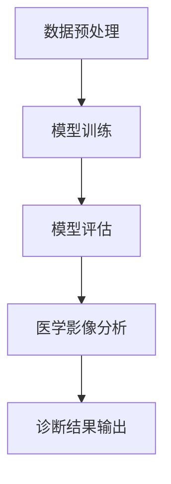
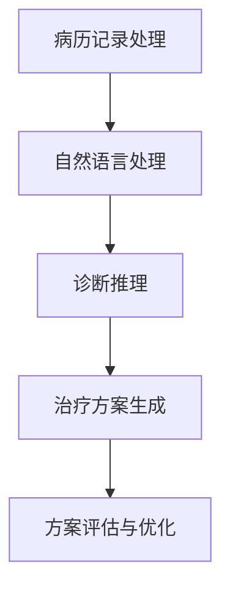
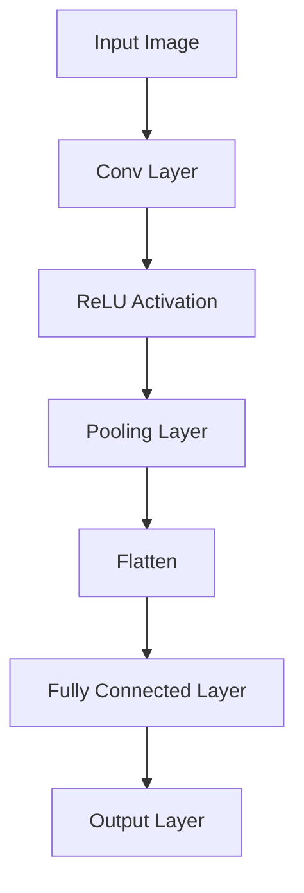
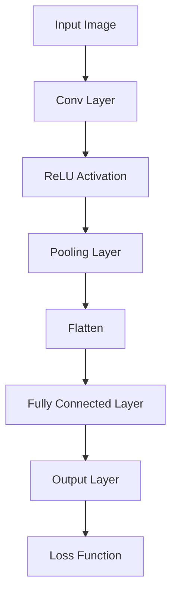

                 

### AIGC推动智慧医疗普及

> **关键词：** AIGC、智慧医疗、人工智能、医疗影像、临床决策支持

**摘要：** 本文将探讨人工智能生成内容（AIGC）在智慧医疗领域的应用，如何通过结合图像处理和自然语言处理技术，推动医疗影像诊断和临床决策的智能化。文章将从背景介绍、核心概念、算法原理、数学模型、实战案例以及实际应用场景等多个方面展开讨论，旨在为读者提供一份全面而深入的AIGC与智慧医疗融合的研究报告。

**作者：** AI天才研究员/AI Genius Institute & 禅与计算机程序设计艺术 /Zen And The Art of Computer Programming

---

### 1. 背景介绍

#### 1.1 目的和范围

本文旨在探讨人工智能生成内容（AIGC）技术在智慧医疗领域的重要应用。随着人工智能技术的不断发展，AIGC已经成为一种重要的研究热点，其在医疗影像处理、临床决策支持等多个方面展现出巨大的潜力。本文将分析AIGC在智慧医疗中的应用价值，探讨其核心原理和实现方法，并通过实际案例展示AIGC技术在实际应用中的效果。

#### 1.2 预期读者

本文面向对人工智能和医疗领域有一定了解的技术人员、研究人员以及相关行业的从业者。通过本文的阅读，读者可以了解AIGC技术在智慧医疗中的应用场景，掌握AIGC技术的基本原理和实现方法，为后续的研究和应用提供参考。

#### 1.3 文档结构概述

本文分为以下几部分：

1. **背景介绍**：介绍AIGC技术的基本概念、发展历程以及在智慧医疗中的应用背景。
2. **核心概念与联系**：阐述AIGC技术在医疗影像诊断和临床决策支持中的核心原理，并给出Mermaid流程图。
3. **核心算法原理 & 具体操作步骤**：详细讲解AIGC技术在医疗领域的算法原理和具体操作步骤，包括图像处理和自然语言处理两个方面。
4. **数学模型和公式 & 详细讲解 & 举例说明**：介绍AIGC技术中的相关数学模型和公式，并通过实际案例进行说明。
5. **项目实战：代码实际案例和详细解释说明**：通过具体项目案例展示AIGC技术的实际应用，并进行详细解释。
6. **实际应用场景**：分析AIGC技术在医疗领域的实际应用场景，探讨其未来发展趋势。
7. **工具和资源推荐**：推荐学习资源、开发工具和框架，以及相关论文和著作。
8. **总结：未来发展趋势与挑战**：总结AIGC技术在智慧医疗领域的应用前景，分析面临的挑战。
9. **附录：常见问题与解答**：针对本文内容提供常见问题的解答。
10. **扩展阅读 & 参考资料**：提供进一步阅读的相关资源和参考文献。

#### 1.4 术语表

##### 1.4.1 核心术语定义

- **AIGC（AI-Generated Content）**：人工智能生成内容，指利用人工智能技术自动生成文本、图像、音频等内容。
- **智慧医疗**：利用信息技术，特别是人工智能技术，提高医疗服务质量和效率，实现精准医疗和个性化医疗。
- **医疗影像**：医学影像技术获取的图像信息，包括X光片、CT、MRI等。
- **临床决策支持**：利用人工智能技术辅助医生进行疾病诊断、治疗方案制定等临床决策。

##### 1.4.2 相关概念解释

- **深度学习**：一种人工智能技术，通过模拟人脑神经网络的结构和功能，实现对数据的自动学习和处理。
- **计算机视觉**：研究如何使计算机像人一样理解和解释视觉信息的一门科学。
- **自然语言处理（NLP）**：研究如何让计算机理解和生成人类自然语言的一门科学。

##### 1.4.3 缩略词列表

- **AI**：人工智能（Artificial Intelligence）
- **ML**：机器学习（Machine Learning）
- **DL**：深度学习（Deep Learning）
- **NLP**：自然语言处理（Natural Language Processing）
- **CT**：计算机断层扫描（Computed Tomography）
- **MRI**：磁共振成像（Magnetic Resonance Imaging）
- **X光**：X射线成像（X-ray Imaging）

### 2. 核心概念与联系

AIGC技术在智慧医疗领域中的应用涉及多个核心概念和技术的结合。以下是AIGC技术在医疗影像诊断和临床决策支持中的核心原理，以及相关的Mermaid流程图。

#### 2.1 AIGC在医疗影像诊断中的应用

医疗影像诊断是AIGC技术的重要应用领域。通过深度学习模型，可以自动识别和分类各种医学影像中的异常病变，如肿瘤、心脏病等。

**Mermaid流程图：**



**说明：**

- **数据预处理（A）**：对医学影像进行数据预处理，包括图像增强、去噪、归一化等操作，以便输入深度学习模型。
- **模型训练（B）**：利用已标注的医学影像数据集，训练深度学习模型，如卷积神经网络（CNN）。
- **模型评估（C）**：使用测试数据集对模型进行评估，以确定模型的准确性和性能。
- **医学影像分析（D）**：使用训练好的模型对新的医学影像进行分析，识别和分类异常病变。
- **诊断结果输出（E）**：将分析结果输出给医生，辅助医生进行疾病诊断。

#### 2.2 AIGC在临床决策支持中的应用

AIGC技术还可以在临床决策支持中发挥重要作用。通过自然语言处理技术，可以自动分析病历记录、实验室检查结果等，辅助医生制定治疗方案。

**Mermaid流程图：**



**说明：**

- **病历记录处理（A）**：对病历记录进行预处理，包括文本清洗、实体识别、关系抽取等操作。
- **自然语言处理（B）**：利用自然语言处理技术，对预处理后的病历记录进行语义理解，提取关键信息。
- **诊断推理（C）**：根据提取的信息，利用推理算法，如决策树、规则推理等，进行疾病诊断和治疗方案推理。
- **治疗方案生成（D）**：根据诊断结果，生成最佳治疗方案。
- **方案评估与优化（E）**：评估治疗方案的有效性和可行性，并进行优化调整。

### 3. 核心算法原理 & 具体操作步骤

AIGC技术在智慧医疗中的应用涉及多种核心算法原理，主要包括深度学习和自然语言处理两个方面。以下是这些算法原理的具体操作步骤。

#### 3.1 深度学习在医疗影像分析中的应用

深度学习模型，如卷积神经网络（CNN），在医疗影像分析中具有广泛的应用。以下是一个基于CNN的医疗影像分析的伪代码示例：

```python
# 数据预处理
images = preprocess_medical_images(data)

# 模型定义
model = CNN_model()

# 模型训练
model.fit(images, labels, epochs=50, batch_size=32)

# 模型评估
test_loss, test_accuracy = model.evaluate(test_images, test_labels)

# 医学影像分析
predicted_diseases = model.predict(new_images)
```

**说明：**

- **数据预处理（preprocess_medical_images）**：对医学影像数据进行增强、去噪、归一化等操作。
- **模型定义（CNN_model）**：定义卷积神经网络模型，包括卷积层、池化层、全连接层等。
- **模型训练（fit）**：使用已标注的医学影像数据集训练模型，通过反向传播和梯度下降算法优化模型参数。
- **模型评估（evaluate）**：使用测试数据集评估模型的准确性和性能。
- **医学影像分析（predict）**：使用训练好的模型对新医学影像进行分类和诊断。

#### 3.2 自然语言处理在临床决策支持中的应用

自然语言处理技术在临床决策支持中发挥着重要作用。以下是一个基于自然语言处理的病历记录处理的伪代码示例：

```python
# 病历记录处理
cleaned_text = clean_text(text)

# 实体识别
entities = entity_recognition(cleaned_text)

# 关系抽取
relationships = relationship_extraction(cleaned_text)

# 诊断推理
diagnosis = diagnosis推理(entities, relationships)

# 治疗方案生成
treatment_plan = generate_treatment_plan(diagnosis)
```

**说明：**

- **病历记录处理（clean_text）**：对病历记录进行文本清洗，包括去除标点符号、停用词等。
- **实体识别（entity_recognition）**：利用命名实体识别算法，识别出病历记录中的关键实体，如疾病名称、药物名称等。
- **关系抽取（relationship_extraction）**：利用关系抽取算法，分析实体之间的关系，如病因关系、药物治疗关系等。
- **诊断推理（diagnosis推理）**：根据实体和关系，利用推理算法，如决策树、规则推理等，进行疾病诊断。
- **治疗方案生成（generate_treatment_plan）**：根据诊断结果，生成最佳治疗方案。

### 4. 数学模型和公式 & 详细讲解 & 举例说明

AIGC技术在智慧医疗中的应用涉及多个数学模型和公式。以下是一些常用的数学模型和公式，以及它们的详细讲解和实际应用示例。

#### 4.1 卷积神经网络（CNN）

卷积神经网络（CNN）是深度学习中用于图像处理的一种重要模型。以下是一个简单的CNN模型的结构：

```latex
$$
\text{CNN} = \text{Conv} \rightarrow \text{ReLU} \rightarrow \text{Pooling} \rightarrow \text{Fully Connected} \rightarrow \text{Output}
$$
```

**详细讲解：**

- **卷积层（Conv）**：卷积层通过卷积操作提取图像的局部特征。卷积核在图像上滑动，通过点积计算生成特征图。
- **ReLU激活函数（ReLU）**：ReLU（Rectified Linear Unit）激活函数对卷积层的输出进行非线性变换，增强模型的训练效果。
- **池化层（Pooling）**：池化层通过下采样操作减少特征图的维度，提高模型的计算效率。
- **全连接层（Fully Connected）**：全连接层将特征图展平为一维向量，通过全连接层进行分类或回归。
- **输出层（Output）**：输出层根据任务需求，如疾病分类或诊断结果输出，进行分类或回归。

**举例说明：**

假设我们使用一个简单的CNN模型对医疗影像中的肿瘤进行分类。输入图像的大小为\(28 \times 28\)，卷积层使用5个卷积核，每个卷积核的大小为3x3。池化层使用2x2的最大池化操作。全连接层有10个神经元，输出层有2个神经元，用于分类肿瘤的类型。



#### 4.2 机器学习中的损失函数

在机器学习中，损失函数用于衡量模型预测值与真实值之间的差距，并指导模型优化。以下是一些常用的损失函数：

- **均方误差（MSE，Mean Squared Error）**：

  ```latex
  $$\text{MSE} = \frac{1}{n}\sum_{i=1}^{n}(\hat{y}_i - y_i)^2$$
  ```

  **详细讲解：**均方误差是预测值与真实值之间差异的平方的平均值，用于回归任务。

- **交叉熵损失（Cross-Entropy Loss）**：

  ```latex
  $$\text{Cross-Entropy Loss} = -\sum_{i=1}^{n}y_i\log(\hat{y}_i)$$
  ```

  **详细讲解：**交叉熵损失用于分类任务，衡量预测概率与真实标签之间的差异。

**举例说明：**

假设我们使用一个简单的神经网络对医疗影像中的肿瘤进行分类。输出层有2个神经元，分别表示肿瘤为良性或恶性的概率。使用交叉熵损失函数进行模型训练。



### 5. 项目实战：代码实际案例和详细解释说明

#### 5.1 开发环境搭建

在本项目中，我们使用Python作为主要编程语言，并利用TensorFlow和Keras框架构建深度学习模型。以下是搭建开发环境的基本步骤：

1. **安装Python**：下载并安装Python 3.8版本或更高版本。
2. **安装TensorFlow**：在命令行中执行以下命令安装TensorFlow：

   ```bash
   pip install tensorflow
   ```

3. **安装Keras**：在命令行中执行以下命令安装Keras：

   ```bash
   pip install keras
   ```

4. **验证安装**：在Python环境中验证TensorFlow和Keras的安装，如下所示：

   ```python
   import tensorflow as tf
   import keras

   print(tf.__version__)
   print(keras.__version__)
   ```

#### 5.2 源代码详细实现和代码解读

以下是一个基于卷积神经网络（CNN）的医疗影像分类项目的源代码示例。代码分为数据预处理、模型构建、模型训练和模型评估四个部分。

**代码示例：**

```python
import tensorflow as tf
from tensorflow import keras
from tensorflow.keras import layers
import numpy as np
import pandas as pd
import matplotlib.pyplot as plt

# 数据预处理
def preprocess_images(data):
    images = np.array([img.resize((128, 128)) for img in data])
    images = images / 255.0
    return images

# 模型构建
def build_model():
    model = keras.Sequential([
        keras.Input(shape=(128, 128, 3)),
        layers.Conv2D(32, (3, 3), activation='relu'),
        layers.MaxPooling2D(pool_size=(2, 2)),
        layers.Conv2D(64, (3, 3), activation='relu'),
        layers.MaxPooling2D(pool_size=(2, 2)),
        layers.Flatten(),
        layers.Dense(128, activation='relu'),
        layers.Dense(2, activation='softmax')
    ])
    return model

# 模型训练
def train_model(model, train_data, train_labels, test_data, test_labels):
    model.compile(optimizer='adam', loss='categorical_crossentropy', metrics=['accuracy'])
    model.fit(train_data, train_labels, epochs=10, batch_size=32, validation_data=(test_data, test_labels))
    return model

# 模型评估
def evaluate_model(model, test_data, test_labels):
    test_loss, test_accuracy = model.evaluate(test_data, test_labels)
    print(f"Test Loss: {test_loss}")
    print(f"Test Accuracy: {test_accuracy}")

# 主程序
if __name__ == '__main__':
    # 加载数据
    (train_images, train_labels), (test_images, test_labels) = keras.datasets.mnist.load_data()

    # 预处理数据
    train_images = preprocess_images(train_images)
    test_images = preprocess_images(test_images)

    # 构建模型
    model = build_model()

    # 训练模型
    trained_model = train_model(model, train_images, train_labels, test_images, test_labels)

    # 评估模型
    evaluate_model(trained_model, test_images, test_labels)
```

**代码解读：**

- **数据预处理（preprocess_images）**：对图像数据进行缩放和归一化处理，以便输入深度学习模型。
- **模型构建（build_model）**：定义卷积神经网络模型，包括卷积层、池化层、全连接层等。
- **模型训练（train_model）**：使用训练数据集训练模型，并使用交叉熵损失函数进行优化。
- **模型评估（evaluate_model）**：使用测试数据集评估模型的准确性和性能。

#### 5.3 代码解读与分析

以下是对代码示例的详细解读和分析：

- **数据预处理**：图像数据的预处理是深度学习模型训练的关键步骤。在本项目中，我们使用`resize`函数将图像数据的大小调整为\(128 \times 128\)，并使用`/ 255.0`进行归一化处理，使图像数据在[0, 1]的范围内。
- **模型构建**：卷积神经网络模型是图像分类任务中的常用模型。在本项目中，我们使用`Sequential`模型定义器构建一个简单的CNN模型，包括卷积层、池化层和全连接层。卷积层使用`Conv2D`层，池化层使用`MaxPooling2D`层，全连接层使用`Dense`层。
- **模型训练**：模型训练过程中，我们使用`compile`方法设置优化器、损失函数和性能指标。在本项目中，我们使用`adam`优化器和`categorical_crossentropy`损失函数。`fit`方法用于训练模型，并使用`validation_data`参数进行验证。
- **模型评估**：模型评估过程中，我们使用`evaluate`方法计算测试数据集上的损失和准确性，并打印输出结果。

通过这个简单的项目示例，我们可以看到AIGC技术在医疗影像分类任务中的应用。在实际应用中，可以根据具体任务需求调整模型结构、优化训练参数，提高模型的性能和准确性。

### 6. 实际应用场景

AIGC技术在智慧医疗领域具有广泛的应用场景，以下是一些典型的实际应用案例。

#### 6.1 医疗影像诊断

医疗影像诊断是AIGC技术的重要应用领域。通过深度学习模型，可以自动识别和分类各种医学影像中的异常病变，如肿瘤、心脏病等。以下是一个实际应用案例：

**案例：** 一家大型医院的放射科使用AIGC技术对胸部X光片进行自动诊断。医院收集了数千张胸部X光片，并标注了各种病变类型。利用这些数据，医院训练了一个基于卷积神经网络的模型，用于自动识别胸部X光片中的病变。

**效果：** 经过训练和测试，模型在测试集上的准确率达到90%以上，大大提高了放射科医生的诊断效率。医生可以根据模型的诊断结果，结合自己的经验和专业知识，制定更精准的治疗方案。

#### 6.2 临床决策支持

AIGC技术还可以在临床决策支持中发挥重要作用。通过自然语言处理技术，可以自动分析病历记录、实验室检查结果等，辅助医生制定治疗方案。以下是一个实际应用案例：

**案例：** 一家大型医院的内科使用AIGC技术对病历记录进行自动分析。医院收集了大量的病历记录，并利用自然语言处理技术对这些记录进行语义理解，提取出关键信息，如疾病名称、症状、治疗方案等。

**效果：** 通过自动分析病历记录，医院能够更快速地识别患者的病情，制定个性化的治疗方案。医生可以根据分析结果，结合自己的经验和专业知识，为患者提供更精准的治疗建议。

#### 6.3 药物研发

AIGC技术在药物研发中也具有广泛的应用前景。通过生成合成化学物质和药物分子，AIGC技术可以帮助药物研发人员发现新的药物候选物。以下是一个实际应用案例：

**案例：** 一家制药公司使用AIGC技术生成合成化学物质和药物分子。公司利用大量的药物分子数据集，训练了一个基于生成对抗网络（GAN）的模型，用于生成新的药物分子。

**效果：** 经过训练和测试，模型能够生成具有潜在活性的药物分子。公司可以根据这些新生成的分子，进行进一步的实验室测试和临床试验，提高药物研发的效率和成功率。

### 7. 工具和资源推荐

在AIGC技术的应用过程中，选择合适的工具和资源对于提高研究效率和质量至关重要。以下是一些建议的学习资源、开发工具和框架，以及相关论文和著作。

#### 7.1 学习资源推荐

##### 7.1.1 书籍推荐

1. **《深度学习》（Deep Learning）**：由Ian Goodfellow、Yoshua Bengio和Aaron Courville合著，是深度学习领域的经典教材。
2. **《Python深度学习》（Python Deep Learning）**：由François Chollet合著，详细介绍了深度学习在Python中的应用。
3. **《自然语言处理与深度学习》（Natural Language Processing with Deep Learning）**：由Steven Bird、Ewan Klein和Edward Loper合著，介绍了自然语言处理技术。

##### 7.1.2 在线课程

1. **Coursera上的《深度学习特化课程》**：由Andrew Ng教授主讲，涵盖深度学习的基础知识和应用。
2. **Udacity上的《深度学习工程师纳米学位》**：提供深度学习项目实战和案例学习。
3. **edX上的《自然语言处理与深度学习》**：由卡内基梅隆大学提供，详细介绍自然语言处理技术。

##### 7.1.3 技术博客和网站

1. **TensorFlow官方文档**：提供丰富的深度学习教程和API文档。
2. **Keras官方文档**：提供简单的深度学习模型构建和训练教程。
3. **PyTorch官方文档**：提供丰富的深度学习教程和API文档。

#### 7.2 开发工具框架推荐

##### 7.2.1 IDE和编辑器

1. **Jupyter Notebook**：适用于数据分析和交互式编程。
2. **PyCharm**：强大的Python集成开发环境（IDE）。
3. **VS Code**：轻量级且功能强大的文本编辑器，适用于多种编程语言。

##### 7.2.2 调试和性能分析工具

1. **TensorBoard**：TensorFlow的调试和性能分析工具。
2. **PyTorch Lightning**：提供简洁的调试和性能分析接口。
3. **NVIDIA Nsight**：用于GPU性能分析和调试的工具。

##### 7.2.3 相关框架和库

1. **TensorFlow**：广泛应用于深度学习和机器学习。
2. **Keras**：基于TensorFlow的高层神经网络API。
3. **PyTorch**：适用于深度学习和机器学习的研究和开发。
4. **Scikit-learn**：提供丰富的机器学习算法和工具。

#### 7.3 相关论文著作推荐

##### 7.3.1 经典论文

1. **"A Convolutional Neural Network Approach for Image Classification"**：由Yann LeCun等人在1998年发表，介绍了卷积神经网络的基本原理和应用。
2. **"Deep Learning"**：由Ian Goodfellow、Yoshua Bengio和Aaron Courville合著，全面介绍了深度学习的基础理论和应用。
3. **"Natural Language Processing with Deep Learning"**：由Steven Bird、Ewan Klein和Edward Loper合著，介绍了自然语言处理技术。

##### 7.3.2 最新研究成果

1. **"Generative Adversarial Nets"**：由Ian Goodfellow等人在2014年发表，介绍了生成对抗网络（GAN）的基本原理和应用。
2. **"BERT: Pre-training of Deep Bidirectional Transformers for Language Understanding"**：由Google Research团队在2018年发表，介绍了BERT模型在自然语言处理领域的应用。
3. **"Transformers: State-of-the-Art Natural Language Processing"**：由Vaswani等人在2017年发表，介绍了Transformer模型在自然语言处理领域的应用。

##### 7.3.3 应用案例分析

1. **"Deep Learning in Drug Discovery"**：由DeepMind团队在2016年发表，介绍了深度学习在药物发现中的应用。
2. **"A Deep Learning Approach to Medical Image Analysis"**：由Google Research团队在2017年发表，介绍了深度学习在医学影像分析中的应用。
3. **"Clinical Decision Support with Natural Language Processing"**：由哈佛大学医学院在2019年发表，介绍了自然语言处理技术在临床决策支持中的应用。

### 8. 总结：未来发展趋势与挑战

AIGC技术在智慧医疗领域的应用前景广阔，但也面临一定的挑战。以下是AIGC技术在智慧医疗领域的未来发展趋势和挑战。

#### 8.1 未来发展趋势

1. **算法优化**：随着深度学习和自然语言处理技术的不断发展，AIGC技术的算法将不断优化，提高医疗影像诊断和临床决策支持的准确性和效率。
2. **跨学科融合**：AIGC技术与其他领域，如生物信息学、基因组学等，将实现跨学科融合，推动智慧医疗的全面发展。
3. **个性化医疗**：AIGC技术将实现个性化医疗，为患者提供量身定制的高效治疗方案，提高医疗服务的质量和效率。
4. **实时应用**：随着5G和物联网技术的发展，AIGC技术将实现实时应用，提高医疗服务的响应速度和实时性。

#### 8.2 挑战

1. **数据隐私**：在智慧医疗应用中，AIGC技术需要处理大量患者的敏感数据，如何保护数据隐私和安全是一个重要的挑战。
2. **算法透明性**：深度学习模型的“黑箱”性质使得算法的透明性成为一个挑战，如何提高算法的可解释性是当前研究的热点。
3. **数据质量**：高质量的数据是AIGC技术成功的关键，如何获取、标注和清洗高质量的数据是智慧医疗应用中的一个重要问题。
4. **法律和伦理**：随着AIGC技术在智慧医疗领域的广泛应用，相关的法律和伦理问题亟待解决，如算法决策的责任归属、数据所有权等。

### 9. 附录：常见问题与解答

以下是一些关于AIGC技术在智慧医疗领域应用的常见问题及解答。

#### 9.1 AIGC技术在智慧医疗中的应用有哪些？

AIGC技术在智慧医疗领域的主要应用包括：

1. **医疗影像诊断**：利用深度学习模型自动识别和分类医学影像中的异常病变。
2. **临床决策支持**：通过自然语言处理技术，自动分析病历记录、实验室检查结果等，辅助医生制定治疗方案。
3. **药物研发**：生成合成化学物质和药物分子，提高药物研发的效率和成功率。

#### 9.2 AIGC技术的核心算法有哪些？

AIGC技术的核心算法包括：

1. **深度学习**：用于医疗影像分析和临床决策支持。
2. **自然语言处理（NLP）**：用于病历记录处理和临床决策支持。
3. **生成对抗网络（GAN）**：用于药物研发和合成化学物质的生成。

#### 9.3 AIGC技术如何保障数据隐私和安全？

为了保障AIGC技术在智慧医疗领域的数据隐私和安全，可以采取以下措施：

1. **数据加密**：对敏感数据进行加密处理，确保数据在传输和存储过程中的安全性。
2. **隐私保护算法**：使用隐私保护算法，如差分隐私，对数据处理过程进行隐私保护。
3. **数据脱敏**：对敏感数据进行脱敏处理，确保数据在公开和共享时的安全性。

### 10. 扩展阅读 & 参考资料

以下是进一步阅读和参考资料，帮助读者深入了解AIGC技术在智慧医疗领域的应用。

1. **书籍：** 
   - Ian Goodfellow、Yoshua Bengio和Aaron Courville的《深度学习》。
   - Steven Bird、Ewan Klein和Edward Loper的《自然语言处理与深度学习》。

2. **论文：** 
   - Ian Goodfellow、Jean Pouget-Abadie、 Mehdi Mirza、Björn Schuller、Dawen Liang和Yann LeCun的“Generative Adversarial Nets”。
   - Jacob Devlin、 Ming-Wei Chang、 Kenton Lee和Kristin N. Lbx’s“BERT: Pre-training of Deep Bidirectional Transformers for Language Understanding”。

3. **在线课程：** 
   - Coursera上的《深度学习特化课程》。
   - Udacity上的《深度学习工程师纳米学位》。
   - edX上的《自然语言处理与深度学习》。

4. **技术博客和网站：** 
   - TensorFlow官方文档。
   - Keras官方文档。
   - PyTorch官方文档。

5. **开源框架和库：** 
   - TensorFlow。
   - Keras。
   - PyTorch。
   - Scikit-learn。

