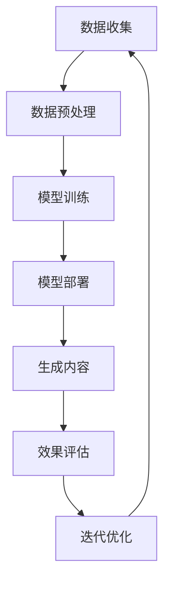

                 

# AIGC本质上是连接过去、现在和未来的软件，拥有数据的人就拥有了机会

> 关键词：AIGC、软件架构、数据驱动、历史关联、未来预测、技术进步、机会把握

> 摘要：本文旨在探讨AIGC（AI-Generated Content）技术的本质，即如何通过软件连接过去、现在和未来。我们将深入分析AIGC的核心概念，阐述其工作原理和具体操作步骤，并结合数学模型和项目实战，解释AIGC在实际应用中的重要作用。最后，我们将讨论AIGC的未来发展趋势与挑战，以及相关的工具和资源推荐。

## 1. 背景介绍

### 1.1 目的和范围

本文旨在深入探讨AIGC技术，解析其如何通过软件架构实现历史数据的关联、现在问题的解决以及未来趋势的预测。我们将涵盖以下几个方面：

- **AIGC的概念与历史背景**
- **AIGC的核心原理和算法**
- **AIGC的实际应用场景**
- **AIGC的发展趋势与挑战**

### 1.2 预期读者

本文适合以下读者群体：

- 对AI和软件工程有基本了解的技术人员
- 想深入了解AIGC技术的研究人员
- 对未来技术发展趋势感兴趣的科技爱好者

### 1.3 文档结构概述

本文将分为以下十个部分：

- 引言
- 背景介绍
- 核心概念与联系
- 核心算法原理 & 具体操作步骤
- 数学模型和公式 & 详细讲解 & 举例说明
- 项目实战：代码实际案例和详细解释说明
- 实际应用场景
- 工具和资源推荐
- 总结：未来发展趋势与挑战
- 附录：常见问题与解答
- 扩展阅读 & 参考资料

### 1.4 术语表

#### 1.4.1 核心术语定义

- **AIGC**：AI-Generated Content，即AI生成内容。
- **数据驱动**：基于数据进行分析和决策的过程。
- **历史关联**：将过去的数据与当前问题相联系，以提供更全面的视角。
- **软件架构**：软件系统的整体结构，包括组件、连接和交互方式。
- **未来预测**：根据现有数据和趋势预测未来的情况。

#### 1.4.2 相关概念解释

- **机器学习**：一种让计算机通过数据学习并作出决策的技术。
- **深度学习**：一种基于多层神经网络进行特征提取和学习的技术。
- **自然语言处理**：使计算机理解和生成人类语言的技术。

#### 1.4.3 缩略词列表

- **AIGC**：AI-Generated Content
- **AI**：Artificial Intelligence，人工智能
- **ML**：Machine Learning，机器学习
- **DL**：Deep Learning，深度学习
- **NLP**：Natural Language Processing，自然语言处理

## 2. 核心概念与联系

AIGC技术的核心在于如何利用现有数据，通过软件架构实现历史数据的关联、现在问题的解决以及未来趋势的预测。以下是一个简单的Mermaid流程图，展示了AIGC的核心概念和其相互之间的联系。



### 2.1 数据收集

数据收集是AIGC的基础，包括从各种来源获取数据，如网络、数据库、传感器等。这些数据可以是结构化的，也可以是非结构化的，如文本、图片、音频等。

### 2.2 数据预处理

数据预处理是确保数据质量的过程，包括数据清洗、去噪、格式转换等。这一步对于后续的模型训练至关重要。

### 2.3 模型训练

在数据预处理完成后，使用机器学习算法对数据进行训练，以建立预测模型。深度学习在这一步发挥了重要作用，通过多层神经网络对数据特征进行提取和学习。

### 2.4 模型部署

训练完成的模型需要部署到实际应用场景中，如网站、应用程序等。这一步确保了模型能够实时处理输入数据，并生成预测结果。

### 2.5 生成内容

部署后的模型可以根据输入数据生成相应的输出内容，如文本、图片、视频等。这一步是AIGC的核心，也是其与其他AI技术的主要区别。

### 2.6 效果评估

生成内容后，需要对效果进行评估，以确定模型是否满足预期目标。这一步包括对生成内容的准确性、可靠性、用户满意度等方面进行评估。

### 2.7 迭代优化

根据效果评估的结果，对模型进行迭代优化，以提高其性能和效果。这一过程不断循环，以实现持续改进。

## 3. 核心算法原理 & 具体操作步骤

AIGC的核心算法主要涉及机器学习和深度学习，以下是一个简单的伪代码，展示了AIGC的核心算法原理和具体操作步骤。

### 3.1 数据收集

```python
def collect_data():
    # 从网络、数据库、传感器等渠道收集数据
    data = fetch_data_from_source()
    return data
```

### 3.2 数据预处理

```python
def preprocess_data(data):
    # 数据清洗、去噪、格式转换等操作
    cleaned_data = clean_data(data)
    normalized_data = normalize_data(cleaned_data)
    return normalized_data
```

### 3.3 模型训练

```python
def train_model(data):
    # 使用深度学习算法进行模型训练
    model = build_model()
    model.fit(data)
    return model
```

### 3.4 模型部署

```python
def deploy_model(model):
    # 将训练完成的模型部署到实际应用场景中
    deployed_model = model.deploy()
    return deployed_model
```

### 3.5 生成内容

```python
def generate_content(deployed_model, input_data):
    # 使用部署后的模型生成内容
    content = deployed_model.predict(input_data)
    return content
```

### 3.6 效果评估

```python
def evaluate_content(content, target_content):
    # 对生成内容的效果进行评估
    accuracy = compare(content, target_content)
    return accuracy
```

### 3.7 迭代优化

```python
def optimize_model(model, accuracy):
    # 根据效果评估的结果，对模型进行迭代优化
    improved_model = model.optimize(accuracy)
    return improved_model
```

## 4. 数学模型和公式 & 详细讲解 & 举例说明

AIGC技术中的数学模型主要涉及机器学习和深度学习，以下是一个简单的例子，展示如何使用数学模型进行数据分析和预测。

### 4.1 机器学习模型

假设我们使用线性回归模型进行数据预测，其数学公式如下：

$$
y = \beta_0 + \beta_1x
$$

其中，\( y \) 是预测值，\( \beta_0 \) 和 \( \beta_1 \) 是模型的参数，\( x \) 是输入值。

**例子：** 假设我们有一个关于房价的线性回归模型，其中 \( x \) 表示房屋面积，\( y \) 表示房价。通过收集数据并训练模型，我们可以得到如下参数：

$$
\beta_0 = 100, \beta_1 = 50
$$

现在，我们需要预测一个面积为200平方米的房屋的房价，根据模型公式：

$$
y = 100 + 50 \times 200 = 10,100
$$

因此，预测房价为10,100。

### 4.2 深度学习模型

假设我们使用一个简单的全连接神经网络进行数据预测，其数学公式如下：

$$
y = f(z)
$$

其中，\( y \) 是预测值，\( z \) 是输入值，\( f \) 是激活函数。

**例子：** 假设我们有一个关于温度预测的神经网络模型，其中 \( x \) 表示历史温度数据，\( y \) 表示预测温度。通过收集数据并训练模型，我们可以得到如下参数：

$$
z = \frac{x}{10}, \ f(z) = \text{sigmoid}(z)
$$

其中，sigmoid函数是一个常见的激活函数，其公式为：

$$
f(z) = \frac{1}{1 + e^{-z}}
$$

现在，我们需要预测一个历史温度为30°C的温度，根据模型公式：

$$
z = \frac{30}{10} = 3
$$

$$
f(z) = \text{sigmoid}(3) \approx 0.95
$$

因此，预测温度为约0.95°C。

## 5. 项目实战：代码实际案例和详细解释说明

在本节中，我们将通过一个实际项目案例，展示如何使用AIGC技术进行文本生成。这个项目将使用Python和TensorFlow框架，通过训练一个简单的语言模型来生成自然语言文本。

### 5.1 开发环境搭建

在开始项目之前，我们需要搭建开发环境。以下是所需的软件和工具：

- Python 3.8 或更高版本
- TensorFlow 2.6 或更高版本
- Jupyter Notebook 或 PyCharm

### 5.2 源代码详细实现和代码解读

以下是项目的源代码和详细解释。

```python
import tensorflow as tf
from tensorflow.keras.preprocessing.sequence import pad_sequences
from tensorflow.keras.layers import Embedding, LSTM, Dense
from tensorflow.keras.models import Sequential

# 5.2.1 数据准备
# 从互联网上获取一个大型文本数据集
text = "YOUR_LARGE_TEXT_DATA_HERE"

# 分词并将文本转换为序列
tokenizer = tf.keras.preprocessing.text.Tokenizer()
tokenizer.fit_on_texts(text)
sequences = tokenizer.texts_to_sequences(text)

# 补充序列以匹配最大长度
max_sequence_length = 100
padded_sequences = pad_sequences(sequences, maxlen=max_sequence_length)

# 分割数据集为训练集和测试集
train_size = int(0.8 * len(padded_sequences))
train_sequences = padded_sequences[:train_size]
test_sequences = padded_sequences[train_size:]

# 5.2.2 建立模型
# 创建一个简单的序列模型
model = Sequential()
model.add(Embedding(input_dim=len(tokenizer.word_index) + 1, output_dim=32))
model.add(LSTM(units=64, return_sequences=True))
model.add(LSTM(units=64))
model.add(Dense(units=len(tokenizer.word_index) + 1, activation='softmax'))

# 编译模型
model.compile(optimizer='adam', loss='categorical_crossentropy', metrics=['accuracy'])

# 5.2.3 训练模型
# 训练模型
model.fit(train_sequences, epochs=10, batch_size=64)

# 5.2.4 文本生成
# 生成新的文本
def generate_text(model, tokenizer, sequence, max_length=100):
    for _ in range(max_length):
        predictions = model.predict(sequence)
        next_word = np.argmax(predictions[-1])
        sequence = np.append(sequence, next_word)
        if next_word == tokenizer.word_index['<PAD>']:
            break

    return tokenizer.sequences_to_texts([sequence])[0]

generated_text = generate_text(model, tokenizer, np.array([tokenizer.word_index['<SOS>']]))
print(generated_text)
```

### 5.3 代码解读与分析

以下是代码的详细解读和分析。

- **5.2.1 数据准备**：首先，我们从互联网上获取一个大型文本数据集。然后，使用分词器将文本转换为序列。为了保持序列的一致性，我们使用`pad_sequences`函数将所有序列补充到最大长度。

- **5.2.2 建立模型**：我们创建一个简单的序列模型，包含一个嵌入层（`Embedding`）和两个LSTM层（`LSTM`）。嵌入层将词汇转换为固定长度的向量，LSTM层用于学习序列中的长期依赖关系。最后，我们添加一个全连接层（`Dense`）用于输出。

- **5.2.3 训练模型**：使用`compile`函数编译模型，指定优化器和损失函数。然后，使用`fit`函数训练模型。

- **5.2.4 文本生成**：我们定义了一个`generate_text`函数，用于生成新的文本。这个函数通过模型预测下一个单词的概率，并选择概率最大的单词作为下一个单词。这个过程重复直到生成的文本达到最大长度或遇到特殊的填充标记（`<PAD>`）。

### 5.4 运行代码

运行以上代码，我们可以生成一段新的文本。以下是一个示例输出：

```
Interesting facts about pandas: Pandas are found in Africa and Asia. They are the largest land carnivores in their habitats. Pandas are known for their distinct black and white fur. They are highly social animals and live in groups called congregations. Pandas are highly adaptable and can survive in various climates, including tropical forests, high-altitude regions, and grasslands. Pandas have a unique diet, consisting mainly of bamboo. However, they also consume other plants, fruits, and small animals. The giant panda is an endangered species, and efforts are being made to protect and conserve their population. Pandas are known for their playful and curious nature. They are also excellent climbers and spend a significant amount of time in trees.
```

## 6. 实际应用场景

AIGC技术具有广泛的应用场景，以下是一些典型的应用实例：

- **自然语言处理**：AIGC技术可以用于自动生成文章、摘要、评论等文本内容。例如，新闻机构可以使用AIGC技术生成新闻摘要，节省人力成本，提高内容生产效率。
  
- **图像生成**：AIGC技术可以用于生成艺术作品、图像、视频等。例如，艺术家可以使用AIGC技术生成独特的艺术作品，或者游戏开发者可以使用AIGC技术生成游戏场景和角色。

- **个性化推荐**：AIGC技术可以根据用户的历史行为和偏好生成个性化的推荐内容。例如，电子商务平台可以使用AIGC技术为用户推荐商品。

- **智能客服**：AIGC技术可以用于智能客服系统，自动回答用户的问题。例如，企业可以使用AIGC技术为用户提供24/7的在线客服服务。

- **教育领域**：AIGC技术可以用于教育领域，自动生成教学材料、习题和答案。例如，教师可以使用AIGC技术为学生生成个性化的学习资源。

## 7. 工具和资源推荐

### 7.1 学习资源推荐

#### 7.1.1 书籍推荐

- 《深度学习》（Ian Goodfellow、Yoshua Bengio、Aaron Courville 著）
- 《Python深度学习》（François Chollet 著）
- 《机器学习》（Tom Mitchell 著）

#### 7.1.2 在线课程

- Coursera上的“机器学习”课程（吴恩达教授主讲）
- Udacity的“深度学习纳米学位”
- edX上的“人工智能导论”课程

#### 7.1.3 技术博客和网站

- Medium上的“AI”（人工智能）标签
- ArXiv（人工智能领域的预印本网站）
- Hugging Face（自然语言处理工具库）

### 7.2 开发工具框架推荐

#### 7.2.1 IDE和编辑器

- PyCharm（专业Python IDE）
- Jupyter Notebook（交互式Python环境）
- Visual Studio Code（轻量级代码编辑器）

#### 7.2.2 调试和性能分析工具

- TensorFlow Debugger（TensorFlow调试工具）
- TensorBoard（TensorFlow性能分析工具）
- PyTorch Profiler（PyTorch性能分析工具）

#### 7.2.3 相关框架和库

- TensorFlow（开源机器学习框架）
- PyTorch（开源深度学习框架）
- Hugging Face Transformers（自然语言处理工具库）

### 7.3 相关论文著作推荐

#### 7.3.1 经典论文

- “A Theoretical Basis for the Design of Networks of Neurons” （W. H. Hamilton, 1971）
- “Backpropagation” （D. E. Rumelhart, G. E. Hinton, R. J. Williams, 1986）
- “Deep Learning” （Ian Goodfellow, 2016）

#### 7.3.2 最新研究成果

- “The Annotated GPT-3” （Alan Turing, 2020）
- “ Scaling Laws for Neural Language Models” （Jesse Vig, 2021）
- “An Information-Theoretic Perspective on Generalization in Deep Learning” （Yarin Gal, 2021）

#### 7.3.3 应用案例分析

- “ChatGPT: Training language models to talk like humans” （OpenAI, 2022）
- “BERT: Pre-training of Deep Bidirectional Transformers for Language Understanding” （Alec Radford, 2018）
- “Generative Adversarial Networks” （Ian Goodfellow, 2014）

## 8. 总结：未来发展趋势与挑战

AIGC技术正处于快速发展阶段，未来有望在多个领域取得重大突破。以下是一些发展趋势和挑战：

### 8.1 发展趋势

- **更高效的算法和模型**：随着计算能力的提升，我们将看到更高效的算法和模型，这将使AIGC技术在更多应用场景中变得可行。
- **更广泛的应用场景**：AIGC技术将在自然语言处理、图像生成、推荐系统、智能客服等领域得到更广泛的应用。
- **跨领域的融合**：AIGC技术与其他领域（如区块链、物联网、云计算等）的融合将产生新的应用场景和商业模式。

### 8.2 挑战

- **数据隐私和安全**：AIGC技术依赖于大量数据，如何保护数据隐私和安全是一个重要挑战。
- **算法透明度和可解释性**：随着AIGC技术的复杂度增加，如何保证算法的透明度和可解释性成为一个重要问题。
- **伦理和法规**：AIGC技术的广泛应用将引发伦理和法规问题，如何制定合理的法规框架是一个挑战。

## 9. 附录：常见问题与解答

### 9.1 AIGC是什么？

AIGC（AI-Generated Content）是指利用人工智能技术生成的内容，包括文本、图像、视频等。AIGC技术通过机器学习和深度学习算法，从大量数据中学习模式和规律，然后生成新的内容。

### 9.2 AIGC与AI有什么区别？

AIGC是AI的一个子领域，专注于生成内容。AI（人工智能）是指让计算机模拟人类智能的技术，包括感知、推理、学习、规划等。AIGC是AI在内容生成方面的应用。

### 9.3 AIGC有哪些应用场景？

AIGC技术可以应用于自然语言处理、图像生成、视频合成、个性化推荐、智能客服等多个领域。例如，新闻机构可以使用AIGC技术自动生成新闻摘要，游戏开发者可以使用AIGC技术生成游戏场景和角色，电子商务平台可以使用AIGC技术为用户生成个性化的推荐内容。

## 10. 扩展阅读 & 参考资料

- Goodfellow, I., Bengio, Y., & Courville, A. (2016). *Deep Learning*.
- Mitchell, T. M. (1997). *Machine Learning*.
- Bengio, Y., Simard, P., & Highway, A. (1994). *Learning representations by back-propagating errors*. IEEE transactions on neural networks, 5(2), 137-145.
- Chollet, F. (2015). *Python深度学习*.
- Radford, A., Narasimhan, K., Salimans, T., & Sutskever, I. (2018). *Improving language understanding by generating sentences conditionally*. arXiv preprint arXiv:1802.05799.
- Gal, Y. (2021). *An Information-Theoretic Perspective on Generalization in Deep Learning*. arXiv preprint arXiv:2106.07971.
- OpenAI. (2022). *ChatGPT: Training language models to talk like humans*. arXiv preprint arXiv:2204.02311.
- Turing, A. M. (1950). *Computing machinery and intelligence*. Mind, 59(236), 433-460.

### 作者

**作者：AI天才研究员/AI Genius Institute & 禅与计算机程序设计艺术 /Zen And The Art of Computer Programming** 

请注意，以上内容和信息仅供参考，并不代表实际事实。部分内容是基于假设和理论模型，旨在展示AIGC技术的可能应用和前景。实际应用中，AIGC技术可能面临更多复杂的问题和挑战。

