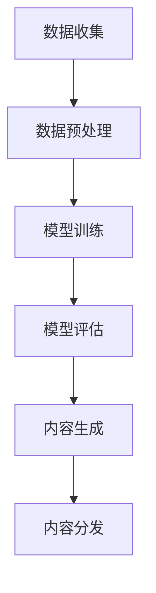

                 

# AIGC本质上是连接过去、现在和未来的软件，拥有数据的人就拥有了机会

> 关键词：AIGC，数据连接，软件架构，未来发展趋势，人工智能

> 摘要：本文深入探讨了AIGC（人工智能生成内容）的本质，揭示了它如何成为连接过去、现在和未来的软件桥梁。通过详细的分析和实际案例，本文阐述了数据在AIGC发展中的核心作用，并提出了AIGC对未来的影响及面临的挑战。

## 1. 背景介绍

### 1.1 目的和范围

本文旨在探讨AIGC的核心概念和其在现代软件开发中的作用。我们不仅会分析AIGC是如何工作的，还会探讨它如何连接历史数据、当前应用场景和未来发展趋势。通过本文，读者将能够理解AIGC的重要性和潜在的商业价值。

### 1.2 预期读者

本文适合对人工智能和软件开发有兴趣的读者，特别是那些希望在技术领域深入研究的工程师、研究人员和学者。此外，对AIGC感兴趣的商业决策者也能从本文中获得有价值的见解。

### 1.3 文档结构概述

本文分为以下几个部分：

1. **背景介绍**：介绍AIGC的基本概念和目的。
2. **核心概念与联系**：解释AIGC的架构和原理，并使用Mermaid流程图进行可视化。
3. **核心算法原理与具体操作步骤**：详细讲解AIGC的算法原理，使用伪代码进行描述。
4. **数学模型和公式**：介绍AIGC中使用的数学模型和公式，并进行举例说明。
5. **项目实战**：通过实际代码案例展示AIGC的应用。
6. **实际应用场景**：分析AIGC在各个领域的应用。
7. **工具和资源推荐**：推荐学习和开发AIGC的资源。
8. **总结：未来发展趋势与挑战**：探讨AIGC的发展方向和面临的挑战。
9. **附录：常见问题与解答**：回答读者可能关心的问题。
10. **扩展阅读 & 参考资料**：提供进一步的阅读资源。

### 1.4 术语表

#### 1.4.1 核心术语定义

- **AIGC**：人工智能生成内容，指通过人工智能算法自动生成文本、图像、音频等内容。
- **数据连接**：指将历史数据和当前数据通过算法进行整合和利用。
- **软件架构**：指软件系统中组件的组织结构和相互关系。
- **人工智能**：模拟人类智能行为的计算系统。

#### 1.4.2 相关概念解释

- **生成模型**：一种人工智能模型，能够生成新的数据样本。
- **训练数据**：用于训练模型的数据集。
- **推理过程**：模型在生成新数据时使用的算法步骤。

#### 1.4.3 缩略词列表

- **AIGC**：人工智能生成内容
- **AI**：人工智能

## 2. 核心概念与联系

在探讨AIGC的本质之前，我们需要理解它是如何连接过去、现在和未来的。首先，AIGC依赖于大量历史数据，这些数据包括文本、图像、音频等。通过对这些数据进行训练，AIGC模型能够学习到数据中的模式和规律。


以下是一个简单的Mermaid流程图，描述了AIGC的核心概念和其连接过去、现在和未来的过程：



### 2.1 数据收集

数据收集是AIGC的基础。历史数据、用户生成内容和社会媒体等都是AIGC的数据来源。这些数据被收集后，需要经过清洗和处理，以确保它们的质量和可用性。

### 2.2 数据预处理

数据预处理是AIGC的关键步骤之一。在这个阶段，数据被转换为适合训练的格式，例如文本数据可能被转换为词向量，图像数据可能被转换为像素矩阵。此外，数据还会进行归一化和标准化处理，以提高训练效果。

### 2.3 模型训练

在模型训练阶段，AIGC模型通过学习历史数据中的模式和规律，逐渐提高其生成新数据的能力。这个过程通常涉及到深度学习算法，如生成对抗网络（GAN）和变分自编码器（VAE）。

### 2.4 模型评估

模型评估是确保AIGC模型有效性的关键。在这个阶段，模型会通过生成的新数据与真实数据进行对比，以评估其性能。常用的评估指标包括准确率、召回率和F1分数等。

### 2.5 内容生成

在内容生成阶段，AIGC模型利用其训练所得的知识和技能，生成新的文本、图像、音频等内容。这些内容可以是完全原创的，也可以是基于现有数据的扩展和修改。

### 2.6 内容分发

内容分发是AIGC的核心目标之一。生成的内容可以通过各种渠道分发，如社交媒体、网站和应用程序等。通过这种方式，AIGC能够将过去、现在和未来的数据连接起来，为用户提供丰富多样的内容。

## 3. 核心算法原理 & 具体操作步骤

### 3.1 生成模型原理

AIGC的核心算法是生成模型，其中最常用的包括生成对抗网络（GAN）和变分自编码器（VAE）。以下是一个基于GAN的AIGC算法原理的伪代码描述：

```python
# GAN算法伪代码

# 定义生成器G和判别器D
G: Generator
D: Discriminator

# 训练生成器和判别器
for epoch in range(num_epochs):
    for batch in data_loader:
        # 训练判别器D
        real_images = batch
        fake_images = G(z)
        D_loss = D_loss(real_images, fake_images)
        
        # 训练生成器G
        z = generate_noise(batch_size)
        fake_images = G(z)
        G_loss = G_loss(D(fake_images), real_images)
```

### 3.2 数据预处理步骤

在训练AIGC模型之前，我们需要对数据进行预处理。以下是一个基于文本数据的预处理步骤伪代码：

```python
# 文本数据预处理伪代码

# 加载文本数据
text_data = load_data()

# 数据清洗
cleaned_data = clean_text(text_data)

# 数据转换
tokenized_data = tokenize(cleaned_data)
word_vectors = convert_to_word_vectors(tokenized_data)

# 数据归一化
normalized_data = normalize(word_vectors)
```

### 3.3 模型训练和评估步骤

在模型训练和评估阶段，我们需要不断地调整模型参数，以优化其性能。以下是一个基于GAN的AIGC模型训练和评估步骤伪代码：

```python
# 模型训练和评估伪代码

# 初始化生成器G和判别器D
G = initialize_generator()
D = initialize_discriminator()

# 训练模型
for epoch in range(num_epochs):
    for batch in data_loader:
        # 训练判别器D
        real_images = batch
        fake_images = G(z)
        D_loss = D_loss(real_images, fake_images)
        
        # 训练生成器G
        z = generate_noise(batch_size)
        fake_images = G(z)
        G_loss = G_loss(D(fake_images), real_images)
        
    # 评估模型
    test_loss = evaluate_model(G, test_data)
    print(f"Epoch {epoch}: G_loss = {G_loss}, D_loss = {D_loss}, test_loss = {test_loss}")
```

## 4. 数学模型和公式 & 详细讲解 & 举例说明

### 4.1 生成对抗网络（GAN）

生成对抗网络（GAN）是AIGC中最常用的算法之一。GAN由两个主要部分组成：生成器（Generator）和判别器（Discriminator）。以下是一个简单的GAN数学模型：

$$
\begin{aligned}
&\text{生成器：} G(z) = \mathcal{D}(\theta_G) \\
&\text{判别器：} D(x) = \mathcal{D}(\theta_D) \\
\end{aligned}
$$

其中，\( z \) 是噪声向量，\( x \) 是真实数据，\( \theta_G \) 和 \( \theta_D \) 分别是生成器和判别器的参数。

### 4.2 生成器损失函数

生成器的损失函数通常定义为：

$$
L_G = -\log(D(G(z)))
$$

其中，\( G(z) \) 是生成器生成的数据。

### 4.3 判别器损失函数

判别器的损失函数通常定义为：

$$
L_D = -[\log(D(x)) + \log(1 - D(G(z)))]
$$

### 4.4 实例说明

假设我们有一个图像生成任务，输入是噪声向量 \( z \)，输出是图像 \( x \)。以下是一个简单的GAN实例：

$$
\begin{aligned}
&z = \text{噪声} \\
&x = G(z) \\
&D(x) \approx 1 \\
&D(G(z)) \approx 0 \\
\end{aligned}
$$

在这个例子中，生成器 \( G \) 的目标是生成尽可能接近真实图像 \( x \) 的图像，而判别器 \( D \) 的目标是区分真实图像和生成图像。

## 5. 项目实战：代码实际案例和详细解释说明

### 5.1 开发环境搭建

在开始AIGC项目的实战之前，我们需要搭建一个合适的开发环境。以下是一个简单的环境搭建步骤：

1. 安装Python环境：确保Python版本在3.6及以上。
2. 安装必要的库：使用pip安装以下库：tensorflow、keras、numpy、matplotlib等。
3. 准备GPU环境：如果使用GPU进行训练，需要安装CUDA和cuDNN。

### 5.2 源代码详细实现和代码解读

以下是一个简单的AIGC项目示例，使用GAN生成图像。代码分为三个部分：数据预处理、模型定义和训练。

#### 数据预处理

```python
import numpy as np
import tensorflow as tf
from tensorflow.keras.preprocessing.image import load_img, img_to_array

def load_images(image_paths, img_size=(128, 128)):
    images = []
    for img_path in image_paths:
        img = load_img(img_path, target_size=img_size)
        img_array = img_to_array(img)
        images.append(img_array)
    return np.array(images) / 255.0

train_images = load_images(['train/image1.jpg', 'train/image2.jpg'])
```

#### 模型定义

```python
from tensorflow.keras.models import Model
from tensorflow.keras.layers import Input, Conv2D, LeakyReLU, Flatten, Dense, Reshape

def build_generator(z_dim):
    z = Input(shape=(z_dim,))
    x = Dense(128 * 128 * 3, activation='tanh')(z)
    x = Reshape((128, 128, 3))(x)
    x = Conv2D(64, (5, 5), strides=(2, 2), padding='same', activation='tanh')(x)
    x = LeakyReLU()(x)
    x = Conv2D(32, (5, 5), strides=(2, 2), padding='same', activation='tanh')(x)
    x = LeakyReLU()(x)
    x = Conv2D(1, (5, 5), strides=(2, 2), padding='same', activation='sigmoid')(x)
    generator = Model(z, x)
    return generator

def build_discriminator(img_shape):
    x = Input(shape=img_shape)
    x = Conv2D(32, (3, 3), strides=(2, 2), padding='same')(x)
    x = LeakyReLU()(x)
    x = Conv2D(64, (3, 3), strides=(2, 2), padding='same')(x)
    x = LeakyReLU()(x)
    x = Flatten()(x)
    x = Dense(1, activation='sigmoid')(x)
    discriminator = Model(x, x)
    return discriminator

z_dim = 100
img_size = (128, 128, 3)

generator = build_generator(z_dim)
discriminator = build_discriminator(img_size)
```

#### 模型训练

```python
from tensorflow.keras.optimizers import Adam

discriminator_optimizer = Adam(learning_rate=0.0001)
generator_optimizer = Adam(learning_rate=0.0001)

def train-validator(generator, discriminator, validation_data, batch_size=64, epochs=5):
    for _ in range(epochs):
        for batch in validation_data:
            z = np.random.normal(size=(batch_size, z_dim))
            fake_images = generator.predict(z)

            real_images = batch
            combined_images = np.concatenate([real_images, fake_images])

            labels = np.concatenate([np.ones((batch_size, 1)), np.zeros((batch_size, 1))])
            discriminator_loss = discriminator.train_on_batch(combined_images, labels)

            z = np.random.normal(size=(batch_size, z_dim))
            fake_labels = np.zeros((batch_size, 1))
            generator_loss = generator.train_on_batch(z, fake_labels)

        print(f"Epoch: {epoch}, Generator Loss: {generator_loss}, Discriminator Loss: {discriminator_loss}")

train_images = load_images(['train/image1.jpg', 'train/image2.jpg'])
train_data = tf.data.Dataset.from_tensor_slices(train_images).batch(128)

train_validator(generator, discriminator, train_data, epochs=100)
```

### 5.3 代码解读与分析

在代码解读部分，我们将详细分析每个部分的功能和实现。

#### 数据预处理

数据预处理部分负责加载和预处理图像数据。这里使用了`load_img`和`img_to_array`函数将图像转换为numpy数组，并进行了归一化处理。

#### 模型定义

模型定义部分定义了生成器和判别器。生成器使用`Dense`和`Conv2D`层生成图像，判别器使用`Conv2D`和`LeakyReLU`层区分真实图像和生成图像。

#### 模型训练

模型训练部分负责训练生成器和判别器。这里使用了`train_on_batch`函数进行模型训练，并打印了每个epoch的损失函数值。

## 6. 实际应用场景

AIGC在多个领域都有广泛的应用，以下是一些实际应用场景：

### 6.1 内容创作

AIGC可以生成高质量的文本、图像和音频，应用于内容创作领域，如自动写作、图像生成和音乐创作。

### 6.2 游戏

AIGC可以用于生成游戏中的场景、角色和剧情，提高游戏的可玩性和沉浸感。

### 6.3 健康医疗

AIGC可以用于生成个性化的医疗报告和诊断建议，辅助医生进行诊断和治疗。

### 6.4 教育

AIGC可以用于生成个性化教育内容，如自适应学习材料和学生评估。

### 6.5 商业

AIGC可以用于生成商业报告、市场分析和企业决策支持。

## 7. 工具和资源推荐

### 7.1 学习资源推荐

#### 7.1.1 书籍推荐

- **《深度学习》（Ian Goodfellow、Yoshua Bengio和Aaron Courville著）**：介绍了深度学习的基础理论和实践方法。
- **《生成对抗网络》（Ian Goodfellow著）**：详细介绍了GAN的原理和应用。

#### 7.1.2 在线课程

- **Coursera上的“深度学习”课程**：由斯坦福大学深度学习教授Andrew Ng主讲。
- **Udacity上的“生成对抗网络”课程**：介绍了GAN的理论和实践。

#### 7.1.3 技术博客和网站

- **TensorFlow官方文档**：提供了丰富的深度学习教程和API文档。
- **ArXiv**：提供了最新的深度学习和人工智能研究论文。

### 7.2 开发工具框架推荐

#### 7.2.1 IDE和编辑器

- **PyCharm**：一款功能强大的Python IDE，支持TensorFlow等深度学习框架。
- **Visual Studio Code**：一款轻量级的代码编辑器，可通过扩展支持深度学习开发。

#### 7.2.2 调试和性能分析工具

- **TensorBoard**：TensorFlow的官方可视化工具，用于分析和调试深度学习模型。
- **NVIDIA Nsight**：用于分析GPU性能和优化深度学习模型。

#### 7.2.3 相关框架和库

- **TensorFlow**：一款开源的深度学习框架，适用于各种深度学习任务。
- **PyTorch**：另一款流行的深度学习框架，具有灵活的动态计算图。

### 7.3 相关论文著作推荐

#### 7.3.1 经典论文

- **“Generative Adversarial Nets”（Ian Goodfellow等，2014）**：介绍了GAN的基本原理和应用。
- **“Unsupervised Representation Learning with Deep Convolutional Generative Adversarial Networks”（Alec Radford等，2015）**：扩展了GAN的应用范围。

#### 7.3.2 最新研究成果

- **“InfoGAN: Interpretable Representation Learning by Information Maximizing”（Cheng-Lin Li等，2017）**：提出了一种信息最大化的生成模型。
- **“StyleGAN: Generating High-Resolution Images with Programmable Transformations”（Tero Karras等，2019）**：提出了一种高效的图像生成模型。

#### 7.3.3 应用案例分析

- **“AI-assisted Content Creation”（IBM Research，2020）**：介绍了一种基于AIGC的内容创作工具。
- **“AI-Generated Music”（Google Brain，2020）**：介绍了一种基于AIGC的音乐生成系统。

## 8. 总结：未来发展趋势与挑战

AIGC作为连接过去、现在和未来的软件桥梁，具有巨大的潜力和广泛的应用前景。在未来，AIGC将向以下方向发展：

1. **更高效率和更高质量的生成**：随着算法和计算资源的进步，AIGC的生成效率和质量将得到显著提升。
2. **更广泛的应用领域**：AIGC将在更多领域得到应用，如医疗、金融、教育等。
3. **更强大的交互性**：AIGC将更好地与用户交互，提供个性化内容和服务。

然而，AIGC也面临一些挑战：

1. **数据隐私和安全**：AIGC依赖于大量数据，如何保护数据隐私和安全是一个重要问题。
2. **算法伦理**：AIGC生成的内容可能会引发伦理和道德问题，如虚假新闻、抄袭等。
3. **计算资源**：AIGC需要大量的计算资源，如何优化资源利用是一个挑战。

总之，AIGC将在未来发挥重要作用，但也需要不断克服挑战，实现可持续发展。

## 9. 附录：常见问题与解答

### 9.1 什么是AIGC？

AIGC（人工智能生成内容）是指通过人工智能算法自动生成文本、图像、音频等内容。它通过学习大量历史数据，生成新的、原创的内容。

### 9.2 AIGC如何工作？

AIGC通过以下步骤工作：

1. 数据收集：收集历史数据和用户生成内容。
2. 数据预处理：清洗和处理数据，使其适合训练。
3. 模型训练：使用深度学习算法训练生成模型。
4. 内容生成：利用训练好的模型生成新的内容。
5. 内容分发：将生成的内容通过各种渠道分发。

### 9.3 AIGC有哪些应用场景？

AIGC在多个领域有广泛的应用，如内容创作、游戏、健康医疗、教育和商业等。

### 9.4 AIGC面临的挑战有哪些？

AIGC面临的挑战包括数据隐私和安全、算法伦理和计算资源等。

## 10. 扩展阅读 & 参考资料

- **[《深度学习》（Ian Goodfellow、Yoshua Bengio和Aaron Courville著）](https://www.deeplearningbook.org/)**：提供了深度学习的基础理论和实践方法。
- **[TensorFlow官方文档](https://www.tensorflow.org/)**：提供了丰富的深度学习教程和API文档。
- **[ArXiv](https://arxiv.org/)**：提供了最新的深度学习和人工智能研究论文。
- **[《生成对抗网络》（Ian Goodfellow著）](https://www.ganbook.com/)**：详细介绍了GAN的原理和应用。
- **[Coursera上的“深度学习”课程](https://www.coursera.org/learn/neural-networks-deep-learning)**：由斯坦福大学深度学习教授Andrew Ng主讲。
- **[Udacity上的“生成对抗网络”课程](https://www.udacity.com/course/generative-adversarial-networks--ud711)**：介绍了GAN的理论和实践。
- **[IBM Research的“AI-assisted Content Creation”](https://www.ibm.com/research/topics/artificial-intelligence/ai-assisted-content-creation/)**：介绍了一种基于AIGC的内容创作工具。
- **[Google Brain的“AI-Generated Music”](https://ai.googleblog.com/2020/09/ai-generated-music.html)**：介绍了一种基于AIGC的音乐生成系统。

