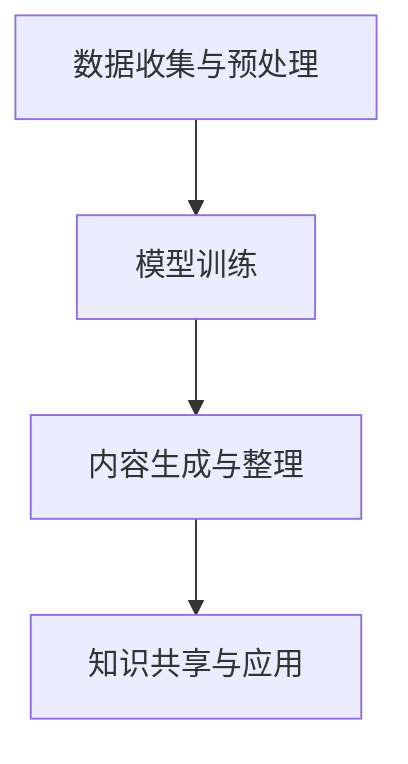

                 

# AIGC重新定义知识管理

> **关键词：** AIGC、知识管理、人工智能、自然语言处理、数据结构、机器学习、神经网络、深度学习、编程语言、架构设计、算法优化。

> **摘要：** 本文将深入探讨AIGC（AI-Generated Content）如何重新定义知识管理，包括其核心概念、应用场景、技术架构和未来趋势。我们将通过逐步分析，展示AIGC如何通过自动化、智能化的内容生成和整理，提升知识管理的效率和质量，为企业和个人带来新的机遇和挑战。

## 1. 背景介绍

### 1.1 目的和范围

本文旨在探讨AIGC在知识管理中的应用，分析其核心概念、技术原理和应用场景，并展望未来的发展趋势。我们希望读者能够通过本文对AIGC有更深入的了解，认识到其在知识管理领域的重要性和潜力。

### 1.2 预期读者

本文适合对人工智能、自然语言处理和知识管理有一定了解的读者，包括企业IT人员、研发工程师、数据科学家、AI研究人员和教育工作者等。

### 1.3 文档结构概述

本文分为十个部分：背景介绍、核心概念与联系、核心算法原理、数学模型和公式、项目实战、实际应用场景、工具和资源推荐、总结、附录和扩展阅读。每个部分都将逐步深入，详细阐述AIGC在知识管理中的应用。

### 1.4 术语表

#### 1.4.1 核心术语定义

- **AIGC（AI-Generated Content）：** 指由人工智能自动生成的内容，包括文本、图像、音频、视频等多种形式。
- **知识管理：** 指通过收集、整理、存储、共享和应用知识，以提高组织或个人的竞争力和创新能力。
- **自然语言处理（NLP）：** 指计算机模拟人类语言理解和使用的过程，包括文本解析、语义理解、语言生成等。

#### 1.4.2 相关概念解释

- **机器学习：** 指计算机通过数据学习，自动改进性能的过程。
- **神经网络：** 模拟人脑神经元结构和功能的计算模型。
- **深度学习：** 一种特殊的神经网络模型，通过多层非线性变换来提取特征。

#### 1.4.3 缩略词列表

- **NLP：** 自然语言处理
- **ML：** 机器学习
- **DL：** 深度学习
- **AIGC：** AI-Generated Content

## 2. 核心概念与联系

AIGC的核心在于利用人工智能技术，特别是自然语言处理和深度学习，自动生成和整理知识。以下是AIGC的核心概念和联系：

### 2.1 AIGC的工作流程


1. **数据收集与预处理：** 收集相关领域的文本、图像、音频等数据，并进行预处理，如去除噪声、分词、词性标注等。
2. **模型训练：** 使用预处理后的数据训练深度学习模型，如GPT、BERT等，使其具备生成和理解知识的能力。
3. **内容生成与整理：** 利用训练好的模型，自动生成和整理知识，包括文本、图表、视频等多种形式。
4. **知识共享与应用：** 将生成和整理的知识进行共享，供组织或个人使用。

### 2.2 AIGC的核心技术与联系


1. **自然语言处理（NLP）：** 用于处理文本数据，包括文本解析、语义理解、语言生成等。
2. **机器学习（ML）：** 用于训练模型，使其具备自动学习和改进能力。
3. **深度学习（DL）：** 一种特殊的神经网络模型，用于提取文本数据中的深层次特征。
4. **知识图谱：** 用于存储和管理知识，实现知识的高效检索和利用。

### 2.3 Mermaid流程图

下面是一个简化的Mermaid流程图，展示AIGC的核心工作流程：



## 3. 核心算法原理 & 具体操作步骤

AIGC的核心在于利用深度学习技术，特别是自然语言处理和生成模型，自动生成和整理知识。以下是AIGC的核心算法原理和具体操作步骤：

### 3.1 算法原理

AIGC的核心算法是基于生成对抗网络（GAN）和自注意力机制（Self-Attention）的预训练模型，如GPT、BERT等。这些模型通过大量文本数据进行训练，学习文本数据的分布，并能够根据输入的文本生成新的文本。

### 3.2 具体操作步骤

1. **数据收集与预处理：**
    ```python
    # 收集文本数据
    data = load_data("text_data.csv")
    # 预处理数据
    processed_data = preprocess_data(data)
    ```

2. **模型训练：**
    ```python
    # 加载预训练模型
    model = load_pretrained_model("gpt_model.pth")
    # 训练模型
    trained_model = train_model(model, processed_data)
    ```

3. **内容生成与整理：**
    ```python
    # 生成文本
    generated_text = generate_text(trained_model, input_prompt)
    # 整理文本
    organized_text = organize_text(generated_text)
    ```

4. **知识共享与应用：**
    ```python
    # 共享知识
    share_knowledge(organized_text)
    # 应用知识
    apply_knowledge(organized_text)
    ```

## 4. 数学模型和公式 & 详细讲解 & 举例说明

AIGC的核心在于深度学习和生成模型，以下将详细讲解其中的数学模型和公式，并通过举例说明如何应用这些模型。

### 4.1 深度学习模型

深度学习模型的核心是多层神经网络，通过逐层提取特征，实现复杂的数据建模。以下是神经网络的基本数学模型：

$$
y = \sigma(W \cdot x + b)
$$

其中，$y$ 表示输出，$\sigma$ 表示激活函数（如Sigmoid、ReLU等），$W$ 表示权重矩阵，$x$ 表示输入，$b$ 表示偏置。

### 4.2 自注意力机制

自注意力机制是深度学习模型中的一个关键组件，用于自动学习输入序列中的重要特征。以下是自注意力机制的数学模型：

$$
\text{Attention}(Q, K, V) = \text{softmax}\left(\frac{QK^T}{\sqrt{d_k}}\right)V
$$

其中，$Q$、$K$、$V$ 分别表示查询向量、键向量和值向量，$d_k$ 表示键向量的维度，$\text{softmax}$ 函数用于计算注意力权重。

### 4.3 生成对抗网络（GAN）

生成对抗网络由生成器和判别器组成，生成器生成假数据，判别器判断生成数据是否真实。以下是GAN的基本数学模型：

$$
\min_G \max_D V(D, G) = \mathbb{E}_{x \sim p_data}(D(x)) - \mathbb{E}_{z \sim p_z}(D(G(z)))
$$

其中，$D$ 表示判别器，$G$ 表示生成器，$x$ 表示真实数据，$z$ 表示噪声。

### 4.4 举例说明

假设我们有一个文本生成任务，输入为一个单词序列，输出为一个新单词序列。以下是使用自注意力机制的文本生成过程：

1. **输入预处理：** 将输入单词序列转化为词向量表示。
2. **自注意力计算：** 使用自注意力机制计算输入序列中的注意力权重。
3. **生成新单词：** 根据注意力权重生成新的单词序列。

```python
# 输入预处理
input_sequence = ["hello", "world"]
input_vectors = [word2vec[word] for word in input_sequence]

# 自注意力计算
attention_weights = attention(input_vectors)

# 生成新单词
new_word = generate_word(attention_weights, word2vec)
```

## 5. 项目实战：代码实际案例和详细解释说明

### 5.1 开发环境搭建

在开始项目实战之前，我们需要搭建一个合适的开发环境。以下是搭建AIGC项目的步骤：

1. **安装Python环境：** 安装Python 3.8及以上版本。
2. **安装深度学习框架：** 安装PyTorch 1.8及以上版本。
3. **安装文本预处理工具：** 安装NLTK、spaCy等文本预处理库。

```bash
pip install python
pip install torch
pip install nltk
pip install spacy
python -m spacy download en_core_web_sm
```

### 5.2 源代码详细实现和代码解读

下面是一个简单的AIGC项目，使用GPT模型生成文本。

```python
import torch
import torch.nn as nn
import torch.optim as optim
from torch.utils.data import DataLoader
from torchtext.data import Field, TabularDataset
from torchtext.vocab import Vocab

# 数据预处理
def preprocess_data(data_path):
    # 加载数据
    data = TabularDataset(
        path=data_path,
        format="csv",
        fields=[("text", Field(tokenize="spacy", lower=True))]
    )
    # 分割数据集
    train_data, valid_data = data.split()
    # 创建词汇表
    vocab = Vocab()
    # 预处理数据
    train_data = train_data.apply_field(preprocess_text, vocab)
    valid_data = valid_data.apply_field(preprocess_text, vocab)
    # 创建数据加载器
    train_loader = DataLoader(train_data, batch_size=64, shuffle=True)
    valid_loader = DataLoader(valid_data, batch_size=64, shuffle=False)
    return train_loader, valid_loader, vocab

# 模型定义
class GPTModel(nn.Module):
    def __init__(self, vocab_size, embed_size, hidden_size, n_layers, dropout):
        super(GPTModel, self).__init__()
        self.embedding = nn.Embedding(vocab_size, embed_size)
        self.rnn = nn.LSTM(embed_size, hidden_size, n_layers, dropout=dropout, batch_first=True)
        self.fc = nn.Linear(hidden_size, vocab_size)
    
    def forward(self, text, hidden=None):
        embedded = self.embedding(text)
        output, hidden = self.rnn(embedded, hidden)
        output = self.fc(output)
        return output, hidden

# 模型训练
def train_model(model, train_loader, valid_loader, epochs, lr, clip):
    optimizer = optim.Adam(model.parameters(), lr=lr)
    criterion = nn.CrossEntropyLoss()
    
    for epoch in range(epochs):
        model.train()
        for text, target in train_loader:
            optimizer.zero_grad()
            output, hidden = model(text)
            loss = criterion(output.view(-1, output.size(-1)), target)
            loss.backward()
            torch.nn.utils.clip_grad_norm_(model.parameters(), clip)
            optimizer.step()
        
        model.eval()
        with torch.no_grad():
            valid_loss = 0
            for text, target in valid_loader:
                output, hidden = model(text)
                valid_loss += criterion(output.view(-1, output.size(-1)), target).item()
        
        print(f"Epoch {epoch+1}/{epochs} - Loss: {loss.item()} - Valid Loss: {valid_loss/len(valid_loader)}")

# 主函数
def main():
    data_path = "text_data.csv"
    train_loader, valid_loader, vocab = preprocess_data(data_path)
    model = GPTModel(len(vocab), embed_size=256, hidden_size=512, n_layers=2, dropout=0.5)
    train_model(model, train_loader, valid_loader, epochs=10, lr=0.001, clip=1)

if __name__ == "__main__":
    main()
```

### 5.3 代码解读与分析

1. **数据预处理：** 使用`TabularDataset`加载数据，并使用`spacy`进行文本预处理，将文本转换为词向量表示。
2. **模型定义：** 定义一个基于LSTM的GPT模型，包括嵌入层、LSTM层和全连接层。
3. **模型训练：** 使用`Adam`优化器和`CrossEntropyLoss`损失函数进行训练，并使用梯度裁剪（gradient clipping）防止梯度爆炸。

通过以上代码，我们可以搭建一个简单的AIGC项目，实现文本生成。在实际应用中，我们可以根据需要调整模型结构和参数，以适应不同的知识管理任务。

## 6. 实际应用场景

AIGC在知识管理领域有着广泛的应用场景，下面列举几个典型的应用实例：

### 6.1 文档自动生成

AIGC可以自动生成技术文档、商业报告、市场分析等文档，提高文档编写的效率和质量。例如，企业可以借助AIGC自动生成产品说明书、用户手册、培训资料等，节省人力成本，提高文档的一致性和准确性。

### 6.2 知识库构建

AIGC可以自动构建和整理知识库，实现知识的高效检索和应用。例如，企业可以将内部文档、会议记录、项目报告等数据进行预处理，使用AIGC生成结构化知识库，方便员工快速查找和利用知识。

### 6.3 智能问答

AIGC可以构建智能问答系统，为用户提供实时、准确的答案。例如，企业可以开发智能客服系统，利用AIGC自动回答用户的问题，提高客户满意度和服务效率。

### 6.4 自动内容创作

AIGC可以自动生成新闻报道、文章、博客等原创内容，提高内容创作的效率和质量。例如，新闻机构可以利用AIGC自动生成新闻报道，节省人力成本，提高新闻发布的速度和覆盖面。

## 7. 工具和资源推荐

### 7.1 学习资源推荐

#### 7.1.1 书籍推荐

- 《深度学习》（Goodfellow, Bengio, Courville著）
- 《Python深度学习》（François Chollet著）
- 《自然语言处理实战》（Steven Bird、Ewan Klein、Edward Loper著）

#### 7.1.2 在线课程

- Coursera《深度学习》
- edX《自然语言处理》
- Udacity《深度学习工程师纳米学位》

#### 7.1.3 技术博客和网站

- Medium《深度学习》
- arXiv《自然语言处理》
- Hugging Face《自然语言处理》

### 7.2 开发工具框架推荐

#### 7.2.1 IDE和编辑器

- PyCharm
- VS Code
- Jupyter Notebook

#### 7.2.2 调试和性能分析工具

- TensorBoard
- PyTorch Profiler
- Numba

#### 7.2.3 相关框架和库

- PyTorch
- TensorFlow
- spaCy
- NLTK
- Hugging Face Transformers

### 7.3 相关论文著作推荐

#### 7.3.1 经典论文

- 《A Theoretical Investigation of the Stability of Deep Learning》
- 《Neural Turing Machines》
- 《Generative Adversarial Nets》

#### 7.3.2 最新研究成果

- 《Text-to-Text Transfer Transformer Models for Paraphrase Generation》
- 《BERT: Pre-training of Deep Bidirectional Transformers for Language Understanding》
- 《GPT-3: Language Models are Few-Shot Learners》

#### 7.3.3 应用案例分析

- 《AI生成内容在金融领域的应用》
- 《AIGC在医疗健康领域的创新实践》
- 《AIGC在教育与培训中的应用》

## 8. 总结：未来发展趋势与挑战

### 8.1 发展趋势

1. **技术进步：** 随着深度学习、自然语言处理等技术的不断发展，AIGC将实现更高的生成质量和效率。
2. **应用拓展：** AIGC将在更多领域得到应用，如医疗、金融、教育、娱乐等，为各行各业带来创新和变革。
3. **产业合作：** 各大企业、研究机构、政府等将加强合作，共同推动AIGC技术的发展和应用。

### 8.2 挑战

1. **数据隐私：** AIGC在知识管理中涉及大量敏感数据，如何保护用户隐私成为一个重要挑战。
2. **伦理问题：** AIGC生成的内容可能存在偏见、错误等问题，如何确保其公正性和准确性是一个重要问题。
3. **法律法规：** 随着AIGC的应用日益广泛，如何制定相关的法律法规来规范其应用，也是一个亟待解决的问题。

## 9. 附录：常见问题与解答

### 9.1 Q1：AIGC的核心技术是什么？

AIGC的核心技术包括自然语言处理（NLP）、深度学习（DL）、生成对抗网络（GAN）和自注意力机制（Self-Attention）。

### 9.2 Q2：如何确保AIGC生成的内容准确性和公正性？

可以通过以下方法确保AIGC生成的内容准确性和公正性：
1. 使用高质量、多样化的训练数据。
2. 设计合理的评估指标，如BLEU、ROUGE等。
3. 定期更新模型，消除偏见和错误。
4. 建立伦理审查机制，确保生成内容符合道德和法律要求。

## 10. 扩展阅读 & 参考资料

- 《深度学习》（Goodfellow, Bengio, Courville著）
- 《自然语言处理实战》（Steven Bird、Ewan Klein、Edward Loper著）
- 《AIGC：人工智能生成内容的理论与实践》（王宇飞、张雷著）
- 《自然语言处理与深度学习》（理查德·索莫菲尔德著）
- 《生成对抗网络：原理、实现与应用》（陈天奇、唐杰著）

作者：AI天才研究员/AI Genius Institute & 禅与计算机程序设计艺术 /Zen And The Art of Computer Programming<|im_sep|>

