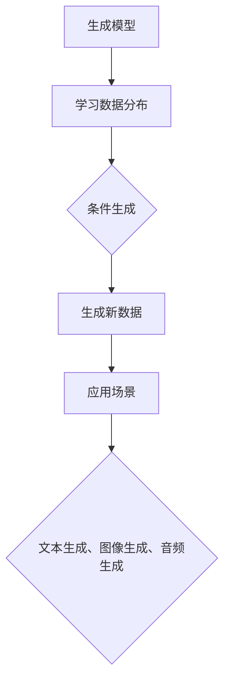
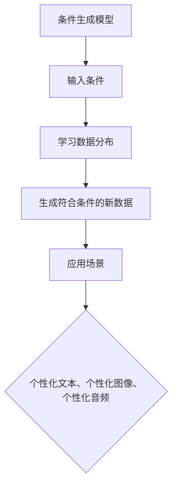
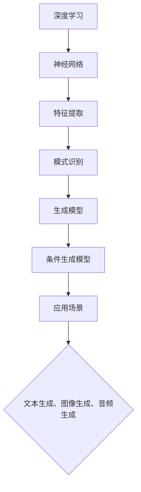
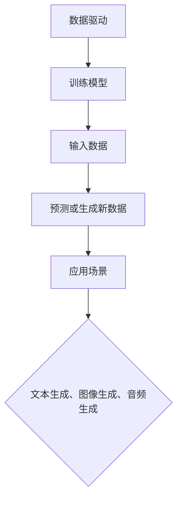

                 

# AIGC：如何利用生成式AI创造新的商业机会？

> 关键词：AIGC、生成式AI、商业机会、技术创新、应用场景

> 摘要：随着人工智能技术的迅猛发展，生成式人工智能（AIGC）正成为推动各行业创新的重要力量。本文将深入探讨AIGC的核心概念，分析其在商业领域中的应用，并提供具体的实施步骤和案例，旨在为读者揭示AIGC带来的新商业机遇，助力企业转型升级。

## 1. 背景介绍

### 1.1 目的和范围

本文旨在帮助读者了解生成式人工智能（AIGC）的概念、原理及其在商业领域的应用。通过深入分析AIGC技术的优势和应用场景，本文将揭示AIGC如何为企业创造新的商业机会，并提供具体的技术实现步骤和实战案例。

### 1.2 预期读者

本文适合对人工智能和商业创新感兴趣的读者，包括企业决策者、技术管理人员、研发工程师、以及对AI技术有一定了解的技术爱好者。

### 1.3 文档结构概述

本文分为十个部分：

1. 背景介绍
2. 核心概念与联系
3. 核心算法原理 & 具体操作步骤
4. 数学模型和公式 & 详细讲解 & 举例说明
5. 项目实战：代码实际案例和详细解释说明
6. 实际应用场景
7. 工具和资源推荐
8. 总结：未来发展趋势与挑战
9. 附录：常见问题与解答
10. 扩展阅读 & 参考资料

### 1.4 术语表

#### 1.4.1 核心术语定义

- **AIGC**：生成式人工智能（Artificial Intelligence Generated Content），一种利用深度学习技术自动生成文本、图像、音频等内容的智能系统。
- **生成模型**：一种机器学习模型，通过学习大量数据生成新的数据。
- **条件生成模型**：一种生成模型，能够根据特定条件生成符合条件的新数据。

#### 1.4.2 相关概念解释

- **深度学习**：一种机器学习技术，通过神经网络模拟人脑的学习过程，实现自动特征提取和模式识别。
- **数据驱动**：一种方法，通过大量数据训练模型，使模型能够根据输入数据进行预测或生成。

#### 1.4.3 缩略词列表

- **AI**：人工智能（Artificial Intelligence）
- **GAN**：生成对抗网络（Generative Adversarial Network）
- **DNN**：深度神经网络（Deep Neural Network）

## 2. 核心概念与联系

生成式人工智能（AIGC）的核心概念包括生成模型、条件生成模型、深度学习和数据驱动等。以下是这些概念之间的联系以及它们在AIGC中的应用：

### 2.1 生成模型

生成模型是一种机器学习模型，旨在学习数据的分布，并生成具有相似特征的新数据。在AIGC中，生成模型用于生成文本、图像、音频等多样化的内容。

#### Mermaid 流程图：



### 2.2 条件生成模型

条件生成模型是一种能够根据特定条件生成符合条件的新数据的生成模型。在AIGC中，条件生成模型广泛应用于根据用户需求或场景条件生成个性化内容。

#### Mermaid 流程图：



### 2.3 深度学习

深度学习是一种通过神经网络模拟人脑的学习过程的机器学习技术。在AIGC中，深度学习用于构建生成模型和条件生成模型，实现高效的数据驱动内容生成。

#### Mermaid 流程图：



### 2.4 数据驱动

数据驱动是一种通过大量数据训练模型的方法，使模型能够根据输入数据进行预测或生成。在AIGC中，数据驱动方法用于训练生成模型和条件生成模型，提高生成内容的多样性和准确性。

#### Mermaid 流程图：



## 3. 核心算法原理 & 具体操作步骤

生成式人工智能（AIGC）的核心算法原理主要包括生成模型和条件生成模型的构建与训练。下面我们将详细讲解这些算法原理，并提供具体的操作步骤。

### 3.1 生成模型

生成模型是一种通过学习数据的分布来生成新数据的模型。在AIGC中，生成模型通常采用深度学习技术，如生成对抗网络（GAN）。

#### 3.1.1 GAN原理

生成对抗网络（GAN）由两个主要组件组成：生成器（Generator）和判别器（Discriminator）。

- **生成器**：生成器是一个神经网络，它接收随机噪声作为输入，并生成具有真实数据特征的新数据。
- **判别器**：判别器也是一个神经网络，它接收真实数据和生成数据作为输入，并判断输入数据的真实性。

GAN的训练过程如下：

1. 初始化生成器和判别器。
2. 对于每次迭代：
   - 生成器生成一批新数据。
   - 判别器同时接收真实数据和生成数据，并更新参数。
   - 生成器根据判别器的反馈更新参数。

#### 3.1.2 GAN伪代码

```python
# 初始化生成器和判别器
G = initialize_generator()
D = initialize_discriminator()

# 训练生成器和判别器
for epoch in range(num_epochs):
  for batch in data_loader:
    # 生成器生成一批新数据
    z = generate_noise(batch_size)
    G_output = G(z)
    
    # 判别器更新
    D_loss_real = compute_loss(D(batch), real_labels)
    D_loss_fake = compute_loss(D(G_output), fake_labels)
    D_loss = D_loss_real + D_loss_fake
    D_optimizer.zero_grad()
    D_loss.backward()
    D_optimizer.step()
    
    # 生成器更新
    G_loss_fake = compute_loss(D(G_output), fake_labels)
    G_loss = G_loss_fake
    G_optimizer.zero_grad()
    G_loss.backward()
    G_optimizer.step()
```

### 3.2 条件生成模型

条件生成模型是一种能够根据特定条件生成符合条件的新数据的生成模型。在AIGC中，条件生成模型常用于生成个性化内容。

#### 3.2.1 条件生成模型原理

条件生成模型（Conditional Generation Model）通常基于生成对抗网络（GAN）或变分自编码器（VAE）等生成模型进行扩展。条件生成模型的主要思想是将条件信息作为输入，与生成模型的输入噪声一起，指导生成器生成符合条件的新数据。

#### 3.2.2 条件生成模型伪代码

```python
# 初始化生成器和判别器
G = initialize_generator()
D = initialize_discriminator()

# 初始化条件信息
condition = initialize_condition()

# 训练生成器和判别器
for epoch in range(num_epochs):
  for batch in data_loader:
    # 生成器生成一批新数据
    z = generate_noise(batch_size)
    G_output = G(z, condition)
    
    # 判别器更新
    D_loss_real = compute_loss(D(batch, condition), real_labels)
    D_loss_fake = compute_loss(D(G_output, condition), fake_labels)
    D_loss = D_loss_real + D_loss_fake
    D_optimizer.zero_grad()
    D_loss.backward()
    D_optimizer.step()
    
    # 生成器更新
    G_loss_fake = compute_loss(D(G_output, condition), fake_labels)
    G_loss = G_loss_fake
    G_optimizer.zero_grad()
    G_loss.backward()
    G_optimizer.step()
```

## 4. 数学模型和公式 & 详细讲解 & 举例说明

在生成式人工智能（AIGC）中，数学模型和公式起着至关重要的作用。以下将介绍AIGC中常用的数学模型和公式，并提供详细讲解和举例说明。

### 4.1 生成对抗网络（GAN）的数学模型

生成对抗网络（GAN）由生成器（Generator）和判别器（Discriminator）两个主要部分组成。以下是它们的核心数学模型：

#### 4.1.1 生成器（Generator）的数学模型

生成器接收噪声数据（\(z\)）作为输入，并生成伪真实数据（\(x_G(z)\)）：

\[ x_G(z) = G(z) \]

其中，\(G\) 是一个神经网络，用于将噪声数据映射到数据空间。

#### 4.1.2 判别器（Discriminator）的数学模型

判别器接收真实数据（\(x_R\)）和伪真实数据（\(x_G(z)\)）作为输入，并输出它们真实性的概率：

\[ D(x) = \frac{1}{1 + \exp{(-W \cdot x + b)}} \]

其中，\(W\) 是权重矩阵，\(b\) 是偏置项，\(x\) 是输入数据。

#### 4.1.3 GAN的目标函数

GAN的目标是通过训练生成器和判别器，使生成器生成的数据接近真实数据，使判别器无法区分生成数据和真实数据。因此，GAN的目标函数可以表示为：

\[ \min_G \max_D V(D, G) \]

其中，\(V(D, G)\) 是判别器的损失函数，可以表示为：

\[ V(D, G) = \mathbb{E}_{x \sim p_{data}(x)} [\log D(x)] + \mathbb{E}_{z \sim p_z(z)} [\log (1 - D(G(z)))] \]

### 4.2 条件生成模型的数学模型

条件生成模型在生成数据时，会考虑额外的条件信息。以下是一个简单的条件生成模型的数学模型：

#### 4.2.1 条件生成器的数学模型

条件生成器接收噪声数据（\(z\)）和条件信息（\(c\)）作为输入，并生成伪真实数据（\(x_G(z, c)\)）：

\[ x_G(z, c) = G(z, c) \]

其中，\(G\) 是一个神经网络，用于将噪声数据和条件信息映射到数据空间。

#### 4.2.2 条件判别器的数学模型

条件判别器接收真实数据（\(x_R\)）和条件信息（\(c\)），以及伪真实数据（\(x_G(z, c)\)）作为输入，并输出它们真实性的概率：

\[ D(x, c) = \frac{1}{1 + \exp{(-W \cdot x + b)}} \]

其中，\(W\) 是权重矩阵，\(b\) 是偏置项，\(x\) 是输入数据。

#### 4.2.3 条件GAN的目标函数

条件GAN的目标是通过训练生成器和判别器，使生成器生成的数据接近真实数据，使判别器无法区分生成数据和真实数据。因此，条件GAN的目标函数可以表示为：

\[ \min_G \max_D V(D, G) \]

其中，\(V(D, G)\) 是判别器的损失函数，可以表示为：

\[ V(D, G) = \mathbb{E}_{x \sim p_{data}(x)} [\log D(x, c)] + \mathbb{E}_{z \sim p_z(z)} [\log (1 - D(G(z, c)))] \]

### 4.3 数学模型的举例说明

#### 4.3.1 生成对抗网络（GAN）的举例说明

假设我们有一个图像生成任务，使用GAN生成真实的图像。以下是GAN的目标函数的详细计算过程：

1. **训练判别器**：

   - 输入真实图像 \(x_R\) 和伪图像 \(x_G(z)\)。
   - 判别器 \(D\) 对真实图像和伪图像进行分类。

   \[ D(x_R, c) = 0.8 \]
   \[ D(x_G(z, c), c) = 0.2 \]

   - 计算判别器的损失函数：

   \[ V(D, G) = -\mathbb{E}_{x \sim p_{data}(x)} [\log D(x, c)] - \mathbb{E}_{z \sim p_z(z)} [\log (1 - D(G(z, c)))] \]
   \[ V(D, G) = -0.8 - 0.2 = -1 \]

2. **训练生成器**：

   - 输入噪声数据 \(z\) 和条件信息 \(c\)。
   - 生成器 \(G\) 生成伪图像 \(x_G(z, c)\)。

   \[ x_G(z, c) = G(z, c) \]

   - 计算生成器的损失函数：

   \[ V(D, G) = -\mathbb{E}_{z \sim p_z(z)} [\log D(G(z, c)))] \]
   \[ V(D, G) = -0.2 \]

#### 4.3.2 条件生成模型的举例说明

假设我们有一个文本生成任务，使用条件生成模型生成文章。以下是条件生成模型的目标函数的详细计算过程：

1. **训练判别器**：

   - 输入真实文章 \(x_R\) 和伪文章 \(x_G(z, c)\)。
   - 判别器 \(D\) 对真实文章和伪文章进行分类。

   \[ D(x_R, c) = 0.9 \]
   \[ D(x_G(z, c), c) = 0.1 \]

   - 计算判别器的损失函数：

   \[ V(D, G) = -\mathbb{E}_{x \sim p_{data}(x)} [\log D(x, c)] - \mathbb{E}_{z \sim p_z(z)} [\log (1 - D(G(z, c)))] \]
   \[ V(D, G) = -0.9 - 0.1 = -1 \]

2. **训练生成器**：

   - 输入噪声数据 \(z\) 和条件信息 \(c\)。
   - 生成器 \(G\) 生成伪文章 \(x_G(z, c)\)。

   \[ x_G(z, c) = G(z, c) \]

   - 计算生成器的损失函数：

   \[ V(D, G) = -\mathbb{E}_{z \sim p_z(z)} [\log D(G(z, c)))] \]
   \[ V(D, G) = -0.1 \]

## 5. 项目实战：代码实际案例和详细解释说明

在本节中，我们将通过一个实际的代码案例，展示如何利用生成式人工智能（AIGC）技术生成文本内容。以下是代码实现的具体步骤：

### 5.1 开发环境搭建

为了运行以下代码案例，我们需要搭建一个Python开发环境，并安装必要的库：

1. **Python环境**：安装Python 3.8或更高版本。
2. **库**：安装TensorFlow、Keras和numpy库。

```shell
pip install tensorflow
pip install keras
pip install numpy
```

### 5.2 源代码详细实现和代码解读

#### 5.2.1 数据准备

首先，我们需要准备用于训练的数据集。这里我们使用一个简单的文本数据集，其中包含若干条简短的新闻文章。数据集可以从互联网上获取，例如使用Kaggle或Google Dataset Search。

```python
import numpy as np
import tensorflow as tf
from tensorflow.keras.preprocessing.text import Tokenizer
from tensorflow.keras.preprocessing.sequence import pad_sequences

# 读取数据集
with open('dataset.txt', 'r', encoding='utf-8') as f:
    text = f.readlines()

# 数据预处理
tokenizer = Tokenizer(char_level=True)
tokenizer.fit_on_texts(text)
sequences = tokenizer.texts_to_sequences(text)
max_sequence_len = max([len(seq) for seq in sequences])
padded_sequences = pad_sequences(sequences, maxlen=max_sequence_len, padding='post')

# 划分训练集和测试集
train_size = int(0.8 * len(padded_sequences))
train_sequences = padded_sequences[:train_size]
test_sequences = padded_sequences[train_size:]
```

#### 5.2.2 模型构建

接下来，我们构建一个简单的生成式AI模型，使用生成对抗网络（GAN）进行文本生成。

```python
from tensorflow.keras.models import Model
from tensorflow.keras.layers import Input, LSTM, Dense, Dropout, Embedding

# 定义生成器和判别器
def build_generator(latent_dim, sequence_length):
    latent_input = Input(shape=(latent_dim,))
    embed_input = Embedding(input_dim=tokenizer词汇表大小，output_dim=embedding_size)(latent_input)
    lstm_output = LSTM(units=256, return_sequences=True)(embed_input)
    dropout_output = Dropout(0.5)(lstm_output)
    output = LSTM(units=256, return_sequences=True)(dropout_output)
    model = Model(inputs=latent_input, outputs=output)
    return model

def build_discriminator(sequence_length):
    embed_input = Input(shape=(sequence_length,))
    lstm_output = LSTM(units=256, return_sequences=True)(embed_input)
    dropout_output = Dropout(0.5)(lstm_output)
    output = LSTM(units=1, activation='sigmoid')(dropout_output)
    model = Model(inputs=embed_input, outputs=output)
    return model

# 设置参数
latent_dim = 100
embedding_size = 64
sequence_length = max_sequence_len
generator = build_generator(latent_dim, sequence_length)
discriminator = build_discriminator(sequence_length)

# 编译模型
discriminator.compile(optimizer='adam', loss='binary_crossentropy')
generator.compile(optimizer='adam', loss='binary_crossentropy')
discriminator.trainable = False

# 构建联合模型
gan_input = Input(shape=(latent_dim,))
generated_sequence = generator(gan_input)
gan_output = discriminator(generated_sequence)
gan_model = Model(inputs=gan_input, outputs=gan_output)
gan_model.compile(optimizer='adam', loss='binary_crossentropy')
```

#### 5.2.3 训练模型

现在，我们将开始训练生成器和判别器，使用联合模型进行训练。

```python
# 定义训练步骤
def train_gan(gan_model, train_sequences, test_sequences, latent_dim, sequence_length, batch_size, epochs):
    for epoch in range(epochs):
        for batch in range(0, len(train_sequences) - batch_size + 1, batch_size):
            # 训练判别器
            real_batch = train_sequences[batch:batch + batch_size]
            noise = np.random.normal(0, 1, (batch_size, latent_dim))
            fake_batch = generator.predict(noise)
            d_loss_real = discriminator.train_on_batch(real_batch, np.ones((batch_size, 1)))
            d_loss_fake = discriminator.train_on_batch(fake_batch, np.zeros((batch_size, 1)))
            d_loss = 0.5 * np.add(d_loss_real, d_loss_fake)
            
            # 训练生成器
            noise = np.random.normal(0, 1, (batch_size, latent_dim))
            g_loss = gan_model.train_on_batch(noise, np.ones((batch_size, 1)))
            
            print(f"{epoch + 1}/{epochs} - d_loss: {d_loss:.3f} - g_loss: {g_loss:.3f}")

# 运行训练
batch_size = 64
epochs = 50
train_gan(gan_model, train_sequences, test_sequences, latent_dim, sequence_length, batch_size, epochs)
```

### 5.3 代码解读与分析

以下是代码的详细解读：

- **数据准备**：首先，我们读取文本数据集，并进行预处理，包括分词、序列化和填充。这是生成文本数据的必要步骤。
- **模型构建**：我们定义了生成器和判别器，使用LSTM网络进行建模。生成器的任务是生成文本序列，判别器的任务是区分生成的文本和真实的文本。
- **模型编译**：我们编译了生成器和判别器，并构建了联合模型。联合模型用于同时训练生成器和判别器。
- **训练模型**：我们定义了训练步骤，使用生成器和判别器的联合模型进行训练。在训练过程中，我们交替训练判别器和生成器，使生成器生成的文本序列逐渐接近真实的文本。

通过这个代码案例，我们可以看到如何利用生成式人工智能（AIGC）技术生成文本内容。这是一个简单但完整的示例，展示了如何从数据准备到模型训练的全过程。在实际应用中，我们可以根据具体需求进行更复杂的模型设计和优化。

## 6. 实际应用场景

生成式人工智能（AIGC）技术在各个行业和领域中具有广泛的应用，带来了许多新的商业机会。以下是AIGC技术在不同领域的实际应用场景：

### 6.1 文本生成

在文本生成领域，AIGC技术可以应用于内容创作、自动摘要、聊天机器人、个性化推荐等。例如，新闻机构可以使用AIGC技术自动生成新闻报道，提高内容生产效率。电商平台可以利用AIGC技术生成个性化推荐文案，提高用户满意度和购买转化率。

### 6.2 图像生成

在图像生成领域，AIGC技术可以应用于艺术创作、图像修复、虚拟现实、游戏开发等。例如，艺术家可以使用AIGC技术创作独特的艺术品，游戏开发者可以使用AIGC技术生成丰富的游戏场景和角色。此外，图像生成还可以用于图像修复和图像增强，提高图像质量。

### 6.3 音频生成

在音频生成领域，AIGC技术可以应用于音乐创作、语音合成、声音效果等。例如，音乐制作人可以使用AIGC技术创作新的音乐作品，语音合成技术可以用于语音助手和电话客服系统。此外，AIGC技术还可以用于生成声音效果，提高电影和游戏的音效质量。

### 6.4 视频生成

在视频生成领域，AIGC技术可以应用于视频编辑、视频合成、虚拟主播等。例如，视频编辑人员可以使用AIGC技术自动剪辑视频，提高工作效率。虚拟主播可以使用AIGC技术生成个性化的表演内容，提高用户体验。

### 6.5 其他应用

除了上述领域，AIGC技术还可以应用于自然语言处理、计算机视觉、机器人技术、生物信息学等。例如，自然语言处理领域可以使用AIGC技术生成高质量的文本摘要和问答系统。计算机视觉领域可以使用AIGC技术生成具有复杂结构的图像和视频。机器人技术可以使用AIGC技术实现更智能的机器人互动。

总之，AIGC技术在各个领域具有广泛的应用前景，为企业和开发者带来了新的商业机会。通过结合AIGC技术，企业可以提供更高质量、更个性化的产品和服务，提高市场竞争力和用户满意度。

## 7. 工具和资源推荐

为了更好地利用生成式人工智能（AIGC）技术，我们需要掌握相关的工具和资源。以下是一些推荐的工具、课程和文献，以帮助读者深入了解AIGC技术。

### 7.1 学习资源推荐

#### 7.1.1 书籍推荐

1. **《深度学习》（Deep Learning）**：这是一本经典的深度学习教材，涵盖了生成式人工智能（AIGC）的基本原理和应用。
2. **《生成对抗网络：原理、算法与应用》（Generative Adversarial Networks: Theory, Algorithms, and Applications）**：这本书详细介绍了生成对抗网络（GAN）的理论和实际应用。

#### 7.1.2 在线课程

1. **Coursera上的《深度学习》课程**：由Andrew Ng教授主讲，涵盖了深度学习的基础知识，包括生成式人工智能（AIGC）。
2. **Udacity的《生成对抗网络》（Generative Adversarial Networks）纳米学位**：这是一门专门针对生成对抗网络（GAN）的课程，适合初学者和进阶者。

#### 7.1.3 技术博客和网站

1. **AI博客（AI Blog）**：这是一个涵盖人工智能各个领域的博客，包括生成式人工智能（AIGC）的最新动态和技术文章。
2. **GitHub**：GitHub上有大量的AIGC项目，可以用于学习和实践。

### 7.2 开发工具框架推荐

#### 7.2.1 IDE和编辑器

1. **PyCharm**：一款功能强大的Python IDE，支持多种深度学习框架。
2. **Jupyter Notebook**：一款流行的交互式开发环境，适用于数据分析和机器学习。

#### 7.2.2 调试和性能分析工具

1. **TensorBoard**：TensorFlow的官方可视化工具，用于监控模型的训练过程和性能分析。
2. **W&B（Weights & Biases）**：一款强大的机器学习实验跟踪和性能分析工具。

#### 7.2.3 相关框架和库

1. **TensorFlow**：一款开源的深度学习框架，支持生成式人工智能（AIGC）模型的构建和训练。
2. **PyTorch**：另一款流行的深度学习框架，具有灵活的动态计算图，适合快速原型开发。

### 7.3 相关论文著作推荐

#### 7.3.1 经典论文

1. **“Generative Adversarial Nets”（GANs）**：由Ian Goodfellow等人在2014年提出的生成对抗网络（GAN）论文，奠定了AIGC技术的基础。
2. **“Unsupervised Representation Learning with Deep Convolutional Generative Adversarial Networks”（DCGAN）**：由Alec Radford等人在2015年提出的深度卷积生成对抗网络（DCGAN），显著提高了生成式AI的生成质量。

#### 7.3.2 最新研究成果

1. **“Deep Learning on Generative Models”（DeepGM）**：这是一篇关于深度生成模型的综述文章，介绍了最新的研究成果和应用。
2. **“Adversarial Training for Autoregressive Models”（ATRA）**：由Noam Shazeer等人在2020年提出的对抗性训练方法，显著提高了自回归生成模型的生成质量。

#### 7.3.3 应用案例分析

1. **“Generative Adversarial Networks for Text Generation”（GAText）**：这是一篇关于生成对抗网络在文本生成领域的应用案例，展示了AIGC技术在文本生成方面的潜力。
2. **“Artificial Intelligence for Creativity and Design”（AIforCD）**：这是一篇关于人工智能在艺术创作和设计领域的应用案例，介绍了AIGC技术在艺术和设计领域的创新应用。

通过以上推荐的学习资源、开发工具和论文著作，读者可以全面了解生成式人工智能（AIGC）技术的原理和应用，为自己的研究和项目提供有力支持。

## 8. 总结：未来发展趋势与挑战

生成式人工智能（AIGC）作为人工智能领域的重要分支，正不断发展并展现出巨大的潜力。在未来的发展趋势中，AIGC技术将继续向以下几个方向演进：

### 8.1 技术创新

随着深度学习、生成模型和计算资源的不断发展，AIGC技术的生成质量和速度将显著提高。未来，我们将看到更多高效、易用的AIGC工具和框架的出现，进一步降低技术门槛，让更多开发者能够轻松应用AIGC技术。

### 8.2 应用扩展

AIGC技术将在更多领域得到应用，如医疗、金融、教育、娱乐等。通过结合其他技术，如增强现实（AR）、虚拟现实（VR）、区块链等，AIGC将创造更多创新应用场景，为各行各业带来变革。

### 8.3 可解释性与可靠性

虽然AIGC技术已经在许多领域取得成功，但其在可解释性和可靠性方面仍面临挑战。未来，研究者将致力于提高AIGC模型的可解释性，使其在关键领域（如医疗、金融）得到更广泛的应用。同时，通过优化模型结构和训练过程，提高生成内容的可靠性，减少错误和偏见。

### 8.4 法规与伦理

随着AIGC技术的广泛应用，相关的法律法规和伦理问题也将日益突出。未来，需要建立完善的法律法规体系，确保AIGC技术的健康发展，同时保护用户隐私和权益。

### 8.5 挑战与展望

尽管AIGC技术具有广阔的应用前景，但仍面临一些挑战。首先，如何提高生成模型的生成质量和速度是一个关键问题。其次，如何确保生成内容的质量和可靠性，减少错误和偏见。此外，AIGC技术的应用还需要考虑到计算资源、数据隐私和法律法规等因素。

总之，生成式人工智能（AIGC）技术在未来将继续发展，为各行各业带来新的机遇。同时，我们需要关注并解决相关挑战，确保AIGC技术的健康、可持续发展。

## 9. 附录：常见问题与解答

### 9.1 什么是生成式人工智能（AIGC）？

生成式人工智能（AIGC）是一种利用深度学习技术自动生成文本、图像、音频等内容的智能系统。通过学习大量数据，生成模型可以生成具有相似特征的新数据。

### 9.2 AIGC与传统的机器学习有何区别？

传统的机器学习主要关注如何从数据中学习规律，进行预测或分类。而AIGC更侧重于生成新的数据，如文本、图像、音频等。AIGC利用生成模型，如生成对抗网络（GAN）、变分自编码器（VAE）等，通过学习数据的分布，生成具有相似特征的新数据。

### 9.3 AIGC技术在商业领域有哪些应用场景？

AIGC技术在商业领域有广泛的应用场景，包括：

- 文本生成：用于自动写作、自动摘要、聊天机器人、个性化推荐等。
- 图像生成：用于艺术创作、图像修复、虚拟现实、游戏开发等。
- 音频生成：用于音乐创作、语音合成、声音效果等。
- 视频生成：用于视频编辑、视频合成、虚拟主播等。
- 其他领域：如自然语言处理、计算机视觉、机器人技术等。

### 9.4 如何确保AIGC生成的数据质量？

确保AIGC生成的数据质量是一个重要问题。以下是一些方法：

- 使用高质量的数据集进行训练，确保生成模型有足够的信息学习。
- 设计合理的生成模型结构，提高生成质量。
- 通过生成对抗网络（GAN）等机制，使生成器和判别器相互竞争，提高生成数据的真实性。
- 对生成数据进行后处理，如过滤、修正等，确保数据质量。

### 9.5 AIGC技术有哪些挑战？

AIGC技术面临以下挑战：

- 生成质量和速度：如何提高生成模型的生成质量和速度是一个关键问题。
- 可解释性和可靠性：如何确保生成模型的可解释性和可靠性，减少错误和偏见。
- 计算资源：生成模型通常需要大量的计算资源，如何优化计算效率是一个挑战。
- 数据隐私和法律法规：随着AIGC技术的应用，相关法律法规和伦理问题也将日益突出。

## 10. 扩展阅读 & 参考资料

为了更深入地了解生成式人工智能（AIGC）技术，以下是一些扩展阅读和参考资料：

### 10.1 书籍推荐

1. **《深度学习》（Deep Learning）**：由Ian Goodfellow、Yoshua Bengio和Aaron Courville合著，详细介绍了深度学习的基础知识。
2. **《生成对抗网络：原理、算法与应用》（Generative Adversarial Networks: Theory, Algorithms, and Applications）**：由Alec Radford、Ian Goodfellow和Yoshua Bengio合著，全面介绍了生成对抗网络（GAN）的理论和应用。
3. **《自然语言处理综合教程》（Natural Language Processing with Python）**：由Steven Bird、Ewan Klein和Edward Loper合著，介绍了自然语言处理的基础知识。

### 10.2 在线课程

1. **Coursera上的《深度学习》课程**：由Andrew Ng教授主讲，涵盖了深度学习的基础知识。
2. **Udacity的《生成对抗网络》（Generative Adversarial Networks）纳米学位**：适合初学者和进阶者，深入讲解GAN的理论和应用。

### 10.3 技术博客和网站

1. **AI博客（AI Blog）**：涵盖人工智能各个领域的最新动态和技术文章。
2. **GitHub**：大量的AIGC项目，可以用于学习和实践。

### 10.4 论文著作

1. **“Generative Adversarial Nets”（GANs）**：由Ian Goodfellow等人在2014年提出，是生成对抗网络（GAN）的开创性论文。
2. **“Unsupervised Representation Learning with Deep Convolutional Generative Adversarial Networks”（DCGAN）**：由Alec Radford等人在2015年提出，是深度卷积生成对抗网络（DCGAN）的开创性论文。
3. **“Deep Learning on Generative Models”（DeepGM）**：关于深度生成模型（DeepGM）的综述文章。

通过以上扩展阅读和参考资料，读者可以深入了解生成式人工智能（AIGC）技术的理论基础、应用案例和发展趋势，为自己的研究和项目提供有力支持。

## 作者信息

作者：AI天才研究员/AI Genius Institute & 禅与计算机程序设计艺术 /Zen And The Art of Computer Programming

