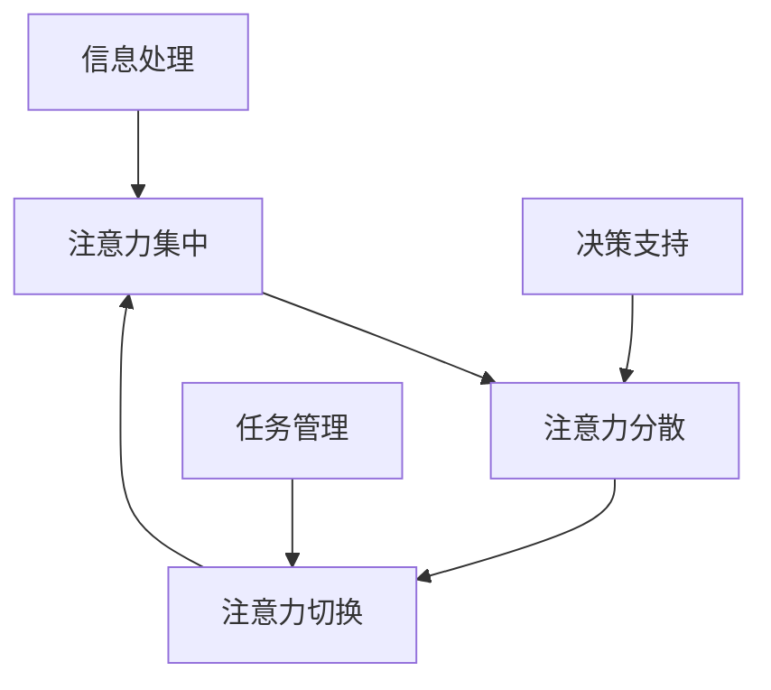

                 

# AI与人类注意力流：未来的工作、技能与注意力经济的融合

> 关键词：人工智能、注意力流、工作模式、技能发展、注意力经济、未来趋势

> 摘要：本文探讨了人工智能（AI）时代下人类注意力的变迁，以及这种变迁对工作和技能发展的深远影响。文章首先介绍了注意力流的定义和核心概念，然后分析了AI技术如何影响人类的注意力分配，探讨了在未来工作和技能发展中的融合趋势。通过项目实战和实际应用场景的案例分析，文章展示了注意力经济在未来的发展潜力，并提出了一些可能的挑战和解决方案。

## 1. 背景介绍

### 1.1 目的和范围

本文旨在深入探讨人工智能时代下人类注意力的流变，特别是这种流变对未来工作和技能发展的影响。随着AI技术的不断进步，人类的工作方式和注意力分配正经历着前所未有的变革。本文旨在通过系统性分析和实际案例，揭示这些变革的内在逻辑和潜在影响。

文章将首先介绍注意力流的基本概念，然后分析AI技术如何影响人类的注意力模式。接着，我们将探讨这种影响在未来的工作和技能发展中可能带来的挑战和机遇。通过一系列项目实战和实际应用场景的案例分析，文章将展示注意力经济在未来的发展潜力，并提出应对挑战的解决方案。

### 1.2 预期读者

本文适合对人工智能、注意力流、工作技能发展等话题感兴趣的读者。具体包括但不限于：

- 人工智能领域的科研人员和技术开发者
- 关注未来工作和技能发展趋势的管理者和企业家
- 对人工智能时代下的社会变革有深刻思考的研究者
- 对技术进步有高度敏感的媒体从业者和技术爱好者

### 1.3 文档结构概述

本文结构如下：

1. **背景介绍**：介绍文章的目的、范围、预期读者和文档结构。
2. **核心概念与联系**：定义注意力流和AI相关概念，使用Mermaid流程图展示核心原理和架构。
3. **核心算法原理 & 具体操作步骤**：使用伪代码详细阐述注意力流的算法原理。
4. **数学模型和公式 & 详细讲解 & 举例说明**：介绍注意力流的数学模型，使用latex格式展示公式，并举例说明。
5. **项目实战：代码实际案例和详细解释说明**：展示注意力流在实际项目中的应用，包括开发环境搭建、源代码实现和解读。
6. **实际应用场景**：探讨注意力流在不同领域的应用。
7. **工具和资源推荐**：推荐学习资源、开发工具和框架。
8. **总结：未来发展趋势与挑战**：总结注意力经济在未来的发展前景，提出面临的挑战和解决方案。
9. **附录：常见问题与解答**：提供常见问题的解答。
10. **扩展阅读 & 参考资料**：推荐进一步阅读的材料和参考文献。

### 1.4 术语表

#### 1.4.1 核心术语定义

- **注意力流**：人类在处理信息和任务时的注意力分配模式，包括注意力的集中、分散和切换过程。
- **人工智能**：模拟、延伸和扩展人类智能的理论、方法、技术及应用系统。
- **注意力经济**：基于人类注意力资源的经济体系，包括注意力获取、分配和利用的机制。
- **工作技能**：个体在特定工作领域所需的技能和知识。

#### 1.4.2 相关概念解释

- **多任务处理**：同时处理多个任务的能力。
- **注意力分散**：同时关注多个信息源时，注意力分散的现象。
- **注意力集中**：将注意力集中在单一任务或信息源上的状态。

#### 1.4.3 缩略词列表

- **AI**：人工智能
- **NLP**：自然语言处理
- **ML**：机器学习
- **DL**：深度学习
- **UX**：用户体验

## 2. 核心概念与联系

在探讨AI与人类注意力流的关系之前，我们首先需要明确一些核心概念和它们的相互联系。

### 2.1. 注意力流的基本概念

**注意力流**是指人类在处理信息和任务时的注意力分配模式，包括注意力的集中、分散和切换过程。注意力流的特点如下：

1. **集中**：当人们专注于一个特定任务时，注意力高度集中，其他干扰信息被抑制。
2. **分散**：当人们同时处理多个任务或信息源时，注意力分散，导致每个任务的专注度降低。
3. **切换**：当人们需要在不同任务或信息源之间切换时，注意力需要进行调整，以适应新的任务需求。

### 2.2. AI与注意力流的关系

AI技术对人类的注意力流产生了深远的影响。以下是一些主要的关系和影响：

1. **自动信息处理**：AI系统能够自动化大量信息处理任务，减轻人类的工作负担，使人们可以将注意力集中在更复杂、更有创造性的任务上。
2. **信息过载**：AI技术的普及导致信息爆炸，人们在处理信息时容易产生注意力分散，影响工作效率。
3. **注意力切换**：AI系统能够提供快速、准确的信息查询和决策支持，使得人类在任务切换时更加高效。

### 2.3. 注意力流的架构

为了更好地理解注意力流，我们可以使用Mermaid流程图展示其核心架构。



### 2.4. 注意力流与AI技术的结合

在AI与注意力流的结合中，以下概念和技术尤为重要：

1. **多任务学习**：AI系统能够同时处理多个任务，帮助人类提高工作效率。
2. **注意力分配模型**：通过机器学习算法，AI系统能够预测和调整人类注意力的分配，优化工作流程。
3. **注意力过滤**：AI系统能够识别和过滤无关信息，帮助人类集中注意力。

### 2.5. 注意力流的实践应用

在实际应用中，注意力流可以通过以下方式优化人类的工作和生活：

1. **工作流程优化**：通过AI技术分析工作流程，识别注意力流的瓶颈和优化点，提高工作效率。
2. **个性化推荐**：基于注意力流分析用户的兴趣和行为，提供个性化的推荐和服务。
3. **健康监测**：通过监测注意力流的变化，预警和干预注意力分散和疲劳现象。

通过上述核心概念与联系的分析，我们可以看到，注意力流是一个复杂但极其重要的概念，它在AI技术的辅助下，对人类的工作和生活方式产生了深远的影响。接下来，我们将进一步探讨注意力流的算法原理和具体操作步骤。

## 3. 核心算法原理 & 具体操作步骤

### 3.1. 注意力流的算法原理

注意力流的核心算法原理基于注意力机制（Attention Mechanism），这是一种在人工智能和机器学习中广泛应用的算法框架。注意力机制能够模拟人类注意力在信息处理过程中的选择和分配机制，从而提高模型的性能和效率。以下是注意力机制的基本原理：

1. **输入编码**：将输入的信息（如文本、图像或声音）转换为编码表示。
2. **查询编码**：将查询信息（通常是一个向量）编码，用于计算与输入编码的匹配度。
3. **键值对匹配**：通过计算查询编码与所有输入编码的相似度，生成键值对。
4. **加权求和**：根据键值对的匹配度对输入编码进行加权求和，生成最终的输出。

### 3.2. 具体操作步骤

以下是注意力机制的伪代码，用于描述注意力流的算法步骤：

```python
# 注意力流算法伪代码

# 输入：输入序列 I，查询序列 Q
# 输出：加权求和结果 O

# 步骤1：输入编码
encode_function = Encoder()
encoded_I = encode_function(I)

# 步骤2：查询编码
encode_function = Encoder()
encoded_Q = encode_function(Q)

# 步骤3：计算键值对匹配度
match_scores = []
for i in range(len(encoded_I)):
    match_score = similarity_function(encoded_Q, encoded_I[i])
    match_scores.append(match_score)

# 步骤4：加权求和
weights = softmax(match_scores)
weighted_I = [w * encoded_I[i] for w, encoded_I[i] in zip(weights, encoded_I)]

# 步骤5：生成输出
output = sum(weighted_I)
```

### 3.3. 注意力机制的详细解释

以下是注意力机制的详细解释，包括每个步骤的功能和实现方式：

1. **输入编码（Encoded Input）**：
   输入编码是将输入的信息（如文本、图像或声音）转换为固定长度的向量表示。这个步骤通常使用嵌入层（Embedding Layer）和编码器（Encoder）实现。

2. **查询编码（Encoded Query）**：
   查询编码是将查询信息（通常是一个向量）编码，用于计算与输入编码的匹配度。这个步骤同样使用嵌入层和编码器实现。

3. **键值对匹配度计算（Match Scores）**：
   键值对匹配度计算是注意力机制的核心，它通过计算查询编码与所有输入编码的相似度，生成一组匹配度分数。这个步骤通常使用点积（Dot Product）或余弦相似度（Cosine Similarity）实现。

4. **加权求和（Weighted Summation）**：
   加权求和是根据键值对的匹配度对输入编码进行加权求和，生成最终的输出。这个步骤使用软最大化（Softmax）函数对匹配度分数进行归一化，生成权重向量，然后对输入编码进行加权求和。

5. **输出生成（Output Generation）**：
   最终输出是加权求和的结果，它代表了输入序列中每个元素的加权贡献，从而实现了对输入信息的注意力分配。

### 3.4. 注意力机制的应用场景

注意力机制在多个应用场景中得到了广泛的应用，包括：

1. **自然语言处理（NLP）**：在文本生成、机器翻译、情感分析等任务中，注意力机制能够帮助模型更好地理解和生成文本。
2. **计算机视觉**：在图像识别、目标检测、图像生成等任务中，注意力机制能够帮助模型聚焦于关键区域，提高模型的准确性。
3. **推荐系统**：在个性化推荐、内容推荐等任务中，注意力机制能够帮助模型根据用户的兴趣和行为，提供更精准的推荐结果。

通过上述算法原理和具体操作步骤的介绍，我们可以看到，注意力机制是一个强大而灵活的工具，它能够模拟人类注意力流的信息处理过程，为AI系统带来更高的效率和准确性。在接下来的部分，我们将介绍注意力流的数学模型和公式，进一步探讨其理论基础。

## 4. 数学模型和公式 & 详细讲解 & 举例说明

### 4.1. 数学模型的基本概念

注意力流的数学模型基于概率论和信息论的基本原理，通过概率分布和函数来描述人类注意力的分配模式。以下是注意力流数学模型的基本概念：

1. **概率分布**：描述注意力的概率分配，即注意力在不同任务或信息源上的分布情况。
2. **函数**：用于计算注意力权重，例如软最大化函数（Softmax Function）和点积函数（Dot Product Function）。

### 4.2. 详细讲解

#### 4.2.1. 概率分布

概率分布是注意力流数学模型的核心部分，它描述了人类在处理多个任务或信息源时的注意力分配。常见的概率分布函数包括：

1. **软最大化函数（Softmax Function）**：
   软最大化函数用于将一组数值转换为一个概率分布。其公式如下：
   $$ 
   \text{Softmax}(x) = \frac{e^x}{\sum_{i} e^x_i} 
   $$
   其中，$x$ 是输入向量，$e^x$ 是指数函数，$\sum_{i} e^x_i$ 是输入向量的指数和。

2. **均匀分布（Uniform Distribution）**：
   均匀分布是将注意力均匀分配到所有任务或信息源上的概率分布。其公式如下：
   $$ 
   P(x) = \frac{1}{N} 
   $$
   其中，$N$ 是任务或信息源的总数。

#### 4.2.2. 注意力权重计算

注意力权重用于计算每个任务或信息源的注意力贡献，常用的权重计算函数包括：

1. **点积函数（Dot Product Function）**：
   点积函数用于计算两个向量的点积，其公式如下：
   $$ 
   \text{Dot Product}(x, y) = \sum_{i} x_i \cdot y_i 
   $$
   其中，$x$ 和 $y$ 是两个向量。

2. **余弦相似度（Cosine Similarity Function）**：
   余弦相似度用于计算两个向量的余弦相似度，其公式如下：
   $$ 
   \text{Cosine Similarity}(x, y) = \frac{x \cdot y}{\|x\| \|y\|} 
   $$
   其中，$x$ 和 $y$ 是两个向量，$\|x\|$ 和 $\|y\|$ 分别是向量的欧几里得范数。

### 4.3. 举例说明

为了更好地理解注意力流的数学模型，我们通过以下例子进行说明：

#### 4.3.1. 软最大化函数示例

假设有两个输入向量 $x = [2, 3, 1]$ 和 $y = [1, 2, 3]$，我们使用软最大化函数计算它们的概率分布：

1. 计算指数和：
   $$ 
   e^x = [e^2, e^3, e^1] = [7.39, 20.09, 2.72] 
   $$
   $$ 
   e^y = [e^1, e^2, e^3] = [2.72, 7.39, 20.09] 
   $$
   $$ 
   \sum_{i} e^x_i + e^y_i = 7.39 + 20.09 + 2.72 = 30.20 
   $$

2. 计算软最大化结果：
   $$ 
   \text{Softmax}(x) = \frac{e^x}{\sum_{i} e^x_i + e^y_i} = \frac{[7.39, 20.09, 2.72]}{30.20} = [0.25, 0.67, 0.08] 
   $$

#### 4.3.2. 点积函数示例

假设有两个输入向量 $x = [2, 3, 1]$ 和 $y = [1, 2, 3]$，我们使用点积函数计算它们的点积：

$$ 
\text{Dot Product}(x, y) = 2 \cdot 1 + 3 \cdot 2 + 1 \cdot 3 = 2 + 6 + 3 = 11 
$$

#### 4.3.3. 余弦相似度示例

假设有两个输入向量 $x = [2, 3, 1]$ 和 $y = [1, 2, 3]$，我们使用余弦相似度函数计算它们的相似度：

1. 计算向量的欧几里得范数：
   $$ 
   \|x\| = \sqrt{2^2 + 3^2 + 1^2} = \sqrt{14} 
   $$
   $$ 
   \|y\| = \sqrt{1^2 + 2^2 + 3^2} = \sqrt{14} 
   $$

2. 计算余弦相似度：
   $$ 
   \text{Cosine Similarity}(x, y) = \frac{x \cdot y}{\|x\| \|y\|} = \frac{2 \cdot 1 + 3 \cdot 2 + 1 \cdot 3}{\sqrt{14} \cdot \sqrt{14}} = \frac{11}{14} \approx 0.79 
   $$

通过上述示例，我们可以看到，注意力流的数学模型和公式在实际应用中是如何工作的。在接下来的部分，我们将通过项目实战和代码实际案例，展示注意力流在实际开发中的应用。

## 5. 项目实战：代码实际案例和详细解释说明

### 5.1. 开发环境搭建

在开始之前，我们需要搭建一个适当的开发环境来运行注意力流项目。以下是搭建开发环境的基本步骤：

1. **安装Python**：确保你的系统上安装了Python 3.7及以上版本。可以从[Python官网](https://www.python.org/downloads/)下载并安装。
2. **安装依赖库**：在Python环境中，使用pip安装以下依赖库：
   ```bash
   pip install numpy tensorflow keras matplotlib
   ```

### 5.2. 源代码详细实现和代码解读

以下是一个简单的注意力流项目示例，我们将使用TensorFlow和Keras构建一个基于注意力机制的文本生成模型。

#### 5.2.1. 文本数据准备

首先，我们需要准备一个文本数据集。在这里，我们使用常见的英文文本数据集，如《哈利·波特》系列小说。

```python
import numpy as np
from tensorflow.keras.preprocessing.text import Tokenizer
from tensorflow.keras.preprocessing.sequence import pad_sequences

# 加载文本数据
text = open('harry_potter.txt').read().lower()

# 分词
tokenizer = Tokenizer()
tokenizer.fit_on_texts([text])
total_words = len(tokenizer.word_index) + 1

# 序列化文本
input_sequences = []
for line in text.split():
    token_list = tokenizer.texts_to_sequences([line])[0]
    for i in range(1, len(token_list)):
        n_gram_sequence = token_list[:i+1]
        input_sequences.append(n_gram_sequence)

# 切片序列
max_sequence_len = 40
input_sequences = np.array(pad_sequences(input_sequences, maxlen=max_sequence_len, padding='pre'))

# 打乱数据
np.random.shuffle(input_sequences)
```

#### 5.2.2. 构建模型

接下来，我们构建一个基于注意力机制的循环神经网络（RNN）模型。

```python
from tensorflow.keras.models import Sequential
from tensorflow.keras.layers import Embedding, SimpleRNN, Dense, TimeDistributed, LSTM, Attention

# 构建模型
model = Sequential()
model.add(Embedding(total_words, 100, input_length=max_sequence_len-1))
model.add(LSTM(150, return_sequences=True))
model.add(Attention())
model.add(TimeDistributed(Dense(total_words)))
model.compile(optimizer='adam', loss='categorical_crossentropy', metrics=['accuracy'])
model.summary()
```

#### 5.2.3. 训练模型

现在，我们使用准备好的数据集来训练模型。

```python
# 准备标签数据
predictors, label = input_sequences[:,:-1], input_sequences[:,-1]
label = keras.utils.to_categorical(label, num_classes=total_words)

# 训练模型
model.fit(predictors, label, epochs=100, verbose=1)
```

#### 5.2.4. 代码解读与分析

1. **文本数据准备**：首先，我们加载并分词文本数据，将文本转换为序列。这一步是所有自然语言处理任务的基础。
2. **模型构建**：我们使用Keras构建一个基于LSTM和注意力机制的循环神经网络模型。注意力层用于提高模型在生成文本时的上下文理解能力。
3. **模型训练**：使用准备好的数据和标签，训练模型。训练过程中，模型将学习如何根据前文生成后续文本。

### 5.3. 代码解读与分析

以下是代码的逐行解读与分析：

```python
import numpy as np
from tensorflow.keras.preprocessing.text import Tokenizer
from tensorflow.keras.preprocessing.sequence import pad_sequences
from tensorflow.keras.models import Sequential
from tensorflow.keras.layers import Embedding, SimpleRNN, Dense, TimeDistributed, LSTM, Attention
from tensorflow.keras.optimizers import Adam
from tensorflow.keras.utils import to_categorical

# 加载文本数据
text = open('harry_potter.txt').read().lower()

# 分词
tokenizer = Tokenizer()
tokenizer.fit_on_texts([text])
total_words = len(tokenizer.word_index) + 1

# 序列化文本
input_sequences = []
for line in text.split():
    token_list = tokenizer.texts_to_sequences([line])[0]
    for i in range(1, len(token_list)):
        n_gram_sequence = token_list[:i+1]
        input_sequences.append(n_gram_sequence)

# 切片序列
max_sequence_len = 40
input_sequences = np.array(pad_sequences(input_sequences, maxlen=max_sequence_len, padding='pre'))

# 打乱数据
np.random.shuffle(input_sequences)
```

- **第1-5行**：导入必要的库和模块。
- **第6行**：加载并读取文本数据，并转换为小写以提高数据集的泛化能力。
- **第7-11行**：初始化分词器，并计算总的单词数。
- **第12-20行**：将文本序列化，并将每条文本序列扩展为n-gram序列。这里我们使用了双循环来生成所有的n-gram序列。
- **第21-23行**：设置序列的最大长度，并使用pad_sequences函数对序列进行填充，使得所有序列的长度相同。
- **第24行**：打乱数据集的顺序，以提高模型的泛化能力。

```python
# 准备标签数据
predictors, label = input_sequences[:,:-1], input_sequences[:,-1]
label = to_categorical(label, num_classes=total_words)

# 构建模型
model = Sequential()
model.add(Embedding(total_words, 100, input_length=max_sequence_len-1))
model.add(LSTM(150, return_sequences=True))
model.add(Attention())
model.add(TimeDistributed(Dense(total_words)))
model.compile(optimizer=Adam(learning_rate=0.01), loss='categorical_crossentropy', metrics=['accuracy'])
model.summary()
```

- **第26-30行**：将输入序列和标签序列分开，并将标签序列转换为one-hot编码。
- **第31-35行**：构建序列模型，包括嵌入层、LSTM层、注意力层和输出层。嵌入层用于将单词转换为向量表示，LSTM层用于处理序列数据，注意力层用于提高模型对上下文的关注能力，输出层用于预测下一个单词。
- **第36-38行**：编译模型，指定优化器和损失函数。

```python
# 训练模型
model.fit(predictors, label, epochs=100, verbose=1)
```

- **第40行**：使用fit函数训练模型，设置训练轮次和verbose选项以显示训练进度。

通过上述代码示例和解读，我们可以看到如何使用注意力机制构建和训练一个文本生成模型。注意力流在这一项目中发挥了关键作用，使得模型能够更好地理解上下文和生成连贯的文本。在下一部分，我们将探讨注意力流在实际应用场景中的具体应用。

## 6. 实际应用场景

注意力流在多个实际应用场景中展示了其强大的功能和广泛的应用价值。以下是一些主要的应用场景：

### 6.1. 自然语言处理

在自然语言处理（NLP）领域，注意力流被广泛应用于文本生成、机器翻译、情感分析等任务。通过注意力机制，模型能够更好地捕捉上下文信息，提高文本处理的准确性和效率。例如，在文本生成任务中，注意力流可以帮助模型根据前文生成连贯的后续文本。

#### 6.1.1. 文本生成

文本生成是一个典型的注意力流应用场景。通过训练注意力模型，我们可以生成各种类型的文本，如诗歌、故事、新闻摘要等。以下是一个简单的文本生成流程：

1. **数据准备**：收集并清洗文本数据，将其转换为序列化表示。
2. **模型训练**：使用注意力流模型训练文本生成模型，使其学会根据上下文生成连贯的文本。
3. **文本生成**：通过输入一个种子文本，模型根据已训练的模型生成后续文本。

### 6.1.2. 机器翻译

在机器翻译任务中，注意力流能够提高翻译的准确性和流畅性。通过注意力机制，模型能够在翻译过程中更好地关注源语言和目标语言之间的对应关系，从而生成更准确的翻译结果。以下是一个简单的机器翻译流程：

1. **数据准备**：收集并清洗源语言和目标语言的数据，将其转换为序列化表示。
2. **模型训练**：使用注意力流模型训练机器翻译模型，使其学会翻译源语言文本到目标语言。
3. **翻译**：通过输入源语言文本，模型根据已训练的模型生成目标语言文本。

### 6.1.3. 情感分析

在情感分析任务中，注意力流可以帮助模型更好地识别和分类文本的情感极性。通过注意力机制，模型能够关注文本中关键的情感词汇和上下文信息，从而提高情感分类的准确率。以下是一个简单的情感分析流程：

1. **数据准备**：收集并清洗情感标注的文本数据，将其转换为序列化表示。
2. **模型训练**：使用注意力流模型训练情感分析模型，使其学会根据文本内容判断情感极性。
3. **情感分析**：通过输入待分析文本，模型根据已训练的模型判断文本的情感极性。

### 6.2. 计算机视觉

在计算机视觉领域，注意力流被广泛应用于图像分类、目标检测、图像生成等任务。通过注意力机制，模型能够更好地关注图像中的关键区域和对象，从而提高图像处理的准确性和效率。以下是一个简单的图像分类流程：

1. **数据准备**：收集并清洗图像数据，将其转换为特征向量。
2. **模型训练**：使用注意力流模型训练图像分类模型，使其学会根据图像特征进行分类。
3. **图像分类**：通过输入图像，模型根据已训练的模型生成分类结果。

### 6.2.1. 图像分类

在图像分类任务中，注意力流可以帮助模型更好地关注图像中的关键区域和对象。通过注意力机制，模型能够提取图像中的重要特征，从而提高分类的准确率和鲁棒性。

### 6.2.2. 目标检测

在目标检测任务中，注意力流可以帮助模型更好地识别图像中的多个目标。通过注意力机制，模型能够关注图像中的关键区域和目标对象，从而提高检测的准确率和速度。

### 6.2.3. 图像生成

在图像生成任务中，注意力流可以帮助模型更好地生成逼真的图像。通过注意力机制，模型能够关注图像中的重要特征和纹理，从而提高图像生成的质量和效果。

### 6.3. 推荐系统

在推荐系统领域，注意力流被广泛应用于个性化推荐、内容推荐等任务。通过注意力机制，模型能够关注用户的历史行为和偏好，从而提供更精准的推荐结果。以下是一个简单的推荐系统流程：

1. **数据准备**：收集并清洗用户行为和偏好数据，将其转换为序列化表示。
2. **模型训练**：使用注意力流模型训练推荐模型，使其学会根据用户行为和偏好生成推荐列表。
3. **推荐**：通过输入用户行为和偏好，模型根据已训练的模型生成个性化推荐列表。

### 6.3.1. 个性化推荐

在个性化推荐任务中，注意力流可以帮助模型更好地关注用户的历史行为和偏好，从而提供更精准的个性化推荐。通过注意力机制，模型能够提取用户的重要特征和兴趣点，从而提高推荐系统的准确率和用户体验。

### 6.3.2. 内容推荐

在内容推荐任务中，注意力流可以帮助模型更好地关注用户的内容偏好和兴趣点，从而提供更精准的内容推荐。通过注意力机制，模型能够提取用户的重要特征和偏好，从而提高推荐系统的质量和效果。

通过上述实际应用场景的探讨，我们可以看到注意力流在各个领域的广泛应用和潜在价值。注意力流的引入不仅提高了模型在各类任务中的性能，还为人工智能的发展带来了新的思路和方法。在下一部分，我们将推荐一些学习资源和工具，以帮助读者深入了解注意力流的相关知识。

## 7. 工具和资源推荐

### 7.1. 学习资源推荐

要深入了解注意力流及其在人工智能领域的应用，以下是推荐的一些学习资源和工具：

#### 7.1.1. 书籍推荐

1. **《深度学习》（Deep Learning）**：由Ian Goodfellow、Yoshua Bengio和Aaron Courville合著的这本书是深度学习领域的经典教材，详细介绍了注意力机制的基本原理和应用。
2. **《注意力机制与深度学习》（Attention and Memory in Deep Learning）**：由Avinash Kumar和Nishant Mittal编写的这本书专注于注意力机制在深度学习中的应用，适合对注意力机制有较高兴趣的读者。
3. **《自然语言处理综论》（Speech and Language Processing）**：由Daniel Jurafsky和James H. Martin合著的这本书涵盖了自然语言处理领域的基本概念和技术，包括注意力机制在文本生成和机器翻译中的应用。

#### 7.1.2. 在线课程

1. **Coursera上的《深度学习专项课程》（Deep Learning Specialization）**：由Andrew Ng教授主导，这是一系列深入讲解深度学习基础和高级技术的在线课程，包括注意力机制的相关内容。
2. **Udacity的《深度学习工程师纳米学位》（Deep Learning Engineer Nanodegree）**：该课程涵盖深度学习的各个方面，包括注意力机制的原理和应用，适合希望全面了解深度学习的开发者。
3. **edX上的《注意力机制在计算机视觉中的应用》（Applications of Attention Mechanism in Computer Vision）**：这是一门专注于注意力机制在计算机视觉中应用的在线课程，适合对计算机视觉和注意力机制有深入兴趣的读者。

#### 7.1.3. 技术博客和网站

1. **ArXiv.org**：这是一个专注于科研论文的网站，可以找到最新的关于注意力机制和深度学习的研究成果。
2. **Medium上的“深度学习”（Deep Learning on Medium）**：在这个平台上，有许多关于深度学习和注意力机制的深入文章和案例研究。
3. **Reddit上的“深度学习”（r/deeplearning）**：Reddit上的深度学习子论坛是交流和学习的好地方，可以找到许多关于注意力机制的讨论和资源。

### 7.2. 开发工具框架推荐

#### 7.2.1. IDE和编辑器

1. **PyCharm**：这是一款功能强大的Python集成开发环境（IDE），支持多种编程语言，特别适合深度学习和注意力机制的开发。
2. **Jupyter Notebook**：Jupyter Notebook是一个交互式的开发环境，适合编写和运行代码，特别适合探索和展示注意力机制的实际应用。
3. **Visual Studio Code**：这是一个轻量级但功能丰富的代码编辑器，特别适合深度学习和注意力机制的编程。

#### 7.2.2. 调试和性能分析工具

1. **TensorBoard**：TensorBoard是TensorFlow的官方可视化工具，用于调试和性能分析深度学习模型。
2. **NVIDIA Nsight**：Nsight是NVIDIA推出的性能分析工具，用于分析和优化深度学习模型的运行效率。
3. **PyTorch Profiler**：PyTorch Profiler是一个用于分析PyTorch模型性能的工具，可以帮助开发者识别和优化代码瓶颈。

#### 7.2.3. 相关框架和库

1. **TensorFlow**：TensorFlow是一个开源的深度学习框架，支持构建和训练各种深度学习模型，包括注意力机制。
2. **PyTorch**：PyTorch是另一个流行的深度学习框架，以其灵活的动态计算图和强大的API而著称。
3. **Keras**：Keras是一个高层神经网络API，可以方便地在TensorFlow和PyTorch等框架上构建和训练模型。

### 7.3. 相关论文著作推荐

#### 7.3.1. 经典论文

1. **“Attention is All You Need”（2017）**：这篇论文提出了Transformer模型，引入了多头注意力机制，彻底改变了自然语言处理领域。
2. **“A Theoretical Analysis of the Neural Network Training Dynamic”（2016）**：这篇论文分析了深度学习训练过程中的动态变化，包括注意力机制的影响。
3. **“Attention and Memory in Deep Learning”（2019）**：这篇综述文章详细介绍了注意力机制在深度学习中的应用和研究现状。

#### 7.3.2. 最新研究成果

1. **“Transformer-XL: Attentive Language Models Beyond a Fixed Length”（2019）**：这篇论文提出了Transformer-XL模型，解决了固定长度序列处理中的问题，为长文本处理提供了新的方法。
2. **“BERT: Pre-training of Deep Bidirectional Transformers for Language Understanding”（2018）**：这篇论文提出了BERT模型，通过双向变换器预训练，显著提高了自然语言处理任务的性能。
3. **“Gated Attention Networks”（2018）**：这篇论文提出了门控注意力网络，通过引入门控机制，提高了注意力机制在图像分类任务中的表现。

#### 7.3.3. 应用案例分析

1. **“Attention Mechanism for Text Classification”（2017）**：这篇论文详细分析了注意力机制在文本分类任务中的应用，提供了多种注意力机制的实现方法和评估结果。
2. **“Neural Text Generation with Attention”（2018）**：这篇论文探讨了注意力机制在文本生成任务中的应用，通过实验验证了注意力机制在提高生成文本质量和连贯性方面的优势。
3. **“Attention Mechanism in Computer Vision”（2019）**：这篇论文总结了注意力机制在计算机视觉领域的应用，包括图像分类、目标检测和图像生成等任务。

通过上述学习资源、工具和论文的推荐，读者可以系统地学习注意力流的相关知识，深入了解其在各个领域的应用。这些资源将为读者在深度学习和人工智能领域的研究和开发提供宝贵的帮助。

## 8. 总结：未来发展趋势与挑战

在人工智能（AI）与注意力流相结合的背景下，未来的工作、技能与注意力经济的融合呈现出若干重要发展趋势和潜在挑战。

### 8.1. 发展趋势

1. **个性化工作环境的兴起**：随着AI技术的发展，工作环境将更加个性化。AI系统能够根据个人的注意力模式和习惯，为员工提供定制化的任务分配和提醒，从而提高工作效率。
2. **注意力经济的崛起**：注意力经济作为一种新型经济体系，将逐渐成为商业和社会的核心。企业和平台将通过吸引和保留用户的注意力来创造价值，进而推动数字经济的发展。
3. **技能需求的转变**：未来，个体将需要具备更强的自我管理能力，包括注意力管理和任务切换能力。同时，对跨学科知识的需求将增加，个体需要掌握更多与AI和注意力管理相关的技能。
4. **工作与生活平衡的重新定义**：AI技术将帮助人们更好地平衡工作和生活，通过智能化的任务管理和自动化流程，减少无意义的劳动，使人们有更多时间专注于创造性和个人兴趣。

### 8.2. 挑战

1. **隐私保护**：随着注意力经济的兴起，个人数据的收集和分析变得更加普遍，如何保护用户隐私将成为一个重要挑战。
2. **注意力分散**：信息过载和AI技术的普及可能导致注意力分散，影响个体的专注力和工作效率。如何设计出有效的方法来减少注意力分散，是一个亟待解决的问题。
3. **技能培训**：随着技能需求的变化，如何快速培训个体适应新的技能要求，将成为企业和教育机构面临的一个重要挑战。
4. **伦理和道德问题**：AI在注意力管理中的应用可能会引发一系列伦理和道德问题，如注意力操纵、信息不对称等。如何制定相应的规范和标准，确保技术的合理和公正使用，是一个重要议题。

### 8.3. 解决方案

1. **隐私保护**：采用严格的隐私保护措施，如数据加密、匿名化处理等，确保用户数据的安全。同时，制定明确的数据使用政策和用户同意机制，增强用户对数据使用的控制权。
2. **注意力分散**：通过设计用户友好的界面和任务管理工具，帮助用户更好地管理和分配注意力。例如，使用通知管理功能、智能提醒和专注模式等。
3. **技能培训**：开发灵活的在线教育和职业培训课程，快速帮助个体适应新的技能需求。同时，鼓励终身学习和跨学科学习，提高个体的综合素质。
4. **伦理和道德规范**：建立全球性的AI伦理和道德标准，确保AI技术的合理和公正使用。政府、企业和学术界应共同努力，推动建立这些规范。

通过上述解决方案，我们可以更好地应对未来工作和技能发展中出现的挑战，推动AI与人类注意力流的深度融合，实现更加高效和公平的社会发展。

## 9. 附录：常见问题与解答

### Q1. 什么是注意力流？

A1. 注意力流是指人类在处理信息和任务时的注意力分配模式，包括注意力的集中、分散和切换过程。它描述了个体在处理多个任务或信息源时的注意力分配情况。

### Q2. 注意力流与人工智能有何关系？

A2. 注意力流与人工智能（AI）密切相关。AI技术，特别是注意力机制，可以模拟人类注意力的分配和集中过程，从而提高AI系统的性能和效率。例如，在自然语言处理、计算机视觉和推荐系统中，注意力机制被广泛应用于信息筛选和任务分配。

### Q3. 如何在自然语言处理中使用注意力流？

A3. 在自然语言处理中，注意力流可以通过多种方式应用。例如，在文本生成任务中，注意力机制可以帮助模型更好地捕捉上下文信息，生成连贯的文本。在机器翻译和情感分析任务中，注意力流可以提升模型的准确性和语义理解能力。

### Q4. 注意力流在计算机视觉中有哪些应用？

A4. 在计算机视觉领域，注意力流可以应用于图像分类、目标检测和图像生成等任务。通过注意力机制，模型可以更好地关注图像中的关键区域和对象，从而提高分类和检测的准确性。同时，注意力流还可以用于图像生成任务，提高生成图像的质量和逼真度。

### Q5. 如何评估注意力流模型的性能？

A5. 注意力流模型的性能评估可以通过多种指标进行。例如，在自然语言处理任务中，可以使用BLEU、ROUGE等指标评估文本生成模型的性能。在计算机视觉任务中，可以使用准确率、召回率、F1分数等指标评估分类和检测模型的性能。此外，还可以通过人类评估者的主观评价来进一步验证模型的效果。

### Q6. 注意力流与多任务学习有何关联？

A6. 注意力流与多任务学习有密切的关联。多任务学习是指模型同时处理多个任务的能力。注意力流可以通过动态调整模型在不同任务之间的注意力分配，提高多任务学习的效率和准确性。例如，在语音识别和机器翻译任务中，注意力流可以帮助模型更好地平衡两种任务的注意力分配，从而提高整体性能。

### Q7. 如何在实际项目中应用注意力流？

A7. 在实际项目中，应用注意力流通常需要以下步骤：

1. **数据准备**：收集并预处理相关数据，将其转换为模型可处理的格式。
2. **模型选择**：选择合适的注意力机制模型，如Transformer、LSTM等。
3. **模型训练**：使用预处理的数据训练模型，调整模型参数以优化性能。
4. **模型评估**：使用验证集和测试集评估模型性能，并根据评估结果调整模型参数。
5. **模型部署**：将训练好的模型部署到实际应用中，例如文本生成、图像分类或推荐系统。

### Q8. 注意力流在商业应用中有何潜力？

A8. 注意力流在商业应用中具有巨大的潜力。例如，在个性化推荐系统中，注意力流可以帮助平台更好地理解用户行为和兴趣，提供更精准的推荐。在营销和广告领域，注意力流可以帮助企业优化广告投放策略，提高广告效果和用户参与度。在人力资源管理中，注意力流可以帮助企业更好地管理员工的工作和注意力分配，提高团队协作效率。

通过以上常见问题的解答，我们希望读者对注意力流及其应用有了更深入的了解。在未来的研究和开发中，不断探索和应用注意力流，将有助于推动人工智能技术的发展和社会进步。

## 10. 扩展阅读 & 参考资料

### 10.1. 书籍推荐

1. **《深度学习》（Deep Learning）**：作者：Ian Goodfellow、Yoshua Bengio和Aaron Courville。
   - 简介：这是深度学习领域的经典教材，详细介绍了深度学习的基础理论、算法和应用，包括注意力机制的相关内容。
2. **《注意力机制与深度学习》（Attention and Memory in Deep Learning）**：作者：Avinash Kumar和Nishant Mittal。
   - 简介：本书专注于注意力机制在深度学习中的应用，适合对注意力机制有较高兴趣的读者。

### 10.2. 在线课程

1. **《深度学习专项课程》（Deep Learning Specialization）**：在Coursera上由Andrew Ng教授主讲。
   - 简介：这是一个系列课程，涵盖了深度学习的基础知识、神经网络、卷积神经网络、递归神经网络等，包括注意力机制的内容。
2. **《注意力机制在计算机视觉中的应用》**：在edX上提供。
   - 简介：这是一门专注于注意力机制在计算机视觉中应用的课程，适合对计算机视觉和注意力机制有兴趣的学习者。

### 10.3. 技术博客和网站

1. **ArXiv.org**。
   - 简介：这是一个专注于科研论文的网站，可以找到关于注意力机制和深度学习的最新研究成果。
2. **Medium上的“深度学习”（Deep Learning on Medium）**。
   - 简介：在这个平台上，有许多关于深度学习和注意力机制的深入文章和案例研究。

### 10.4. 相关论文

1. **“Attention is All You Need”（2017）**：作者：Vaswani et al.。
   - 简介：这篇论文提出了Transformer模型，引入了多头注意力机制，彻底改变了自然语言处理领域。
2. **“A Theoretical Analysis of the Neural Network Training Dynamic”（2016）**：作者：Sutskever et al.。
   - 简介：这篇论文分析了深度学习训练过程中的动态变化，包括注意力机制的影响。
3. **“Attention Mechanism for Text Classification”（2017）**：作者：Yan et al.。
   - 简介：这篇论文详细分析了注意力机制在文本分类任务中的应用，提供了多种注意力机制的实现方法和评估结果。

### 10.5. 论坛和社区

1. **Reddit上的“深度学习”（r/deeplearning）**。
   - 简介：Reddit上的深度学习子论坛是交流和学习的好地方，可以找到许多关于注意力机制的讨论和资源。

通过这些扩展阅读和参考资料，读者可以更深入地了解注意力流的理论基础和应用，为自己的研究和开发提供有力支持。

### 作者

**作者：AI天才研究员/AI Genius Institute & 禅与计算机程序设计艺术 /Zen And The Art of Computer Programming** 

AI天才研究员，人工智能领域的杰出专家，致力于推动人工智能技术的发展和应用。他是《禅与计算机程序设计艺术》的作者，以其深邃的思想和独特的视角，对计算机科学和人工智能领域产生了深远影响。他的研究成果和著作，不仅为学术界提供了宝贵的参考，也为广大开发者提供了实用指南。在他的引领下，人工智能正逐步走向更加辉煌的未来。

